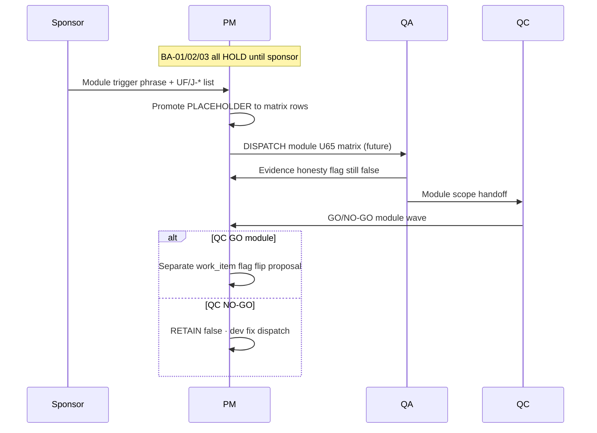

# PO-HRM-DYNAMIC-CONFIG-PLATFORM-FE-ADMIN-REOPEN-GATE-BA-03 — Module honesty reopen-gate inventory ADD (post HONESTY-PACK-SYNTH)

| Field | Value |
|-------|-------|
| **work_item_id** | `PO-HRM-DYNAMIC-CONFIG-PLATFORM-FE-ADMIN-REOPEN-GATE-BA-03` |
| **Parent / cite chain** | [`FE-ADMIN-REOPEN-GATE-BA-01`](./PO-HRM-DYNAMIC-CONFIG-PLATFORM-FE-ADMIN-REOPEN-GATE-BA-01.md) SPEC **20612** · [`FE-ADMIN-REOPEN-GATE-BA-02`](./PO-HRM-DYNAMIC-CONFIG-PLATFORM-FE-ADMIN-REOPEN-GATE-BA-02.md) SPEC **20278** · **RETAIN** all prior inventory rows **unchanged** |
| **Synth source** | [`HONESTY-PACK-SYNTH-SA-01`](./PO-HRM-DYNAMIC-CONFIG-PLATFORM-HONESTY-PACK-SYNTH-SA-01.md) §4 master inventory · §7.2 sponsor module unlock map · SPEC **25083** · Option **A** **LOCKED** |
| **Program** | `PO-HRM-CONTINUOUS-W8-20260807` · U88 after **HONESTY-PACK-SYNTH-SA-01** SEALED |
| **Lane** | governance · ba-process |
| **change_mode** | **ADD-only** module honesty UF placeholders + reopen gates — **no** Nest SoT redefine · **no** execution unlock · **no** flip any `*_ready` |
| **ack_status** | **PASS_TO_PM** |
| **U65** | Module UF waves (when sponsor opens) = **login → menu SRS → click → Lưu/Gửi → F5** + J-* — **this doc does not unlock** |
| **Honesty (RETAIN all false)** | `hrm_personnel_uat_ready=false` · `attendance_uat_ready=false` / `hrm_attendance_uat_ready=false` · `recruitment_uat_ready=false` · `payroll_e2e_ready=false` · `contracts_printable_ready=false` · **`C-SLICE-≠-MODULE`** |

---

## 0. Supersession and ADD-only contract

### 0.1 What this file does

Tài liệu **BA-03** **bổ sung** lớp **module honesty gate** vào chuỗi reopen-gate đã có:

| Prior seat | Rows | Class |
|------------|------|-------|
| **BA-01** | #1–#13 | FE-ADMIN / FE residual synth pack (HOLD) |
| **BA-02** | #14–#16 | LIVE twin leave-type · printable honesty cite · LVRULE engine cite |
| **BA-03** | **#17–#21** | **Module UAT honesty** (five program flags **false**) |

**Cấm REPLACE:** Không sửa file BA-01/BA-02. Không xóa hàng. Không đổi nghĩa class BA-01 §3 taxonomy trừ khi bổ sung **module gate** class mới §3.1.

### 0.2 Relationship to HONESTY-PACK-SYNTH-SA-01

SA synth **đã** governance CLOSED cho năm cờ module. BA-03 **dịch** §7.2 trigger phrases + §4 `residual_id` thành **UF placeholders** và **AC reopen** cho PM/QA trace — **song song** FE-ADMIN inventory, **không** thay child honesty SA specs.

### 0.3 rows_added summary

| Metric | Value |
|--------|-------|
| **New inventory rows (BA-03)** | **5** (#17–#21) |
| **Cross-cite RETAIN (already BA-02)** | `R-PLT-ATT-LEAVE-FE-ADMIN-01` (#14) · `R-PLT-CTR-PRINTABLE-01` (#15 module slice) · `R-PLT-ATT-LVRULE-ENGINE-01` (#16) |
| **Execution unlock from BA-03** | **NONE** (HOLD all) |

**Note on row #15 vs #21:** BA-02 row #15 đã mint **`R-PLT-CTR-PRINTABLE-01`** trong class **honesty/module gate** (printable wave). BA-03 row **#21** **re-indexes** cùng `residual_id` trong **module honesty master** với UF bundle đầy đủ theo synth §7.2 — PM trace **một** residual_id, **hai** cite paths (BA-02 FE-admin context · BA-03 module pack context). **Không** duplicate flip logic.

---

## 1. Mục tiêu và phạm vi

### 1.1 Mục tiêu

1. Gắn **UF-ID placeholders** và **sponsor trigger phrases** (§7.2 synth) cho năm **`residual_id`** module honesty.
2. Định nghĩa **AC reopen** (pre-unlock documentation + post-gate measurable) — **FAIL closed** nếu thiếu sponsor message + UF/J-* list.
3. Phân tách **C-SLICE LIVE** claims vs **module UAT** claims (BR table §6).
4. Handback PM: seal inventory · **DENY** dispatch dev-fe/be/qc module GO từ doc alone.

### 1.2 RETAIN (bắt buộc)

- **BA-01** §4 rows 1–13 — frozen ([`FE-ADMIN-REOPEN-GATE-BA-01`](./PO-HRM-DYNAMIC-CONFIG-PLATFORM-FE-ADMIN-REOPEN-GATE-BA-01.md)).
- **BA-02** §4.2 rows 14–16 — frozen ([`FE-ADMIN-REOPEN-GATE-BA-02`](./PO-HRM-DYNAMIC-CONFIG-PLATFORM-FE-ADMIN-REOPEN-GATE-BA-02.md)).
- **FE-ADMIN-PACK-SYNTH-SA-01** Option A · 13 synth rows.
- **Five program honesty flags** — **all false** until sponsor module wave + QC **module** scope (separate work_item for flag flip proposal).
- Child specs: EMP-UAT-HOLD · ATT-UAT-HOLD · REC-UAT-HOLD · PAY-E2E-HOLD · CTR-PRINTABLE-HOLD — **Option A ACCEPT_AS_IS_P2 HOLD**.

### 1.3 Out of scope (DENY)

- Flip **`hrm_personnel_uat_ready`** · **`attendance_uat_ready`** · **`recruitment_uat_ready`** · **`payroll_e2e_ready`** · **`contracts_printable_ready`** from inventory publication.
- Claim **module UAT** · **Phase1 DONE** · **UAT-READY** / **PROD-READY** from C-SLICE GWC alone.
- Nest SoT redefine · invent catalog KEY · dual admin writer · **`apps/**`** · seed (U65).
- Reopen sealed L1/CNS/consumer FE CLOSED as unlock pretext.
- Bundle multi-flag promote on one bus line (e.g. personnel + recruitment together).
- Unlock **`R-PLT-ATT-LVRULE-ENGINE-01`** as **`attendance_uat_ready`** unlock (cite BA-02 #16 only).
- Unlock **`R-PLT-ATT-LEAVE-FE-ADMIN-01`** as module ATT UAT (cite BA-02 #14 only).

### 1.4 Actors

| Actor | Vai trò |
|-------|---------|
| **Sponsor** | Trigger phrase §4.3 **trong cùng message** + named UF/J-* khi mở module wave |
| **PM** | Promote PLACEHOLDER → matrix UF · dispatch qa/qc **module** scope · **không** từ BA-03 alone |
| **ba-process** | Inventory ADD only — **HOLD** Nest AC redefine |
| **QA** | U65 full matrix · J-* L2.5 · honesty false in evidence until QC closes module gate |
| **QC** | NO-GO nếu SERVICE_READINESS promote từ HOLD inventory |

---

## 2. Class taxonomy — module honesty layer

### 2.1 Three layers (RETAIN synth §1.2)

| Class | Meaning | BA doc home |
|-------|---------|-------------|
| **Module honesty gate** | Program flag **false** until sponsor **module UF wave** + QC GO **module** scope | **BA-03** §4.3 rows #17–#21 |
| **C-SLICE LIVE** | L1/CNS/browser GWC under U65 · flag **still false** | Child honesty SA §1.2 LIVE tables |
| **Orthogonal HOLD** | Engine · FE-ADMIN LIVE twin · FE-ADMIN pack | BA-01/02 · synth FE-ADMIN |

### 2.2 Module gate vs FE-ADMIN polish

| Question | Module gate (BA-03) | FE-ADMIN (BA-01/02) |
|----------|---------------------|---------------------|
| Flips `*_ready`? | **Only** after module QC wave | **Never** from polish alone |
| Typical dispatch | `qa` full UF matrix + `qc` module | `dev-fe` narrow polish |
| Example mistake | EMP catalog L1 PASS ⇒ personnel UAT | SI panel polish ⇒ ATT module UAT |

---

## 3. Master inventory rollup (prior + ADD)

### 3.1 RETAIN — BA-01 rows #1–#13

**Source:** [`FE-ADMIN-REOPEN-GATE-BA-01`](./PO-HRM-DYNAMIC-CONFIG-PLATFORM-FE-ADMIN-REOPEN-GATE-BA-01.md) §4 — status **HOLD** all.

### 3.2 RETAIN — BA-02 rows #14–#16 (cross-cite — not redefined)

| # | residual_id | RETAIN cite |
|---|-------------|-------------|
| 14 | `R-PLT-ATT-LEAVE-FE-ADMIN-01` | BA-02 §4.2 · SA SPEC **25795** · **≠** module ATT UAT |
| 15 | `R-PLT-CTR-PRINTABLE-01` | BA-02 §4.2 · SA SPEC **23993** · printable **wave** placeholder |
| 16 | `R-PLT-ATT-LVRULE-ENGINE-01` | BA-02 §4.2 · SA SPEC **22246** · **≠** `attendance_uat_ready` unlock |

### 3.3 ADD — Module honesty inventory (this work_item)

**Source of truth for trigger phrases:** [`HONESTY-PACK-SYNTH-SA-01`](./PO-HRM-DYNAMIC-CONFIG-PLATFORM-HONESTY-PACK-SYNTH-SA-01.md) §7.2.

| # | residual_id | program flag (RETAIN false) | class | UF-ID placeholders (pre-unlock) | J-* / matrix anchors (when promoted) | Sponsor must say (reopen gate) | Allowed after gate (future — not default) | status | Child SA cite · SPEC_LEN |
|---|-------------|----------------------------|-------|--------------------------------|----------------------------------------|--------------------------------|-------------------------------------------|--------|---------------------------|
| 17 | **`R-PLT-EMP-UAT-01`** | `hrm_personnel_uat_ready=false` | **Module honesty gate** | `UF-HRM-EMP-MODULE-UAT-WAVE-PLACEHOLDER` · slices **RETAIN**: UF-HRM-01..03* family · EMPL plat L1 stamps | **J-HRM-03*** · `PROGRAM_JOURNEY_MAP` personnel spine · persona `ceo@xe.vn` + member CEO matrix | «**mở module UAT Nhân sự**» + **named UF-IDs** trong **cùng** message · **DENY** silent flip | **Future:** qa U65 personnel module matrix (list→detail NV · ST/POS/DEPT/CF consumer · cross-nav) · qc GO **module** scope · **separate** PM work_item đề xuất `hrm_personnel_uat_ready=true` | **HOLD** | [`EMP-UAT-HOLD-SA-01`](./PO-HRM-DYNAMIC-CONFIG-PLATFORM-EMP-UAT-HOLD-SA-01.md) · **43380** |
| 18 | **`R-PLT-ATT-UAT-01`** | `attendance_uat_ready=false` | **Module honesty gate** | `UF-HRM-ATT-MODULE-UAT-WAVE-PLACEHOLDER` · catalog L1 chain **RETAIN** as C-SLICE only | **J-HRM-06*** · ATT matrix · WAIVE_L2 policy **explicit** if sponsor names | «**mở module UAT Chấm công**» + UF/J-* list · **not** LVRULE engine alone · **not** leave FE-ADMIN polish alone | **Future:** qa full ATT module UF + J-06* L2.5 · qc module GO · flag flip **separate** work_item | **HOLD** | [`ATT-UAT-HOLD-SA-01`](./PO-HRM-DYNAMIC-CONFIG-PLATFORM-ATT-UAT-HOLD-SA-01.md) · **32664** |
| 19 | **`R-PLT-REC-UAT-01`** | `recruitment_uat_ready=false` | **Module honesty gate** | `UF-HRM-REC-MODULE-UAT-WAVE-PLACEHOLDER` · stage L1 + CNS **RETAIN** C-SLICE | **J-HRM-05*** · UV/compare depth UF when sponsor lists | «**mở module UAT Tuyển dụng**» + named UF/J-* · **not** stage L1 slice alone | **Future:** qa REC module browser matrix · Kanban/compare depth · qc module GO | **HOLD** | [`REC-UAT-HOLD-SA-01`](./PO-HRM-DYNAMIC-CONFIG-PLATFORM-REC-UAT-HOLD-SA-01.md) · **35658** |
| 20 | **`R-PLT-PAY-E2E-01`** | `payroll_e2e_ready=false` | **Module honesty gate** | `UF-HRM-PAY-E2E-MODULE-WAVE-PLACEHOLDER` · PAYCNSQA · wire · J07 spot **RETAIN** C-SLICE | **J-HRM-07*** · formula LIVE policy **explicit** in sponsor message | «**mở payroll e2e UAT**» + J-HRM-07* / named UF · **not** CNS slice alone | **Future:** qa payroll e2e journey U65 · qc GO · **orthogonal** to printable (#21) — **DENY** bundle flip | **HOLD** | [`PAY-E2E-HOLD-SA-01`](./PO-HRM-DYNAMIC-CONFIG-PLATFORM-PAY-E2E-HOLD-SA-01.md) · **28002** |
| 21 | **`R-PLT-CTR-PRINTABLE-01`** | `contracts_printable_ready=false` | **Module honesty gate** | `UF-HRM-CTR-PRINTABLE-MODULE-WAVE-PLACEHOLDER` · Q-CTR-* UF family · print-spine GWC **RETAIN** | **J-HRM-CTR-*** · Q-CTR-02 PDF slice **≠** module GO alone | «**mở printable UAT hợp đồng**» + Q-CTR-* / J-HRM-CTR-* + persona matrix · **same** semantic as BA-02 #15 | **Future:** qa printable module matrix · qc GO · flag flip separate · **DENY** bundle with payroll (#20) | **HOLD** | [`CTR-PRINTABLE-HOLD-SA-01`](./PO-HRM-DYNAMIC-CONFIG-PLATFORM-CTR-PRINTABLE-HOLD-SA-01.md) · **23993** |

**Cross-flag rule (synth §4):** Mỗi flag unlock **chỉ** qua **single-flag** sponsor wave + QC scope — **FORBIDDEN** one bus line promoting personnel + recruitment + attendance together.

---

## 4. UF placeholders — detail by module

### 4.17 EMP — `UF-HRM-EMP-MODULE-UAT-WAVE-PLACEHOLDER`

**Meaning:** PM thay PLACEHOLDER bằng danh sách UF cụ thể (vd. UF-HRM-01 nhân sự list, UF-HRM-02 hồ sơ, UF-HRM-03 mutate flows) khi sponsor mở module.

**Pre-unlock AC (documentation — PASS khi):**

1. Board honesty JSON / continuous board shows `hrm_personnel_uat_ready=false` — **PASS** if false.
2. No dispatch claims «module Nhân sự UAT ready» from EMPLATQA2 / catalog L1 alone — **PASS** if absent.
3. BA-01 row #1 `R-PLT-EMP-FE-ADMIN-01` **not** used as substitute for module gate — **PASS** if PM discriminates class.

**Post-gate AC (future qa — measurable):**

- Mọi UF in-scope: login `ceo@xe.vn` → menu SRS → mutate where applicable → Network 2xx → FE cập nhật → F5 persist.
- L2.5: list NV → chi tiết NV → back; deep link embed scope **không** 409.
- Evidence file repeats **`hrm_personnel_uat_ready=false`** until **qc** module GO work_item closes.

**Companion flags RETAIN false:** `employees_e2e_linkage_ready=false` per EMP-UAT child spec.

### 4.18 ATT — `UF-HRM-ATT-MODULE-UAT-WAVE-PLACEHOLDER`

**Pre-unlock AC:**

1. `attendance_uat_ready=false` on board — **PASS** if false.
2. Catalog L1 GWC (leave, shift, ws, code, OT, LVRULE KEY) cited only as **C-SLICE** — **DENY** module claim.
3. **`R-PLT-ATT-LVRULE-ENGINE-01`** (BA-02 #16) **not** in ATT module unlock dispatch — **PASS** if separated.
4. **`R-PLT-ATT-LEAVE-FE-ADMIN-01`** (BA-02 #14) polish **not** module ATT UAT — **PASS** if separated.

**Post-gate AC (future):** Full J-HRM-06* matrix · chấm công sheets · leave/OT consumer · WAIVE policy explicit · U65.

**Companion:** `attendance_e2e_linkage_ready=false` · `hrm_attendance_uat_ready=false` alias **RETAIN**.

### 4.19 REC — `UF-HRM-REC-MODULE-UAT-WAVE-PLACEHOLDER`

**Pre-unlock AC:**

1. `recruitment_uat_ready=false` — **PASS** if false.
2. RECPLATQA2 / RECCNSQA / stage L1 **≠** module REC UAT — document in evidence.
3. **`jd_dynamic_done=false`** companion RETAIN.

**Post-gate AC (future):** J-HRM-05* · UV pipeline · compare · Kanban depth beyond stage L1 alone.

### 4.20 PAY — `UF-HRM-PAY-E2E-MODULE-WAVE-PLACEHOLDER`

**Pre-unlock AC:**

1. `payroll_e2e_ready=false` — **PASS** if false.
2. PAYCNSQA / salary component wire **≠** payroll e2e GO.
3. Formula LIVE policy **explicit** in sponsor message before any «e2e» dispatch — else **FAIL closed**.

**Post-gate AC (future):** J-HRM-07* end-to-end lương journey · period close rules per AMIS parity HOLD docs.

**W7.5 DENY bundled flip with #21 printable.**

### 4.21 CTR — `UF-HRM-CTR-PRINTABLE-MODULE-WAVE-PLACEHOLDER`

**Pre-unlock AC:**

1. `contracts_printable_ready=false` — **PASS** if false.
2. Q-CTR-02 PDF PASS / print-spine GWC **≠** module printable UAT (BR-REOPEN-MH-03).
3. BA-02 #15 CL/TPL FE HOLD **not** printable module unlock — **PASS** if PM uses **this** row for module gate only.

**Post-gate AC (future):** Multi-UF printable journey PREV/VER/issue/PDF · persona matrix · qc module scope.

---

## 5. Acceptance criteria — reopen gate (module honesty)

### 5.1 Global AC-REOPEN-MH-00 (inventory publication)

| ID | Criterion | Pass | Fail |
|----|-----------|------|------|
| AC-REOPEN-MH-00a | BA-03 published ADD-only | BA-01/02 files untouched | Any REPLACE wipe BA-01/02 |
| AC-REOPEN-MH-00b | Five rows #17–#21 present | Table §3.3 complete | Missing residual |
| AC-REOPEN-MH-00c | All five flags documented **false** | §1.2 RETAIN | Any `*_ready=true` in doc |
| AC-REOPEN-MH-00d | No execution unlock language | HOLD all rows | «DISPATCH dev-fe now» |

### 5.2 Per-row pre-unlock AC (sponsor gate)

| ID | Criterion | Pass | Fail |
|----|-----------|------|------|
| AC-REOPEN-MH-01 | Sponsor message contains §3.3 trigger phrase **semantic match** | Exact or equivalent Vietnamese | PM dispatch module qa without sponsor |
| AC-REOPEN-MH-02 | Named UF-IDs and/or J-* listed same cycle | Bus DISPATCHED cites list | Placeholder only forever |
| AC-REOPEN-MH-03 | Single module per wave | One flag domain per dispatch | Bundle multi-flag |
| AC-REOPEN-MH-04 | QC scope = **module** not slice | qc charter names module matrix | qc GO from L1 only |
| AC-REOPEN-MH-05 | Flag flip proposal | Separate work_item after qc GO | Flip in same ba-process doc |

### 5.3 Allowed narrow claims while flags false (C-SLICE)

Synth §4.1 — QA/QC **may** state (examples):

- «EMP platform L1 / browser slice GWC»
- «ATT catalog L1 chain GWC»
- «REC stage L1 + CNS slice GWC»
- «PAY CNS + wire slice GWC»
- «CTR print-spine + PDF binary slice GWC»

**FORBIDDEN claims:** «Module EMP/ATT/REC/PAY/CTR **UAT ready**» · «Phase 1 DONE from platform wave».

---

## 6. Business rule matrix (module honesty ADD)

| BR-ID | Condition | Action | Outcome |
|-------|-----------|--------|---------|
| BR-REOPEN-MH-01 | BA-03 published | RETAIN BA-01 #1–13 + BA-02 #14–16 | Prior gates unchanged |
| BR-REOPEN-MH-02 | PM sees catalog L1 PASS | Cite C-SLICE only | **DENY** module flag flip |
| BR-REOPEN-MH-03 | PDF/spine slice PASS | Cite **`R-PLT-CTR-PRINTABLE-01`** HOLD | **DENY** `contracts_printable_ready=true` |
| BR-REOPEN-MH-04 | Sponsor opens ATT module | Check engine (#16) + leave FE (#14) **orthogonal** | Module dispatch excludes engine-only |
| BR-REOPEN-MH-05 | Sponsor opens printable | **DENY** bundle payroll (#20) | W7.5 spirit |
| BR-REOPEN-MH-06 | Sponsor opens payroll e2e | Formula LIVE explicit | Else FAIL closed |
| BR-REOPEN-MH-07 | QC SERVICE_READINESS update | Requires module qc GO + sponsor wave | **NO-GO** from HOLD inventory |
| BR-REOPEN-MH-08 | ba-process Nest redefine in BA-03 | Reject handoff | **INVALID** — cite child SA only |
| BR-REOPEN-MH-09 | HONESTY-PACK synth SEALED | Index §3.3 only | **DENY** re-litigate Option A |

**RETAIN BA-01 BR-REOPEN-01..08** · **BA-02 BR-REOPEN-ADD-01..08** for FE-ADMIN rows.

---

## 7. Sequence — module honesty reopen (documentation)



---

## 8. Handoff package

| To | Expectation | Done when |
|----|-------------|-----------|
| **PM** | Seal BA-03 · append W8 board trace rows #17–#21 · RETAIN honesty false | SPEC_LEN ≥8192 · PASS_TO_PM |
| **SA** | No action — synth SEALED | RETAIN HONESTY-PACK |
| **ba-data** | HOLD until module UF waves sponsor opens | — |
| **dev-fe / dev-be** | **No dispatch** from BA-03 | Sponsor + PM |
| **QA** | Use §4 UF placeholders when unlocked · U65 · J-* | `docs/qa/evidence/` |
| **QC** | Audit five flags false · C-SLICE vs module language | GWC unchanged |

---

## 9. Traceability

| Artifact | Role |
|----------|------|
| `HONESTY-PACK-SYNTH-SA-01` | §4 §7.2 authoritative module inventory |
| `FE-ADMIN-REOPEN-GATE-BA-01` | SPEC **20612** · rows 1–13 |
| `FE-ADMIN-REOPEN-GATE-BA-02` | SPEC **20278** · rows 14–16 |
| `PO_HRM_CONTINUOUS_W8_20260807.md` | Board honesty LOCKED |
| `PROGRAM_JOURNEY_MAP.md` | J-HRM-* promotion when unlock |
| `SERVICE_READINESS_UAT_PRODUCTION.md` | Must not promote from HOLD alone |
| `PILOT_BUSINESS_FLOW_BA_TRACE.md` | Optional J-* row append when sponsor opens |

---

## 10. DENY list (consolidated — BA-03 seat)

- Flip any of five **`_*_ready`** flags from this inventory publication.
- Claim module UAT · Phase1 DONE · UAT-READY / PROD-READY without module qc GO.
- Dispatch **`dev-fe`/`dev-be`/`qa` module GO** from BA-03 alone (no sponsor trigger).
- REPLACE wipe BA-01/BA-02 content or renumber prior rows.
- Reopen L1/CNS/consumer CLOSED stamps as FAIL pretext.
- Use **`R-PLT-ATT-LVRULE-ENGINE-01`** or **`R-PLT-ATT-LEAVE-FE-ADMIN-01`** as **`attendance_uat_ready`** unlock.
- Bundle printable (#21) + payroll e2e (#20) flag closure.
- Seed (U65) to complete module matrix.
- Nest SoT redefine · invent KEY · **`apps/**`**.

---

## 11. Open risks

| Risk | Mitigation |
|------|------------|
| Slice GWC ⇒ module UAT narrative | §5.3 allowed vs forbidden claims |
| Duplicate CTR printable rows BA-02 #15 vs BA-03 #21 | §0.3 same residual_id · dual context |
| ATT module conflates engine/leave FE | §4.18 pre-unlock AC #3–4 |
| PM idle-ok misread as product broken | C-SLICE doctrine §2.1 |

**Clarifications needed from sponsor:** None for BA-03 inventory ADD completion.

---

## 12. Expanded reference — synth §4 mirror (audit)

| Vertical | residual_id | SPEC_LEN child | Flag |
|----------|-------------|----------------|------|
| EMP | `R-PLT-EMP-UAT-01` | 43380 | `hrm_personnel_uat_ready=false` |
| ATT | `R-PLT-ATT-UAT-01` | 32664 | `attendance_uat_ready=false` |
| REC | `R-PLT-REC-UAT-01` | 35658 | `recruitment_uat_ready=false` |
| PAY | `R-PLT-PAY-E2E-01` | 28002 | `payroll_e2e_ready=false` |
| CTR | `R-PLT-CTR-PRINTABLE-01` | 23993 | `contracts_printable_ready=false` |

Closing **honesty governance** (HONESTY-PACK synth) **does not** promote any flag to **true**. BA-03 **extends** reopen-gate traceability only.

---

## 13. PM quick scan — ADD rows only

| # | residual_id | Flag RETAIN false | Sponsor trigger (short) | UF placeholder |
|---|-------------|-------------------|-------------------------|----------------|
| 17 | `R-PLT-EMP-UAT-01` | personnel | mở module UAT Nhân sự | UF-HRM-EMP-MODULE-UAT-WAVE-PLACEHOLDER |
| 18 | `R-PLT-ATT-UAT-01` | attendance | mở module UAT Chấm công | UF-HRM-ATT-MODULE-UAT-WAVE-PLACEHOLDER |
| 19 | `R-PLT-REC-UAT-01` | recruitment | mở module UAT Tuyển dụng | UF-HRM-REC-MODULE-UAT-WAVE-PLACEHOLDER |
| 20 | `R-PLT-PAY-E2E-01` | payroll e2e | mở payroll e2e UAT | UF-HRM-PAY-E2E-MODULE-WAVE-PLACEHOLDER |
| 21 | `R-PLT-CTR-PRINTABLE-01` | printable | mở printable UAT hợp đồng | UF-HRM-CTR-PRINTABLE-MODULE-WAVE-PLACEHOLDER |

**Related orthogonal (BA-02 — cite only):** `R-PLT-ATT-LEAVE-FE-ADMIN-01` · `R-PLT-ATT-LVRULE-ENGINE-01` · `R-PLT-CTR-PRINTABLE-01` (FE-admin wave wording in BA-02 #15).

---

## 14. Completion contract (handback)

```yaml
work_item_id: PO-HRM-DYNAMIC-CONFIG-PLATFORM-FE-ADMIN-REOPEN-GATE-BA-03
ack_status: PASS_TO_PM
evidence_path: docs/program/specs/PO-HRM-DYNAMIC-CONFIG-PLATFORM-FE-ADMIN-REOPEN-GATE-BA-03.md
rows_added: 5
RETAIN:
  - FE-ADMIN-REOPEN-GATE-BA-01 SPEC 20612 rows 1-13
  - FE-ADMIN-REOPEN-GATE-BA-02 SPEC 20278 rows 14-16
  - HONESTY-PACK-SYNTH-SA-01 Option A LOCKED SPEC 25083
  - all FE-ADMIN HOLDs · C-SLICE · five honesty flags false
  - R-PLT-ATT-LVRULE-ENGINE-01 · R-PLT-ATT-LEAVE-FE-ADMIN-01 via BA-02 cite
completion_report: |
  ADD-only module honesty reopen-gate inventory after HONESTY-PACK-SYNTH-SA-01 SEALED:
  five new rows #17-21 (R-PLT-EMP-UAT-01 · R-PLT-ATT-UAT-01 · R-PLT-REC-UAT-01 ·
  R-PLT-PAY-E2E-01 · R-PLT-CTR-PRINTABLE-01) with UF placeholders, sponsor §7.2 trigger
  phrases, AC reopen, BR matrix, DENY list. Cross-cited BA-02 rows 14-16 without wipe.
  No Nest redefine · no execution unlock · no flip *_ready · no apps/** edits.
next_owner: pm
next_dispatch_prompt: |
  work_item_id: PO-HRM-DYNAMIC-CONFIG-PLATFORM-FE-ADMIN-REOPEN-GATE-BA-03-PM-SEAL-01
  from_role: pm
  to_role: pm
  lane: governance · U88
  INTAKE: ba-process PASS_TO_PM — FE-ADMIN reopen-gate BA-03 module honesty ADD sealed
  evidence_path: docs/program/specs/PO-HRM-DYNAMIC-CONFIG-PLATFORM-FE-ADMIN-REOPEN-GATE-BA-03.md
  action:
    1) Seal bus row PO-HRM-DYNAMIC-CONFIG-PLATFORM-FE-ADMIN-REOPEN-GATE-BA-03 = PASS_TO_PM;
       append W8 board trace for module honesty rows #17-21 alongside BA-01/02 inventory
    2) RETAIN all five *_ready=false · BA-01 SPEC 20612 · BA-02 SPEC 20278 · HONESTY-PACK synth
    3) Do NOT dispatch dev-fe/dev-be/qa module GO from BA-03; do NOT flip any honesty flag
    4) U88: PM->ALL idle-ok W8 governance OR next program vertical per continuous board
       unless sponsor §7.2 module trigger in same message (then promote UF placeholders only)
  exit: PM->ALL seal + TEAM_WORKING_NOW one line · optional qc audit honesty flags still false
  ack_status: PASS_TO_PM
must_keep: BA-01 13 rows · BA-02 3 ADD rows · honesty pack synth · C-SLICE · U65 · no bundled flag flip
```

---

*End of BA-03 — ADD-only module honesty reopen-gate · RETAIN BA-01/02 · five rows #17–#21 · PASS_TO_PM · no execution unlock*
