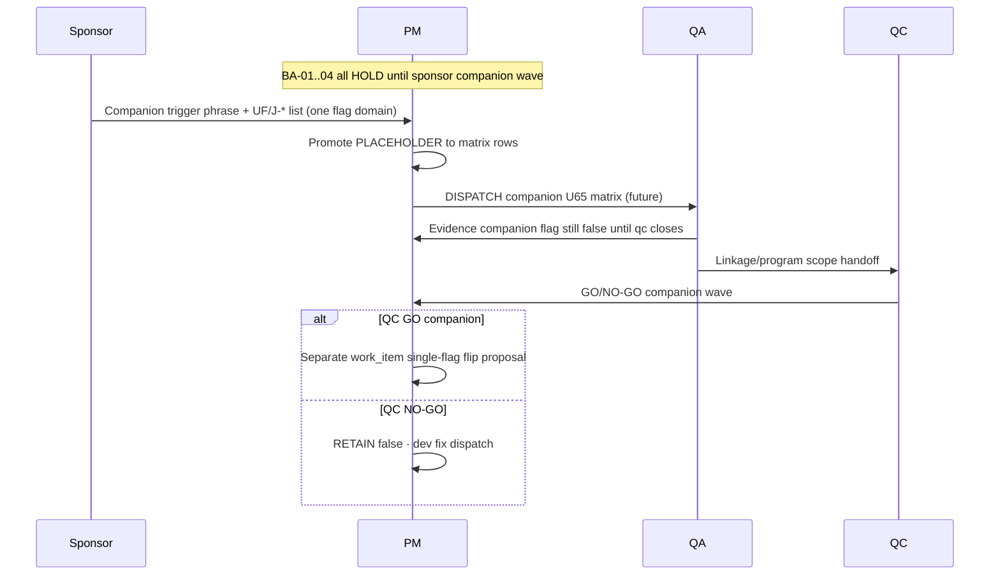

# PO-HRM-DYNAMIC-CONFIG-PLATFORM-FE-ADMIN-REOPEN-GATE-BA-04 — Companion honesty reopen-gate inventory ADD (post COMPANION-PACK-SYNTH)

| Field | Value |
|-------|-------|
| **work_item_id** | `PO-HRM-DYNAMIC-CONFIG-PLATFORM-FE-ADMIN-REOPEN-GATE-BA-04` |
| **Parent / cite chain** | [`FE-ADMIN-REOPEN-GATE-BA-01`](./PO-HRM-DYNAMIC-CONFIG-PLATFORM-FE-ADMIN-REOPEN-GATE-BA-01.md) SPEC **20612** · [`FE-ADMIN-REOPEN-GATE-BA-02`](./PO-HRM-DYNAMIC-CONFIG-PLATFORM-FE-ADMIN-REOPEN-GATE-BA-02.md) SPEC **20278** · [`FE-ADMIN-REOPEN-GATE-BA-03`](./PO-HRM-DYNAMIC-CONFIG-PLATFORM-FE-ADMIN-REOPEN-GATE-BA-03.md) SPEC **23971** · **RETAIN** all prior inventory rows **unchanged** |
| **Synth source** | [`HONESTY-COMPANION-PACK-SYNTH-SA-02`](./PO-HRM-DYNAMIC-CONFIG-PLATFORM-HONESTY-COMPANION-PACK-SYNTH-SA-02.md) §4 master inventory · §7.2 sponsor companion unlock map · Option **A** **LOCKED** |
| **Module pack cite** | [`HONESTY-PACK-SYNTH-SA-01`](./PO-HRM-DYNAMIC-CONFIG-PLATFORM-HONESTY-PACK-SYNTH-SA-01.md) SPEC **25083** — five module flags **RETAIN false** · **orthogonal** to companion rows |
| **Program** | `PO-HRM-CONTINUOUS-W8-20260807` · U88 after **HONESTY-COMPANION-PACK-SYNTH-SA-02** SEALED (Option A · SPEC **30246**) |
| **Lane** | governance · ba-process |
| **change_mode** | **ADD-only** companion honesty UF placeholders + reopen gates — **no** Nest SoT redefine · **no** execution unlock · **no** flip any `*_ready` |
| **ack_status** | **PASS_TO_PM** |
| **U65** | Companion UF waves (when sponsor opens) = **login → menu SRS → click → Lưu/Gửi → F5** + J-* — **this doc does not unlock** |
| **Honesty (RETAIN all false)** | `jd_dynamic_done=false` · `employees_e2e_linkage_ready=false` · `attendance_e2e_linkage_ready=false` · **plus module pack:** `hrm_personnel_uat_ready=false` · `attendance_uat_ready=false` · `recruitment_uat_ready=false` · `payroll_e2e_ready=false` · `contracts_printable_ready=false` · **`C-SLICE-≠-MODULE`** |

---

## 0. Supersession and ADD-only contract

### 0.1 What this file does

Tài liệu **BA-04** **bổ sung** lớp **companion honesty gate** vào chuỗi reopen-gate đã có — **không** thay thế BA-03 module rows:

| Prior seat | Rows | Class |
|------------|------|-------|
| **BA-01** | #1–#13 | FE-ADMIN / FE residual synth pack (HOLD) |
| **BA-02** | #14–#16 | LIVE twin leave-type · printable cite · LVRULE engine cite |
| **BA-03** | #17–#21 | **Module UAT honesty** (five program flags **false**) |
| **BA-04** | **#22–#24** | **Companion program / e2e honesty** (three program flags **false**) |

**Cấm REPLACE:** Không sửa file BA-01/BA-02/BA-03. Không xóa hàng. Không đổi nghĩa class BA-01 §3 taxonomy trừ bổ sung **companion gate** §2.1.

### 0.2 Relationship to HONESTY-COMPANION-PACK-SYNTH-SA-02

SA companion synth **đã** governance CLOSED cho ba cờ companion (§4). BA-04 **dịch** §7.2 trigger phrases + §4 `residual_id` thành **UF placeholders** và **AC reopen** cho PM/QA trace — **song song** FE-ADMIN + module BA-03 inventory, **không** thay child companion SA specs (JD-DYNAMIC-DONE · EMP-E2E-LINKAGE · ATT-E2E-LINKAGE).

### 0.3 rows_added summary

| Metric | Value |
|--------|-------|
| **New inventory rows (BA-04)** | **3** (#22–#24) |
| **Cross-cite RETAIN (BA-03 module)** | Rows #17–#21 unchanged · **distinct** sponsor waves from companion |
| **Cross-cite RETAIN (companion synth)** | §4 SPEC_LEN **30779 / 39538 / 39532** child specs |
| **Execution unlock from BA-04** | **NONE** (HOLD all) |

### 0.4 Companion vs module (do not collapse)

| Flag pair | Same vertical? | Same wave? | Rule |
|-----------|----------------|------------|------|
| `recruitment_uat_ready` vs `jd_dynamic_done` | REC peer | **NO** | Module UAT ≠ JD program closure |
| `hrm_personnel_uat_ready` vs `employees_e2e_linkage_ready` | EMP | **NO** | Module UAT ≠ employee e2e spine |
| `attendance_uat_ready` vs `attendance_e2e_linkage_ready` | ATT | **NO** | Module UAT ≠ attendance e2e spine |

**FORBIDDEN:** one bus promote bundling module flag + companion flag (W7.5 + companion synth §4 cross-flag rule).

---

## 1. Mục tiêu và phạm vi

### 1.1 Mục tiêu

1. Gắn **UF-ID placeholders** và **sponsor trigger phrases** (companion synth §7.2) cho ba **`residual_id`** companion honesty.
2. Định nghĩa **AC-REOPEN-CH** (companion honesty) — **FAIL closed** nếu thiếu sponsor message + UF/J-* list.
3. Phân tách **C-SLICE LIVE** claims vs **companion e2e / program closure** claims (BR table §6).
4. Handback PM: seal inventory · **DENY** dispatch dev-fe/be/qc companion GO từ doc alone.

### 1.2 RETAIN (bắt buộc)

- **BA-01** §4 rows 1–13 — frozen ([`FE-ADMIN-REOPEN-GATE-BA-01`](./PO-HRM-DYNAMIC-CONFIG-PLATFORM-FE-ADMIN-REOPEN-GATE-BA-01.md)).
- **BA-02** §4.2 rows 14–16 — frozen ([`FE-ADMIN-REOPEN-GATE-BA-02`](./PO-HRM-DYNAMIC-CONFIG-PLATFORM-FE-ADMIN-REOPEN-GATE-BA-02.md)).
- **BA-03** §3.3 rows 17–21 — frozen ([`FE-ADMIN-REOPEN-GATE-BA-03`](./PO-HRM-DYNAMIC-CONFIG-PLATFORM-FE-ADMIN-REOPEN-GATE-BA-03.md)).
- **HONESTY-PACK-SYNTH-SA-01** five module flags — **all false** · Option A LOCKED · SPEC **25083**.
- **HONESTY-COMPANION-PACK-SYNTH-SA-02** three companion flags — **all false** · Option A LOCKED · SPEC **30246**.
- **FE-ADMIN-PACK-SYNTH-SA-01** Option A · 13 synth rows.
- Child companion specs: JD-DYNAMIC-DONE-HOLD · EMP-E2E-LINKAGE-HOLD · ATT-E2E-LINKAGE-HOLD — **Option A ACCEPT_AS_IS_P2 HOLD**.
- **C-SLICE-≠-MODULE** · U65 · **DENY** invent Nest dual admin.

### 1.3 Out of scope (DENY)

- Flip **`jd_dynamic_done`** · **`employees_e2e_linkage_ready`** · **`attendance_e2e_linkage_ready`** from inventory publication.
- Flip any **module** `*_ready` from BA-04 (module unlock remains BA-03 §7.2 map in HONESTY-PACK-SYNTH).
- Claim **companion e2e spine GO** · **module UAT** · **Phase1 DONE** · **UAT-READY** / **PROD-READY** from C-SLICE GWC alone.
- Nest SoT redefine · invent catalog KEY · dual admin writer · **`apps/**`** · seed (U65).
- Reopen sealed L1/CNS/consumer FE CLOSED as companion unlock pretext.
- Bundle multi-flag promote (companion + companion · companion + module) on one bus line.
- Unlock **`R-PLT-ATT-LVRULE-ENGINE-01`** as **`attendance_e2e_linkage_ready`** unlock (cite BA-02 #16 only).
- Use **J-HRM-06c spot GWC alone** as ATT e2e flip pretext (companion synth §4.1).

### 1.4 Actors

| Actor | Vai trò |
|-------|---------|
| **Sponsor** | Trigger phrase §3.3 **trong cùng message** + named UF/J-* khi mở **companion** wave |
| **PM** | Promote PLACEHOLDER → matrix UF · dispatch qa/qc **companion/linkage** scope · **không** từ BA-04 alone |
| **ba-process** | Inventory ADD only — **HOLD** Nest AC redefine |
| **QA** | U65 full matrix · J-* L2.5 · companion flags **false** in evidence until QC closes companion gate |
| **QC** | NO-GO nếu SERVICE_READINESS promote từ HOLD inventory |

---

## 2. Class taxonomy — companion honesty layer

### 2.1 Four layers (RETAIN companion synth §1.2 + module pack)

| Class | Meaning | BA doc home |
|-------|---------|-------------|
| **Module honesty gate** | Program flag **false** until sponsor **module UF wave** | **BA-03** #17–#21 |
| **Companion honesty gate** | Program flag **false** until sponsor **program/e2e wave** distinct from module UAT | **BA-04** #22–#24 |
| **C-SLICE LIVE** | L1/CNS/browser GWC under U65 · flags **still false** | Child companion SA §1.2 LIVE tables |
| **Orthogonal HOLD** | Engine · FE-ADMIN LIVE twin · FE-ADMIN pack | BA-01/02 · synth FE-ADMIN |

### 2.2 Companion gate vs module gate (EMP / ATT examples)

| Question | Companion (BA-04) | Module (BA-03) |
|----------|-------------------|----------------|
| Primary EMP flag | `employees_e2e_linkage_ready` | `hrm_personnel_uat_ready` |
| Primary ATT flag | `attendance_e2e_linkage_ready` | `attendance_uat_ready` |
| Typical mistake | EMPPLATQA2 L1 ⇒ e2e linkage ready | Same L1 ⇒ personnel module UAT |
| QC scope label | **linkage / e2e spine** | **module UAT** |

### 2.3 JD dynamic vs REC module

| Question | Companion #22 | Module BA-03 #19 |
|----------|---------------|------------------|
| Flag | `jd_dynamic_done` | `recruitment_uat_ready` |
| Wave semantic | JD **program closure** (YCTD · full J-HRM-JD spine) | REC **module UAT** |
| Allowed C-SLICE | JD L3 QC-01 · catalog dynamic LIVE | REC stage L1 + CNS LIVE |
| **DENY** | L3 GWC ⇒ `jd_dynamic_done=true` | Stage L1 ⇒ `recruitment_uat_ready=true` |

---

## 3. Master inventory rollup (prior + ADD)

### 3.1 RETAIN — BA-01 rows #1–#13

**Source:** [`FE-ADMIN-REOPEN-GATE-BA-01`](./PO-HRM-DYNAMIC-CONFIG-PLATFORM-FE-ADMIN-REOPEN-GATE-BA-01.md) §4 — status **HOLD** all.

### 3.2 RETAIN — BA-02 rows #14–#16

**Source:** [`FE-ADMIN-REOPEN-GATE-BA-02`](./PO-HRM-DYNAMIC-CONFIG-PLATFORM-FE-ADMIN-REOPEN-GATE-BA-02.md) §4.2 — **not redefined**.

### 3.3 RETAIN — BA-03 rows #17–#21 (module honesty)

**Source:** [`FE-ADMIN-REOPEN-GATE-BA-03`](./PO-HRM-DYNAMIC-CONFIG-PLATFORM-FE-ADMIN-REOPEN-GATE-BA-03.md) §3.3 — five module flags **false** — **not redefined**.

### 3.4 ADD — Companion honesty inventory (this work_item)

**Source of truth for trigger phrases:** [`HONESTY-COMPANION-PACK-SYNTH-SA-02`](./PO-HRM-DYNAMIC-CONFIG-PLATFORM-HONESTY-COMPANION-PACK-SYNTH-SA-02.md) §7.2.

| # | residual_id | program flag (RETAIN false) | class | UF-ID placeholders (pre-unlock) | J-* / matrix anchors (when promoted) | Sponsor must say (reopen gate) | Allowed after gate (future — not default) | status | Child SA cite · SPEC_LEN |
|---|-------------|----------------------------|-------|--------------------------------|----------------------------------------|--------------------------------|-------------------------------------------|--------|---------------------------|
| 22 | **`R-PLT-JD-DYNAMIC-DONE-01`** | `jd_dynamic_done=false` | **Companion honesty gate** | `UF-HRM-JD-DYNAMIC-DONE-WAVE-PLACEHOLDER` · J-HRM-JD-01..03 family · YCTD attach UF when sponsor lists | **J-HRM-JD-*** · G4 depth · `PROGRAM_JOURNEY_MAP` JD spine · platform catalog dynamic field/pack/template **RETAIN** C-SLICE | «**mở JD dynamic DONE wave**» · YCTD attach · full J-HRM-JD spine — **cùng message** + named UF/J-* · **DENY** silent flip | **Future:** qa U65 JD program matrix · qc GO **program** scope · **separate** PM work_item đề xuất `jd_dynamic_done=true` · **single-flag only** | **HOLD** | [`JD-DYNAMIC-DONE-HOLD-SA-01`](./PO-HRM-DYNAMIC-CONFIG-PLATFORM-JD-DYNAMIC-DONE-HOLD-SA-01.md) · **30779** |
| 23 | **`R-PLT-EMP-E2E-LINK-01`** | `employees_e2e_linkage_ready=false` | **Companion honesty gate** | `UF-HRM-EMP-E2E-LINKAGE-WAVE-PLACEHOLDER` · hire→profile→DEC/PAY/ATT UF bundle when sponsor lists | **J-HRM-03*** depth · UF-HRM-01..12 · persona `ceo@xe.vn` + member CEO · list→detail L2.5 | «**mở employee e2e linkage wave**» + UF-HRM-01..12 + J-HRM-03* depth · **not** catalog L1 alone · **not** J-03 spot alone | **Future:** qa employee e2e spine U65 · cross-nav DEC/PAY/ATT consumers · qc **linkage** scope · flag flip **separate** work_item | **HOLD** | [`EMP-E2E-LINKAGE-HOLD-SA-01`](./PO-HRM-DYNAMIC-CONFIG-PLATFORM-EMP-E2E-LINKAGE-HOLD-SA-01.md) · **39538** |
| 24 | **`R-PLT-ATT-E2E-LINK-01`** | `attendance_e2e_linkage_ready=false` | **Companion honesty gate** | `UF-HRM-ATT-E2E-LINKAGE-WAVE-PLACEHOLDER` · leave→sheet→sign→profile UF when sponsor lists | **J-HRM-06*** full matrix · WAIVE ladder **explicit** · **not** J-06c alone | «**mở attendance e2e linkage wave**» + J-HRM-06* / named UF · **not** ATTLEAVEQA L1 alone · **not** J-06c PAY↔ATT enroll spot alone | **Future:** qa ATT e2e journey U65 · timesheet AGG/nav depth · qc **linkage** scope · **DENY** engine (#16) as substitute | **HOLD** | [`ATT-E2E-LINKAGE-HOLD-SA-01`](./PO-HRM-DYNAMIC-CONFIG-PLATFORM-ATT-E2E-LINKAGE-HOLD-SA-01.md) · **39532** |

**Cross-flag rule (companion synth §4):** Mỗi companion flag unlock **chỉ** qua **single-flag** sponsor wave + QC **linkage/program** scope — **FORBIDDEN** JD + EMP e2e + ATT e2e on one bus line · **FORBIDDEN** companion + module bundled promote.

---

## 4. UF placeholders — detail by companion

### 4.22 JD dynamic program — `UF-HRM-JD-DYNAMIC-DONE-WAVE-PLACEHOLDER`

**Meaning:** PM thay PLACEHOLDER bằng danh sách UF cụ thể (vd. UF-HRM-JD-* mutate flows, YCTD attach, remaster/face gates khi sponsor liệt kê) khi mở **program closure** wave — **distinct** from BA-03 #19 REC module UAT.

**Pre-unlock AC (documentation — PASS khi):**

1. Board honesty JSON shows `jd_dynamic_done=false` — **PASS** if false.
2. No dispatch claims «JD dynamic program DONE» from JD L3 QC-01 GWC or catalog dynamic L1 alone — **PASS** if absent.
3. **`recruitment_uat_ready=false`** module RETAIN (BA-03 #19) — **PASS** if not bundled flip.
4. BA-03 row #19 trigger «mở module UAT Tuyển dụng» **not** used as substitute for row #22 — **PASS** if PM discriminates class.

**Post-gate AC (future qa — measurable):**

- Mọi UF in-scope: login → menu SRS JD spine → mutate where applicable → Network 2xx → FE cập nhật → F5 persist.
- L2.5: J-HRM-JD list→detail · YCTD attach evidence if in scope · deep link embed **không** 409.
- Evidence repeats **`jd_dynamic_done=false`** until **qc** program GO work_item closes companion gate.

**C-SLICE allowed while false:** PO-HRM-JD-DYNAMIC-QC-01 GWC · J-HRM-JD-01..03 + G4 · platform catalog dynamic field/pack/template LIVE (companion synth §4.1).

### 4.23 EMP e2e linkage — `UF-HRM-EMP-E2E-LINKAGE-WAVE-PLACEHOLDER`

**Pre-unlock AC:**

1. `employees_e2e_linkage_ready=false` on board — **PASS** if false.
2. EMPPLATQA* · ST/POS/DEPT FE CLOSED · EMPCFQA · EMPTOK* cited only as **C-SLICE** — **DENY** e2e linkage claim.
3. J-HRM-03 contract drawer narrow PASS documented as **spot** — **≠** e2e spine GO (companion synth §12.2).
4. **`hrm_personnel_uat_ready=false`** module RETAIN (BA-03 #17) — module wave **orthogonal**.

**Post-gate AC (future):** Profile→DEC/PAY/ATT cross-nav · UF-HRM-01..12 depth · persona matrix · U65 · list→detail L2.5 on employee spine.

**FORBIDDEN:** reopen EMPCF / MergeToken EXT sealed stamps as companion unlock pretext.

### 4.24 ATT e2e linkage — `UF-HRM-ATT-E2E-LINKAGE-WAVE-PLACEHOLDER`

**Pre-unlock AC:**

1. `attendance_e2e_linkage_ready=false` — **PASS** if false.
2. ATTLEAVEQA · CODE/OT/COMP FE CLOSED · ATTWSQA2 · LVRULE KEY L1 **≠** ATT e2e spine GO.
3. **J-HRM-06c** PAY↔ATT enroll FULL GWC **spot** **≠** `attendance_e2e_linkage_ready=true` (companion synth §4.1 explicit denial).
4. **`R-PLT-ATT-LVRULE-ENGINE-01`** (BA-02 #16) **not** in ATT e2e unlock dispatch — **PASS** if separated.
5. **`attendance_uat_ready=false`** module RETAIN (BA-03 #18) — module wave **orthogonal**.

**Post-gate AC (future):** Full J-HRM-06* matrix · leave lifecycle depth · timesheet AGG/nav · SITE-UNKNOWN policy if sponsor names · WAIVE ladder explicit · U65.

**OPEN spine (supports false — cite child ATT-E2E spec):** LVRULE **engine** runtime · SITE-UNKNOWN punch · sheet sign depth — sponsor-gated UF wave, not BA-04 publication alone.

---

## 5. Acceptance criteria — reopen gate (companion honesty)

### 5.1 Global AC-REOPEN-CH-00 (inventory publication)

| ID | Criterion | Pass | Fail |
|----|-----------|------|------|
| AC-REOPEN-CH-00a | BA-04 published ADD-only | BA-01/02/03 files untouched | Any REPLACE wipe prior BA |
| AC-REOPEN-CH-00b | Three rows #22–#24 present | Table §3.4 complete | Missing residual |
| AC-REOPEN-CH-00c | All three companion flags documented **false** | §1.2 RETAIN | Any companion `*_ready=true` in doc |
| AC-REOPEN-CH-00d | Module five flags still **false** cited | §1.2 HONESTY-PACK RETAIN | Module flip language |
| AC-REOPEN-CH-00e | No execution unlock language | HOLD all rows | «DISPATCH dev-fe companion GO now» |
| AC-REOPEN-CH-00f | SPEC_LEN gate | File Length ≥8192 verified | Empty or stub turn |

### 5.2 Per-row pre-unlock AC (sponsor gate)

| ID | Criterion | Pass | Fail |
|----|-----------|------|------|
| AC-REOPEN-CH-01 | Sponsor message contains §3.4 trigger phrase **semantic match** | Vietnamese equivalent to §7.2 synth | PM dispatch companion qa without sponsor |
| AC-REOPEN-CH-02 | Named UF-IDs and/or J-* listed same cycle | Bus DISPATCHED cites list | Placeholder only forever |
| AC-REOPEN-CH-03 | Single companion flag domain per wave | One residual_id focus | Bundle JD + EMP e2e + ATT e2e |
| AC-REOPEN-CH-04 | QC scope = **linkage/program** not slice | qc charter names e2e/JD program matrix | qc GO from L1 or J-06c spot alone |
| AC-REOPEN-CH-05 | Flag flip proposal | Separate work_item after qc GO | Flip in same ba-process doc |
| AC-REOPEN-CH-06 | Module flags untouched | No module `*_ready` in same promote | Bundled module + companion flip |

### 5.3 Allowed narrow claims while companion flags false (C-SLICE)

Companion synth §4.1 — QA/QC **may** state (examples):

- «JD dynamic L3 QC-01 GWC on J-HRM-JD-01..03 + G4»
- «Platform catalog dynamic (field/pack/template) LIVE» — **≠** `jd_dynamic_done=true`
- «EMP platform L1 / ST/POS/DEPT / EMPCF / EMPTOK slices GWC»
- «J-HRM-03 contract drawer narrow PASS» — **spot only**
- «ATT leave/ws/code/OT/COMP L1 + partial FE CLOSED»
- «**J-HRM-06c** PAY↔ATT enroll FULL GWC» — **spot only** — **≠** `attendance_e2e_linkage_ready=true`

**FORBIDDEN claims:** «Companion e2e spine GO» · «JD dynamic program DONE» · «Employee/attendance **e2e linkage ready**» · «Phase 1 DONE from platform wave» · «Module UAT ready» (module flags remain BA-03).

---

## 6. Business rule matrix (companion honesty ADD)

| BR-ID | Condition | Action | Outcome |
|-------|-----------|--------|---------|
| BR-REOPEN-CH-01 | BA-04 published | RETAIN BA-01 #1–13 + BA-02 #14–16 + BA-03 #17–21 | Prior gates unchanged |
| BR-REOPEN-CH-02 | PM sees JD L3 QC-01 PASS | Cite C-SLICE only | **DENY** `jd_dynamic_done=true` |
| BR-REOPEN-CH-03 | PM sees EMPPLATQA2 / catalog L1 PASS | Cite C-SLICE only | **DENY** `employees_e2e_linkage_ready=true` |
| BR-REOPEN-CH-04 | PM sees J-HRM-06c FULL GWC | Cite **spot** only | **DENY** `attendance_e2e_linkage_ready=true` |
| BR-REOPEN-CH-05 | Sponsor opens ATT e2e | Exclude engine (#16) + leave FE (#14) as unlock | Module/e2e class separation |
| BR-REOPEN-CH-06 | Sponsor opens JD DONE | **DENY** bundle `recruitment_uat_ready` | REC module orthogonal (BA-03 #19) |
| BR-REOPEN-CH-07 | QC SERVICE_READINESS update | Requires companion qc GO + sponsor wave | **NO-GO** from HOLD inventory |
| BR-REOPEN-CH-08 | ba-process Nest redefine in BA-04 | Reject handoff | **INVALID** — cite child SA only |
| BR-REOPEN-CH-09 | COMPANION-PACK synth SEALED | Index §3.4 only | **DENY** re-litigate Option A |
| BR-REOPEN-CH-10 | HONESTY-PACK module synth | Five flags **false** RETAIN | **DENY** module flip from BA-04 |

**RETAIN BA-01 BR-REOPEN-01..08** · **BA-02 BR-REOPEN-ADD-01..08** · **BA-03 BR-REOPEN-MH-01..09** for prior rows.

---

## 7. Sequence — companion honesty reopen (documentation)



---

## 8. Handoff package

| To | Expectation | Done when |
|----|-------------|-----------|
| **PM** | Seal BA-04 · append W8 board trace rows #22–#24 · RETAIN all honesty false | SPEC_LEN ≥8192 · PASS_TO_PM |
| **SA** | No action — companion synth SEALED | RETAIN COMPANION-PACK-SYNTH |
| **ba-data** | HOLD until companion UF waves sponsor opens | — |
| **dev-fe / dev-be** | **No dispatch** from BA-04 | Sponsor + PM |
| **QA** | Use §4 UF placeholders when unlocked · U65 · J-* L2.5 | `docs/qa/evidence/` |
| **QC** | Audit three companion + five module flags false · C-SLICE vs companion language | GWC unchanged |

---

## 9. Traceability

| Artifact | Role |
|----------|------|
| `HONESTY-COMPANION-PACK-SYNTH-SA-02` | §4 §7.2 authoritative companion inventory · SPEC **30246** |
| `HONESTY-PACK-SYNTH-SA-01` | Five module flags · SPEC **25083** |
| `FE-ADMIN-REOPEN-GATE-BA-01` | SPEC **20612** · rows 1–13 |
| `FE-ADMIN-REOPEN-GATE-BA-02` | SPEC **20278** · rows 14–16 |
| `FE-ADMIN-REOPEN-GATE-BA-03` | SPEC **23971** · rows 17–21 |
| `PO_HRM_CONTINUOUS_W8_20260807.md` | Board honesty LOCKED |
| `PROGRAM_JOURNEY_MAP.md` | J-HRM-JD-* · J-HRM-03* · J-HRM-06* promotion when unlock |
| `SERVICE_READINESS_UAT_PRODUCTION.md` | Must not promote from HOLD alone |
| `PILOT_BUSINESS_FLOW_BA_TRACE.md` | Optional J-* row append when sponsor opens companion wave |

---

## 10. DENY list (consolidated — BA-04 seat)

- Flip **`jd_dynamic_done`** · **`employees_e2e_linkage_ready`** · **`attendance_e2e_linkage_ready`** from this inventory publication.
- Flip any **module** `*_ready` from BA-04 (use BA-03 sponsor map only).
- Claim **companion e2e GO** · **module UAT** · **Phase1 DONE** · **UAT-READY** / **PROD-READY** without companion qc GO + sponsor wave.
- Dispatch **`dev-fe`/`dev-be`/`qa` companion GO** from BA-04 alone (no sponsor trigger).
- REPLACE wipe BA-01/BA-02/BA-03 content or renumber prior rows.
- Reopen sealed L1/CNS/consumer CLOSED stamps as companion unlock pretext.
- Use **`R-PLT-ATT-LVRULE-ENGINE-01`** or **`R-PLT-ATT-LEAVE-FE-ADMIN-01`** as **`attendance_e2e_linkage_ready`** unlock.
- Use **J-HRM-06c spot** or **EMP catalog L1** or **JD L3 QC-01** as sole pretext for companion flag flip.
- Bundle companion multi-flag or companion+module promote on one bus line.
- Seed (U65) to complete companion e2e matrix.
- Nest SoT redefine · invent KEY · invent Nest dual admin · **`apps/**`**.

---

## 11. Open risks

| Risk | Mitigation |
|------|------------|
| J-06c spot ⇒ ATT e2e ready narrative | §5.3 forbidden claims · companion synth §4.1 |
| EMP L1 ⇒ e2e linkage narrative | §4.23 pre-unlock AC #2–3 |
| JD L3 ⇒ jd_dynamic_done narrative | §4.22 pre-unlock AC #2 |
| Collapse companion vs module ATT/EMP | §2.2 table · BA-03 rows RETAIN |
| PM idle-ok misread as spine broken | OPEN spine tables in child SA specs |
| Duplicate inventory with companion synth §4 | BA-04 = UF/reopen trace · synth = governance CLOSED |

**Clarifications needed from sponsor:** None for BA-04 inventory ADD completion.

---

## 12. Expanded reference — companion synth §4 mirror (audit)

| Vertical | residual_id | SPEC_LEN child | Flag RETAIN false |
|----------|-------------|----------------|-------------------|
| REC / JD program | `R-PLT-JD-DYNAMIC-DONE-01` | **30779** | `jd_dynamic_done=false` |
| EMP / e2e linkage | `R-PLT-EMP-E2E-LINK-01` | **39538** | `employees_e2e_linkage_ready=false` |
| ATT / e2e linkage | `R-PLT-ATT-E2E-LINK-01` | **39532** | `attendance_e2e_linkage_ready=false` |

Closing **companion governance** (COMPANION-PACK synth) **does not** promote any flag to **true**. BA-04 **extends** reopen-gate traceability only — parallel to BA-03 module extension after HONESTY-PACK synth.

---

## 13. PM quick scan — ADD rows only (BA-04)

| # | residual_id | Flag RETAIN false | Sponsor trigger (short) | UF placeholder |
|---|-------------|-------------------|-------------------------|----------------|
| 22 | `R-PLT-JD-DYNAMIC-DONE-01` | jd_dynamic_done | mở JD dynamic DONE wave | UF-HRM-JD-DYNAMIC-DONE-WAVE-PLACEHOLDER |
| 23 | `R-PLT-EMP-E2E-LINK-01` | employees e2e linkage | mở employee e2e linkage wave | UF-HRM-EMP-E2E-LINKAGE-WAVE-PLACEHOLDER |
| 24 | `R-PLT-ATT-E2E-LINK-01` | attendance e2e linkage | mở attendance e2e linkage wave | UF-HRM-ATT-E2E-LINKAGE-WAVE-PLACEHOLDER |

**Full reopen-gate rollup row count after BA-04:** **24** rows (#1–#24) across BA-01..04 — **only #22–#24 added this seat**.

**Related module rows (BA-03 — cite only, distinct waves):** #17–#21 · five module `*_ready` flags **false**.

---

## 14. QC audit checklist (post BA-04 publication)

- [ ] All three §3.4 companion flags still **false** on board and latest QC evidence
- [ ] All five module flags from HONESTY-PACK still **false**
- [ ] No matrix row **🟢 e2e spine GO** or **🟢 JD program DONE** promoted from HOLD inventory alone
- [ ] SERVICE_READINESS language uses **C-SLICE** vs **companion** vs **module** discrimination
- [ ] Dispatch queue has **no** dev-fe/be justified only by «J-06c passed» · «EMPPLATQA2 passed» · «JD L3 QC-01 passed»
- [ ] Sponsor companion wave (if any) cites **explicit UF/J-*** before flag flip Task
- [ ] BA-01 SPEC **20612** · BA-02 SPEC **20278** · BA-03 SPEC **23971** files **unchanged** on disk

---

## 15. Completion contract (handback)

```yaml
work_item_id: PO-HRM-DYNAMIC-CONFIG-PLATFORM-FE-ADMIN-REOPEN-GATE-BA-04
ack_status: PASS_TO_PM
evidence_path: docs/program/specs/PO-HRM-DYNAMIC-CONFIG-PLATFORM-FE-ADMIN-REOPEN-GATE-BA-04.md
rows_added: 3
inventory_rows_total_after_seal: 24
RETAIN:
  - FE-ADMIN-REOPEN-GATE-BA-01 SPEC 20612 rows 1-13
  - FE-ADMIN-REOPEN-GATE-BA-02 SPEC 20278 rows 14-16
  - FE-ADMIN-REOPEN-GATE-BA-03 SPEC 23971 rows 17-21
  - HONESTY-PACK-SYNTH-SA-01 Option A LOCKED SPEC 25083 five module flags false
  - HONESTY-COMPANION-PACK-SYNTH-SA-02 Option A LOCKED SPEC 30246 three companion flags false
  - all FE-ADMIN HOLDs · C-SLICE · U65 · no bundled flag flip · DENY invent Nest dual
completion_report: |
  ADD-only companion honesty reopen-gate inventory after HONESTY-COMPANION-PACK-SYNTH-SA-02 SEALED:
  three new rows #22-24 (R-PLT-JD-DYNAMIC-DONE-01 · R-PLT-EMP-E2E-LINK-01 ·
  R-PLT-ATT-E2E-LINK-01) with UF placeholders, sponsor §7.2 trigger phrases from companion synth,
  AC-REOPEN-CH, BR matrix, DENY list. Cross-cited BA-01..03 without wipe. No Nest redefine ·
  no execution unlock · no flip any *_ready · no apps/** edits.
next_owner: pm
next_dispatch_prompt: |
  work_item_id: PO-HRM-DYNAMIC-CONFIG-PLATFORM-FE-ADMIN-REOPEN-GATE-BA-04-PM-SEAL-01
  from_role: pm
  to_role: pm
  lane: governance · U88
  INTAKE: ba-process PASS_TO_PM — FE-ADMIN reopen-gate BA-04 companion honesty ADD sealed
  evidence_path: docs/program/specs/PO-HRM-DYNAMIC-CONFIG-PLATFORM-FE-ADMIN-REOPEN-GATE-BA-04.md
  action:
    1) Seal bus row PO-HRM-DYNAMIC-CONFIG-PLATFORM-FE-ADMIN-REOPEN-GATE-BA-04 = PASS_TO_PM;
       append W8 board trace for companion honesty rows #22-24 alongside BA-01..03 inventory (24 rows total)
    2) RETAIN jd_dynamic_done=false · employees_e2e_linkage_ready=false · attendance_e2e_linkage_ready=false
       · BA-01 SPEC 20612 · BA-02 SPEC 20278 · BA-03 SPEC 23971 · HONESTY-PACK synth · COMPANION-PACK synth SPEC 30246
    3) Do NOT dispatch dev-fe/dev-be/qa companion GO from BA-04; do NOT flip any honesty flag
    4) U88: PM->ALL idle-ok W8 governance OR next program vertical per continuous board
       unless sponsor companion §7.2 trigger in same message (then promote UF placeholders only — single flag domain)
  exit: PM->ALL seal + TEAM_WORKING_NOW one line · optional qc audit all eight honesty flags still false
  ack_status: PASS_TO_PM
must_keep: BA-01 13 rows · BA-02 3 rows · BA-03 5 rows · honesty module pack · companion synth · C-SLICE · U65 · no bundled flip
```

---

*End of BA-04 — ADD-only companion honesty reopen-gate · RETAIN BA-01/02/03 · three rows #22–#24 · PASS_TO_PM · no execution unlock*
