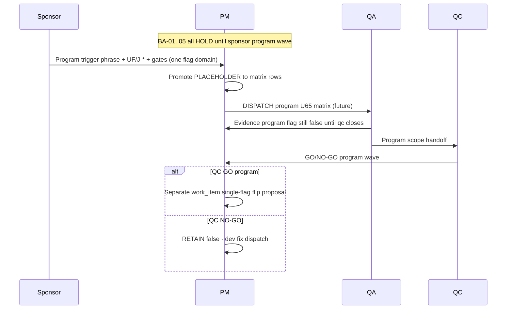

# PO-HRM-DYNAMIC-CONFIG-PLATFORM-FE-ADMIN-REOPEN-GATE-BA-05 — Program honesty reopen-gate inventory ADD (post PROGRAM-PACK-SYNTH)

| Field | Value |
|-------|-------|
| **work_item_id** | `PO-HRM-DYNAMIC-CONFIG-PLATFORM-FE-ADMIN-REOPEN-GATE-BA-05` |
| **Parent / cite chain** | [`FE-ADMIN-REOPEN-GATE-BA-01`](./PO-HRM-DYNAMIC-CONFIG-PLATFORM-FE-ADMIN-REOPEN-GATE-BA-01.md) SPEC **20612** · [`FE-ADMIN-REOPEN-GATE-BA-02`](./PO-HRM-DYNAMIC-CONFIG-PLATFORM-FE-ADMIN-REOPEN-GATE-BA-02.md) SPEC **20278** · [`FE-ADMIN-REOPEN-GATE-BA-03`](./PO-HRM-DYNAMIC-CONFIG-PLATFORM-FE-ADMIN-REOPEN-GATE-BA-03.md) SPEC **23971** · [`FE-ADMIN-REOPEN-GATE-BA-04`](./PO-HRM-DYNAMIC-CONFIG-PLATFORM-FE-ADMIN-REOPEN-GATE-BA-04.md) SPEC **28090** · **RETAIN** all prior inventory rows **unchanged** |
| **Synth source** | [`HONESTY-PROGRAM-PACK-SYNTH-SA-03`](./PO-HRM-DYNAMIC-CONFIG-PLATFORM-HONESTY-PROGRAM-PACK-SYNTH-SA-03.md) §4 master inventory · §7.2 sponsor program unlock map · Option **A** **LOCKED** · SPEC **31223** |
| **Module pack cite** | [`HONESTY-PACK-SYNTH-SA-01`](./PO-HRM-DYNAMIC-CONFIG-PLATFORM-HONESTY-PACK-SYNTH-SA-01.md) SPEC **25083** — five module flags **RETAIN false** |
| **Companion pack cite** | [`HONESTY-COMPANION-PACK-SYNTH-SA-02`](./PO-HRM-DYNAMIC-CONFIG-PLATFORM-HONESTY-COMPANION-PACK-SYNTH-SA-02.md) SPEC **30246** — three companion flags **RETAIN false** |
| **Program** | `PO-HRM-CONTINUOUS-W8-20260807` · U88 after **HONESTY-PROGRAM-PACK-SYNTH-SA-03** SEALED (Option A · SPEC **31223**) |
| **Lane** | governance · ba-process |
| **change_mode** | **ADD-only** program honesty UF placeholders + reopen gates — **no** Nest SoT redefine · **no** execution unlock · **no** flip any program/module/companion flag |
| **ack_status** | **PASS_TO_PM** |
| **U65** | Program UF waves (when sponsor opens) = **login → menu SRS → click → Lưu/Gửi → F5** + J-* — **this doc does not unlock** |
| **Honesty (RETAIN all false)** | `remaster_program_done=false` · `face_live=false` · `attendance_closed=false` · `product_go=false` · **plus module pack:** five `*_ready=false` · **plus companion pack:** three flags **false** · **`C-SLICE-≠-MODULE`** |

---

## 0. Supersession and ADD-only contract

### 0.1 What this file does

Tài liệu **BA-05** **bổ sung** lớp **program honesty gate** vào chuỗi reopen-gate đã có — **không** thay thế BA-01..04 rows:

| Prior seat | Rows | Class |
|------------|------|-------|
| **BA-01** | #1–#13 | FE-ADMIN / FE residual synth pack (HOLD) |
| **BA-02** | #14–#16 | LIVE twin leave-type · printable cite · LVRULE engine cite |
| **BA-03** | #17–#21 | **Module UAT honesty** (five module flags **false**) |
| **BA-04** | #22–#24 | **Companion e2e / JD honesty** (three companion flags **false**) |
| **BA-05** | **#25–#28** | **Program honesty** (four top-level program flags **false**) |

**Cấm REPLACE:** Không sửa file BA-01/BA-02/BA-03/BA-04. Không xóa hàng. Không đổi nghĩa class BA-01 §3 taxonomy trừ bổ sung **program gate** §2.1.

### 0.2 Relationship to HONESTY-PROGRAM-PACK-SYNTH-SA-03

SA program synth **đã** governance CLOSED cho bốn cờ program (§4). BA-05 **dịch** §7.2 trigger phrases + §4 `residual_id` thành **UF placeholders** và **AC-REOPEN-PH** (program honesty) cho PM/QA trace — **song song** FE-ADMIN + module BA-03 + companion BA-04 inventory, **không** thay child program SA specs (REMASTER-DONE · FACE-LIVE · ATTENDANCE-CLOSED · PRODUCT-GO).

### 0.3 rows_added summary

| Metric | Value |
|--------|-------|
| **New inventory rows (BA-05)** | **4** (#25–#28) |
| **Cross-cite RETAIN (BA-04 companion)** | Rows #22–#24 unchanged · **distinct** sponsor waves from program |
| **Cross-cite RETAIN (BA-03 module)** | Rows #17–#21 unchanged |
| **Cross-cite RETAIN (program synth)** | §4 SPEC_LEN **30462 / 30710 / 31700 / 31190** child specs |
| **Execution unlock from BA-05** | **NONE** (HOLD all) |

### 0.4 Program vs module vs companion (do not collapse)

| Flag pair | Same vertical? | Same wave? | Rule |
|-----------|----------------|------------|------|
| W3/W4 brand GWC vs `remaster_program_done` | UI brand peer | **NO** | C-SLICE chrome **≠** full remaster program DONE |
| GĐ1 Face HOLD vs `face_live` | Face peer | **NO** | PROP-03e SKIP **≠** Face product LIVE |
| FE slice CLOSED vs `attendance_closed` | ATT peer | **NO** | Catalog L1 + UF-SIGN **≠** module ATT CLOSED |
| W8 slice density vs `product_go` | Platform wave | **NO** | Delivery fact **≠** Phase1 product GO |
| `attendance_uat_ready` vs `attendance_closed` | ATT | **NO** | Module UAT (BA-03 #18) **≠** program closure (#27) |
| `product_go` vs any single module `*_ready` | Program | **NO** | Product GO requires machine gates + all layers |

**FORBIDDEN:** one bus promote bundling program flag + module flag + companion flag (W7.5 + all pack synths §4 cross-flag rules).

---

## 1. Mục tiêu và phạm vi

### 1.1 Mục tiêu

1. Gắn **UF-ID placeholders** và **sponsor trigger phrases** (program synth §7.2) cho bốn **`residual_id`** program honesty.
2. Định nghĩa **AC-REOPEN-PH** (program honesty) — **FAIL closed** nếu thiếu sponsor message + UF/J-* list + machine gates where applicable.
3. Phân tách **C-SLICE LIVE** claims vs **program closure / GO** claims (BR table §6).
4. Handback PM: seal inventory · **DENY** dispatch dev-fe/be/qc program GO from doc alone · **IDLE-OK full honesty governance** default.

### 1.2 RETAIN (bắt buộc)

- **BA-01** §4 rows 1–13 — frozen ([`FE-ADMIN-REOPEN-GATE-BA-01`](./PO-HRM-DYNAMIC-CONFIG-PLATFORM-FE-ADMIN-REOPEN-GATE-BA-01.md)).
- **BA-02** §4.2 rows 14–16 — frozen ([`FE-ADMIN-REOPEN-GATE-BA-02`](./PO-HRM-DYNAMIC-CONFIG-PLATFORM-FE-ADMIN-REOPEN-GATE-BA-02.md)).
- **BA-03** §3.3 rows 17–#21 — frozen ([`FE-ADMIN-REOPEN-GATE-BA-03`](./PO-HRM-DYNAMIC-CONFIG-PLATFORM-FE-ADMIN-REOPEN-GATE-BA-03.md)).
- **BA-04** §3.4 rows 22–24 — frozen ([`FE-ADMIN-REOPEN-GATE-BA-04`](./PO-HRM-DYNAMIC-CONFIG-PLATFORM-FE-ADMIN-REOPEN-GATE-BA-04.md)).
- **HONESTY-PACK-SYNTH-SA-01** five module flags — **all false** · Option A LOCKED · SPEC **25083**.
- **HONESTY-COMPANION-PACK-SYNTH-SA-02** three companion flags — **all false** · Option A LOCKED · SPEC **30246**.
- **HONESTY-PROGRAM-PACK-SYNTH-SA-03** four program flags — **all false** · Option A LOCKED · SPEC **31223**.
- **FE-ADMIN-PACK-SYNTH-SA-01** Option A · 13 synth rows.
- Child program specs: REMASTER-DONE-HOLD · FACE-LIVE-HOLD · ATTENDANCE-CLOSED-HOLD · PRODUCT-GO-HOLD — **Option A ACCEPT_AS_IS_P2 HOLD**.
- **C-SLICE-≠-MODULE** · U65 · **DENY** invent Nest dual admin · **DENY** Phase1 DONE · **DENY** PROD-READY from inventory alone.

### 1.3 Out of scope (DENY)

- Flip **`remaster_program_done`** · **`face_live`** · **`attendance_closed`** · **`product_go`** from inventory publication.
- Flip any **module** or **companion** flag from BA-05 (use BA-03 / BA-04 sponsor maps only).
- Claim **Phase 1 DONE** · **product GO** · **UAT-READY program-wide** · **PROD-READY** from C-SLICE GWC or W8 slice count alone.
- Nest SoT redefine · invent catalog KEY · dual admin writer · **`apps/**`** · seed (U65).
- Reopen sealed W3/W4 brand QC · platform L1 GWC · UF-HRM-ATT-SIGN GO as program flip pretext.
- Conflate **FE slice CLOSED** with **`attendance_closed=true`** (program synth §14.4).
- Promote **PROP-03e SKIP** to **`face_live=true`** without Face product wave.
- Bundle multi-flag promote (program + program · program + module + companion) on one bus line.
- Use **`verify:product:completion` skip** or matrix row count as sole **`product_go`** unlock.

### 1.4 Actors

| Actor | Vai trò |
|-------|---------|
| **Sponsor** | Trigger phrase §3.4 **trong cùng message** + named UF/J-* + machine gates when applicable |
| **PM** | Promote PLACEHOLDER → matrix UF · dispatch qa/qc **program** scope · **không** từ BA-05 alone |
| **ba-process** | Inventory ADD only — **HOLD** Nest AC redefine |
| **QA** | U65 full matrix · J-* L2.5 · program flags **false** in evidence until QC closes program gate |
| **QC** | NO-GO nếu SERVICE_READINESS PROD promote from HOLD inventory |

---

## 2. Class taxonomy — program honesty layer (five layers)

### 2.1 Five layers (RETAIN program synth §1.2 + module + companion packs)

| Class | Meaning | BA doc home |
|-------|---------|-------------|
| **Program honesty gate** | Top-level program flag **false** until sponsor **named program wave** | **BA-05** #25–#28 |
| **Module honesty gate** | Program flag **false** until sponsor **module UF wave** | **BA-03** #17–#21 |
| **Companion honesty gate** | Program flag **false** until sponsor **e2e/JD wave** | **BA-04** #22–#24 |
| **C-SLICE LIVE** | L1/CNS/browser/brand GWC under U65 · flags **still false** | Child program SA §1.2 LIVE tables |
| **Orthogonal HOLD** | Engine · FE-ADMIN LIVE twin · FE-ADMIN pack | BA-01/02 · synth FE-ADMIN |

### 2.2 Program gate vs module gate (ATT example — discrimination)

| Question | Program (BA-05 #27) | Module (BA-03 #18) | Companion (BA-04 #24) |
|----------|---------------------|--------------------|------------------------|
| Primary ATT program flag | `attendance_closed` | `attendance_uat_ready` | `attendance_e2e_linkage_ready` |
| Typical mistake | UF-SIGN GO ⇒ module CLOSED | Catalog L1 ⇒ module UAT | J-06c spot ⇒ e2e linkage |
| QC scope label | **program ATT closure** | **module UAT** | **linkage / e2e spine** |
| Child residual | `R-PLT-ATTENDANCE-CLOSED-01` | `R-PLT-ATT-UAT-01` | `R-PLT-ATT-E2E-LINK-01` |

### 2.3 Brand GWC vs remaster program DONE

| Question | C-SLICE (allowed while false) | Program #25 |
|----------|------------------------------|-------------|
| Evidence | W3 PORT/EMP/ATT · W4 chrome GWC SEALED | Full screen remaster inventory |
| Flag | **`remaster_program_done=false`** | Flip only after remaster **program** wave |
| **DENY** | W4 batch alone ⇒ DONE | Chrome **≠** remaster program closure |

### 2.4 Product GO vs platform W8 wave

| Question | C-SLICE | Program #28 |
|----------|---------|-------------|
| Evidence | Large catalog + brand + UF slice inventory | `verify:product:completion` · QC S5 · all honesty layers |
| Flag | **`product_go=false`** | Flip only after **Phase 1 product GO** sponsor wave |
| **DENY** | «W8 delivered a lot» ⇒ GO | Slice count **≠** product GO |

---

## 3. Master inventory rollup (prior + ADD)

### 3.1 RETAIN — BA-01 rows #1–#13

**Source:** [`FE-ADMIN-REOPEN-GATE-BA-01`](./PO-HRM-DYNAMIC-CONFIG-PLATFORM-FE-ADMIN-REOPEN-GATE-BA-01.md) §4 — status **HOLD** all.

### 3.2 RETAIN — BA-02 rows #14–#16

**Source:** [`FE-ADMIN-REOPEN-GATE-BA-02`](./PO-HRM-DYNAMIC-CONFIG-PLATFORM-FE-ADMIN-REOPEN-GATE-BA-02.md) §4.2 — **not redefined**.

### 3.3 RETAIN — BA-03 rows #17–#21 (module honesty)

**Source:** [`FE-ADMIN-REOPEN-GATE-BA-03`](./PO-HRM-DYNAMIC-CONFIG-PLATFORM-FE-ADMIN-REOPEN-GATE-BA-03.md) §3.3 — five module flags **false** — **not redefined**.

### 3.4 RETAIN — BA-04 rows #22–#24 (companion honesty)

**Source:** [`FE-ADMIN-REOPEN-GATE-BA-04`](./PO-HRM-DYNAMIC-CONFIG-PLATFORM-FE-ADMIN-REOPEN-GATE-BA-04.md) §3.4 — three companion flags **false** — **not redefined**.

### 3.5 ADD — Program honesty inventory (this work_item)

**Source of truth for trigger phrases:** [`HONESTY-PROGRAM-PACK-SYNTH-SA-03`](./PO-HRM-DYNAMIC-CONFIG-PLATFORM-HONESTY-PROGRAM-PACK-SYNTH-SA-03.md) §7.2.

| # | residual_id | program flag (RETAIN false) | class | UF-ID placeholders (pre-unlock) | J-* / matrix anchors (when promoted) | Sponsor must say (reopen gate) | Allowed after gate (future — not default) | status | Child SA cite · SPEC_LEN |
|---|-------------|----------------------------|-------|--------------------------------|----------------------------------------|--------------------------------|-------------------------------------------|--------|---------------------------|
| 25 | **`R-PLT-REMASTER-DONE-01`** | `remaster_program_done=false` | **Program honesty gate** | `UF-PLT-REMASTER-PROGRAM-WAVE-PLACEHOLDER` · full screen inventory UF when sponsor lists | Brand remaster matrix · mobile batch · `PROGRAM_JOURNEY_MAP` cross-module screens · **RETAIN** W3/W4 GWC as C-SLICE only | «**mở wave đóng remaster toàn chương trình**» · full screen inventory — **cùng message** + named UF/J-* · **DENY** W3/W4 chrome alone | **Future:** qa U65 remaster program matrix · qc GO **program remaster** scope · **single-flag** flip work_item · **≠** brand slice re-QA | **HOLD** | [`REMASTER-DONE-HOLD-SA-01`](./PO-HRM-DYNAMIC-CONFIG-PLATFORM-REMASTER-DONE-HOLD-SA-01.md) · **30462** |
| 26 | **`R-PLT-FACE-LIVE-01`** | `face_live=false` | **Program honesty gate** | `UF-PLT-FACE-LIVE-WAVE-PLACEHOLDER` · biometric/product UF when sponsor lists | Face product UF · model/backend spine · mobile Face flows · **RETAIN** PROP-03e SKIP · ATT-DIALOG-EXT HOLD as honesty | «**mở Face product LIVE / biometric UAT**» — **cùng message** + UF matrix · **not** GĐ1 banner alone | **Future:** qa Face product U65 · qc GO **Face LIVE** scope · **DENY** GĐ1 ⇒ LIVE | **HOLD** | [`FACE-LIVE-HOLD-SA-01`](./PO-HRM-DYNAMIC-CONFIG-PLATFORM-FACE-LIVE-HOLD-SA-01.md) · **30710** |
| 27 | **`R-PLT-ATTENDANCE-CLOSED-01`** | `attendance_closed=false` | **Program honesty gate** | `UF-PLT-ATT-MODULE-CLOSED-WAVE-PLACEHOLDER` · full J-HRM-06* when sponsor lists | **J-HRM-06*** program matrix · engine policy depth · WAIVE ladder · **not** catalog L1 alone · **not** UF-SIGN alone | «**mở đóng module Chấm công**» + full J-HRM-06* / named UF — **cùng message** · **DENY** FE «CLOSED» wording as program flip | **Future:** qa ATT module closure U65 · qc GO **program ATT closed** scope · **orthogonal** to BA-03 #18 module UAT | **HOLD** | [`ATTENDANCE-CLOSED-HOLD-SA-01`](./PO-HRM-DYNAMIC-CONFIG-PLATFORM-ATTENDANCE-CLOSED-HOLD-SA-01.md) · **31700** |
| 28 | **`R-PLT-PRODUCT-GO-01`** | `product_go=false` | **Program honesty gate** | `UF-PLT-PHASE1-PRODUCT-GO-WAVE-PLACEHOLDER` · Phase1 exit UF/J-* when sponsor lists | `PHASE1_PRODUCT_COMPLETION_TODO` · `verify:product:completion` · QC S5 · `SERVICE_READINESS` · all module+companion+program gates explicit | «**mở Phase 1 product GO / PROD cutover**» — **cùng message** + exit criteria list · **not** slice count alone | **Future:** devops verify gates · qc program GO · **single-flag** `product_go` proposal after all preconditions · **DENY** bundled honesty flip | **HOLD** | [`PRODUCT-GO-HOLD-SA-01`](./PO-HRM-DYNAMIC-CONFIG-PLATFORM-PRODUCT-GO-HOLD-SA-01.md) · **31190** |

**Cross-flag rule (program synth §4):** Mỗi program flag unlock **chỉ** qua **single-flag** sponsor wave + QC **program** scope — **FORBIDDEN** remaster + face + attendance_closed + product_go on one bus line · **FORBIDDEN** program + module + companion bundled promote.

---

## 4. UF placeholders — detail by program gate

### 4.25 Remaster program DONE — `UF-PLT-REMASTER-PROGRAM-WAVE-PLACEHOLDER`

**Meaning:** PM thay PLACEHOLDER bằng danh sách UF cụ thể (full screen remaster inventory, mobile batch, embed routes) khi mở **program remaster closure** wave — **distinct** from W3/W4 brand C-SLICE GWC.

**Pre-unlock AC (documentation — PASS khi):**

1. Board honesty JSON shows `remaster_program_done=false` — **PASS** if false.
2. No dispatch claims «remaster program DONE» from W3/W4 brand QC GWC alone — **PASS** if absent (program synth §14.2).
3. Module/companion flags **unchanged** on same promote — **PASS** if not bundled.
4. BA-05 row #25 trigger semantic match §3.5 — **FAIL** if PM uses brand re-QA alone.

**Post-gate AC (future qa — measurable):**

- Mọi UF in-scope: login → menu SRS → mutate/display per remaster AC → Network 2xx where applicable → F5 persist.
- L2.5: cross-nav on remastered screens · mobile parity if in scope · **không** 409 scope.
- Evidence repeats **`remaster_program_done=false`** until **qc** program GO work_item closes gate #25.

**C-SLICE allowed while false:** W3 PORT/EMP/ATT · W4 PORT-LOGIN · ATT-DIALOG-EXT · PAY-A · REC-A-FIX GWC SEALED (REMASTER-DONE child §1.2).

### 4.26 Face product LIVE — `UF-PLT-FACE-LIVE-WAVE-PLACEHOLDER`

**Pre-unlock AC:**

1. `face_live=false` on board — **PASS** if false.
2. PROP-03e EmployeeQRCard SKIP · ATT Face HOLD dialogs cited as **honesty** — **DENY** LIVE claim (program synth §14.3).
3. **`attendance_closed`** · **`product_go`** not bundled on Face wave — **PASS** if single-flag domain.
4. GĐ1 chrome/banner evidence **≠** biometric product UF — **FAIL** if conflated.

**Post-gate AC (future):** Face product UF matrix · model/backend evidence · U65 · qc **Face LIVE** scope.

**FORBIDDEN:** reopen ATT Face HOLD dialogs as **`face_live=true`** without Face product wave.

### 4.27 Attendance module CLOSED — `UF-PLT-ATT-MODULE-CLOSED-WAVE-PLACEHOLDER`

**Pre-unlock AC:**

1. `attendance_closed=false` — **PASS** if false.
2. ATTCODEQAFE · OTC-03 · CNS-02 **CLOSED** = wire closure for named paths — **≠** program **`attendance_closed=true`** (program synth §14.4 · L-ATT-CLOSED-04).
3. UF-HRM-ATT-SIGN GO = **narrow UF** — **≠** module closure (#27).
4. **`attendance_uat_ready=false`** module RETAIN (BA-03 #18) · **`attendance_e2e_linkage_ready=false`** companion RETAIN (BA-04 #24) — **orthogonal** waves.
5. **`R-PLT-ATT-LVRULE-ENGINE-01`** (BA-02 #16) **not** substitute for row #27 — **PASS** if separated.

**Post-gate AC (future):** Full J-HRM-06* · engine policy runtime where sponsor names · timesheet depth · U65 · qc **program ATT closed** scope.

**OPEN spine (supports false — cite child ATTENDANCE-CLOSED spec):** LVRULE engine · SITE-UNKNOWN · partial FE CLOSED labels — sponsor-gated, not BA-05 publication alone.

### 4.28 Phase 1 product GO — `UF-PLT-PHASE1-PRODUCT-GO-WAVE-PLACEHOLDER`

**Pre-unlock AC:**

1. `product_go=false` — **PASS** if false.
2. W8 platform catalog + brand + UF slice inventory = **delivery fact** — **DENY** Phase1 DONE / PROD-READY (program synth §14.1).
3. **`verify:product:completion`** exit 0 required before flip proposal — **FAIL** if skipped.
4. All **twelve** honesty flags (4 program + 5 module + 3 companion) explicitly addressed in sponsor exit list — **FAIL** if silent bundle flip.
5. QC S5 scope named in same cycle — **FAIL** if PM promotes from HOLD inventory alone.

**Post-gate AC (future):** Machine gates · SERVICE_READINESS PROD evidence · charter alignment · **single-flag** `product_go=true` work_item after qc program GO.

**FORBIDDEN:** «Phase 1 DONE» language from BA-05 publication · synth rollup · or C-SLICE volume alone.

---

## 5. Acceptance criteria — reopen gate (program honesty)

### 5.1 Global AC-REOPEN-PH-00 (inventory publication)

| ID | Criterion | Pass | Fail |
|----|-----------|------|------|
| AC-REOPEN-PH-00a | BA-05 published ADD-only | BA-01..04 files untouched | Any REPLACE wipe prior BA |
| AC-REOPEN-PH-00b | Four rows #25–#28 present | Table §3.5 complete | Missing residual |
| AC-REOPEN-PH-00c | All four program flags documented **false** | §1.2 RETAIN | Any program flag `=true` in doc |
| AC-REOPEN-PH-00d | Module five + companion three flags still **false** cited | §1.2 pack RETAIN | Module/companion flip language |
| AC-REOPEN-PH-00e | No execution unlock language | HOLD all rows | «DISPATCH dev-fe program GO now» |
| AC-REOPEN-PH-00f | SPEC_LEN gate | File Length ≥8192 verified | Empty or stub turn |
| AC-REOPEN-PH-00g | HONESTY-PROGRAM-PACK-SYNTH-SA-03 cited | SPEC **31223** · Option A | Redefine child program SA |

### 5.2 Per-row pre-unlock AC (sponsor gate)

| ID | Criterion | Pass | Fail |
|----|-----------|------|------|
| AC-REOPEN-PH-01 | Sponsor message contains §3.5 trigger phrase **semantic match** | Vietnamese equivalent to §7.2 synth | PM dispatch program qa without sponsor |
| AC-REOPEN-PH-02 | Named UF-IDs and/or J-* listed same cycle | Bus DISPATCHED cites list | Placeholder only forever |
| AC-REOPEN-PH-03 | Single program flag domain per wave | One residual_id focus | Bundle four program flags |
| AC-REOPEN-PH-04 | QC scope = **program** not slice alone | qc charter names program matrix | qc GO from brand L1 or J-06c spot alone |
| AC-REOPEN-PH-05 | Flag flip proposal | Separate work_item after qc GO | Flip in same ba-process doc |
| AC-REOPEN-PH-06 | Module + companion flags untouched | No module/companion in same promote | Bundled full honesty flip |
| AC-REOPEN-PH-07 | Product GO row | Machine gates cited when #28 | Slice count as sole unlock |

### 5.3 Allowed narrow claims while program flags false (C-SLICE)

Program synth §4.1 — QA/QC **may** state (examples):

- «W3/W4 brand chrome GWC CLOSED (Precision Motion)» — **≠** `remaster_program_done=true`
- «Face GĐ1 honesty · PROP-03e SKIP · ATT-DIALOG-EXT HOLD» — **≠** `face_live=true`
- «ATT catalog L1 + FE slice CLOSED + UF-SIGN GO + J-06c GWC» — **≠** `attendance_closed=true`
- «W8 platform catalog + brand + UF slice inventory (delivery fact)» — **≠** `product_go=true`
- «Module/companion honesty pack governance CLOSED» — flags **still false**

**FORBIDDEN claims:** «Remaster program DONE» · «Face product LIVE» · «Attendance **module** CLOSED (program)» · «Phase 1 product GO» · «PROD-READY program-wide» from HOLD inventory or slice GWC alone.

---

## 6. Business rule matrix (program honesty ADD)

| BR-ID | Condition | Action | Outcome |
|-------|-----------|--------|---------|
| BR-REOPEN-PH-01 | BA-05 published | RETAIN BA-01 #1–13 + BA-02 #14–16 + BA-03 #17–21 + BA-04 #22–24 | Prior gates unchanged |
| BR-REOPEN-PH-02 | PM sees W3/W4 brand GWC PASS | Cite C-SLICE only | **DENY** `remaster_program_done=true` |
| BR-REOPEN-PH-03 | PM sees PROP-03e SKIP / GĐ1 Face | Cite honesty only | **DENY** `face_live=true` |
| BR-REOPEN-PH-04 | PM sees UF-SIGN GO or ATT FE CLOSED | Cite narrow UF / wire closure | **DENY** `attendance_closed=true` |
| BR-REOPEN-PH-05 | PM sees large W8 wave count | Cite delivery fact | **DENY** `product_go=true` |
| BR-REOPEN-PH-06 | Sponsor opens product GO | Require machine gates + qc S5 | **NO-GO** from HOLD alone |
| BR-REOPEN-PH-07 | QC SERVICE_READINESS PROD update | Requires program qc GO + sponsor wave | **NO-GO** from synth rollup |
| BR-REOPEN-PH-08 | ba-process Nest redefine in BA-05 | Reject handoff | **INVALID** — cite child SA only |
| BR-REOPEN-PH-09 | PROGRAM-PACK synth SEALED | Index §3.5 only | **DENY** re-litigate Option A |
| BR-REOPEN-PH-10 | Module + companion packs | Twelve flags **false** RETAIN | **DENY** flip from BA-05 |
| BR-REOPEN-PH-11 | Bundled multi-layer promote | Reject bus line | W7.5 + all pack cross-flag rules |

**RETAIN** BA-01 BR-REOPEN-* · **BA-02** BR-REOPEN-ADD-* · **BA-03** BR-REOPEN-MH-* · **BA-04** BR-REOPEN-CH-* for prior rows.

---

## 7. Sequence — program honesty reopen (documentation)



---

## 8. Handoff package

| To | Expectation | Done when |
|----|-------------|-----------|
| **PM** | Seal BA-05 · append W8 board trace rows #25–#28 · RETAIN all honesty false · **IDLE-OK full honesty governance** default | SPEC_LEN ≥8192 · PASS_TO_PM |
| **SA** | No action — program synth SEALED | RETAIN PROGRAM-PACK-SYNTH |
| **ba-data** | HOLD until program UF waves sponsor opens | — |
| **dev-fe / dev-be / devops** | **No dispatch** from BA-05 | Sponsor + PM + machine gates (#28) |
| **QA** | Use §4 UF placeholders when unlocked · U65 · J-* L2.5 | `docs/qa/evidence/` |
| **QC** | Audit four program + eight module/companion flags false · C-SLICE vs program language | GWC unchanged |

---

## 9. Traceability

| Artifact | Role |
|----------|------|
| `HONESTY-PROGRAM-PACK-SYNTH-SA-03` | §4 §7.2 authoritative program inventory · SPEC **31223** |
| `HONESTY-PACK-SYNTH-SA-01` | Five module flags · SPEC **25083** |
| `HONESTY-COMPANION-PACK-SYNTH-SA-02` | Three companion flags · SPEC **30246** |
| `FE-ADMIN-REOPEN-GATE-BA-01` | SPEC **20612** · rows 1–13 |
| `FE-ADMIN-REOPEN-GATE-BA-02` | SPEC **20278** · rows 14–16 |
| `FE-ADMIN-REOPEN-GATE-BA-03` | SPEC **23971** · rows 17–21 |
| `FE-ADMIN-REOPEN-GATE-BA-04` | SPEC **28090** · rows 22–24 |
| `PO_HRM_CONTINUOUS_W8_20260807.md` | Board honesty LOCKED |
| `PHASE1_PRODUCT_COMPLETION_TODO.md` | Phase1 spine OPEN · row #28 preconditions |
| `SERVICE_READINESS_UAT_PRODUCTION.md` | Must not PROD promote from synth alone |
| `PROGRAM_JOURNEY_MAP.md` | J-HRM-* program promotion when unlock |
| `verify:product:completion` | Machine gate for row #28 only when sponsor opens |

---

## 10. DENY list (consolidated — BA-05 seat)

- Flip **`remaster_program_done`** · **`face_live`** · **`attendance_closed`** · **`product_go`** from this inventory publication.
- Flip any **module** or **companion** flag from BA-05 (use BA-03 / BA-04 sponsor maps only).
- Claim **Phase1 DONE** · **product GO** · **PROD-READY** · **UAT-READY program-wide** without program qc GO + sponsor wave + machine gates (#28).
- Dispatch **`dev-fe`/`dev-be`/`qa`/`qc` program GO** from BA-05 alone (no sponsor trigger).
- REPLACE wipe BA-01..BA-04 content or renumber prior rows.
- Reopen sealed W3/W4 brand QC · platform L1 GWC · UF-HRM-ATT-SIGN GO as program flip pretext.
- Conflate **FE slice CLOSED** with **`attendance_closed=true`**.
- Promote **PROP-03e SKIP** to **`face_live=true`** without Face product wave.
- Use **W8 slice density** or **COMPANION/MODULE pack synth** as **`product_go`** unlock.
- Bundle program multi-flag or program+module+companion promote on one bus line.
- Seed (U65) to complete program matrix.
- Nest SoT redefine · invent KEY · invent Nest dual admin · **`apps/**`**.

---

## 11. Open risks

| Risk | Mitigation |
|------|------------|
| Brand GWC ⇒ remaster DONE narrative | §5.3 · program synth §14.2 |
| GĐ1 Face ⇒ face_live narrative | §4.26 · §5.3 |
| FE CLOSED ⇒ attendance_closed narrative | §4.27 · L-ATT-CLOSED-04 |
| W8 volume ⇒ product_go narrative | §4.28 · §5.3 · verify gate |
| Collapse five honesty layers | §2.1 table · BA-03/04 rows RETAIN |
| PM idle-ok misread as spine broken | OPEN spine in child program SA specs |
| Duplicate inventory with program synth §4 | BA-05 = UF/reopen trace · synth = governance CLOSED |

**Clarifications needed from sponsor:** None for BA-05 inventory ADD completion.

---

## 12. Expanded reference — program synth §4 mirror (audit)

| Vertical | residual_id | SPEC_LEN child | Flag RETAIN false |
|----------|-------------|----------------|-------------------|
| Brand remaster program | `R-PLT-REMASTER-DONE-01` | **30462** | `remaster_program_done=false` |
| Face product LIVE | `R-PLT-FACE-LIVE-01` | **30710** | `face_live=false` |
| Attendance module closure | `R-PLT-ATTENDANCE-CLOSED-01` | **31700** | `attendance_closed=false` |
| Phase 1 product GO | `R-PLT-PRODUCT-GO-01` | **31190** | `product_go=false` |

Closing **program governance** (PROGRAM-PACK synth) **does not** promote any flag to **true**. BA-05 **extends** reopen-gate traceability only — parallel to BA-04 companion extension after COMPANION-PACK synth and BA-03 module extension after HONESTY-PACK synth.

### 12.1 Full honesty stack after BA-05 (rollup row count)

| Layer | Count | Row range | All false until sponsor wave |
|-------|------:|-----------|------------------------------|
| FE-ADMIN + orthogonal | 16 | BA-01 #1–13 · BA-02 #14–16 | HOLD / cite |
| Module honesty | 5 | BA-03 #17–21 | Module UF waves |
| Companion honesty | 3 | BA-04 #22–24 | E2e / JD waves |
| Program honesty | 4 | BA-05 #25–28 | Program waves §7.2 |
| **Total reopen-gate inventory** | **28** | #1–#28 | **C-SLICE-≠-MODULE** invariant **true** |

---

## 13. PM quick scan — ADD rows only (BA-05)

| # | residual_id | Flag RETAIN false | Sponsor trigger (short) | UF placeholder |
|---|-------------|-------------------|-------------------------|----------------|
| 25 | `R-PLT-REMASTER-DONE-01` | remaster_program_done | mở wave đóng remaster toàn chương trình | UF-PLT-REMASTER-PROGRAM-WAVE-PLACEHOLDER |
| 26 | `R-PLT-FACE-LIVE-01` | face_live | mở Face product LIVE / biometric UAT | UF-PLT-FACE-LIVE-WAVE-PLACEHOLDER |
| 27 | `R-PLT-ATTENDANCE-CLOSED-01` | attendance_closed | mở đóng module Chấm công | UF-PLT-ATT-MODULE-CLOSED-WAVE-PLACEHOLDER |
| 28 | `R-PLT-PRODUCT-GO-01` | product_go | mở Phase 1 product GO / PROD cutover | UF-PLT-PHASE1-PRODUCT-GO-WAVE-PLACEHOLDER |

**Full reopen-gate rollup row count after BA-05:** **28** rows (#1–#28) across BA-01..05 — **only #25–#28 added this seat**.

---

## 14. QC audit checklist (post BA-05 publication)

- [ ] All four §3.5 program flags still **false** on board and latest QC evidence
- [ ] All five module + three companion flags still **false**
- [ ] No matrix row **🟢 Phase1 DONE** · **🟢 remaster DONE** · **🟢 Face LIVE** · **🟢 ATT module CLOSED (program)** promoted from HOLD inventory alone
- [ ] SERVICE_READINESS language uses **C-SLICE** vs **program GO** discrimination
- [ ] Dispatch queue has **no** dev-fe/be/qc justified only by «W8 wave large» · «brand GWC» · «UF-SIGN GO»
- [ ] Sponsor program wave (if any) cites **explicit UF/J-*** + machine gates before flag flip Task
- [ ] BA-01..BA-04 spec files **unchanged** on disk
- [ ] HONESTY-PROGRAM-PACK-SYNTH-SA-03 Option A LOCKED **unchallenged**

---

## 15. Completion contract (handback)

```yaml
work_item_id: PO-HRM-DYNAMIC-CONFIG-PLATFORM-FE-ADMIN-REOPEN-GATE-BA-05
ack_status: PASS_TO_PM
evidence_path: docs/program/specs/PO-HRM-DYNAMIC-CONFIG-PLATFORM-FE-ADMIN-REOPEN-GATE-BA-05.md
rows_added: 4
inventory_rows_total_after_seal: 28
SPEC_LEN: verified_by_WriteAllText_gate
RETAIN:
  - FE-ADMIN-REOPEN-GATE-BA-01 SPEC 20612 rows 1-13
  - FE-ADMIN-REOPEN-GATE-BA-02 SPEC 20278 rows 14-16
  - FE-ADMIN-REOPEN-GATE-BA-03 SPEC 23971 rows 17-21
  - FE-ADMIN-REOPEN-GATE-BA-04 SPEC 28090 rows 22-24
  - HONESTY-PACK-SYNTH-SA-01 Option A LOCKED SPEC 25083 five module flags false
  - HONESTY-COMPANION-PACK-SYNTH-SA-02 Option A LOCKED SPEC 30246 three companion flags false
  - HONESTY-PROGRAM-PACK-SYNTH-SA-03 Option A LOCKED SPEC 31223 four program flags false
  - all FE-ADMIN HOLDs · C-SLICE · U65 · no bundled flag flip · DENY invent Nest dual · DENY Phase1/PROD from inventory
completion_report: |
  ADD-only program honesty reopen-gate inventory after HONESTY-PROGRAM-PACK-SYNTH-SA-03 SEALED:
  four new rows #25-28 (R-PLT-REMASTER-DONE-01 · R-PLT-FACE-LIVE-01 · R-PLT-ATTENDANCE-CLOSED-01 ·
  R-PLT-PRODUCT-GO-01) with UF placeholders, sponsor §7.2 trigger phrases from program synth,
  AC-REOPEN-PH, BR matrix, DENY list. Cross-cited BA-01..04 without wipe. No Nest redefine ·
  no execution unlock · no flip any honesty flag · no apps/** edits.
next_owner: pm
next_dispatch_prompt: |
  work_item_id: PO-HRM-DYNAMIC-CONFIG-PLATFORM-FE-ADMIN-REOPEN-GATE-BA-05-PM-SEAL-01
  from_role: pm
  to_role: pm
  lane: governance · U88
  INTAKE: ba-process PASS_TO_PM — FE-ADMIN reopen-gate BA-05 program honesty ADD sealed
  evidence_path: docs/program/specs/PO-HRM-DYNAMIC-CONFIG-PLATFORM-FE-ADMIN-REOPEN-GATE-BA-05.md
  action:
    1) Seal bus row PO-HRM-DYNAMIC-CONFIG-PLATFORM-FE-ADMIN-REOPEN-GATE-BA-05 = PASS_TO_PM;
       append W8 board trace for program honesty rows #25-28 alongside BA-01..04 inventory (28 rows total)
    2) RETAIN remaster_program_done=false · face_live=false · attendance_closed=false · product_go=false
       · all module + companion flags false · BA-01..04 specs · three honesty pack synths SEALED
    3) Do NOT dispatch dev-fe/dev-be/qa/qc program GO from BA-05; do NOT flip any honesty flag
    4) U88 default: PM->ALL idle-ok W8 **full honesty governance** CLOSED
       · module + companion + program packs + reopen-gate 28-row inventory SEALED
       · C-SLICE · next vertical per continuous board (non invent flip)
       unless sponsor program §7.2 trigger in same message (then promote UF placeholders only — single program flag domain)
  exit: PM->ALL seal + TEAM_WORKING_NOW one line · optional qc audit all twelve module/companion + four program flags still false
  ack_status: PASS_TO_PM
must_keep: BA-01 13 rows · BA-02 3 rows · BA-03 5 rows · BA-04 3 rows · honesty three-pack synth · C-SLICE · U65 · no bundled flip
```

---

## 16. Appendix — HONESTY-PACK-SYNTH-SA-01 cite (module flags RETAIN)

Per [`HONESTY-PACK-SYNTH-SA-01`](./PO-HRM-DYNAMIC-CONFIG-PLATFORM-HONESTY-PACK-SYNTH-SA-01.md) §4 — **not re-indexed** in BA-05 master table; **must remain false** when any program row #25–#28 is discussed:

| Module flag | residual_id (child SA) |
|-------------|------------------------|
| `hrm_personnel_uat_ready=false` | `R-PLT-EMP-UAT-01` |
| `attendance_uat_ready=false` | `R-PLT-ATT-UAT-01` |
| `recruitment_uat_ready=false` | `R-PLT-REC-UAT-01` |
| `payroll_e2e_ready=false` | `R-PLT-PAY-E2E-01` |
| `contracts_printable_ready=false` | `R-PLT-CTR-PRINTABLE-01` |

Program synth §4.2 and §10 stamp full stack: closing **program honesty governance** does **not** promote module or companion rows to **true**. BA-05 publication completes reopen-gate **trace** only.

---

*End of BA-05 — ADD-only program honesty reopen-gate · RETAIN BA-01..04 · four rows #25–#28 · PASS_TO_PM · no execution unlock · full honesty governance IDLE-OK default*
