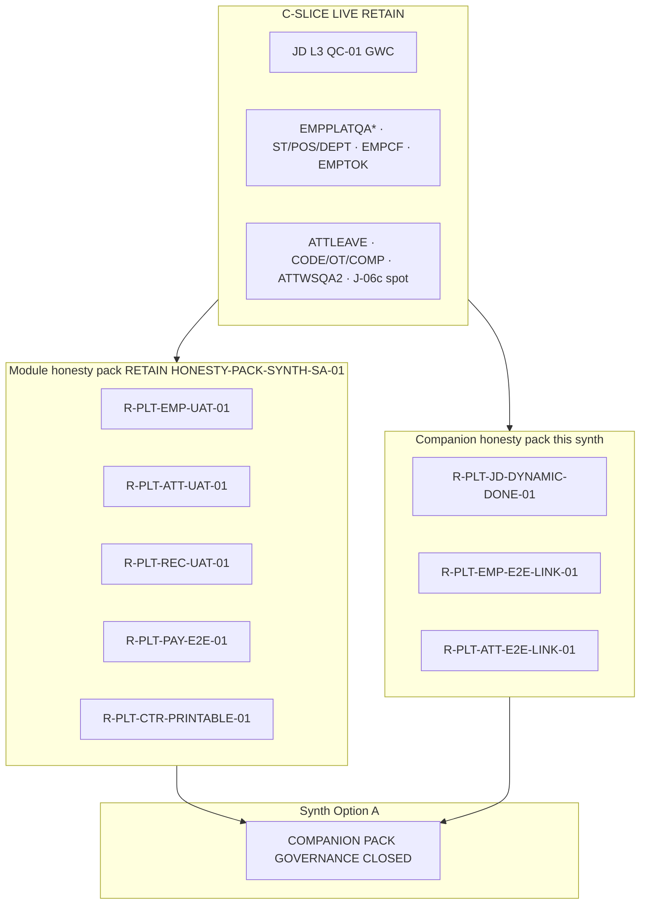

# PO-HRM-DYNAMIC-CONFIG-PLATFORM-HONESTY-COMPANION-PACK-SYNTH-SA-02 — Option/F.1 · Companion honesty HOLD pack rollup (W8 U88)

| Field | Value |
|-------|--------|
| **work_item_id** | `PO-HRM-DYNAMIC-CONFIG-PLATFORM-HONESTY-COMPANION-PACK-SYNTH-SA-02` |
| **Parent** | U88 continuous · after **`PO-HRM-DYNAMIC-CONFIG-PLATFORM-ATT-E2E-LINKAGE-HOLD-SA-01`** SEALED (Option A · **`R-PLT-ATT-E2E-LINK-01`** · SPEC **39532**) · peer sealed chain: JD-DYNAMIC-DONE · EMP-E2E-LINKAGE · **`HONESTY-PACK-SYNTH-SA-01`** (five module flags · SPEC **25083**) |
| **Program** | `PO-HRM-CONTINUOUS-W8-20260807` |
| **lane** | governance · sa · **docs-only synth** · **NO** `apps/**` · **NO** execution unlock · **NO** flip any `*_ready` |
| **change_mode** | **ADD** companion-pack Option/F.1 inventory + disposition — consolidates **three** sealed **companion honesty** HOLD seats (narrow pack after module HONESTY-PACK-SYNTH-SA-01) |
| **Date** | 2026-08-08 |
| **Status** | **CONFIRMED** · Option **A** **LOCKED** · **ACCEPT companion pack as governance CLOSED (P2 HOLD inventory)** · no execution unlock |
| **Honesty (RETAIN all false)** | `jd_dynamic_done=false` · `employees_e2e_linkage_ready=false` · `attendance_e2e_linkage_ready=false` · **plus module pack RETAIN:** `hrm_personnel_uat_ready=false` · `attendance_uat_ready=false` · `recruitment_uat_ready=false` · `payroll_e2e_ready=false` · `contracts_printable_ready=false` · **`C-SLICE-≠-MODULE`** · U65 · **DENIED** module UAT · Phase1 DONE · companion/module flag flip from synth |
| **ack_status** | **PASS_TO_PM** · **CONFIRMED** |

> **HARD EXIT GATE:** NFD path · UTF-8 **no BOM** · Shell **Length ≥ 8192** verified before CONFIRMED. Empty turn = INVALID.

---

## 1. Decision context (ADR option pack §1)

| | |
|--|--|
| **Decision title** | W8 **companion synth rollup**: single pack inventory for all sealed **companion honesty** Option/F.1 seats — ACCEPT governance CLOSED vs unlock any companion `*_ready` flag vs invent e2e/module UAT / Phase1 DONE |
| **Requestor** | pm · U88 after ATT-E2E-LINKAGE-HOLD SA SEAL |
| **Decision owner** | sa |
| **Related** | Dynamic Config Platform W8 · `PO_HRM_CONTINUOUS_W8_20260807.md` honesty LOCKED · [`HONESTY-PACK-SYNTH-SA-01`](./PO-HRM-DYNAMIC-CONFIG-PLATFORM-HONESTY-PACK-SYNTH-SA-01.md) (module flags) · [`FE-ADMIN-REOPEN-GATE-BA-01`](./PO-HRM-DYNAMIC-CONFIG-PLATFORM-FE-ADMIN-REOPEN-GATE-BA-01.md) · [`FE-ADMIN-REOPEN-GATE-BA-02`](./PO-HRM-DYNAMIC-CONFIG-PLATFORM-FE-ADMIN-REOPEN-GATE-BA-02.md) · [`FE-ADMIN-REOPEN-GATE-BA-03`](./PO-HRM-DYNAMIC-CONFIG-PLATFORM-FE-ADMIN-REOPEN-GATE-BA-03.md) · `PROGRAM_JOURNEY_MAP` J-HRM-* · `SERVICE_READINESS` |
| **Template** | `.cursor/templates/ADR_OPTION_TEMPLATE.md` §§1–7 + **§11 F.1 companion pack inventory** |
| **Non-goals** | Re-litigate each companion child SA spec line-by-line; patch product code; flip any companion or module `*_ready=true`; claim module UAT; invent Nest dual admin writer |

### 1.1 Mission scope (what this seat owns)

This seat **does not** replace child companion honesty specs or the **module** honesty pack in [`HONESTY-PACK-SYNTH-SA-01`](./PO-HRM-DYNAMIC-CONFIG-PLATFORM-HONESTY-PACK-SYNTH-SA-01.md). It **indexes** the **three mandatory companion rows** with **SPEC_LEN**, **residual_id**, **selected Option**, **program honesty flag**, and **class** (program companion gate vs module UAT gate vs C-SLICE), then stamps **pack-level Option A** so PM can seal W8 **companion honesty wave** without dispatching spurious execution Tasks.

**Included in inventory (mandatory — three companion flags):**

| Domain | residual_id | honesty flag | Child evidence spec | SPEC_LEN (bytes NFD) |
|--------|-------------|--------------|---------------------|----------------------:|
| REC / JD dynamic program | `R-PLT-JD-DYNAMIC-DONE-01` | `jd_dynamic_done=false` | `./PO-HRM-DYNAMIC-CONFIG-PLATFORM-JD-DYNAMIC-DONE-HOLD-SA-01.md` | **30779** |
| EMP / employee e2e spine | `R-PLT-EMP-E2E-LINK-01` | `employees_e2e_linkage_ready=false` | `./PO-HRM-DYNAMIC-CONFIG-PLATFORM-EMP-E2E-LINKAGE-HOLD-SA-01.md` | **39538** |
| ATT / attendance e2e spine | `R-PLT-ATT-E2E-LINK-01` | `attendance_e2e_linkage_ready=false` | `./PO-HRM-DYNAMIC-CONFIG-PLATFORM-ATT-E2E-LINKAGE-HOLD-SA-01.md` | **39532** |

**RETAIN from module pack (cite only — do not redefine):**

| Source | Content RETAIN |
|--------|----------------|
| **HONESTY-PACK-SYNTH-SA-01** §4 | Five module flags: EMP · ATT · REC · PAY · CTR — all **Option A** · all **false** |
| **HONESTY-PACK-SYNTH-SA-01** §1.2 | Three honesty layers: module gate · C-SLICE LIVE · orthogonal HOLD |
| **FE-ADMIN-REOPEN-GATE-BA-01** | Sponsor-gated UF placeholders · **no flip from doc alone** |
| **FE-ADMIN-REOPEN-GATE-BA-02** | ADD rows (LEAVE-FE-ADMIN · printable gate · engine cite) · extends BA-01 |
| **FE-ADMIN-REOPEN-GATE-BA-03** | ADD rows **#17–21** · module UF placeholders · **no flip from doc alone** |
| **C-SLICE-≠-MODULE** | Program doctrine · slice GWC **≠** module UAT · **≠** companion e2e spine GO |

### 1.2 Companion vs module taxonomy (architecture invariant)

Four **honesty layers** must not collapse in PM/QC narrative (extends module pack §1.2):

| Class | Meaning | Examples in W8 companion pack |
|-------|---------|------------------------------|
| **Module honesty gate** | Program flag **false** until sponsor **named module UAT UF wave** | Five flags in HONESTY-PACK-SYNTH-SA-01 §4 — **RETAIN · not re-indexed here** |
| **Companion honesty gate** | Program flag **false** until sponsor **named program/e2e wave** distinct from module UAT | Three rows §4 — **this synth** |
| **C-SLICE LIVE** | L1/CNS/browser GWC under U65 · evidence repeats companion/module **false** | JD L3 QC-01 · EMPPLATQA* · ATTLEAVEQA · J-HRM-06c spot |
| **Orthogonal HOLD** | P2 NOTE / engine / FE-ADMIN — **must not** flip companion or module flags | LVRULE engine · FE-ADMIN pack · SITE-UNKNOWN |

**Unlock gate (all child companion seats agree):** Option B execution or companion `_*_ready=true` **only** when sponsor opens **explicit wave** with UF/J-* inventory + QC GO on **declared scope** (JD program closure · employee e2e linkage · attendance e2e linkage) — **not** from companion synth rollup alone.

### 1.3 Sealed chain order (governance continuity)

```text
HONESTY-PACK-SYNTH-SA-01 (module five flags)
  → FE-ADMIN-REOPEN-GATE-BA-03 SEAL (#17–21)
  → JD-DYNAMIC-DONE-HOLD-SA-01 (R-PLT-JD-DYNAMIC-DONE-01)
  → EMP-E2E-LINKAGE-HOLD-SA-01 (R-PLT-EMP-E2E-LINK-01)
  → ATT-E2E-LINKAGE-HOLD-SA-01 (R-PLT-ATT-E2E-LINK-01)
  → COMPANION-PACK-SYNTH-SA-02 (this seat)
```

Each child seat **minted** its residual_id with **Option A ACCEPT_AS_IS_P2 HOLD** and **DENY** invent flip. This synth **confirms pack closure** without adding new residuals.

### 1.4 W7.5 and module pack continuity

| Carry | PM instruction | Companion pack disposition |
|-------|----------------|------------------------------|
| Module `*_ready=false` | **Honesty LOCKED** on W8 board | **RETAIN** via HONESTY-PACK-SYNTH-SA-01 — **no redefine** |
| Companion three flags | Indexed in module pack §10 as **false** | **Option A** — companion governance CLOSED inventory |
| **DENIED invent flip** | W7.5 spirit | **No bundled** companion + module promote on one bus line |

---

## 2. Problem to solve (ADR §2)

- **Current state:** W8 continuous wave sealed **three** governance Option/F.1 seats for **companion honesty** flags after the **module** honesty pack synth. Each seat minted a board **residual_id** with **ACCEPT_AS_IS_P2 HOLD** (Option A) and **DENY** conflating C-SLICE LIVE with companion closure. Numerous parallel L1/CNS/FE/J-* **spot** proofs exist while QC evidence **consistently** stamps **`jd_dynamic_done=false`**, **`employees_e2e_linkage_ready=false`**, **`attendance_e2e_linkage_ready=false`**.
- **Constraints:** U65 · all honesty flags false · C-SLICE · DENY seed · DENY reopen sealed L1/CNS/consumer FE as FAIL pretext · DENY bundle multi-flag promote · DENY confuse FE-ADMIN HOLD with companion unlock · **DENY** invent Nest dual admin.
- **Failure impact if mis-synthesized:** PM sets **`employees_e2e_linkage_ready=true`** because EMPPLATQA2 passed → false e2e-READY narrative · SERVICE_READINESS drift · reopen sealed consumer FE · billing waste · sponsor trust loss on «catalog L1 ≠ e2e spine» and «J-HRM-06c spot ≠ full ATT e2e».

---

## 3. Options (ADR §3)

### Option A — ACCEPT companion pack as governance **CLOSED** (P2 HOLD inventory only) — **RECOMMEND / LOCK**

| | |
|--|--|
| **Description** | Stamp W8 **companion honesty pack** as **governance-complete** for Option/F.1 disposition: all rows in §4 inventory **RETAIN** child **selected_option A** and **HOLD**; **no** pack-level unlock to execution; **no** companion `_*_ready=true`; PM may narrow board wording to «HONESTY COMPANION PACK SYNTH SEALED». |
| **Benefits** | Single SoT for QC/PM for companion leg; honors every child LOCK; zero apps churn; aligns with module pack + reopen-gate BA-01/02/03 |
| **Costs** | Companion closure narratives remain sponsor-gated; operators rely on C-SLICE evidence without e2e GO labels |
| **Risks** | HOLD misread as «spine broken» → mitigated by §1.2 class table + OPEN spine inventories in child specs |
| **Gate** | All three child companion seats PASS_TO_PM CONFIRMED — **true** as of ATT-E2E-LINKAGE seal |

### Option B — UNLOCK one companion flag from pack synth

| | |
|--|--|
| **Description** | Use synth seat to override child Option A HOLD and set e.g. **`attendance_e2e_linkage_ready=true`** because J-HRM-06c FULL GWC passed, without sponsor attendance e2e UF wave + QC linkage scope. |
| **Benefits** | None at pack level — would only make sense with **new** sponsor message + UF/J-* list per companion |
| **Costs** | Violates child LOCK · C-SLICE breach · may drag module flag flip without dual QC scope |
| **Risks** | QC NO-GO · false PROD/UAT promotion |
| **Gate** | **REJECT default** — synth found **no** sponsor companion wave in this message |

### Option C — REJECT invent / reopen / flip / Phase1 DONE

| | |
|--|--|
| **Description** | Flip any companion or module `*_ready` · claim module UAT · Phase1 DONE · reopen L1/CNS/consumer CLOSED as FAIL · reopen LVRULE engine/FE-ADMIN as e2e unlock · bundle JD dynamic + REC module flip · seed · **`apps/**`** · invent Nest dual from synth. |
| **Benefits** | None |
| **Costs** | High — trust / seal loss |
| **Risks** | QC NO-GO class · U65 violation |
| **Gate** | **DENY** |

---

## 4. Master inventory table (SPEC_LEN · residual · Option · flag)

| # | Vertical | residual_id | selected_option | SPEC_LEN (bytes NFD) | Program honesty flag | Child spec (relative) |
|---|----------|-------------|-----------------|----------------------:|----------------------|------------------------|
| 1 | REC / JD program | `R-PLT-JD-DYNAMIC-DONE-01` | **A** ACCEPT_AS_IS_P2 HOLD | **30779** | `jd_dynamic_done=false` | `./PO-HRM-DYNAMIC-CONFIG-PLATFORM-JD-DYNAMIC-DONE-HOLD-SA-01.md` |
| 2 | EMP / e2e linkage | `R-PLT-EMP-E2E-LINK-01` | **A** ACCEPT_AS_IS_P2 HOLD | **39538** | `employees_e2e_linkage_ready=false` | `./PO-HRM-DYNAMIC-CONFIG-PLATFORM-EMP-E2E-LINKAGE-HOLD-SA-01.md` |
| 3 | ATT / e2e linkage | `R-PLT-ATT-E2E-LINK-01` | **A** ACCEPT_AS_IS_P2 HOLD | **39532** | `attendance_e2e_linkage_ready=false` | `./PO-HRM-DYNAMIC-CONFIG-PLATFORM-ATT-E2E-LINKAGE-HOLD-SA-01.md` |

**Pack rollup SPEC_LEN (this file):** verified by WriteAllText Length gate (≥8192; target ≥12288).

**Cross-flag rule (all three child specs + module pack):** **FORBIDDEN** bundled flip (e.g. `jd_dynamic_done` + `recruitment_uat_ready` + `employees_e2e_linkage_ready` on one bus promote). Each flag unlocks only via **its** sponsor wave + QC scope.

### 4.1 Allowed vs forbidden claims (companion pack rollup)

| Claim | Allowed? | Cite |
|-------|----------|------|
| «JD dynamic L3 QC-01 GWC on J-HRM-JD-01..03 + G4» | **YES** | JD-DYNAMIC-DONE §1.2 |
| «Platform catalog dynamic (field/pack/template) LIVE» | **YES** | **≠** `jd_dynamic_done=true` |
| «EMP platform L1 / ST/POS/DEPT / EMPCF / EMPTOK slices GWC» | **YES** | EMP-E2E §1.2 |
| «J-HRM-03 contract drawer narrow PASS» | **YES** as **spot** | **≠** `employees_e2e_linkage_ready=true` |
| «ATT leave/ws/code/OT/COMP L1 + partial FE CLOSED» | **YES** | ATT-E2E §1.2 |
| «**J-HRM-06c** PAY↔ATT enroll FULL GWC» | **YES** as **spot** | **≠** `attendance_e2e_linkage_ready=true` |
| «Set any **companion** `*_ready=true` from synth» | **NO** | Option C |
| «Set any **module** `*_ready=true` from companion synth» | **NO** | HONESTY-PACK-SYNTH §7.1 |
| «Phase 1 DONE / product GO from W8 platform wave» | **NO** | C-SLICE-≠-MODULE |
| «Companion HOLD = product broken» | **NO** | OPEN spine = sponsor-gated UF wave |

### 4.2 Module pack cross-reference (RETAIN — authoritative for five module flags)

| residual_id | Module flag | Spec | Rule for companion synth |
|-------------|-------------|------|--------------------------|
| `R-PLT-EMP-UAT-01` | `hrm_personnel_uat_ready=false` | EMP-UAT-HOLD | **Distinct** from `R-PLT-EMP-E2E-LINK-01` |
| `R-PLT-ATT-UAT-01` | `attendance_uat_ready=false` | ATT-UAT-HOLD | **Distinct** from `R-PLT-ATT-E2E-LINK-01` |
| `R-PLT-REC-UAT-01` | `recruitment_uat_ready=false` | REC-UAT-HOLD | **Peer** to JD companion · **DENY bundled flip** |
| `R-PLT-PAY-E2E-01` | `payroll_e2e_ready=false` | PAY-E2E-HOLD | Orthogonal to ATT/EMP e2e companions |
| `R-PLT-CTR-PRINTABLE-01` | `contracts_printable_ready=false` | CTR-PRINTABLE-HOLD | Orthogonal |

### 4.3 Reopen-gate BA inventory (parallel SoT — RETAIN)

| Artifact | Role | Companion synth rule |
|----------|------|----------------------|
| **FE-ADMIN-REOPEN-GATE-BA-01** | UF placeholder inventory | **No dispatch** from doc alone · **≠** companion flip |
| **FE-ADMIN-REOPEN-GATE-BA-02** | ADD companion/module gate rows | Trace printable · leave FE-ADMIN · **no flip** |
| **FE-ADMIN-REOPEN-GATE-BA-03** | ADD **#17–21** | JD/EMP/ATT module UF placeholders · **optional** ba-process BA-04 extends — **no flip** |

PM may Task **ba-process** ADD-only rows for companion trigger phrases (§7.2) — **distinct** from execution unlock.

---

## 5. Trade-off matrix (ADR §4)

| Criteria | Weight | Option A (companion CLOSED) | Option B (flag flip) | Option C (invent/reopen) |
|---|--:|--:|--:|--:|
| Seal integrity (L1/CNS/consumer CLOSED) | 5 | 5 | 1 | 0 |
| PM/QC clarity (single companion inventory) | 5 | 5 | 2 | 1 |
| Sponsor trust (no surprise e2e claim) | 5 | 5 | 1 | 0 |
| Honesty / C-SLICE compliance | 5 | 5 | 2 | 0 |
| Alignment with module pack synth | 4 | 5 | 2 | 0 |
| Delivery cost | 3 | 5 | 3 | 1 |
| Future companion wave readiness | 2 | 4 | 4 | 0 |

---

## 6. Failure modes and mitigation (ADR §5)

| Option | Failure mode | Detection | Mitigation |
|--------|--------------|-----------|------------|
| A | PM treats companion HOLD as «all e2e broken» | User confusion | §1.2 + child OPEN spine tables |
| A | QC promotes e2e readiness from J-06c or EMPPLATQA2 alone | Matrix audit | §4.1 forbidden claims |
| B | Single companion flip without UF wave | Bus honesty JSON diff | SA REJECT · child FORBIDDEN tables |
| B | Flip companion + module flag together | Dual promote | Per-flag sponsor waves in child specs |
| C | Reopen EMPCFQA / ATTLEAVEQA as FAIL pretext | Dispatch pattern | Child FORBIDDEN reopen lists |
| C | Reopen LVRULE engine for ATT e2e | dev-be accrue wave | **`R-PLT-ATT-LVRULE-ENGINE-01` RETAIN** |
| C | «JD L3 GWC ⇒ jd_dynamic_done true» | Release narrative | JD-DYNAMIC-DONE QC-01 explicit denial |
| C | Seed to complete e2e matrix | U65 | **DENIED** |
| C | Invent Nest dual admin writer | Architecture drift | **DENIED** mission |

---

## 7. Decision (ADR §6)

| | |
|--|--|
| **Selected option** | **Option A** — **ACCEPT companion honesty pack as governance CLOSED (P2 HOLD inventory)** |
| **Why** | All three mandatory child companion seats sealed with consistent **Option A ACCEPT_AS_IS_P2 HOLD**; module pack HONESTY-PACK-SYNTH-SA-01 **RETAIN**; reopen-gate BA-01/02/03 **RETAIN**; **no** pack-level sponsor companion UF wave in this message; Option B/C violate child LOCK and program honesty LOCK on continuous board. |
| **Assumptions** | Sponsor did not open «JD dynamic DONE wave» · «employee e2e linkage wave» · «attendance e2e linkage wave» in this message; FE-ADMIN inventories remain valid parallel SoT. |
| **Rejected** | **Option B** — no named companion UF wave with QC scope per flag. **Option C** — full DENY list §7.1. |
| **Pack disposition** | **GOVERNANCE CLOSED** for W8 **companion honesty** Option/F.1 wave · **all companion flags remain false** per §4 · **all module flags remain false** per HONESTY-PACK-SYNTH-SA-01 |

### 7.1 FORBIDDEN after synth (DENY list)

- Flip **`jd_dynamic_done`** · **`employees_e2e_linkage_ready`** · **`attendance_e2e_linkage_ready`** · **or any module flag** without sponsor wave per flag
- Claim **companion e2e spine GO** · **module UAT** · **Phase1 DONE** · **UAT-READY** / **PROD-READY** from companion HOLD inventory or C-SLICE GWC alone
- Reopen sealed **L1/CNS/consumer FE CLOSED** stamps as companion unlock pretext
- Reopen **`R-PLT-ATT-LVRULE-ENGINE-01`** · FE-ADMIN pack rows as **companion** unlock
- Bundle multi-flag promote on one bus line (module + companion)
- **`apps/**`** edits · seed (U65) · invent Nest dual admin from this seat

### 7.2 Sponsor-gated companion unlock map (not triggered by synth)

| Companion | Trigger phrase (examples) | Preconditions |
|-----------|---------------------------|---------------|
| JD dynamic program | «**mở JD dynamic DONE wave**» · YCTD attach · full J-HRM-JD spine | UF/J-* list · QC GO **program** scope · **single-flag** flip only after gate |
| Employee e2e linkage | «**mở employee e2e linkage wave**» · hire→profile→DEC/PAY/ATT | UF-HRM-01..12 + J-HRM-03* depth · persona matrix · QC **linkage** scope |
| Attendance e2e linkage | «**mở attendance e2e linkage wave**» · leave→sheet→sign→profile | J-HRM-06* full matrix · WAIVE ladder explicit · QC **linkage** scope · **not** J-06c alone |

Module unlock map remains in **HONESTY-PACK-SYNTH-SA-01** §7.2 — **orthogonal** waves.

---

## 8. Implementation and validation plan (ADR §7)

| Step | Owner | Action |
|------|-------|--------|
| 1 | pm | Seal board row `…-HONESTY-COMPANION-PACK-SYNTH-SA-02` **CONFIRMED**; attach this `evidence_path` |
| 2 | pm | **Do not** dispatch dev-fe/be/qc companion GO from synth; RETAIN §4 residual_id HOLD on continuous board |
| 3 | ba-process | **Optional** ADD companion rows to reopen-gate (**BA-04** extension) — §7.2 trigger phrases · **no** AC Nest redefine · **no** flip flags |
| 4 | qc | Audit: all §4 companion flags + module pack flags still false; no SERVICE_READINESS promote from HOLD inventory alone |
| 5 | sa | Append lesson to `.cursor/knowledge-base/sa.md` (reuse-tag: honesty-companion-pack-synth-w8) |

**Rollback:** Re-open synth only if child companion spec proven INVALID-HANDOFF — re-run **individual** seat, not pack flip.

**Success criteria:** SPEC_LEN ≥8192 · §4 complete · Option A LOCK · PASS_TO_PM · no apps diff.

---

## 9. Architecture diagram (companion pack vs module pack vs slices)



---

## 10. Honesty and C-SLICE (program flags — post synth)

| Flag | Value after synth | Primary residual |
|------|-------------------|------------------|
| `jd_dynamic_done` | **false** | `R-PLT-JD-DYNAMIC-DONE-01` |
| `employees_e2e_linkage_ready` | **false** | `R-PLT-EMP-E2E-LINK-01` |
| `attendance_e2e_linkage_ready` | **false** | `R-PLT-ATT-E2E-LINK-01` |
| `hrm_personnel_uat_ready` | **false** | HONESTY-PACK · `R-PLT-EMP-UAT-01` |
| `attendance_uat_ready` | **false** | HONESTY-PACK · `R-PLT-ATT-UAT-01` |
| `recruitment_uat_ready` | **false** | HONESTY-PACK · `R-PLT-REC-UAT-01` |
| `payroll_e2e_ready` | **false** | HONESTY-PACK · `R-PLT-PAY-E2E-01` |
| `contracts_printable_ready` | **false** | HONESTY-PACK · `R-PLT-CTR-PRINTABLE-01` |
| `C-SLICE-≠-MODULE` | **true** | Program doctrine |

Closing **companion governance** **does not** promote any row above to **true**.

---

## 11. F.1 API / DB disposition notes (companion pack rollup — no physical unlock)

| Layer | Pack disposition |
|-------|------------------|
| **DB** | **No** synth-level schema change · honesty flags are **program/registry**, not DDL |
| **API** | **No** new routes from synth · L1/CNS endpoints **RETAIN** as C-SLICE evidence only |
| **FE** | Consumer CLOSED + FE-ADMIN HOLD **RETAIN** — orthogonal to companion flags |
| **Companion F.1** | **Governance complete** for companion wave; **physical** e2e UF matrix **sponsor-gated** per §7.2 |

### 11.1 F.1 row per companion residual (abbreviated)

| residual_id | Companion gate | C-SLICE status | Flip flag? |
|-------------|----------------|------------------|------------|
| `R-PLT-JD-DYNAMIC-DONE-01` | JD program closure | L3 QC-01 + catalog dynamic LIVE | **DENY** until JD DONE wave |
| `R-PLT-EMP-E2E-LINK-01` | Employee e2e spine | Catalog L1/CNS/FE + J-03 spot LIVE | **DENY** until EMP e2e wave |
| `R-PLT-ATT-E2E-LINK-01` | ATT e2e spine | Catalog L1/CNS/FE + J-06c spot LIVE | **DENY** until ATT e2e wave |

---

## 12. Per-companion executive summary (RETAIN child authority)

### 12.1 `R-PLT-JD-DYNAMIC-DONE-01` · SPEC_LEN **30779**

- **Primary flag:** `jd_dynamic_done=false`
- **LIVE (allowed claims):** PO-HRM-JD-DYNAMIC-QC-01 GWC · J-HRM-JD-01..03 + G4 · platform catalog dynamic field/pack/template
- **OPEN (supports false):** YCTD attach · full JD spine · remaster/face gates · REC module UAT peer
- **Peer RETAIN:** `R-PLT-REC-UAT-01` · HONESTY-PACK five module flags · FE-ADMIN-REOPEN-GATE-BA-03 #17–21
- **FORBIDDEN:** flip from L3 GWC alone · bundle with `recruitment_uat_ready` · Phase1 DONE

### 12.2 `R-PLT-EMP-E2E-LINK-01` · SPEC_LEN **39538**

- **Primary flag:** `employees_e2e_linkage_ready=false`
- **LIVE (allowed claims):** EMPPLATQA* · ST/POS/DEPT FE CLOSED · EMPCFQA · EMPTOK* / EXT SEALED · J-HRM-03 narrow spot
- **OPEN (supports false):** profile→DEC/PAY/ATT cross-nav · UF-HRM-01..12 · persona matrix · list→detail L2.5
- **Peer RETAIN:** `R-PLT-EMP-UAT-01` (module gate separate) · `R-PLT-JD-DYNAMIC-DONE-01` orthogonal
- **FORBIDDEN:** flip from catalog L1 or J-03 spot alone · reopen EMPCF / MergeToken EXT as unlock

### 12.3 `R-PLT-ATT-E2E-LINK-01` · SPEC_LEN **39532**

- **Primary flag:** `attendance_e2e_linkage_ready=false`
- **LIVE (allowed claims):** ATTLEAVEQA · CODE/OT/COMP FE CLOSED · ATTWSQA2 · LVRULE KEY L1 · J-HRM-06c FULL GWC **spot**
- **OPEN (supports false):** leave lifecycle depth · timesheet AGG/nav · LVRULE **engine** · SITE-UNKNOWN punch · J-HRM-06* full matrix
- **Peer RETAIN:** `R-PLT-ATT-UAT-01` · `R-PLT-EMP-E2E-LINK-01` · LVRULE engine HOLD · WAIVE ladder
- **FORBIDDEN:** flip from J-06c or ATTLEAVEQA alone · reopen engine/FE-ADMIN as e2e unlock

---

## 13. completion_report · handback

### completion_report

**Closed:** SA synth Option/F.1 for W8 **companion honesty HOLD pack** — master inventory §4 with **SPEC_LEN** **30779 / 39538 / 39532** + **selected_option A** + **companion honesty flags**; **RETAIN** HONESTY-PACK-SYNTH-SA-01 five module flags · FE-ADMIN reopen-gate BA-01/02/03 · C-SLICE doctrine; **Option A LOCKED** — companion governance CLOSED, **no** execution unlock, **no** flag flip; Option B/C DENY; docs-only · no `apps/**` · **DENY** invent Nest dual.

**Open / RETAIN:** All §4 `residual_id` rows remain **P2 HOLD** on product board until sponsor §7.2 companion waves; all program flags **false**; C-SLICE evidence **RETAIN** as allowed narrow claims only.

### next_owner

**pm** — seal continuous board · choose **idle-ok W8 honesty governance** (all module + companion flags false) **or** optional **ba-process** ADD companion rows to reopen-gate BA-04.

### next_dispatch_prompt (copy-ready — U88)

```text
work_item_id: PO-HRM-DYNAMIC-CONFIG-PLATFORM-HONESTY-COMPANION-PACK-SYNTH-SA-02
from_role: sa
to_role: pm
lane: governance · U88
ack_status: PASS_TO_PM
verdict: Option A LOCKED — companion honesty pack governance CLOSED (P2 HOLD inventory)
action:
  1) Seal board row PO-HRM-DYNAMIC-CONFIG-PLATFORM-HONESTY-COMPANION-PACK-SYNTH-SA-02 = CONFIRMED
     · cite evidence docs/program/specs/PO-HRM-DYNAMIC-CONFIG-PLATFORM-HONESTY-COMPANION-PACK-SYNTH-SA-02.md
  2) RETAIN all §4 companion flags false + HONESTY-PACK-SYNTH-SA-01 module flags false — no dev-fe/dev-be/qc GO from synth
  3) Update PO_HRM_CONTINUOUS_W8_20260807.md companion pack synth row PASS · TEAM_WORKING_NOW
  4) U88 branch A (optional): Task ba-process ADD-only companion rows to reopen-gate (BA-04 extension)
     · entry: FE-ADMIN-REOPEN-GATE-BA-03 RETAIN · §7.2 trigger phrases for jd_dynamic / emp e2e / att e2e
     · exit: ADD rows only · no Nest SoT redefine · no flip *_ready · PASS_TO_PM
  5) U88 branch B (default if no sponsor companion wave): PM -> ALL idle-ok W8 honesty governance
     · all module + companion honesty false RETAIN · C-SLICE · next vertical per continuous board (non invent flip)
  DENY: flip any companion or module *_ready · claim module UAT · Phase1 DONE · reopen L1/CNS CLOSED · apps/** · invent Nest dual
evidence: docs/program/specs/PO-HRM-DYNAMIC-CONFIG-PLATFORM-HONESTY-COMPANION-PACK-SYNTH-SA-02.md
```

### evidence_path

`docs/program/specs/PO-HRM-DYNAMIC-CONFIG-PLATFORM-HONESTY-COMPANION-PACK-SYNTH-SA-02.md`

### ack_status

**PASS_TO_PM** · **CONFIRMED**

### selected_option

**Option A** — ACCEPT companion pack as governance CLOSED (P2 HOLD inventory)

### RETAIN stamps (must_keep)

- Child companion specs §4 · **HONESTY-PACK-SYNTH-SA-01** five module flags · FE-ADMIN-PACK-SYNTH Option A · reopen-gate **BA-01/02/03** · LVRULE engine HOLD · LEAVE FE-ADMIN HOLD · W7.5 DENIED invent flip · all honesty false · C-SLICE · U65 · **DENY** invent Nest dual

---

## 14. Expanded audit trail (PM / QC — why Option B was not selected)

### 14.1 Spot GWC density does not imply companion readiness

W8 proved **many** narrow L1/CNS/browser/J-* **spots** under U65 while QC evidence **consistently** stamped companion **false**. Each child companion spec documents **LIVE inventory** tables explicitly **not** arguments for flag flip. Synth **confirms** intentional program honesty — not documentation drift.

### 14.2 Module vs companion legs are orthogonal

**`hrm_personnel_uat_ready`** and **`employees_e2e_linkage_ready`** share EMP vertical evidence but **different sponsor waves** and **different QC scope**. Same for **`attendance_uat_ready`** vs **`attendance_e2e_linkage_ready`**. **`jd_dynamic_done`** is **program JD closure**, not **`recruitment_uat_ready`**. Synth **forbids** bundled promote.

### 14.3 Reopen-gate BA-03 and optional BA-04

BA-03 rows **#17–21** provide UF placeholders for module-oriented waves. Companion synth **indexes** §7.2 trigger phrases for **ba-process BA-04** optional ADD — **without** duplicating BA-03 table or flipping flags from documentation alone.

### 14.4 QC audit checklist (post synth)

- [ ] All three §4 companion flags still **false** on board and latest QC evidence
- [ ] All five module flags from HONESTY-PACK still **false**
- [ ] No matrix row **🟢 e2e spine GO** or **🟢 module UAT** promoted from HOLD inventory alone
- [ ] SERVICE_READINESS language uses **C-SLICE** vs **companion** vs **module** discrimination
- [ ] Dispatch queue has **no** dev-fe/be justified only by «J-06c passed» or «EMPPLATQA2 passed»
- [ ] Sponsor companion wave (if any) cites **explicit UF/J-*** before flag flip Task

### 14.5 Relationship to ATT-E2E-LINKAGE-HOLD-SA-01 seal

The immediate parent seat **`PO-HRM-DYNAMIC-CONFIG-PLATFORM-ATT-E2E-LINKAGE-HOLD-SA-01`** minted **`R-PLT-ATT-E2E-LINK-01`** at SPEC_LEN **39532** with Option A LOCK. This companion pack synth **does not** amend that mint — it **aggregates** it with JD and EMP companion seats for PM single-glance governance closure.

---

## 15. References

| Artifact | Role |
|----------|------|
| `docs/program/PO_HRM_CONTINUOUS_W8_20260807.md` | Honesty LOCKED · W8 seats |
| `docs/program/specs/PO-HRM-DYNAMIC-CONFIG-PLATFORM-HONESTY-PACK-SYNTH-SA-01.md` | Module honesty pack SoT |
| `docs/program/specs/PO-HRM-DYNAMIC-CONFIG-PLATFORM-JD-DYNAMIC-DONE-HOLD-SA-01.md` | Child JD companion |
| `docs/program/specs/PO-HRM-DYNAMIC-CONFIG-PLATFORM-EMP-E2E-LINKAGE-HOLD-SA-01.md` | Child EMP e2e |
| `docs/program/specs/PO-HRM-DYNAMIC-CONFIG-PLATFORM-ATT-E2E-LINKAGE-HOLD-SA-01.md` | Child ATT e2e |
| `docs/program/specs/PO-HRM-DYNAMIC-CONFIG-PLATFORM-FE-ADMIN-REOPEN-GATE-BA-03.md` | Reopen-gate ADD #17–21 |
| `docs/program/SERVICE_READINESS_UAT_PRODUCTION.md` | Must not promote from synth alone |
| `docs/program/PROGRAM_JOURNEY_MAP.md` | J-HRM-* companion gates |
| `.cursor/templates/ADR_OPTION_TEMPLATE.md` | Option structure |

---

*End of SA Option/F.1 — COMPANION HONESTY PACK SYNTH — Option A LOCKED governance CLOSED · PASS_TO_PM*
