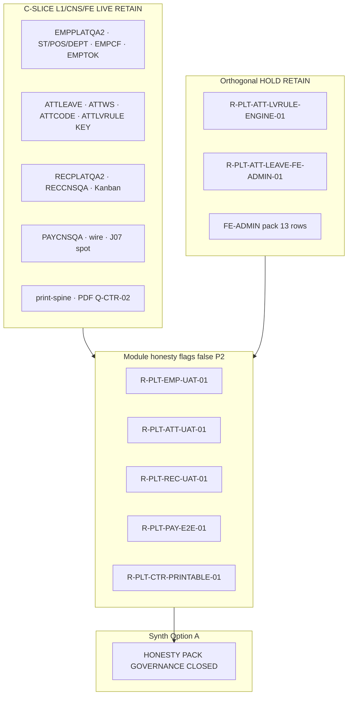

# PO-HRM-DYNAMIC-CONFIG-PLATFORM-HONESTY-PACK-SYNTH-SA-01 — Option/F.1 · Module honesty HOLD pack rollup (W8 U88)

| Field | Value |
|-------|--------|
| **work_item_id** | `PO-HRM-DYNAMIC-CONFIG-PLATFORM-HONESTY-PACK-SYNTH-SA-01` |
| **Parent** | U88 continuous · after **`PO-HRM-DYNAMIC-CONFIG-PLATFORM-EMP-UAT-HOLD-SA-01`** SEALED (Option A · **`R-PLT-EMP-UAT-01`** · SPEC **43380**) · peer sealed chain: PAY-E2E · CTR-PRINTABLE · ATT-UAT · REC-UAT · FE-ADMIN-PACK-SYNTH · FE-ADMIN-REOPEN-GATE-BA-01/02 |
| **Program** | `PO-HRM-CONTINUOUS-W8-20260807` |
| **lane** | governance · sa · **docs-only synth** · **NO** `apps/**` · **NO** execution unlock · **NO** flip `*_ready` |
| **change_mode** | **ADD** pack-level Option/F.1 inventory + disposition — consolidates five sealed **module honesty** HOLD seats |
| **Date** | 2026-08-08 |
| **Status** | **CONFIRMED** · Option **A** **LOCKED** · **ACCEPT pack as governance CLOSED (P2 HOLD inventory)** · no execution unlock |
| **Honesty (RETAIN all false)** | `hrm_personnel_uat_ready=false` · `attendance_uat_ready=false` / `hrm_attendance_uat_ready=false` · `recruitment_uat_ready=false` · `payroll_e2e_ready=false` · `contracts_printable_ready=false` · companion: `employees_e2e_linkage_ready=false` · `attendance_e2e_linkage_ready=false` · `jd_dynamic_done=false` · **`C-SLICE-≠-MODULE`** · U65 · **DENIED** module UAT · Phase1 DONE from slices |
| **ack_status** | **PASS_TO_PM** · **CONFIRMED** |

> **HARD EXIT GATE:** NFD path · UTF-8 **no BOM** · Shell **Length ≥ 8192** verified before CONFIRMED. Empty turn = INVALID.

---

## 1. Decision context (ADR option pack §1)

| | |
|--|--|
| **Decision title** | W8 **synth rollup**: single pack inventory for all sealed **module honesty** Option/F.1 seats — ACCEPT governance CLOSED vs unlock any `*_ready` flag vs invent module UAT / Phase1 DONE |
| **Requestor** | pm · U88 after EMP-UAT-HOLD SA SEAL |
| **Decision owner** | sa |
| **Related** | Dynamic Config Platform W8 · `PO_HRM_CONTINUOUS_W8_20260807.md` honesty LOCKED · peer [`FE-ADMIN-PACK-SYNTH-SA-01`](./PO-HRM-DYNAMIC-CONFIG-PLATFORM-FE-ADMIN-PACK-SYNTH-SA-01.md) · [`FE-ADMIN-REOPEN-GATE-BA-01`](./PO-HRM-DYNAMIC-CONFIG-PLATFORM-FE-ADMIN-REOPEN-GATE-BA-01.md) · [`FE-ADMIN-REOPEN-GATE-BA-02`](./PO-HRM-DYNAMIC-CONFIG-PLATFORM-FE-ADMIN-REOPEN-GATE-BA-02.md) · `SERVICE_READINESS` · `PROGRAM_JOURNEY_MAP` J-HRM-* |
| **Template** | `.cursor/templates/ADR_OPTION_TEMPLATE.md` §§1–7 + **§11 F.1 pack inventory** |
| **Non-goals** | Re-litigate each honesty seat; patch product code; flip any `*_ready=true`; claim module UAT; reopen sealed L1/CNS/consumer FE as unlock pretext |

### 1.1 Mission scope (what this seat owns)

This seat **does not** replace child SA honesty specs. It **indexes** them with **SPEC_LEN**, **residual_id**, **selected Option**, **program honesty flag**, and **class** (module gate vs orthogonal peer HOLD), then stamps **pack-level Option A** so PM can seal W8 **module honesty wave** without dispatching spurious execution Tasks.

**Included in inventory (mandatory — five module flags):**

| Domain | residual_id | honesty flag | Child evidence spec |
|--------|-------------|--------------|---------------------|
| EMP / personnel | `R-PLT-EMP-UAT-01` | `hrm_personnel_uat_ready=false` | `./PO-HRM-DYNAMIC-CONFIG-PLATFORM-EMP-UAT-HOLD-SA-01.md` |
| ATT / attendance | `R-PLT-ATT-UAT-01` | `attendance_uat_ready=false` | `./PO-HRM-DYNAMIC-CONFIG-PLATFORM-ATT-UAT-HOLD-SA-01.md` |
| REC / recruitment | `R-PLT-REC-UAT-01` | `recruitment_uat_ready=false` | `./PO-HRM-DYNAMIC-CONFIG-PLATFORM-REC-UAT-HOLD-SA-01.md` |
| PAY / payroll e2e | `R-PLT-PAY-E2E-01` | `payroll_e2e_ready=false` | `./PO-HRM-DYNAMIC-CONFIG-PLATFORM-PAY-E2E-HOLD-SA-01.md` |
| CTR / printable | `R-PLT-CTR-PRINTABLE-01` | `contracts_printable_ready=false` | `./PO-HRM-DYNAMIC-CONFIG-PLATFORM-CTR-PRINTABLE-HOLD-SA-01.md` |

**Related HOLD (not module-flag primary — cite only, RETAIN):**

| residual_id | Role | Spec |
|-------------|------|------|
| `R-PLT-ATT-LVRULE-ENGINE-01` | Accrual **engine** runtime HOLD · **≠** attendance UAT unlock | `./PO-HRM-DYNAMIC-CONFIG-PLATFORM-ATT-LVRULE-ENGINE-SA-01.md` |
| `R-PLT-ATT-LEAVE-FE-ADMIN-01` | Leave-type FE-ADMIN LIVE twin P2 NOTE · **≠** module flag | `./PO-HRM-DYNAMIC-CONFIG-PLATFORM-ATT-LEAVE-FE-ADMIN-NOTES-SA-01.md` |
| FE-ADMIN pack (13 rows) | Product admin NOTE / ABSENT class · **≠** module UAT | `./PO-HRM-DYNAMIC-CONFIG-PLATFORM-FE-ADMIN-PACK-SYNTH-SA-01.md` |
| Reopen-gate BA-01/02 | Sponsor-gated UF inventory · **does not unlock** from docs alone | `./PO-HRM-DYNAMIC-CONFIG-PLATFORM-FE-ADMIN-REOPEN-GATE-BA-01.md` · `./PO-HRM-DYNAMIC-CONFIG-PLATFORM-FE-ADMIN-REOPEN-GATE-BA-02.md` |

### 1.2 Pack taxonomy (architecture invariant)

Three **honesty layers** must not collapse in PM/QC narrative:

| Class | Meaning | Examples in W8 honesty pack |
|-------|---------|----------------------------|
| **Module honesty gate** | Program flag **false** until sponsor **named module UAT UF wave** + QC GO on **module** scope | Five rows §4 — **this synth** |
| **C-SLICE LIVE** | L1/CNS/browser GWC proven under U65 · evidence repeats flag **false** | EMPPLATQA2 · ATTPLATQA2 · RECPLATQA2 · PAYCNSQA · CTR print-spine |
| **Orthogonal HOLD** | P2 NOTE / engine / FE-ADMIN — **must not** flip module flags | LVRULE engine · LEAVE FE-ADMIN · FE-ADMIN pack |

**Unlock gate (all child honesty seats agree):** Option B execution or **`_*_ready=true`** **only** when sponsor opens **explicit module UAT wave** with UF/J-* inventory + QC gate — **not** from synth rollup alone.

### 1.3 W7.5 continuity (board `PO_HRM_CONTINUOUS_W8_20260807.md`)

| W7.5 carry | PM instruction | Honesty pack disposition |
|------------|----------------|--------------------------|
| `contracts_printable_ready` / payroll e2e | **DENIED invent flip** | **RETAIN** · sealed in PAY + CTR child specs · **no bundle flip** |
| All `*_ready=false` | **Honesty LOCKED** · C-SLICE | **Option A** — governance CLOSED inventory only |

---

## 2. Problem to solve (ADR §2)

- **Current state:** W8 continuous wave sealed **five** governance Option/F.1 seats for **module honesty** flags. Each seat minted a board **residual_id** with **ACCEPT_AS_IS_P2 HOLD** (Option A) and **DENY** invent flip. Numerous **C-SLICE** L1/CNS/FE consumer proofs exist in parallel with **every** QC/QA evidence file repeating **`_*_ready=false`**.
- **Constraints:** U65 · honesty flags false · C-SLICE · DENY seed · DENY reopen L1/CNS/consumer CLOSED as FAIL pretext · DENY bundle multi-flag promote · DENY confuse FE-ADMIN HOLD with module UAT.
- **Failure impact if mis-synthesized:** PM flips `hrm_personnel_uat_ready=true` because EMP catalog L1 passed → false UAT-READY · SERVICE_READINESS drift · reopen sealed consumer FE · billing waste · sponsor trust loss on «slice ≠ module».

---

## 3. Options (ADR §3)

### Option A — ACCEPT pack as governance **CLOSED** (P2 HOLD inventory only) — **RECOMMEND / LOCK**

| | |
|--|--|
| **Description** | Stamp W8 **module honesty pack** as **governance-complete** for Option/F.1 disposition: all rows in §4 inventory **RETAIN** child **selected_option A** and **HOLD**; **no** pack-level unlock to execution; **no** `_*_ready=true`; PM may narrow board wording to «HONESTY PACK SYNTH SEALED». |
| **Benefits** | Single SoT for QC/PM; honors every child LOCK; zero apps churn; aligns with FE-ADMIN synth + reopen-gate BA inventory |
| **Costs** | Module UAT narratives remain sponsor-gated; operators rely on C-SLICE evidence without module GO labels |
| **Risks** | HOLD misread as «product broken» → mitigated by §1.2 class table + allowed claims in child specs |
| **Gate** | All five child honesty seats PASS_TO_PM CONFIRMED — **true** as of EMP-UAT seal chain |

### Option B — UNLOCK one module flag from pack synth

| | |
|--|--|
| **Description** | Use synth seat to override child Option A HOLD and set **`hrm_personnel_uat_ready=true`** (or any peer flag) without sponsor module UF wave + QC module scope. |
| **Benefits** | None at pack level — would only make sense with **new** sponsor message + UF/J-* list |
| **Costs** | Violates child LOCK · W7.5 DENY invent flip · C-SLICE breach |
| **Risks** | QC NO-GO · false PROD/UAT promotion |
| **Gate** | **REJECT default** — synth found **no** sponsor module wave in this message |

### Option C — REJECT invent / reopen / flip / Phase1 DONE

| | |
|--|--|
| **Description** | Flip any `*_ready` · claim module UAT · Phase1 DONE · reopen L1/CNS/consumer CLOSED as FAIL · reopen LVRULE engine/FE-ADMIN as attendance unlock · bundle printable+payroll flip · seed · `apps/**` from synth. |
| **Benefits** | None |
| **Costs** | High — trust / seal loss |
| **Risks** | QC NO-GO class · U65 violation |
| **Gate** | **DENY** |

---

## 4. Master inventory table (SPEC_LEN · residual · Option · flag)

| # | Vertical | residual_id | selected_option | SPEC_LEN (bytes NFD) | Program honesty flag | Child spec (relative) |
|---|----------|-------------|-----------------|----------------------:|----------------------|------------------------|
| 1 | EMP | `R-PLT-EMP-UAT-01` | **A** ACCEPT_AS_IS_P2 HOLD | **43380** | `hrm_personnel_uat_ready=false` | `./PO-HRM-DYNAMIC-CONFIG-PLATFORM-EMP-UAT-HOLD-SA-01.md` |
| 2 | ATT | `R-PLT-ATT-UAT-01` | **A** ACCEPT_AS_IS_P2 HOLD | **32664** | `attendance_uat_ready=false` | `./PO-HRM-DYNAMIC-CONFIG-PLATFORM-ATT-UAT-HOLD-SA-01.md` |
| 3 | REC | `R-PLT-REC-UAT-01` | **A** ACCEPT_AS_IS_P2 HOLD | **35658** | `recruitment_uat_ready=false` | `./PO-HRM-DYNAMIC-CONFIG-PLATFORM-REC-UAT-HOLD-SA-01.md` |
| 4 | PAY | `R-PLT-PAY-E2E-01` | **A** ACCEPT_AS_IS_P2 HOLD | **28002** | `payroll_e2e_ready=false` | `./PO-HRM-DYNAMIC-CONFIG-PLATFORM-PAY-E2E-HOLD-SA-01.md` |
| 5 | CTR | `R-PLT-CTR-PRINTABLE-01` | **A** ACCEPT_AS_IS_P2 HOLD | **23993** | `contracts_printable_ready=false` | `./PO-HRM-DYNAMIC-CONFIG-PLATFORM-CTR-PRINTABLE-HOLD-SA-01.md` |

**Pack rollup SPEC_LEN (this file):** verified by WriteAllText Length gate (≥8192; target ≥12288).

**Cross-flag rule (all five child specs):** **FORBIDDEN** bundled flip (e.g. personnel + recruitment + attendance in one bus promote). Each flag unlocks only via **its** sponsor module UF wave + QC scope.

### 4.1 Allowed vs forbidden claims (pack rollup)

| Claim | Allowed? | Cite |
|-------|----------|------|
| «EMP platform L1 / browser slice GWC» | **YES** | EMP-UAT §1.2 LIVE inventory |
| «ATT catalog L1 chain GWC (leave, shift, ws, code, OT, LVRULE KEY)» | **YES** | ATT-UAT §1.2 |
| «REC stage L1 + CNS + Kanban slice GWC» | **YES** | REC-UAT §1.2 |
| «PAY CNS + wire + J07 spot slice GWC» | **YES** | PAY-E2E §1.2 |
| «CTR print-spine + PDF binary slice GWC» | **YES** | CTR-PRINTABLE §1.2 |
| «**Module** EMP/ATT/REC/PAY/CTR **UAT ready**» | **NO** | All flags **false** |
| «Set any `*_ready=true` from synth» | **NO** | Option C |
| «Phase 1 DONE / product GO from W8 platform wave» | **NO** | C-SLICE-≠-MODULE |

### 4.2 Related HOLD inventory (orthogonal — RETAIN, not module-flag rows)

| residual_id | selected_option | SPEC_LEN (cite) | Class | Rule |
|-------------|-----------------|-----------------|-------|------|
| `R-PLT-ATT-LVRULE-ENGINE-01` | **B** ACCEPT_AS_IS_P2 HOLD | 22246+ (engine SA) | Engine runtime | **DENY** reopen as `attendance_uat_ready` unlock |
| `R-PLT-ATT-LEAVE-FE-ADMIN-01` | **A** ACCEPT_AS_IS_P2 HOLD | 25795 (leave FE-ADMIN SA) | LIVE twin NOTE | **DENY** reopen as module ATT UAT |
| FE-ADMIN pack §4 (13 rows) | **A** pack CLOSED | 24195+ synth | FE admin NOTE/ABSENT | [`FE-ADMIN-PACK-SYNTH-SA-01`](./PO-HRM-DYNAMIC-CONFIG-PLATFORM-FE-ADMIN-PACK-SYNTH-SA-01.md) |
| Reopen-gate BA-01 §4 | HOLD inventory | 20612 | Sponsor UF placeholders | **No dispatch** from doc alone |
| Reopen-gate BA-02 §4.2 | ADD +3 rows | 20278 | LEAVE-FE-ADMIN · printable gate · engine cite | Extends BA-01 **without** wipe |

---

## 5. Trade-off matrix (ADR §4)

| Criteria | Weight | Option A (pack CLOSED) | Option B (flag flip) | Option C (invent/reopen) |
|---|--:|--:|--:|--:|
| Seal integrity (L1/CNS/consumer CLOSED) | 5 | 5 | 1 | 0 |
| PM/QC clarity (single honesty inventory) | 5 | 5 | 2 | 1 |
| Sponsor trust (no surprise UAT claim) | 5 | 5 | 1 | 0 |
| Honesty / C-SLICE compliance | 5 | 5 | 2 | 0 |
| Delivery cost | 3 | 5 | 3 | 1 |
| Future module UAT wave readiness | 2 | 4 | 4 | 0 |

---

## 6. Failure modes and mitigation (ADR §5)

| Option | Failure mode | Detection | Mitigation |
|--------|--------------|-----------|------------|
| A | PM treats honesty HOLD as «all modules broken» | User confusion | §1.2 C-SLICE vs module gate |
| A | QC promotes SERVICE_READINESS from slice GWC | Matrix audit | Cite §4.1 forbidden claims |
| B | Single-flag flip without UF wave | Bus honesty JSON diff | SA REJECT · child spec FORBIDDEN tables |
| B | Bundle flip printable + payroll | W7.5 row | CTR + PAY child **DENY bundled flip** |
| C | Reopen EMPCFQA / RECCNSQA as FAIL pretext | Dispatch pattern | Child FORBIDDEN reopen lists |
| C | Reopen LVRULE engine for ATT UAT | dev-be accrue wave | **`R-PLT-ATT-LVRULE-ENGINE-01` RETAIN** |
| C | Seed to complete module matrix | U65 | **DENIED** |

---

## 7. Decision (ADR §6)

| | |
|--|--|
| **Selected option** | **Option A** — **ACCEPT module honesty pack as governance CLOSED (P2 HOLD inventory)** |
| **Why** | All five mandatory child honesty seats sealed with consistent **Option A ACCEPT_AS_IS_P2 HOLD**; W7.5 **DENIED invent flip** honored; **no** pack-level sponsor module UF wave in this message; Option B/C violate child LOCK and program honesty LOCK on continuous board. |
| **Assumptions** | Sponsor did not open «module UAT wave EMP/ATT/REC/PAY/printable» in this message; FE-ADMIN + reopen-gate inventories remain valid parallel SoT. |
| **Rejected** | **Option B** — no named module UF wave with QC scope. **Option C** — full DENY list §7.1. |
| **Pack disposition** | **GOVERNANCE CLOSED** for W8 **module honesty** Option/F.1 wave · **all program flags remain false** per §4 |

### 7.1 FORBIDDEN after synth (DENY list)

- Flip **`hrm_personnel_uat_ready`** · **`attendance_uat_ready`** / **`hrm_attendance_uat_ready`** · **`recruitment_uat_ready`** · **`payroll_e2e_ready`** · **`contracts_printable_ready`** · companion flags without sponsor module wave
- Claim **module UAT** · **Phase1 DONE** · **UAT-READY** / **PROD-READY** from honesty HOLD inventory or C-SLICE GWC alone
- Reopen sealed **L1/CNS/consumer FE CLOSED** stamps as unlock pretext (EMP ST/POS/DEPT · EMPCF · REC CNS · PAY CNS · ATT CNS-02/05 · print-spine GWC)
- Reopen **`R-PLT-ATT-LVRULE-ENGINE-01`** · **`R-PLT-ATT-LEAVE-FE-ADMIN-01`** · FE-ADMIN pack rows as **module** honesty unlock
- Bundle multi-flag promote on one bus line (W7.5 spirit)
- **`apps/**`** edits · seed (U65) from this seat

### 7.2 Sponsor-gated module unlock map (not triggered by synth)

| Module | Trigger phrase (examples) | Preconditions |
|--------|---------------------------|---------------|
| EMP personnel | «**mở module UAT Nhân sự**» · UF-HRM-01..03* + J-HRM-03* | Explicit UF/J-* list · QC GO **module** scope · **single-flag** flip only after gate |
| ATT attendance | «**mở module UAT Chấm công**» · J-HRM-06* | Full ATT matrix · WAIVE_L2 policy explicit · **not** LVRULE engine alone |
| REC recruitment | «**mở module UAT Tuyển dụng**» · J-HRM-05* | UV/compare depth · **not** stage L1 alone |
| PAY payroll e2e | «**mở payroll e2e UAT**» · J-HRM-07* | Formula LIVE policy explicit · **not** CNS slice alone |
| CTR printable | «**mở printable UAT hợp đồng**» · Q-CTR-* UF | **Orthogonal** to payroll e2e — **no** bundle flip |

PM may trace UF placeholders from [`FE-ADMIN-REOPEN-GATE-BA-02`](./PO-HRM-DYNAMIC-CONFIG-PLATFORM-FE-ADMIN-REOPEN-GATE-BA-02.md) for **admin polish** waves — **distinct** from module honesty flags in §4.

---

## 8. Implementation and validation plan (ADR §7)

| Step | Owner | Action |
|------|-------|--------|
| 1 | pm | Seal board row `…-HONESTY-PACK-SYNTH-SA-01` **CONFIRMED**; attach this `evidence_path` |
| 2 | pm | **Do not** dispatch dev-fe/be/qc module GO from synth; RETAIN §4 residual_id HOLD on continuous board |
| 3 | ba-process | **Optional** ADD honesty rows to reopen-gate matrix (§7.2 module triggers) — **no** AC Nest redefine · **no** flip flags |
| 4 | qc | Audit: all §4 flags still false; no SERVICE_READINESS promote from HOLD inventory alone |
| 5 | sa | Append lesson to `.cursor/knowledge-base/sa.md` (reuse-tag: honesty-pack-synth-w8) |

**Rollback:** Re-open synth only if child honesty spec proven INVALID-HANDOFF — re-run **individual** seat, not pack flip.

**Success criteria:** SPEC_LEN ≥8192 · §4 complete · Option A LOCK · PASS_TO_PM · no apps diff.

---

## 9. Architecture diagram (honesty pack vs slices)



---

## 10. Honesty and C-SLICE (program flags — post synth)

| Flag | Value after synth | Primary residual |
|------|-------------------|------------------|
| `hrm_personnel_uat_ready` | **false** | `R-PLT-EMP-UAT-01` |
| `attendance_uat_ready` / `hrm_attendance_uat_ready` | **false** | `R-PLT-ATT-UAT-01` |
| `recruitment_uat_ready` | **false** | `R-PLT-REC-UAT-01` |
| `payroll_e2e_ready` | **false** | `R-PLT-PAY-E2E-01` |
| `contracts_printable_ready` | **false** | `R-PLT-CTR-PRINTABLE-01` |
| `employees_e2e_linkage_ready` | **false** | EMP-UAT companion |
| `attendance_e2e_linkage_ready` | **false** | ATT-UAT companion |
| `jd_dynamic_done` | **false** | REC-UAT companion |
| `C-SLICE-≠-MODULE` | **true** | Program doctrine |

Closing **honesty governance** **does not** promote any row above to **true**.

---

## 11. F.1 API / DB disposition notes (pack rollup — no physical unlock)

| Layer | Pack disposition |
|-------|------------------|
| **DB** | **No** synth-level schema change · all Nest Option B SoT **RETAIN** per vertical · honesty flags are **program/registry**, not DDL |
| **API** | **No** new routes from synth · L1/CNS endpoints **RETAIN** as C-SLICE evidence only |
| **FE** | Consumer CLOSED + FE-ADMIN HOLD **RETAIN** — orthogonal to module flags |
| **Module UAT F.1** | **Governance complete** for honesty wave; **physical** module UF matrix **sponsor-gated** per §7.2 |

### 11.1 F.1 row per module honesty residual (abbreviated)

| residual_id | Module gate | L1/CNS slice status | Flip flag? |
|-------------|-------------|---------------------|------------|
| `R-PLT-EMP-UAT-01` | Personnel UAT | Many LIVE slices SEALED | **DENY** until EMP module UF wave |
| `R-PLT-ATT-UAT-01` | ATT UAT | Catalog L1 chain LIVE | **DENY** until ATT module UF wave |
| `R-PLT-REC-UAT-01` | REC UAT | Stage L1 + CNS LIVE | **DENY** until REC module UF wave |
| `R-PLT-PAY-E2E-01` | PAY e2e | CNS + wire + spot LIVE | **DENY** until payroll e2e UF wave |
| `R-PLT-CTR-PRINTABLE-01` | Printable UAT | Print-spine + PDF LIVE | **DENY** until printable UF wave |

---

## 12. completion_report · handback

### completion_report

**Closed:** SA synth Option/F.1 for W8 **module honesty HOLD pack** — master inventory §4 with **SPEC_LEN** + **selected_option A** + **honesty flags** for EMP · ATT · REC · PAY · CTR; related HOLD cites §4.2 (LVRULE engine · LEAVE FE-ADMIN · FE-ADMIN pack · reopen-gate BA-01/02); **Option A LOCKED** — governance CLOSED, **no** execution unlock, **no** flag flip; Option B/C DENY; docs-only · no `apps/**`.

**Open / RETAIN:** All §4 `residual_id` rows remain **P2 HOLD** on product board until sponsor §7.2 module waves; all program flags **false**; C-SLICE evidence **RETAIN** as allowed narrow claims only.

### next_owner

**pm** — seal continuous board · choose **idle-ok governance** with honesty false **or** optional ba-process ADD to reopen-gate (not execution).

### next_dispatch_prompt (copy-ready — U88)

```text
work_item_id: PO-HRM-DYNAMIC-CONFIG-PLATFORM-HONESTY-PACK-SYNTH-SA-01
from_role: sa
to_role: pm
lane: governance · U88
ack_status: PASS_TO_PM
verdict: Option A LOCKED — module honesty pack governance CLOSED (P2 HOLD inventory)
action:
  1) Seal board row PO-HRM-DYNAMIC-CONFIG-PLATFORM-HONESTY-PACK-SYNTH-SA-01 = CONFIRMED
     · cite evidence docs/program/specs/PO-HRM-DYNAMIC-CONFIG-PLATFORM-HONESTY-PACK-SYNTH-SA-01.md
  2) RETAIN all §4 honesty flags false — no dev-fe/dev-be/qc module GO from synth
  3) Update PO_HRM_CONTINUOUS_W8_20260807.md honesty pack synth row PASS · TEAM_WORKING_NOW
  4) U88 branch A (optional): Task ba-process ADD-only honesty/module rows to reopen-gate inventory
     · entry: FE-ADMIN-REOPEN-GATE-BA-02 RETAIN · no Nest SoT redefine · no flip *_ready
     · exit: ADD rows for §7.2 module trigger phrases + UF placeholders · PASS_TO_PM
  5) U88 branch B (default if no sponsor module wave): PM -> ALL idle-ok W8 honesty governance slice
     · honesty false RETAIN · C-SLICE · next vertical per continuous board (non invent flip)
  DENY: flip any *_ready · claim module UAT · Phase1 DONE · reopen L1/CNS CLOSED · apps/**
evidence: docs/program/specs/PO-HRM-DYNAMIC-CONFIG-PLATFORM-HONESTY-PACK-SYNTH-SA-01.md
```

### evidence_path

`docs/program/specs/PO-HRM-DYNAMIC-CONFIG-PLATFORM-HONESTY-PACK-SYNTH-SA-01.md`

### ack_status

**PASS_TO_PM** · **CONFIRMED**

### RETAIN stamps (must_keep)

- Child honesty SPEC files §4 · FE-ADMIN-PACK-SYNTH Option A · reopen-gate BA-01/02 · LVRULE engine HOLD · LEAVE FE-ADMIN HOLD · W7.5 DENIED invent flip · honesty false · C-SLICE · U65

---

## 13. References

| Artifact | Role |
|----------|------|
| `docs/program/PO_HRM_CONTINUOUS_W8_20260807.md` | Honesty LOCKED · W7.5 carry |
| `docs/program/TEAM_WORKING_NOW.md` | Active governance dispatch |
| `docs/program/SERVICE_READINESS_UAT_PRODUCTION.md` | Must not promote from synth alone |
| `docs/program/PROGRAM_JOURNEY_MAP.md` | J-HRM-* module gates |
| `.cursor/templates/ADR_OPTION_TEMPLATE.md` | Option structure |
| Child specs `*UAT-HOLD*` · `*PAY-E2E*` · `*CTR-PRINTABLE*` | Authoritative per-seat LOCK |

---

## 14. Expanded audit trail (PM / QC — why Option B was not selected)

### 14.1 Slice GWC density does not imply module readiness

W8 proved **dozens** of narrow L1/CNS/browser slices under U65 while QC evidence **consistently** stamped honesty **false**. Each child honesty spec documents **LIVE inventory** tables (§1.2) explicitly **not** arguments for flag flip. Synth **confirms** intentional program honesty — not documentation drift.

### 14.2 Orthogonal HOLD must not flip module flags

**LVRULE engine** (`F-ATT-LEAVE-04` OUT), **LEAVE FE-ADMIN LIVE twin**, and **FE-ADMIN pack** address **product NOTE / engine / admin** classes. None substitute for **J-HRM-06*** module ATT UAT closure. **ATT-UAT** child **FORBIDDEN** reopen lists apply.

### 14.3 W7.5 printable + payroll pairing

Board grouped **`contracts_printable_ready`** and **`payroll_e2e_ready`** under **DENIED invent flip**. CTR and PAY child specs **DENY bundled flip**. Synth **does not** close either flag via peer success.

### 14.4 Reopen-gate BA inventory is parallel, not superseding

[`FE-ADMIN-REOPEN-GATE-BA-02`](./PO-HRM-DYNAMIC-CONFIG-PLATFORM-FE-ADMIN-REOPEN-GATE-BA-02.md) ADD row for **`R-PLT-CTR-PRINTABLE-01`** as **honesty/module gate** class — sponsor **printable UAT wave** required. Module honesty synth **indexes** that relationship without duplicating BA-02 §4.2 table rows.

### 14.5 QC audit checklist (post synth)

- [ ] All five §4 flags still **false** on board and latest QC evidence
- [ ] No matrix row **🟢 module UAT** promoted from HOLD inventory alone
- [ ] SERVICE_READINESS language uses **C-SLICE** vs **module** discrimination
- [ ] Dispatch queue has **no** dev-fe/be justified only by «catalog L1 passed»
- [ ] Sponsor module wave (if any) cites **explicit UF/J-*** before flag flip Task

---

*End of SA Option/F.1 — MODULE HONESTY PACK SYNTH — Option A LOCKED governance CLOSED · PASS_TO_PM*
