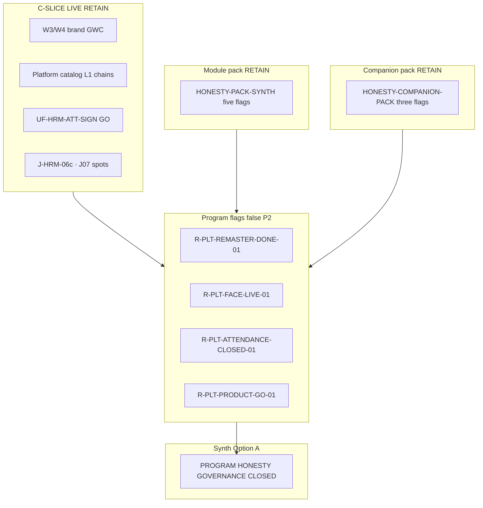

# PO-HRM-DYNAMIC-CONFIG-PLATFORM-HONESTY-PROGRAM-PACK-SYNTH-SA-03 — Option/F.1 · Program honesty HOLD pack rollup (W8 U88)

| Field | Value |
|-------|--------|
| **work_item_id** | `PO-HRM-DYNAMIC-CONFIG-PLATFORM-HONESTY-PROGRAM-PACK-SYNTH-SA-03` |
| **Parent** | U88 continuous · after **`PO-HRM-DYNAMIC-CONFIG-PLATFORM-PRODUCT-GO-HOLD-SA-01`** SEALED (Option A · **`R-PLT-PRODUCT-GO-01`** · SPEC **31190**) · peer sealed program chain: REMASTER-DONE · FACE-LIVE · ATTENDANCE-CLOSED · **`HONESTY-PACK-SYNTH-SA-01`** (module five flags · SPEC **25083**) · **`HONESTY-COMPANION-PACK-SYNTH-SA-02`** (companion three flags · SPEC **30246**) |
| **Program** | `PO-HRM-CONTINUOUS-W8-20260807` |
| **lane** | governance · sa · **docs-only synth** · **NO** `apps/**` · **NO** execution unlock · **NO** flip any program/module/companion flag |
| **change_mode** | **ADD** program-pack Option/F.1 inventory + disposition — consolidates **four** sealed **program honesty** HOLD seats (top-level program gates after module + companion packs) |
| **Date** | 2026-08-08 |
| **Status** | **CONFIRMED** · Option **A** **LOCKED** · **ACCEPT program honesty pack as governance CLOSED (P2 HOLD inventory)** · no execution unlock |
| **Honesty (RETAIN all false)** | **`remaster_program_done=false`** · **`face_live=false`** · **`attendance_closed=false`** · **`product_go=false`** · **plus module pack RETAIN:** five `*_ready=false` · **plus companion pack RETAIN:** `jd_dynamic_done=false` · `employees_e2e_linkage_ready=false` · `attendance_e2e_linkage_ready=false` · **`C-SLICE-≠-MODULE`** · U65 · **DENIED** Phase1 DONE · product GO · PROD-READY · program flag flip from synth |
| **ack_status** | **PASS_TO_PM** · **CONFIRMED** |

> **HARD EXIT GATE:** NFD path · UTF-8 **no BOM** · Shell **Length ≥ 8192** verified before CONFIRMED. Empty turn = INVALID.

---

## 1. Decision context (ADR option pack §1)

| | |
|--|--|
| **Decision title** | W8 **program synth rollup**: single pack inventory for all sealed **program honesty** Option/F.1 seats — ACCEPT governance CLOSED vs unlock any program flag vs invent Phase1 DONE / product GO / PROD-READY from slice inventory |
| **Requestor** | pm · U88 after PRODUCT-GO-HOLD SA SEAL · mission **HONESTY-PROGRAM-PACK-SYNTH-SA-03** |
| **Decision owner** | sa |
| **Related** | Dynamic Config Platform W8 · `PO_HRM_CONTINUOUS_W8_20260807.md` honesty LOCKED · [`HONESTY-PACK-SYNTH-SA-01`](./PO-HRM-DYNAMIC-CONFIG-PLATFORM-HONESTY-PACK-SYNTH-SA-01.md) · [`HONESTY-COMPANION-PACK-SYNTH-SA-02`](./PO-HRM-DYNAMIC-CONFIG-PLATFORM-HONESTY-COMPANION-PACK-SYNTH-SA-02.md) · [`FE-ADMIN-REOPEN-GATE-BA-01`](./PO-HRM-DYNAMIC-CONFIG-PLATFORM-FE-ADMIN-REOPEN-GATE-BA-01.md) · BA-02 · BA-03 · BA-04 · `PHASE1_PRODUCT_COMPLETION_TODO.md` · `verify:product:completion` · `SERVICE_READINESS_UAT_PRODUCTION.md` |
| **Template** | `.cursor/templates/ADR_OPTION_TEMPLATE.md` §§1–7 + **§11 F.1 program pack inventory** |
| **Non-goals** | Re-litigate each program child SA spec line-by-line; patch product code; flip any program/module/companion `*_ready=true`; claim Phase1 DONE; invent Nest dual admin |

### 1.1 Mission scope (what this seat owns)

This seat **does not** replace child **program** honesty specs or the **module** / **companion** honesty packs. It **indexes** the **four mandatory program rows** with **SPEC_LEN**, **residual_id**, **selected Option**, **program honesty flag**, and **class** (program gate vs module gate vs companion gate vs C-SLICE), then stamps **pack-level Option A** so PM can seal W8 **program honesty wave** without dispatching spurious execution Tasks.

**Included in inventory (mandatory — four program flags):**

| # | Domain | residual_id | honesty flag | Child evidence spec | SPEC_LEN (bytes NFD) |
|---|--------|-------------|--------------|---------------------|----------------------:|
| 1 | UI brand remaster program | `R-PLT-REMASTER-DONE-01` | `remaster_program_done=false` | `./PO-HRM-DYNAMIC-CONFIG-PLATFORM-REMASTER-DONE-HOLD-SA-01.md` | **30462** |
| 2 | Face product LIVE | `R-PLT-FACE-LIVE-01` | `face_live=false` | `./PO-HRM-DYNAMIC-CONFIG-PLATFORM-FACE-LIVE-HOLD-SA-01.md` | **30710** |
| 3 | Attendance module closure | `R-PLT-ATTENDANCE-CLOSED-01` | `attendance_closed=false` | `./PO-HRM-DYNAMIC-CONFIG-PLATFORM-ATTENDANCE-CLOSED-HOLD-SA-01.md` | **31700** |
| 4 | Phase 1 product GO | `R-PLT-PRODUCT-GO-01` | `product_go=false` | `./PO-HRM-DYNAMIC-CONFIG-PLATFORM-PRODUCT-GO-HOLD-SA-01.md` | **31190** |

**RETAIN (cite only — do not redefine):**

| Source | Content RETAIN |
|--------|----------------|
| **HONESTY-PACK-SYNTH-SA-01** §4 | Five module flags: EMP · ATT · REC · PAY · CTR — all **Option A** · all **false** · SPEC **25083** |
| **HONESTY-COMPANION-PACK-SYNTH-SA-02** §4 | Three companion flags: JD dynamic · EMP e2e · ATT e2e — all **Option A** · all **false** · SPEC **30246** |
| **FE-ADMIN-REOPEN-GATE-BA-01** | Sponsor-gated UF placeholders · **no flip from doc alone** |
| **FE-ADMIN-REOPEN-GATE-BA-02** | ADD rows (LEAVE-FE-ADMIN · printable gate · engine cite) · extends BA-01 |
| **FE-ADMIN-REOPEN-GATE-BA-03** | ADD rows **#17–21** · module UF placeholders |
| **FE-ADMIN-REOPEN-GATE-BA-04** | ADD rows **#22–24** · companion UF placeholders · post companion-pack synth |
| **C-SLICE-≠-MODULE** | Program doctrine · slice GWC **≠** module UAT **≠** companion e2e **≠** program GO |

### 1.2 Program vs module vs companion taxonomy (architecture invariant)

Five **honesty layers** must not collapse in PM/QC narrative (extends module + companion pack §1.2):

| Class | Meaning | Examples in W8 program pack |
|-------|---------|----------------------------|
| **Program honesty gate** | Top-level program flag **false** until sponsor **named program wave** (remaster DONE · Face LIVE · Attendance CLOSED · product GO) | Four rows §4 — **this synth** |
| **Module honesty gate** | Program flag **false** until sponsor **named module UAT UF wave** | Five flags in HONESTY-PACK-SYNTH-SA-01 — **RETAIN · not re-indexed** |
| **Companion honesty gate** | Program flag **false** until sponsor **named e2e/JD wave** | Three flags in COMPANION-PACK-SYNTH-SA-02 — **RETAIN** |
| **C-SLICE LIVE** | L1/CNS/browser/brand GWC under U65 · evidence repeats program/module/companion **false** | W3/W4 brand · platform catalog · UF-HRM-ATT-SIGN · J-06c spot |
| **Orthogonal HOLD** | P2 NOTE / engine / FE-ADMIN — **must not** flip program flags | LVRULE engine · FE-ADMIN pack · SITE-UNKNOWN |

**Unlock gate (all child program seats agree):** Option B execution or program flag `=true` **only** when sponsor opens **explicit wave** with UF/J-* inventory + QC GO on **declared program scope** — **not** from program synth rollup alone.

### 1.3 Sealed chain order (governance continuity)

```text
HONESTY-PACK-SYNTH-SA-01 (module five flags · SPEC 25083)
  → HONESTY-COMPANION-PACK-SYNTH-SA-02 (companion three flags · SPEC 30246)
  → FE-ADMIN-REOPEN-GATE-BA-04 SEAL (#22–24)
  → REMASTER-DONE-HOLD-SA-01 (R-PLT-REMASTER-DONE-01 · SPEC 30462)
  → FACE-LIVE-HOLD-SA-01 (R-PLT-FACE-LIVE-01 · SPEC 30710)
  → ATTENDANCE-CLOSED-HOLD-SA-01 (R-PLT-ATTENDANCE-CLOSED-01 · SPEC 31700)
  → PRODUCT-GO-HOLD-SA-01 (R-PLT-PRODUCT-GO-01 · SPEC 31190)
  → PROGRAM-PACK-SYNTH-SA-03 (this seat)
```

Each child seat **minted** its residual_id with **Option A ACCEPT_AS_IS_P2 HOLD** and **DENY** invent flip. This synth **confirms program pack closure** without adding new residuals.

### 1.4 W8 board honesty LOCKED (RETAIN)

From `PO_HRM_CONTINUOUS_W8_20260807.md`:

- **Honesty LOCKED:** all `*_ready=false` · **`C-SLICE-≠-MODULE`**
- W7.5 **DENIED invent flip** on printable + payroll e2e — honored via module pack
- Program synth **does not** change board honesty JSON — **indexes** sealed SA disposition only

---

## 2. Problem to solve (ADR §2)

- **Current state:** W8 continuous wave sealed **four** governance Option/F.1 seats for **program honesty** flags after module + companion pack synths and FE-ADMIN reopen-gate BA-04. Each seat minted a board **residual_id** with **ACCEPT_AS_IS_P2 HOLD** (Option A) and **DENY** conflating C-SLICE LIVE with program closure. Brand W3/W4 GWC · platform catalog density · UF-HRM-ATT-SIGN GO · J-06c FULL GWC all coexist with **every** gate footer stamping **`remaster_program_done=false`**, **`face_live=false`**, **`attendance_closed=false`**, **`product_go=false`**.
- **Constraints:** U65 · all honesty flags false · C-SLICE · DENY seed · DENY reopen sealed brand/catalog GWC as FAIL pretext · DENY bundle multi-flag promote · DENY confuse FE slice «CLOSED» with **`attendance_closed=true`** · **DENY** invent Nest dual admin.
- **Failure impact if mis-synthesized:** PM sets **`product_go=true`** because W8 slice count is large → false Phase1 DONE narrative · SERVICE_READINESS PROD promote · charter violation · sponsor trust loss on «GWC volume ≠ program GO» and «brand chrome ≠ remaster DONE».

---

## 3. Options (ADR §3)

### Option A — ACCEPT program pack as governance **CLOSED** (P2 HOLD inventory only) — **RECOMMEND / LOCK**

| | |
|--|--|
| **Description** | Stamp W8 **program honesty pack** as **governance-complete** for Option/F.1 disposition: all rows in §4 inventory **RETAIN** child **selected_option A** and **HOLD**; **no** pack-level unlock to execution; **no** program flag `=true`; PM may narrow board wording to «HONESTY PROGRAM PACK SYNTH SEALED». |
| **Benefits** | Single SoT for QC/PM for program leg; honors every child LOCK; zero apps churn; completes honesty registry chain remaster → face → attendance_closed → product_go |
| **Costs** | Program closure narratives remain sponsor-gated; operators rely on C-SLICE evidence without program GO labels |
| **Risks** | HOLD misread as «product broken» → mitigated by §1.2 class table + LIVE inventories in child specs |
| **Gate** | All four child program seats PASS_TO_PM CONFIRMED — **true** as of PRODUCT-GO-HOLD seal |

### Option B — UNLOCK one program flag from pack synth

| | |
|--|--|
| **Description** | Use synth seat to override child Option A HOLD and set e.g. **`product_go=true`** because W8 platform wave delivered substantial depth, without sponsor Phase1 product GO wave + `verify:product:completion` + QC S5 scope. |
| **Benefits** | None at pack level — would only make sense with **new** sponsor message + program exit criteria list |
| **Costs** | Violates child LOCK · charter · C-SLICE breach · may drag module/companion flip without dual QC scope |
| **Risks** | QC NO-GO · false PROD-READY |
| **Gate** | **REJECT default** — synth found **no** sponsor program GO wave in this message |

### Option C — REJECT invent / reopen / flip / Phase1 DONE

| | |
|--|--|
| **Description** | Flip any program/module/companion flag · claim Phase1 DONE · PROD-READY · reopen W3/W4 brand QC as FAIL · reopen ATT FE «CLOSED» as **`attendance_closed=true`** · promote PROP-03e SKIP to Face LIVE · seed · **`apps/**`** · invent Nest dual from synth. |
| **Benefits** | None |
| **Costs** | High — trust / seal loss |
| **Risks** | QC NO-GO class · U65 violation |
| **Gate** | **DENY** |

---

## 4. Master inventory table (SPEC_LEN · residual · Option · flag)

| # | Vertical | residual_id | selected_option | SPEC_LEN (bytes NFD) | Program honesty flag | Child spec (relative) |
|---|----------|-------------|-----------------|----------------------:|----------------------|------------------------|
| 1 | Brand remaster program | `R-PLT-REMASTER-DONE-01` | **A** ACCEPT_AS_IS_P2 HOLD | **30462** | `remaster_program_done=false` | `./PO-HRM-DYNAMIC-CONFIG-PLATFORM-REMASTER-DONE-HOLD-SA-01.md` |
| 2 | Face product LIVE | `R-PLT-FACE-LIVE-01` | **A** ACCEPT_AS_IS_P2 HOLD | **30710** | `face_live=false` | `./PO-HRM-DYNAMIC-CONFIG-PLATFORM-FACE-LIVE-HOLD-SA-01.md` |
| 3 | Attendance module closure | `R-PLT-ATTENDANCE-CLOSED-01` | **A** ACCEPT_AS_IS_P2 HOLD | **31700** | `attendance_closed=false` | `./PO-HRM-DYNAMIC-CONFIG-PLATFORM-ATTENDANCE-CLOSED-HOLD-SA-01.md` |
| 4 | Phase 1 product GO | `R-PLT-PRODUCT-GO-01` | **A** ACCEPT_AS_IS_P2 HOLD | **31190** | `product_go=false` | `./PO-HRM-DYNAMIC-CONFIG-PLATFORM-PRODUCT-GO-HOLD-SA-01.md` |

**Pack rollup SPEC_LEN (this file):** verified by WriteAllText Length gate (≥8192; target ≥12288).

**Cross-flag rule (all four child specs + module + companion packs):** **FORBIDDEN** bundled flip (e.g. `product_go` + `remaster_program_done` + `attendance_closed` + module `*_ready` on one bus promote). Each flag unlocks only via **its** sponsor wave + QC scope.

### 4.1 Allowed vs forbidden claims (program pack rollup)

| Claim | Allowed? | Cite |
|-------|----------|------|
| «W3/W4 brand chrome GWC CLOSED (Precision Motion)» | **YES** | REMASTER-DONE §1.2 · **≠ remaster_program_done=true** |
| «Face GĐ1 honesty · PROP-03e SKIP · ATT-DIALOG-EXT HOLD» | **YES** | FACE-LIVE §1.2 · **≠ face_live=true** |
| «ATT catalog L1 + FE slice CLOSED + UF-SIGN GO + J-06c GWC» | **YES** | ATTENDANCE-CLOSED §1.2 · **≠ attendance_closed=true** |
| «W8 platform catalog + brand + UF slice inventory (delivery fact)» | **YES** | PRODUCT-GO §1.2 · **≠ product_go=true** |
| «Module/companion honesty pack governance CLOSED (P2 inventory)» | **YES** | HONESTY-PACK-SYNTH · COMPANION-PACK-SYNTH |
| «Set any **program** flag `=true` from synth» | **NO** | Option C |
| «Set any **module/companion** flag from program synth» | **NO** | Module/companion pack §7.1 |
| «Phase 1 DONE / PROD-READY from W8 wave» | **NO** | PRODUCT-GO · charter |
| «Program HOLD = product broken» | **NO** | OPEN program spine = sponsor-gated waves |

### 4.2 Full honesty stack (post program synth — RETAIN all false)

| Layer | Flags (all **false** unless sponsor wave) | Primary pack spec |
|-------|-------------------------------------------|-------------------|
| **Program (this synth)** | `remaster_program_done` · `face_live` · `attendance_closed` · `product_go` | **This file §4** |
| **Module** | `hrm_personnel_uat_ready` · `attendance_uat_ready` · `recruitment_uat_ready` · `payroll_e2e_ready` · `contracts_printable_ready` | HONESTY-PACK-SYNTH-SA-01 §4 |
| **Companion** | `jd_dynamic_done` · `employees_e2e_linkage_ready` · `attendance_e2e_linkage_ready` | COMPANION-PACK-SYNTH-SA-02 §4 |
| **Doctrine** | `C-SLICE-≠-MODULE` = **true** (invariant) | W8 board |

Closing **program honesty governance** **does not** promote any row above to **true**.

### 4.3 Reopen-gate BA inventory (parallel SoT — RETAIN)

| Artifact | Role | Program synth rule |
|----------|------|---------------------|
| **FE-ADMIN-REOPEN-GATE-BA-01** | UF placeholder inventory | **No dispatch** from doc alone · **≠** program flip |
| **FE-ADMIN-REOPEN-GATE-BA-02** | ADD module/companion gate rows | Trace printable · leave FE-ADMIN · **no flip** |
| **FE-ADMIN-REOPEN-GATE-BA-03** | ADD **#17–21** | Module UF placeholders |
| **FE-ADMIN-REOPEN-GATE-BA-04** | ADD **#22–24** | Companion UF placeholders · post companion synth |

PM may Task **ba-process BA-05** ADD-only rows for **program** trigger phrases (§7.2) — **distinct** from execution unlock.

### 4.4 Peer dependency graph (program flags)

| Program flag | Depends on (conceptual closure order — not auto-flip) | Child residual |
|--------------|------------------------------------------------------|----------------|
| `remaster_program_done` | Full screen remaster inventory · mobile batch · peer gates open | `R-PLT-REMASTER-DONE-01` |
| `face_live` | Face product UF · model/backend · biometric QC scope | `R-PLT-FACE-LIVE-01` |
| `attendance_closed` | Full J-HRM-06* · module ATT UAT · engine policy · **distinct** from FE slice CLOSED | `R-PLT-ATTENDANCE-CLOSED-01` |
| `product_go` | Module + companion + program gates · Phase1 machine · QC S5 · J-* program closure | `R-PLT-PRODUCT-GO-01` |

Synth **does not** assert closure order triggers flip — **documents** sponsor-gated waves only.

---

## 5. Trade-off matrix (ADR §4)

| Criteria | Weight | Option A (program CLOSED) | Option B (flag flip) | Option C (invent/reopen) |
|---|--:|--:|--:|--:|
| Seal integrity (brand/catalog GWC SEALED) | 5 | 5 | 1 | 0 |
| PM/QC clarity (single program inventory) | 5 | 5 | 2 | 1 |
| Sponsor trust (no surprise program GO) | 5 | 5 | 1 | 0 |
| Honesty / C-SLICE compliance | 5 | 5 | 2 | 0 |
| Alignment with module + companion pack synth | 4 | 5 | 2 | 0 |
| Charter / Phase1 gate integrity | 5 | 5 | 1 | 0 |
| Delivery cost | 3 | 5 | 3 | 1 |
| Future program wave readiness | 2 | 4 | 4 | 0 |

---

## 6. Failure modes and mitigation (ADR §5)

| Option | Failure mode | Detection | Mitigation |
|--------|--------------|-----------|------------|
| A | PM treats program HOLD as «Phase1 blocked entirely» | User confusion | §1.2 + child LIVE tables |
| A | QC promotes PROD from W8 GWC count | SERVICE_READINESS audit | §4.1 forbidden claims |
| B | Single program flip without exit criteria | Bus honesty JSON diff | SA REJECT · child FORBIDDEN tables |
| B | `product_go=true` while module `*_ready=false` | Dual matrix | PRODUCT-GO child §1.3 OPEN depth |
| C | Reopen W3/W4 brand QC as remaster unlock | Duplicate QA | REMASTER-DONE **FORBIDDEN reopen** |
| C | FE «CLOSED» → `attendance_closed=true` | Wording drift | ATTENDANCE-CLOSED **L-ATT-CLOSED-04** |
| C | GĐ1 Face banner → `face_live=true` | Evidence misread | FACE-LIVE **PROP-03e RETAIN** |
| C | Bundle all honesty flags on one promote | W7.5 + packs | **DENY** per cross-flag rule §4 |
| C | Seed · **`apps/**`** from synth | PM dispatch | **DENIED** · U65 |

---

## 7. Decision (ADR §6)

| | |
|--|--|
| **Selected option** | **Option A** — **ACCEPT program honesty pack as governance CLOSED (P2 HOLD inventory)** |
| **Why** | All four mandatory child program honesty seats sealed with consistent **Option A ACCEPT_AS_IS_P2 HOLD**; module + companion pack synths already CLOSED; PRODUCT-GO seat was terminal vertical in registry chain; **no** pack-level sponsor program GO wave in this message; Option B/C violate child LOCK and W8 honesty LOCK. |
| **Assumptions** | Sponsor did not open «Phase1 product GO» · «full remaster DONE» · «Face LIVE» · «Attendance module CLOSED» in this message; FE-ADMIN reopen-gate BA-01..04 remain valid parallel SoT. |
| **Rejected** | **Option B** — no named program wave with machine gates. **Option C** — full DENY list §7.1. |
| **Pack disposition** | **GOVERNANCE CLOSED** for W8 **program honesty** Option/F.1 wave · **all program flags remain false** per §4 |

### 7.1 FORBIDDEN after synth (DENY list)

- Flip **`remaster_program_done`** · **`face_live`** · **`attendance_closed`** · **`product_go`** without sponsor program wave + QC scope
- Flip any **module** or **companion** flag from program synth (cite module/companion packs)
- Claim **Phase 1 DONE** · **product GO** · **PROD-READY** · **UAT-READY program-wide** from HOLD inventory or C-SLICE GWC alone
- Reopen sealed **W3/W4 brand QC** · **platform L1 GWC** · **UF-HRM-ATT-SIGN GO** as FAIL pretext to force program flip
- Conflate **FE slice CLOSED** with **`attendance_closed=true`**
- Promote **PROP-03e SKIP** to Face LIVE without Face product wave
- Bundle multi-flag promote on one bus line (W7.5 + all packs)
- **`apps/**`** edits · seed (U65) · invent Nest dual from this seat

### 7.2 Sponsor-gated program unlock map (not triggered by synth)

| Program gate | Trigger phrase (examples) | Preconditions |
|--------------|---------------------------|---------------|
| Remaster DONE | «**mở wave đóng remaster toàn chương trình**» · full screen inventory | UF/J-* list · QC GO **program remaster** scope · **single-flag** flip only after gate |
| Face LIVE | «**mở Face product LIVE / biometric UAT**» | Model/backend spine · UF matrix · **not** GĐ1 alone |
| Attendance CLOSED | «**mở đóng module Chấm công**» · full J-HRM-06* | Module UAT + engine policy · **not** catalog L1 alone |
| Product GO | «**mở Phase 1 product GO / PROD cutover**» | `verify:product:completion` · module/companion/program gates · QC S5 · **not** slice count alone |

PM may trace UF placeholders from reopen-gate BA rows for **inventory** — **distinct** from program flag flip.

---

## 8. Implementation and validation plan (ADR §7)

| Step | Owner | Action |
|------|-------|--------|
| 1 | pm | Seal board row `…-HONESTY-PROGRAM-PACK-SYNTH-SA-03` **CONFIRMED**; attach this `evidence_path` |
| 2 | pm | **Do not** dispatch dev-fe/be/qc program GO from synth; RETAIN §4 residual_id HOLD on continuous board |
| 3 | ba-process | **Optional** **BA-05** ADD program honesty rows to reopen-gate matrix (§7.2 triggers) — **no** AC Nest redefine · **no** flip flags |
| 4 | qc | Audit: all §4 + module + companion flags still false; no SERVICE_READINESS PROD promote from synth alone |
| 5 | sa | Append lesson to `.cursor/knowledge-base/sa.md` (reuse-tag: honesty-program-pack-synth-w8) |

**Rollback:** Re-open synth only if child program honesty spec proven INVALID-HANDOFF — re-run **individual** seat, not pack flip.

**Success criteria:** SPEC_LEN ≥8192 · §4 complete · Option A LOCK · PASS_TO_PM · no apps diff.

---

## 9. Architecture diagram (program pack vs module/companion vs slices)



---

## 10. Honesty and C-SLICE (full stack — post program synth)

| Flag | Value after synth | Primary residual / pack |
|------|-------------------|-------------------------|
| `remaster_program_done` | **false** | `R-PLT-REMASTER-DONE-01` |
| `face_live` | **false** | `R-PLT-FACE-LIVE-01` |
| `attendance_closed` | **false** | `R-PLT-ATTENDANCE-CLOSED-01` |
| `product_go` | **false** | `R-PLT-PRODUCT-GO-01` |
| Module five `*_ready` | **false** | HONESTY-PACK-SYNTH-SA-01 |
| Companion three flags | **false** | COMPANION-PACK-SYNTH-SA-02 |
| `C-SLICE-≠-MODULE` | **true** | Program doctrine |

Closing **program honesty governance** **does not** promote any row above to **true**.

---

## 11. F.1 API / DB disposition notes (program pack rollup — no physical unlock)

| Layer | Pack disposition |
|-------|------------------|
| **DB** | **No** synth-level schema change · honesty flags are **program/registry**, not DDL |
| **API** | **No** new routes from synth · brand/catalog endpoints **RETAIN** as C-SLICE evidence only |
| **FE** | Brand remaster · Face HOLD · ATT consumer CLOSED **RETAIN** — orthogonal to program flags |
| **Program F.1** | **Governance complete** for W8 program honesty wave; **physical** Phase1 / PROD matrix **sponsor-gated** per §7.2 |

### 11.1 F.1 row per program honesty residual (abbreviated)

| residual_id | Program gate | C-SLICE / LIVE status | Flip flag? |
|-------------|--------------|----------------------|------------|
| `R-PLT-REMASTER-DONE-01` | Full remaster program DONE | W3/W4 brand GWC SEALED | **DENY** until remaster program wave |
| `R-PLT-FACE-LIVE-01` | Face product LIVE | GĐ1 · PROP-03e SKIP · W4 HOLD | **DENY** until Face product wave |
| `R-PLT-ATTENDANCE-CLOSED-01` | Attendance module CLOSED | Catalog L1 · FE slice CLOSED · SIGN UF | **DENY** until ATT closure wave |
| `R-PLT-PRODUCT-GO-01` | Phase1 product GO | Large W8 slice inventory | **DENY** until product GO wave + machine gates |

---

## 12. completion_report · handback

### completion_report

**Closed:** SA synth Option/F.1 for W8 **program honesty HOLD pack** — master inventory §4 with **SPEC_LEN** + **selected_option A** + **honesty flags** for remaster · face · attendance_closed · product_go; **RETAIN** module pack (HONESTY-PACK-SYNTH-SA-01) · companion pack (HONESTY-COMPANION-PACK-SYNTH-SA-02) · FE-ADMIN reopen-gate BA-01..04 · C-SLICE; **Option A LOCKED** — governance CLOSED, **no** execution unlock, **no** flag flip; Option B/C DENY; docs-only · no `apps/**`.

**Open / RETAIN:** All §4 `residual_id` rows remain **P2 HOLD** on product board until sponsor §7.2 program waves; all module + companion flags **false**; C-SLICE evidence **RETAIN** as allowed narrow claims only.

### next_owner

**pm** — seal continuous board · choose **idle-ok full honesty governance** **or** optional **ba-process BA-05** ADD program rows to reopen-gate (not execution).

### next_dispatch_prompt (copy-ready — U88)

```text
work_item_id: PO-HRM-DYNAMIC-CONFIG-PLATFORM-HONESTY-PROGRAM-PACK-SYNTH-SA-03
from_role: sa
to_role: pm
lane: governance · U88
ack_status: PASS_TO_PM
verdict: Option A LOCKED — program honesty pack governance CLOSED (P2 HOLD inventory)
action:
  1) Seal board row PO-HRM-DYNAMIC-CONFIG-PLATFORM-HONESTY-PROGRAM-PACK-SYNTH-SA-03 = CONFIRMED
     · cite evidence docs/program/specs/PO-HRM-DYNAMIC-CONFIG-PLATFORM-HONESTY-PROGRAM-PACK-SYNTH-SA-03.md
  2) RETAIN all §4 program flags false + module pack + companion pack — no dev-fe/dev-be/qc program GO from synth
  3) Update PO_HRM_CONTINUOUS_W8_20260807.md program honesty synth row PASS · TEAM_WORKING_NOW
  4) U88 branch A (optional): Task ba-process PO-HRM-DYNAMIC-CONFIG-PLATFORM-FE-ADMIN-REOPEN-GATE-BA-05
     · ADD-only program honesty rows (#25+) for §7.2 trigger phrases (remaster DONE · Face LIVE · attendance_closed · product_go)
     · entry: BA-04 RETAIN · HONESTY-PROGRAM-PACK-SYNTH-SA-03 RETAIN · no Nest SoT redefine · no flip any flag
     · exit: ADD rows + traceability to R-PLT-REMASTER-DONE-01 .. R-PLT-PRODUCT-GO-01 · PASS_TO_PM
  5) U88 branch B (default if no sponsor program wave): PM -> ALL idle-ok W8 **full honesty governance** CLOSED
     · module + companion + program packs SEALED · all honesty false RETAIN · C-SLICE · next vertical per continuous board (non invent flip)
  DENY: flip any program/module/companion flag · Phase1 DONE · product GO · PROD-READY · reopen sealed GWC · apps/**
evidence: docs/program/specs/PO-HRM-DYNAMIC-CONFIG-PLATFORM-HONESTY-PROGRAM-PACK-SYNTH-SA-03.md
```

### evidence_path

`docs/program/specs/PO-HRM-DYNAMIC-CONFIG-PLATFORM-HONESTY-PROGRAM-PACK-SYNTH-SA-03.md`

### ack_status

**PASS_TO_PM** · **CONFIRMED**

### RETAIN stamps (must_keep)

- Child program SPEC files §4 · HONESTY-PACK-SYNTH-SA-01 · HONESTY-COMPANION-PACK-SYNTH-SA-02 · FE-ADMIN reopen-gate BA-01..04 · W3/W4 brand QC SEALED · C-SLICE · U65 · W7.5 DENIED invent flip · all honesty false

---

## 13. References

| Artifact | Role |
|----------|------|
| `docs/program/PO_HRM_CONTINUOUS_W8_20260807.md` | Honesty LOCKED · W8 seats |
| `docs/program/PHASE1_PRODUCT_COMPLETION_TODO.md` | Phase1 spine OPEN |
| `docs/program/SERVICE_READINESS_UAT_PRODUCTION.md` | Must not PROD promote from synth |
| `docs/program/PROGRAM_JOURNEY_MAP.md` | J-HRM-* program gates |
| `.cursor/templates/ADR_OPTION_TEMPLATE.md` | Option structure |
| Child specs `*REMASTER-DONE*` · `*FACE-LIVE*` · `*ATTENDANCE-CLOSED*` · `*PRODUCT-GO*` | Authoritative per-seat LOCK |

---

## 14. Expanded audit trail (PM / QC — why Option B was not selected)

### 14.1 W8 slice density does not imply program GO

W8 proved **many** bounded platform catalog · brand · UF slices under U65 while **every** program gate QC footer stamped **`product_go=false`** and peer program flags **false**. PRODUCT-GO child spec documents **LIVE inventory** (§1.2) explicitly **not** arguments for flag flip. Synth **confirms** intentional program honesty — not documentation drift.

### 14.2 Brand GWC does not imply remaster program DONE

W3 PORT/EMP/ATT and W4 PORT-LOGIN · ATT-DIALOG-EXT · PAY-A · REC-A-FIX are **C-SLICE SEALED** per REMASTER-DONE child. **`remaster_program_done=false`** remains correct until **full screen remaster program** wave — not chrome batches alone.

### 14.3 Face GĐ1 ≠ Face product LIVE

PROP-03e EmployeeQRCard SKIP · ATT Face HOLD dialogs · W4-MOB chrome are **documented honesty** per FACE-LIVE child. **`face_live=false`** until biometric/product UF wave.

### 14.4 FE slice CLOSED ≠ attendance_closed

ATTENDANCE-CLOSED child **L-ATT-CLOSED-04** discrimination: ATTCODEQAFE · OTC-03 · CNS-02 **CLOSED** mean **wire closure** for named consumer paths — **not** program **`attendance_closed=true`**. UF-HRM-ATT-SIGN GO is **narrow UF** — **not** module closure.

### 14.5 Module + companion packs remain authoritative for eight flags

Program synth **must not** redefine or flip **`hrm_personnel_uat_ready`** · **`attendance_uat_ready`** · **`recruitment_uat_ready`** · **`payroll_e2e_ready`** · **`contracts_printable_ready`** · **`jd_dynamic_done`** · **`employees_e2e_linkage_ready`** · **`attendance_e2e_linkage_ready`**. Cross-reference HONESTY-PACK-SYNTH-SA-01 and COMPANION-PACK-SYNTH-SA-02 only.

### 14.6 QC audit checklist (post program synth)

- [ ] All four §4 program flags still **false** on board and latest QC evidence
- [ ] All eight module + companion flags still **false**
- [ ] No matrix row **🟢 Phase1 DONE** or **PROD-READY** promoted from HOLD inventory alone
- [ ] SERVICE_READINESS language uses **C-SLICE** vs **program GO** discrimination
- [ ] Dispatch queue has **no** dev-fe/be justified only by «W8 wave large»
- [ ] Sponsor program wave (if any) cites **explicit UF/J-*** + machine gates before flag flip Task

---

## 15. RETAIN chain citation index (do not redefine child specs)

| Cited artifact | work_item / role | RETAIN rule for program synth |
|----------------|------------------|-------------------------------|
| **HONESTY-PACK-SYNTH-SA-01** | Module pack synth | Five module flags · Option A CLOSED · SPEC 25083 |
| **HONESTY-COMPANION-PACK-SYNTH-SA-02** | Companion pack synth | Three companion flags · Option A CLOSED · SPEC 30246 |
| **FE-ADMIN-REOPEN-GATE-BA-01** | ba-process | UF inventory · no flip from doc |
| **FE-ADMIN-REOPEN-GATE-BA-02** | ba-process | ADD printable · leave FE-ADMIN rows |
| **FE-ADMIN-REOPEN-GATE-BA-03** | ba-process | ADD #17–21 module placeholders |
| **FE-ADMIN-REOPEN-GATE-BA-04** | ba-process | ADD #22–24 companion placeholders |
| **C-SLICE-≠-MODULE** | Program doctrine | Slice GWC ≠ module ≠ companion ≠ program GO |

---

*End of SA Option/F.1 — PROGRAM HONESTY PACK SYNTH — Option A LOCKED governance CLOSED · PASS_TO_PM*
