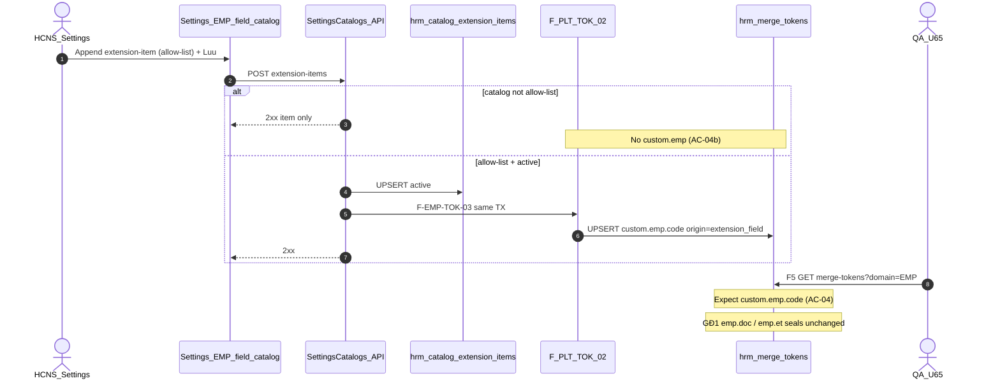

# BA AC pack — `custom.emp.*` register-on-save (AC-PLT-EMP-TOK-04 / 04b / 04c)

| Meta | Value |
|------|--------|
| **work_item_id** | `PO-HRM-DYNAMIC-CONFIG-PLATFORM-MERGE-TOKEN-EMP-EXT-BA-01` |
| **parent** | `PO-HRM-DYNAMIC-CONFIG-PLATFORM-MERGE-TOKEN-EMP-EXT-SA-01` **HOLD-WITH-RATIONALE** · Option **B′ LOCKED** |
| **program** | `PO-HRM-CONTINUOUS-W8-20260807` |
| **from_role** | ba-process |
| **lane** | governance |
| **Date** | 2026-08-07 |
| **Status** | **CONFIRMED** — AC/BR pack implementation-ready · unlock **dev-be** F-EMP-TOK-03 |
| **change_mode** | **ADD** |
| **ref_sa** | [`PO-HRM-DYNAMIC-CONFIG-PLATFORM-MERGE-TOKEN-EMP-EXT-SA-01.md`](./PO-HRM-DYNAMIC-CONFIG-PLATFORM-MERGE-TOKEN-EMP-EXT-SA-01.md) §5–§7 · L-EMP-EXT-01..09 |
| **ref_sa_gđ1** | [`PO-HRM-DYNAMIC-CONFIG-PLATFORM-MERGE-TOKEN-EMP-SA-01.md`](./PO-HRM-DYNAMIC-CONFIG-PLATFORM-MERGE-TOKEN-EMP-SA-01.md) **F-EMP-TOK-03** · AC-PLT-EMP-TOK-04 stub |
| **ref_api** | [`PO-HRM-DYNAMIC-CONFIG-PLATFORM-API-01.md`](./PO-HRM-DYNAMIC-CONFIG-PLATFORM-API-01.md) **F-PLT-TOK-02** · **BR-PLT-01** shape `custom.emp.<code>` |
| **ref_ba_platform** | [`PO-HRM-DYNAMIC-CONFIG-PLATFORM-BA-01.md`](./PO-HRM-DYNAMIC-CONFIG-PLATFORM-BA-01.md) **BR-PLT-01** · **AC-PLT-CTR-05** class |
| **ref_qc_peer** | [`po-hrm-dynamic-config-platform-merge-token-emp-qc-01.md`](../../qa/evidence/po-hrm-dynamic-config-platform-merge-token-emp-qc-01.md) GWC · stamp **`EMPTOKQA-MSJ290VB`** · CONDITION **R-EMP-TOK-EXT** |
| **stamp_peer** | QA `EMPTOKQA-MSJ290VB` · GĐ1 DOC/ET SEAL **retain** |
| **Honesty** | `hrm_personnel_uat_ready=false` · `employees_e2e_linkage_ready=false` · `contracts_printable_ready=false` · **`custom.emp.*` LIVE = DENIED** until QA AC-04 PASS + narrow QC · module EMP UAT / Phase1 **DENIED** · **`C-SLICE-≠-MODULE`** |
| **Cấm** | `apps/**` this seat · seed · ba-data EXPAND · invent LIVE · dual `emp_merge_tokens` · reopen MERGE-TOKEN-EMP GWC / EMP-QC / DEC / CTR / LIST-TOTALS · register on employee value PATCH |
| **ack_status** | **PASS_TO_PM** · **CONFIRMED** |

---

## 0. Process objective & actors

### Objective

Khóa **AC/BR đo được** cho residual **R-EMP-TOK-EXT** theo Option **B′** (EXT-SA LOCKED):

1. **Producer** = Settings **định nghĩa trường NS mở rộng** trên catalog allow-list `hrm_employee_*_fields` (extension-item active).
2. **Side-effect** cùng TX → upsert MergeToken `custom.emp.<code>` · `origin=extension_field` · `domain=EMP` qua **F-PLT-TOK-02** (**F-EMP-TOK-03**).
3. **Negative** = catalog ngoài allow-list **không** sinh `custom.emp.*`; PATCH giá trị `employee.custom_fields` **không** đăng ký token.
4. **Honesty** = AC pack **không** claim LIVE; GĐ1 DOC/ET seals **retain**.

### Actors

| Actor | Role |
|-------|------|
| HCNS / Settings admin | Append / retire extension-item trên EMP field catalog |
| System (BE) | F-EMP-TOK-03 side-effect → F-PLT-TOK-02 → `hrm_merge_tokens` |
| QA | Browser U65 AC-04 / 04b / 04c sau BE |
| QC | Narrow seal AC-04 only — **DENIED** personnel / printable / Phase1 |
| PM | Unlock **dev-be** sau BA CONFIRMED |

### Scope

| In (this seat) | Out |
|----------------|-----|
| AC-PLT-EMP-TOK-04 / 04b / 04c click paths + BR-PLT-EMP-TOK-* | Impl `apps/**` / migration / seed |
| Allow-list BR cite EXT-SA §5.1 | ba-data EXPAND (`origin=extension_field` already CHK) |
| Negative: non-allow-list · value PATCH | Claim `custom.emp` LIVE · reopen DOC/ET GWC |
| VAL matrix for BE/QA | Dual token table · invent second SoT |

---

## 1. As-is vs to-be

| | AS-IS (evidence) | TO-BE (after BE + QA) |
|---|------------------|------------------------|
| DOC/ET → token | **SEALED** `emp.doc.*` / `emp.et.*` · `origin=emp_catalog` · stamp `EMPTOKQA-MSJ290VB` | **must_keep** — **cấm** reopen |
| EMP extension → token | **Gap** — F-EMP-TOK-03 **not coded**; QC CONDITION R-EMP-TOK-EXT | Same-TX register `custom.emp.<code>` · `origin=extension_field` |
| Producer UI | Settings `POST …/settings-catalogs/:catalogKey/extension-items` · EMP form consumes codes into `custom_fields` **values** | Definition save = register; value write ≠ register |
| Physical | `hrm_merge_tokens.origin` CHK includes `extension_field` | **No** ba-data EXPAND |
| LIVE claim | **DENIED** | Remains **DENIED** until AC-04 PASS + narrow QC — still **DENIED** personnel UAT flip |

---

## 2. Citations (mandatory — no invent)

| ID | SoT | Rule used here |
|----|-----|----------------|
| **F-EMP-TOK-03** | MERGE-TOKEN-EMP-SA §7.3 · EXT-SA §5–§6 | Side-effect on EMP field extension-item save → F-PLT-TOK-02 |
| **F-PLT-TOK-02** | PLATFORM-API-01 §3.2 | Upsert columns; `origin=extension_field` → require `extensionFieldRef` |
| **BR-PLT-01** | PLATFORM-BA-01 · API-01 shape | Custom field saved active → auto-register merge token; shape `custom.emp.<code>` |
| **EXT-SA §5** | Allow-list + matrix | Only four EMP field catalogs (+ aliases); retire → soft-retire token |
| **EXT-SA §6** | F.1 deepen | No new public path; same TX; rollback on token fail |
| **EXT-SA §7** | Acceptance stubs | AC-04 / 04b / 04c — this pack **CONFIRMs** measurable paths |
| **L-EMP-EXT-01** | EXT-SA §4 | Producer = definition only — **FORBIDDEN** value mutate register |
| **L-EMP-EXT-04** | EXT-SA §4 | Allow-list only |
| **BR-PLT-03/04** | Platform BA | Issued snapshot immutable; soft-delete / retire hide picker |

---

## 3. Business rules (EMP-EXT delta)

| ID | Condition | Action | Outcome |
|----|-----------|--------|---------|
| **BR-PLT-EMP-TOK-01** | Extension-item **active** save on allow-list catalog (§4) | Same-TX upsert via **F-PLT-TOK-02** | Row `token_key=custom.emp.<code>` · `origin=extension_field` · `domain=EMP` · `ring=custom` · `extension_field_ref=<code>` · `status=active` |
| **BR-PLT-EMP-TOK-02** | Extension-item **retire** on allow-list | Soft-retire matching token | `status=retired` and/or `archived_at` · picker hide; issued HĐ snapshot **unchanged** (**BR-PLT-03**) |
| **BR-PLT-EMP-TOK-03** | `catalog_key` **∉** allow-list | **No** F-EMP-TOK-03 register | **No** new `custom.emp.*` row (other hooks may apply — not this AC) |
| **BR-PLT-EMP-TOK-04** | Employee **PATCH** / form Lưu chỉ đổi `custom_fields` **values** | **FORBIDDEN** register | Token count / keys unchanged (**L-EMP-EXT-01**) |
| **BR-PLT-EMP-TOK-05** | Code format fail / token upsert fail | Surface error; **rollback** extension TX | **No** orphan definition without token when register required; **no** invent token |
| **BR-PLT-EMP-TOK-06** | Resolve preview (`F-PLT-TOK-03`) for `custom.emp.<code>` | Bag value = `employee.custom_fields[code]` when bound | Missing → empty/warn — **FORBIDDEN** invent value |
| **BR-PLT-01** (cite) | Custom field definition saved active | Register merge token | List F5 shows token (**AC-PLT-CTR-05** class) |
| **BR-PLT-04** (cite) | Soft-delete / retire | Soft only | History / issued intact |

**SUPERSEDED / FORBIDDEN:** invent LIVE without AC-04; dual `emp_merge_tokens`; seed tokens for UF (U65); ba-data EXPAND for origin; register from leave/allowance/position/DOC/ET catalogs as `custom.emp.*`; claim personnel UAT / printable / Phase1 from this AC alone.

---

## 4. Allow-list (producer SoT — EXT-SA §5.1)

| Allow-list `catalog_key` | Alias accepted |
|--------------------------|----------------|
| `hrm_employee_basic_fields` | `employee_basic_fields` |
| `hrm_employee_personal_fields` | `employee_personal_fields` |
| `hrm_employee_work_fields` | `employee_work_fields` |
| `hrm_employee_finance_fields` | `employee_finance_fields` |

**OUT (AC-04b examples):** `leave_types`, allowance catalogs, `job_titles`, DOC/ET catalogs, JD field catalogs, any key not in table above.

**Normalize:** extension `code` → lower-case slug; must pass `chk_hrm_merge_tok_key_format` as suffix of `custom.emp.<code>`.

**Default core codes** in DEFAULT_* field sets that are **core columns** (not extension) — **do not** auto-register as `custom.emp.*`.

---

## 5. Use-case catalog

| UC ID | Name | Happy | Alternate | Exception |
|-------|------|-------|-----------|-----------|
| **UC-PLT-EMP-TOK-04** | Settings — định nghĩa trường NS → token | Admin append extension-item allow-list → Lưu **2xx** → F5 merge-tokens EMP có `custom.emp.<code>` | Sửa label → refresh `label_vi` | Format invalid · scope 409 · token fail → rollback |
| **UC-PLT-EMP-TOK-04R** | Retire định nghĩa | Retire item → token retired / picker hide | Reactivate → token active again (if SA allows) | Hard-delete · wipe issued PV |
| **UC-PLT-EMP-TOK-04b** | Non-allow-list | Save extension trên catalog OUT → **không** `custom.emp.*` | Other domain hooks unchanged | Claim false positive token |
| **UC-PLT-EMP-TOK-04c** | Value-only mutate | Employee form/API PATCH `custom_fields` alone | Definition unchanged | New token appears → **FAIL** |



---

## 6. Acceptance criteria (CONFIRMED)

### AC-PLT-EMP-TOK-04 — Happy path (definition → token)

| Field | Value |
|-------|--------|
| **Persona** | HCNS / Settings admin · UAT account with Settings mutate (peer DOC/ET path) |
| **U65** | Zero-seed · browser-first · probe L1 phụ only |
| **Click path** | Login → **Cài đặt / Settings** → catalog **trường nhân sự** allow-list (`hrm_employee_basic_fields` **or** personal/work/finance alias) → **Thêm / Append** extension-item (`code` + `label` vi-VN, active) → **Lưu** → quan sát FE sau **2xx** → **F5** hoặc mở **Merge tokens** / `GET …/merge-tokens?domain=EMP` |
| **Network** | `POST|PUT …/settings-catalogs/{allowListKey}/extension-items` → **2xx** |
| **PASS when** | (1) List/API merge-tokens `domain=EMP` contains `tokenKey` / `token_key` = `custom.emp.<code>` (normalized). (2) `origin=extension_field`. (3) `status=active`. (4) `extensionFieldRef` / `extension_field_ref` = item `code` (or soft id per F-PLT-TOK-02). (5) `domain=EMP` · `ring=custom`. (6) F5 still shows token. (7) GĐ1 `emp.doc.*` / `emp.et.*` still present — **no regression**. |
| **Retire sub-path** | Retire same extension-item → **2xx** → token retired / active picker **hide**; any issued print snapshot **unchanged** if present. |
| **FAIL when** | Token missing after 2xx · wrong origin · invent LIVE claim without QC · seed used · DOC/ET tokens broken |

### AC-PLT-EMP-TOK-04b — Non-allow-list → no `custom.emp`

| Field | Value |
|-------|--------|
| **Click path** | Settings → catalog **∉** §4 allow-list (vd. leave types / allowance / non-EMP field key available on surface) → append extension-item → Lưu **2xx** → F5 `GET merge-tokens?domain=EMP` |
| **PASS when** | **No new** row `custom.emp.<that_code>` created by this save. Baseline EMP DOC/ET tokens unchanged. |
| **FAIL when** | `custom.emp.*` appears from non-allow-list save |

### AC-PLT-EMP-TOK-04c — Employee value PATCH alone → no token

| Field | Value |
|-------|--------|
| **Click path** | Employees → open employee → set/edit **custom field value** only (no Settings definition change) → **Lưu** → **2xx** → F5 merge-tokens EMP |
| **Alt (L1 phụ)** | Authenticated `PATCH` employee `custom_fields` only — **not** sufficient alone for 🟢 UF; browser preferred |
| **PASS when** | **No new** `custom.emp.*` token; existing definition-registered tokens unchanged. |
| **FAIL when** | Value save creates token (**violates L-EMP-EXT-01**) |

### Honesty AC (always)

| ID | PASS when |
|----|-----------|
| **AC-PLT-EMP-TOK-04H** | Evidence keeps `hrm_personnel_uat_ready=false` · `employees_e2e_linkage_ready=false` · `contracts_printable_ready=false` · **DENIED** `custom.emp` LIVE before QA+QC · **DENIED** Phase1 / module EMP UAT · **`C-SLICE-≠-MODULE`** · MERGE-TOKEN-EMP GWC / EMP-QC **not reopened** |

---

## 7. Validation matrix (BE / QA)

| VAL ID | Condition | Expect | Maps AC |
|--------|-----------|--------|---------|
| **VAL-EMP-TOK-05** | Allow-list extension active save | Upsert `custom.emp.<code>` · `origin=extension_field` | AC-04 |
| **VAL-EMP-TOK-05b** | Non-allow-list extension save | Zero new `custom.emp.*` | AC-04b |
| **VAL-EMP-TOK-05c** | Employee `custom_fields` PATCH only | Zero new token | AC-04c |
| **VAL-EMP-TOK-05r** | Retire allow-list item | Token retired / picker hide | AC-04 retire |
| **VAL-EMP-TOK-05t** | Token upsert fail | Extension TX rollback | BR-PLT-EMP-TOK-05 |
| **VAL-EMP-TOK-05k** | Issued snapshot exists | Unchanged after retire | BR-PLT-03 |
| **VAL-EMP-TOK-GĐ1** | After AC-04 wire | `emp.doc.*` / `emp.et.*` still register | must_keep GWC |

---

## 8. must_keep / cấm (stamp)

| must_keep | cấm |
|-----------|-----|
| Single **`hrm_merge_tokens`** | Dual EMP token table |
| MERGE-TOKEN-EMP GWC · stamp `EMPTOKQA-MSJ290VB` · DOC/ET SEAL | Reopen GWC / EMP-QC-01/02 |
| DEC · CTR · LIST-TOTALS seals | Wipe / absorb into this seat |
| F-PLT-TOK-01..03 paths · keyword_map empty-registry fallback | Alternate write path bypassing F-PLT-TOK-02 |
| Soft-delete | Hard-delete · seed for UF |
| `ready=false` · `printable=false` · LIVE DENIED until gate | Claim LIVE / personnel UAT / Phase1 / `C-SLICE=MODULE` |
| ba-data **HOLD** (no EXPAND) | Invent physical EXPAND seat |

---

## 9. Unlock / residual

| Residual | After this seat |
|----------|-----------------|
| **R-EMP-TOK-EXT** | Architecture **LOCKED** (EXT-SA) + **AC CONFIRMED** (this) → execution unlock **dev-be** |
| **Close product residual when** | BE F-EMP-TOK-03 + QA AC-04/04b/04c PASS + narrow QC — **still DENIED** personnel UAT / printable / Phase1 / invent LIVE beyond AC-04 seal |
| **ba-data** | **HOLD** — **FORBIDDEN** EXPAND |

```text
EXT-SA-01 HOLD-WITH-RATIONALE · B′ LOCKED
  → EXT-BA-01 (this) AC CONFIRMED
  → PO-HRM-DYNAMIC-CONFIG-PLATFORM-MERGE-TOKEN-EMP-EXT-BE-01 (dev-be)
  → QA U65 AC-04*
  → QC narrow — honesty false
```

---

## 10. Handoff

| Field | Value |
|-------|--------|
| **completion_report** | See evidence |
| **next_owner** | **pm** → **dev-be** `PO-HRM-DYNAMIC-CONFIG-PLATFORM-MERGE-TOKEN-EMP-EXT-BE-01` |
| **ack_status** | **PASS_TO_PM** · **CONFIRMED** |
| **evidence_path** | `docs/qa/evidence/po-hrm-dynamic-config-platform-merge-token-emp-ext-ba-01.md` |
