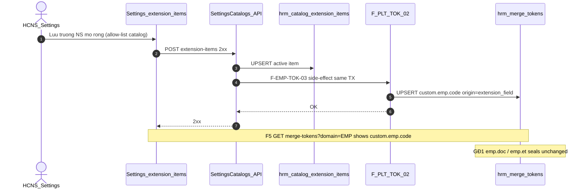

# PO-HRM-DYNAMIC-CONFIG-PLATFORM-MERGE-TOKEN-EMP-EXT-SA-01 — F.1 · `custom.emp.*` producer register-on-save (R-EMP-TOK-EXT)

| Field | Value |
|-------|--------|
| **work_item_id** | `PO-HRM-DYNAMIC-CONFIG-PLATFORM-MERGE-TOKEN-EMP-EXT-SA-01` |
| **Parent** | `PO-HRM-DYNAMIC-CONFIG-PLATFORM-MERGE-TOKEN-EMP-QC-01` **GWC** · residual **R-EMP-TOK-EXT** |
| **Program** | `PO_HRM_CONTINUOUS_W8_20260807` |
| **lane** | governance · sa |
| **change_mode** | **ADD** F-EMP-TOK-03 deepen (producer SoT + locks) · **REFINE** R-EMP-TOK-EXT · **NO** ba-data EXPAND · **NO CODE** `apps/**` · **no seed** · **no wipe** MERGE-TOKEN-EMP GWC · EMP-QC · DEC · CTR · LIST-TOTALS |
| **Date** | 2026-08-07 |
| **Status** | **HOLD-WITH-RATIONALE** — architecture Option **B′** **LOCKED** · execution LIVE **DENIED** until BE+QA AC-PLT-EMP-TOK-04 |
| **stamp_peer** | QA `EMPTOKQA-MSJ290VB` · MERGE-TOKEN-EMP GWC · GĐ1 DOC/ET SEAL **retain** |
| **ref_sa_gđ1** | [`PO-HRM-DYNAMIC-CONFIG-PLATFORM-MERGE-TOKEN-EMP-SA-01.md`](./PO-HRM-DYNAMIC-CONFIG-PLATFORM-MERGE-TOKEN-EMP-SA-01.md) **F-EMP-TOK-03** · L-EMP-TOK-01..10 |
| **ref_data** | [`PO-HRM-DYNAMIC-CONFIG-PLATFORM-MERGE-TOKEN-EMP-DATA-01.md`](./PO-HRM-DYNAMIC-CONFIG-PLATFORM-MERGE-TOKEN-EMP-DATA-01.md) · platform DATA-01 `origin=extension_field` **already** in CHK |
| **ref_api** | [`PO-HRM-DYNAMIC-CONFIG-PLATFORM-API-01.md`](./PO-HRM-DYNAMIC-CONFIG-PLATFORM-API-01.md) **F-PLT-TOK-01..03** · BR-PLT-01 shape `custom.emp.<code>` |
| **ref_qc** | [`po-hrm-dynamic-config-platform-merge-token-emp-qc-01.md`](../../qa/evidence/po-hrm-dynamic-config-platform-merge-token-emp-qc-01.md) GWC · CONDITION R-EMP-TOK-EXT |
| **ref_adr** | [`ADR-HRM-DYNAMIC-CONFIG-PLATFORM`](../../architecture/ADR-HRM-DYNAMIC-CONFIG-PLATFORM.md) L3 · V3 · BR-PLT-01 |
| **Honesty** | `hrm_personnel_uat_ready=false` · `employees_e2e_linkage_ready=false` · `contracts_printable_ready=false` · **`custom.emp.*` LIVE = DENIED** · module EMP UAT / Phase1 **DENIED** · **`C-SLICE-≠-MODULE`** |
| **must_keep** | single **`hrm_merge_tokens`** · GĐ1 DOC/ET `emp_catalog` SEAL · F-PLT-TOK paths · EMP-QC-01/02 · DEC L1/FE seals · CTR · LIST-TOTALS · keyword_map empty-registry fallback · soft-delete · U65 |
| **ack_status** | **PASS_TO_PM** · **HOLD-WITH-RATIONALE** |

---

## 0. Decision context

| | |
|--|--|
| **Decision title** | F.1 for `custom.emp.*` (`origin=extension_field`) register-on-save — close-or-refine **R-EMP-TOK-EXT** |
| **Requestor** | pm · U88 after MERGE-TOKEN-EMP-QC-01 GWC |
| **Decision owner** | sa |
| **Problem** | GĐ1 DOC/ET → `emp.doc.*` / `emp.et.*` (`emp_catalog`) is **SEALED** (`EMPTOKQA-MSJ290VB`). ADR V3 / BR-PLT-01 / **F-EMP-TOK-03** still require **definition** of EMP custom field → MergeToken list. QC CONDITION keeps **`custom.emp` LIVE DENIED**. Need architecture that neither invents LIVE nor opens a second token table / pointless ba-data EXPAND. |
| **Constraints** | ADD-only docs · no `apps/**` · **cấm** reopen MERGE-TOKEN-EMP GWC / EMP-QC · **cấm** claim LIVE · **cấm** dual `emp_merge_tokens` · U65 · retain GĐ1 seals |
| **Failure if unresolved** | Residual stays vague; PM unlocks BE without producer SoT → FE invents tokens or dual registry; or ba-data churn for CHK already present. |

### 0.1 AS-IS facts (evidence-based)

| Layer | Fact |
|-------|------|
| **Physical** | `hrm_merge_tokens.origin` CHK **already** includes **`extension_field`** (platform DATA-01 + Nest `MERGE_TOKEN_ORIGINS`) — **no** EXPAND required for EXT |
| **Consumer** | **F-PLT-TOK-02** upsert requires `extensionFieldRef` when `origin=extension_field`; list/resolve live |
| **GĐ1 register** | `emp-merge-token-register.ts` wires **DOC/ET only** (`emp_catalog`) — **F-EMP-TOK-03 not coded** (BE-01 residual) |
| **Producer UI (partial)** | Settings **`POST …/settings-catalogs/:catalogKey/extension-items`** → `hrm_catalog_extension_items`; Employee form `buildDynamicFields` consumes extension codes on catalogs `hrm_employee_{basic\|personal\|work\|finance}_fields` (+ aliases) into `employee.custom_fields` **values** |
| **Gap** | No **same-TX register** from EMP field-definition save → `custom.emp.<code>` · **no** sealed U65 path for AC-PLT-EMP-TOK-04 |
| **NOT producer** | Saving an **employee record** `custom_fields` value JSON — that is **value write**, not field definition (**FORBIDDEN** as register trigger) |

---

## 1. Options (evaluate)

### Option A — Claim LIVE / close residual without producer register

| | |
|--|--|
| **Description** | Treat GĐ1 DOC/ET seal + manual F-PLT-TOK admin as enough for ADR V3; mark R-EMP-TOK-EXT closed / `custom.emp` LIVE. |
| **Benefits** | Zero work. |
| **Costs** | Lies about BR-PLT-01 / AC-PLT-EMP-TOK-04; violates QC honesty. |
| **Risks** | FE invents picker rows; UAT false green — **REJECT**. |

### Option B′ — Hook on EMP field-definition producer → F-PLT-TOK-02 (peer GĐ1 DOC/ET) — **RECOMMEND / LOCK**

| | |
|--|--|
| **Description** | Keep **single** `hrm_merge_tokens`. On **successful** EMP **field-definition** save (Settings extension-item active for EMP field catalog keys — §5 allow-list): same-TX upsert `custom.emp.<code>` · `origin=extension_field` · `extension_field_ref=<code>` via **F-PLT-TOK-02** / shared helper (peer Allowance + F-EMP-TOK-01/02). Retire definition → soft-retire token. Resolve bag uses registry + employee value at preview time (**F-PLT-TOK-03** / §5.2). **No** new table · **no** ba-data EXPAND. |
| **Benefits** | Matches GĐ1 SA F-EMP-TOK-03 + API-01 BR-PLT-01 shape; reuses proven register pattern; producer already exists as Settings extension-items. |
| **Costs** | BE wire + allow-list + QA U65 AC-PLT-EMP-TOK-04; BA AC click-path pack recommended before BE. |
| **Risks** | Wrong catalog_key noise → mitigate: **strict allow-list** (§5); TX rollback on token fail. |

### Option C — Dual EMP token table / mega-EAV

| | |
|--|--|
| **Description** | New `emp_merge_tokens` or parallel EAV registry for custom.emp. |
| **Benefits** | None for GĐ1. |
| **Costs** | Dual SoT; PREV/VER rewrite. |
| **Risks** | Violates ADR L3 / L-EMP-TOK-01 — **REJECT**. |

### Option D — Invent LIVE from employee value save / seed tokens

| | |
|--|--|
| **Description** | Register token on every employee PATCH of `custom_fields`, or seed `custom.emp.*` for UF. |
| **Benefits** | Fake AC-04 green. |
| **Costs** | Token spam · wrong producer · U65 breach. |
| **Risks** | **REJECT** — DENY invent LIVE without definition producer. |

---

## 2. Trade-off matrix

| Criteria | Weight | A Invent LIVE | **B′ Hook** | C Dual table | D Value-save |
|----------|-------:|--------------:|------------:|-------------:|-------------:|
| Business value (BR-PLT-01 / ADR V3) | 5 | 1 | **5** | 2 | 1 |
| Honesty / seal safety | 5 | 0 | **5** | 1 | 0 |
| Single SoT reliability | 5 | 3 | **5** | 0 | 2 |
| Time to deliver | 4 | 5 | **3** | 1 | 4 |
| Complexity | 4 | 5 | **3** | 1 | 2 |
| Maintainability (peer DOC/ET) | 4 | 1 | **5** | 1 | 1 |
| **Weighted** | | 52 | **107** | 24 | 42 |

---

## 3. Decision

| | |
|--|--|
| **Selected** | **Option B′** — architecture **LOCKED** |
| **Seat verdict** | **HOLD-WITH-RATIONALE** — refine **R-EMP-TOK-EXT**; **do not** claim `custom.emp` LIVE; **do not** unlock ba-data |
| **Why B′** | Closes architecture gap with same physical SoT + F-PLT-TOK; producer SoT = Settings EMP field catalogs (AS-IS), not a new FormSchema mega-table GĐ1. |
| **Why HOLD (not CLOSE LIVE)** | BE F-EMP-TOK-03 + U65 AC-PLT-EMP-TOK-04 **not** proven; QC CONDITION still honest. Architecture lock ≠ product LIVE. |
| **Assumptions** | EMP field catalogs remain the definition SoT until a dedicated EMP `IFormSchema` vertical ships (GĐ1.5 optional upgrade — ADD-only, no wipe B′). |
| **Rejected** | **A** invent LIVE · **C** dual table · **D** value-save / seed |

### 3.1 ba-data gate

| Question | Answer |
|----------|--------|
| Physical EXPAND needed for `origin=extension_field`? | **NO** — already in platform CHK + Nest constants |
| Unlock `*-DATA-*` this residual? | **HOLD** — **FORBIDDEN** reopen DATA-01 / invent second EXPAND seat |
| When BE unlocks | ensureSchema **no-op** for origin (already present); ADD register helper + SettingsCatalogs side-effect only |

---

## 4. Locks (EXT — inherit + deepen GĐ1)

| Lock | Rule |
|------|------|
| **L-EMP-TOK-01** | **must_keep** single **`hrm_merge_tokens`** — **FORBIDDEN** second EMP token table |
| **L-EMP-EXT-01 Producer = definition** | Register trigger = **field definition** save/retire only — **FORBIDDEN** register on employee `custom_fields` value mutate |
| **L-EMP-EXT-02 Origin** | `custom.emp.<code>` → `origin=extension_field` · `domain=EMP` · `ring=custom` · `extension_field_ref` required |
| **L-EMP-EXT-03 Consumer** | Upsert **only** via **F-PLT-TOK-02** (or shared TX helper calling same columns) — **FORBIDDEN** alternate write path |
| **L-EMP-EXT-04 Allow-list** | Only catalog keys in §5 — **FORBIDDEN** register from leave/allowance/position catalogs |
| **L-EMP-EXT-05 GĐ1 retain** | DOC/ET `emp_catalog` SEAL **untouched** — **cấm** reopen MERGE-TOKEN-EMP GWC / EMP-QC |
| **L-EMP-EXT-06 Honesty** | **DENIED** `custom.emp` LIVE · personnel/e2e/printable ready · Phase1 · **`C-SLICE-≠-MODULE`** |
| **L-EMP-EXT-07 Scope** | Same `resolveHrmListScope` as F-PLT-TOK (**U19**) — token `company_id` = extension-item `company_id` |
| **L-EMP-EXT-08 Soft-delete** | Retire definition → soft-retire token; issued HĐ snapshots immutable (**BR-PLT-03**) |
| **L-EMP-EXT-09 No seed** | **FORBIDDEN** seed tokens for UF (U65) |

---

## 5. Producer SoT + register matrix (F-EMP-TOK-03 deepen)

### 5.1 Catalog allow-list (EMP field definition)

On **successful** `hrm_catalog_extension_items` create/upsert/retire when `catalog_key` ∈:

| Allow-list key | Alias accepted |
|----------------|----------------|
| `hrm_employee_basic_fields` | `employee_basic_fields` |
| `hrm_employee_personal_fields` | `employee_personal_fields` |
| `hrm_employee_work_fields` | `employee_work_fields` |
| `hrm_employee_finance_fields` | `employee_finance_fields` |

**OUT:** any other `catalog_key` (leave_types, allowance, job_titles, DOC/ET catalogs, …) — those use their own hooks or none.

**Normalize:** extension `code` → lower-case slug; must pass `chk_hrm_merge_tok_key_format` as suffix of `custom.emp.<code>`.

### 5.2 Matrix row (cite GĐ1 SA §5 + DATA §2)

| Trigger | `token_key` | `source_path` | `ring` | `domain` | `origin` | `label_vi` | `extension_field_ref` |
|---------|-------------|---------------|--------|----------|----------|------------|------------------------|
| EMP field extension-item **active** save | `custom.emp.<code>` | `custom.emp.<code>` | `custom` | `EMP` | **`extension_field`** | item `label` vi-VN | item `code` (or id soft) |
| EMP field extension-item **retire** | same key | — | — | EMP | extension_field | — | — → token `status=retired` + `archived_at` |

| Rule | Detail |
|------|--------|
| **TX** | Same TX as extension-item writer — token fail → **rollback** (peer Allowance / DOC/ET) |
| **UQ** | `(company_id, lower(token_key)) WHERE archived_at IS NULL` → refresh |
| **Default codes** | Codes in DEFAULT_* field sets that are **core columns** (not extension) — **do not** auto-register as `custom.emp.*` (builtin / column paths remain) |
| **Resolve** | DATA §5.2 unchanged; bag value for `custom.emp.<code>` = employee `custom_fields[code]` when bound — **missing → empty/warn**, **FORBIDDEN** invent |



---

## 6. API_DESIGN F.1 — F-EMP-TOK-03 (CONFIRM deepen · execution HOLD)

| | |
|--|--|
| **METHOD / path** | *(no new public path)* — side-effect inside SettingsCatalogs **extension-item** create/upsert/retire **same TX** when catalog ∈ §5.1 · call shared upsert (**F-PLT-TOK-02** columns) |
| **Mục đích** | Sau HR Lưu định nghĩa trường NS mở rộng, token `custom.emp.<code>` xuất hiện trên danh sách trộn HĐ/Settings (**BR-PLT-01** · **AC-PLT-EMP-TOK-04** · ADR V3). |
| **Nghiệp vụ xử lý** | (1) Gate allow-list. (2) Skip DEFAULT core codes. (3) Active → upsert matrix §5.2. (4) Retire → soft-retire matching token. (5) Format fail → surface extension error; **do not** invent token. (6) Token fail → rollback TX. (7) **FORBIDDEN** hard-delete · seed · dual table · value-save trigger. |
| **Tham chiếu** | GĐ1 **F-EMP-TOK-03** · **F-PLT-TOK-02** · BR-PLT-01/03/04/05 · AC-PLT-EMP-TOK-04 · DATA §5.2 · QC CONDITION R-EMP-TOK-EXT |
| **DTO↔DB** | Via F-PLT-TOK-02 → `hrm_merge_tokens` (`origin=extension_field`) |
| **Lỗi** | Same TOK + settings taxonomy; scope 403/409 |
| **scope_parity** | Token `company_id` = extension-item `company_id` |
| **Execution** | **HOLD** until ba-process AC pack (recommended) → **dev-be** → QA U65 — this seat does **not** flip LIVE |

**F-EMP-TOK-01/02/04/05:** **must_keep** as sealed GĐ1 — **no reopen**.

---

## 7. Acceptance (QA later — when unlocked)

| ID | PASS when |
|----|-----------|
| **AC-PLT-EMP-TOK-04** | Settings: append active extension-item on allow-list EMP field catalog → 2xx → F5 → `GET merge-tokens?domain=EMP` contains `custom.emp.<code>` · `origin=extension_field` · `status=active`; retire → token retired / picker hide; issued PV unchanged |
| **AC-PLT-EMP-TOK-04b** | Non-allow-list catalog extension-item save → **no** new `custom.emp.*` row |
| **AC-PLT-EMP-TOK-04c** | Employee PATCH `custom_fields` alone → **no** new token |
| **Honesty** | Evidence keeps ready flags **false** · **DENIED** claim LIVE before this AC PASS + QC |

---

## 8. Residual refine (R-EMP-TOK-EXT)

| Field | Before (QC) | After (this seat) |
|-------|-------------|-------------------|
| **Status** | CONDITION OPEN / idle HOLD | **ARCHITECTURE_LOCKED** · **EXECUTION_HOLD** |
| **Severity** | P2 | **P2** retained |
| **Blocker for DOC/ET GWC?** | No | **No** — GĐ1 SEAL retain |
| **ba-data** | n/a | **HOLD** — no EXPAND |
| **Close when** | vague “after DEC/EMP FE” | **After** BE F-EMP-TOK-03 + QA **AC-PLT-EMP-TOK-04** PASS + narrow QC — still **DENIED** personnel UAT flip |
| **Producer SoT** | “extension UI” | **Locked** §5.1 Settings EMP field catalogs |
| **LIVE claim** | DENIED | **DENIED** until close criteria |

**Closed by this seat:** architecture ambiguity of R-EMP-TOK-EXT (options / dual-table / invent LIVE / ba-data churn).  
**Not closed:** product LIVE · BE wire · U65 AC-04.

---

## 9. Rollout / unlock (execution — after PM)

```text
EXT-SA-01 (this) HOLD-WITH-RATIONALE · Option B′ LOCKED
  → ba-data: HOLD (no seat)
  → ba-process (recommended): AC-PLT-EMP-TOK-04 click path + allow-list BR delta
  → dev-be: F-EMP-TOK-03 side-effect on SettingsCatalogs extension-items
  → QA U65 AC-PLT-EMP-TOK-04* zero-seed
  → QC narrow — DENY personnel/printable/LIVE invent beyond AC-04 seal
```

| Wave | Owner | Exit |
|------|-------|------|
| **This** | sa | Option B′ LOCKED · residual refined · ba-data HOLD |
| **AC pack** | ba-process | AC-04 path CONFIRMED |
| **BE** | dev-be | Side-effect + jest VAL-EMP-TOK-05 extension · READY_FOR_QA |
| **QA/QC** | qa → qc | AC-04 PASS · honesty false |

**Rollback:** Disable side-effect flag; soft-retire additive tokens; CTR keyword_map fallback intact.

---

## 10. Honesty locks

| Flag | Value |
|------|-------|
| `hrm_personnel_uat_ready` | **false** LOCKED |
| `employees_e2e_linkage_ready` | **false** LOCKED |
| `contracts_printable_ready` | **false** LOCKED |
| **`custom.emp.*` LIVE** | **DENIED** (HOLD) |
| Module EMP UAT / Phase1 | **DENIED** |
| MERGE-TOKEN-EMP GWC · EMP-QC-01/02 · DEC seals | **SEAL RETAIN** — **cấm reopen** |
| `C-SLICE-≠-MODULE` | retained |

---

## 11. Handoff

| Field | Value |
|-------|--------|
| **completion_report** | HOLD-WITH-RATIONALE: Option **B′** LOCKED — `custom.emp.*` register-on-save via Settings EMP field catalog extension-items → F-PLT-TOK-02 · `origin=extension_field`; reject invent LIVE / dual table / value-save trigger; **ba-data HOLD** (no physical EXPAND); cite F-EMP-TOK-03 · F-PLT-TOK · GĐ1 single `hrm_merge_tokens`; refine R-EMP-TOK-EXT to ARCHITECTURE_LOCKED · EXECUTION_HOLD; honesty false; seals retained; no apps/**. |
| **next_owner** | **pm** → **ba-process** `PO-HRM-DYNAMIC-CONFIG-PLATFORM-MERGE-TOKEN-EMP-EXT-BA-01` (AC-04 pack) then **dev-be** |
| **ack_status** | **PASS_TO_PM** · **HOLD-WITH-RATIONALE** |
