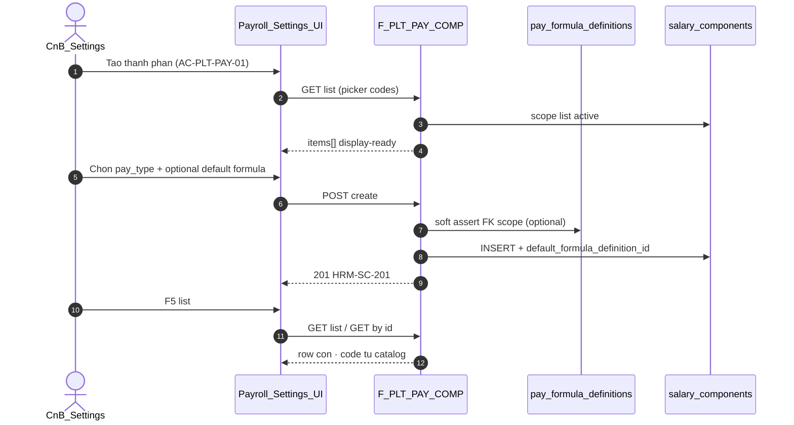

# PO-HRM-DYNAMIC-CONFIG-PLATFORM-PAY-CATALOG-API-01 — API_DESIGN F.1 · Platform PAY Catalog

| Field | Value |
|-------|--------|
| **work_item_id** | `PO-HRM-DYNAMIC-CONFIG-PLATFORM-PAY-CATALOG-API-01` |
| **Parent** | `PO-HRM-DYNAMIC-CONFIG-PLATFORM-01` |
| **lane** | governance · sa |
| **change_mode** | **ADD** platform PAY vertical · **EXPAND** live `PayrollCatalogService` paths · **NO CODE** `apps/**` · **no seed** |
| **Date** | 2026-08-07 |
| **Status** | **CONFIRMED** — sponsor Option **B** · ADR L1–L7 · AMIS PAY Step2 · formula F.1 peer CONFIRMED |
| **ref_adr** | [`ADR-HRM-DYNAMIC-CONFIG-PLATFORM`](../../architecture/ADR-HRM-DYNAMIC-CONFIG-PLATFORM.md) Option B · **L1 Catalog open** · **L6** scope + soft-delete |
| **ref_ba** | [`PO-HRM-DYNAMIC-CONFIG-PLATFORM-BA-01`](./PO-HRM-DYNAMIC-CONFIG-PLATFORM-BA-01.md) **BR-PLT-02/04/05** · **AC-PLT-PAY-01** · [`po-hrm-amis-parity-ba-01`](../../qa/evidence/po-hrm-amis-parity-ba-01.md) **AC-PAY-COMP-01** · **BR-AMIS-PAY-SRC-05** |
| **ref_formula_api** | [`PO-HRM-PAYROLL-FORMULA-RUN-GAP-API-01`](./PO-HRM-PAYROLL-FORMULA-RUN-GAP-API-01.md) §6 F-PAY-COMP-CATALOG-01 · F-PAY-FORMULA-* (**do not duplicate**) |
| **ref_amis_sa** | [`po-hrm-amis-parity-sa-01`](../../qa/evidence/po-hrm-amis-parity-sa-01.md) §3.1 · §3.4 SRC tier 4 |
| **ref_live** | Nest `PayrollCatalogService` · `GET|POST|PATCH|DELETE /api/hrm/payroll/salary-components*` |
| **Honesty** | `payroll_e2e_ready=false` · no module UAT flip · no Phase1 DONE · U65 |
| **must_keep** | UF-HRM-02 · soft-delete platform · pay_types REF for `component_type` · FE no net (OS28) · open catalog no CHK IN (N) · scope_parity U19 |
| **ack_status** | **PASS_TO_PM** |

---

## 0. Objective & merge strategy

Deepen **Platform Option B — Catalog** for PAY vertical onto **existing** Nest payroll-catalog routes — **không** invent parallel prefix.

| Lock | Rule |
|------|------|
| **Path merge** | **KEEP** `/api/hrm/payroll/salary-components` (+ categories) — platform F.1 = **EXPAND** contract, not new `/api/hrm/platform/pay/*` |
| **ICatalogRow** | Open `code` + `label` (`name`) + `status` (`is_active`) + scope — starter rows ≠ closed enum (**BR-PLT-05** / CORR lesson) |
| **Formula SoT** | **`default_formula_definition_id` → `pay_formula_definitions`** at SRC tier 4 — **`formula` TEXT ≠ engine** (**G-PAY-F-07**) |
| **Soft-delete** | **EXPAND** retire via `is_active=false` (+ optional `archived_at` DATA wave) — **FORBIDDEN** hard `DELETE` as default retire (**BR-PLT-04** / ADR L6) |
| **scope_parity** | list ↔ **get-by-id** ↔ mutate same `resolveHrmListScope` (**U19**) |
| **Dual SoT** | `salary_components.code` = component identity · `component_type` = `pay_types` catalog REF (E2 — keep) |
| **Honesty** | Docs ≠ evaluator LIVE · process still gated by formula BE |

**Envelope:** `{ code, message, data }`  
**Auth:** same HRM JWT / membership as payroll peers.

---

## 1. Capability map

| Cap | F-id | METHOD / path (physical — merged live) | BA / AC |
|-----|------|----------------------------------------|--------|
| List / get components | **F-PLT-PAY-COMP-01** | `GET /api/hrm/payroll/salary-components` · **`GET …/salary-components/:componentId`** *(ADD get-by-id)* | **AC-PLT-PAY-01** · **AC-PAY-COMP-01** · **AC-PAY-FORMULA-07** |
| Create component | **F-PLT-PAY-COMP-02** | `POST /api/hrm/payroll/salary-components` | **AC-PLT-PAY-01** · AMIS Step2 · **BR-PLT-02** |
| Update component | **F-PLT-PAY-COMP-03** | `PATCH /api/hrm/payroll/salary-components/:componentId` | Same + bind `default_formula_definition_id` |
| Retire component | **F-PLT-PAY-COMP-04** | `PATCH …/:componentId` `{ isActive: false }` · **`POST …/:componentId/retire`** *(preferred)* | **BR-PLT-04** soft-delete |
| List categories | **F-PLT-PAY-CAT-01** | `GET /api/hrm/payroll/salary-component-categories` | EXISTING — no change GĐ1 |
| CRUD categories | **F-PLT-PAY-CAT-02** | `POST|DELETE …/salary-component-categories*` | EXISTING — note hard DELETE residual; align soft-delete later P2 |

**Alias (do not duplicate in new docs):** F-PAY-COMP-CATALOG-01 in [`PO-HRM-PAYROLL-FORMULA-RUN-GAP-API-01`](./PO-HRM-PAYROLL-FORMULA-RUN-GAP-API-01.md) §6 — **this file is authoritative platform deepen**.



---

## 2. Physical schema EXPAND (BE ensureSchema — not this seat)

| Column | Type | Rule |
|--------|------|------|
| `default_formula_definition_id` | `uuid` NULL | Soft FK → `public.pay_formula_definitions(id)` ON DELETE SET NULL |
| `archived_at` | `timestamptz` NULL | Optional GĐ1 — prefer `is_active=false` first; ADD when BE aligns platform soft-delete |

**INDEX (recommended):** `ix_salary_components_default_formula ON (company_id, default_formula_definition_id) WHERE default_formula_definition_id IS NOT NULL`

**FORBIDDEN:** DB `CHECK (code IN (...))` closed N-set · treat `formula TEXT` as versioned engine column.

---

## 3. API_DESIGN F.1 — F-PLT-PAY-COMP-*

### 3.1 F-PLT-PAY-COMP-01 — List / get salary components

| | |
|--|--|
| **METHOD / path** | `GET /api/hrm/payroll/salary-components` · **`GET /api/hrm/payroll/salary-components/:componentId`** |
| **Mục đích** | Trả danh mục thành phần lương mở — picker Settings/Lương và bind CT/mẫu/phiếu — display-ready cho FE (**AC-PLT-PAY-01** · **AC-PAY-COMP-01**). |
| **Nghiệp vụ xử lý** | (1) `resolveHrmListScope` + required `company_id` query. (2) Default list excludes `is_active=false` unless `include_inactive=true` (admin). (3) Optional filters: `component_type`, `nature`, `q` (ilike code/name). (4) Empty `data=[]` → **200** — không fake starter rows trong UF U65. (5) **Get-by-id ADD:** load by UUID with **same** scope predicate as list — out of scope → **404** `HRM-SC-404` / **409** scope (**U19**). (6) Join display: `componentTypeLabel` from effective `pay_types` catalog; `defaultFormula` summary from `pay_formula_definitions` when FK set (code, version, status — **no** `expression_json` on list). (7) Include `category` object (existing LEFT JOIN). (8) Sort: `sort_order`, `code`. |
| **Tham chiếu bước SRS / AC** | **FR-UC-BP-PAY-02** Diễn biến **danh mục thành phần** · **AC-PLT-PAY-01** · **AC-PAY-COMP-01** · **AC-PAY-FORMULA-07** · AMIS help «Quản lý khoản mục lương» (principle) · Platform BA **BR-PLT-02** |
| **Request (query)** | `company_id` (required) · `include_inactive?` · `component_type?` · `nature?` · `q?` |
| **Response → DB** | `data[]` from `salary_components` (+ joins) |

| DTO field | DB column | Notes |
|-----------|-----------|-------|
| `id` | `id` | uuid |
| `companyId` | `company_id` | |
| `code` | `code` | open catalog slug |
| `name` | `name` | display label VI |
| `componentType` | `component_type` | **pay_types.code** REF |
| `componentTypeLabel` | *(computed)* | settings-catalogs `pay_types` label |
| `nature` | `nature` | `income`\|`deduction`\|`other` |
| `valueType` | `value_type` | |
| `isTaxable` | `is_taxable` | |
| `isInsuranceBase` | `is_insurance_base` | |
| `defaultValue` | `default_value` | fixed amount when no formula |
| `minValue` / `maxValue` | `min_value` / `max_value` | cap hints |
| `defaultFormulaDefinitionId` | `default_formula_definition_id` | nullable FK |
| `defaultFormula` | join | `{ id, code, version, status }` — summary only |
| `formulaHint` | `formula` | **deprecated** read-only hint — **≠** engine SoT |
| `appliedTo` | `applied_to` | |
| `isActive` | `is_active` | |
| `sortOrder` | `sort_order` | |
| `category` | join | optional category object |
| `createdAt` / `updatedAt` | timestamps | |

| **Lỗi** | Scope 403/409 · empty list **≠** 404 |
| **scope_parity** | List filter ≡ get-by-id assert |

---

### 3.2 F-PLT-PAY-COMP-02 — Create salary component

| | |
|--|--|
| **METHOD / path** | `POST /api/hrm/payroll/salary-components` |
| **Mục đích** | HR thêm thành phần lương tenant — mã mở, không closed enum — gắn optional công thức mặc định đã soạn (**AMIS** Step2 · Platform Catalog). |
| **Nghiệp vụ xử lý** | (1) `resolveHrmPersistCompanyIdText`. (2) Require `code` + `name` — validate slug format → **`HRM-SC-CODE-INVALID`** = **format only** — **cấm** reject vì «không thuộc starter N» (**BR-PLT-05** / CORR). (3) `component_type` **required** — `assertCodeInEffectiveCatalog(pay_types)` → **`HRM-PAY-TYPE-KEY`** (E2 keep). (4) UQ `(company_id, lower(code))` → **`HRM-SC-002`**. (5) **`defaultFormulaDefinitionId` optional:** if present, soft assert row exists under same company/rollup scope → else **`HRM-PAY-FORMULA-404-DEF`**; **allow** `draft` on catalog bind — process/evaluate gate requires `active` separately (**VAL-PAY-COMP-03**). (6) **`formula` TEXT:** accept as optional legacy hint only — **FORBIDDEN** treat as published engine; if both FK and TEXT sent, **FK wins** on resolve; log/warn deprecate TEXT write in GĐ1.5. (7) Nature/value_type/tax flags per body. (8) **FORBIDDEN** closed `code` enum / CHK IN (N). (9) Return display-ready row (COMP-01). |
| **Tham chiếu bước SRS / AC** | **FR-UC-BP-PAY-02** · **AC-PLT-PAY-01** · **AC-PAY-COMP-01** · **BR-AMIS-PAY-SRC-05** (catalog default tier 4) · **G-PAY-F-07** |
| **Request → DB** | Body → INSERT `salary_components` |

| DTO | DB | Required |
|-----|-----|----------|
| `companyId` | `company_id` | yes (or from token) |
| `code` | `code` | yes |
| `name` | `name` | yes |
| `componentType` | `component_type` | yes |
| `nature` | `nature` | default `income` |
| `valueType` | `value_type` | default `currency` |
| `defaultFormulaDefinitionId` | `default_formula_definition_id` | optional |
| `formula` | `formula` | optional deprecated hint |
| `defaultValue` | `default_value` | optional |
| `minValue` / `maxValue` | min/max | optional |
| `isTaxable` / `isInsuranceBase` | flags | optional |
| `categoryId` | `category_id` | optional |
| `appliedTo` | `applied_to` | optional |
| `sortOrder` | `sort_order` | optional |

| **Response** | `201` `HRM-SC-201` + row |
| **Lỗi** | `HRM-SC-001` · `HRM-SC-002` · `HRM-SC-CODE-INVALID` · `HRM-PAY-TYPE-KEY` · `HRM-PAY-FORMULA-404-DEF` · scope |

---

### 3.3 F-PLT-PAY-COMP-03 — Update salary component

| | |
|--|--|
| **METHOD / path** | `PATCH /api/hrm/payroll/salary-components/:componentId` |
| **Mục đích** | Sửa metadata thành phần (label, nature, cap, default formula bind) — không đổi engine trên payslip đã process (immutability ở process layer). |
| **Nghiệp vụ xử lý** | (1) Peek `company_id` → `assertResourceInHrmScope` (**U19**). (2) Allowed fields: same as create (partial). (3) Code change → re-assert UQ. (4) `component_type` change → re-assert `pay_types`. (5) `defaultFormulaDefinitionId` null clears FK; non-null → soft assert scope (**VAL-PAY-COMP-02**). (6) **FORBIDDEN** promote `formula` TEXT to engine via PATCH semantics. (7) Reactivate: `isActive=true` clears retire if policy allows. |
| **Tham chiếu bước SRS / AC** | **FR-UC-BP-PAY-02** · **AC-PLT-PAY-01** · **BR-PLT-04** |
| **Lỗi** | `HRM-SC-404` · `HRM-SC-409` scope · `HRM-VAL-001` empty patch |

---

### 3.4 F-PLT-PAY-COMP-04 — Retire salary component (soft-delete)

| | |
|--|--|
| **METHOD / path** | **`POST /api/hrm/payroll/salary-components/:componentId/retire`** *(preferred ADD)* · **`PATCH …` `{ isActive: false }`** *(compatible)* · **`DELETE …`** *(DEPRECATE — migrate to retire)* |
| **Mục đích** | Ngừng theo dõi thành phần — ẩn picker — **không** xóa cứng FK lịch sử phiếu (**BR-PLT-04**). |
| **Nghiệp vụ xử lý** | (1) Scope assert. (2) Set `is_active=false`; optional `archived_at=now()` when column exists. (3) **FORBIDDEN** physical DELETE as default path after BE migration — existing DELETE endpoint **DEPRECATE** to call same retire SQL. (4) Issued payslip lines referencing `component_code` remain readable. (5) Re-activate via PATCH `isActive=true` if no business block. |
| **Tham chiếu bước SRS / AC** | **BR-PLT-04** · Platform ADR **L6** · AMIS «Ngừng theo dõi» (label parity — cosmetic FE later) |
| **Response** | `200` `HRM-SC-200` + `{ id, isActive: false }` |

---

## 4. SRC resolver bind (EXPAND pointer — not invent PROCESS)

When **F-PAY-PROCESS-01** evaluates at **SRC tier 4** (**BR-AMIS-PAY-SRC-05**):

```text
IF emp_history_amount present → use (tier 1)
ELSE IF period_input_pack row → use (tier 2)
ELSE IF template override FK → evaluate (tier 3)
ELSE IF component.default_formula_definition_id → load published/active definition → evaluate
ELSE IF component.default_value fixed → use amount
ELSE → HRM-PAY-FORMULA-412 / explicit VI (no silent 0)
```

**FORBIDDEN:** read `salary_components.formula` TEXT in evaluator.

---

## 5. Error taxonomy (PAY catalog)

| Code | When |
|------|------|
| `HRM-SC-001` | Missing code/name |
| `HRM-SC-002` | Duplicate code per company |
| `HRM-SC-CODE-INVALID` | Code format/slug only — **not** closed enum |
| `HRM-SC-404` | Component not found / scope |
| `HRM-SC-409` | Scope mismatch |
| `HRM-PAY-TYPE-KEY` | `component_type` ∉ effective `pay_types` |
| `HRM-PAY-FORMULA-404-DEF` | `default_formula_definition_id` not in scope |
| `HRM-VAL-001` | Empty PATCH body |
| `HRM-SCOPE-409` / 403 | Scope parity |

---

## 6. Validation matrix

| ID | Condition | Expected |
|----|-----------|----------|
| **VAL-PAY-COMP-01** | Create code #N+1 valid slug | **2xx** — no «not in starter list» |
| **VAL-PAY-COMP-02** | FK definition wrong company | `HRM-PAY-FORMULA-404-DEF` |
| **VAL-PAY-COMP-03** | Catalog bind draft formula | **2xx** on save; process requires `active` separately |
| **VAL-PAY-COMP-04** | Retire component | Picker hides; GET `include_inactive` shows |
| **VAL-PAY-COMP-05** | List vs get-by-id scope | Same ids — **scope_parity** jest |
| **VAL-PAY-COMP-06** | FE posts `formula` TEXT as engine | BE stores hint only; evaluate ignores |
| **VAL-PAY-COMP-07** | `component_type` free-text | `HRM-PAY-TYPE-KEY` |

---

## 7. Client API_DESIGN DOC-DELTA (ADD-only)

**File:** `docs/client-delivery/hrm-enterprise-blueprint/API_DESIGN_HRM_ENTERPRISE.md`

| Change | Detail |
|--------|--------|
| **ADD** | **F-PLT-PAY-COMP-01..04** full F.1 under §4 PAY — merge live `/payroll/salary-components*` |
| **ADD** | §7.2 alias `default_formula_definition_id` · `formulaHint` deprecated |
| **UPGRADE** | §7.3 row **F-PLT-PAY-COMP-*** → **PASS** (F.1 CONFIRMED) |
| **EXPAND** | **F-PAY-COMP-CATALOG-01** pointer → this SoT (platform deepen) |
| **EXPAND** | **F-PAY-PROCESS-01** SRC tier 4 bind `default_formula_definition_id` |
| **DEPRECATE** | Hard `DELETE` salary-components default retire path |
| **KEEP** | F-PAY-FORMULA-* CONFIRMED · F-PAY-SHEET-TPL-* · pay_types E2 · U65 · open catalog |
| **FORBIDDEN** | Wipe formula F.1 · invent `/platform/pay` prefix · `payroll_e2e_ready=true` · `apps/**` |

---

## 8. Dev unlock gate

| Gate | Status after this seat |
|------|------------------------|
| Platform ADR B + PAY catalog F.1 | **YES — this file** |
| Formula F.1 (`pay_formula_definitions`) | **YES** (peer CONFIRMED) |
| **dev-be** `PO-HRM-DYNAMIC-CONFIG-PLATFORM-PAY-CATALOG-BE-01` | **UNLOCKED** — ensureSchema FK + get-by-id + retire + display joins |
| Evaluator SRC tier 4 wire | Staged with `PO-HRM-AMIS-PARITY-PAY-SRC-BE-01` |
| FE picker AC-PLT-PAY-01 | After BE list/get stable |
| `payroll_e2e_ready` | Remains **false** |

---

## 9. Non-claims

- No `apps/**` / migrations / OpenAPI Nest export.
- No claim AMIS parity DONE / payroll module UAT.
- No flip `payroll_e2e_ready` or Phase1 DONE.
- No duplicate F-PAY-FORMULA AUTHOR/PUBLISH endpoints.
- No MergeToken PAY wave (GĐ1.5 payslip tokens — separate).

---

## 10. Handoff

- **ack_status:** `PASS_TO_PM`
- **next_owner:** `pm` → dispatch **dev-be** `PO-HRM-DYNAMIC-CONFIG-PLATFORM-PAY-CATALOG-BE-01`
- **evidence_path:** `docs/qa/evidence/po-hrm-dynamic-config-platform-pay-catalog-sa-01.md`
