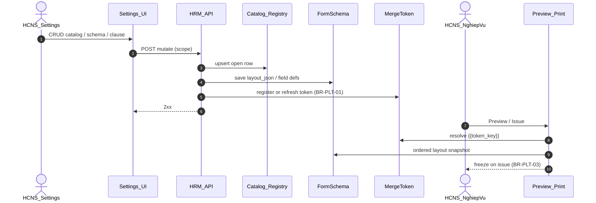

# PO-HRM-DYNAMIC-CONFIG-PLATFORM-TECHSPEC-01 — TechSpec · Nền tảng Catalog + FormSchema + MergeToken

| Field | Value |
|-------|--------|
| **work_item_id** | `PO-HRM-DYNAMIC-CONFIG-PLATFORM-TECH-01` |
| **Parent** | `PO-HRM-DYNAMIC-CONFIG-PLATFORM-01` |
| **lane** | governance · sa |
| **change_mode** | **ADD** · **NO CODE** `apps/**` · **cấm** wipe print-spine / UF-HRM-02 / JD Option A / XBOS catalog SoT |
| **Date** | 2026-08-07 |
| **Status** | **CONFIRMED TechSpec (platform)** — sponsor **Option B** 2026-08-07 · clause-DnD-first |
| **ref_adr** | [`ADR-HRM-DYNAMIC-CONFIG-PLATFORM`](../../architecture/ADR-HRM-DYNAMIC-CONFIG-PLATFORM.md) **Status CONFIRMED** · Locks L1–L7 |
| **ref_ba** | [`PO-HRM-DYNAMIC-CONFIG-PLATFORM-BA-01.md`](./PO-HRM-DYNAMIC-CONFIG-PLATFORM-BA-01.md) · BR-PLT-01..06 · AC-PLT-* |
| **ref_program** | [`PO_HRM_DYNAMIC_CONFIG_PLATFORM_01.md`](../PO_HRM_DYNAMIC_CONFIG_PLATFORM_01.md) |
| **ref_ctr** | [`PO-HRM-CONTRACT-LEGAL-PRINT-TECHSPEC-01`](./PO-HRM-CONTRACT-LEGAL-PRINT-TECHSPEC-01.md) (print-spine GWC) · [`XEVN-TPL-TECHSPEC-01`](./PO-HRM-CONTRACT-LEGAL-PRINT-XEVN-TPL-TECHSPEC-01.md) · [`CORR-01`](./PO-HRM-CONTRACT-LEGAL-PRINT-XEVN-TPL-CORR-01.md) · [`DYNAMIC-LOCK`](./PO-HRM-CONTRACT-LEGAL-PRINT-XEVN-TPL-DYNAMIC-LOCK.md) |
| **ref_rec** | [`PO-HRM-JD-DYNAMIC-ARCH-01.md`](./PO-HRM-JD-DYNAMIC-ARCH-01.md) — FormSchema vertical #2 |
| **Honesty** | `contracts_printable_ready=false` · no module `*_uat_ready` flip · no Phase1 DONE · U65 |
| **must_keep** | UF-HRM-02 · print-spine GWC (AC-CTR-PRINT-*) · Q-CTR-01/02 CLOSED · soft-delete · XBOS group REF catalog · U65 · **no closed enum 8** · BR-CD-F5-01 |
| **ack_status** | **PASS_TO_PM** |

---

## 0. Context & objective

**Business intent:** Khóa **hợp đồng kỹ thuật nền** (logical platform) cho cấu hình động toàn HR theo Option **B**: ba registry **Catalog · FormSchema · MergeToken**, UI chuyên biệt theo domain, **vertical đầu = Hợp đồng** (open template catalog · clause library · `layout_json` · freeze · keyword_map/tokens). Các domain ATT / PAY / REC / EMP / SETTINGS nhận **interface map GĐ1** — không bắt buộc physicalize cùng wave.

**Architecture truth (locked):**

| Lock | Rule |
|------|------|
| **ADR B** | Shared **interfaces** + **domain physical tables** — **cấm** mega-EAV một bảng mọi domain |
| **Authoring GĐ1** | Clause-DnD-first (XeVN + MISA hybrid). DOCX upload = **GĐ2** compiler vào cùng L2/L3 |
| **CTR first** | Print-spine AS-IS **must_keep**; platform **wraps / deepens**, không redesign PDF |
| **Open catalog** | Starter 8 `XEVN_*` = bootstrap examples — **FORBIDDEN** `CHK IN (8)` / FE enum 8 |
| **Syntax GĐ1** | **`{{token_key}}` only** (Base-like · khớp print-spine). `#token#` = GĐ2 normalize-on-import only — **cấm** dual syntax trong cùng template GĐ1 (**Q-PLT-01 CLOSED**) |
| **Dev gate** | ba-data physical + API F.1 per vertical trước `apps/**` shared helpers |
| **Honesty** | Research/TechSpec ≠ UAT flip |

**Non-goals (this TechSpec):**

- Ship Nest helpers / FE trong seat này
- Claim printable / Phase1 DONE
- DOCX-primary authoring
- Move legal clause bodies vào XBOS `synced_catalogs`
- Open mọi lifecycle status machine thành CRUD catalog

---

## 1. Logical architecture

```text
┌──────────────────────────────────────────────────────────────┐
│  HRM Metadata Platform (logical — Option B)                  │
│  ICatalogRow · IFormSchema · IMergeToken (+ version/scope)   │
└──────────────┬───────────────────────┬───────────────────────┘
               │                       │
     Shared validators / scope         Domain adapters (physical)
     (slug · soft-delete ·             CTR tables · rec_jd_* ·
      resolveHrmListScope)             salary_components · …
               │
     ┌─────────┴─────────┬──────────┬──────────┬──────────┐
     ▼                   ▼          ▼          ▼          ▼
  Settings           Contracts   REC/JD    EMP/SET    ATT/PAY
  (producer)         VERTICAL#1  #2        consumer   catalogs
```



### 1.1 Three registries (contracts)

#### A. Catalog (`ICatalogRow`)

Open configurable rows consumed by pickers / FK — **not** compile-time enums.

| Field (logical) | Rule |
|-----------------|------|
| `id` | uuid |
| `company_id` / scope | Same resolver as list/get/mutate |
| `domain` | `CTR` \| `REC` \| `EMP` \| `ATT` \| `PAY` \| `SET` \| `CAT` |
| `catalog_kind` | e.g. `contract_template` · `contract_pack` · `leave_type` · `salary_component` · `jd_field` · `settings_key` |
| `code` | Unique active per `(company_id, catalog_kind)` (or domain UQ ba-data chốt) — **open** |
| `label_vi` | Display-ready |
| `status` | `draft` \| `active` \| `retired` |
| `meta_json` | Domain-specific (pack defaults, duration hints, …) — **not** free-text SoT when catalog has items |
| `version` | Bump on material change after issued consumer exists |
| `archived_at` | Soft-delete only |

**BR-PLT-05 / CORR:** starter rows optional upsert — **not** ceiling.

#### B. FormSchema (`IFormSchema`)

Field defs + layout / DnD order for authoring surfaces.

| Field (logical) | Rule |
|-----------------|------|
| `schema_id` | uuid |
| `company_id` | Scope |
| `domain` + `schema_kind` | e.g. `CTR.template_layout` · `REC.jd_layout` · `EMP.profile_tab` |
| `field_defs[]` / FK | Keys, types, required, sort — or join domain field table |
| `layout_json` | Ordered structure (clause_ids · layout items · section chrome) |
| `status` / `version` / `archived_at` | Soft-delete + version discipline |

**Consumers AS-IS (must_keep patterns):**

| Domain | Physical instance (GĐ1) | Platform role |
|--------|-------------------------|---------------|
| CTR | `hrm_contract_templates.layout_json` + clause canvas | Vertical #1 FormSchema |
| REC | `rec_jd_field_def` + `rec_jd_form_layout(_item)` | Vertical #2 — **must_keep** Option A |
| EMP | settings-catalogs extension-items / CORE-02b class | Align later — interface only GĐ1 |
| PAY / ATT | Formula form order / sheet columns | Schema interface GĐ1; DnD GĐ2 where sponsor locked |

#### C. MergeToken (`IMergeToken`)

SoT map for preview / PDF / future DOCX / email.

| Field (logical) | Rule |
|-----------------|------|
| `token_key` | Canonical without braces; render as `{{token_key}}` |
| `source_path` | e.g. `employee.full_name` · `contract.contract_number` · `custom.emp.<code>` |
| `ring` | `public` \| `company` \| `contract` \| `cb` \| `clause` \| `custom` — ACL on merge |
| `domain` | Owning module |
| `label_vi` | Merge field picker label |
| `status` / `archived_at` | Soft-delete |
| `origin` | `builtin` \| `keyword_map` \| `extension_field` \| `import` |

**BR-PLT-01:** Creating/updating an active custom field **registers or refreshes** a MergeToken row (same scope).

**Fallback GĐ1 (CTR):** If MergeToken registry empty / partial → resolve via existing `keyword_map` on template (**ADR §8.2 rollback**). Registry **wins** when both define same `token_key`.

---

## 2. Versioning · scope · soft-delete

### 2.1 Versioning

| Event | Behavior |
|-------|----------|
| Draft/active config, no issued consumer | In-place update OK; bump `version` on material change |
| Consumer issued / print version / publish freeze | **BR-PLT-03:** snapshot immutable (template_code + layout + clause versions + merged values) |
| Edit library after issue | New clause/template version; old snapshots untouched (BR-CTR-CL-01) |
| Holding publish | Versioned library payload (DATA-02) — **must_keep** Q-CTR-01 |

### 2.2 Scope parity

| Rule | Enforcement |
|------|-------------|
| List ↔ get-by-id ↔ mutate | Same `resolveHrmListScope` / holding map as module peers |
| main ↔ member | ADR-GROUP-CEO-MAIN-HOLDING-SCOPE + contract library publish ADR |
| Legal bodies | **In-HRM** only — **cấm** XBOS L0 sync of clause/template body |
| Group REF (titles, org, shifts REF) | XBOS publish → HRM pull — platform **consumes**, không dual SoT |

### 2.3 Soft-delete

- Catalog / schema / token / clause / template: **`archived_at`** (or status `retired` + archive) — **no hard-delete**
- Pickers hide archived/retired; history FK remains
- UF-HRM-02 registry soft-delete pattern **must_keep**

---

## 3. Contract vertical #1 (deepen — first platform instance)

> **Preserve** print-spine TECHSPEC-01 + XEVN-TPL CORR. This section is the **platform lens** on CTR — not a second spine.

### 3.1 Open template catalog

| Capability | Tech rule | Spec ref |
|------------|-----------|----------|
| SoT | `hrm_contract_templates` = Catalog `catalog_kind=contract_template` | CORR BR-CTR-TPL-DYN-01 |
| Create 9+ | Format/slug + UQ `(company_id, lower(code))` + `pack_code` ∈ configured packs | AC-PLT-CTR-01 ≡ AC-CTR-XEVN-11 |
| Starter 8 | Optional ensure `XEVN_*` — **not** max · **FORBIDDEN** `CHK IN (8)` | DYNAMIC-LOCK · BR-PLT-05 |
| Picker | API `status=active` open list — **FORBIDDEN** FE hardcode 8 | BR-CTR-CL-03 class |
| Issue freeze | Freeze selected `template_code` (any active) | BR-CTR-TPL-DYN-06 |

**Configured packs (starter neo — open extend later):** `GENERAL` \| `IT_OFFICE` \| `DRIVER` (+ optional `LOGISTICS` GĐ1.5). Pack itself = Catalog rows long-term; GĐ1 may keep configured set in Settings with ADD path — **cấm** FE invent pack codes.

### 3.2 Clause library

| Capability | Tech rule |
|------------|-----------|
| Physical | `hrm_contract_clauses` (AS-IS print-spine) |
| Fields | `title_vi` · `body_vi` (with `{{tokens}}`) · `clause_group` · `apply_to_packs` · `mandatory` · `status` · `version` |
| Edit after issue | Version++ new row/lineage; issued snapshots keep old body |
| FE | **FORBIDDEN** hardcode long law paragraphs |
| Pack gate | Mandatory clauses for pack must resolve or block print |

### 3.3 Layout (`layout_json` = FormSchema instance)

| State | Behavior |
|-------|----------|
| Draft / active, no new issue | DnD reorder `clause_ids` → Lưu 2xx → F5 → preview uses new order |
| After print version issued | Snapshot frozen; template layout edit does **not** mutate issued version |
| Structure in layout_json | `clause_ids[]` order + print chrome (+ `show_driver_license_block` for DRIVER) |

### 3.4 Freeze set on issue (minimum)

| Snapshot field | Source |
|----------------|--------|
| `template_code` / `template_id` / template `version` | Selected catalog row |
| `pack_code` | Template / resolve |
| `layout_json` / ordered `clause_ids` | FormSchema at issue |
| Clause versions + body snapshot | Clause library |
| `merged_fields_json` | MergeToken + keyword_map resolve (+ C&B ACL) |
| Optional `compensation_snapshot_json` | BR-CD-F5-01 — preview/print only |

**F5:** print versions list >0; reopen issued → same structure + code.

### 3.5 keyword_map ↔ MergeToken

| Layer | Role GĐ1 |
|-------|----------|
| `keyword_map` on template | AS-IS per-template override / pack chrome (GPLX · number pattern · unit) — **must_keep** |
| MergeToken registry | Cross-template SoT + custom field tokens; picker list for clause authoring |
| Resolve order | 1) snapshot if issued · 2) MergeToken for key · 3) template `keyword_map` · 4) builtin defaults · else missing/warn policy |

**Builtin token families (logical — ba-data enumerates rows, not TS closed ceiling):**

- `employee.*` · `contract.*` · `company.*` / OU · `cb.*` (ring) · DRIVER GPLX quartet · `custom.<module>.<code>`

### 3.6 UF-HRM-02 registry (must_keep)

- `employee_contracts` CRUD **không** bắt buộc `template_*`
- Print spine additive; registry-only rows remain valid
- Salary on body ignored (BR-CD-F5-01)

### 3.7 Holding library (must_keep)

- Publish / pull ≠ apply / lineage — ADR-HRM-CONTRACT-LIBRARY-GROUP-PUBLISH
- Members receive new templates via library — not hardcoded list
- **Q-CTR-01 CLOSED** · **Q-CTR-02 CLOSED**

---

## 4. Rollout map — interfaces only (GĐ1 non-CTR)

> Physical DDL for non-CTR domains = **later** ba-data waves. This TechSpec locks **adapter contracts** so modules do not invent forks.

| Module | Catalog interface | FormSchema interface | MergeToken interface | GĐ1 action | Notes |
|--------|-------------------|----------------------|----------------------|------------|-------|
| **CTR** | Open templates · packs · clauses-as-catalog | `layout_json` clause DnD | keyword_map + registry | **Implement vertical** | First; CORR in flight |
| **REC** | `rec_jd_field_def` · packs | `rec_jd_*` layout DnD | Optional JD view tokens | **must_keep** Option A | Vertical #2 — align to `I*` via adapter, **no wipe** |
| **EMP** | position/dept pickers · extension catalogs | Profile tab schema (later) | `employee.*` + custom → print | Interface + hook plan | AC-PLT-EMP-01 picker; token hook after CTR |
| **ATT** | Leave types · attendance codes · sites | Sheet column layout (GĐ2) | Export tokens GĐ1.5 | Interface only | Ops SoT `work_shifts` / rules ADR — catalog ≠ dual master |
| **PAY** | `salary_components` · `pay_types` | Formula form order (DnD GĐ2) | Payslip tokens GĐ1.5 | Interface + bind AC | AC-PLT-PAY-01: picker when catalog ≠ empty; **no FE net** (OS 28) |
| **SETTINGS** | Master keys · CFG (org_suffix) · feature honesty | Builders host | Token admin / preview list | Producer | U65 CRUD |
| **CATALOG (XBOS)** | Group REF publish/pull | N/A legal body | N/A | **must_keep** consumer | Legal HĐ ≠ XBOS |

**Recommended sequence after CTR vertical:** PAY-COMP catalog bind → EMP custom-field → MergeToken auto-register → ATT leave/code catalogs → REC stages (JD already parallel).

---

## 5. Shared Nest / package intent (post DB+API — not this seat)

| Component | Responsibility |
|-----------|----------------|
| `ICatalogRow` / validators | Slug/code charset · UQ · status · soft-delete predicates |
| `IFormSchema` helpers | Validate `layout_json` shape per `schema_kind` |
| `IMergeToken` resolver | Resolve `{{key}}` with ring ACL; register from extension-item events |
| Scope | Always call module's `resolveHrmListScope` — **no** second scope dialect |
| Observability | Existing `@xevn/platform-core` / NFR baseline — no new RLS unless SA sign-off |

**Anti-pattern REJECT:** one physical EAV table for all HR config; FE closed unions of template codes; dual merge syntax GĐ1.

---

## 6. API family map (logical F.1 — ba-data/API deepen)

> Intent only. Per-vertical API_DESIGN owns METHOD/path/DTO. Platform names for cross-cutting later.

| Family | Purpose | SRS / AC map | Vertical |
|--------|---------|--------------|----------|
| **F-PLT-CAT-*** | List/create/update/retire open catalog rows by `catalog_kind` | BR-PLT-02/05 · AC-PLT-CAT-01 | Shared later; CTR uses existing TPL APIs first |
| **F-PLT-SCH-*** | Get/put FormSchema / layout_json | AC-PLT-CTR-03 · REC JD AC | CTR layout on template APIs GĐ1 |
| **F-PLT-TOK-*** | List tokens · resolve preview · register from field | BR-PLT-01 · AC-PLT-CTR-05 | ADD after ba-data `hrm_merge_tokens` (name TBD) |
| **F-CTR-TPL / CL / PREV / VER / PDF** | Print-spine AS-IS + CORR open catalog | CORE-09a–d · AC-PLT-CTR-01..06 | **must_keep** deepen, not replace |
| **F-CTR-LIB-*** | Holding publish/pull/apply | Q-CTR-01 | must_keep |

**Error taxonomy (platform class):**

| Code class | When |
|------------|------|
| `HRM-PLT-CAT-CODE-INVALID` | Format/slug only — **not** «not in starter N» |
| `HRM-PLT-CAT-CODE-CONFLICT` | UQ active code |
| `HRM-PLT-PACK-INVALID` | pack ∉ configured |
| `HRM-PLT-TOKEN-UNKNOWN` | Mandatory section missing token (policy) |
| `HRM-PLT-SCHEMA-INVALID` | `layout_json` fails kind schema |
| Existing CTR codes | Keep CORR/API-01 (`HRM-CTR-TPL-*`, issue blocked, …) |

---

## 7. Closed questions (from BA §8)

| ID | Decision |
|----|----------|
| **Q-PLT-01** | GĐ1 syntax = **`{{token_key}}`** only |
| **Q-PLT-02** | DOCX upload = **GĐ2** optional compiler |
| **Q-PLT-03** | **Domain tables + shared interfaces** (not one shared physical mega-table GĐ1) |
| **Q-PLT-04** | Group REF immutable soft from XBOS; tenant ADD where ADR allows; legal HĐ library in-HRM |
| **Q-PLT-05** | After CTR: **PAY-COMP bind** then **EMP custom → token** (PM may reorder without ADR change if AC preserved) |

---

## 8. must_keep / forbidden checklist

| Keep | Forbidden |
|------|-----------|
| UF-HRM-02 registry CRUD | Require template on every contract |
| Print-spine preview→version→PDF | Redesign PDF engine / reopen Q-CTR |
| Soft-delete | Hard-delete catalog/clause/template |
| XBOS group REF catalogs | Sync legal clause bodies to XBOS |
| U65 FE evidence | Seed / API-only as UF 🟢 |
| Open catalog 9+ | Closed enum 8 · `CHK IN (8)` · FE fixed 8 cards |
| BR-CD-F5-01 | Salary SoT on contract body |
| JD Option A tables | Wipe `rec_jd_*` into EAV |
| Honesty flags false | Flip `contracts_printable_ready` / Phase1 from this doc |

---

## 9. Validation plan (maps ADR V1–V6 + BA AC)

| Gate | PASS when |
|------|-----------|
| V1 | This TechSpec cites ADR B + L1–L7 + BA BR-PLT |
| V2 | AC-PLT-CTR-01 / AC-CTR-XEVN-11 U65 — 9th template |
| V3 | AC-PLT-CTR-05 — custom field → token (may stage after registry physical) |
| V4 | Holding publish/pull lineage still works |
| V5 | UF-HRM-02 · print-spine GWC · soft-delete · no XBOS legal sync |
| V6 | No readiness flip from governance docs alone |

---

## 10. Cascade unlock

| Next | Owner | Exit |
|------|-------|------|
| **ba-data** | Physical platform: `hrm_merge_tokens` (or equiv) + CTR EXPAND open-catalog constraints (no CHK IN 8) · DTO↔column | DATA CONFIRMED |
| **API deepen** | F-PLT-TOK + CTR CORR already in flight | API F.1 |
| **dev-be / fe** | Only after DATA+API for touched vertical | READY_FOR_QA |
| **ba-docs** | FR-PLT pointer + FR-09d «catalog động + starter 8» DOC-DELTA | ADD-only |
| **QA** | AC-PLT-CTR-01..06 U65 browser | Evidence · printable still false |

**Dev HOLD** on shared platform package until ba-data + API for MergeToken (CTR may continue CORR open-catalog on existing TPL tables).

---

## 11. Honesty

| Flag | Value |
|------|-------|
| `contracts_printable_ready` | **false** |
| Platform / Phase1 DONE | **false** |
| This seat | Docs only — TechSpec |
| Option B | **Sponsor CONFIRMED** |

---

## 12. Completion contract

| Field | Value |
|-------|--------|
| **ack_status** | **PASS_TO_PM** |
| **evidence_path** | `docs/qa/evidence/po-hrm-dynamic-config-platform-tech-01.md` |
| **next_owner** | **pm** → **ba-data** physical platform tables (MergeToken + CTR open constraints) **or** CTR-first DATA EXPAND if MergeToken staged |
