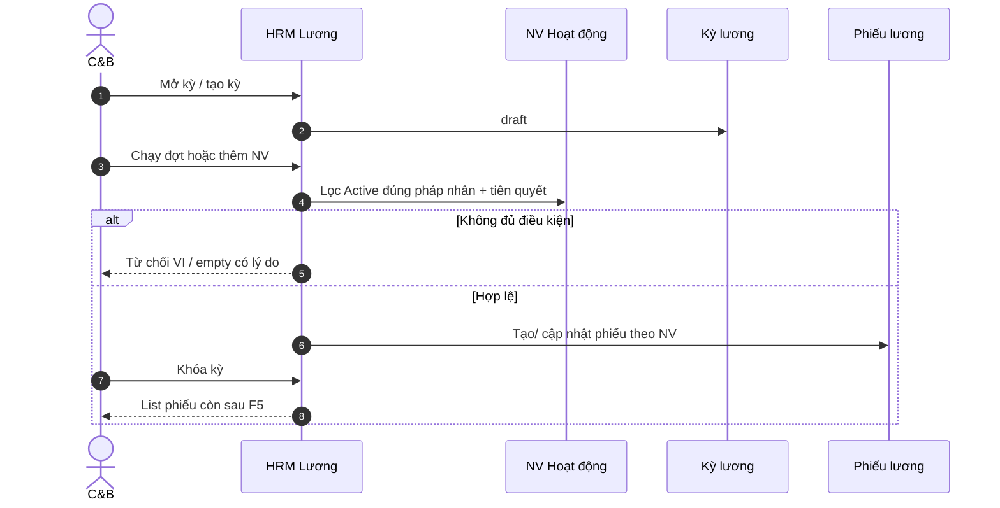

# PO-HRM-E2E-LINK-PAY-CFG-SPEC-01 — Spine liên kết E2E Lương + Cài đặt/danh mục + Quy trình

| Field | Value |
|-------|--------|
| work_item_id | `PO-HRM-E2E-LINK-PAY-CFG-SPEC-01` |
| program | `PO-HRM-ALL-MENU-E2E-LINK-01` |
| lane | governance · ba-process · **NO CODE** `apps/**` |
| change_mode | ADD draft delta only · cấm seed · cấm UAT claim |
| date | 2026-08-06 |
| SoT khách | `docs/client-delivery/hrm-enterprise-blueprint/SRS_HRM_ENTERPRISE.md` — **FR-UC-BP-PAY-01/02/04/06/08** |
| SoT đội ngũ | `docs/hrm/SRS.md` § UC-HRM-24 · §13.1 processes · §16 FR-HRM-SC-* · matrix `HRM_MENU_DATA_LINKAGE_MATRIX.md` |
| Spine program | `PO_E2E_BUSINESS_SPINE_PROGRAM.md` — Hire-to-Pay **bước 6** · Catalog **O4** |
| Journey / UF | **J-HRM-07** · **UF-HRM-06** · **UF-HRM-10** · **UF-HRM-MENU-08/12/17** · **J-XBOS-CTRL-01..03** · XBOS Inbox/WF (UF-XBOS-08 class) |
| FE skim (read-only) | `Payroll.tsx` · `PayrollBatchesTab` · `usePayrollBatches` · `PayrollPayslipsApiTab` · `SalaryComponentsTab` · `SettingsCatalogsTab` · `catalogSearchPicker` · `Processes.tsx` · `useProcesses` · Nest `payroll.service` process/close |
| honesty | `payroll_e2e_ready=false` · `settings_catalog_e2e_ready=false` (O4 partial) · `processes_catalog_bound=false` · U65 zero-seed |
| ack_status | **PASS_TO_PM** |

---

## 0. Verdict thẳng (cùng class REC)

Sponsor đúng: đây là **lớp liên kết** (khóa mang giữa bước), không phải «màn load 200».

| Surface | Honesty |
|---------|---------|
| **Hire-to-Pay bước 6** | Period draft→process→close **có** API; **không** sinh phiếu / gắn NV Active sau hire. `addRecord` UI tồn tại nhưng API path **throw**. `employee_count` map **0**. → **C-SPINE-BREAK** P0. |
| **Thành phần lương** | `componentType` đã picker **`pay_types`**; mã/tên TP vẫn **Input free-text** TX — song song catalog Settings **`salary_components`**. Rủi ro **C-ORPHAN-FIELD** (class REC free-text). |
| **Settings / O4** | Sync XBOS + picker alias registry có (EMP/ATT/PAY keys). UF-HRM-10 🟢 load/mutate item — **chưa** chứng minh picker consumer khớp key sau publish→pull trên mọi form EMP/ATT/PAY. |
| **Processes** | Fake Add/Edit/Delete toast **đã gỡ** (AC-PROC-02 partial PASS source). Hook **luôn `[]`** — **không** bind catalog DM §55–58; **không** deep-link XBOS. Empty honest ≠ spine catalog. |

**Kết luận BA:** Spec lõi (PAY-06/08, SC-*, XBOS-DM-HRM-14, O4) **đã có hướng**; **depth Diễn biến hire→phiếu + bind processes catalog + khóa dual SoT TP lương** = **spec_gap shallow + impl_gap nặng**. Không claim payroll/settings/processes E2E UAT-ready.

---

## A1. Payroll spine — nút ↔ FR ↔ khóa mang

> Gap: `spec_gap` | `impl_gap` | `ok` | `out_mvp` | `broken`

| # | Bước nghiệp vụ | Actor | Màn / nút UI | Khóa mang | FR / SoT | FE / BE does | Gap |
|---|----------------|-------|--------------|-----------|----------|--------------|-----|
| P1 | Tạo kỳ lương (tháng/năm + nhãn) | C&B · HCNS | Tab bảng lương / **PayrollBatchesTab** → Tạo | `payroll_periods.id` · `company_id` · `start_date`/`end_date` · status=`draft` | **FR-UC-H04** (slice DOC-ENT-P0-HRM-PAY) · **FR-UC-BP-PAY-06** tiên quyết kỳ | `createPayrollPeriod` POST; Zod period form | **ok** tạo kỳ |
| P2 | Chạy / xử lý kỳ (process) | C&B | (ẩn trong «Khóa») | status `draft`→`processed` | PAY-06 bước chạy CT; H04 SM 3-status | `processPayrollPeriod` **chỉ UPDATE status** — **không** INSERT payslip / không quét NV Active | **impl_gap** + **C-SPINE-BREAK** |
| P3 | Khóa kỳ (close) | C&B | Nút **Khóa bảng lương** | status `processed`→`closed` | H04 closed≈LOCKED · PAY-06 «khóa phiếu» | `lockBatch` = process **rồi** close liên tiếp | **ok** SM; **impl_gap** thiếu bước «xem trước phiếu» |
| P4 | Thêm NV vào kỳ / đợt | C&B | Dialog **Thêm nhân viên** | `employee_id` → period | PAY-06 «NV Hoạt động trong kỳ» · Hire-to-Pay bước 6 | `addRecord` **throw** «chưa hỗ trợ»; `fetchBatchRecords` → `[]`; `employee_count: 0` | **broken** / **impl_gap** |
| P5 | Danh sách phiếu lương | C&B · CEO | Overview / **PayrollPayslipsApiTab** · Eye detail | `payroll_payslips.employee_id` · `period_id` | **UC-HRM-24** · **FR-UC-BP-PAY-08** · **J-HRM-07** · **UF-HRM-06** | GET payslips list+detail; empty hợp lệ nếu 0 row | **ok** đọc; **C-SPINE-BREAK** nếu kỳ vừa khóa vẫn 0 phiếu sau hire |
| P6 | Hire → NV Active → thấy trên kỳ/phiếu | HCNS → C&B | REC hire → Employees → Payroll | `employees.id` + HĐ Active + `company_id` = period company | Spine O1 bước 4–6 · **FR-UC-BP-PAY-06** «Chưa Hoạt động → không phiếu» · PAY-04 hire giữa tháng | Hire gắn `employee_id` (REC) **không** tạo payslip (ADR đúng); **cũng không** có bước FE «đưa NV vào kỳ» / process generate | **C-SPINE-BREAK** P0 |
| P7 | Bảng công chốt → input lương | C&B | ATT sheet chốt → Payroll | sheet closed / kỳ | **FR-UC-BP-PAY-01** | Chưa có gate FE từ process period tới sheet chốt | **spec_gap** (Diễn biến nối ATT→PAY nông trên UI) + **impl_gap** |
| P8 | Thành phần lương (instance) | C&B | **SalaryComponentsTab** Thêm | `code`/`name` TX · `component_type`∈`pay_types` | **FR-HRM-SC-PAY-01** · E2 `pay_types` ≠ nature invent | Mã/tên **Input**; loại = CatalogSearchPicker `pay_types`; Settings còn key `salary_components` | **C-ORPHAN-FIELD** residual (free-text mã/tên vs catalog SoT) |
| P9 | Fake mutate toast trên batch | — | updateBatch / addRecord onSuccess | — | BR-MOCK / AC-PROC class honesty | `updateBatch` **void** + `toast.success`; addRecord onSuccess toast dù mutationFn throw (race/misleading) | **impl_gap** (class fake mutate) |
| P10 | Period orphan | C&B | Tạo kỳ không NV / không sheet | period row không FK bắt buộc NV | Matrix E-PAY-orphan = payslip→employee; thiếu BR period→eligible set | Period tồn tại một mình sau create — hợp lệ kỹ thuật; **không** đủ O1 | **C-ORPHAN-SCREEN** / period shell |

### A1.1 Khóa mang bắt buộc (Hire-to-Pay bước 6)

| Từ bước | Khóa | Sang bước | PASS khi |
|---------|------|-----------|----------|
| Hire / Employees | `employee_id` · `company_id` · employment **Hoạt động** (+ HĐ Active theo policy) | Kỳ lương | Process/generate hoặc Thêm NV **2xx** → row kỳ/`payslips` có NV |
| Kỳ | `period_id` · status | Phiếu | `GET payslips?period_id=` chứa NV vừa hire **hoặc** empty có lý do nghiệp vụ đo được («chưa đủ điều kiện / chưa chạy đợt») — **cấm** im lặng 0 mãi |
| Phiếu | `payslip.id` | J-HRM-07 detail | Eye → detail cùng `employee_id`; F5 còn |

---

## A2. Settings / catalog spine — XBOS publish → HRM pull → picker

| # | Bước | Surface | Key SoT (storage) | Consumer | FR | FE skim | Gap |
|---|------|---------|-------------------|----------|----|---------|-----|
| S1 | Publish catalog | XBOS config-sync | per key allow-list | — | O4 · XBOS-DM-HRM-* | ngoài HRM FE | **ok** SoT program |
| S2 | Apply-to-members | XBOS | target company | — | J-XBOS-CTRL-01 | — | journey matrix |
| S3 | HRM pull / sync-from-xbos | Settings catalogs | bulk keys | `synced_catalogs` | HRM-SC-02 · UF-HRM-10 | SettingsCatalogsTab sync CTA | **ok** path; density AC-FID-10 |
| S4 | Picker EMP | Employees / YCTD | `job_titles` (+ aliases positions) | position_key | FR-HRM-SC-POS-01 · BR-HRM-MD-01 | `catalogSearchPicker` aliases | residual REC free-text = seat REC |
| S5 | Picker ATT | Leave / shifts | `leave_types` · `shifts` | leave_type code | FR-HRM-SC-LEAVE-01 · SC-SHIFT-01 | MasterData preview leave picker | **ok** hướng; QA O4 spot |
| S6 | Picker PAY nature/type | SalaryComponentsTab | **`pay_types`** | component_type = code | FR-HRM-SC-PAY-TYPE-01 · E2 lock | CatalogSearchPicker payTypes | **ok** nature axis |
| S7 | Catalog PAY components | Settings `salary_components` | storageKey `salary_components` | ? consumer form | FR-HRM-SC-PAY-01 | FE create TP **không** bắt buộc chọn từ catalog này | **spec_gap** (dual SoT catalog vs TX) + **impl_gap** |
| S8 | Templates | `payroll_templates` | payroll builder | matrix §3 | SalaryTemplatesTab | partial |
| S9 | Key ngoài allow-list | XBOS apply | — | 400 | J-XBOS-CTRL-03 | — | **ok** AC negative |
| S10 | Picker lệch key / alias rỗng | Consumer form | wrong family | — | AC-HRM-PICKER-01 | Alias try-list có; empty → CTA Settings | **C-ORPHAN-FIELD** nếu hardcode / sai key |

### A2.1 Key lock (EMP / ATT / PAY) — picker phải dùng đúng

| Family | Canonical storageKey | Aliases (đọc) | Forbidden |
|--------|---------------------|---------------|-----------|
| Chức danh | `job_titles` | positions, employee_positions | free-text vị trí SoT |
| Loại nghỉ | `leave_types` | — | invent code trên form |
| Ca | `shifts` | — | dual work_shifts HOLD (SA) |
| Bản chất / loại TP | `pay_types` | component_types, pay_natures, … | invent nature khi catalog có items |
| Thành phần (catalog) | `salary_components` | payroll_components | coi TX free-text mã là SoT tập đoàn |
| Mẫu lương | `payroll_templates` | — | — |
| Loại HĐ | `contract_types` | — | — |
| Loại QSĐ | `hr_decision_types` | decision_types (dual-read) | — |

---

## A3. Processes — read-only HRM vs deep-link XBOS

| # | AC / BR | Spec says | FE does (skim) | Verdict |
|---|---------|-----------|----------------|---------|
| R1 | **AC-PROC-01** load | Snapshot §55–58 **hoặc** empty honest; no ERROR/Sync fake | Page load; hook `queryFn` → **`[]` luôn** (comment: no Nest list) | Empty honest **ok**; catalog bind = **impl_gap** |
| R2 | **AC-PROC-02** read-only | Không Thêm/Sửa/Xóa; không toast fake | `Processes.readOnly.test` cấm Thêm/toast; chỉ Eye view | **ok** (fake CRUD đã gỡ) |
| R3 | **AC-PROC-03** empty | Copy «Chưa có quy trình/quy định» | Có empty + `PROCESSES_MUTATION_UNSUPPORTED_VI` | **ok** copy |
| R4 | **AC-PROC-04** ownership | SoT = XBOS-DM-HRM-14; không HRM CRUD | Không POST HRM process | **ok** ownership |
| R5 | Deep-link XBOS admin | Optional CTA «Quản trị trên XBOS / Command Center» | Chỉ text trong empty; **không** nút/link route WF admin | **spec_gap** (CTA đo được) + **impl_gap** |
| R6 | Bridge WF nghiệp vụ | Leave/REC dùng XBOS inbox — **không** CRUD trên `/processes` | WF bridge modules riêng; menu processes ≠ inbox | **ok** tách bề mặt; cấm nhầm UF |
| R7 | Nút thực tế map | Search · tab Quy trình/Quy định · Eye · (cấm) Thêm/Sửa/Xóa | Khớp R2 | **ok** map nút |

**Cấm:** fake CRUD toast; wire `company_processes` CRUD «cho đủ nút»; claim processes «đã có quy trình» khi list luôn hard-empty dù XBOS đã publish mã §55–58.

---

## B. Scorecard C-* (program class)

| Class | Payroll | Settings/catalog | Processes | Overall |
|-------|---------|------------------|-----------|---------|
| **C-ORPHAN-FIELD** | `impl_gap` — mã/tên TP free-text; dual `salary_components` catalog | `impl_gap` residual nếu picker sai key / empty che | n/a | **P0 queue** PAY TP |
| **C-ORPHAN-SCREEN** | `impl_gap` — period shell không NV; dialog Thêm NV không persist | sync UI ok; consumer lệch = orphan | empty luôn = orphan vs catalog SoT | **P0** period/payslip |
| **C-SPINE-BREAK** | **`impl_gap` P0** — hire→period→payslip gãy; process không generate | O4 partial — cần QA picker sau pull | catalog §55–58 không bind | **P0** Hire-to-Pay #6 |
| **C-CONSOLE-CRASH** | không stamp wave này (ngoài scope skim) | — | — | `out_mvp` / triage FE nếu phát sinh |
| **C-SPEC-SHALLOW** | `spec_gap` — thiếu Diễn biến FE «đưa NV Active vào kỳ / chạy đợt → phiếu» | `spec_gap` — catalog TP vs TX instance | `spec_gap` — deep-link + bind snapshot bắt buộc | **ba-docs** §D |

Legend verdict ô: `impl_gap` | `spec_gap` | `console` | `ok` | `out_mvp`.

---

## C. P0 defect register (no code)

| ID | Symptom | Spec says | Code / FE does | Class | Fix lane (sau confirm) |
|----|---------|-----------|----------------|-------|------------------------|
| **P0-PAY-01** | Sau hire NV Active, kỳ khóa / payslip **không thấy** NV | O1 bước 6 · PAY-06 · J-HRM-07 · UF-HRM-06 | process/close status-only; addRecord unsupported; payslip chỉ có nếu đã upsert sẵn | **C-SPINE-BREAK** | ba-docs §D1 → sa API generate/enroll → **dev-be+fe** → qa HP-06 |
| **P0-PAY-02** | Period orphan (kỳ không eligible set) | Period + NV Hoạt động + (PAY-01) sheet chốt | Create period không gắn NV/sheet | **C-ORPHAN-SCREEN** | spec eligibility + BE enroll rules |
| **P0-PAY-03** | Thành phần: free-text mã/tên vs catalog `salary_components` | SC-PAY-01 + picker lock; E2 `pay_types` cho nature | Create: Input code/name; type=`pay_types` only | **C-ORPHAN-FIELD** | ba-docs dual-SoT lock → fe/be align |
| **P0-PAY-04** | Fake success toast updateBatch / misleading addRecord | Honesty BR-MOCK · class processes | `updateBatch` void+toast.success | **impl_gap** honesty | **dev-fe** narrow (sau confirm) |
| **P0-CFG-01** | Picker EMP/ATT/PAY lệch key sau sync | O4 · AC-HRM-PICKER-01 · J-XBOS-CTRL-* | Alias registry có; chưa seat E2E key matrix đầy đủ | **C-ORPHAN-FIELD** | qa CAT-01 spot + fix lane theo key |
| **P0-PROC-01** | Processes luôn empty dù XBOS có mã WF | AC-PROC-01 happy catalog §55–58 | `useProcesses` hard `[]` | **C-SPINE-BREAK** / bind | sa contract GET snapshot → **dev-fe** bind **hoặc** ba-docs chấp nhận empty+deep-link bắt buộc |
| **P0-PROC-02** | Không deep-link XBOS admin | §13.1 optional CTA | Text only | **spec_gap**→impl | ba-docs bắt buộc CTA → dev-fe link CC WF |

---

## D. Draft SRS ADD (ba-docs merge sau Sponsor CONFIRM — no wipe · no_prompt_echo)

### D1. EXPAND — Hire-to-Pay bước lương (đề xuất gắn **FR-UC-BP-PAY-06** / **FR-UC-H04** Diễn biến)

**Mục đích:** Sau khi NV **Hoạt động** (và đủ điều kiện HĐ/policy), C&B tạo/chọn kỳ → chạy đợt theo quy tắc → danh sách phiếu **có** NV đó (hoặc từ chối có lý do đo được).

**Diễn biến (draft):**

| # | Tương tác | Điều kiện | Kết quả / lỗi |
|---|-----------|-----------|---------------|
| 1 | Mở Lương · chọn/tạo kỳ | Đúng pháp nhân | Kỳ `draft` |
| 2 | Kiểm tra tiên quyết | Bảng công chốt (PAY-01) nếu MVP bắt buộc; NV Hoạt động trong khoảng kỳ | Fail VI nếu thiếu |
| 3 | Đưa NV vào kỳ **hoặc** Chạy đợt | Chỉ NV đủ điều kiện; hire giữa tháng → PAY-04 | Row kỳ / nháp phiếu |
| 4 | Xem trước phiếu | PAY-08 | List có `employee_id` vừa hire |
| 5 | Khóa kỳ | SM draft→processed→closed | Mutate sau close từ chối |
| Thành công | — | — | F5: payslip còn; J-HRM-07 detail OK |

**AC đo được:**

- **AC-PAY-HIRE-01:** Hire → Active cùng `company_id` → sau bước chạy đợt/enroll hợp lệ → `GET payslips` chứa `employee_id` **hoặc** empty copy nêu lý do nghiệp vụ (không đủ sheet/CT) — không im lặng.
- **AC-PAY-HIRE-02:** Nút Thêm NV / Chạy đợt không được toast success khi API không persist.
- **AC-PAY-HIRE-03:** Period không overlap (HRM-PAY-002); closed period reject mutate.



### D2. ADD — Khóa dual SoT thành phần lương (SC-PAY)

| Layer | SoT | Quy tắc |
|-------|-----|---------|
| Catalog tập đoàn/CT | Settings `salary_components` (+ sync XBOS) | Mã chuẩn publish/pull |
| Bản chất / loại | `pay_types` | Picker bắt buộc trên form instance |
| Instance kỳ / mẫu | TX payroll components / template lines | Tham chiếu **code catalog** — cấm free-text mã mới làm SoT khi catalog có items (trừ extension workflow đã duyệt) |

**AC-PAY-COMP-01:** Khi `salary_components` effectiveItems > 0, tạo TP bắt buộc chọn code từ catalog (hoặc extension đã duyệt); không Input mã tự do SoT.

### D3. EXPAND — Processes bind + deep-link (XBOS-DM-HRM-14)

| # | Tương tác | Kết quả |
|---|-----------|---------|
| 1 | Mở Quy trình | GET snapshot keys DM §55–58 (settings-catalogs / catalog-sync) |
| 2 | Có item | List read-only + View |
| 3 | 0 item | Empty + **nút/link** «Quản trị mã quy trình trên Command Center» (route WF/catalog admin) |
| 4 | User tìm Thêm/Sửa/Xóa | Không có control; không toast success |

**AC-PROC-05 (ADD):** Empty state có deep-link kích hoạt được (không chỉ đoạn chữ).  
**AC-PROC-06 (ADD):** Khi XBOS đã publish mã §55–58 và HRM đã pull — list **≠** hard-coded empty.

### D4. O4 picker matrix (DOC-DELTA ngắn)

Bảng consumer → `storageKey` bắt buộc (A2.1) đưa vào SRS/Settings phụ lục; QA map **J-XBOS-CTRL-01..02** + spot PAY `pay_types` / `salary_components`.

---

## E. P0_fix_queue (copy-ready PM — **NO CODE** đến confirm)

```text
# Sau Sponsor CONFIRM §D (hoặc confirm từng P0):

1) PO-HRM-E2E-LINK-PAY-CFG-DOCS-01 (ba-docs)
   - Merge D1–D4 ADD-only vào SRS team + Enterprise PAY/SC/processes
   - no_prompt_echo · no wipe FR 7-mục

2) PO-HRM-E2E-LINK-PAY-HIRE-TECH-01 (sa)
   - API_DESIGN: process/enroll/generate payslip OR explicit enroll endpoint
   - Mục đích + bước SRS PAY-06/H04; cấm FE tự tính net (OS 28)
   - DB: payroll_payslips.employee_id FK; eligibility Active+company

3) PO-HRM-E2E-LINK-PAY-HIRE-BE-01 (dev-be) + PO-HRM-E2E-LINK-PAY-HIRE-FE-01 (dev-fe)
   - Wire bước đưa NV / chạy đợt → phiếu; gỡ fake toast updateBatch
   - entry: docs+TechSpec+DB+API confirm
   - exit: jest + READY_FOR_QA; U65 no seed

4) PO-HRM-E2E-LINK-PAY-COMP-SO-T-01 (ba-docs+sa narrow)
   - Lock catalog salary_components vs TX; AC-PAY-COMP-01

5) PO-HRM-E2E-LINK-PROC-BIND-01 (sa → dev-fe)
   - Bind GET catalog §55–58 OR document empty+AC-PROC-05 deep-link bắt buộc
   - Cấm reintroduce CRUD toast

6) PO-HRM-E2E-LINK-CFG-PICKER-QA-01 (qa)
   - J-XBOS-CTRL-01..03 + spot EMP/ATT/PAY keys sau sync
   - UF-HRM-10 keep; không seed

7) PO-HRM-E2E-LINK-PAY-CFG-QA-01 (qa)
   - J-HRM-07 · UF-HRM-06 · proposed J-HRM-07b hire→payslip · UF-HRM-MENU-12
   - AC-PAY-HIRE-* · AC-PROC-01..06 · U65 browser

FORBIDDEN: apps/** trước confirm · seed payslip/NV · claim payroll_e2e_ready
```

### Proposed journey (U19)

| Journey | Intent | Trace |
|---------|--------|-------|
| **J-HRM-07** (existing) | Lương → phiếu detail | keep |
| **J-HRM-07b** (proposed) | Hire Active → kỳ/đợt → payslip list có NV · F5 | thêm `PILOT_BUSINESS_FLOW_BA_TRACE` khi PM mở |

---

## F. Honesty locks

| Flag | Value |
|------|-------|
| `payroll_e2e_ready` | **false** |
| `settings_catalog_e2e_ready` | **false** (O4 chưa đóng picker matrix) |
| `processes_catalog_bound` | **false** |
| Fake processes CRUD | **removed** (must_keep) |
| U65 zero-seed | **true** |
| UF-HRM-06 / MENU-08 🟢 load | **≠** Hire-to-Pay bước 6 PASS |
| Matrix G-FID periods/payslips | **≠** UX E2E linkage PASS |

---

## G. BA accountability

1. Enterprise PAY-06/08 + team H04 **đã** mô tả tính lương / phiếu — **thiếu** Diễn biến nối **hire → enroll/generate → list**.
2. Processes: governance đã khóa read-only — **chưa** khóa bind snapshot + deep-link đo được.
3. Settings: O4 + picker registry **đúng hướng**; dual SoT `salary_components` vs free-text TX = class REC.
4. Không được dùng UF-HRM-06 🟢 (onboarding shell / list load) để claim spine O1 bước 6.

---

---

## H. ba-docs merge (PO-HRM-E2E-LINK-PAY-CFG-DOCS-01 · 2026-08-06)

| Delta | Path | Status |
|-------|------|--------|
| D1 Hire-to-Pay Diễn biến + AC-PAY-HIRE-* | SRS_HRM_ENTERPRISE FR-UC-BP-PAY-06 v0.13 · docs/hrm/SRS.md UC-HRM-24 · slice DOC-ENT-P0-HRM-PAY E2 | **MERGED** ADD-only |
| D1b FE enroll Diễn biến + AC-PAY-HIRE-04/05 (PO-HRM-PAY-ENROLL-DOCS-01) | Enterprise PAY-06 v**0.16** · PAY-01 eligibility · PAY-02 dual-SoT xref · UC-HRM-24 · slice E3 | **MERGED** ADD-only |
| D2 dual SoT salary_components vs pay_types · AC-PAY-COMP-01 | Enterprise PAY-02 · team §16.2 | **MERGED** |
| D3 AC-PROC-05/06 deep-link + bind §55–58 | team §13.1 · matrix AC-PROC-05/06 · **Enterprise FR-UC-BP-PROC-01 v0.17** · HDSD CH08 (`PO-HRM-PROC-DEEPLINK-DOCS-01`) | **MERGED** |
| D4 O4 picker matrix | team §16.8 | **MERGED** |
| Wipe / apps/** / seed / UAT claim | — | **NONE** |
| Honesty | payroll_e2e_ready=false · settings_catalog_e2e_ready=false · processes_catalog_bound=false | **LOCKED** |

Evidence: docs/qa/evidence/po-hrm-e2e-link-pay-cfg-docs-01.md

## Completion contract

- `completion_report`: Đã phát hành evidence A1–A3 spine + scorecard C-* + P0 register + draft SRS D1–D4 + P0_fix_queue; skim FE/BE read-only; không sửa `apps/**`; không seed; không UAT claim.
- `next_owner`: **pm** (intake) → **ba-docs** merge sau confirm · song song **sa** Tech/API cho P0-PAY-01 khi confirm.
- `next_dispatch_prompt`: (xem dưới)
- `ack_status`: **PASS_TO_PM**
- `evidence_path`: `docs/program/specs/PO-HRM-E2E-LINK-PAY-CFG-SPEC-01.md`
