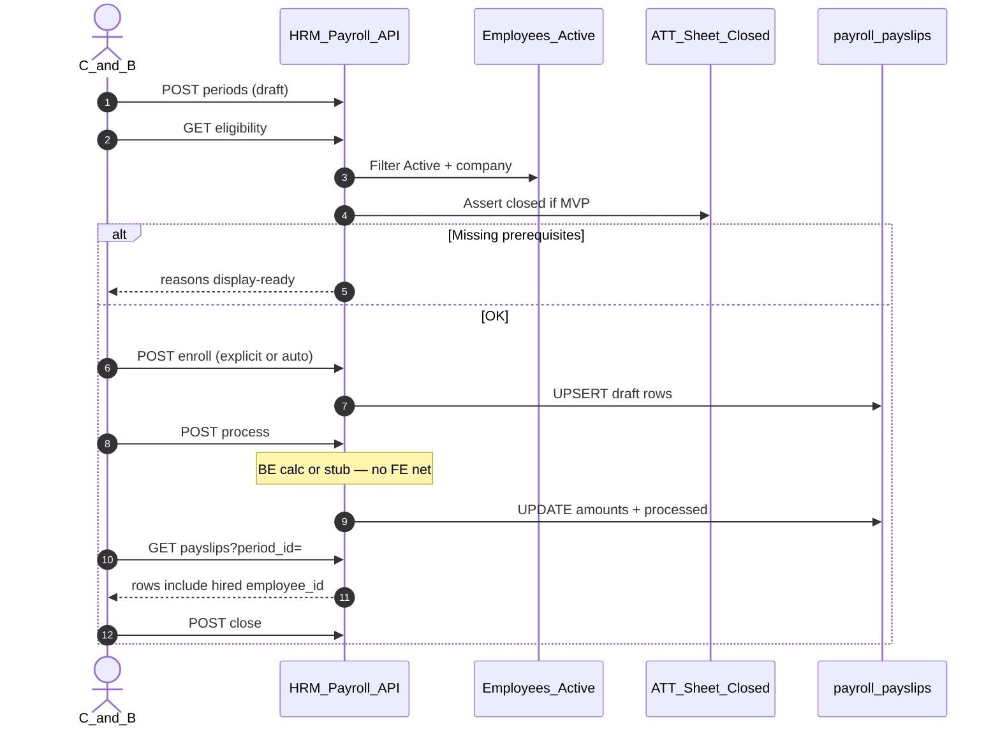

# PO-HRM-E2E-LINK-PAY-HIRE-TECH-01 — TechSpec / API_DESIGN · Hire→kỳ→phiếu + PROC bind

| Field | Value |
|-------|--------|
| **work_item_id** | `PO-HRM-E2E-LINK-PAY-HIRE-TECH-01` |
| **lane** | governance · sa |
| **change_mode** | ADD · **NO CODE** `apps/**` this SA wave · **Dev UNLOCK** after ba-data **CONFIRMED AS-IS** (`PO-HRM-E2E-LINK-PAY-HIRE-DB-01`) |
| **Date** | 2026-08-06 |
| **Status** | **DRAFT TechSpec + API_DESIGN F.1** — overlay AS-IS Nest `/payroll` · reuse Enterprise `F-PAY-PROCESS-01` / `F-PAY-PAYSLIP-01` · **DB §4 CONFIRMED AS-IS** (`PO-HRM-E2E-LINK-PAY-HIRE-DB-01` 2026-08-06) |
| **ref_srs** | [`SRS_HRM_ENTERPRISE.md`](../../client-delivery/hrm-enterprise-blueprint/SRS_HRM_ENTERPRISE.md) **v0.13** · **FR-UC-BP-PAY-06** Diễn biến **#1–#5** · AC-PAY-HIRE-01..03 · **FR-UC-BP-PAY-02** dual SoT · AC-PAY-COMP-01 |
| **ref_team** | [`docs/hrm/SRS.md`](../../hrm/SRS.md) UC-HRM-24 · §13.1 AC-PROC-05/06 · §16.2 dual SoT · §16.8 O4 |
| **ref_ba** | [`PO-HRM-E2E-LINK-PAY-CFG-SPEC-01.md`](./PO-HRM-E2E-LINK-PAY-CFG-SPEC-01.md) §A1 · §C P0-PAY-01..04 · §D1–D3 **MERGED** |
| **ref_docs** | [`po-hrm-e2e-link-pay-cfg-docs-01.md`](../../qa/evidence/po-hrm-e2e-link-pay-cfg-docs-01.md) |
| **ref_enterprise_ts** | [`TECHSPEC_HRM_ENTERPRISE.md`](../../client-delivery/hrm-enterprise-blueprint/TECHSPEC_HRM_ENTERPRISE.md) §7 P1–P6 · `F-PAY-ATT-CLOSED-01` · `F-PAY-PROCESS-01` · `F-PAY-PAYSLIP-01` (**no wipe**) |
| **ref_os** | `_vibe-team-os/28-FE-BE-SEPARATION-DISPLAY-READY.md` · `13` §3.4.11 **F.1** |
| **AS-IS code (read-only)** | `apps/api/hrm-api/src/payroll/payroll.service.ts` — `processPayrollPeriod` **status-only**; `upsertPayslip` **internal**; FE `usePayrollBatches` `addRecord` **throw** · `employee_count: 0` |
| **Honesty** | `payroll_e2e_ready=false` · `processes_catalog_bound=false` · `settings_catalog_e2e_ready=false` · U65 zero-seed · **cấm** seed payslip/NV |
| **ack_status** | **PASS_TO_PM** |

---

## 0. Context & objective

**Business intent:** Đóng Hire-to-Pay **bước 6** (P0-PAY-01): sau NV **Hoạt động**, C&B tạo/chọn kỳ → đưa NV / chạy đợt → danh sách phiếu có `employee_id` **hoặc** empty kèm lý do đo được (AC-PAY-HIRE-01). Không toast success khi chưa persist (AC-PAY-HIRE-02). Kỳ closed reject mutate (AC-PAY-HIRE-03).

**Architecture truth (AS-IS → TO-BE):**

| Fact | AS-IS | TO-BE (this wave) |
|------|-------|-------------------|
| Create period | `POST /payroll/periods` → `draft` | **keep** (PAY-06 #1) |
| Process | `POST …/process` → **UPDATE status only** · **no** payslip INSERT | **must** enroll-eligible + generate/upsert payslip **then** `draft→processed` |
| Enroll / Thêm NV | FE throw «chưa hỗ trợ» | Explicit enroll API **hoặc** auto trong process (Option A) |
| Close | `POST …/close` `processed→closed` | **keep** SM; reject mutate after closed |
| List payslips | `GET /payroll/payslips` scope OK | **keep** — PASS khi row xuất hiện sau enroll/process |
| Formula authoring | Q-PAY-FORMULA HOLD | Runtime GĐ1: BE evaluate **stub/metadata bind** — **cấm FE tự tính net** (OS 28) |
| Processes menu | hard `[]` | GET catalog §55–58 **hoặc** empty + **AC-PROC-05** deep-link (cấm fake CRUD) |

**Non-goals:** claim `payroll_e2e_ready`; drag-drop formula GĐ2; HRM CRUD `company_processes`; seed UAT evidence; wipe Enterprise §7 stubs.

---

## 1. Decision — enroll/generate path (Option A/B/C)

| Option | Shape | Pros | Cons | Verdict |
|--------|-------|------|------|---------|
| **A — Process = generate** | Mở rộng `POST …/process`: quét NV đủ điều kiện → upsert payslip → status `processed` | Một nút FE «Khóa/Chạy»; khớp Enterprise `F-PAY-PROCESS-01`; ít surface | «Thêm NV» dialog khó map; khó preview trước process | **Acceptable MVP** nếu FE ẩn dialog |
| **B — Enroll + Process generate** | `POST …/enroll` (explicit / auto-eligible) → draft payslips; `POST …/process` recalc + `draft→processed` | Khớp Diễn biến **#3** «đưa NV **hoặc** chạy đợt»; AC-PAY-HIRE-02 rõ trên từng nút; preview #4 trước close | 1 endpoint mới | **RECOMMENDED** |
| **C — Status-only process + separate generate** | Giữ process SM; thêm `…/generate` | Tách SM vs calc | Dễ lệch FE `lockBatch=process+close` hiện tại; 2 bước ẩn | Reject GĐ1 |

**Khuyến nghị khóa:** **Option B**.

```text
Diễn biến #1  → POST/GET periods (AS-IS)
Diễn biến #2  → GET …/periods/:id/eligibility (display-ready reasons)  [ADD]
Diễn biến #3  → POST …/enroll  (explicit employee_ids OR mode=auto_eligible)
Diễn biến #3b → POST …/process (BE calc/upsert amounts + status→processed)  [EXPAND]
Diễn biến #4  → GET /payroll/payslips?period_id=  (AS-IS + count)
Diễn biến #5  → POST …/close  (AS-IS; reject enroll/process after closed)
```

**OS 28 lock:** mọi `gross_amount` / `deduction_amount` / `net_amount` / eligibility / skip reason = **BE display-ready**. FE chỉ bind + toast theo HTTP. **Cấm** FE `net = gross - deduction` làm SoT.

---

## 2. Capability map — F-PAY-HIRE-* (overlay physical Nest)

**Prefix physical:** `/api/hrm/payroll`  
**Envelope:** `{ code, message, data }`  
**Scope:** cùng `resolveHrmListScope` + `assertResourceInHrmScope` trên period/payslip list↔get↔mutate (U19 `scope_parity`).

| Cap | F-id | METHOD / path | Logical (Enterprise) | SRS bước |
|-----|------|---------------|----------------------|----------|
| Tạo / list kỳ | **F-PAY-HIRE-01** | `POST/GET /payroll/periods` | `pay_payroll_period` | **PAY-06 #1** · AC-PAY-HIRE-03 overlap |
| Eligibility preview | **F-PAY-HIRE-02** | `GET /payroll/periods/:periodId/eligibility` **ADD** | precheck bundle | **PAY-06 #2** · PAY-01 sheet |
| Enroll NV / auto | **F-PAY-HIRE-03** | `POST /payroll/periods/:periodId/enroll` **ADD** | period membership = draft payslip | **PAY-06 #3** · AC-PAY-HIRE-01/02 |
| Process + generate | **F-PAY-HIRE-04** | `POST /payroll/periods/:periodId/process` **EXPAND** | overlay **`F-PAY-PROCESS-01`** | **PAY-06 #3–#4** · P1 closed sheet |
| List / get phiếu | **F-PAY-HIRE-05** | `GET /payroll/payslips` (+ optional `/:id`) | overlay **`F-PAY-PAYSLIP-01`** | **PAY-06 #4** · J-HRM-07 |
| Close kỳ | **F-PAY-HIRE-06** | `POST /payroll/periods/:periodId/close` | SM closed | **PAY-06 #5** · AC-PAY-HIRE-03 |
| PROC catalog bind | **F-PROC-BIND-01** | `GET` settings-catalogs / catalog-sync keys §55–58 | XBOS-DM-HRM-14 | AC-PROC-05/06 |
| Dual SoT TP | **F-PAY-COMP-01** | create/update salary component | PAY-02 · SC-PAY-01 | AC-PAY-COMP-01 |

**Reuse — không invent SoT:**

| Reuse | Do not invent |
|-------|----------------|
| `payroll_periods` / `payroll_payslips` AS-IS | Second “batch_records” table làm SoT song song |
| `upsertPayslip` internal path | FE POST raw net amounts as authority |
| Soft `employee_id` app-enforced (TECHSPEC § soft FK) | Hard FK migration blocking GĐ1 (optional ba-data later) |
| Settings `salary_components` + `pay_types` | Free-text mã SoT khi catalog có items |

---

## 3. API_DESIGN F.1 — Hire-to-Pay (PAY-06 #1–#5)

### 3.1 F-PAY-HIRE-01 — Create / list period (AS-IS keep)

| | |
|--|--|
| **Mục đích** | Tạo / liệt kê kỳ lương đúng pháp nhân ở trạng thái nháp để bắt đầu Hire-to-Pay bước lương. |
| **Nghiệp vụ xử lý** | (1) Scope JWT + `company_id`. (2) `POST`: validate date range; reject overlap → `HRM-PAY-002` (AC-PAY-HIRE-03). (3) Insert `payroll_periods` status=`draft`. (4) List: **display-ready** `employee_count` = `COUNT(payslips)` cùng `period_id` (không hard-code 0). |
| **Tham chiếu bước SRS** | **FR-UC-BP-PAY-06** Diễn biến **#1** · AC-PAY-HIRE-03. |
| **Request → DB** | `company_id`, `period_label`, `start_date`, `end_date` → `payroll_periods.*`. |
| **Response → DB** | Period row + `employee_count`, `status`, dates ISO. |
| **Lỗi** | `HRM-PAY-002` overlap · scope 403/409 · `HRM-VAL-400`. |

---

### 3.2 F-PAY-HIRE-02 — Eligibility preview **ADD**

| | |
|--|--|
| **Mục đích** | Trước enroll/process, trả tập NV đủ/thiếu điều kiện kèm **lý do tiếng Việt display-ready** — chống empty im lặng (AC-PAY-HIRE-01). |
| **Nghiệp vụ xử lý** | (1) Load period in scope; reject nếu `closed`. (2) Quét NV `employment` **Hoạt động** (hoặc status Active AS-IS) cùng `company_id` giao kỳ. (3) Prefetch sheet chốt (PAY-01) nếu MVP flag `require_closed_timesheet=true` — map `F-PAY-ATT-CLOSED-01`. (4) Prefetch công thức đã phát hành nếu có; nếu Q-PAY-FORMULA HOLD → `formula_status=stub_allowed` (không block enroll; process dùng stub BE). (5) Mỗi NV: `eligible: boolean` + `reasons[]` mã ổn định (`NOT_ACTIVE`, `WRONG_COMPANY`, `NO_CLOSED_SHEET`, `HIRE_MID_MONTH` info). |
| **Tham chiếu bước SRS** | **PAY-06 #2** · FR-UC-BP-PAY-01 · PAY-04 mid-month. |
| **Request** | Path `periodId` + `company_id`. |
| **Response → DB** | Read-only assemble: `{ period_id, require_closed_timesheet, eligible_count, ineligible_count, items:[{ employee_id, employee_code, employee_name, eligible, reasons[], hire_date? }] }`. **Cấm** FE tự suy eligibility. |
| **Lỗi** | `HRM-PAY-404` · `HRM-PAY-003` nếu period closed cho preview mutate path · scope 409. |

**MVP flag (config / env hoặc company setting — ba-data chốt tên):**

| Flag | Default GĐ1 spine | Effect |
|------|-------------------|--------|
| `require_closed_timesheet` | **true** khi sheet module sẵn; **false** chỉ khi ATT sheet gate chưa live (honesty note trong evidence) | `NO_CLOSED_SHEET` → ineligible |

---

### 3.3 F-PAY-HIRE-03 — Enroll **ADD**

| | |
|--|--|
| **Mục đích** | Đưa NV đủ điều kiện vào kỳ bằng cách tạo / giữ **phiếu nháp** (`payroll_payslips` status=`draft`) — khóa mang `employee_id` + `period_id`. |
| **Nghiệp vụ xử lý** | (1) Period phải `draft` (hoặc cho phép re-enroll khi `processed` **chưa** `closed` — GĐ1: **chỉ `draft`**). (2) Body: `{ mode: 'explicit', employee_ids: UUID[] }` **hoặc** `{ mode: 'auto_eligible' }`. (3) Re-run eligibility server-side (không tin FE). (4) Với mỗi eligible: `UPSERT payroll_payslips` UQ `(period_id, employee_id)` — amounts ban đầu `0` + status=`draft` **hoặc** giữ amounts nếu đã process trước (idempotent). (5) Ineligible trong `explicit` → **400** partial với `rejected[]` reasons **hoặc** `207`-style payload trong `data` (khuyến nghị: **200** với `{ enrolled[], rejected[] }` — không toast success nếu `enrolled.length===0`). (6) **FORBIDDEN:** accept client `net_amount` làm SoT. |
| **Tham chiếu bước SRS** | **PAY-06 #3** · AC-PAY-HIRE-01 · AC-PAY-HIRE-02 · Hire-to-Pay spine O1#6. |
| **Request → DB** | `mode`, `employee_ids?` → resolve employees → upsert `payroll_payslips`. |
| **Response → DB** | `{ period_id, enrolled:[{ payslip_id, employee_id, … }], rejected:[{ employee_id, reasons[] }], employee_count }`. Codes: `HRM-PAY-ENROLL-200`. |
| **Lỗi** | `HRM-PAY-003` wrong status · `HRM-PAY-404` · `HRM-PAY-ENROLL-EMPTY` khi auto_eligible=0 **và** không silent (message VI) · scope 409. |

**Khóa mang:**

```text
employee_id (Active) + company_id == period.company_id
  → payroll_payslips (period_id, employee_id) UQ
  → GET payslips chứa employee_id (AC-PAY-HIRE-01)
```

---

### 3.4 F-PAY-HIRE-04 — Process + generate **EXPAND** (`F-PAY-PROCESS-01` overlay)

| | |
|--|--|
| **Mục đích** | Chạy đợt tính lương kỳ: đảm bảo có tập phiếu (enroll nếu thiếu theo policy) → **BE** tính/ cập nhật số tiền → chuyển kỳ `draft→processed`. |
| **Nghiệp vụ xử lý** | (1) Period in scope; chỉ từ `draft` (giữ `HRM-PAY-003`). (2) **Precheck** sheet chốt nếu flag (412 `HRM-PAY-ATT-412` / map `F-PAY-ATT-CLOSED-01`). (3) Nếu **0** payslip rows: **auto enroll** `auto_eligible` **hoặc** fail `HRM-PAY-ENROLL-REQUIRED` với message VI (không status-only thành công). (4) Với mỗi payslip/NV: đọc biến ATT closed + C&B (Enterprise P2) nếu có; evaluate formula metadata **hoặc stub GĐ1** → set `gross/deduction/net` **trên BE**; status payslip `draft→processed`. (5) UPDATE period `processed` + `processed_at`. (6) Response display-ready: period + `employee_count` + `payslip_summary { total_gross, total_net }` do BE aggregate. (7) **FORBIDDEN:** FE gửi net; process chỉ UPDATE status như AS-IS. |
| **Tham chiếu bước SRS** | **PAY-06 #3 · #4** · FR-UC-BP-PAY-01 P1 · Enterprise `F-PAY-PROCESS-01` · OS 28. |
| **Request** | Path `periodId` (+ optional `{ force_reenroll?: boolean }` — default false). |
| **Response → DB** | Period processed + counts; optional `skipped[]` NV thiếu biến với reason. |
| **Lỗi** | `HRM-PAY-003` · `HRM-PAY-ATT-412` · `HRM-PAY-ENROLL-REQUIRED` · `HRM-PAY-404` · scope 409. |

**GĐ1 formula honesty:** Khi Q-PAY-FORMULA HOLD, stub BE **được phép** ghi `0` + `calc_mode: 'stub'` trên response — **vẫn** phải tạo/ cập nhật **row phiếu** để AC-PAY-HIRE-01 PASS (có `employee_id`). Không được coi «0 mãi không row» là OK.

---

### 3.5 F-PAY-HIRE-05 — List payslips (AS-IS + contract note)

| | |
|--|--|
| **Mục đích** | Xem trước / xác nhận phiếu sau enroll/process; chi tiết J-HRM-07. |
| **Nghiệp vụ xử lý** | List scope_parity; filter `period_id`; empty `[]` **hợp lệ** chỉ khi chưa enroll/process **hoặc** kèm period-level `empty_reason` nếu FE gọi kèm eligibility. |
| **Tham chiếu bước SRS** | **PAY-06 #4** · FR-UC-BP-PAY-08 · UC-HRM-24 · J-HRM-07. |
| **Response** | Display-ready amounts + `employee_id/code/name` — FE không tính lại. |
| **Lỗi** | 404 out-of-scope get-by-id (nếu ADD `GET …/payslips/:id`). |

---

### 3.6 F-PAY-HIRE-06 — Close (AS-IS keep + mutate guard)

| | |
|--|--|
| **Mục đích** | Khóa kỳ; từ chối enroll/process/sửa tính toán sau khóa. |
| **Nghiệp vụ xử lý** | Chỉ `processed→closed` (`HRM-PAY-004` giữ). Sau `closed`: enroll/process → `HRM-PAY-003`/`HRM-PAY-CLOSED`. |
| **Tham chiếu bước SRS** | **PAY-06 #5** · AC-PAY-HIRE-03. |

---

### 3.7 Sequence (architecture)



---

## 4. DB note — **CONFIRMED AS-IS** (`PO-HRM-E2E-LINK-PAY-HIRE-DB-01` · 2026-08-06)

| Object | AS-IS | Rule GĐ1 |
|--------|-------|----------|
| `payroll_periods` | id, company_id, dates, status draft/processed/closed · UQ `(company_id, start_date, end_date)` | keep SM |
| `payroll_payslips` | `period_id` **HARD** FK; `employee_id` **SOFT** UUID NOT NULL; UQ `(period_id, employee_id)` · `upsertPayslip` ON CONFLICT | **Enrollment SoT = payslip draft row** — **đủ** F-PAY-HIRE-03/04 |
| Amounts | NUMERIC gross/deduction/net | **BE-only write** on enroll/process |
| Eligibility reasons | — | Ephemeral GET eligibility — **no** new table GĐ1 |
| `calc_mode` / `skip_reason` columns | — | **NOT ADD GĐ1** — stub/`skipped[]` on **response** only; optional P1 audit DDL later |
| Sheet bind | Enterprise logical `pay_period_timesheet_bind` | GĐ1 physical: **`attendance_sheets`** `status=closed` + company + date overlap — **no** invent bind table; **no** hard FK sheet |
| Parallel membership | — | **FORBIDDEN** invent `batch_records` SoT |
| Hard FK employees | soft UUID | **FORBIDDEN** migration blocking GĐ1 (G-DB-02) |

**Flag:** `require_closed_timesheet` default GĐ1 = **`true`** (sheet close LIVE). Detail: [`PO-HRM-E2E-LINK-PAY-HIRE-DB-01.md`](./PO-HRM-E2E-LINK-PAY-HIRE-DB-01.md).

**Stamp:** ✅ **CONFIRMED** — AS-IS `payroll_periods` / `payroll_payslips` đủ enroll=draft payslip UQ `(period_id, employee_id)`. **No migrate** this wave. `payroll_e2e_ready=false`.

---

## 5. Dual SoT — `salary_components` vs `pay_types` vs TX (F-PAY-COMP-01)

| Layer | storageKey / SoT | Contract |
|-------|------------------|----------|
| Catalog mã TP | `salary_components` | Khi `effectiveItems.length > 0` → create TP **bắt buộc** `code` ∈ catalog (hoặc extension approved) — **AC-PAY-COMP-01** |
| Bản chất / loại | `pay_types` | `component_type` / nature = picker code — **giữ** (đã ok S6) |
| TX instance | salary_components TX / template lines | Persist **reference code**; **cấm** Input mã free-text SoT khi catalog non-empty |
| Empty catalog | `effectiveItems===0` | Cho phép tạo mã mới **local** + CTA sync Settings (honesty) — không fake catalog |

**API align (narrow — FE/BE cùng wave COMP hoặc gói HIRE-FE):**

- `POST/PATCH` salary component: validate code against settings-catalogs snapshot cùng scope.
- Error: `HRM-PAY-COMP-CODE-REQUIRED` / `HRM-PAY-COMP-CODE-UNKNOWN`.
- **Cấm** coi free-text name là SoT mã.

---

## 6. PROC bind — F-PROC-BIND-01 (P0-PROC-01/02)

### 6.1 Ownership (locked)

| | |
|--|--|
| SoT định nghĩa | XBOS workflow / DM §55–58 · **XBOS-DM-HRM-14** |
| HRM menu `/processes` | **Read-only** bind snapshot — **cấm** CRUD API HRM · **cấm** fake toast |
| Empty | Hợp lệ khi catalog thật 0 item **sau** GET sống — **không** hard-coded `queryFn → []` |

### 6.2 Catalog keys (DM §9 STT 55–58) — proposed storageKey

> ba-data / XBOS allow-list **confirm** exact keys. Logical mapping:

| STT | Danh mục (DM) | Proposed `storageKey` (canonical) | Aliases (read try-list) |
|-----|---------------|-----------------------------------|-------------------------|
| 55 | Mã QT chỉnh sửa chấm công | `hrm_attendance_correction_wf` | `attendance_correction_workflow`, `wf_attendance_edit` |
| 56 | Mã QT nghỉ phép | `hrm_leave_approval` | `leave_workflow`, `wf_leave` |
| 57 | Mã QT duyệt mở rộng danh mục HRM | `hrm_catalog_extension_wf` | `catalog_extension_workflow` |
| 58 | Mã QT duyệt thay đổi metadata NV | `hrm_employee_metadata_wf` | `employee_metadata_workflow`, `wf_metadata_change` |
| 59 (optional group) | Nhóm quy trình | `hrm_workflow_groups` | — | out_mvp list filter |

### 6.3 API contract (reuse — không invent HRM `/processes` CRUD)

| | |
|--|--|
| **Mục đích** | Cấp snapshot mã quy trình đã pull để menu Quy trình hiển thị read-only. |
| **Nghiệp vụ xử lý** | (1) FE gọi `GET /api/hrm/settings-catalogs` (hoặc catalog-sync effective) với keys §55–58. (2) Merge items display-ready `{ code, name, catalog_key, status }`. (3) Nếu tất cả keys 0 item → empty honest. (4) **Không** POST/PATCH/DELETE process. |
| **Tham chiếu bước SRS** | team §13.1 · AC-PROC-01..06 · matrix processes row. |
| **Deep-link AC-PROC-05 (bắt buộc khi empty hoặc luôn có help)** | Nút/link kích hoạt được → Command Center quản trị WF/catalog (route portal đã có — vd. workflow admin / config-sync). **Không** chỉ text tĩnh. |
| **AC-PROC-06** | Sau XBOS publish + HRM pull có item → list **≠** hard `[]`. |
| **Lỗi** | API fail → ERROR banner (không nuốt thành empty giả); empty thật → AC-PROC-03 + deep-link. |

**FE mandate:** thay `useProcesses` hard `[]` bằng GET trên; giữ read-only Eye; **cấm** reintroduce Thêm/Sửa/Xóa toast.

---

## 7. FE wire rules (dev-fe — không code trong wave SA)

| Surface | Must | Must not |
|---------|------|----------|
| `usePayrollBatches` | `addRecord` → `POST enroll`; `fetchBatchRecords` → payslips/enrolled; `employee_count` từ API; `lockBatch` = process **rồi** close chỉ khi process đã generate | toast success trên void/throw path (P0-PAY-04); FE tính net |
| Eligibility UI | hiển thị `reasons[]` VI từ F-PAY-HIRE-02 | im lặng 0 NV |
| SalaryComponentsTab | picker `salary_components` khi items>0 + `pay_types` nature | free-text mã SoT |
| Processes | bind GET §55–58 + deep-link | fake CRUD · hard `[]` |

---

## 8. Error taxonomy (stable)

| Code | HTTP | When |
|------|------|------|
| `HRM-PAY-002` | 409 | Period date overlap |
| `HRM-PAY-003` | 409 | Invalid status transition / mutate closed |
| `HRM-PAY-004` | 409 | Close from non-processed |
| `HRM-PAY-404` | 404 | Period/payslip out of scope |
| `HRM-PAY-409` | 409 | company scope mismatch |
| `HRM-PAY-ATT-412` | 412 | Sheet not closed (MVP gate) |
| `HRM-PAY-ENROLL-REQUIRED` | 409 | Process with 0 slips and auto enroll disabled/empty |
| `HRM-PAY-ENROLL-EMPTY` | 400/409 | Auto enroll found 0 eligible — message VI |
| `HRM-PAY-COMP-CODE-REQUIRED` | 400 | Catalog non-empty; code missing |
| `HRM-PAY-COMP-CODE-UNKNOWN` | 400 | Code not in `salary_components` |

---

## 9. Client TECHSPEC pointer (DOC-DELTA — no wipe)

APPEND only vào [`TECHSPEC_HRM_ENTERPRISE.md`](../../client-delivery/hrm-enterprise-blueprint/TECHSPEC_HRM_ENTERPRISE.md) §7 (ba-docs/sa later):

```text
DOC-DELTA PO-HRM-E2E-LINK-PAY-HIRE-TECH-01:
- Overlay F-PAY-PROCESS-01 = generate payslips (not status-only)
- ADD F-PAY-HIRE-02 eligibility · F-PAY-HIRE-03 enroll
- Physical Nest paths /api/hrm/payroll/periods/:id/{eligibility,enroll,process,close}
- Hire-to-Pay bước 6 ↔ FR-UC-BP-PAY-06 #1–#5
- payroll_e2e_ready=false until QA J-HRM-07b
```

**Cấm** wipe P1–P6 / formula HOLD rows.

---

## 10. Dev gate & honesty

| Gate | Value |
|------|-------|
| `apps/**` this wave | **HOLD** |
| `payroll_e2e_ready` | **false** |
| `processes_catalog_bound` | **false** until AC-PROC-06 browser |
| U65 | zero-seed |
| Unlock Dev | ba-data CONFIRMED **hoặc** PM stamp «AS-IS DB đủ» trên bus + TechSpec này |

**must_keep:** soft-delete only; scope_parity; empty 200 trung thực; no fake processes CRUD; OS 28 no FE net calc.

---

## 11. Validation / acceptance evidence plan

| AC / Journey | Evidence when Dev done |
|--------------|------------------------|
| AC-PAY-HIRE-01 | Browser: hire Active → enroll/process → `GET payslips` có NV **hoặc** eligibility reasons — U65 |
| AC-PAY-HIRE-02 | Network fail / throw → **no** success toast |
| AC-PAY-HIRE-03 | Closed period reject enroll/process |
| AC-PAY-COMP-01 | Create TP với catalog>0 bắt buộc picker code |
| AC-PROC-05/06 | Processes list từ GET **hoặc** empty+clickable CC link |
| J-HRM-07 / proposed **J-HRM-07b** | list→detail F5 |
| Jest | process inserts/upserts payslip; enroll scope; reject closed |

---

## Completion contract

- `completion_report`: (xem evidence)
- `next_owner`: **pm** → **ba-data** (narrow) **và/hoặc** **dev-be + dev-fe** + **dev-fe PROC-BIND**
- `ack_status`: **PASS_TO_PM**
- `evidence_path`: `docs/qa/evidence/po-hrm-e2e-link-pay-hire-tech-01.md`
