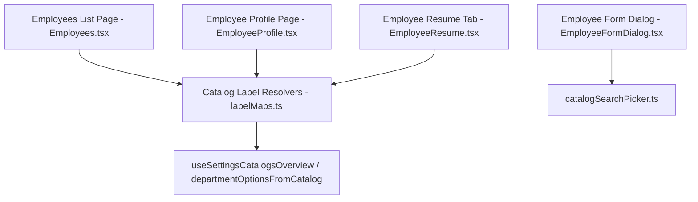

# PO-HRM-EMP-PROFILE-CATALOG-TECHSPEC-01.md — TECHNICAL SPECIFICATION (TECHSPEC)
## KIẾN TRÚC THÀNH PHẦN & LUỒNG DỮ LIỆU DANH MỤC HỒ SƠ NHÂN VIÊN

---

## 1. TỔNG QUAN KIẾN TRÚC & THÀNH PHẦN (COMPONENT ARCHITECTURE)

### 1.1. Phân định Trách nhiệm Các File Component & Utility
- **`labelMaps.ts` (Pure Resolvers Layer)**:
  - `resolveDepartmentDisplay(val, catalogOptions)`: Chuyển đổi `DEPT_02` ➔ "Vận hành".
  - `resolveGenderDisplay(val)`: Chuyển đổi `male` ➔ "Nam".
  - `resolveEmploymentTypeDisplay(val)`: Chuyển đổi `full_time` ➔ "Toàn thời gian".
  - `resolveJobTitleDisplayLabel(source, catalogOptions)`: Chuyển đổi `LEGAL_SPECIALIST` ➔ "Chuyên viên Pháp chế".
- **`Employees.tsx` (List Component)**:
  - Render bảng dữ liệu nhân viên, sử dụng `resolveDepartmentDisplay` cho cột Phòng ban.
  - Xử lý menu thao tác 1-click không chứa `e.preventDefault()`.
- **`EmployeeProfile.tsx` & `EmployeeResume.tsx` (Detail Components)**:
  - Tra cứu nhãn phòng ban, chức vụ, giới tính bằng bộ resolver từ `labelMaps.ts`.
- **`EmployeeFormDialog.tsx` (Modal Form Component)**:
  - Cấu trúc Lưới 2 cột ghép cặp mật độ cao (High-density 2-column grid).
  - Tự động khử trùng lặp các trường alias với built-in fields.

---

## 2. CHUẨN HÓA DỮ LIỆU & QUY TRÌNH TRA CỨU (DATA FLOW & RESOLVER PATTERN)

### 2.1. Luồng xử lý `resolveDepartmentDisplay`
1. **Đầu vào**: `department` (chuỗi mã DB hoặc tên phòng ban), `catalogOptions` (mảng tùy chọn danh mục).
2. **Các bước tra cứu**:
   - Bước 1: Nếu `department` rỗng ➔ Trả về `EM_DASH` (`—`).
   - Bước 2: Tìm kiếm khớp mã `value` hoặc `code` trong `catalogOptions` ➔ Nếu tìm thấy, trả về `match.label`.
   - Bước 3: Tra cứu trong từ điển mã thô kỹ thuật `techMap` (`dept_01` ➔ "Ban Giám đốc", `dept_02` ➔ "Vận hành", `dept_03` ➔ "Nhân sự", `dept_04` ➔ "Kế toán"...).
   - Bước 4: Nếu `department` là chuỗi ngôn ngữ tự nhiên tiếng Việt ➔ Giữ nguyên chuỗi.
   - Bước 5: Nếu là mã kỹ thuật không xác định ➔ Trả về `EM_DASH` (`—`). Nghiêm cấm trả về mã thô `DEPT_999`.

---

## 3. THAM CHIẾU QUY TRÌNH PHÁT TRIỂN (DEVELOPMENT TRACEABILITY)

Tất cả các file mã nguồn liên quan **BẮT BUỘC** khai báo khối `@CODE-MEMORY` với đầy đủ liên kết:
- **SRS**: `docs/program/specs/PO-HRM-EMP-PROFILE-CATALOG-SRS-01.md`
- **TechSpec**: `docs/program/specs/PO-HRM-EMP-PROFILE-CATALOG-TECHSPEC-01.md`
- **API Contract**: `docs/program/specs/PO-HRM-EMP-PROFILE-CATALOG-API-01.md`
- **UIUX Spec**: `docs/program/specs/PO-HRM-TEMPLATE-BUILDER-UIUX-SPEC-01.md` §6–§8
- **Business Rules**: `BR-EMP-01`, `BR-EMP-02`, `BR-EMP-03`, `BR-EMP-04`, `BR-EMP-05`
