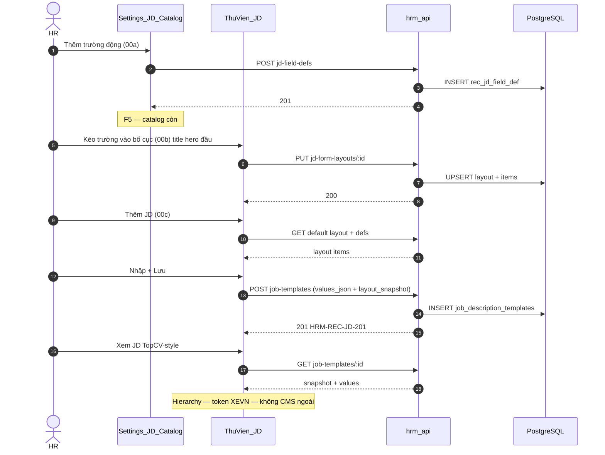

# PO-HRM-JD-DYNAMIC-ARCH-01 — Architecture optioning + TechSpec DRAFT skeleton

| Field | Value |
|-------|--------|
| **work_item_id** | `PO-HRM-JD-DYNAMIC-ARCH-01` |
| **lane** | governance · sa |
| **Status** | DRAFT — ADR-lite recommendation; **ALIGNED** to BA DRAFT files (deepen after sponsor confirm) |
| **Date** | 2026-08-06 |
| **Decision owner** | SA |
| **Slice** | [`docs/program/slices/PO-HRM-JD-DYNAMIC-TOPCV.md`](../slices/PO-HRM-JD-DYNAMIC-TOPCV.md) |
| **ref_srs** | [`PO-HRM-JD-DYNAMIC-SPEC-01.md`](./PO-HRM-JD-DYNAMIC-SPEC-01.md) — FR-UC-BP-REC-00a/b/c (DRAFT) |
| **ref_data** | [`PO-HRM-JD-DYNAMIC-DATA-01.md`](./PO-HRM-JD-DYNAMIC-DATA-01.md) — `rec_jd_field_def` / layout / master values (DRAFT-DATA) |
| **Related ADR** | [`ADR-METADATA-APPLY-CONSUMERS-DELTA-20260620.md`](../../architecture/ADR-METADATA-APPLY-CONSUMERS-DELTA-20260620.md) · scope ladder · REC Lane B ≠ FR-RC-01 |
| **Locks** | `remaster_program_done=false` · `face_live=false` · U65 zero-seed · cấm `apps/**` this wave |
| **creative_extra** | `none` — TopCV = layout/hierarchy quality bar only; XEVN Precision Motion tokens |

---

## 0. BA sync status

| Artifact | Path | Status |
|----------|------|--------|
| Process SRS delta | [`PO-HRM-JD-DYNAMIC-SPEC-01.md`](./PO-HRM-JD-DYNAMIC-SPEC-01.md) | **ON DISK** DRAFT — FR-00a/b/c |
| Data contract | [`PO-HRM-JD-DYNAMIC-DATA-01.md`](./PO-HRM-JD-DYNAMIC-DATA-01.md) | **ON DISK** DRAFT-DATA — entities + ownership |
| SA arch (this file) | `PO-HRM-JD-DYNAMIC-ARCH-01.md` | **ALIGNED** (post-intake) to BA SoT + Option A |

**Correction vs first draft intake:** Primary JD SoT = **Thư viện JD** (`job_description_templates` / logical `rec_job_description`) per FR-UC-BP-REC-00 + ba-data §1. Lane B `job_postings` = leftover — **forbidden** as JD/value SoT (no dual-write). Create/view dynamic surfaces anchor on **Job templates / JD library**, not Tin tuyển dụng posting form.

**Rule:** Dev **blocked** until sponsor confirms Option A + TechSpec deepen (ARCH-02) closes Q* with BA. No invent beyond SPEC/DATA DRAFT ids.

---

## 1. Decision context

### 1.1 Problem

Sponsor (2026-08-06) yêu cầu chuỗi:

```text
Cài đặt · catalog trường JD động
  → Builder kéo-thả trường vào bố cục JD
  → Popup «Thêm JD» render dynamic theo bố cục (title-first)
  → Màn xem JD kiểu TopCV / nền tảng tuyển VN (hierarchy hiện đại)
```

AS-IS **không** đáp ứng DnD / metadata form:

| Surface | Path | AS-IS |
|---------|------|-------|
| **Thư viện JD (SoT)** | `JobTemplatesTab` + `/job-templates` · `job_description_templates` | Flat `title`/`code`/`position_code`/`job_description`/`requirements` · FR-UC-BP-REC-00 |
| View JD master | Templates detail / thin UI | Chưa public-style hierarchy TopCV-bar |
| Tin tuyển dụng (Lane B) | `JobPostingsTab.tsx` · `job_postings` | Fixed Zod form + view dialog — **không** JD master SoT; out of value-write for this epic |
| YCTD | `job_requisitions.job_template_id` | Soft link → template; must_keep |
| Metadata precedent | Group HR → `settings-catalogs` extension-items · `buildDynamicFields` | Behavior pattern only — JD catalog **riêng** (SPEC §6.1) |

### 1.2 Constraints

- **must_keep:** FR-UC-BP-REC-00 YCTD↔JD linkage · Lane B `job_postings` **≠** FR-RC-01 (`job_requisitions`) SoT · catalog `position_key` / `position_code` · U65 FE-only UAT · soft-delete only.
- **Scope / RBAC:** cùng resolver list ↔ get-by-id ↔ mutate (`resolveHrmListScope` / `assertResourceInHrmScope`); Group CEO `main` rollup vs member slug — không leak cross-company field defs.
- **NFR:** `@xevn/platform-core` pattern; no seed for UAT evidence; display labels vi-VN (không raw key trên UI).
- **Non-goals (GĐ1):** public anonymous career site CMS; TopCV API sync; invent brand palette ngoài Precision Motion; Face LIVE.

### 1.3 Failure impact if unresolved

HR cấu hình trường theo CT/ngành không được → copy-paste mô tả dài → view JD kém chuyên nghiệp → regression brand/recruit UX; risk implement FE hardcode fields lệch Settings (lặp class lỗi metadata apply).

---

## 2. Options (solution-option-evaluation)

### Option A — Metadata form builder (in-HRM)

**Description:** Catalog định nghĩa trường (Settings) + layout JSON (DnD builder) + runtime form/view renderer trong HRM. Giá trị tin = canonical columns (index/list) **+** `field_values` JSONB (hoặc EAV) theo layout version. Reuse pattern Group HR metadata apply (producer Settings → consumer Create/View).

**Benefits:** Khớp sponsor literal (kéo trường · popup dynamic · view layout); một renderer cho create/edit/view; mở rộng field không ship FE mỗi lần; parity với ADR metadata consumers.

**Costs:** Schema layout versioning; validation engine theo `dataType`; FE DnD + a11y; BE endpoints catalog/layout/values; migration + scope tests.

**Risks:** Over-build nếu catalog không bounded; DnD UX chậm; layout drift giữa create vs public-style view nếu không single SoT layout.

### Option B — Fixed sections + custom attributes

**Description:** Giữ 3–5 section cố định (Mô tả / Yêu cầu / Quyền lợi / …) + bảng/attrs tùy chọn (key-value) gắn posting. Không DnD layout đầy đủ — Settings chỉ bật/tắt attrs + label. View «TopCV-like» = FE skin cố định đọc section + attrs.

**Benefits:** Nhanh hơn A; ít schema; ít rủi ro DnD; vẫn cho HR thêm vài trường phụ.

**Costs:** **Không** khớp «kéo trường vào» literal; mỗi section mới = FE change; khó A/B layout theo CT; title-first + dynamic dialog chỉ partial.

**Risks:** Sponsor reject vì thiếu builder; tech debt rồi vẫn phải lên A.

### Option C — External CMS (Headless / WordPress-like)

**Description:** SoT nội dung JD ở CMS ngoài; HRM chỉ deep-link hoặc iframe; publish webhook sync.

**Benefits:** Editor rich sẵn; marketing page đẹp.

**Costs:** Multi-tenant scope/RBAC phức tạp; U65 FE chain gãy; YCTD/JD master linkage; ops/secrets; không trong REC pillar boundary.

**Risks:** Data residency · SSO · stale sync · double SoT với `job_description_templates` — **reject GĐ1**.

---

## 3. Trade-off matrix

| Criteria | Weight | Option A | Option B | Option C |
|----------|-------:|:--------:|:--------:|:--------:|
| Fit sponsor literal (DnD + Settings + dynamic dialog + TopCV view) | 5 | **5** | 2 | 2 |
| Time to first usable slice | 3 | 2 | **4** | 1 |
| Complexity / blast radius | 3 | 2 | **4** | 1 |
| Scope / RBAC / multi-tenant safety | 5 | **4** | 4 | 1 |
| Maintainability (field change without FE ship) | 4 | **5** | 2 | 3 |
| Align existing metadata ADR / settings-catalogs | 4 | **5** | 3 | 1 |
| YCTD / FR-UC-BP-REC-00 spine preserve | 5 | **4** | 4 | 1 |
| U65 FE-only UAT feasibility | 4 | **4** | 4 | 1 |
| **Weighted (max 165)** | | **≈148** | ≈112 | ≈48 |

---

## 4. Failure modes and mitigation

| Option | Failure mode | Detection | Mitigation |
|--------|--------------|-----------|------------|
| **A** | Create dialog không đổi sau Settings save (apply ≠ consumer) | UF: F5 + reopen dialog · matrix producer→consumer | Registry map như ADR-METADATA; shared layout GET; AC «visible change» bắt buộc |
| **A** | Layout v2 làm mất data tin cũ | GET posting thiếu key | Persist `layout_version` + snapshot labels; render unknown keys fail-soft |
| **A** | Scope leak field defs CT A → CT B | Persona probe member CEO | `company_id` filter same as job-templates list/get |
| **A** | DnD phá title-first | QA create dialog order | System field `title` locked slot #1 — không cho drop dưới / remove |
| **B** | Sponsor: «không kéo được» | Review demo | Escalate → pivot A; không claim PASS Option B |
| **C** | Double SoT / sync stale | Audit YCTD vs CMS | Reject GĐ1; chỉ GĐ2 nếu ADR riêng |

---

## 5. ADR-lite recommendation

| | |
|--|--|
| **Selected** | **Option A — Metadata form builder (in-HRM)** |
| **Why** | Duy nhất khớp đủ 4 mắt xích sponsor; tái sử dụng pipeline metadata đã ADR; giữ REC data trong hrm-api (pillar boundary). |
| **Rejected B** | Partial fit — chỉ dùng nếu sponsor **explicit** cắt DnD khỏi GĐ1 (không mặc định). |
| **Rejected C** | Cross-system SoT · scope/U65 · YCTD linkage — out of GĐ1. |
| **Assumptions** | (1) «Thêm JD» primary = **Thư viện JD** / `job-templates` (SPEC-01 + DATA-01); (2) Layout model = ba-data **L1 default + layout_snapshot on save**; (3) Bounded `field_type` per DATA-01 §3.5; (4) System keys `title`/`code`/`position_code`/`status` locked — title-first. |
| **Aligned with ba-data** | Field defs = **HRM tenant CFG** `rec_jd_field_def` (not XBOS platform hard SoT GĐ1). Option B XBOS skeleton = GĐ2 only. |
| **Phased delivery (A)** | **A1** catalog + layout + dynamic JD create/edit + TopCV-style view in HRM. **A2** richer section themes / member `applies_to_company_ids`. **A3** (GĐ2) public career URL + optional XBOS field skeleton — **out** unless new ADR. |

**Decision status:** SA **RECOMMEND** — chờ **sponsor confirm** + BA SPEC/DATA trước TechSpec confirm / Dev unlock.

---

## 6. Target architecture (logical)

```text
┌─────────────────────────────────────────────────────────────┐
│ Settings (HRM) — FR-UC-BP-REC-00a                            │
│  · rec_jd_field_def catalog (field_key, label, field_type)  │
│  · Default layout publish (rec_jd_form_layout + items)      │
└───────────────────────────┬─────────────────────────────────┘
                            │ publish (2xx + consumer visible AC)
                            ▼
┌─────────────────────────────────────────────────────────────┐
│ Thư viện JD — FR-UC-BP-REC-00b/c                            │
│  · DnD palette → layout items (title locked first / hero)   │
│  · Create/Edit dialog dynamic                               │
│  · Public-style View (TopCV hierarchy bar · XEVN tokens)    │
└───────────────────────────┬─────────────────────────────────┘
                            │ values_json + layout_snapshot
                            ▼
┌─────────────────────────────────────────────────────────────┐
│ hrm-api · job_description_templates (rec_job_description)   │
│  · jd-field-defs · jd-form-layouts · templates CRUD extend  │
│  · YCTD soft FK job_template_id (must_keep)                 │
│  · FORBIDDEN dual-write job_postings as JD SoT              │
└─────────────────────────────────────────────────────────────┘
```

**Invariant:** Một **layout snapshot** trên JD master drive **cả** create/edit **và** view — cấm hai hardcode JSX lệch nhau (ADR-METADATA lesson).

---

## 7. FE surfaces (GĐ1)

| # | Surface | Menu / route (AS-IS anchor) | FR | Behavior |
|---|---------|-----------------------------|----|----------|
| F1 | **Settings · JD field catalog** | Cài đặt → cấu hình trường JD (SPEC §6) | 00a | CRUD `rec_jd_field_def`: `field_key`, `label`, `field_type`, required, sort, soft archive |
| F2 | **JD builder (DnD)** | Thư viện JD / Settings bố cục mặc định | 00b | Palette = active defs; sections per DATA-01; **title first in `hero`**; save layout items; F5 còn |
| F3 | **Create/Edit JD dialog dynamic** | Tuyển dụng → **Thư viện JD** (`JobTemplatesTab`) | 00c | Clone default layout → snapshot; dynamic RHF; system `code`/`position_code`; submit `values_json` |
| F4 | **Public-style JD view** | Xem JD trong HRM | 00c | Title-first hero · section blocks · XEVN tokens · **không** invent TopCV colors · **không** public career URL MVP |

**Out of epic write-path:** `JobPostingsTab` Lane B — không dual-write `field_values` JD master (ba-data §2 Forbidden).

**P0 UI riêng** (`PO-HRM-UI-P0-LOGO-FONT-TITLE-01`): logo dialog trắng · font hệ — song song; AC title-first đồng bộ SPEC.

---

## 8. BE endpoints sketch (aligned DATA-01)

Prefix draft: `/api/hrm/recruitment` (settings-catalogs extension-items = **behavior pattern only**, not table reuse — SPEC §6.1).

| Method | Path (draft) | Purpose | Entity |
|--------|--------------|---------|--------|
| GET | `/jd-field-defs?company_id=` | List defs | `rec_jd_field_def` |
| POST | `/jd-field-defs` | Create def | CFG |
| PATCH | `/jd-field-defs/:id` | Update / archive | get-by-id **scope_parity** |
| GET | `/jd-form-layouts?company_id=` | List layouts | `rec_jd_form_layout` |
| GET | `/jd-form-layouts/:id?company_id=` | Get layout + items | same resolver as list |
| PUT/POST | `/jd-form-layouts[/:id]` | Publish default / replace items | L1 |
| GET/POST/PATCH | `/job-templates` **(extend)** | `values_json`, `layout_snapshot`, dual-read legacy text cols | `job_description_templates` |
| GET | `/job-templates/:id` | View payload + snapshot | scope parity |

**Forbidden:** extending `job_postings` as JD values SoT.

**Error taxonomy (align DATA API F.1 when finalized):**

| Code | HTTP | When |
|------|------|------|
| `HRM-REC-JDFLD-400` | 400 | Unknown `field_type` / validation_json |
| `HRM-REC-JDLAY-404` | 404 | Layout not in scope |
| `HRM-REC-JDLAY-409` | 409 | companyId mismatch token |
| `HRM-REC-JD-VAL-400` | 400 | Required layout field missing / coerce fail |
| Existing | | `HRM-REC-JD-*` templates · `HRM-REC-JD-POS` position catalog |

---

## 9. DB entities (aligned DATA-01 — physical names provisional)

> Authoritative column lists: DATA-01 §3. SA adopts **L1 + layout_snapshot on save**.

| Logical | Physical alias AS-IS / new | Role |
|---------|---------------------------|------|
| E-JD-FIELD-DEF | `rec_jd_field_def` **(new)** | Settings catalog |
| E-JD-LAYOUT | `rec_jd_form_layout` **(new)** | Default / published layout |
| E-JD-LAYOUT-ITEM | `rec_jd_form_layout_item` **(new)** | DnD rows |
| E-JD-MASTER | `job_description_templates` → logical `rec_job_description` | values_json + layout_snapshot_json; dual-read `job_description`/`requirements` |
| E-YCTD | `job_requisitions` | `job_template_id` soft FK — must_keep |

**System-locked keys (DATA-01):** `title`, `code`, `position_code`, `status` — title min sort in section `hero`.

**Not in write-path:** `job_postings.field_values` — forbidden as JD SoT.

---

## 10. NFR · security · UAT

| NFR | Requirement |
|-----|-------------|
| Scope / RBAC | List/get/mutate cùng resolver; member CEO không đọc defs/layouts holding trừ rollup policy hiện hành |
| Auth | JWT + existing recruitment `assertAccess` / internal key |
| Validation | BE coerce by `data_type`; FE mirror; money vi-VN display / plain number API |
| Observability | Existing hrm-api metrics/log; no new service |
| Soft-delete | Defs/layouts/templates: deactivate; postings existing delete policy unchanged |
| U65 | UAT = Settings → Builder → Create → View → F5; **cấm seed** defs/layouts để pass QA |
| RLS | No new `PLATFORM_RLS_ENABLED` claim this wave — SA sign-off separate |
| Locks | `remaster_program_done=false` · `face_live=false` |

---

## 11. TechSpec DRAFT skeleton (`ref_srs` placeholders)

> **Status:** DRAFT skeleton only — **not** TechSpec confirm. Fill after `PO-HRM-JD-DYNAMIC-SPEC-01`.

### 11.1 Document control

| | |
|--|--|
| TechSpec id | `TECHSPEC-HRM-JD-DYNAMIC-v0.1-DRAFT` |
| `ref_srs` | `PO-HRM-JD-DYNAMIC-SPEC-01` · **FR-UC-BP-REC-00a/b/c** · spine FR-UC-BP-REC-00 |
| `ref_db` | `PO-HRM-JD-DYNAMIC-DATA-01` §3 |
| `ref_api` | DATA-01 API F.1 (deepen ARCH-02) |
| change_mode | ADD |
| preserve_default | true |

### 11.2 Capability map

| Cap | SRS | FE | BE |
|-----|-----|----|----|
| Catalog fields | FR-UC-BP-REC-00a | F1 | jd-field-defs · `rec_jd_field_def` |
| DnD layout | FR-UC-BP-REC-00b | F2 | jd-form-layouts + items |
| Dynamic create + view | FR-UC-BP-REC-00c | F3/F4 | job-templates extend + snapshot |
| YCTD link preserve | FR-UC-BP-REC-00 | Requisition JD picker | `job_template_id` |

### 11.3 Sequence (create tin — draft)



### 11.4 Open design questions (residual after BA DRAFT)

| ID | Question | SA lean (aligned) | Status |
|----|----------|-------------------|--------|
| Q1 | Builder dưới Settings vs trong Thư viện JD? | Catalog @ Settings; DnD @ Thư viện + optional default layout @ Settings | **Sponsor confirm** |
| Q2 | Tin tuyển dụng (`job_postings`) có dùng layout? | **No** GĐ1 — ba-data forbid dual-write | **Closed DRAFT** |
| Q3 | Rich text HTML? | GĐ1 short/long text per DATA enum — no CMS | **Closed DRAFT** |
| Q4 | Bảng riêng vs settings-catalogs? | **Bảng riêng** `rec_jd_*` (DATA-01) | **Closed DRAFT** |
| Q5 | Public career URL? | Out MVP (SPEC §3.2) | **Closed DRAFT** |
| Q6 | L1-only vs per-JD layout override? | **L1 + snapshot on save** (DATA-01) | **Closed DRAFT** — confirm sponsor OK |

### 11.5 AC gates (architecture-level — BA refine)

| AC | Pass when |
|----|-----------|
| AC-JD-ARCH-01 | Settings thêm field → Builder palette thấy field (F5) |
| AC-JD-ARCH-02 | Save layout → JD create dialog order khớp (title #1 / hero) |
| AC-JD-ARCH-03 | POST job-templates 2xx → View section theo snapshot; F5 còn |
| AC-JD-ARCH-04 | Member scope: không thấy defs/layouts CT khác (scope_parity) |
| AC-JD-ARCH-05 | Evidence UAT không có pnpm seed:* · J-HRM-JD-01..03 |
| AC-JD-ARCH-06 | YCTD vẫn chọn JD master hiệu lực (REC-00) — không regression |

---

## 12. Rollout / checkpoints

| Gate | Owner | Exit |
|------|-------|------|
| G0 Sponsor confirm Option A + Q1/Q6 | PM | Chat/bus CONFIRMED |
| G1 SPEC-01 + DATA-01 | ba-process · ba-data | **Done DRAFT** — promote when sponsor OK |
| G2 TechSpec deepen ARCH-02 (→ v0.2) | sa | API F.1 map Diễn biến # · close residual Q |
| G3 Slice + Dev | PM → dev-fe/dev-be | `JobTemplatesTab` + recruitment templates APIs · **not** job_postings SoT |
| G4 QA L2.5 | qa | Settings→DnD→Create JD→View · J-HRM-JD-01..03 · U65 |
| G5 QC | qc | GWC/GO — **không** stamp remaster_program_done |

**Rollback:** feature flag / layout default = legacy fixed form reading canonical columns only.

---

## 13. Validation & evidence plan

| Layer | Evidence |
|-------|----------|
| Arch | This file · sponsor confirm note on bus |
| Unit | BE layout validation + scope_parity jest; FE dynamic schema builder vitest |
| UAT | Browser U65 path; matrix rows TBD in SPEC-01 |
| NFR | Existing `qc:fe-be-health` when APIs touch HRM |

---

## 14. completion_report

**Closed**

- Option A/B/C evaluated + trade-off + failure modes.
- ADR-lite **recommend Option A** (in-HRM metadata form builder) — reject C; B only if sponsor cuts DnD.
- FE F1–F4 · BE sketch · DB aligned `rec_jd_*` + `job_description_templates` · NFR/U65 · TechSpec DRAFT skeleton.
- **Post-intake ALIGN:** primary SoT = Thư viện JD (not Lane B `job_postings`); `ref_srs` FR-UC-BP-REC-00a/b/c; DATA-01 L1+snapshot.
- Locks honored; **no `apps/**`**.

**Residual (not WAITING_BA files — DRAFTs on disk)**

- Sponsor confirm Option A + Q1 (Settings vs Thư viện DnD) + Q6 (L1+snapshot).
- ARCH-02 deepen: API F.1 map Diễn biến # from SPEC; physical SQL names final.
- Dev unlock **blocked** until confirm + TechSpec v0.2.

---

## 15. Handoff

| Field | Value |
|-------|--------|
| **ack_status** | `PASS_TO_PM` |
| **next_owner** | `pm` |
| **evidence_path** | `docs/program/specs/PO-HRM-JD-DYNAMIC-ARCH-01.md` |
| **BA sync** | SPEC-01 + DATA-01 **ON DISK DRAFT** — arch **ALIGNED**; not WAITING_BA |

### next_dispatch_prompt (copy-ready)

```text
work_item_id: PO-HRM-JD-DYNAMIC-SPONSOR-CONFIRM-01
lane: pm → sponsor chat, then sa ARCH-02 (not Dev)

Context: SA PASS_TO_PM — docs/program/specs/PO-HRM-JD-DYNAMIC-ARCH-01.md
Recommend Option A: in-HRM metadata form builder (Settings field catalog + DnD layout + dynamic JD create/edit on Thư viện JD + TopCV-style view in HRM).
Reject Option C external CMS GĐ1. Option B only if sponsor explicitly cuts DnD.
SoT lock (aligned BA): job_description_templates / FR-UC-BP-REC-00 — FORBIDDEN dual-write job_postings as JD values.
BA DRAFTs already on disk: PO-HRM-JD-DYNAMIC-SPEC-01 (00a/b/c) · PO-HRM-JD-DYNAMIC-DATA-01 (rec_jd_field_def / layout / snapshot).

Ask sponsor (one shot):
1) Confirm Option A?
2) Q1 — Catalog ở Cài đặt; DnD bố cục ở Thư viện JD (+ layout mặc định Cài đặt) — OK?
3) Q6 — L1 company default layout + layout_snapshot khi Lưu JD — OK?

If CONFIRMED:
- Task sa PO-HRM-JD-DYNAMIC-ARCH-02 — TechSpec v0.2 deepen: API F.1 map Diễn biến SPEC-01; no apps/**
- Optional: ba-docs merge FR-00a/b/c into SRS enterprise after confirm
- Do NOT dispatch Dev until ARCH-02 + SPEC/DATA promote

If REJECT / choose B: SA APPEND re-option — no Dev.

Locks: remaster_program_done=false · face_live=false · U65 zero-seed
evidence: docs/program/specs/PO-HRM-JD-DYNAMIC-ARCH-01.md
```
