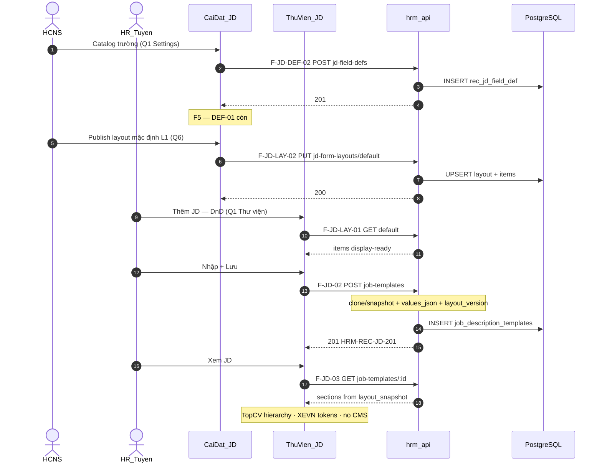

# PO-HRM-JD-DYNAMIC-ARCH-02 — TechSpec v0.2 deepen (API F.1 + DB physical)

| Field | Value |
|-------|--------|
| **work_item_id** | `PO-HRM-JD-DYNAMIC-ARCH-02` |
| **lane** | governance · sa |
| **Status** | **CONFIRMED** — TechSpec v0.2 deepen; Dev unlock eligible |
| **Date** | 2026-08-06 |
| **Decision owner** | SA |
| **Supersedes / deepens** | [`PO-HRM-JD-DYNAMIC-ARCH-01.md`](./PO-HRM-JD-DYNAMIC-ARCH-01.md) (Option A ADR-lite) |
| **ref_srs** | [`PO-HRM-JD-DYNAMIC-SPEC-01.md`](./PO-HRM-JD-DYNAMIC-SPEC-01.md) FR-UC-BP-REC-00a/b/c · spine [`SRS_HRM_ENTERPRISE.md`](../../client-delivery/hrm-enterprise-blueprint/SRS_HRM_ENTERPRISE.md) FR-UC-BP-REC-00 |
| **ref_data** | [`PO-HRM-JD-DYNAMIC-DATA-01.md`](./PO-HRM-JD-DYNAMIC-DATA-01.md) §3 + §12 ALIGNED-SPEC |
| **Slice** | [`docs/program/slices/PO-HRM-JD-DYNAMIC-TOPCV.md`](../slices/PO-HRM-JD-DYNAMIC-TOPCV.md) |
| **Locks** | `remaster_program_done=false` · `face_live=false` · U65 zero-seed · **cấm `apps/**` this wave** |
| **creative_extra** | `none` — TopCV = hierarchy bar only; XEVN Precision Motion tokens |

---

## 0. Sponsor confirm stamp (LOCKED 2026-08-06)

| ID | Question | Sponsor decision | Stamp |
|----|----------|------------------|-------|
| **A** | Architecture option | **Option A** — in-HRM metadata form builder | **LOCKED** |
| **Q1** | Where catalog vs DnD? | Catalog @ **Cài đặt**; DnD @ **Thư viện JD** (+ default layout publish @ Settings) | **LOCKED** |
| **Q6** | Layout ownership | **L1** company default layout + **`layout_snapshot` on JD save** | **LOCKED** |

**Rejected (confirmed):** Option C external CMS GĐ1. Option B fixed-sections — not selected.

**Implication for FE surfaces (GĐ1):**

| Surface | Menu | Owner FR |
|---------|------|----------|
| F1 Field catalog CRUD | Cài đặt → trường JD | UC-00a |
| F2 Default layout publish (optional Settings canvas) | Cài đặt → bố cục mặc định JD | UC-00b (L1) |
| F2b DnD palette + canvas | Thư viện JD → Thêm/Sửa JD (dialog hoặc «Sửa bố cục») | UC-00b |
| F3 Dynamic create/edit | Thư viện JD (`JobTemplatesTab`) | UC-00c |
| F4 Public-style view | Thư viện JD → Xem | UC-00c |

**Out of write-path:** Lane B `job_postings` / `JobPostingsTab` — **FORBIDDEN** dual-write JD values/layout.

---

## 1. Document control (TechSpec v0.2)

| | |
|--|--|
| TechSpec id | `TECHSPEC-HRM-JD-DYNAMIC-v0.2` |
| change_mode | ADD |
| preserve_default | true |
| `ref_srs` | SPEC-01 FR-UC-BP-REC-00a/b/c · enterprise FR-UC-BP-REC-00 Diễn biến #1–3 |
| `ref_db` | this file §3 + DATA-01 §3/§12 |
| `ref_api` | this file §2 (F.1) |
| ADR-ack DATA locks | A2 = Q6 L1+snapshot (§12.6) · Q2 select allowlist (§12.7) · Option A HRM tenant CFG |

---

## 2. API_DESIGN F.1 — F-JD-DEF / F-JD-LAY / F-JD-01..04

**Prefix (locked):** `/api/hrm/recruitment` for JD master; Settings surfaces may call same controller under recruitment **or** thin settings façade that delegates to same service — **one SoT table set** `rec_jd_*`.  
**Pattern only (not table reuse):** Group-HR `settings-catalogs` extension-items / `buildDynamicFields`.  
**Envelope:** existing HRM `{ code, message, data }` — do not invent parallel shape.  
**Scope:** every list / get-by-id / mutate uses **identical** `resolveHrmListScope` + `company_id` TEXT filter + `assertResourceInHrmScope` (U19). Member CEO must not read/write other LE defs/layouts/templates.

### 2.1 Capability → function map

| Cap | F-id | Method / path | UC |
|-----|------|---------------|-----|
| List field defs | **F-JD-DEF-01** | `GET /recruitment/jd-field-defs?company_id=` | 00a |
| Create field def | **F-JD-DEF-02** | `POST /recruitment/jd-field-defs` | 00a |
| Update field def | **F-JD-DEF-03** | `PATCH /recruitment/jd-field-defs/:id` | 00a |
| Soft archive / deactivate | **F-JD-DEF-04** | `POST /recruitment/jd-field-defs/:id/archive` | 00a |
| Get default layout + items | **F-JD-LAY-01** | `GET /recruitment/jd-form-layouts/default?company_id=` | 00b |
| Put / publish default layout | **F-JD-LAY-02** | `PUT /recruitment/jd-form-layouts/default` | 00b |
| Get layout by id | **F-JD-LAY-03** | `GET /recruitment/jd-form-layouts/:id?company_id=` | 00b |
| List layouts | **F-JD-LAY-04** | `GET /recruitment/jd-form-layouts?company_id=` | 00b |
| List JD templates | **F-JD-01** | `GET /recruitment/job-templates` *(AS-IS extend)* | 00c / REC-00 |
| Create JD + snapshot | **F-JD-02** | `POST /recruitment/job-templates` *(extend DTO)* | 00c |
| Get JD by id | **F-JD-03** | `GET /recruitment/job-templates/:id` **(ADD — AS-IS gap)** | 00c |
| Patch JD | **F-JD-04** | `PATCH /recruitment/job-templates/:id` *(extend)* | 00c |
| YCTD bind | **F-YCTD-JD** | existing requisitions + `job_template_id` | REC-00 #3 |

**AS-IS gap (Dev-BE must_add):** Controller today has list/create/patch/delete templates — **no GET by id**. F-JD-03 is **mandatory** for J-HRM-JD-03 + scope_parity.

---

### 2.2 F-JD-DEF-01 — List field definitions

| | |
|--|--|
| **Mục đích** | Trả catalog trường JD theo pháp nhân cho màn Cài đặt và palette kéo (chỉ field `is_active` khi `active=true`). |
| **Nghiệp vụ xử lý** | Resolve scope từ JWT + `company_id` → `SELECT` `rec_jd_field_def` WHERE scope + `archived_at IS NULL`; optional filter `active`; sort `sort_order`, `field_key`. Không trả field CT khác. |
| **Tham chiếu bước SRS** | **UC-BP-REC-00a** Diễn biến **#0** (mở catalog) · **#T** (F5 list còn) · AC-JD-DYN-01..03 · BR-BP-JD-DYN-01/07/08 · spine REC-00 Diễn biến **#1** (mở thư viện — consumer palette). |
| **Request** | Query: `company_id` (required), `active?` (`true`\|`false`\|omit=all non-archived). |
| **Response → DB** | `items[]` ← rows `rec_jd_field_def` (display-ready: `id`, `field_key`, `label`, `field_type`, `is_required`, `sort_order`, `section_hint`, `is_system`, `is_active`, `validation_json`). |
| **Errors** | 403/409 scope · empty `items=[]` **hợp lệ** (AC-JD-DYN-03). |

---

### 2.3 F-JD-DEF-02 — Create field definition

| | |
|--|--|
| **Mục đích** | Tạo trường động mới trong catalog pháp nhân. |
| **Nghiệp vụ xử lý** | Validate `field_key`/`label`/`field_type` (DATA §12.7 enum); UQ `(company_id, field_key)` active; `select` → allowlist / static options (VAL-JD-21/22); reject invent `catalog_key`; INSERT; return 201. |
| **Tham chiếu bước SRS** | **UC-00a** Diễn biến **#1** (thiếu mã/nhãn → không 2xx) · **#2** (trùng mã → reject) · **#4** (lưu hợp lệ 2xx) · AC-JD-DYN-01/04. |
| **Request DTO → columns** | See §2.10 `CreateJdFieldDefDto`. |
| **Response** | 201 + created row; code stub `HRM-JD-FIELD-201`. |
| **Errors** | `HRM-JD-FIELD-VAL` 400 · `HRM-JD-FIELD-DUP` 409 · `HRM-JD-FIELD-TYPE` 400 · `HRM-JD-SELECT-SRC` 400. |

---

### 2.4 F-JD-DEF-03 — Update field definition

| | |
|--|--|
| **Mục đích** | Sửa nhãn / bắt buộc / thứ tự / validation; soft-stop (`is_active=false`); **không** đổi `field_key` khi đã có instance values; **không** đổi `field_type` nếu đã có values (VAL-JD-12). |
| **Nghiệp vụ xử lý** | GET-by-id **cùng resolver list** → assert in scope → PATCH allowed cols; system keys: cannot archive via this path (use rules VAL-JD-04). |
| **Tham chiếu bước SRS** | **UC-00a** Diễn biến **#3** (ngừng trường — soft; JD cũ còn xem) · **#4** · AC-JD-DYN-05. |
| **Request DTO → columns** | `UpdateJdFieldDefDto` → `label`, `is_required`, `sort_order`, `section_hint`, `validation_json`, `is_active`, `applies_to_company_ids`. |
| **Errors** | 404 out-of-scope · `HRM-JD-FIELD-TYPE-LOCK` 409 · `HRM-JD-FIELD-SYSTEM` 400. |

---

### 2.5 F-JD-DEF-04 — Soft archive field definition

| | |
|--|--|
| **Mục đích** | Soft-archive (`archived_at=NOW()`, `is_active=false`) — **cấm** hard-delete khi historical `values_json` / snapshot ref (VAL-JD-19). |
| **Nghiệp vụ xử lý** | Scope assert → reject system `title`/`code`/`position_code` → if in-use → 409 `HRM-JD-FIELD-INUSE` else set `archived_at`. |
| **Tham chiếu bước SRS** | **UC-00a** Diễn biến **#3** · BR-BP-JD-DYN-01 · AC-JD-DYN-05. |
| **Request** | Path `:id` + query/body `company_id`. |
| **Response** | 200 archived stub. |

**Also require (scope_parity companion):** `GET /recruitment/jd-field-defs/:id?company_id=` — same filter as list (may share handler with DEF-03 pre-load). Dev-BE: if not separate F-id, document as internal of DEF-03; QA still asserts list id → get 200.

---

### 2.6 F-JD-LAY-01 — Get company default layout

| | |
|--|--|
| **Mục đích** | Trả bố cục mặc định đã publish + items (display-ready field meta) cho DnD canvas / clone vào dialog Thêm JD. |
| **Nghiệp vụ xử lý** | Find `rec_jd_form_layout` WHERE `company_id` + `is_default=true` + not archived; JOIN items + defs; if none → 200 empty layout `{ items: [] }` (BR-DYN-07 FE empty+CTA — không 500). |
| **Tham chiếu bước SRS** | **UC-00b** Diễn biến **#0** (mở Thêm JD — thấy palette+canvas) · **#1** (catalog/layout trống) · Q1 DnD @ Thư viện · Q6 L1 read. |
| **Response → DB** | layout row + `items[]` enriched: `field_id`, `field_key`, `label`, `field_type`, `is_required`, `section`, `sort_order`, `is_system`. |
| **Errors** | 403/409 scope. |

---

### 2.7 F-JD-LAY-02 — Put / publish default layout (L1)

| | |
|--|--|
| **Mục đích** | Persist kết quả kéo-thả thành **default layout pháp nhân** (`is_default=true`, `status=published`). |
| **Nghiệp vụ xử lý** | Validate every `field_id` ∈ active defs in scope (VAL-JD-05/17); enforce `title` in `hero` sort_order=0 (VAL-JD-06 / BR-DYN-02); replace items transactionally; upsert single default per `company_id`. **Does not** mutate existing JD `layout_snapshot_json` (history preserved — Q6). |
| **Tham chiếu bước SRS** | **UC-00b** Diễn biến **#2–4** · **#T** F5 · AC-JD-DYN-06..08 · Settings path Q1 «default layout @ Cài đặt». |
| **Request DTO → DB** | `PutJdLayoutDto` → `rec_jd_form_layout` + replace `rec_jd_form_layout_item`. |
| **Errors** | `HRM-JD-LAYOUT-FIELD` · `HRM-JD-LAYOUT-TITLE` · `HRM-JD-LAYOUT-EMPTY` (if publish with 0 items — reject publish; draft empty OK only if status=draft). |

---

### 2.8 F-JD-LAY-03 — Get layout by id

| | |
|--|--|
| **Mục đích** | Chi tiết một layout (deep link / audit) — **scope_parity** với list. |
| **Nghiệp vụ xử lý** | Same company filter as LAY-04; 404 if id listed under wrong LE. |
| **Tham chiếu bước SRS** | **UC-00b** #T · BR-BP-JD-DYN-08 · VAL-JD-14. |
| **Response** | Same shape as LAY-01 for one id. |

---

### 2.9 F-JD-LAY-04 — List layouts

| | |
|--|--|
| **Mục đích** | Liệt kê layouts pháp nhân (default + drafts) cho Settings / admin. |
| **Nghiệp vụ xử lý** | Scoped list; mark `is_default`; no cross-LE. |
| **Tham chiếu bước SRS** | **UC-00b** · BR-DYN-08. |
| **Response** | `items[]` summary (id, name, is_default, status, updated_at). |

---

### 2.10 F-JD-01..04 — Job templates (JD master) extend

#### F-JD-01 `GET /recruitment/job-templates`

| | |
|--|--|
| **Mục đích** | List Thư viện JD (AS-IS) — giữ list columns; optional thin flags `has_dynamic_values`. |
| **Nghiệp vụ** | `resolveHrmListScope` + filter `company_id` *(existing)* — **must not diverge** when JSONB cols added. |
| **SRS** | Enterprise FR-UC-BP-REC-00 Diễn biến **#1** · UC-00c list · J-HRM-JD-02/03. |

#### F-JD-02 `POST /recruitment/job-templates`

| | |
|--|--|
| **Mục đích** | Tạo JD: canonical cols + `values_json` + `layout_snapshot_json` + `layout_version`. |
| **Nghiệp vụ xử lý** | (1) If client omits snapshot → **clone** from L1 default (LAY-01). (2) Normalize title-first in snapshot. (3) Validate values ∩ snapshot + required (VAL-JD-07/11/18). (4) Bridge: sync `title`/`code`/`position_code`/`job_description`/`requirements` from known keys for list/search + legacy readers. (5) Assert `position_code` ∈ job_titles (`HRM-REC-JD-POS`). (6) UQ code. (7) **FORBIDDEN** write `job_postings`. |
| **SRS** | **UC-00c** Diễn biến **#0–4** · spine REC-00 **#2** · AC-JD-DYN-09..12 · BR-DYN-02/03/07. |
| **Response** | 201 `HRM-REC-JD-201` + id. |

#### F-JD-03 `GET /recruitment/job-templates/:id` **(ADD)**

| | |
|--|--|
| **Mục đích** | Detail + **display-ready** view model: snapshot ordered sections + resolved values + status — FE **không** join multi-API để dựng aggregate. |
| **Nghiệp vụ** | Same scope resolver as F-JD-01; 404 if out of scope (not empty fake). Dual-read: if `values_json` null → bridge legacy text cols into view model. |
| **SRS** | **UC-00c** Diễn biến **#5** (Xem) · **#T** · AC-JD-DYN-13/16 · J-HRM-JD-03 · spine REC-00 success. |
| **Errors** | 404 scope · 500 → FE banner ≠ «không có dữ liệu». |

#### F-JD-04 `PATCH /recruitment/job-templates/:id`

| | |
|--|--|
| **Mục đích** | Cập nhật values/status; optional snapshot reorder in-dialog (Q6: updates **snapshot only** unless «Đặt làm mặc định CT» → LAY-02). Bump `layout_version` when snapshot shape changes. |
| **Nghiệp vụ** | Scope assert; status transitions draft→active→retired; active code immutable policy per DATA §3.6; retire ≠ hard delete; YCTD history kept. |
| **SRS** | **UC-00c** #2–4 · spine #2–3 · AC-JD-DYN-10/11/15 · BR-JD-01 / DYN-05. |

#### F-YCTD-JD (must_keep)

| | |
|--|--|
| **Mục đích** | YCTD gắn soft FK `job_template_id` — chỉ JD Hiệu lực; **không** copy full `values_json`. |
| **SRS** | Enterprise REC-00 Diễn biến **#3** · UC-00c **#6** · AC-JD-DYN-15 · BR-DYN-05. |

---

### 2.11 DTO ↔ column matrix

#### `CreateJdFieldDefDto` → `rec_jd_field_def`

| DTO field | Column | Notes |
|-----------|--------|-------|
| `company_id` | `company_id` | Scope |
| `field_key` | `field_key` | snake_case; immutable after values |
| `label` | `label` | vi-VN |
| `field_type` | `field_type` | §12.7: `short_text`\|`long_text`\|`select`\|`number`\|`date` |
| `is_required` | `is_required` | default false |
| `sort_order` | `sort_order` | catalog order |
| `section_hint` | `section_hint` | optional section enum |
| `validation_json` | `validation_json` | select source / maxLen / min/max |
| `applies_to_company_ids` | `applies_to_company_ids` | optional jsonb |

Server sets: `id`, `is_system=false`, `is_active=true`, `archived_at=null`, timestamps.

#### `UpdateJdFieldDefDto` → patchable columns

`label`, `is_required`, `sort_order`, `section_hint`, `validation_json`, `is_active`, `applies_to_company_ids` — **not** `field_key` / `company_id` / `is_system`.

#### `PutJdLayoutDto` → layout + items

| DTO | DB |
|-----|-----|
| `company_id` | `rec_jd_form_layout.company_id` |
| `name?` | `name` (default «Layout mặc định JD») |
| `items[].field_id` | `rec_jd_form_layout_item.field_id` |
| `items[].section` | `section` |
| `items[].sort_order` | `sort_order` |
| — | Server: `is_default=true`, `status=published`, denorm `company_id` on items |

#### `CreateJobTemplateDto` / `UpdateJobTemplateDto` **extend** (ADD fields)

| DTO field | Column | Notes |
|-----------|--------|-------|
| AS-IS `company_id`,`code`,`title`,`position_code`,`position_name?`,`job_description?`,`requirements?`,`notes?`,`is_active?` | same | Keep |
| `values` / `values_json` | `values_json` JSONB | Dynamic payload |
| `layout_snapshot` | `layout_snapshot_json` JSONB | Immutable render SoT at save |
| `layout_version?` | `layout_version` int | Default 1; server may bump |
| `status?` | bridge `is_active` / logical status | draft\|active\|retired |

**Response view model (F-JD-03):** `{ …canonical, values, layout_snapshot, layout_version, sections: [{ section, fields: [{ field_key, label, value, field_type }] }] }` — server-composed.

---

### 2.12 Error taxonomy (locked stubs)

| Code | HTTP | When |
|------|------|------|
| `HRM-JD-FIELD-VAL` | 400 | Def incomplete |
| `HRM-JD-FIELD-DUP` | 409 | Duplicate field_key |
| `HRM-JD-FIELD-TYPE` | 400 | Unknown type |
| `HRM-JD-FIELD-SYSTEM` | 400 | Mutate/archive system key illegally |
| `HRM-JD-FIELD-TYPE-LOCK` | 409 | Type change after values |
| `HRM-JD-FIELD-INUSE` | 409 | Hard-delete / illegal archive |
| `HRM-JD-SELECT-SRC` | 400 | catalog_key ∉ allowlist |
| `HRM-JD-LAYOUT-FIELD` | 400 | Bad/inactive field_id on layout |
| `HRM-JD-LAYOUT-TITLE` | 400 | Title not first in hero |
| `HRM-JD-LAYOUT-EMPTY` | 400 | JD content save with empty layout |
| `HRM-JD-VAL-REQUIRED` | 400 | Required empty |
| `HRM-JD-VAL-UNKNOWN` | 400 | Value key ∉ snapshot |
| `HRM-JD-VAL-LEN` / `HRM-JD-VAL-DATE` | 400 | Coerce fail |
| `HRM-JD-CODE-DUP` | 409 | Duplicate JD code |
| `HRM-REC-JD-POS` | 400 | position invent *(existing)* |
| `HRM-JD-YCTD-STATUS` | 400 | Bind retired JD |
| scope | 403/409 | companyId mismatch |
| `HRM-REC-JD-201` / `HRM-REC-JD-200` | 2xx | Existing template codes |

---

### 2.13 Sequence (sponsor path A/Q1/Q6)



---

## 3. DB_DESIGN delta (physical)

> Logical SoT: DATA-01 §3 + §12. Physical names below are **implementation SoT** for Dev-BE migrate/`ensureSchema`. Logical `rec_job_description` ↔ AS-IS `job_description_templates`.

### 3.1 NEW — `public.rec_jd_field_def`

| Column | Type | Null | Constraints / notes |
|--------|------|------|---------------------|
| `id` | uuid | NO | PK DEFAULT `gen_random_uuid()` |
| `company_id` | text | NO | Scope — IX `(company_id)` |
| `field_key` | text | NO | UQ partial `(company_id, field_key)` WHERE `archived_at IS NULL` |
| `label` | text | NO | |
| `field_type` | text | NO | CHECK ∈ §12.7 MVP set |
| `is_required` | boolean | NO | DEFAULT false |
| `sort_order` | int | NO | DEFAULT 0 |
| `section_hint` | text | YES | hero\|summary\|responsibilities\|requirements\|benefits\|other\|meta |
| `applies_to_company_ids` | jsonb | YES | |
| `validation_json` | jsonb | YES | |
| `is_system` | boolean | NO | DEFAULT false |
| `is_active` | boolean | NO | DEFAULT true |
| `archived_at` | timestamptz | YES | Soft-delete |
| `created_at` / `updated_at` | timestamptz | NO | DEFAULT NOW() |
| `created_by` / `updated_by` | text | YES | |

**Bootstrap system rows (config, ≠ UAT seed evidence):** per `company_id` on first Settings open or migrate: `title`, `code`, `position_code` (`is_system=true`; `title` is_title semantics).

### 3.2 NEW — `public.rec_jd_form_layout`

| Column | Type | Null | Notes |
|--------|------|------|-------|
| `id` | uuid | NO | PK |
| `company_id` | text | NO | Scope |
| `name` | text | NO | |
| `is_default` | boolean | NO | ≤1 default active per company (partial UQ) |
| `status` | text | NO | draft\|published |
| `archived_at` | timestamptz | YES | |
| `created_at` / `updated_at` | timestamptz | NO | |

**Partial UQ:** `(company_id)` WHERE `is_default=true AND archived_at IS NULL`.

### 3.3 NEW — `public.rec_jd_form_layout_item`

| Column | Type | Null | Notes |
|--------|------|------|-------|
| `id` | uuid | NO | PK |
| `layout_id` | uuid | NO | FK → `rec_jd_form_layout(id)` ON DELETE CASCADE |
| `field_id` | uuid | NO | FK → `rec_jd_field_def(id)` |
| `section` | text | NO | |
| `sort_order` | int | NO | |
| `company_id` | text | NO | Denorm scope_parity |

**IX:** `(layout_id, section, sort_order)` · `(company_id)`.

### 3.4 ALTER — `public.job_description_templates` (AS-IS extend)

| ADD column | Type | Null | Default | Role |
|------------|------|------|---------|------|
| `values_json` | jsonb | YES | NULL | Dynamic field values |
| `layout_snapshot_json` | jsonb | YES | NULL | Render SoT at save (Q6) |
| `layout_version` | int | NO | `1` | Bump when snapshot shape changes |

**Keep (must_keep list/search):** `id`, `company_id`, `code`, `title`, `position_name`, `position_code`, `job_description`, `requirements`, `notes`, `is_active`, timestamps, UQ `(company_id, code)`.

**Bridge write rule:** On create/update with `values_json`, also populate:

| values key | column |
|------------|--------|
| `title` | `title` |
| `code` | `code` |
| `position_code` | `position_code` |
| `responsibilities` or long body | `job_description` |
| `requirements` | `requirements` |

**Read rule:** If `values_json` IS NULL → FE/API compose from text cols (backward compat).

### 3.5 YCTD — must_keep (no break)

| Physical | Rule |
|----------|------|
| `job_requisitions.job_template_id` | Soft TEXT/UUID → template id; retire JD ≠ DELETE FK history |
| Logical `rec_recruitment_request.job_description_id` | Alias only — no dual SoT invent |

### 3.6 FORBIDDEN

| Forbidden | Why |
|-----------|-----|
| Dual-write JD `values_json` / snapshot → `job_postings` | Lane B ≠ FR-UC-BP-REC-00 SoT |
| Hard-delete field defs with history | BR-DYN-01 |
| Live layout without snapshot as only SoT | Breaks history when catalog changes (DATA §12.6) |
| Public career CMS tables | Option C rejected |
| Reuse `settings-catalogs` rows as JD field def SoT | SPEC §6.1 — separate `rec_jd_field_def` |

### 3.7 Logical ↔ physical alias (DB_DESIGN enterprise delta pointer)

| Logical (DB_DESIGN / DATA) | Physical |
|----------------------------|----------|
| `rec_jd_field_def` | `rec_jd_field_def` |
| `rec_jd_form_layout` (+ items) | `rec_jd_form_layout` · `rec_jd_form_layout_item` |
| `rec_job_description` | `job_description_templates` + JSONB cols |
| `layout_version` | `job_description_templates.layout_version` |
| `rec_recruitment_request.job_description_id` | `job_requisitions.job_template_id` |

ba-docs may later ADD § to `DB_DESIGN_HRM_ENTERPRISE.md` — not required to unlock Dev if this ARCH-02 §3 is cited in `spec_read_ack.db_design`.

---

## 4. Scope parity · must_keep · FE–BE boundary

### 4.1 scope_parity checklist (Dev-BE exit)

| Pair | Rule |
|------|------|
| DEF-01 list ↔ GET `:id` / DEF-03 load | Same `resolveHrmListScope` |
| LAY-04 list ↔ LAY-03 get | Same |
| F-JD-01 list ↔ **F-JD-03 get** | Same — **jest required** |
| Mutate all | `assertResourceInHrmScope` before write |

### 4.2 must_keep

- FR-UC-BP-REC-00 YCTD soft FK + status gate for new YCTD  
- `position_code` ∈ effective `job_titles` (`HRM-REC-JD-POS`)  
- Title-first (`BR-BP-JD-DYN-02`)  
- Soft-delete only  
- U65 — no seed in UAT evidence  
- `creative_extra=none` · Precision Motion tokens  
- Lane B leftover may remain in DB — **not** JD value SoT  

### 4.3 FE–BE separation (OS 28)

- Server returns **display-ready** layout+schema+view sections.  
- FE **cấm** join defs+layout+values into nested write aggregate invent.  
- FE submits flat DTO per §2.11; validation authoritative on BE.

---

## 5. Residual Q* closure

| ID | Prior status | ARCH-02 | Owner residual |
|----|--------------|---------|----------------|
| **A / Option A** | SA recommend | **CLOSED — sponsor LOCKED** | — |
| **Q1** | Sponsor confirm | **CLOSED — LOCKED** | — |
| **Q2** | Tin postings layout? | **CLOSED** GĐ1 No (DATA) | — |
| **Q3** | Rich CMS HTML? | **CLOSED** long_text ± html format; no CMS | — |
| **Q4** | Own tables vs settings-catalogs? | **CLOSED** `rec_jd_*` | — |
| **Q5** | Public career URL? | **CLOSED** out MVP | — |
| **Q6** | L1 vs per-JD | **CLOSED — sponsor LOCKED** L1+snapshot | — |
| SPEC A1 title system | Assumption | **CLOSED** data §12.9 — bootstrap ≠ UAT seed | dev-be bootstrap |
| SPEC Q2 select source | Open | **CLOSED** DATA §12.7 allowlist — ADR-ack here | — |
| R-JD-DATA-01 XBOS skeleton | OPEN | **DEFERRED GĐ2** — Option A locked | pm (GĐ2 only) |
| R-JD-DATA-02 Physical DDL | OPEN | **READY for Dev** — §3 this file | **dev-be** |
| R-JD-DATA-04 Journey map file | OPEN | IDs locked; map append | **pm** |
| R-JD-DATA-05 D7 rename Nest vs rec_* | OPEN | Physical = `rec_jd_*` + keep `job_description_templates` alias | pm D7 optional |
| GET template by id AS-IS gap | — | **OPEN impl** | **dev-be** F-JD-03 |
| ba-docs merge 00a/b/c → enterprise SRS | — | OPEN promote | **ba-docs** (parallel OK) |
| P0 UI logo/font | Parallel | Orthogonal | dev-fe P0 lane |

**No sponsor Q* blocking Dev** after this stamp.

---

## 6. NFR · security · UAT

| NFR | Requirement |
|-----|-------------|
| Auth | JWT + existing recruitment `assertAccess` |
| Scope / RBAC | §4.1 |
| Validation | BE coerce by `field_type`; date ISO store / dd/MM/yyyy display |
| XSS | Sanitize `long_text` html on write |
| Observability | Existing hrm-api metrics — no new service |
| U65 | J-HRM-JD-01..03 browser FE chain; **cấm** `pnpm seed:*` |
| RLS | No new `PLATFORM_RLS_ENABLED` this wave |
| Platform-core | Extend hrm-api only — reuse `@xevn/platform-core` patterns |
| Locks | remaster/face false |

---

## 7. AC gates (architecture — promote from ARCH-01)

| AC | Pass when |
|----|-----------|
| AC-JD-ARCH-01 | Settings field → palette visible (F5) |
| AC-JD-ARCH-02 | Save L1 layout → create dialog order khớp; title #1 |
| AC-JD-ARCH-03 | POST templates 2xx → View from snapshot; F5 |
| AC-JD-ARCH-04 | Member scope_parity defs/layouts/templates |
| AC-JD-ARCH-05 | U65 no seed · J-HRM-JD-01..03 |
| AC-JD-ARCH-06 | YCTD still binds active JD (REC-00) |
| AC-JD-ARCH-07 | No writes to `job_postings` for JD dynamic values |

---

## 8. Dev unlock — work_item ids (copy-ready)

| work_item_id | Role | Scope |
|--------------|------|-------|
| `PO-HRM-JD-DYNAMIC-BE-01` | dev-be | DDL/ensureSchema §3 · F-JD-DEF/LAY · F-JD-03 GET · extend F-JD-02/04 · scope_parity jest · **no** job_postings dual-write |
| `PO-HRM-JD-DYNAMIC-FE-01` | dev-fe | Settings catalog F1 · default layout Settings F2 · Thư viện DnD+dynamic dialog+TopCV view F2b/F3/F4 · title-first · display-ready bind · U65 paths |
| `PO-HRM-JD-DYNAMIC-QA-01` | qa | After READY_FOR_QA — J-HRM-JD-01..03 · AC-JD-DYN-* · U65 |

**Parallel:** BE+FE OK after both read ARCH-02 + SPEC + DATA. QA only after both READY_FOR_QA.

---

## 9. Rollout checkpoints

| Gate | Owner | Status |
|------|-------|--------|
| G0 Sponsor A/Q1/Q6 | PM | **DONE** 2026-08-06 |
| G1 SPEC + DATA DRAFT | ba | **ON DISK** |
| G2 ARCH-02 TechSpec v0.2 | sa | **THIS DOC — PASS** |
| G3 Dev FE+BE | pm dispatch | **UNLOCKED** |
| G4 QA L2.5 | qa | pending |
| G5 QC | qc | pending — no remaster stamp |

**Rollback:** feature flag / omit JSONB → legacy fixed form on canonical columns only.

---

## 10. completion_report

**Closed**

- Sponsor **A / Q1 / Q6** stamped LOCKED.  
- TechSpec v0.2: API_DESIGN F.1 for **F-JD-DEF-01..04**, **F-JD-LAY-01..04**, **F-JD-01..04** + YCTD must_keep — mục đích · nghiệp vụ · Diễn biến UC-00a/b/c + spine REC-00 · DTO↔column.  
- DB_DESIGN physical delta: `rec_jd_field_def` / layout / items · `values_json` · `layout_snapshot_json` · `layout_version` on `job_description_templates`.  
- scope_parity list↔get; must_keep YCTD soft FK; FORBIDDEN dual-write `job_postings`.  
- Residual sponsor Q* closed; open items owned (dev-be F-JD-03, pm journey map, ba-docs merge).  
- **No `apps/**`.**

**Residual (non-blocking for Dev unlock)**

- R-JD-DATA-04 journey map append — pm  
- ba-docs merge FR-00a/b/c into enterprise SRS  
- R-JD-DATA-01 XBOS skeleton — GĐ2 only  

---

## 11. Handoff

| Field | Value |
|-------|--------|
| **ack_status** | `PASS_TO_PM` |
| **next_owner** | `pm` |
| **evidence_path** | `docs/qa/evidence/po-hrm-jd-dynamic-arch-02.md` |
| **deliverable** | `docs/program/specs/PO-HRM-JD-DYNAMIC-ARCH-02.md` |

### next_dispatch_prompt (copy-ready — unlock Dev FE+BE ONLY)

```text
work_item_id: PO-HRM-JD-DYNAMIC-BE-01 + PO-HRM-JD-DYNAMIC-FE-01 (parallel)
lane: execution · AFTER ARCH-02 PASS
entry_criteria:
  - docs/program/specs/PO-HRM-JD-DYNAMIC-ARCH-02.md CONFIRMED (sponsor A/Q1/Q6 LOCKED)
  - SPEC-01 + DATA-01 §12 on disk
  - remaster_program_done=false · face_live=false · U65
read_first (both):
  - docs/program/specs/PO-HRM-JD-DYNAMIC-ARCH-02.md (§2 API F.1 · §3 DB · §4 scope_parity)
  - docs/program/specs/PO-HRM-JD-DYNAMIC-SPEC-01.md (UC-00a/b/c Diễn biến)
  - docs/program/specs/PO-HRM-JD-DYNAMIC-DATA-01.md (§3 · §12.6/12.7)
  - docs/program/slices/PO-HRM-JD-DYNAMIC-TOPCV.md
  - SRS FR-UC-BP-REC-00 spine
spec_read_ack required: srs + tech_spec ARCH-02 + db_design ARCH-02§3 + api_design ARCH-02§2
code_memory_required: true · change_mode: ADD · preserve_default: true

### Task PO-HRM-JD-DYNAMIC-BE-01 (dev-be)
allowed_paths:
  - apps/api/hrm-api/src/recruitment/**
  - apps/api/hrm-api/migrations/** (or ensureSchema in catalog service)
  - related DTO/spec tests under hrm-api
forbidden_paths:
  - dual-write job_postings as JD SoT
  - apps/web unrelated remaster
exit_criteria:
  - ensureSchema/migrate: rec_jd_field_def · rec_jd_form_layout · rec_jd_form_layout_item
  - ALTER job_description_templates: values_json · layout_snapshot_json · layout_version
  - Implement F-JD-DEF-01..04 · F-JD-LAY-01..04 · F-JD-03 GET by id · extend F-JD-02/04
  - scope_parity jest list↔get for defs/layouts/templates
  - must_keep YCTD job_template_id soft FK · HRM-REC-JD-POS
  - solid_convention_ack FE–BE display-ready on GET detail
evidence_path: docs/qa/evidence/po-hrm-jd-dynamic-be-01.md
ack_status: READY_FOR_QA

### Task PO-HRM-JD-DYNAMIC-FE-01 (dev-fe)
allowed_paths:
  - apps/web HRM Settings JD catalog + default layout
  - apps/web JobTemplatesTab / Thư viện JD dynamic dialog + TopCV-style view
forbidden_paths:
  - JobPostingsTab as JD master write-path
  - invent TopCV brand colors (creative_extra=none)
exit_criteria:
  - Q1 surfaces: Catalog @ Cài đặt; DnD @ Thư viện JD (+ Settings default layout)
  - Q6: clone L1 → snapshot on save; view reads snapshot
  - title-first; display-ready bind; empty/error AC-JD-DYN-03/08/16
  - no FE-built nested write aggregate invent
evidence_path: docs/qa/evidence/po-hrm-jd-dynamic-fe-01.md
ack_status: READY_FOR_QA

### After both READY_FOR_QA
Task qa PO-HRM-JD-DYNAMIC-QA-01 — J-HRM-JD-01..03 · U65 browser-only · zero-seed
Do NOT claim remaster_program_done or face_live.
```

---

## 12. ADD — Group / Pack layer (2026-08-06) — do not wipe §§0–11

| Field | Value |
|-------|--------|
| **Pointer** | [`PO-HRM-JD-GROUP-ARCH-01.md`](./PO-HRM-JD-GROUP-ARCH-01.md) |
| **Business neo** | [`PO-HRM-JD-GROUP-MODEL-01.md`](./PO-HRM-JD-GROUP-MODEL-01.md) |
| **change_mode** | **ADD** onto Option A — field/layout F.1 + DB §3 **unchanged** |
| **Sponsor need** | Default groups by job family (IT office vs Driver ops) + optional group DnD |

### 12.1 What ADD means

| Layer | SoT doc |
|-------|---------|
| Field + L1 layout + JD snapshot v1 | **This ARCH-02** §§2–3 |
| Group def · Default Pack · Pack Rules · snapshot v2 groups[] | **GROUP-ARCH-01** |

Locks **A / Q1 / Q6**, SoT `job_description_templates`, **FORBIDDEN** `job_postings` dual-write, U65 — **still must_keep**.

### 12.2 Dev unlock status (supersede §8 / §9 G3 for full path)

| Prior (ARCH-02 alone) | After GROUP-ARCH-01 |
|-----------------------|---------------------|
| §8 «Dev unlock eligible» field+layout | **SUSPENDED** for writer/view claiming pack sections |
| Full JD dynamic Dev (BE-01 + FE-01) | **BLOCKED** until **GROUP SPEC + GROUP DATA PASS** + GROUP-ARCH-01 on disk |

See GROUP-ARCH-01 §6 unlock criteria. Optional PM waiver: field-def APIs only — **no** TopCV/group UAT claim.

### 12.3 Next (PM)

1. Dispatch `PO-HRM-JD-GROUP-SPEC-01` (ba-process) + `PO-HRM-JD-GROUP-DATA-01` (ba-data).  
2. After **GROUP triad** PASS (ARCH+SPEC+DATA) → re-open Dev with group/pack + view §3.6 (not field-only).  
3. Evidence: `docs/qa/evidence/po-hrm-jd-group-arch-01.md`.  
4. World benchmark import: GROUP-ARCH-01 **§12** ← [`PO-HRM-JD-WORLD-BENCHMARK-01.md`](./PO-HRM-JD-WORLD-BENCHMARK-01.md) (meta vs narrative · catalog · packs · FE hierarchy). Dev **HOLD** until triad.
