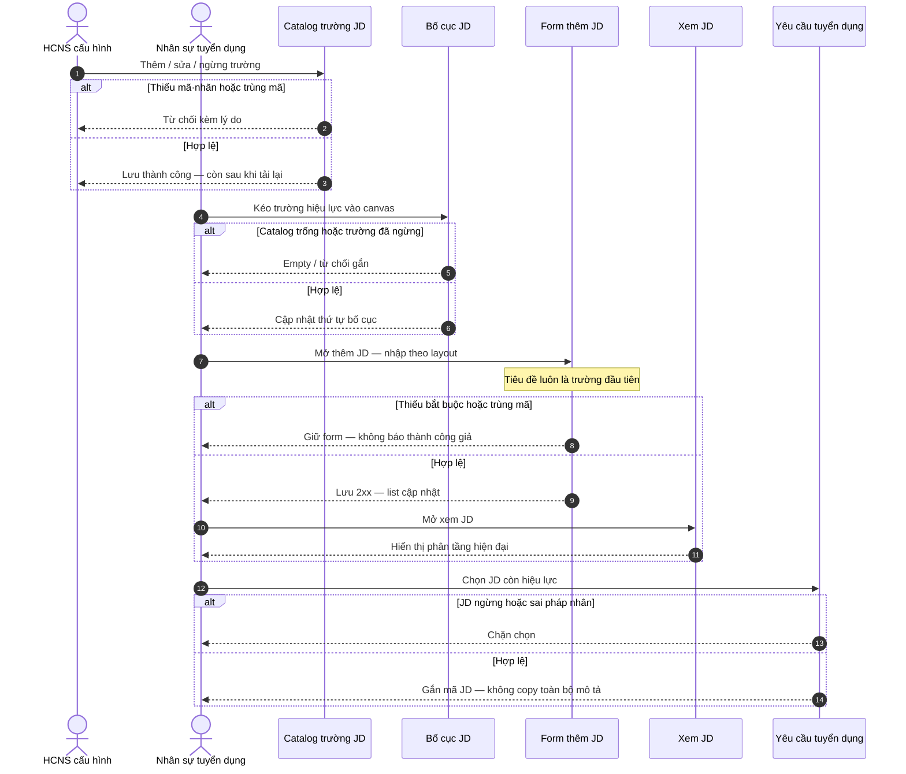

# Delta SRS — Thư viện JD: trường động + form kéo-thả + xem kiểu công khai

**Trạng thái draft:** DRAFT · chờ chốt sponsor → ba-docs merge vào SRS enterprise  
**Neo spine (không thay thế):** FR-UC-BP-REC-00 — Thư viện mô tả công việc (JD master)  
**Chế độ:** ADD-only · không xóa / không đè stub REC-00 · giữ liên kết YCTD

---

## 0. Meta đội ngũ (không đưa vào bản gửi khách)

| Mục | Giá trị |
|-----|---------|
| work_item_id | PO-HRM-JD-DYNAMIC-SPEC-01 |
| slice | docs/program/slices/PO-HRM-JD-DYNAMIC-TOPCV.md |
| lane | governance · ba-process |
| next | ba-data (PO-HRM-JD-DYNAMIC-DATA-01) + sa (PO-HRM-JD-DYNAMIC-ARCH-01) |
| creative_extra | none — TopCV = thanh chất lượng bố cục; không invent màu thương hiệu ngoài token XeVN |
| must_keep | U65 zero-seed · FR-UC-BP-REC-00 spine · YCTD linkage · face_live=false · remaster_program_done=false |
| J-* đề xuất | J-HRM-JD-01 · J-HRM-JD-02 · J-HRM-JD-03 |

---

## 1. Mục tiêu nghiệp vụ

Cho phép đơn vị **cấu hình tập trường mô tả công việc** theo pháp nhân, **kéo các trường đã cấu hình** vào bố cục khi thêm JD, mở **hộp thoại thêm/sửa JD động** đúng bố cục đã kéo, và **xem JD** theo chuẩn giao diện tuyển dụng hiện đại (thanh chất lượng tương đương các nền tảng tuyển Việt Nam phổ biến: phân tầng tiêu đề → khối nội dung → kỹ năng/yêu cầu — không form bảng cứng truyền thống).

JD master vẫn là **một nguồn mô tả** cho YCTD (FR-UC-BP-REC-00). Trường động chỉ thay **cách cấu hình và hiển thị nội dung**, không thay vai trò master / trạng thái Nháp–Hiệu lực–Ngừng / tham chiếu mã JD.

---

## 2. As-is / To-be

| | As-is (baseline giấy + sản phẩm) | To-be (delta này) |
|---|----------------------------------|-------------------|
| Trường JD | Bộ trường cố định trong form (tiêu đề, mô tả, kỹ năng, cấp bậc…) | Catalog trường cấu hình được theo pháp nhân (Cài đặt) |
| Thêm JD | Form cứng | Người dùng kéo trường từ catalog vào bố cục; hộp thoại render theo bố cục |
| Xem JD | Chi tiết kiểu form/bảng | Màn xem phân tầng hiện đại (title-first, khối nội dung rõ) |
| YCTD | Chọn JD hiệu lực, gắn mã | **Giữ nguyên** — không đổi quan hệ JD → YCTD |

---

## 3. Phạm vi

### 3.1 Trong phạm vi (MVP delta)

1. Cài đặt: CRUD catalog trường JD (mã, nhãn, kiểu nhập, bắt buộc/tùy chọn, thứ tự catalog, trạng thái hiệu lực/ngừng).
2. Thư viện JD: kéo trường hiệu lực vào **bố cục mẫu** (hoặc bố cục của bản JD đang soạn) — lưu thứ tự + nhóm hiển thị.
3. Hộp thoại thêm/sửa JD: render **động** đúng bố cục đã lưu; **trường tiêu đề luôn là trường đầu tiên** trên form.
4. Màn xem JD: bố cục công khai-style (phân tầng, khoảng trắng, typography token XeVN) — thanh chất lượng = nền tảng tuyển VN (TopCV named as bar).
5. Đồng bộ quy tắc FR-UC-BP-REC-00: mã JD theo pháp nhân; trạng thái; YCTD chỉ chọn JD hiệu lực; không trộn pháp nhân.

### 3.2 Ngoài phạm vi (rõ ràng)

| Ngoài phạm vi | Ghi chú |
|---------------|---------|
| Invent palette / gradient / brand màu lạ ngoài token XeVN Precision Motion | TopCV chỉ = thanh chất lượng bố cục & hierarchy |
| Đăng tin đa kênh / chiến dịch (UC-BP-REC-03) | Vẫn OUT / GĐ2 |
| Public career site cho ứng viên ngoài hệ thống | Chỉ **view trong HRM** kiểu công khai; không mở portal tuyển công khai MVP |
| OCR / AI sinh JD | Không |
| Đổi quan hệ YCTD–JD / pipeline ứng viên | must_keep spine REC-00 |
| Formula kéo-thả lương (PAY) | Orthogonal — R-PAY-DD-01 |
| Logo popup đen / font root toàn hệ | Wave UI riêng PO-HRM-UI-P0-LOGO-FONT-TITLE-01 — không thuộc FR động này nhưng **AC tiêu đề đầu tiên** đồng bộ với wave UI |

---

## 4. Tác nhân

| Tác nhân | Vai trò trong delta |
|----------|---------------------|
| Quản trị HRM / HCNS cấu hình | Cài đặt catalog trường JD |
| Nhân sự tuyển dụng · Trưởng bộ phận | Kéo bố cục, tạo/sửa/xem JD |
| Hệ thống | Validate bắt buộc theo catalog+layout; lưu; hiển thị; chặn trộn pháp nhân |
| YCTD consumer | Chỉ đọc JD hiệu lực đã gắn mã (không sửa catalog) |

---

## 5. Catalog UC / FR (ADD)

| Mã UC | Mã FR draft | Tên | Liên hệ spine |
|-------|-------------|-----|---------------|
| UC-BP-REC-00 | FR-UC-BP-REC-00 | Thư viện JD master (đã có) | **must_keep** |
| UC-BP-REC-00a | FR-UC-BP-REC-00a | Cấu hình catalog trường JD | Mở rộng «đủ trường bắt buộc cấu hình» của REC-00 |
| UC-BP-REC-00b | FR-UC-BP-REC-00b | Kéo trường vào bố cục JD | Bước soạn trước / cùng lúc thêm JD |
| UC-BP-REC-00c | FR-UC-BP-REC-00c | Form thêm·sửa JD động + xem công khai-style | Thay hình thức UI; giữ trạng thái & mã JD |

---

## 6. FR-UC-BP-REC-00a — Cấu hình catalog trường JD

### 6.1 Thông tin chung

| Mục | Nội dung |
|-----|----------|
| Tác nhân | HCNS · Quản trị cấu hình HRM |
| Ưu tiên | Cao — MVP delta |
| Tiên quyết | Đã chọn đúng pháp nhân; có quyền cấu hình tuyển dụng / JD |
| Hậu điều kiện | Có catalog trường hiệu lực theo pháp nhân; thư viện JD chỉ kéo được trường đang hiệu lực |
| BR | BR-BP-JD-DYN-01 · BR-BP-JD-DYN-07 |
| Neo | Tương tự tinh thần FR-UC-BP-CORE-02b (metadata theo tenant) — **catalog JD riêng**, không gộp field hồ sơ NV |

**Mục đích:** Quản lý tập trường mô tả công việc theo pháp nhân — không hardcode một bộ field cho mọi công ty.

### 6.2 Dữ liệu đầu vào

| Trường | Bắt buộc | Quy tắc |
|--------|----------|---------|
| Mã trường | Có | Unique trong pháp nhân; ổn định sau khi có dữ liệu JD (không đổi mã khi đang dùng — chỉ ngừng) |
| Nhãn hiển thị | Có | Tiếng Việt; dùng trên form và view |
| Kiểu nhập | Có | Văn bản ngắn · Văn bản dài · Danh sách chọn (khi có nguồn) · Số · Ngày (dd/MM/yyyy) — ba-data khóa enum |
| Bắt buộc khi nhập JD | Có | Có / Không — áp khi trường nằm trên bố cục hiệu lực |
| Thứ tự trong catalog | Có | Số nguyên ≥ 0 |
| Trạng thái | Có | Hiệu lực / Ngừng |
| Nhóm hiển thị gợi ý | Không | Ví dụ: Thông tin chung · Mô tả · Yêu cầu · Phúc lợi — dùng cho view phân tầng |

### 6.3 Luồng chính

1. Mở Cài đặt → khu vực cấu hình trường JD (đúng pháp nhân).
2. Thêm / sửa nhãn, kiểu, bắt buộc, thứ tự; hoặc ngừng trường.
3. Lưu → hệ thống xác nhận thành công.
4. Tải lại: danh sách catalog còn đúng; trường ngừng không còn trong palette kéo khi soạn JD mới.

### 6.4 Diễn biến nghiệp vụ

| # | Ai | Thao tác | Điều kiện | Kết quả hoặc lỗi |
|---|----|----------|-----------|------------------|
| 0 | HCNS | Đăng nhập · chọn pháp nhân · mở Cài đặt trường JD | Đúng quyền | Màn catalog tải được · thiếu quyền → từ chối rõ |
| 1 | HCNS | Thêm trường thiếu mã hoặc nhãn → Lưu | Validate | Không gọi lưu thành công; báo thiếu bắt buộc; form giữ dữ liệu đã nhập |
| 2 | HCNS | Thêm mã trùng mã đang hiệu lực → Lưu | Unique | Từ chối trùng mã; không tạo bản ghi thứ hai |
| 3 | HCNS | Ngừng trường đang có trên bố cục JD đã lưu | Soft-stop | Cho ngừng; JD cũ vẫn xem được giá trị lịch sử; palette kéo JD mới không còn trường đó |
| 4 | HCNS | Lưu hợp lệ | Đủ field | API 2xx → danh sách cập nhật ngay; toast/thông báo thành công |
| T | — | F5 sau bước 4 | — | Catalog giữ nguyên; không mất dòng vừa lưu |
| Thành công | — | — | — | Catalog sẵn sàng cho UC-BP-REC-00b |

### 6.5 Empty / error (AC FE)

| Tình huống | Hành vi bắt buộc |
|------------|------------------|
| Catalog trống (chưa có trường) | Empty state rõ: hướng dẫn «Thêm trường JD»; **không** spinner vô hạn; **không** auto-reload storm |
| API list lỗi 4xx/5xx | Banner lỗi nghiệp vụ; nút Thử lại thủ công; không báo thành công giả |
| Lưu 4xx | Giữ form; hiển thị lý do; không đóng hộp thoại nếu đang dialog |

---

## 7. FR-UC-BP-REC-00b — Kéo trường vào bố cục JD

### 7.1 Thông tin chung

| Mục | Nội dung |
|-----|----------|
| Tác nhân | Nhân sự tuyển dụng · HCNS |
| Tiên quyết | Catalog có ≥1 trường hiệu lực (khuyến nghị có trường tiêu đề hệ thống) |
| Hậu điều kiện | Bố cục JD (thứ tự + danh sách field_key) đã lưu theo pháp nhân / theo bản mẫu |
| BR | BR-BP-JD-DYN-02 · BR-BP-JD-DYN-03 |

**Mục đích:** Người dùng chọn và sắp xếp trường sẽ xuất hiện trên form thêm JD và màn xem — bằng thao tác kéo-thả, không sửa mã.

### 7.2 Dữ liệu đầu vào

| Trường | Bắt buộc | Quy tắc |
|--------|----------|---------|
| Tập field_key kéo vào canvas | Có (≥1) | Chỉ field đang Hiệu lực trong catalog |
| Thứ tự trên canvas | Có | Thứ tự kéo = thứ tự form (sau khi ép tiêu đề lên đầu — BR-BP-JD-DYN-02) |
| Nhóm section (nếu UI hỗ trợ) | Không | Khớp nhóm gợi ý catalog hoặc gán tay trên canvas |

### 7.3 Luồng chính

1. Mở Thư viện JD → Thêm JD (hoặc «Sửa bố cục» nếu tách bước).
2. Palette bên trái/phải liệt kê trường catalog hiệu lực.
3. Kéo trường vào vùng form/canvas; sắp xếp lại thứ tự.
4. Lưu bố cục (hoặc tiếp tục nhập giá trị rồi Lưu JD — cùng phiên).

### 7.4 Diễn biến

| # | Ai | Thao tác | Điều kiện | Kết quả hoặc lỗi |
|---|----|----------|-----------|------------------|
| 0 | HR | Mở Thêm JD | Đúng pháp nhân | Thấy palette + canvas |
| 1 | HR | Catalog trống | Empty | Không cho Lưu JD nội dung; empty + CTA về Cài đặt trường |
| 2 | HR | Kéo trường đã ngừng (nếu lộ do cache) | Chỉ hiệu lực | Hệ thống từ chối gắn; thông báo trường không còn hiệu lực |
| 3 | HR | Kéo ≥1 trường + có tiêu đề | Hợp lệ | Canvas phản ánh thứ tự mới ngay |
| 4 | HR | Lưu bố cục / tiếp tục | — | 2xx → bố cục dùng cho form động |
| T | — | F5 | — | Bố cục còn; palette khớp catalog |

---

## 8. FR-UC-BP-REC-00c — Form động thêm·sửa JD + xem công khai-style

### 8.1 Thông tin chung

| Mục | Nội dung |
|-----|----------|
| Tác nhân | Nhân sự tuyển dụng · Trưởng bộ phận · HCNS |
| Tiên quyết | Có bố cục (≥1 trường, gồm tiêu đề); quyền thư viện JD |
| Hậu điều kiện | Bản JD Nháp hoặc Hiệu lực; YCTD có thể tham chiếu khi Hiệu lực |
| BR | BR-BP-JD-01 (spine) · BR-BP-JD-DYN-02..06 |
| Neo spine | FR-UC-BP-REC-00 — mã, trạng thái, không trộn pháp nhân, YCTD gắn mã |

**Mục đích:** Nhập và xem nội dung JD theo bố cục đã kéo; trải nghiệm xem hiện đại; giữ một nguồn mô tả cho tuyển dụng.

### 8.2 Dữ liệu đầu vào (instance)

| Trường | Bắt buộc | Quy tắc |
|--------|----------|---------|
| Mã JD | Có | Unique theo pháp nhân khi hiệu lực (REC-00) |
| Giá trị theo từng field trên bố cục | Theo cờ bắt buộc của field | Validate tại Lưu |
| Trạng thái | Có | Nháp / Hiệu lực / Ngừng |
| Chức danh / liên kết catalog vị trí (nếu sản phẩm đã có) | Theo cấu hình hiện hữu | Không phá assert vị trí đã nghiệm thu |

### 8.3 Luồng chính — thêm / sửa

1. Mở hộp thoại Thêm (hoặc Sửa) JD.
2. Form render **động** theo bố cục; **ô tiêu đề là control đầu tiên**.
3. Nhập giá trị → Lưu.
4. Danh sách thư viện cập nhật; F5 vẫn còn.

### 8.4 Luồng chính — xem

1. Từ danh sách: mở Xem JD (list → detail / view).
2. Màn xem: title-first; các khối nội dung theo section; không bảng form cứng hàng-cột cho toàn bộ mô tả dài.
3. Typo/spacing dùng token XeVN; không dùng palette “creative” ngoài token.

### 8.5 Diễn biến (cân bằng auth / fail sâu / success)

| # | Ai | Thao tác | Điều kiện | Kết quả hoặc lỗi |
|---|----|----------|-----------|------------------|
| 0 | HR | Mở Thêm JD | Phiên hợp lệ · đúng CT | Dialog mở; form động tải theo layout |
| 1 | HR | Bỏ trống trường bắt buộc trên layout → Lưu | Validate | Không 2xx thành công; highlight field; giữ dialog |
| 2 | HR | Trùng mã JD hiệu lực → Lưu | Unique | Từ chối rõ; không tạo bản ghi |
| 3 | HR | Phát hành Hiệu lực khi thiếu tiêu đề | BR-BP-JD-DYN-02 | Chặn; yêu cầu tiêu đề |
| 4 | HR | Lưu Nháp đủ field bắt buộc layout | Hợp lệ | **2xx** → đóng hoặc chuyển xem; hàng mới/ cập nhật trên list |
| 5 | HR | Mở Xem JD vừa lưu | Có quyền | View phân tầng; đủ giá trị đã nhập |
| 6 | HR | YCTD chọn JD | JD Hiệu lực | Gắn mã JD (REC-00); JD Ngừng không chọn cho YCTD mới |
| T | — | F5 list + F5 view | — | Dữ liệu và bố cục còn |
| Thành công | — | — | — | Một nguồn JD; sẵn sàng YCTD; UI không phải bảng cứng |

### 8.6 Empty / error FE

| Tình huống | Hành vi |
|------------|---------|
| Layout chưa có trường | Empty trên dialog: hướng dẫn kéo trường; disable Lưu nội dung |
| GET JD 404 scope | Thông báo không tìm thấy / ngoài phạm vi — không trang trắng |
| GET 500 | Banner lỗi; Thử lại; không empty giả «không có dữ liệu» che lỗi mạng |
| View JD nháp | Cho xem nội dung; badge trạng thái Nháp rõ |

---

## 9. Quy tắc nghiệp vụ (BR)

| Mã | Điều kiện | Hành động | Kết quả |
|----|-----------|-----------|---------|
| BR-BP-JD-01 | (spine) JD master | Đầu vào YCTD; ngừng không xóa lịch sử YCTD | Giữ nguyên REC-00 |
| BR-BP-JD-DYN-01 | Mọi field JD cấu hình | CRUD theo pháp nhân; soft-stop; cấm hard-delete khi đã có giá trị instance | Metadata theo tenant |
| BR-BP-JD-DYN-02 | Mở form thêm/sửa JD | Control **tiêu đề** luôn vị trí đầu (index 0), kể cả khi thứ tự kéo khác | Title-first |
| BR-BP-JD-DYN-03 | Render form / validate | Chỉ field Hiệu lực ∈ bố cục; field bắt buộc trên layout → chặn Lưu nếu trống | Form = layout ∩ catalog |
| BR-BP-JD-DYN-04 | Màn Xem JD | Phân tầng title → section nội dung; không dùng một bảng cứng cho toàn bộ mô tả dài | Quality bar tuyển VN |
| BR-BP-JD-DYN-05 | Tạo YCTD | Chỉ chọn JD Hiệu lực; mang mã JD; không bắt copy lại toàn bộ field động | Spine YCTD |
| BR-BP-JD-DYN-06 | Mọi surface JD UI | Chỉ token màu/type XeVN; cấm invent brand lạ vì «giống TopCV» | creative_extra=none |
| BR-BP-JD-DYN-07 | Catalog hoặc layout trống | Empty state + CTA; không storm reload; không cho Lưu JD nội dung khi layout rỗng | Empty hợp lệ |
| BR-BP-JD-DYN-08 | Hai pháp nhân | Catalog, layout, instance không trộn | Parity REC-00 |

---

## 10. Sơ đồ tương tác (end-to-end)

---

## 11. Acceptance criteria (đo được — FE sau 2xx · F5 · empty/error)

### 11.1 Catalog (UC-00a)

| ID | Tiêu chí | Pass | Fail |
|----|----------|------|------|
| AC-JD-DYN-01 | Thêm trường hợp lệ → Lưu | Network 2xx; hàng mới trên list ngay | Chỉ API OK mà UI không đổi |
| AC-JD-DYN-02 | F5 sau lưu catalog | Dòng còn; nhãn/kiểu đúng | Mất dữ liệu |
| AC-JD-DYN-03 | Catalog trống | Empty + CTA; 0 storm GET | Spinner mãi / tự Tải lại lặp |
| AC-JD-DYN-04 | Trùng mã / thiếu bắt buộc | 4xx hoặc validate FE; không tạo bản ghi | Im lặng tạo trùng |
| AC-JD-DYN-05 | Ngừng trường | Không còn trên palette kéo JD mới; JD cũ xem được giá trị cũ | Hard-delete mất lịch sử |

### 11.2 Kéo bố cục (UC-00b)

| ID | Tiêu chí | Pass | Fail |
|----|----------|------|------|
| AC-JD-DYN-06 | Kéo trường hiệu lực vào canvas | UI phản ánh thứ tự; lưu 2xx | Kéo không đổi state |
| AC-JD-DYN-07 | F5 sau lưu bố cục | Layout còn đúng thứ tự | Reset về form cứng |
| AC-JD-DYN-08 | Layout rỗng | Không cho Lưu nội dung JD; empty rõ | Lưu được JD không field |

### 11.3 Form động + view (UC-00c)

| ID | Tiêu chí | Pass | Fail |
|----|----------|------|------|
| AC-JD-DYN-09 | Dialog thêm JD | Field render = layout; **tiêu đề = control đầu** | Form cứng bỏ qua layout / tiêu đề không đầu |
| AC-JD-DYN-10 | Lưu JD hợp lệ | 2xx; list có hàng; trạng thái đúng | 2xx nhưng list không đổi |
| AC-JD-DYN-11 | F5 list + mở lại Sửa/Xem | Giá trị field động còn | Mất value động |
| AC-JD-DYN-12 | Thiếu field bắt buộc | Không success; highlight | Success giả |
| AC-JD-DYN-13 | Xem JD | Title-first + section; không toàn bảng cứng mô tả dài | Chỉ grid label/value truyền thống cho body |
| AC-JD-DYN-14 | Token màu | Chỉ token XeVN | Màu invent «giống TopCV» |
| AC-JD-DYN-15 | YCTD chọn JD | Chỉ Hiệu lực; gắn mã | Chọn được JD Ngừng cho YCTD mới |
| AC-JD-DYN-16 | Lỗi tải view | Banner lỗi ≠ empty «không có dữ liệu» | Che 500 bằng empty |

### 11.4 Journey L2.5 (đề xuất)

| Journey | Click path | Pass when |
|---------|------------|-----------|
| **J-HRM-JD-01** | Login → Cài đặt → trường JD → Thêm → Lưu → F5 | AC-JD-DYN-01..05 · U65 |
| **J-HRM-JD-02** | Tuyển dụng → Thư viện JD → Thêm → kéo trường → nhập → Lưu → F5 list | AC-JD-DYN-06..12 · U65 |
| **J-HRM-JD-03** | List JD → Xem → (tuỳ chọn) YCTD chọn JD hiệu lực | AC-JD-DYN-13..16 · cross-nav list→view |

---

## 12. Ánh xạ FR-UC-BP-REC-00 (đồng bộ enterprise)

| REC-00 (spine) | Delta động |
|----------------|------------|
| Tiêu đề / mã JD bắt buộc | Tiêu đề = field hệ thống hoặc field catalog đánh dấu `is_title`; luôn đầu form |
| Mô tả · kỹ năng · cấp bậc «đủ trường bắt buộc cấu hình» | «Cấu hình» = catalog + layout; không còn hiểu là hardcode 3 field cố định duy nhất |
| Nháp / Hiệu lực / Ngừng | Không đổi |
| YCTD gắn mã, không copy mô tả | Không đổi — view động phục vụ đọc; YCTD vẫn reference |
| Không trộn pháp nhân | Catalog/layout/instance cùng scope |
| Sequence REC-00 generic | Bổ sung sequence §10; không xóa ý nghĩa spine |

**Ba-docs khi merge:** ADD mục FR-00a/00b/00c (hoặc EXPAND mục «Dữ liệu đầu vào» + «Luồng chính» của REC-00 bằng đoạn ADD) — **cấm wipe** 7 mục REC-00 hiện có.

---

## 13. Handoff — ba-data

| Field | Nội dung yêu cầu |
|-------|------------------|
| work_item_id | PO-HRM-JD-DYNAMIC-DATA-01 |
| Entities đề xuất | `jd_field_catalog` · `jd_form_layout` (+ layout_items) · `job_description` / job_template instance values (JSON hoặc EAV) |
| Keys | `tenant/company_scope` · `field_key` · `layout_version` · soft-delete / `status` |
| SoT rules | List↔get-by-id cùng scope; ngừng field ≠ xóa value lịch sử; unique `job_code` khi Hiệu lực |
| Validation | Enum kiểu field; bắt buộc theo layout; dd/MM/yyyy nếu kiểu ngày |
| Trace | Map cột ↔ AC-JD-DYN-* · BR-BP-JD-DYN-* |
| Cấm | Invent bảng phá FK YCTD; hard-delete |
| Deliverable | DB_DESIGN delta + data contract matrix |

---

## 14. Handoff — sa

| Field | Nội dung yêu cầu |
|-------|------------------|
| work_item_id | PO-HRM-JD-DYNAMIC-ARCH-01 |
| Boundaries | Settings catalog API vs Recruitment JD API; không để FE join aggregate layout+values thành write DTO lồng phức — ưu tiên display-ready / server compose |
| ADR cần | Metadata JD field catalog (tenant) · layout persistence · compatibility với job-templates hiện có |
| NFR | Scope parity list/detail JD; RLS/company scope; không public internet career site MVP |
| FE–BE | Form schema từ API layout; view model sẵn cho public-style; cấm FE tự bịa field ngoài catalog |
| UI bar | Hierarchy TopCV-like = UX NFR; token XeVN only (BR-BP-JD-DYN-06) |
| must_keep | REC-00 YCTD linkage · U65 · không REC-03 campaign |
| Deliverable | TechSpec/ADR + API_DESIGN outline (sau confirm SRS delta) |

---

## 15. Giả định · phụ thuộc · câu hỏi mở

| # | Loại | Nội dung | Owner |
|---|------|----------|-------|
| A1 | Giả định | Trường «Tiêu đề» là field hệ thống bắt buộc có trong mọi layout (seed cấu hình lần đầu **không** dùng làm evidence UAT — U65) | sa + dev-be |
| A2 | Giả định | Bố cục có thể (a) global theo pháp nhân hoặc (b) theo từng JD — mặc định đề xuất **global template + override khi sửa JD**; sa chốt | sa |
| Q1 | Mở | Palette kéo nằm trong dialog Thêm JD hay màn «Sửa mẫu JD» tách? | sponsor / PM — mặc định **trong cùng dialog Thêm** nếu chưa chốt |
| Q2 | Mở | Danh sách chọn (select) lấy nguồn catalog XBOS nào (job_grades, …)? | ba-data + sa |
| D1 | Phụ thuộc | Wave UI title-first + logo dialog: PO-HRM-UI-P0-LOGO-FONT-TITLE-01 | dev-fe parallel |

---

## 16. Rủi ro

| Rủi ro | Mitigation |
|--------|------------|
| Dev hardcode lại form cũ | AC-JD-DYN-09/13 bắt buộc trong QA |
| «Giống TopCV» bị hiểu thành copy brand | BR-BP-JD-DYN-06 + creative_extra=none |
| Phá YCTD linkage | must_keep REC-00; AC-JD-DYN-15 |
| Seed catalog để pass QA | U65 — empty hợp lệ AC-JD-DYN-03/08 |

---

*Hết delta DRAFT PO-HRM-JD-DYNAMIC-SPEC-01.*
