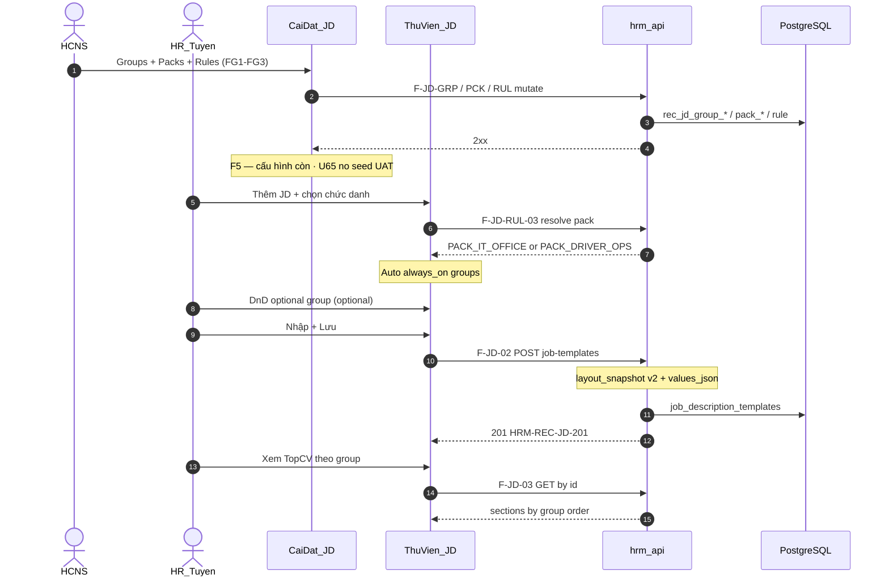

# PO-HRM-JD-GROUP-ARCH-01 — Group / Default Pack layer (APPEND onto Option A)

| Field | Value |
|-------|--------|
| **work_item_id** | `PO-HRM-JD-GROUP-ARCH-01` |
| **lane** | governance · sa |
| **Status** | **DRAFT-ARCH** — ADD layer on Option A; **Dev HOLD** until **GROUP triad** (ARCH+SPEC+DATA) PASS |
| **Date** | 2026-08-06 |
| **Decision owner** | SA |
| **Parent locks** | [`PO-HRM-JD-DYNAMIC-ARCH-02.md`](./PO-HRM-JD-DYNAMIC-ARCH-02.md) — Option **A** · **Q1** · **Q6** **LOCKED** (must_keep) |
| **Business input** | [`PO-HRM-JD-GROUP-MODEL-01.md`](./PO-HRM-JD-GROUP-MODEL-01.md) · [`PO-HRM-JD-WORLD-BENCHMARK-01.md`](./PO-HRM-JD-WORLD-BENCHMARK-01.md) |
| **Base arch** | [`PO-HRM-JD-DYNAMIC-ARCH-01.md`](./PO-HRM-JD-DYNAMIC-ARCH-01.md) Option A |
| **change_mode** | **ADD** — không REPLACE field/layout contracts ARCH-02 |
| **Locks** | `remaster_program_done=false` · `face_live=false` · U65 zero-seed · **cấm `apps/**` this wave** |
| **SoT JD** | `job_description_templates` — **FORBIDDEN** dual-write `job_postings` |

---

## 0. Relationship to ARCH-02 (preserve)

| Artifact | Role after this wave |
|----------|----------------------|
| ARCH-01 | Option A ADR-lite — still valid |
| ARCH-02 | Field catalog + L1 layout + JD snapshot F.1 / DB physical — **KEEP**; pointer §12 ADD below |
| **GROUP-ARCH-01 (this)** | **Lớp Group + Default Pack + rule engine** — required for sponsor “nhóm mặc định theo họ nghề” |
| GROUP-MODEL-01 | Sample analysis + pack examples — business neo |
| WORLD-BENCHMARK-01 | Global section matrix + catalog §4 + view §3.6 — **import into §12** |

**Invariant:** Field layer (`rec_jd_field_def` / `rec_jd_form_layout*`) remains. Groups **compose** fields; Packs **compose** groups; Rules **select** pack. Snapshot on save (Q6) **extends** to include pack + groups — not a second SoT.

**Dual-plane invariant (Greenhouse/Workday — §12.1):** **Controlled meta fields** (filter/ATS) ≠ **Narrative groups** (candidate-facing sections). Meta lives primarily as Field/`SEC_META` chips; narrative = Groups in pack order.

---

## 1. Three-layer model + rule engine order

```text
Lớp 1 — Field (trường)          ← ARCH-02 SoT
  short_text | long_text | select | number | date (+ system title/code/position_code)

Lớp 2 — Group (nhóm thông tin)  ← THIS DOC
  tập field_ref + order + label + view_style + usage (default_eligible | optional_only)

Lớp 3 — Default Pack (gói)      ← THIS DOC
  tập group_ref đánh dấu always_on + metadata pack
  + Pack Rules (khi nào áp pack nào)
```

### 1.1 Runtime order khi «Thêm JD» (fail-closed)

```text
1. Resolve context: company_id + position_code → job_family / industry tags / employment_type / work_mode
2. Evaluate pack_rules theo thứ tự priority ASC (số nhỏ thắng)
3. First matching rule → selected_pack_code
4. If no match → PACK_COMPANY_DEFAULT (an toàn tối thiểu)
5. Materialize always_on groups từ pack (clone group defs + field order vào writer canvas)
6. HR có thể DnD thêm groups optional_only từ catalog (không xóa always_on trừ khi policy cho phép archive section trống)
7. Trong mỗi group: sắp xếp field (Q1 DnD) — title vẫn locked hero toàn JD
8. Lưu → layout_snapshot_json gồm pack + groups + fields + values bridge (Q6)
```

**Rule priority table (engine — Settings-configurable, không hardcode FE):**

| Priority | Condition keys (example) | Example pack |
|---------:|--------------------------|--------------|
| 10 | `job_family IN (driver, logistics_ops)` | `PACK_DRIVER_OPS` |
| 20 | `job_family IN (it, software, qa, ba_it)` | `PACK_IT_OFFICE` |
| 30 | `industry = warehouse` | `PACK_WAREHOUSE` *(GĐ1 stub OK)* |
| 40 | `employment_type` + `work_mode` fine-tune | overlay / same pack |
| 900 | Fallback pháp nhân | `PACK_COMPANY_DEFAULT` |

**Conflict:** một rule match → stop. Nhiều rule cùng priority → **deterministic** sort by `rule_id` ASC; SA lean: forbid same priority at publish (VAL).

**G4 (MODEL-01):** Đổi chức danh giữa chừng → FE hỏi «Áp pack mới?» — **không** auto-wipe values đã gõ; nếu Yes → merge: thêm always_on groups thiếu, giữ values key trùng, detach groups không còn trong pack mới thành optional (không xóa content).

---

## 2. FE surfaces (ADD onto Q1)

| # | Surface | Menu | Behavior |
|---|---------|------|----------|
| **FG1** | **Settings · Groups** | Cài đặt → Nhóm thông tin JD | CRUD `rec_jd_group_def`: code, label, kind, usage, fields[], view_style; soft archive; F5 còn |
| **FG2** | **Settings · Default Packs** | Cài đặt → Gói mặc định JD | CRUD pack: code, label, `group_codes[]` always_on + order; publish |
| **FG3** | **Settings · Pack Rules** | Cài đặt → Rule chọn gói | Ordered rules: condition JSON + `pack_code` + priority; preview «pack sẽ chọn» |
| **F1** | Field catalog | *(ARCH-02 Q1)* | Unchanged |
| **F2** | Default field layout L1 | *(ARCH-02)* | May become **derived** from company default pack OR remain field-flat L1 for bootstrap — see §2.1 |
| **FW** | **JD writer** | Thư viện JD → Thêm/Sửa | Auto-insert always_on groups từ selected pack; palette **optional groups** DnD; field DnD trong group |
| **FV** | **TopCV-style view** | Thư viện JD → Xem | Render **theo group order** trong snapshot (`view_style`: heading / bullets / chips); XEVN tokens; no CMS |

### 2.1 L1 layout vs Pack (compatibility)

| Mode | When | Behavior |
|------|------|----------|
| **P-first (recommended GĐ1)** | Pack published for company | «Thêm JD» clones **pack → groups → fields**; L1 `rec_jd_form_layout` optional = flatten of `PACK_COMPANY_DEFAULT` for legacy LAY APIs |
| **L1-only fallback** | No pack / no rules | Keep ARCH-02 LAY-01/02 flat field layout — writer shows single implicit group `SEC_FLAT` |

**must_keep Q1:** Catalog fields @ Settings; DnD @ Thư viện (+ Settings publish). Groups/packs also @ Settings (FG1–FG3).

**must_keep Q6:** Save JD → snapshot includes pack_code + groups[] + fields; view reads snapshot only.

---

## 3. API / DB sketch

> Physical names provisional — ba-data GROUP-DATA owns final columns. Prefix: `/api/hrm/recruitment`. Same scope resolver as ARCH-02 (§4.1).

### 3.1 Entities

| Logical | Physical (draft) | Role |
|---------|------------------|------|
| E-JD-GROUP-DEF | `rec_jd_group_def` | Group catalog |
| E-JD-GROUP-FIELD | `rec_jd_group_field` | Field membership + order in group |
| E-JD-DEFAULT-PACK | `rec_jd_default_pack` | Pack header |
| E-JD-PACK-GROUP | `rec_jd_pack_group` | always_on groups + order in pack |
| E-JD-PACK-RULE | `rec_jd_pack_rule` | Ordered selection rules |
| E-JD-FIELD-DEF | `rec_jd_field_def` | ARCH-02 — unchanged |
| E-JD-LAYOUT* | `rec_jd_form_layout*` | ARCH-02 — L1 flatten / fallback |
| E-JD-MASTER | `job_description_templates` | `layout_snapshot_json` **extended** shape |

### 3.2 `rec_jd_group_def` (sketch)

| Column | Type | Notes |
|--------|------|-------|
| `id` | uuid PK | |
| `company_id` | text | Scope |
| `group_code` | text | e.g. `SEC_DUTIES`, `SEC_LICENSE` — UQ active per company |
| `label` | text | vi-VN section title |
| `kind` | text | `system_skeleton` \| `tenant_custom` |
| `usage` | text | `default_eligible` \| `optional_only` |
| `view_style` | text | `heading_block` \| `bullets` \| `chips` \| `key_value` |
| `sort_hint` | int | catalog order |
| `is_active` / `archived_at` | | Soft-delete |
| timestamps / audit | | |

**`rec_jd_group_field`:** `group_id`, `field_id`, `sort_order`, `company_id` denorm — FK field must be in-scope active.

### 3.3 `rec_jd_default_pack` + `rec_jd_pack_group`

| Column | Type | Notes |
|--------|------|-------|
| pack.`pack_code` | text | `PACK_IT_OFFICE`, `PACK_DRIVER_OPS`, `PACK_COMPANY_DEFAULT` |
| pack.`label` | text | |
| pack.`is_system` | bool | skeleton vs tenant |
| pack.`status` | text | draft \| published |
| pack_group.`group_id` / `group_code` | | always_on membership |
| pack_group.`sort_order` | int | section order on writer + view |

### 3.4 `rec_jd_pack_rule`

| Column | Type | Notes |
|--------|------|-------|
| `priority` | int | ASC win |
| `pack_code` | text | target |
| `condition_json` | jsonb | See §3.5 |
| `is_active` | bool | |
| `company_id` | text | Scope |

### 3.5 `condition_json` (v0)

```json
{
  "all": [
    { "op": "in", "path": "job_family", "value": ["it", "software", "qa", "ba_it"] }
  ]
}
```

Supported ops GĐ1: `eq`, `in`, `exists`. Paths: `job_family`, `industry`, `employment_type`, `work_mode`, `position_code_prefix`.  
Resolve `job_family` from XBOS/HRM job_titles tag (G1 MODEL-01) — if tag missing → skip rule (not match).

### 3.6 API F-ids (ADD — F.1 depth after GROUP SPEC)

| F-id | Method / path | Purpose |
|------|---------------|---------|
| **F-JD-GRP-01** | `GET /jd-group-defs?company_id=` | List groups |
| **F-JD-GRP-02** | `POST /jd-group-defs` | Create group + fields |
| **F-JD-GRP-03** | `PATCH /jd-group-defs/:id` | Update / soft-stop |
| **F-JD-GRP-04** | `GET /jd-group-defs/:id` | scope_parity |
| **F-JD-PCK-01** | `GET /jd-default-packs?company_id=` | List packs |
| **F-JD-PCK-02** | `PUT /jd-default-packs/:code` | Upsert pack + always_on groups |
| **F-JD-PCK-03** | `GET /jd-default-packs/:code` | Detail |
| **F-JD-RUL-01** | `GET /jd-pack-rules?company_id=` | List rules ordered |
| **F-JD-RUL-02** | `PUT /jd-pack-rules` | Replace ordered set (transaction) |
| **F-JD-RUL-03** | `POST /jd-pack-rules/resolve` | Preview pack for context (writer) |
| **F-JD-02/03/04** | job-templates *(extend)* | Snapshot shape §3.7; resolve pack on create if omitted |

**Errors (stubs):** `HRM-JD-GRP-*` · `HRM-JD-PCK-*` · `HRM-JD-RUL-*` · scope 403/409 — align DATA VAL when landed.

### 3.7 Snapshot shape (Q6 extend)

```json
{
  "layout_version": 2,
  "pack_code": "PACK_IT_OFFICE",
  "pack_label": "Công nghệ — văn phòng",
  "resolved_from_rule_id": "…",
  "groups": [
    {
      "group_code": "SEC_META",
      "label": "Thông tin đăng tuyển",
      "view_style": "chips",
      "source": "pack_always_on",
      "sort_order": 0,
      "fields": [
        { "field_key": "title", "label": "Chức danh", "field_type": "short_text", "is_required": true, "sort_order": 0 }
      ]
    },
    {
      "group_code": "SEC_AI_TOOLS",
      "label": "Yêu cầu / ưu tiên AI",
      "view_style": "bullets",
      "source": "optional_dnd",
      "sort_order": 5,
      "fields": [ … ]
    }
  ]
}
```

`values_json` remains flat map `field_key → value` (ARCH-02). View joins snapshot groups × values — **server may** still return `sections[]` display-ready (OS 28); prefer group_code as section id.

**Version:** `layout_version` ≥ 2 when groups present; v1 flat snapshots remain readable (implicit one group).

---

## 4. Pack examples — `PACK_IT_OFFICE` vs `PACK_DRIVER_OPS`

> **Canonical codes:** WORLD-BENCHMARK-01 §3.5 / §4 — detailed tables in **§12.3** (this APPEND).  
> Legacy aliases below map → new codes (keep for MODEL-01 readers).

| Legacy (MODEL-01) | Canonical (WORLD §4) |
|-------------------|----------------------|
| `SEC_HEADER` | `SEC_META` |
| `SEC_DUTIES` / `SEC_OPS_DUTIES` | `SEC_RESPONSIBILITIES` |
| `SEC_REQUIREMENTS` | `SEC_REQ_MIN` (+ `SEC_REQ_PREF`) |
| `SEC_TIME_PLACE` / `SEC_SHIFT` | `SEC_WORKING` (content differs by pack) |
| `SEC_SAFETY_GOAL` | `SEC_ABOUT_ROLE` + `SEC_SAFETY` |
| `SEC_AI_REQ` | `SEC_AI_TOOLS` |
| `SEC_CAREER_PATH` | `SEC_GROWTH` |
| `PACK_COMPANY_DEFAULT` | `PACK_CORP_DEFAULT` |

### 4.1–4.3 Summary (detail → §12.3)

| Pack | always_on (canonical) | Optional DnD |
|------|------------------------|--------------|
| `PACK_IT_OFFICE` | META · ABOUT_ROLE · RESPONSIBILITIES · REQ_MIN · REQ_PREF · WORKING(office) · BENEFITS | AI_TOOLS · Growth · Domain · About company |
| `PACK_DRIVER_OPS` | META · ABOUT_ROLE · RESPONSIBILITIES · REQ_MIN · WORKING(shift) · LICENSE · SAFETY · BENEFITS | PHYSICAL · Pref · Trip/port · About company |
| `PACK_CORP_DEFAULT` | META · ABOUT_ROLE · RESPONSIBILITIES · REQ_MIN · WORKING · BENEFITS | REQ_PREF · About company · Growth |

**Invariant:** Writer **không** inherit office `SEC_WORKING` copy khi pack = `PACK_DRIVER_OPS`.

---

## 5. Sequence (group-aware create)



---

## 6. Dev unlock — **HOLD** until GROUP triad PASS

| Gate | Owner | Status |
|------|-------|--------|
| G0 Option A · Q1 · Q6 | sponsor | **LOCKED** (ARCH-02) |
| G0b GROUP-MODEL + WORLD-BENCHMARK | sa/ba | **ON DISK** |
| **G2g GROUP-ARCH-01** (this + §12 world ALIGN) | sa | **PASS (arch draft)** — leg 1/3 |
| **G1g GROUP SPEC** | ba-process | **REQUIRED — PENDING** — leg 2/3 |
| **G1d GROUP DATA** | ba-data | **REQUIRED — PENDING** — leg 3/3 |
| G3 Dev FE+BE (field **and** group) | pm | **HOLD** until triad PASS |
| G4 QA J-* + U65 | qa | after READY_FOR_QA |

### GROUP triad (definition)

```text
GROUP_TRIAD_PASS =
  GROUP-ARCH-01 PASS (this file, incl. §12 world benchmark ALIGN)
  AND GROUP-SPEC PASS (UC + AC groups/packs/rules + view §3.6)
  AND GROUP-DATA PASS (entities + catalog seed-config contract + snapshot v2)

UNLOCK_DEV_JD_DYNAMIC_FULL =
  ARCH-02 CONFIRMED
  AND GROUP_TRIAD_PASS
```

**Dev HOLD (authoritative):** Do **not** dispatch / claim BE-01+FE-01 writer·view·pack until triad PASS.  
ARCH-02 §8 field-only unlock remains **suspended** for sponsor-complete path.

**FORBIDDEN until unlock:** dual-write `job_postings`; seed packs/groups for UAT evidence (U65); hardcode pack/group codes or §3.6 order in FE (must load from CFG/snapshot).

---

## 7. must_keep · NFR · forbidden

| Item | Rule |
|------|------|
| **A / Q1 / Q6** | LOCKED — do not reopen |
| **JD SoT** | `job_description_templates` only |
| **job_postings** | **FORBIDDEN** dual-write values/layout/groups |
| **YCTD** | soft FK `job_template_id` — must_keep |
| **Title-first** | hero field lock across packs |
| **U65** | Settings → Rules/Packs/Groups → Thêm JD → View → F5; **cấm** `pnpm seed:*` |
| **scope_parity** | list ↔ get ↔ mutate groups/packs/rules/templates |
| **Soft-delete** | groups/packs/rules/fields |
| **creative_extra** | `none` — Precision Motion |
| **Bootstrap config** | system skeleton groups/packs OK at migrate/first-open — **≠** UAT seed evidence |

---

## 8. AC gates (architecture)

| AC | Pass when |
|----|-----------|
| AC-JD-GRP-01 | Settings tạo Group → writer optional palette thấy (F5) |
| AC-JD-GRP-02 | Pack + Rules: chọn chức danh IT → always_on = PACK_IT_OFFICE groups |
| AC-JD-GRP-03 | Chọn họ lái xe → PACK_DRIVER_OPS; **không** hiện giờ office trong `SEC_WORKING` |
| AC-JD-GRP-04 | DnD optional group → snapshot `source=optional_dnd`; View section đúng order |
| AC-JD-GRP-05 | Đổi chức danh → confirm apply pack; không mất values trùng key |
| AC-JD-GRP-06 | U65 no seed · no job_postings write |
| AC-JD-GRP-07 | View hierarchy matches WORLD §3.6 / ARCH §12.4 (meta chips → … → benefits) |
| AC-JD-GRP-08 | Meta controlled fields filterable; narrative groups do not invent ATS keys |
| AC-JD-ARCH-01..07 | Still apply (ARCH-02) once Dev unlocked |

---

## 9. Mapping for BA / Dev

| Artifact | ADD |
|----------|-----|
| GROUP SPEC (ba-process) | UC Settings groups/packs/rules; UC writer resolve+DnD group; AC-JD-GRP-*; Diễn biến; G1–G4 defaults |
| GROUP DATA (ba-data) | Physical columns §3; VAL uniqueness; condition_json schema; snapshot v2; ownership CFG |
| ARCH-02 | Pointer §12 only (no wipe) |
| Slice | Extend `PO-HRM-JD-DYNAMIC-TOPCV.md` allowed_paths when Dev unlock |
| Journey | J-HRM-JD-GRP-01 Settings pack · J-HRM-JD-GRP-02 IT vs Driver resolve · J-HRM-JD-GRP-03 view §3.6 · promote with J-HRM-JD-01..03 |
| WORLD-BENCHMARK-01 | Import §3.5/§3.6/§4 → ARCH §12 · SPEC AC · DATA catalog rows |

---

## 10. completion_report

**Closed (wave 1 + APPEND world)**

- APPEND Group → Pack → Rules onto Option A without wiping ARCH-02.  
- **§12 ALIGN** WORLD-BENCHMARK-01: meta vs narrative · default group catalog · pack IT/Driver · FE view hierarchy §3.6.  
- Dev **HOLD** until **GROUP triad** (ARCH+SPEC+DATA) PASS.  
- must_keep A/Q1/Q6 · no job_postings dual-write · U65.  
- **No `apps/**`.**

**Residual**

- ba-process GROUP SPEC (catalog + view order + AC-JD-GRP-07/08)  
- ba-data GROUP DATA (canonical group_code rows + pack membership)  
- PM: Dev HOLD until triad; journey GRP-03  

---

## 11. Handoff

| Field | Value |
|-------|--------|
| **ack_status** | `PASS_TO_PM` |
| **next_owner** | `pm` |
| **evidence_path** | `docs/qa/evidence/po-hrm-jd-group-arch-01.md` |
| **deliverable** | `docs/program/specs/PO-HRM-JD-GROUP-ARCH-01.md` (§12 APPEND) |

### next_dispatch_prompt (copy-ready)

```text
work_item_id: PO-HRM-JD-GROUP-SPEC-01 + PO-HRM-JD-GROUP-DATA-01 (parallel)
lane: ba-process + ba-data — Dev HOLD until GROUP triad PASS
entry_criteria:
  - docs/program/specs/PO-HRM-JD-GROUP-ARCH-01.md (§12 world ALIGN)
  - docs/program/specs/PO-HRM-JD-WORLD-BENCHMARK-01.md
  - docs/program/specs/PO-HRM-JD-GROUP-MODEL-01.md
  - ARCH-02 A/Q1/Q6 LOCKED must_keep
read_first:
  - docs/program/specs/PO-HRM-JD-GROUP-ARCH-01.md (§1 · §6 triad · §12)
  - docs/program/specs/PO-HRM-JD-WORLD-BENCHMARK-01.md (§3.5 · §3.6 · §4)
  - docs/program/specs/PO-HRM-JD-DYNAMIC-ARCH-02.md
  - docs/program/specs/PO-HRM-JD-DYNAMIC-SPEC-01.md
  - docs/program/specs/PO-HRM-JD-DYNAMIC-DATA-01.md

### ba-process PO-HRM-JD-GROUP-SPEC-01
- UC Settings groups/packs/rules; writer resolve+DnD; View hierarchy WORLD §3.6
- Catalog codes ARCH §12.2; packs §12.3; meta vs narrative §12.1
- AC-JD-GRP-01..08 · no prompt-echo · U65 · forbid job_postings
evidence: docs/qa/evidence/po-hrm-jd-group-spec-01.md
ack: PASS_TO_PM

### ba-data PO-HRM-JD-GROUP-DATA-01
- Physical group/pack/rule + canonical group_code catalog §12.2
- Controlled meta field keys vs narrative groups; snapshot v2 view_order
- VAL UQ/soft-delete/scope; layout_version ≥ 2
evidence: docs/qa/evidence/po-hrm-jd-group-data-01.md
ack: PASS_TO_PM

### PM
- Dev HOLD until triad PASS — then unlock BE-01+FE-01 with group/pack+view §3.6
- Do NOT hardcode FE section order

Locks: remaster_program_done=false · face_live=false · U65 · no apps/** on BA
```

---

## 12. ADD — World benchmark ALIGN (2026-08-06)

| Field | Value |
|-------|--------|
| **ref** | [`PO-HRM-JD-WORLD-BENCHMARK-01.md`](./PO-HRM-JD-WORLD-BENCHMARK-01.md) |
| **change_mode** | **ADD** — không wipe §§0–11 |
| **Dev** | vẫn **HOLD** (§6 GROUP triad) |

### 12.1 Controlled meta fields vs narrative groups (Greenhouse / Workday)

Enterprise ATS tách **2 plane** — XeVN Option A phải mirror:

| Plane | SoT layer | Ví dụ | Dùng để |
|-------|-----------|-------|---------|
| **Controlled meta** | Field defs (+ group `SEC_META` chips) | `title`, `position_code`, `location`, `employment_type`, `work_mode` / workplace, `salary_band`, `job_family` | Filter, list columns, ATS, báo cáo — **select/catalog**, không free-text dài |
| **Narrative groups** | Group defs in pack | ABOUT_ROLE · RESPONSIBILITIES · REQ_MIN/PREF · WORKING · BENEFITS · LICENSE/SAFETY | Ứng viên đọc — heading + bullets / long_text |

**Rules**

1. Hiring manager **không** tự bịa cấu trúc mỗi JD — chỉ đổi nội dung trong groups của pack (+ optional DnD).  
2. Meta fields: bounded `field_type` + allowlist (ARCH-02); **cấm** nhồi meta vào narrative blob.  
3. Narrative groups: `view_style` bullets/heading; không expose raw `field_key` trên UI.  
4. Snapshot lưu cả hai: meta values trong `values_json` + `groups[]` narrative order.  
5. F-JD-03 display-ready: `meta_chips[]` **trước** `sections[]` (xem §12.4).

```text
┌─────────────────────────────┐
│ SEC_META / controlled fields│  ← plane ATS
└──────────────┬──────────────┘
               │
┌──────────────▼──────────────┐
│ Narrative groups (pack)     │  ← plane candidate
│  About → Duties → Req → …   │
└─────────────────────────────┘
```

### 12.2 Default group catalog (Settings bootstrap — WORLD §4)

System skeleton `kind=system_skeleton` (config bootstrap ≠ UAT seed evidence):

| group_code | label (VI) | usage | view_style (default) | Plane |
|------------|------------|-------|----------------------|-------|
| `SEC_META` | Thông tin đăng tuyển | default_eligible | `chips` / key_value | **meta** |
| `SEC_ABOUT_ROLE` | Giới thiệu vị trí | default_eligible | `heading_block` | narrative |
| `SEC_RESPONSIBILITIES` | Mô tả / trách nhiệm | default_eligible | `bullets` | narrative |
| `SEC_REQ_MIN` | Yêu cầu bắt buộc | default_eligible | `bullets` | narrative |
| `SEC_REQ_PREF` | Yêu cầu ưu tiên | default_eligible | `bullets` | narrative |
| `SEC_WORKING` | Thời gian & điều kiện làm việc | default_eligible | `key_value` + bullets | narrative |
| `SEC_BENEFITS` | Chế độ đãi ngộ | default_eligible | `bullets` | narrative |
| `SEC_GROWTH` | Lộ trình phát triển | optional_only | `bullets` | narrative |
| `SEC_ABOUT_COMPANY` | Về công ty / đội ngũ | optional_only | `heading_block` | narrative |
| `SEC_LICENSE` | Giấy phép & chứng chỉ | default_eligible* | `bullets` | narrative |
| `SEC_SAFETY` | An toàn & tuân thủ | default_eligible* | `bullets` | narrative |
| `SEC_PHYSICAL` | Yêu cầu thể chất / môi trường | optional_only | `bullets` | narrative |
| `SEC_EEO` | Cam kết đa dạng & CĐ bình đẳng | optional_only | `heading_block` | narrative (GĐ2 OK) |
| `SEC_AI_TOOLS` | Yêu cầu / ưu tiên AI | optional_only | `bullets` | narrative |

\* `LICENSE` / `SAFETY`: `default_eligible` nhưng **always_on chỉ trong** `PACK_DRIVER_OPS` (pack membership), không ép vào IT pack.

**Controlled meta field keys (minimum in `SEC_META` / system fields):**  
`title` (hero) · `code` · `position_code` · `location` · `employment_type` · `work_mode` · `salary_band` (optional) · `job_family` (resolve pack — may be derived from position, not always shown).

### 12.3 Pack examples — IT vs Driver (WORLD §3.5 canonical)

#### `PACK_IT_OFFICE`

| sort | group_code | always_on | Notes |
|-----:|------------|:---------:|-------|
| 0 | `SEC_META` | ✓ | chips: title, loc, band, FT, workplace office/hybrid |
| 1 | `SEC_ABOUT_ROLE` | ✓ | 1 đoạn impact — gap XeVN Word |
| 2 | `SEC_RESPONSIBILITIES` | ✓ | 4–8 bullets outcome |
| 3 | `SEC_REQ_MIN` | ✓ | bắt buộc |
| 4 | `SEC_REQ_PREF` | ✓ | tách Preferred (Google) |
| 5 | `SEC_WORKING` | ✓ | T2–T7 office — **không** dùng cho driver |
| 6 | `SEC_BENEFITS` | ✓ | BHXH / phép cụ thể |

**Optional DnD:** `SEC_AI_TOOLS` · `SEC_GROWTH` · `SEC_ABOUT_COMPANY` · domain logistics narrative.

#### `PACK_DRIVER_OPS`

| sort | group_code | always_on | Notes |
|-----:|------------|:---------:|-------|
| 0 | `SEC_META` | ✓ | + ca / workplace ops tags |
| 1 | `SEC_ABOUT_ROLE` | ✓ | mục tiêu vận hành |
| 2 | `SEC_RESPONSIBILITIES` | ✓ | nhiệm vụ / lệnh điều xe |
| 3 | `SEC_REQ_MIN` | ✓ | KN + điều kiện tối thiểu |
| 4 | `SEC_LICENSE` | ✓ | B2/C/CE, ATLĐ, PCCC — **sau Req** |
| 5 | `SEC_WORKING` | ✓ | ca kíp / điều động — **≠** office hours |
| 6 | `SEC_SAFETY` | ✓ | GTĐB / cảng-kho — sau Working hoặc cạnh License |
| 7 | `SEC_BENEFITS` | ✓ | |

**Optional DnD:** `SEC_REQ_PREF` · `SEC_PHYSICAL` · trip log / port · `SEC_ABOUT_COMPANY`.

#### `PACK_CORP_DEFAULT` (fallback priority 900)

META · ABOUT_ROLE · RESPONSIBILITIES · REQ_MIN · WORKING · BENEFITS — optional PREF / COMPANY / GROWTH.

### 12.4 FE view hierarchy (WORLD §3.6 — TopCV / career-site bar)

**Consumer:** F4 / FV — đọc `layout_snapshot` only (Q6). **Cấm** hardcode order in JSX; use `groups[].sort_order` (pack default may match below).

**Scan order (IT / CORP):**

```text
1 Meta chips     ← SEC_META (+ system title hero)
2 About role     ← SEC_ABOUT_ROLE
3 Responsibilities ← SEC_RESPONSIBILITIES
4 Requirements   ← SEC_REQ_MIN → then SEC_REQ_PREF (if present)
5 Working        ← SEC_WORKING
6 Benefits       ← SEC_BENEFITS
7 About company / EEO (optional) ← SEC_ABOUT_COMPANY · SEC_EEO
```

**Driver / ops overlay:** after Requirements (or after Working), insert **`SEC_LICENSE`** then **`SEC_SAFETY`** (and optional `SEC_PHYSICAL`) before Benefits if pack order says so — snapshot order wins.

**API view model (extend F-JD-03):**

```json
{
  "meta_chips": [{ "key": "location", "label": "Địa điểm", "value": "…" }],
  "sections": [{ "group_code": "SEC_ABOUT_ROLE", "label": "…", "view_style": "…", "fields": [] }]
}
```

Tokens: XEVN Precision Motion only (`creative_extra=none`). No public CMS URL GĐ1.

### 12.5 Gap import (WORLD §5 → BA)

| Gap | Owner |
|-----|-------|
| About role thiếu trên Word IT | SPEC AC + pack always_on |
| Req min/pref chưa đồng nhất | SPEC + catalog |
| Company dài / không có | optional_only |
| EEO | optional GĐ2 |
| Driver ≠ office hours | pack rule + WORKING content |
| View hierarchy | FE after triad · AC-JD-GRP-07 |

### 12.6 must_keep reminder

Option **A** · **Q1** · **Q6** · SoT `job_description_templates` · **FORBIDDEN** `job_postings` dual-write · **U65** · Dev **HOLD** until GROUP triad PASS · no `apps/**` this wave.