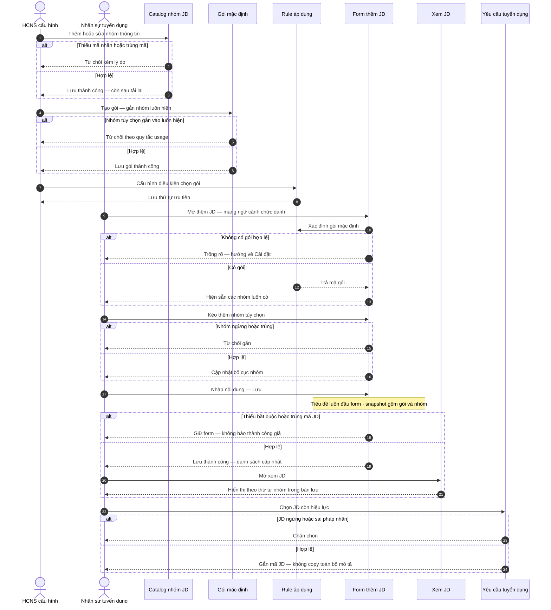

# Delta SRS — Thư viện JD: nhóm thông tin + gói mặc định + rule áp dụng

**Trạng thái draft:** DRAFT · chờ chốt sponsor → ba-docs merge vào SRS enterprise  
**Neo spine:** FR-UC-BP-REC-00 · mở rộng lớp Group/Pack trên PO-HRM-JD-DYNAMIC-SPEC-01  
**Chế độ:** ADD-only · không xóa / không đè stub REC-00 · không đè UC-00a/00b/00c  
**Intent SoT:** `PO-HRM-JD-GROUP-MODEL-01.md` · mẫu IT: `_tmp_jd_samples_extract.txt` · **world import:** `PO-HRM-JD-WORLD-BENCHMARK-01.md`

---

## 0. Meta đội ngũ (không đưa vào bản gửi khách)

| Mục | Giá trị |
|-----|---------|
| work_item_id | PO-HRM-JD-GROUP-SPEC-01 |
| lane | governance · ba-process |
| phụ thuộc | PO-HRM-JD-DYNAMIC-SPEC-01 · GROUP-MODEL-01 · **WORLD-BENCHMARK-01** |
| append | §21 World benchmark import (2026-08-06) — catalog §4 · packs §3.5 · view §3.6 · BR min/pref |
| locks | **Option A** · **Q1** · **Q6** LOCKED (ARCH-02) |
| next | ba-data (PO-HRM-JD-GROUP-DATA-01) + sa APPEND ARCH group layer |
| must_keep | U65 · FR-UC-BP-REC-00 · YCTD linkage · SoT `job_description_templates` · cấm dual-write `job_postings` · creative_extra=none |
| J-* đề xuất | J-HRM-JD-04 · J-HRM-JD-05 · J-HRM-JD-06 |

---

## 1. Mục tiêu nghiệp vụ

Nâng lớp cấu hình JD từ **trường (field)** lên **nhóm thông tin (group)** và **gói mặc định (default pack)**:

1. Thông tin JD cấu hình động theo pháp nhân (giữ Option A).
2. Có **nhóm mặc định** luôn hiện khi viết JD (không bắt HR kéo từng field từ đầu).
3. Khi viết JD: kéo **nhóm động** (optional) từ catalog nhóm — không chỉ kéo field.
4. Nhóm mặc định **tạo/sửa/ngừng được** ở Cài đặt (kể cả nhóm thuộc pack).
5. Hệ thống xác định **khi nào dùng pack nào** bằng rule cấu hình được (họ nghề → ngành → hình thức làm việc → fallback pháp nhân).

JD master vẫn một nguồn cho YCTD. Group/Pack chỉ thay **cách tổ chức bố cục và áp khung**, không đổi mã JD / trạng thái / liên kết YCTD.

---

## 2. As-is / To-be

| | As-is (DYNAMIC-SPEC-01) | To-be (delta này) |
|---|-------------------------|-------------------|
| Đơn vị kéo | Field từ catalog | **Group** (tập field + thứ tự) là đơn vị kéo chính; field DnD trong group vẫn giữ (Q1) |
| Mở Thêm JD | Canvas trống hoặc L1 field layout | Auto chèn các Group của **Default Pack** đã chọn theo rule |
| Cấu hình Settings | Catalog field + L1 layout | + CRUD Group · CRUD Default Pack · CRUD rule áp dụng |
| Xem JD | Section theo gợi ý field | Render **theo thứ tự Group** trong `layout_snapshot` (Q6) |
| Một layout cho mọi nghề | Rủi ro IT giờ office gắn nhầm lái xe | Nhiều pack: `PACK_IT_OFFICE` · `PACK_DRIVER_OPS` · `PACK_CORP_DEFAULT` (alias fallback: `PACK_COMPANY_DEFAULT`) |
| Yêu cầu một khối | Gộp bắt buộc + ưu tiên | Tách `SEC_REQ_MIN` / `SEC_REQ_PREF` (Google pattern) — §21 |

---

## 3. Phạm vi

### 3.1 Trong phạm vi (MVP)

1. Cài đặt: CRUD **Group** (mã, nhãn, kind, usage, fields[], view_style, trạng thái).
2. Cài đặt: CRUD **Default Pack** (tập Group `always_on`, thứ tự, trạng thái).
3. Cài đặt: CRUD **rule áp dụng pack** (điều kiện đánh giá theo thứ tự ưu tiên).
4. Thư viện JD — Thêm/Sửa: resolve pack → chèn Group always_on → HR kéo thêm Group `optional_only` / `default_eligible` chưa có trên canvas.
5. Trong mỗi Group: sắp xếp field (Q1 DnD) như DYNAMIC-SPEC.
6. Lưu JD → `layout_snapshot` gồm `pack_code` + danh sách Group đã áp + field order (Q6).
7. Xem JD: khối theo Group order trong snapshot; title-first giữ BR-BP-JD-DYN-02.

### 3.2 Ngoài phạm vi

| Ngoài phạm vi | Ghi chú |
|---------------|---------|
| Invent brand / palette / gradient ngoài token XeVN | creative_extra=none |
| Dual-write / SoT sang `job_postings` | Cấm tuyệt đối |
| Đăng tin đa kênh / career site công khai | REC-03 / GĐ2 |
| OCR / AI sinh JD | Không |
| Đổi quan hệ YCTD–JD | must_keep REC-00 |
| Hardcode pack trong FE | Rule chỉ đọc từ cấu hình Settings |
| Seed dữ liệu UAT để pass QA | U65 — bootstrap cấu hình ≠ evidence |

---

## 4. Tác nhân

| Tác nhân | Vai trò |
|----------|---------|
| HCNS / Quản trị cấu hình | CRUD Group · Pack · Rule |
| Nhân sự tuyển dụng · Trưởng BP | Viết JD: nhận pack tự động + kéo Group tùy chọn + nhập giá trị |
| Hệ thống | Resolve rule → pack; validate; snapshot; render view theo Group |
| YCTD consumer | Chỉ đọc JD Hiệu lực (không sửa Group/Pack) |

---

## 5. Catalog UC / FR (ADD)

| Mã UC | Mã FR draft | Tên | Liên hệ |
|-------|-------------|-----|---------|
| UC-BP-REC-00 | FR-UC-BP-REC-00 | Thư viện JD master | **must_keep** |
| UC-BP-REC-00a..c | FR-…-00a..c | Field catalog · kéo field · form/view động | **must_keep** DYNAMIC-SPEC |
| **UC-BP-REC-00d** | FR-UC-BP-REC-00d | Tạo / cấu hình Group | ADD |
| **UC-BP-REC-00e** | FR-UC-BP-REC-00e | Tạo / cấu hình Default Pack | ADD |
| **UC-BP-REC-00f** | FR-UC-BP-REC-00f | Rule áp dụng Default Pack | ADD |
| **UC-BP-REC-00g** | FR-UC-BP-REC-00g | Viết JD: auto pack + kéo Group tùy chọn | ADD · nâng 00b/00c |
| **UC-BP-REC-00h** | FR-UC-BP-REC-00h | Xem JD theo thứ tự Group | ADD · nâng 00c view |

---

## 6. Ba lớp cấu hình (khóa nghiệp vụ)

```text
Lớp 1 — Field          (UC-00a)     text / số / select / date / rich-lite…
Lớp 2 — Group          (UC-00d)     tập field + thứ tự + nhãn section + bắt buộc trong nhóm
Lớp 3 — Default Pack   (UC-00e/f)   tập Group always_on + rule chọn pack
```

Khi **viết JD** (UC-00g):

1. Hệ thống chọn Default Pack theo rule (UC-00f) → Group trong pack **luôn có** trên canvas.
2. HR kéo thêm Group tùy chọn từ palette.
3. Trong Group: sắp xếp field (Q1).
4. Lưu → `layout_snapshot` = pack + groups (+ fields) (Q6).

---

## 7. FR-UC-BP-REC-00d — Tạo / cấu hình Group

### 7.1 Thông tin chung

| Mục | Nội dung |
|-----|----------|
| Tác nhân | HCNS · Quản trị cấu hình |
| Tiên quyết | Đúng pháp nhân; quyền cấu hình tuyển dụng; catalog field có ≥0 field (khuyến nghị ≥1 khi gắn vào Group) |
| Hậu điều kiện | Group Hiệu lực sẵn sàng gắn Pack hoặc kéo khi viết JD |
| BR | BR-BP-JD-GRP-01 · BR-BP-JD-GRP-02 · BR-BP-JD-GRP-08 |
| Bề mặt Q1 | **Cài đặt** (không DnD viết JD tại đây) |

**Mục đích:** Quản lý đơn vị «nhóm thông tin» — section có thể tái sử dụng giữa nhiều JD / pack.

### 7.2 Dữ liệu đầu vào

| Trường | Bắt buộc | Quy tắc |
|--------|----------|---------|
| Mã nhóm (`code`) | Có | Unique trong pháp nhân; ổn định khi đã dùng — chỉ ngừng, không đổi mã |
| Nhãn hiển thị | Có | Tiếng Việt; heading trên form và view |
| `kind` | Có | `system_skeleton` \| `tenant_custom` |
| `usage` | Có | `default_eligible` \| `optional_only` |
| `fields[]` | Có (≥1 khi Hiệu lực dùng trên pack/canvas) | field_key ∈ catalog Hiệu lực + thứ tự trong nhóm |
| `view_style` | Có | `heading` \| `bullets` \| `chips` (thanh chất lượng bố cục — không invent brand) |
| Trạng thái | Có | Hiệu lực / Ngừng |

### 7.3 Luồng chính

1. Mở Cài đặt → Nhóm thông tin JD.
2. Thêm / sửa / ngừng Group; gắn field và thứ tự.
3. Lưu → 2xx → list cập nhật.
4. F5: còn đúng.

### 7.4 Diễn biến

| # | Ai | Thao tác | Điều kiện | Kết quả hoặc lỗi |
|---|----|----------|-----------|------------------|
| 0 | HCNS | Mở Cài đặt nhóm JD | Đúng quyền · pháp nhân | List/empty tải được; thiếu quyền → từ chối rõ |
| 1 | HCNS | Lưu thiếu mã hoặc nhãn | Validate | Không 2xx thành công; giữ form |
| 2 | HCNS | Trùng mã Group hiệu lực | Unique | Từ chối; không tạo bản ghi thứ hai |
| 3 | HCNS | Gắn field đã ngừng | Chỉ field Hiệu lực | Từ chối gắn; thông báo rõ |
| 4 | HCNS | Ngừng Group đang trong Pack hoặc snapshot JD cũ | Soft-stop | Cho ngừng; Pack không còn kéo Group đó cho JD **mới**; JD cũ vẫn xem theo snapshot |
| 5 | HCNS | Lưu hợp lệ | Đủ field | **2xx** → hàng mới/cập nhật trên list |
| T | — | F5 | — | Catalog Group còn |
| Thành công | — | — | — | Group sẵn sàng cho Pack / palette kéo |

### 7.5 Empty / error FE

| Tình huống | Hành vi |
|------------|---------|
| Chưa có Group | Empty + CTA «Thêm nhóm»; không spinner vô hạn; không GET storm |
| API list 4xx/5xx | Banner lỗi; Thử lại thủ công |
| Lưu 4xx | Giữ form; lý do rõ; không đóng dialog giả thành công |

---

## 8. FR-UC-BP-REC-00e — Tạo / cấu hình Default Pack

### 8.1 Thông tin chung

| Mục | Nội dung |
|-----|----------|
| Tác nhân | HCNS · Quản trị cấu hình |
| Tiên quyết | Có ≥1 Group `default_eligible` hoặc skeleton dùng được |
| Hậu điều kiện | Pack Hiệu lực có thể được rule trỏ tới |
| BR | BR-BP-JD-GRP-03 · BR-BP-JD-GRP-04 |
| Bề mặt Q1 | **Cài đặt** |

**Mục đích:** Định nghĩa gói nhóm **always_on** khi viết JD thuộc ngữ cảnh tương ứng.

### 8.2 Dữ liệu đầu vào

| Trường | Bắt buộc | Quy tắc |
|--------|----------|---------|
| Mã pack (`code`) | Có | Unique pháp nhân; ví dụ `PACK_IT_OFFICE` |
| Nhãn | Có | Tiếng Việt |
| `groups[]` always_on | Có (≥1) | Chỉ Group Hiệu lực; `usage` = `default_eligible` (không gắn `optional_only` vào always_on) |
| Thứ tự Group trong pack | Có | Quyết định thứ tự section mặc định trên form/view |
| Trạng thái | Có | Hiệu lực / Ngừng |
| Ghi chú | Không | Mô tả khi nào dùng (cho HCNS) |

### 8.3 Luồng chính

1. Mở Cài đặt → Gói mặc định JD.
2. Thêm pack → chọn và sắp Group always_on.
3. Lưu → 2xx → F5 còn.

### 8.4 Diễn biến

| # | Ai | Thao tác | Điều kiện | Kết quả hoặc lỗi |
|---|----|----------|-----------|------------------|
| 0 | HCNS | Mở danh sách Pack | Đúng quyền | List/empty OK |
| 1 | HCNS | Pack không có Group | Validate | Chặn Lưu; yêu cầu ≥1 Group |
| 2 | HCNS | Gắn Group `optional_only` vào always_on | BR-BP-JD-GRP-04 | Từ chối; hướng dẫn đổi usage hoặc bỏ khỏi pack |
| 3 | HCNS | Ngừng Pack đang được rule trỏ | Soft-stop | Cho ngừng; rule trỏ pack ngừng → fail-closed fallback (BR-BP-JD-GRP-06) |
| 4 | HCNS | Lưu hợp lệ | — | **2xx**; list cập nhật |
| T | — | F5 | — | Pack còn đúng groups[] |

---

## 9. FR-UC-BP-REC-00f — Rule áp dụng Default Pack

### 9.1 Thông tin chung

| Mục | Nội dung |
|-----|----------|
| Tác nhân | HCNS · Quản trị cấu hình |
| Tiên quyết | Có ≥1 Pack Hiệu lực (khuyến nghị có `PACK_CORP_DEFAULT`) |
| Hậu điều kiện | Khi mở Thêm JD, hệ thống resolve đúng một Pack |
| BR | BR-BP-JD-GRP-05 · BR-BP-JD-GRP-06 |
| Bề mặt Q1 | **Cài đặt** — **không** hardcode trong FE |

**Mục đích:** Trả lời «khi nào dùng nhóm/pack mặc định nào» bằng cấu hình có thứ tự ưu tiên.

### 9.2 Thứ tự đánh giá (fail-closed)

| Thứ tự | Điều kiện (input ngữ cảnh JD) | Ví dụ pack |
|-------:|-------------------------------|------------|
| 1 | `job_family` / họ nghề trên chức danh (XBOS job_titles tag) | `PACK_IT_OFFICE` · `PACK_DRIVER_OPS` · `PACK_WAREHOUSE` |
| 2 | `industry` / ngành pháp nhân hoặc tag vị trí | Logistics nặng → driver/ops |
| 3 | `employment_type` + `work_mode` | Office full-time vs ca kíp |
| 4 | Fallback pháp nhân | `PACK_CORP_DEFAULT` (alias chấp nhận: `PACK_COMPANY_DEFAULT` → cùng pack) |

**Fail-closed:** Không khớp rule nào / pack trỏ tới đã Ngừng / thiếu pack → dùng `PACK_CORP_DEFAULT` nếu Hiệu lực; nếu cũng không có → empty canvas + CTA cấu hình (không bịa pack).

### 9.3 Dữ liệu đầu vào rule

| Trường | Bắt buộc | Quy tắc |
|--------|----------|---------|
| Độ ưu tiên | Có | Số nguyên; nhỏ hơn = đánh giá trước |
| Điều kiện (family / industry / employment / work_mode) | ≥1 khóa | Khớp exact hoặc allowlist do ba-data khóa |
| `pack_code` đích | Có | Pack đang Hiệu lực |
| Trạng thái rule | Có | Hiệu lực / Ngừng |

### 9.4 Diễn biến

| # | Ai | Thao tác | Điều kiện | Kết quả hoặc lỗi |
|---|----|----------|-----------|------------------|
| 0 | HCNS | Mở danh sách rule | Đúng quyền | List theo ưu tiên |
| 1 | HCNS | Hai rule cùng ưu tiên + cùng điều kiện chồng | Validate | Từ chối hoặc yêu cầu chỉnh ưu tiên (deterministic) |
| 2 | HCNS | Rule trỏ pack Ngừng | Validate lúc Lưu | Chặn; chọn pack Hiệu lực |
| 3 | HCNS | Lưu hợp lệ | — | **2xx**; F5 còn thứ tự |
| 4 | Hệ thống | Resolve khi mở Thêm JD | Ngữ cảnh chức danh… | Đúng một pack theo §9.2 |

---

## 10. FR-UC-BP-REC-00g — Viết JD: auto pack + kéo Group tùy chọn

### 10.1 Thông tin chung

| Mục | Nội dung |
|-----|----------|
| Tác nhân | Nhân sự tuyển dụng · HCNS · Trưởng BP |
| Tiên quyết | Q1: DnD tại **Thư viện JD**; có Pack resolve được hoặc empty rõ; Option A form động |
| Hậu điều kiện | JD Nháp/Hiệu lực với `layout_snapshot` chứa pack + groups (Q6) |
| BR | BR-BP-JD-GRP-05..09 · BR-BP-JD-DYN-02..03 · BR-BP-JD-01 |
| Bề mặt | Dialog Thêm/Sửa JD trên Thư viện |

**Mục đích:** HR không bắt đầu từ canvas trống khi đã có pack; vẫn mở rộng bằng kéo Group.

### 10.2 Luồng chính

1. Mở Thêm JD → chọn / mang ngữ cảnh chức danh (job_family…).
2. Hệ thống resolve Pack → chèn Group always_on theo thứ tự pack (**không** cần kéo).
3. Palette Group: các Group Hiệu lực chưa có trên canvas (`optional_only` hoặc `default_eligible` còn lại).
4. HR kéo thêm Group tùy chọn; sắp xếp thứ tự Group trên canvas; sắp field trong Group.
5. Nhập giá trị → Lưu → 2xx → list cập nhật; snapshot lưu pack + groups.
6. Đổi chức danh giữa chừng (G4): hỏi «Áp pack mới?» — **không** tự xóa nội dung đã gõ nếu user từ chối.

### 10.3 Diễn biến

| # | Ai | Thao tác | Điều kiện | Kết quả hoặc lỗi |
|---|----|----------|-----------|------------------|
| 0 | HR | Mở Thêm JD | Phiên hợp lệ · đúng CT | Dialog mở; resolve pack |
| 1 | Hệ thống | Không có pack / rule | Fail-closed | Empty + CTA Cài đặt Pack/Rule; **không** invent Group |
| 2 | HR | Canvas có Group always_on từ pack | Pack OK | Thấy đủ section mặc định ngay |
| 3 | HR | Kéo Group đã ngừng (cache) | Chỉ Hiệu lực | Từ chối gắn |
| 4 | HR | Kéo Group trùng code đã có trên canvas | Unique trên canvas | Từ chối trùng hoặc ignore |
| 5 | HR | Đổi chức danh → pack khác | G4 | Dialog xác nhận áp pack mới; Từ chối = giữ snapshot hiện tại + nội dung |
| 6 | HR | Thiếu field bắt buộc trong Group always_on → Lưu | Validate | Không success giả; highlight |
| 7 | HR | Lưu hợp lệ | — | **2xx**; list có hàng; snapshot có `pack_code` + groups |
| T | — | F5 list + mở lại Sửa | — | Group order + giá trị còn |

### 10.4 Empty / error FE

| Tình huống | Hành vi |
|------------|---------|
| Pack rỗng / không resolve | Empty rõ; disable Lưu nội dung đến khi có ≥1 Group trên canvas |
| GET layout/pack lỗi | Banner ≠ empty «không có dữ liệu» che 500 |
| Lưu 4xx | Giữ dialog + dữ liệu đã nhập |

---

## 11. FR-UC-BP-REC-00h — Xem JD theo Group

### 11.1 Thông tin chung

| Mục | Nội dung |
|-----|----------|
| Tác nhân | HR · Trưởng BP · HCNS |
| Tiên quyết | JD đã lưu có `layout_snapshot` (Q6) |
| BR | BR-BP-JD-GRP-07 · BR-BP-JD-DYN-04 · BR-BP-JD-DYN-06 |
| Neo | List → Xem (cross-nav) |

**Mục đích:** Màn xem phân tầng theo **thứ tự Group trong snapshot** (heading / bullets / chips theo `view_style`); không bảng cứng toàn body; không đọc lại Pack live nếu def đổi — snapshot là SoT render.

### 11.2 Luồng chính

1. List Thư viện JD → mở Xem.
2. Title-first (control/tiêu đề đầu).
3. Các khối = Group trong snapshot, đúng order; field trong Group theo order đã lưu.
4. Badge trạng thái Nháp/Hiệu lực/Ngừng rõ.

### 11.3 Diễn biến

| # | Ai | Thao tác | Điều kiện | Kết quả hoặc lỗi |
|---|----|----------|-----------|------------------|
| 0 | HR | List → Xem | Có quyền · đúng scope | View tải; 404 scope → thông báo rõ, không trắng |
| 1 | Hệ thống | Def Group đã ngừng sau khi JD lưu | Snapshot | Vẫn hiển thị nhãn/giá trị lịch sử từ snapshot |
| 2 | HR | JD thiếu snapshot (legacy) | Dual-read | Fallback cột legacy + honesty; không crash |
| 3 | HR | F5 trên view | — | Còn đúng thứ tự Group |
| Thành công | — | — | — | Đọc được JD theo nhóm; sẵn sàng YCTD khi Hiệu lực |

---

## 12. Map pack IT vs Driver

> **SoT catalog / pack / view order = §21** (import WORLD-BENCHMARK-01).  
> Bảng dưới giữ ánh xạ mẫu XeVN; mã Group/Pack canonical theo §21.

### 12.1 Alias mã cũ → mã chuẩn world (§21)

| Mã cũ (GROUP-MODEL draft) | Mã chuẩn (WORLD §4) |
|---------------------------|---------------------|
| `SEC_HEADER` | `SEC_META` |
| `SEC_DUTIES` | `SEC_RESPONSIBILITIES` |
| `SEC_REQUIREMENTS` (một khối) | **Tách** `SEC_REQ_MIN` + `SEC_REQ_PREF` |
| `SEC_TIME_LOCATION` | `SEC_WORKING` |
| `SEC_AI_REQ` / `SEC_TECH_STACK` | `SEC_AI_TOOLS` (+ field stack trong Group hoặc optional) |
| `SEC_SHIFT_DISPATCH` / `SEC_HEALTH_OPS` | Gộp ngữ cảnh vào `SEC_WORKING` / `SEC_PHYSICAL` (pack DRIVER) |
| `SEC_VEHICLE_CHECK` / `SEC_TRIP_DOCS` | Optional tenant_custom hoặc field trong RESPONSIBILITIES ops |
| `PACK_COMPANY_DEFAULT` | **`PACK_CORP_DEFAULT`** (alias đọc được khi migrate) |

### 12.2 Ánh xạ 3 JD IT mẫu → pack (giữ)

| Mẫu | Họ nghề | Pack resolve | Ghi chú nội dung |
|-----|---------|--------------|------------------|
| Tester / QA | IT / Công nghệ | `PACK_IT_OFFICE` | Duties → `SEC_RESPONSIBILITIES`; yêu cầu → **min + pref** tách |
| Fullstack Node/React | IT | `PACK_IT_OFFICE` | Kéo thêm `SEC_AI_TOOLS`; pref tách rõ (đã đúng hướng Google) |
| BA | IT | `PACK_IT_OFFICE` | Thêm `SEC_ABOUT_ROLE`; không gộp min/pref |

**Kết luận khóa:** JD lái xe **không** dùng `PACK_IT_OFFICE` (G3). Pack/group chi tiết → **§21.2–21.3**.

---

## 13. Quy tắc nghiệp vụ (BR)

| Mã | Điều kiện | Hành động | Kết quả |
|----|-----------|-----------|---------|
| BR-BP-JD-GRP-01 | Mọi Group | CRUD theo pháp nhân; soft-stop; cấm hard-delete khi đã vào snapshot JD | Metadata Group theo tenant |
| BR-BP-JD-GRP-02 | Group Hiệu lực | `fields[]` chỉ field catalog Hiệu lực; mã Group unique | Palette/pack hợp lệ |
| BR-BP-JD-GRP-03 | Default Pack | ≥1 Group always_on; thứ tự xác định section mặc định | Pack dùng được khi resolve |
| BR-BP-JD-GRP-04 | Gắn Group vào always_on | Chỉ `usage=default_eligible` | `optional_only` không vào pack always_on |
| BR-BP-JD-GRP-05 | Mở Thêm JD | Resolve đúng **một** Pack theo thứ tự rule §9.2 | Auto chèn Group always_on |
| BR-BP-JD-GRP-06 | Không khớp / pack ngừng | Fail-closed → `PACK_CORP_DEFAULT` (alias `PACK_COMPANY_DEFAULT`) hoặc empty+CTA | Không hardcode pack trên FE |
| BR-BP-JD-GRP-07 | Xem JD | Render theo Group order trong `layout_snapshot`; mặc định hierarchy §21.4 nếu snapshot mới từ pack | Q6 + TopCV scan order |
| BR-BP-JD-GRP-08 | Hai pháp nhân | Group / Pack / Rule / snapshot không trộn | Parity REC-00 |
| BR-BP-JD-GRP-09 | Đổi chức danh giữa chừng | Hỏi áp pack mới; từ chối = giữ nội dung đã gõ | G4 — không tự xóa |
| BR-BP-JD-GRP-10 | Kéo trên Thêm JD | Đơn vị kéo chính = **Group**; field DnD trong Group giữ Q1 | Sponsor: kéo nhóm động |
| **BR-BP-JD-GRP-11** | Yêu cầu ứng viên trên JD | **Bắt buộc tách** hai Group: `SEC_REQ_MIN` (bắt buộc) và `SEC_REQ_PREF` (ưu tiên) — **cấm** một khối «Yêu cầu» gộp cả hai trên pack IT/CORP/DRIVER chuẩn | Google Minimum vs Preferred |
| **BR-BP-JD-GRP-12** | Phát hành Hiệu lực khi pack có `SEC_REQ_MIN` | Field bắt buộc trong `SEC_REQ_MIN` trống → chặn Lưu Hiệu lực; `SEC_REQ_PREF` có thể trống | Min ≠ Pref về validate |
| BR-BP-JD-DYN-02..08 | (giữ) | Title-first · layout∩catalog · TopCV hierarchy · token XeVN · empty · scope | must_keep DYNAMIC-SPEC |
| BR-BP-JD-01 | (spine) | YCTD chỉ JD Hiệu lực; SoT `job_description_templates` | Cấm dual-write `job_postings` |

---

## 14. Sơ đồ tương tác (end-to-end · tiếng Việt)



---

## 15. Acceptance criteria (FE sau 2xx · F5 · empty/error)

### 15.1 Group (UC-00d)

| ID | Tiêu chí | Pass | Fail |
|----|----------|------|------|
| AC-JD-GRP-01 | Thêm Group hợp lệ → Lưu | Network **2xx**; hàng mới trên list ngay | API OK mà UI không đổi |
| AC-JD-GRP-02 | F5 sau lưu Group | Dòng còn; fields[] đúng | Mất cấu hình |
| AC-JD-GRP-03 | Catalog Group trống | Empty + CTA; 0 storm GET | Spinner mãi / tự reload |
| AC-JD-GRP-04 | Trùng mã / thiếu bắt buộc | 4xx hoặc validate FE; không tạo trùng | Im lặng tạo trùng |
| AC-JD-GRP-05 | Ngừng Group | Không còn trên palette JD mới / pack mới; JD cũ xem được snapshot | Hard-delete mất lịch sử |

### 15.2 Default Pack (UC-00e)

| ID | Tiêu chí | Pass | Fail |
|----|----------|------|------|
| AC-JD-GRP-06 | Tạo Pack ≥1 Group always_on → Lưu | **2xx**; list cập nhật | Lưu pack rỗng |
| AC-JD-GRP-07 | F5 sau lưu Pack | groups[] + thứ tự còn | Reset |
| AC-JD-GRP-08 | Gắn `optional_only` vào always_on | Chặn rõ | Pack nhận Group sai usage |

### 15.3 Rule (UC-00f)

| ID | Tiêu chí | Pass | Fail |
|----|----------|------|------|
| AC-JD-GRP-09 | Lưu rule hợp lệ | **2xx**; F5 còn ưu tiên | Mất rule |
| AC-JD-GRP-10 | Chức danh họ IT → resolve `PACK_IT_OFFICE` | Đúng pack khi mở Thêm JD | Luôn CORP_DEFAULT dù đã cấu hình IT |
| AC-JD-GRP-11 | Chức danh lái xe → resolve `PACK_DRIVER_OPS` | Không dính giờ office IT | Dùng nhầm PACK_IT_OFFICE |
| AC-JD-GRP-12 | Không khớp rule | Fail-closed COMPANY_DEFAULT hoặc empty+CTA | FE hardcode pack |

### 15.4 Viết JD (UC-00g)

| ID | Tiêu chí | Pass | Fail |
|----|----------|------|------|
| AC-JD-GRP-13 | Mở Thêm JD có pack | Group always_on hiện **không** cần kéo | Canvas trống dù pack có Group |
| AC-JD-GRP-14 | Kéo Group optional vào canvas | UI phản ánh; lưu **2xx** kèm group trong snapshot | Chỉ kéo được field, không kéo Group |
| AC-JD-GRP-15 | Lưu JD hợp lệ | **2xx**; list có hàng; snapshot có `pack_code` | 2xx mà list không đổi / thiếu pack trong snapshot |
| AC-JD-GRP-16 | F5 list + Sửa lại | Group order + giá trị còn | Mất nhóm đã kéo |
| AC-JD-GRP-17 | Đổi chức danh → hỏi áp pack | Từ chối giữ nội dung đã gõ | Tự xóa nội dung |
| AC-JD-GRP-18 | Thiếu bắt buộc | Không success giả; highlight | Success giả |

### 15.5 Xem theo Group (UC-00h)

| ID | Tiêu chí | Pass | Fail |
|----|----------|------|------|
| AC-JD-GRP-19 | List → Xem | Khối theo Group snapshot; title-first | Bảng cứng một khối / bỏ qua Group |
| AC-JD-GRP-20 | F5 view | Thứ tự Group còn | Xáo thứ tự theo Pack live đã sửa |
| AC-JD-GRP-21 | Token màu | Chỉ token XeVN | Invent brand «giống TopCV» |
| AC-JD-GRP-22 | Lỗi tải view | Banner lỗi ≠ empty giả | Che 500 bằng empty |
| AC-JD-GRP-23 | YCTD chọn JD | Chỉ Hiệu lực; gắn mã; SoT templates | Dual-write / chọn từ job_postings |

### 15.6 Journey L2.5 (đề xuất)

| Journey | Click path | Pass when |
|---------|------------|-----------|
| **J-HRM-JD-04** | Login → Cài đặt → Nhóm → Thêm → Lưu → F5 → Pack → Rule → Lưu → F5 | AC-JD-GRP-01..12 · U65 |
| **J-HRM-JD-05** | Tuyển dụng → Thư viện JD → Thêm (IT) → thấy pack IT → kéo Group AI → nhập → Lưu → F5 | AC-JD-GRP-13..18 · U65 |
| **J-HRM-JD-06** | List → Xem theo Group; (tuỳ chọn) tạo JD lái xe → pack DRIVER không giờ office | AC-JD-GRP-19..23 · cross-nav |

---

## 16. Ánh xạ DYNAMIC-SPEC + locks

| Lock / artifact | Hiệu lực trên delta Group |
|-----------------|---------------------------|
| **Option A** | Group/Pack/Rule = metadata in-HRM; không XBOS form builder ngoài |
| **Q1** | Catalog Group·Pack·Rule @ **Cài đặt**; DnD Group @ **Thư viện JD** |
| **Q6** | L1/default pack resolve + **`layout_snapshot`** khi Lưu JD (pack_code + groups + fields) |
| SoT | `job_description_templates` / Thư viện JD |
| Cấm | Dual-write `job_postings` làm JD values |
| UC-00a..c | Giữ nguyên; Group là lớp trên field |

**Ba-docs khi merge:** ADD FR-00d..00h (hoặc EXPAND REC-00) — **cấm wipe** 7 mục REC-00 và 00a..c.

---

## 17. Handoff — ba-data

| Field | Nội dung |
|-------|----------|
| work_item_id | PO-HRM-JD-GROUP-DATA-01 |
| Entities đề xuất | `rec_jd_group_def` · `rec_jd_default_pack` (+ pack_groups) · `rec_jd_pack_rule` · mở rộng `layout_snapshot_json` (`pack_code`, `groups[]`) |
| Keys | company_scope · group_code · pack_code · soft-stop status |
| VAL | usage vs always_on; unique codes; rule priority deterministic; snapshot immutability |
| Trace | AC-JD-GRP-* · BR-BP-JD-GRP-* |
| Cấm | Invent phá FK YCTD; hard-delete; bảng SoT trên job_postings |
| Deliverable | DB_DESIGN delta + data contract matrix |

---

## 18. Handoff — sa

| Field | Nội dung |
|-------|----------|
| work_item_id | PO-HRM-JD-GROUP-ARCH-01 (APPEND trên ARCH-02) |
| Boundaries | Settings: group/pack/rule API · Recruitment: resolve-pack + JD write snapshot |
| FE–BE | Server resolve pack + compose sections; cấm FE hardcode PACK_* |
| NFR | Scope parity; Q6 snapshot; U65 |
| must_keep | Option A · Q1 · Q6 · REC-00 · cấm job_postings dual-write · creative_extra=none |
| Deliverable | TechSpec/API_DESIGN F.1 map bước SRS 00d..00h |

---

## 19. Giả định · phụ thuộc · câu hỏi (mặc định team nếu sponsor im)

| # | Loại | Nội dung | Owner |
|---|------|----------|-------|
| G1 | Mặc định LOCK đề xuất | Pack gắn **job_family** trên chức danh | sa + catalog XBOS |
| G2 | Mặc định | Tách Group Thời gian/Đãi ngộ khỏi Mô tả/Yêu cầu | ba-data seed cấu hình |
| G3 | Mặc định | Lái xe = `PACK_DRIVER_OPS`; không IT office | QA AC-JD-GRP-11 |
| G4 | Mặc định | Đổi chức danh → confirm áp pack; không tự xóa | AC-JD-GRP-17 |
| A1 | Giả định | `PACK_CORP_DEFAULT` tồn tại khi bootstrap cấu hình (alias `PACK_COMPANY_DEFAULT` đọc được — không dùng làm evidence UAT) | devops/dev-be |
| D1 | Phụ thuộc | DYNAMIC SPEC/DATA/ARCH-02 đã LOCK A/Q1/Q6 | pm |
| D2 | Phụ thuộc | WORLD-BENCHMARK-01 imported §21 | ba-process DONE |

---

## 20. Rủi ro

| Rủi ro | Mitigation |
|--------|------------|
| FE vẫn chỉ kéo field | AC-JD-GRP-14 bắt buộc |
| Một layout office cho mọi nghề | AC-JD-GRP-10/11 + map §12 / §21 |
| Gộp min+pref một khối | BR-BP-JD-GRP-11 · AC-JD-GRP-24 |
| Sửa Pack làm vỡ JD cũ | BR-BP-JD-GRP-07 snapshot |
| «Giống TopCV» → invent brand | BR-BP-JD-DYN-06 · AC-JD-GRP-21 |
| Dual-write posting | BR-BP-JD-01 · AC-JD-GRP-23 |
| Seed để pass QA | U65 · empty AC-JD-GRP-03 |

---

## 21. APPEND — Import world benchmark (2026-08-06)

**Nguồn:** `PO-HRM-JD-WORLD-BENCHMARK-01.md` §3.5 · §3.6 · §4  
**Chế độ:** ADD / supersede mã Group·Pack gợi ý §12 cũ · **không** wipe UC-00d..h  
**Áp dụng:** Settings skeleton + pack template + view hierarchy — cấu hình được; **cấm** hardcode FE

### 21.1 Catalog nhóm chuẩn (WORLD §4) — SoT mã

| code | label (VI) | usage | Ghi chú nguồn / áp dụng |
|------|------------|-------|-------------------------|
| `SEC_META` | Thông tin đăng tuyển | default_eligible | LinkedIn/TopCV meta — chips controlled (title, loc, salary band, type, workplace) |
| `SEC_ABOUT_ROLE` | Giới thiệu vị trí | default_eligible | Google *About the job* / LinkedIn summary — 1 đoạn impact+team; **không** lịch sử công ty dài |
| `SEC_RESPONSIBILITIES` | Mô tả / trách nhiệm | default_eligible | Universal — 4–8 bullets outcome |
| `SEC_REQ_MIN` | Yêu cầu bắt buộc | default_eligible | Google *Minimum qualifications* |
| `SEC_REQ_PREF` | Yêu cầu ưu tiên | default_eligible | Google *Preferred qualifications* — tách khỏi MIN |
| `SEC_WORKING` | Thời gian & điều kiện làm việc | default_eligible | TopCV + Workday — office hours **hoặc** ca/điều động theo pack |
| `SEC_BENEFITS` | Chế độ đãi ngộ | default_eligible | TopCV Quyền lợi — bullets cụ thể |
| `SEC_GROWTH` | Lộ trình phát triển | optional_only | XeVN §4 một phần |
| `SEC_ABOUT_COMPANY` | Về công ty / đội ngũ | optional_only | 2–3 câu + link — không chiếm nửa JD |
| `SEC_LICENSE` | Giấy phép & chứng chỉ | default_eligible *(always_on trong DRIVER)* | Driver ops |
| `SEC_SAFETY` | An toàn & tuân thủ | default_eligible *(always_on trong DRIVER)* | Driver / ops |
| `SEC_PHYSICAL` | Yêu cầu thể chất / môi trường | optional_only *(DRIVER kéo)* | Workday Physical |
| `SEC_EEO` | Cam kết đa dạng & cơ hội bình đẳng | optional_only | Global enterprise — **GĐ2 OK** nếu tenant chưa bật |
| `SEC_AI_TOOLS` | Yêu cầu / ưu tiên AI | optional_only | XeVN IT (Fullstack) |

**HCNS vẫn tạo được** Group `tenant_custom` ngoài bảng trên (UC-00d) — bảng = skeleton khuyến nghị / bootstrap cấu hình.

### 21.2 Default Packs (WORLD §3.5) — SoT mã pack

| Pack | Group always_on (thứ tự gợi ý khi tạo pack) | Optional kéo thêm |
|------|---------------------------------------------|-------------------|
| **`PACK_IT_OFFICE`** | `SEC_META` · `SEC_ABOUT_ROLE` · `SEC_RESPONSIBILITIES` · `SEC_REQ_MIN` · `SEC_REQ_PREF` · `SEC_WORKING` (office) · `SEC_BENEFITS` | `SEC_AI_TOOLS` · domain logistics (tenant) · `SEC_GROWTH` |
| **`PACK_DRIVER_OPS`** | `SEC_META` · `SEC_ABOUT_ROLE` (mục tiêu) · `SEC_RESPONSIBILITIES` (ops) · `SEC_REQ_MIN` (+ license nội dung) · `SEC_WORKING` (shift) · `SEC_SAFETY` · `SEC_LICENSE` · `SEC_BENEFITS` | `SEC_REQ_PREF` · `SEC_PHYSICAL` · container/cảng · nhật trình (tenant) |
| **`PACK_CORP_DEFAULT`** | `SEC_META` · `SEC_ABOUT_ROLE` · `SEC_RESPONSIBILITIES` · `SEC_REQ_MIN` · `SEC_WORKING` · `SEC_BENEFITS` | `SEC_REQ_PREF` · `SEC_ABOUT_COMPANY` · `SEC_GROWTH` |

**Alias:** `PACK_COMPANY_DEFAULT` ≡ `PACK_CORP_DEFAULT` khi đọc rule/snapshot cũ (ba-data migrate note).

**Fail-closed fallback (BR-BP-JD-GRP-06):** resolve → `PACK_CORP_DEFAULT`.

### 21.3 View order TopCV / career-site (WORLD §3.6)

Khi **tạo snapshot mới** từ pack (hoặc «Sắp xếp mặc định theo chuẩn xem»), thứ tự Group trên form/view gợi ý:

```text
1 SEC_META          — chips (title, loc, salary, type, workplace)
2 SEC_ABOUT_ROLE
3 SEC_RESPONSIBILITIES
4 SEC_REQ_MIN → SEC_REQ_PREF
5 SEC_WORKING       — (+ SEC_LICENSE / SEC_SAFETY sau Req hoặc sau Working nếu pack DRIVER)
6 SEC_BENEFITS
7 SEC_ABOUT_COMPANY / SEC_EEO (optional, cuối)
```

| Quy tắc render | Pass |
|----------------|------|
| Ứng viên scan: Meta → About → Duties → Min → Pref → Working → Benefits | AC-JD-GRP-25 |
| Pack DRIVER: License & Safety hiện sau Requirements hoặc sau Working — **không** lẫn giờ office IT | AC-JD-GRP-11 + §21.2 |
| Snapshot đã lưu (Q6) thắng thứ tự Pack live nếu Pack đổi sau | BR-BP-JD-GRP-07 |
| Token XeVN only — không invent brand | BR-BP-JD-DYN-06 |

### 21.4 BR bổ sung — Minimum vs Preferred (Google pattern)

| Mã | Điều kiện | Hành động | Kết quả |
|----|-----------|-----------|---------|
| BR-BP-JD-GRP-11 | Pack chuẩn IT / CORP / DRIVER | Canvas/pack **phải** có `SEC_REQ_MIN` riêng; `SEC_REQ_PREF` riêng (CORP: Pref optional kéo; IT: always_on) | Không còn một Group «Yêu cầu» gộp |
| BR-BP-JD-GRP-12 | Lưu Hiệu lực | Validate bắt buộc chỉ trên fields ∈ `SEC_REQ_MIN` (+ Group always_on khác); Pref trống vẫn được | Min ≠ Pref |
| BR-BP-JD-GRP-13 | View | Heading riêng «Yêu cầu bắt buộc» rồi «Yêu cầu ưu tiên»; không gộp một heading | AC-JD-GRP-24 |
| BR-BP-JD-GRP-14 | `SEC_ABOUT_ROLE` | Nội dung ngắn (một khối rich/text); cấm nhét toàn bộ About company vào đây | LinkedIn heatmap |

### 21.5 AC bổ sung (world import)

| ID | Tiêu chí | Pass | Fail |
|----|----------|------|------|
| AC-JD-GRP-24 | Form/view IT có **hai** section Min và Pref tách heading | Hai khối rõ; validate Hiệu lực chỉ ép Min | Một khối «Yêu cầu» gộp |
| AC-JD-GRP-25 | View JD mới từ `PACK_IT_OFFICE` | Thứ tự khối khớp §21.3 (Meta→About→Resp→Min→Pref→Working→Benefits) | Xáo thứ tự / nhảy Benefits trước Duties |
| AC-JD-GRP-26 | Catalog Settings có đủ mã §21.1 (sau bootstrap cấu hình) | List Group thấy `SEC_ABOUT_ROLE`, `SEC_REQ_MIN`, `SEC_REQ_PREF`, `SEC_BENEFITS`, `SEC_LICENSE`… | Thiếu mã chuẩn mà pack vẫn hardcode FE |
| AC-JD-GRP-27 | Resolve fallback | Không khớp family → `PACK_CORP_DEFAULT` | Vẫn nhét `PACK_IT_OFFICE` |

### 21.6 Journey stamp (bổ sung AC)

| Journey | Bổ sung Pass when |
|---------|-------------------|
| J-HRM-JD-05 | AC-JD-GRP-24 (min/pref) khi viết JD IT |
| J-HRM-JD-06 | AC-JD-GRP-25 view order · DRIVER pack không giờ office |

### 21.7 Handoff note (ba-data / sa)

- ba-data: seed **cấu hình** skeleton codes §21.1–21.2 (không UAT seed); `layout_snapshot` group_code dùng mã chuẩn; alias map §12.1.  
- sa: view composer order §21.3; cấm FE hardcode thứ tự — đọc snapshot/pack.  
- ba-docs: khi merge SRS khách — dùng nhãn VI §21.1; **không** dán tên LinkedIn/Google vào bản khách (chỉ pattern nghiệp vụ).

---

*Hết delta DRAFT PO-HRM-JD-GROUP-SPEC-01 · APPEND world benchmark §21.*
