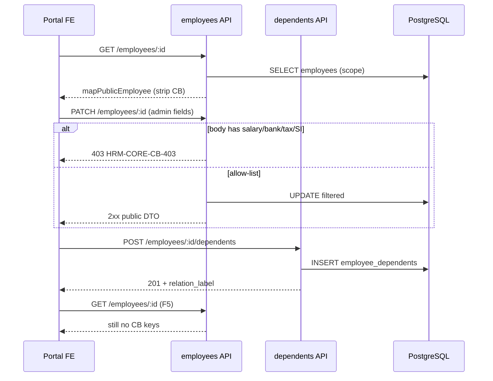

# PO-HRM-MVP-GD1-CORE-01-CLUSTER-API-01 — API F.1 · Public EMP ring + dependents (Option A PHYSICAL)

| Field | Value |
|-------|--------|
| **work_item_id** | `PO-HRM-MVP-GD1-CORE-01-CLUSTER-API-01` |
| **program** | `PO-HRM-MVP-GD1-CONTINUOUS` (**U89** — Wave-10 seat **#12**) |
| **lane** | governance · sa |
| **change_mode** | **UPGRADE** DOC-DELTA residual **F-CORE-EMP-01** · **ADD** residual **F-CORE-DEP-01** · **NO CODE** `apps/**` · **no seed** · **preserve_default** |
| **Date** | 2026-08-09 |
| **Status** | **CONFIRMED** — F.1 physical Option A · unlock **dev-be** + **dev-fe** |
| **uc_ids** | `UC-BP-CORE-01` |
| **depends_on** | DATA-01 **CONFIRMED** · BA-01 O1–O12 **CONFIRMED** · SA-01 Option **A LOCKED** · Wave-9 REC-07 **SEALED** stamp **`REC07QC1-MSL5WXU5`** |
| **ref_data** | [`PO-HRM-MVP-GD1-CORE-01-CLUSTER-DATA-01.md`](./PO-HRM-MVP-GD1-CORE-01-CLUSTER-DATA-01.md) — §4 public allow/deny strip · §5 `employee_dependents` ONE SoT |
| **ref_ba** | [`PO-HRM-MVP-GD1-CORE-01-CLUSTER-BA-01.md`](./PO-HRM-MVP-GD1-CORE-01-CLUSTER-BA-01.md) · AC-CORE-01-* · VAL-CORE-PUB-* · O1–O12 |
| **ref_sa** | [`PO-HRM-MVP-GD1-CORE-01-CLUSTER-SA-01.md`](./PO-HRM-MVP-GD1-CORE-01-CLUSTER-SA-01.md) Option A · F-CORE-EMP-01 UPGRADE · F-CORE-DEP-01 ADD |
| **ref_hire_api** | [`PO-HRM-MVP-GD1-REC-07-CLUSTER-API-01.md`](./PO-HRM-MVP-GD1-REC-07-CLUSTER-API-01.md) **F-REC-HIRE-01** RETAIN SEALED · soft `candidate_id` · **≠** CORE DONE |
| **ref_srs** | `SRS_HRM_ENTERPRISE.md` **FR-UC-BP-CORE-01** Diễn biến **#1–#4** · **BR-BP-SEC-01** · AC-CORE-PUB-01/02 · AC-CORE-CB-MAP-01 |
| **ref_paper_api** | `API_DESIGN_HRM_ENTERPRISE.md` **F-CORE-EMP-01** · **F-CORE-DEP-01** · physical prefer `/employees*` · paper `/core` alias |
| **Honesty** | `recruitment_uat_ready=false` · `jd_dynamic_done=false` · personnel / CORE module UAT **false** · **C-SLICE** · U65 |
| **ba-data** | **ALREADY CONFIRMED** (DATA-01) — this seat **does not** re-open schema invent |
| **ack_status** | **PASS_TO_PM CONFIRMED** |

---

## 1. Verdict — **CONFIRMED**

| Decision | Stamp |
|----------|--------|
| Physical base | Nest `@Controller('employees')` — **`/api/hrm/employees*` ONLY** for EMP public SoT |
| EMP public ring | **UPGRADE F-CORE-EMP-01** on LIVE `GET/POST/PATCH` (+ list) — serializer **public-only** from DATA §4 allow-list |
| CB reject | PATCH/POST body with §4.3 deny keys → **403** **`HRM-CORE-CB-403`** · **silent strip-and-200 = FAIL O3** |
| F5 | After admin save 2xx + reload → GET still omits C&B (**AC-CORE-PUB-02**) |
| Paper path | `GET/PATCH /api/hrm/core/employees/{id}` = **logical alias only** — **DENY** Nest `@Controller('core')` EMP dual SoT |
| Dependents | **ADD F-CORE-DEP-01** — `GET/POST/PATCH/(soft)DELETE /api/hrm/employees/:id/dependents*` on **`public.employee_dependents`** |
| Dep mint | **`HRM-CORE-DEP-VAL-400`** · **`HRM-CORE-DEP-404`** · display-ready **`relation_label`** |
| U19 | list employees **=** get **=** patch public **=** dependents — same `resolveHrmListScope` / `assertResourceInHrmScope` |
| Summary salary | `GET …/employees/summary` salary bands / `avg_salary` / `total_payroll` = **not** public-ring SoT for non-C&B bind — gate or separate C&B summary (**VAL-CORE-PUB-D-06**) |
| Hire / HTP | **RETAIN** F-REC-HIRE-01 · soft `candidate_id` · HTP-05 · APP-02 · CF/status consumers — **DENY** hire = CORE DONE |
| Peers OUT | CORE-02 compensation write · CORE-01a DEC→WH · Nest `/rec` dual · second deps SoT |
| This seat | Docs only — **NO** `apps/**` · **NO** seed · **NO** honesty flip · **NO** reopen sealed J-HRM-REC-07-* |
| Unlock | **dev-be** + **dev-fe** (rule 26 split) after this **CONFIRMED** |

```text
  FE «Hồ sơ vòng công khai» (HCNS non-C&B)
        │  Network assert path contains /employees (not Nest /core SoT)
        ▼
  GET  /api/hrm/employees | /employees/:id
        │  mapPublicEmployee — strip DATA §4.3 · filter custom_fields §4.2
        │
        ├─► PATCH /api/hrm/employees/:id
        │     allow §4.1–4.2 only · deny keys → 403 HRM-CORE-CB-403 · no persist
        │
        ├─► POST /api/hrm/employees  (RETAIN create · same CB deny)
        │
        ├─► GET/POST/PATCH/(soft)DELETE /api/hrm/employees/:id/dependents*
        │     (F-CORE-DEP-01 ADD) · employee_dependents · relation_label
        │     mint DEP-VAL-400 · DEP-404 · soft archived_at
        │
        └─► GET /api/hrm/employees/:id/hire-readiness
              (F-CORE-HTP-05 RETAIN — ≠ public save · ≠ CORE DONE)

  paper /api/hrm/core/employees/{id} = alias only
  F-REC-HIRE-01 accept-offer SEALED ≠ this UC DONE
  CORE-02 / EmployeeSalary / compensation* = OUT this seat
```

**Envelope RETAIN:** `{ code, message, data }` · EMP success **`HRM-EMP-200` / `HRM-EMP-201`** family RETAIN · domain CB **`HRM-CORE-CB-403`** · deps **`HRM-CORE-DEP-*`**.

**Invariant CORE-PUB-PATH (O1):** Public mutate/read Network **MUST** hit `/employees` · Nest dual `/core` EMP controller = **FAIL**.

**Invariant CORE-PUB-STRIP (O2):** Public GET/list DTO ⊆ DATA §4.1 + filtered §4.2 — **no** salary/bank/tax/SI keys · raw `custom_fields` dump = **FAIL**.

**Invariant CORE-PUB-REJECT (O3):** Body with §4.3 deny keys → **403** `HRM-CORE-CB-403` · **no** persist · silent omit-and-200 = **FAIL**.

**Invariant CORE-PUB-F5 (O3):** After PATCH 2xx + F5 → still strip (**AC-CORE-PUB-02**).

**Invariant CORE-DEP-ONE (O5):** ONE `employee_dependents` SoT · **DENY** second table / PAY `dependent_count` as person CRUD.

**Invariant CORE-FAMILY-≠-SALARY (O6):** Presence of dependents **≠** authorize salary view.

**Invariant CORE-≠-HIRE (O7):** REC-07 soft-link **≠** FR-UC-BP-CORE-01 DONE.

**Invariant CORE-S-SCOPE (U19):** list **=** get **=** patch **=** deps.

---

## 2. AS-IS Nest baseline → residual gap

| Surface | LIVE (read-only cite) | Gap vs F.1 residual |
|---------|----------------------|---------------------|
| `GET/POST/PATCH /api/hrm/employees*` | LIVE `@Controller('employees')` · `employees.service.ts` | **RETAIN** SoT · **UPGRADE** public serializer + CB reject |
| `mapEmployee` | Returns top-level public cols **+ raw `custom_fields` dump** (may contain legacy salary/bank/tax/SI) | **UPGRADE** → `mapPublicEmployee` strip §4.3 · filter §4.2 only |
| `GET …/employees/summary` | `EMPLOYEE_SALARY_NUM_SQL` → bands / `avg_salary` / `total_payroll` | **GATE** — not default public-ring SoT for non-C&B bind (VAL-D-06) |
| Nest `/core/employees*` | **ABSENT** as controller SoT | **DENY** invent · paper alias only |
| `…/employees/:id/dependents*` | **ABSENT** | **ADD** F-CORE-DEP-01 + ensureSchema `employee_dependents` per DATA §5 |
| `GET …/hire-readiness` | LIVE HTP-05 | **RETAIN** |
| Soft `employees.candidate_id` | LIVE from REC-07 | **RETAIN** display-ready · no hard FK reopen |
| Accept-offer | SEALED REC-07 | **RETAIN ≠** CORE DONE |
| CF / status consumers | F-EMP-CF-CNS / F-EMP-ST-CNS LIVE | **RETAIN** |
| Source | `employees.controller.ts` · `employees.service.ts` · `employee-summary.ts` | Dev after this CONFIRMED |

**FORBIDDEN invent this seat:** Nest `@Controller('core')` EMP SoT · Nest `/rec` dual · second EMP table · second deps SoT · hard FK hire reopen · CORE-02 compensation write as required · PAY person rewrite · seed · honesty flip · reopen sealed J-07 · claim hire = CORE DONE · apps/**.

---

## 3. Path & alias lock (O1)

| Plane | Path |
|-------|------|
| **PHYSICAL (Nest GĐ1)** | **`/api/hrm/employees`** · **`/api/hrm/employees/:id`** · **`/api/hrm/employees/:id/dependents*`** · peers `…/hire-readiness` · `…/summary` (gated) · document/status/CF catalog peers RETAIN |
| **LOGICAL (paper)** | `GET/PATCH /api/hrm/core/employees/{id}` · `…/core/employees/{id}/dependents*` |
| Rule | Client/docs **may** keep paper names; Dev **implements physical only**. Gateway rewrite optional — **not** unlock-gate. |
| QA Network assert | Path **contains** `/employees` for public mutate — **FAIL O1** if FE mutates Nest `/core/*` as second SoT |

| Paper / logical | Physical | DB |
|-----------------|----------|-----|
| F-CORE-EMP-01 `/core/employees/{id}` | `GET/PATCH /api/hrm/employees/:id` | `public.employees` ONE SoT |
| List public | `GET /api/hrm/employees` | same strip map |
| Create public | `POST /api/hrm/employees` | allow §4 · CB-403 |
| F-CORE-DEP-01 `/core/…/dependents` | `/api/hrm/employees/:id/dependents*` | `public.employee_dependents` |
| Hire readiness | `GET …/hire-readiness` | HTP-05 RETAIN |
| Accept-offer | `/recruitment/…/accept-offer` | F-REC-HIRE-01 RETAIN · ≠ DONE |
| Compensation | peer CORE-02 | **OUT** |

---

## 4. Public serializer + CB deny (DATA §4 — normative)

### 4.1 Public GET/list projection (`mapPublicEmployee`)

| Include | Source |
|---------|--------|
| Top-level | DATA §4.1: `id` · `company_id` (+ display) · `employee_code` · `email` · `full_name` · `job_title_key` + label · `status` + label · `hired_at` · `manager_id` (+ display if available) · `avatar_url` · `candidate_id` (soft display-ready) · `archived_at` · audit timestamps |
| `custom_fields` | **Filtered** to DATA §4.2 ALLOW keys only (+ EFF non-C&B consumer keys) |
| Display-ready | `department` / `phone_number` / `job_title_label` / `status_label` / `company_display_name` — **RETAIN** OS 28 pattern |
| **OMIT always** | DATA §4.3 deny families — even if still stored in legacy CF |

**Rule:** **DENY** return raw `custom_fields: row.custom_fields` without filter.

### 4.2 PATCH/POST body allow + reject

| Body class | Outcome |
|------------|---------|
| §4.1 mutable cols + §4.2 CF keys | Persist (RETAIN validators · CF KEY / STATUS KEY) |
| §4.3 deny key as top-level **or** nested under `custom_fields` | **403** `HRM-CORE-CB-403` · **no** write · VI message |
| Invent CF not in EFF / allow | **400** `HRM-EMP-CUSTOM-FIELD-KEY` RETAIN |
| Invent status | **400** `HRM-EMP-STATUS-KEY` RETAIN |

### 4.3 Summary gate (VAL-CORE-PUB-D-06)

| Surface | Rule |
|---------|------|
| Default public dashboard / non-C&B bind | **MUST NOT** treat salary bands / `avg_salary` / `total_payroll` as public profile SoT |
| Dev options (pick one, document in BE evidence) | (a) omit salary aggregates from default summary for non-C&B roles; **or** (b) separate C&B summary path under CORE-02 peer; **or** (c) require explicit `include=compensation_summary` + C&B permission — **DENY** claim public ring DONE while leaking bands on default public UI |

---

## 5. F.1 API functions (PHYSICAL)

> Mỗi function: **Mục đích** · **Nghiệp vụ xử lý** · **Tham chiếu bước SRS** · Request/Response → DB · Lỗi.

**Prefix:** `/api/hrm/employees`  
**Scope:** list · get · patch · deps = **cùng** `resolveHrmListScope` + `assertResourceInHrmScope` (**U19** · CORE-S-SCOPE).

---

### 5.1 F-CORE-EMP-01 — Public employee get/list/patch (**UPGRADE**)

| | |
|--|--|
| **METHOD / path** | **`GET /api/hrm/employees`** · **`GET /api/hrm/employees/:id`** · **`PATCH /api/hrm/employees/:id`** · **`POST /api/hrm/employees`** (RETAIN create under same ring) |
| **Mục đích** | Đọc/sửa **hồ sơ vòng công khai** (hành chính / liên hệ / checklist) trên LIVE EMP SoT — **không** lộ/sửa lương·NH·MST·BHXH — phục vụ FR-UC-BP-CORE-01 Diễn biến **#1–#4** · **BR-BP-SEC-01** · AC-CORE-PUB-01/02. |
| **Nghiệp vụ xử lý** | **GET list/get:** (1) JWT + scope → `resolveHrmListScope`; load emp in-scope else **404/409**. (2) Project via **`mapPublicEmployee`** — include §4.1 + filtered §4.2 only · **omit** §4.3 even if legacy CF has salary/bank/tax/SI. (3) Display-ready labels RETAIN. (4) Soft `candidate_id` optional display — **no** hard FK. **PATCH/POST:** (5) Sanitize body — any §4.3 deny key (top-level or `custom_fields`) ⇒ **403** `HRM-CORE-CB-403` · **abort** · **no** silent strip. (6) Persist only allow keys · RETAIN CF consumer assert · status catalog assert. (7) Soft-delete / restore peers **RETAIN** doctrine. (8) **cấm** Nest `/core` dual EMP · CORE-02 write via this path · seed. |
| **Tham chiếu bước SRS** | **FR-UC-BP-CORE-01** Diễn biến **#1–#4** · **BR-BP-SEC-01** · AC-CORE-01-01..05 · AC-CORE-PUB-01/02 · AC-CORE-CB-MAP-01 (FE) · O1–O4 · O7 · O11 · DATA DV-CORE-PUB-01..03 · VAL-CORE-PUB-D-01..06 |
| **Request (PATCH)** | Allow: `full_name` · `employee_code` · `email` · `job_title_key` · `status` · `hired_at` · `manager_id` · `avatar_url` · `custom_fields` ⊆ §4.2 · optional status reason peers — **DENY** salary/bank/tax/SI families |
| **Request → DB** | `public.employees` cols + filtered `custom_fields` JSONB |
| **Response** | Public DTO §6.1 · success codes RETAIN `HRM-EMP-*` family |
| **Lỗi** | `HRM-CORE-CB-403` · `HRM-CORE-PUB-VAL-400` (optional) · `HRM-EMP-CUSTOM-FIELD-KEY` · `HRM-EMP-STATUS-KEY` · `HRM-SCOPE-409` / 404 |

**Paper alias (optional mount):** same handler as physical — **not** second service/table.

---

### 5.2 F-CORE-DEP-01 — Employee dependents CRUD (**ADD**)

| | |
|--|--|
| **METHOD / path** | **`GET /api/hrm/employees/:employeeId/dependents`** · **`POST /api/hrm/employees/:employeeId/dependents`** · **`GET /api/hrm/employees/:employeeId/dependents/:dependentId`** · **`PATCH /api/hrm/employees/:employeeId/dependents/:dependentId`** · **`(soft)DELETE /api/hrm/employees/:employeeId/dependents/:dependentId`** |
| **Mục đích** | Quản lý **người phụ thuộc** (họ tên · quan hệ · ngày sinh) phục vụ phúc lợi / quà 1/6 trên ONE SoT — **không** mở vòng C&B — FR-UC-BP-CORE-01 #3–#4 special · O5/O6. |
| **Nghiệp vụ xử lý** | (1) Resolve parent emp `:employeeId` in-scope — else **404/409**. (2) ensureSchema **ADD** `public.employee_dependents` per DATA §5 (Dev). (3) **GET list:** default `archived_at IS NULL` · optional `include_archived` audit · same company_id as parent. (4) **POST:** require `full_name` + `relation_code` + `date_of_birth` (welfare create — missing ⇒ **400** `HRM-CORE-DEP-VAL-400`) · set `company_id` = parent emp company (normalized) · `is_tax_dependent` default false · **DENY** employee salary/MST in payload. (5) **PATCH:** name/relation/DOB/flag/effective_* · archived row → **404** `HRM-CORE-DEP-404` unless restore peer defined. (6) **DELETE:** soft-set `archived_at` — **DENY** hard-delete as sole product path. (7) Response **display-ready** `relation_label` from BE map (open codes — **FORBIDDEN** closed product ceiling). (8) U19: dep out of parent scope ⇒ 404/409. (9) **cấm** second deps table · PAY `dependent_count` rewrite · Nest `/core` dual. |
| **Tham chiếu bước SRS** | FR-UC-BP-CORE-01 Diễn biến **#3–#4** · welfare / quà 1/6 · AC-CORE-01-06/07 · ALT-02/03 · EX-03 · O5/O6/O11 · DATA §5 · DV-CORE-DEP-01..05 · VAL-CORE-DEP-D-01..07 |
| **Request (POST)** | `{ full_name: string, relation_code: string, date_of_birth: string (ISO date), is_tax_dependent?: boolean, effective_from?: string, effective_to?: string }` |
| **Request → DB** | INSERT/UPDATE `employee_dependents` · soft FK `employee_id` → `employees.id` (app assert · no CASCADE sole) |
| **Response** | Dep DTO §6.2 · create **201** · update **200** · soft-delete **200** |
| **Lỗi** | **`HRM-CORE-DEP-VAL-400`** · **`HRM-CORE-DEP-404`** · scope 404/409 · **DENY** CB leak via deps |

**Soft DELETE semantics:** Prefer `DELETE` verb that sets `archived_at` **or** `POST …/archive` — product path = soft; hard SQL DELETE not sole SoT.

---

### 5.3 F-CORE-HTP-05 — Hire readiness (**RETAIN**)

| | |
|--|--|
| **METHOD / path** | **`GET /api/hrm/employees/:id/hire-readiness`** |
| **Mục đích** | Đọc blockers sẵn sàng onboard/HĐ — handoff sau REC-07 · **≠** public admin save · **≠** CORE-01 DONE. |
| **Nghiệp vụ** | **RETAIN** LIVE · U19 same scope · codes `HRM-HTP-*` RETAIN |
| **Tham chiếu** | AC-HTP-05 · O7/O9 · BA ALT-05 |

---

### 5.4 F-REC-HIRE-01 — Accept offer (**RETAIN SEALED**)

| | |
|--|--|
| **METHOD / path** | **`POST /api/hrm/recruitment/applications/:id/accept-offer`** |
| **Rule** | **RETAIN** Wave-9 · soft `candidate_id` · APP-02 after · **DENY** redefine · **DENY** claim = UC-BP-CORE-01 DONE · **DENY** reopen J-HRM-REC-07-* without regression |

---

### 5.5 Peers RETAIN (non-mutating this seat)

| Peer | Path / capability | Rule |
|------|-------------------|------|
| Status / CF consumers | `employment-statuses*` · custom field EFF assert | **RETAIN** |
| Document types | `document-types*` | **RETAIN** · CORE-03 deep OUT |
| Soft archive/restore emp | existing archive routes | **RETAIN** |
| Summary | `GET …/summary` | **GATE** §4.3 — not public C&B SoT |

---

## 6. Display-ready DTO

### 6.1 Public employee DTO

| Field | Notes |
|-------|--------|
| `id`, `company_id`, `company_display_name`, `company_uuid?` | Scope display |
| `employee_code`, `email`, `full_name`, `display_name` | Public |
| `job_title_key`, `job_title_label` | Display-ready |
| `department`, `phone_number` | From filtered CF / display builder |
| `manager_id`, `manager_display_name?` | Allow |
| `status`, `status_label` | Open catalog consumer |
| `hired_at`, `avatar_url`, `pending_docs?` / lifecycle chip | Allow · hire handoff |
| `candidate_id` | Soft · optional audit display |
| `custom_fields` | **Filtered** §4.2 only |
| `archived_at`, `created_at`, `updated_at` | Soft-delete / audit |
| **FORBIDDEN on public** | `salary` · `base_salary` · `bank_*` · `tax_code`/`tax_id`/`mst` · `social_insurance_*` / `bhxh_*` · raw unfiltered CF |

### 6.2 Dependent DTO

| Field | Notes |
|-------|--------|
| `id`, `employee_id`, `company_id` | Scope |
| `full_name` | Required |
| `relation_code`, **`relation_label`** | BE label map — **cấm** FE invent SoT |
| `date_of_birth` | ISO in API · UX `dd/MM/yyyy` |
| `is_tax_dependent` | Boundary flag only · **no** GTCG mutate SoT |
| `effective_from`, `effective_to` | Optional |
| `archived_at`, audit | Soft-delete |
| **FORBIDDEN** | Employee salary/MST/bank via deps payload |

---

## 7. Error taxonomy (mint / RETAIN)

| Code | HTTP | When | ≠ |
|------|------|------|---|
| **`HRM-CORE-CB-403`** | **403** | Public PATCH/POST contains §4.3 deny keys | Scope 409 · VAL 400 |
| `HRM-CORE-PUB-VAL-400` | 400 | Public field format/required fail (optional mint) | CB-403 |
| **`HRM-CORE-DEP-VAL-400`** | **400** | Dep missing name/relation/DOB (required) | CB-403 |
| **`HRM-CORE-DEP-404`** | **404** | Dep not found / wrong emp / soft-archived | Scope |
| `HRM-EMP-CUSTOM-FIELD-KEY` | 400 | Invent CF | **RETAIN** |
| `HRM-EMP-STATUS-KEY` | 400 | Invent status | **RETAIN** |
| `HRM-SCOPE-409` / 404 | 409/404 | Out of scope list/get/patch/deps | CB-403 |
| `HRM-HTP-*` | ready=false / 4xx | Hire readiness | **RETAIN** · ≠ public save |
| `HRM-REC-HIRE-*` / `HRM-REC-PAY-403` | — | Hire peer | **RETAIN** · ≠ this seat |

**VI message (CB-403):** rõ ràng — không được gửi/sửa field mật (lương / tài khoản NH / MST / BHXH) trên hồ sơ công khai.

---

## 8. U19 scope_parity

| Surface | Resolver |
|---------|----------|
| `GET /employees` list | `resolveHrmListScope` |
| `GET /employees/:id` | same + `assertResourceInHrmScope` |
| `PATCH /employees/:id` | same |
| `…/dependents*` | Parent emp in scope ⇒ deps; `company_id` = parent |
| `GET …/hire-readiness` | same |

**Flag `scope_parity`:** list returns id but get/patch/deps **404** under group CEO `main` = **defect** (U19).



---

## 9. Traceability (BA / DATA → API → FE → Test)

| Requirement | API function | FE / Journey | Test expect |
|-------------|--------------|--------------|-------------|
| FR #1–#2 · O1/O2 | F-CORE-EMP-01 GET | **J-HRM-CORE-01-01** | Public-only DTO · path `/employees` |
| FR #2–#3 · O3 | F-CORE-EMP-01 PATCH | **J-HRM-CORE-01-02** | Admin save 2xx · F5 no leak |
| O3 · AC-PUB-01 | CB-403 | **J-HRM-CORE-01-04** | Forced C&B body → 403 |
| O4 · CB-MAP-01 | same path · FE hide/redirect | J-01-04 | No same-form salary |
| O5 welfare | F-CORE-DEP-01 | **J-HRM-CORE-01-03** | POST deps 2xx · F5 · DOB |
| O6 tax flag | dep DTO limited | ALT-03 | No MST/salary leak |
| O7 hire ≠ DONE | HTP + hire RETAIN | J-01-04 handoff | No claim CORE DONE |
| U19 | CORE-S-SCOPE | Group CEO | list=get=patch=deps |
| DATA §4–§5 | serializer + deps table | — | Strip map · ONE deps SoT |

**ba-data:** ALREADY CONFIRMED — Dev implements ensureSchema from DATA §5 · **no** re-invent columns.

---

## 10. DENY / must_keep footer

| Class | Items |
|-------|--------|
| **must_keep** | LIVE `public.employees` · soft `candidate_id` · REC-07 stamp **`REC07QC1-MSL5WXU5`** · F-REC-HIRE-01 · HTP-05 · APP-02 · open status / CF **consumer** · soft-delete · U19 · G-DB-02 no hard FK hire · W1–W9 REC seals |
| **DENY** | Nest `/core` dual EMP · Nest `/rec` dual · second EMP table · second deps SoT · hard FK hire reopen · CORE-02 cols as public SoT / required this GWC · PAY `dependent_count` as person CRUD · claim hire = CORE-01 DONE · seed · honesty flip · reopen sealed J-HRM-REC-07-01..04 without regression · apps/** this seat · silent CB strip-and-200 |
| **OUT** | UC-BP-CORE-02 compensation write · UC-BP-CORE-01a DEC→WH · CORE-03/09/10 invent |
| **Honesty** | `recruitment_uat_ready=false` · `jd_dynamic_done=false` · CORE/personnel UAT **false** · **C-SLICE** |

---

## 11. Dev unlock packet

### 11.1 Dev-BE (`PO-HRM-MVP-GD1-CORE-01-CLUSTER-BE-01`)

1. **UPGRADE** `mapEmployee` → public strip map (DATA §4) on list/get/patch/create responses — **no** raw CF dump of deny keys.
2. **ADD** PATCH/POST CB deny-list → **403** `HRM-CORE-CB-403` (top-level + nested CF) · jest silent-strip FAIL case.
3. **ADD** ensureSchema `public.employee_dependents` per DATA §5 · indexes soft-active.
4. **ADD** Nest routes `…/employees/:id/dependents*` GET/POST/PATCH/soft-DELETE · mint `HRM-CORE-DEP-VAL-400` · `HRM-CORE-DEP-404` · `relation_label`.
5. **GATE** summary salary bands for public/non-C&B bind (VAL-D-06) — document choice in evidence.
6. U19 jest: list=get=patch=deps · cross-CT 409 · F5 strip · CB-403 · DEP-VAL · soft-delete hide.
7. **RETAIN** HTP-05 · hire soft-link · CF/status consumers · **DENY** Nest `/core` dual · Nest `/rec` dual · second deps · CORE-02 write · seed · honesty · reopen J-07.

### 11.2 Dev-FE (`PO-HRM-MVP-GD1-CORE-01-CLUSTER-FE-01`)

1. Public profile bind **only** public DTO fields · Network **`/api/hrm/employees*`** — **no** Nest `/core` SoT.
2. Hide/redirect C&B blocks (AC-CORE-CB-MAP-01) — **DENY** same-form admin+salary mutate.
3. Dependents UI → `…/dependents*` · display `relation_label` · DOB `dd/MM/yyyy` · F5 row remains.
4. Toast/map `HRM-CORE-CB-403` · `HRM-CORE-DEP-*` VI · **no** FE invent salary aggregate · **no** seed · **no** claim hire = CORE DONE.

---

## 12. Validation plan (QA after Dev)

| Gate | PASS when |
|------|-----------|
| L0/L1 | Stack + GET public strip · PATCH CB-403 · deps CRUD mint codes |
| L2.5 | **J-HRM-CORE-01-01..04** browser U65 — no seed |
| Network | Path `/employees` · F5 no C&B · deps POST 2xx |
| Honesty | Flags remain false · C-SLICE · **DENY** reopen J-07 rewrite · hire ≠ CORE DONE |

---

## 13. Exit / handoff

| Field | Value |
|-------|--------|
| **ack_status** | **PASS_TO_PM** · API **CONFIRMED** |
| **next_owner** | **pm** → unlock **dev-be** + **dev-fe** |
| **evidence_path** | `docs/qa/evidence/po-hrm-mvp-gd1-core-01-cluster-api-01.md` |
| **Unlocks** | Execution residual public serializer + CB-403 + dependents ADD |
| **Does not unlock** | Honesty flips · CORE-02 write · Nest `/core` dual · module CORE/REC UAT · reopen sealed J-07 · claim hire = CORE DONE |

### next_dispatch_prompt (copy-ready)

```text
work_item_id: PO-HRM-MVP-GD1-CORE-01-CLUSTER-BE-01
lane: execution · dev-be
program: PO-HRM-MVP-GD1-CONTINUOUS (U89)
uc_ids: UC-BP-CORE-01
depends_on: API-01 CONFIRMED — docs/program/specs/PO-HRM-MVP-GD1-CORE-01-CLUSTER-API-01.md · DATA-01 · BA-01 O1–O12 · SA Option A
entry_criteria: F.1 CONFIRMED; honesty false; C-SLICE; U65; cấm Nest /core dual EMP · Nest /rec dual · second deps SoT · CORE-02 write · hire=CORE DONE · seed · honesty flip · reopen sealed J-07
MISSION: Implement physical Nest /api/hrm/employees* — UPGRADE F-CORE-EMP-01 public-only serializer (DATA §4 allow-list + strip §4.3); PATCH/POST CB deny-list → 403 HRM-CORE-CB-403 (no silent strip); ADD F-CORE-DEP-01 GET/POST/PATCH/soft-DELETE /employees/:id/dependents* on employee_dependents (DATA §5); mint HRM-CORE-DEP-VAL-400 / DEP-404; display-ready relation_label; gate summary salary for non-C&B; U19 list=get=patch=deps; RETAIN HTP-05 · F-REC-HIRE-01 · soft candidate_id · CF/status consumers; ensureSchema; jest. Parallel FE-01.
exit: docs/qa/evidence/po-hrm-mvp-gd1-core-01-cluster-be-01.md · READY_FOR_QA
cấm: Nest /core dual · Nest /rec dual · second EMP/deps SoT · hard FK hire · CORE-02 write · claim hire=CORE DONE · seed · honesty flip · reopen sealed J-07 · silent CB strip-and-200
```

Parallel FE:

```text
work_item_id: PO-HRM-MVP-GD1-CORE-01-CLUSTER-FE-01
lane: execution · dev-fe
program: PO-HRM-MVP-GD1-CONTINUOUS (U89)
uc_ids: UC-BP-CORE-01
depends_on: API-01 CONFIRMED · BE-01 in parallel OK for UI bind stubs
MISSION: Bind hồ sơ vòng công khai → GET/PATCH /api/hrm/employees/:id only (public fields); hide/redirect C&B (AC-CORE-CB-MAP-01); dependents UI → /employees/:id/dependents*; relation_label + DOB dd/MM/yyyy; toast CB-403 / DEP-*; F5 no C&B leak; DENY Nest /core SoT · same-form salary · FE invent salary aggregate · hire=CORE DONE · seed · honesty.
exit: docs/qa/evidence/po-hrm-mvp-gd1-core-01-cluster-fe-01.md · READY_FOR_QA
```

---

## completion_report

- **Closed:** F.1 physical Option A **CONFIRMED** — **UPGRADE F-CORE-EMP-01** on LIVE `/api/hrm/employees*` (public-only serializer from DATA §4 · CB deny-list → **`HRM-CORE-CB-403`** · F5 no leak · paper `/core` alias only) · **ADD F-CORE-DEP-01** `…/dependents*` on **`employee_dependents`** (mint **`HRM-CORE-DEP-VAL-400` / `DEP-404`** · **`relation_label`** · U19) · **RETAIN** HTP-05 · F-REC-HIRE-01 · soft `candidate_id` · CF/status · **DENY** Nest `/core` dual · Nest `/rec` dual · second deps · CORE-02 write · hire=CORE DONE · seed · honesty · apps/** · ba-data already CONFIRMED.
- **Residual:** Dev-BE/FE implement · QA U65 J-HRM-CORE-01-01..04 · QC GWC C-SLICE.
- **O1/path:** Physical `/employees*` only · paper `/core/employees*` = alias.
