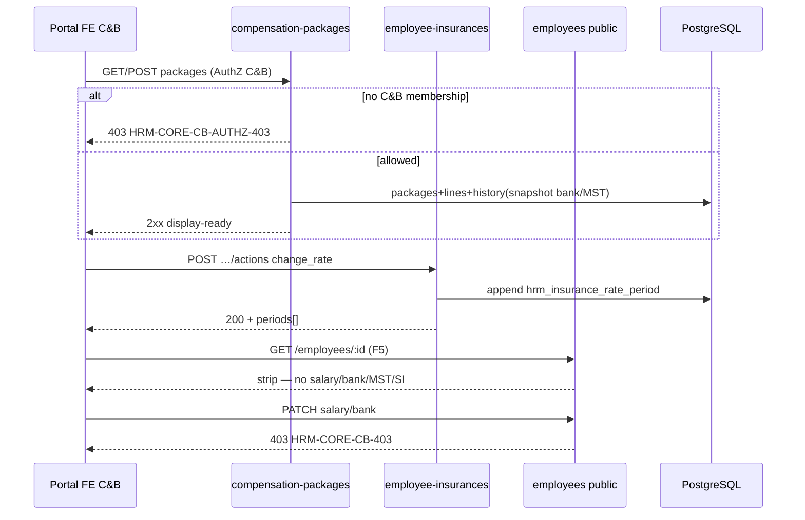

# PO-HRM-MVP-GD1-CORE-02-CLUSTER-API-01 — API F.1 · C&B packages + SI residual (Option A PHYSICAL)

| Field | Value |
|-------|--------|
| **work_item_id** | `PO-HRM-MVP-GD1-CORE-02-CLUSTER-API-01` |
| **program** | `PO-HRM-MVP-GD1-CONTINUOUS` (**U89** — Wave-11 seat **#13**) |
| **lane** | governance · sa |
| **change_mode** | **UPGRADE** DOC-DELTA residual **F-CORE-EMP-02** · **RETAIN** **F-CORE-SI-*** + **F-CORE-SI-RATE** · **RETAIN** **F-CORE-EMP-01** / **F-CORE-DEP-01** · **NO CODE** `apps/**` · **no seed** · **preserve_default** |
| **Date** | 2026-08-09 |
| **Status** | **CONFIRMED** — F.1 physical Option A · unlock **dev-be** + **dev-fe** |
| **uc_ids** | `UC-BP-CORE-02` |
| **depends_on** | DATA-01 **CONFIRMED** · BA-01 O1–O12 **CONFIRMED** · SA-01 Option **A LOCKED** · Wave-10 CORE-01 **SEALED** stamp **`CORE01QC1-MSL6WMS7`** |
| **ref_data** | [`PO-HRM-MVP-GD1-CORE-02-CLUSTER-DATA-01.md`](./PO-HRM-MVP-GD1-CORE-02-CLUSTER-DATA-01.md) — §4 bank/MST header ADD · §5 SI period RETAIN · public strip RETAIN |
| **ref_ba** | [`PO-HRM-MVP-GD1-CORE-02-CLUSTER-BA-01.md`](./PO-HRM-MVP-GD1-CORE-02-CLUSTER-BA-01.md) · AC-CORE-CB-01/02 · AC-CORE-02-* · VAL-CORE-CB-* · O1–O12 |
| **ref_sa** | [`PO-HRM-MVP-GD1-CORE-02-CLUSTER-SA-01.md`](./PO-HRM-MVP-GD1-CORE-02-CLUSTER-SA-01.md) Option A · F-CORE-EMP-02 UPGRADE · SI RETAIN |
| **ref_core01_api** | [`PO-HRM-MVP-GD1-CORE-01-CLUSTER-API-01.md`](./PO-HRM-MVP-GD1-CORE-01-CLUSTER-API-01.md) — public ring + CB-403 + deps **SEALED must_keep** · **≠** C&B DONE |
| **ref_srs** | `SRS_HRM_ENTERPRISE.md` **FR-UC-BP-CORE-02** Diễn biến **#1–#4** · **BR-BP-SEC-02** · **AC-CORE-CB-01/02** |
| **ref_paper_api** | `API_DESIGN_HRM_ENTERPRISE.md` **F-CORE-EMP-02** · **F-CORE-SI-*** · **F-CORE-SI-RATE** · physical prefer packages* · paper `/core/…/compensation` alias |
| **Honesty** | `recruitment_uat_ready=false` · `jd_dynamic_done=false` · personnel / CORE module UAT **false** · **C-SLICE** · U65 · **DENY** claim CORE-01 public = C&B DONE |
| **ba-data** | **ALREADY CONFIRMED** (DATA-01) — this seat **does not** re-open schema invent |
| **ack_status** | **PASS_TO_PM CONFIRMED** |
| **artifact_size** | SPEC_LEN=31296 · EVID_LEN=7591 (NFD path) |

---

## 1. Verdict — **CONFIRMED**

| Decision | Stamp |
|----------|--------|
| Physical C&B salary/PC | Nest `@Controller('contracts-insurance')` — **`/api/hrm/contracts-insurance/compensation-packages*`** (+ revise / active / history) **ONLY** SoT |
| Physical SI | Nest `@Controller('employee-insurances')` — **`/api/hrm/employee-insurances*`** (+ `…/:id/actions`) **ONLY** enrollment SoT |
| F-CORE-EMP-02 | **UPGRADE residual** — AuthZ C&B + access audit · **ADD** `bank_account` / `bank_name` / `tax_id` (+ optional `bank_branch`) on create/revise DTO ↔ DATA §4 header · history **snapshot MUST include bank/MST** |
| Paper path | `GET/PATCH /api/hrm/core/employees/{id}/compensation` = **logical alias only** — **DENY** Nest `@Controller('core')` compensation dual SoT |
| Thin facade | Optional `/api/hrm/employees/:id/compensation*` **MUST** same packages SoT (same service) — **FAIL** if second write path |
| SI rate | **RETAIN** LIVE `hrm_insurance_rate_period` append via `POST …/actions` `change_rate` — **DENY** second period table |
| SI PATCH residual | PATCH body with `contribution` / `employer_contribution` change → **fail-closed prefer** **400** (mint `HRM-CORE-CB-VAL-400` or RETAIN `HRM-SI-ACTION-400` family) redirect to `…/actions` `change_rate` — **DENY** silent period wipe |
| Public CB | **RETAIN** **`HRM-CORE-CB-403`** on `/employees*` — **≠** C&B AuthZ deny |
| AuthZ mint | **`HRM-CORE-CB-AUTHZ-403`** when open/mutate packages without C&B membership |
| Overlap | **RETAIN** LIVE **`HRM-COMP-409-OVERLAP`** · optional **1:1 alias** **`HRM-CORE-CB-OVERLAP-409`** (same semantics) |
| VAL | **Mint** **`HRM-CORE-CB-VAL-400`** for missing `effective_from` / invalid amount / bank format peer |
| U19 | list packages **=** get **=** revise **=** active/history **=** employee-insurances list/get/actions — same `resolveHrmListScope` |
| Display-ready | Amounts (number + display string vi-VN optional) · dates ISO in API · UX `dd/MM/yyyy` · labels from BE |
| CORE-01 / DEP | **RETAIN** F-CORE-EMP-01 · F-CORE-DEP-01 · stamp **`CORE01QC1-MSL6WMS7`** · J-HRM-CORE-01-* — **≠** C&B DONE |
| Peers OUT | CORE-02b metadata · CORE-01a · CORE-09/10 invent · PAY process / payslip run |
| This seat | Docs only — **NO** `apps/**` · **NO** seed · **NO** honesty flip · **NO** reopen J-HRM-CORE-01-* |
| Unlock | **dev-be** + **dev-fe** (rule 26 split) after this **CONFIRMED** |

```text
  FE «Vòng mật C&B» (view_salary / HĐ–BH)
        │  Network assert path contains /contracts-insurance/compensation-packages
        │  OR /employee-insurances — NOT Nest /core SoT
        ▼
  GET/POST /api/hrm/contracts-insurance/compensation-packages*
        │  AuthZ C&B · access audit · bank/MST on DTO ↔ header
        │  create → package+lines+history(snapshot w/ bank/MST)
        │  revise → close prior · version++ · history ≥2
        │  active / history / get-by-id
        │
        ├─► optional thin GET/PATCH /employees/:id/compensation*
        │     MUST delegate same EmployeeCompensationService
        │
        ├─► GET/POST/PATCH /api/hrm/employee-insurances*
        │     + POST …/:id/actions (change_rate|suspend|stop|close|resume)
        │     period append RETAIN · PATCH contribution fail-closed prefer
        │
        └─► Public GET /employees/:id (CORE-01 SEALED)
              still strip salary/bank/MST/SI · F5 AC-CORE-CB-02
              public PATCH C&B keys → HRM-CORE-CB-403 RETAIN

  paper /api/hrm/core/employees/{id}/compensation = alias only
  CORE-01 public GWC ≠ FR-UC-BP-CORE-02 DONE
```

**Envelope RETAIN:** `{ code, message, data }` · COMP success **`HRM-COMP-200` / `HRM-COMP-201`** · EINS **`HRM-EINS-200` / `HRM-EINS-201`** · domain **`HRM-CORE-CB-*`** · SI action **`HRM-SI-ACTION-400`** RETAIN.

**Invariant CORE-CB-PATH (O1):** C&B mutate Network **MUST** hit packages and/or employee-insurances · Nest dual `/core` compensation = **FAIL**.

**Invariant CORE-CB-BANK-MST (O6):** Persist bank/MST **only** on package header via C&B DTO — **DENY** public CF SoT.

**Invariant CORE-CB-HISTORY:** create/revise history `snapshot` **MUST** include `bank_account` · `bank_name` · `tax_id` · `bank_branch?` + lines + effective/currency.

**Invariant CORE-CB-AUTHZ (O4):** Open/mutate packages without C&B membership → **403** `HRM-CORE-CB-AUTHZ-403` · access audit on open+mutate (BR-BP-SEC-02).

**Invariant CORE-CB-PUBLIC (O3 / AC-CORE-CB-02):** After C&B save 2xx + F5 → public GET still **no** salary/NH/MST/SI detail · public body C&B → **`HRM-CORE-CB-403`**.

**Invariant CORE-SI-RATE-APPEND:** Rate/amount history = append period via actions — **FORBIDDEN** UPDATE closed period as SoT.

**Invariant CORE-SI-PATCH-FAILCLOSED:** PATCH enrollment with contribution delta → **400** prefer (redirect to `change_rate`) — denorm-only without period **FORBIDDEN** as product rate-change path.

**Invariant CORE-≠-PUB-DONE (O9):** CORE-01 GWC **≠** FR-UC-BP-CORE-02 DONE.

**Invariant CORE-S-SCOPE (U19):** list packages **=** get/revise/history/active **=** SI family.

---

## 2. AS-IS Nest baseline → residual gap

| Surface | LIVE (read-only cite) | Gap vs F.1 residual |
|---------|----------------------|---------------------|
| `POST/GET …/contracts-insurance/compensation-packages*` | LIVE `EmployeeCompensationService` · create/list/get/active/revise · history via `GET …/compensation-history` | **RETAIN** SoT · **UPGRADE** AuthZ C&B + audit · bank/MST DTO |
| Create/Revise DTO | `CreateCompensationPackageDto` / `ReviseCompensationPackageDto` — **no** bank/tax fields | **ADD** `bank_account` · `bank_name` · `tax_id` · optional `bank_branch` |
| History snapshot | JSONB: `effective_*` · `currency` · `lines[]` — **no** bank/MST | **UPGRADE** include bank/MST on write |
| Overlap | **`HRM-COMP-409-OVERLAP`** LIVE | **RETAIN** · optional alias `HRM-CORE-CB-OVERLAP-409` |
| AuthZ C&B | Internal auth + scope only — **no** membership `view_salary` / C&B gate | **ADD** AuthZ + access audit residual |
| Nest `/core/…/compensation` | **ABSENT** as controller SoT | **DENY** invent · paper alias only |
| Thin `/employees/:id/compensation*` | **ABSENT** | Optional ADD — **MUST** same packages service |
| `GET/POST/PATCH …/employee-insurances*` | LIVE enrollment + soft-delete | **RETAIN** |
| `POST …/:id/actions` | LIVE `change_rate` / suspend / stop / close / resume · period append | **RETAIN** F-CORE-SI-RATE |
| `PATCH …/:id` contribution | May denorm `contribution*` **without** period append | **Harden fail-closed prefer** |
| Public EMP | SEALED CORE-01 strip + **`HRM-CORE-CB-403`** | **RETAIN must_keep** · **≠** C&B DONE |
| Dependents | ONE SoT SEALED | **RETAIN** GTCG consumer |
| Source | `contracts-insurance.controller.ts` · `employee-compensation.service.ts` · `employee-insurances.*` · CORE-01 public ring | Dev after this CONFIRMED |

**FORBIDDEN invent this seat:** Nest `@Controller('core')` compensation/EMP SoT · second packages table · second deps · second rate period · bank/MST on public employees · write C&B onto public · claim CORE-01 = C&B DONE · reopen J-CORE-01 · seed · honesty flip · apps/** · CORE-02b/PAY invent.

---

## 3. Path & alias lock (O1)

| Plane | Path |
|-------|------|
| **PHYSICAL (Nest GĐ1)** | **`/api/hrm/contracts-insurance/compensation-packages`** · **`…/compensation-packages/active`** · **`…/compensation-packages/:packageId`** · **`…/compensation-packages/:packageId/revise`** · **`…/compensation-history`** · **`/api/hrm/employee-insurances*`** · **`…/:insuranceId/actions`** |
| **LOGICAL (paper)** | `GET/PATCH /api/hrm/core/employees/{id}/compensation` · paper SI enrollment peers |
| **Optional thin** | `GET/PATCH /api/hrm/employees/:id/compensation*` — **same** `EmployeeCompensationService` only |
| Rule | Client/docs **may** keep paper names; Dev **implements physical only**. Gateway rewrite optional — **not** unlock-gate. |
| QA Network assert | Path **contains** `/contracts-insurance/compensation-packages` **or** `/employee-insurances` for C&B mutate — **FAIL O1** if FE mutates Nest `/core/*` as second SoT |

| Paper / logical | Physical | DB |
|-----------------|----------|-----|
| F-CORE-EMP-02 `/core/…/compensation` | packages* + revise/history/active | `employee_compensation_packages\|lines\|history` |
| Bank/MST | same create/revise body | header cols DATA §4 |
| F-CORE-SI-* | `/employee-insurances*` | `employee_insurances` |
| F-CORE-SI-RATE | `POST …/actions` `change_rate` | `hrm_insurance_rate_period` |
| F-CORE-EMP-01 public | `/employees*` | CORE-01 SEALED |
| F-CORE-DEP-01 | `/employees/:id/dependents*` | ONE deps · GTCG consumer |

---

## 4. Bank / MST + history (DATA §4 — normative)

### 4.1 DTO ADD (create + revise)

| Field | Type | Null | Rule |
|-------|------|------|------|
| **`bank_account`** | string | YES | Persist header · AuthZ full · mask last-4 for view-only |
| **`bank_name`** | string | YES | Persist header |
| **`bank_branch`** | string | YES | Optional · nullable |
| **`tax_id`** | string | YES | MST cá nhân · AuthZ full · mask view-only |

**Revise copy-forward:** If revise omits bank/MST keys → **copy prior** header values onto new version (DATA §4.2) unless payload overrides.

**Same-version bank-only PATCH (optional):** If Dev adds `PATCH …/compensation-packages/:id` for bank/MST without salary revise — **MUST** append history audit row **or** still revise version; **DENY** silent unpaid overwrite of locked paid period → **409**.

### 4.2 History snapshot MUST include

```json
{
  "effective_from": "…",
  "effective_to": null,
  "currency": "VND",
  "bank_account": "…",
  "bank_name": "…",
  "bank_branch": null,
  "tax_id": "…",
  "lines": [ { "line_type": "base", "amount": 0, "…": "…" } ]
}
```

Missing bank/MST keys on create/revise snapshot after Wave-11 = **FAIL** DV-CORE-CB-03 / VAL residual.

### 4.3 Public boundary (RETAIN)

Public GET omit bank/MST · public PATCH with these keys → **`HRM-CORE-CB-403`** — **no** rewrite sealed CORE-01 semantics.

---

## 5. F.1 API functions (PHYSICAL)

> Mỗi function: **Mục đích** · **Nghiệp vụ xử lý** · **Tham chiếu bước SRS** · Request/Response → DB · Lỗi.

**Scope:** packages list/get/revise/active/history **=** SI list/get/actions — **cùng** `resolveHrmListScope` + `assertResourceInHrmScope` (**U19**).

---

### 5.1 F-CORE-EMP-02 — Compensation packages (**UPGRADE**)

| | |
|--|--|
| **METHOD / path** | **`POST /api/hrm/contracts-insurance/compensation-packages`** · **`GET …/compensation-packages`** · **`GET …/compensation-packages/active`** · **`GET …/compensation-packages/:packageId`** · **`POST …/compensation-packages/:packageId/revise`** · **`GET …/compensation-history`** |
| **Mục đích** | Mở/đọc/tạo/sửa **vòng mật C&B** (lương CB · PC · NH · MST) theo **ngày hiệu lực** trên LIVE packages SoT — **không** lộ qua public EMP — phục vụ FR-UC-BP-CORE-02 Diễn biến **#1–#4** · **BR-BP-SEC-02** · **AC-CORE-CB-01/02**. |
| **Nghiệp vụ xử lý** | **AuthZ (O4):** (1) JWT + scope → resolve list/resource. (2) Membership C&B / `view_salary` (or peer permission SoT) **required** to open GET mật or mutate — else **403** **`HRM-CORE-CB-AUTHZ-403`**. (3) **Access audit** residual on open + mutate (BR-BP-SEC-02) — L1 or audit store assert. **Create:** (4) Validate `effective_from` required · lines ≥1 · amount ≥0 · allowance `component_code` CNS when EFF>0 (`HRM-SC-COMP-KEY` RETAIN). (5) Persist header **including** bank/MST ADD · lines · append history snapshot **with bank/MST**. (6) Overlap open segments → **409** `HRM-COMP-409-OVERLAP` (RETAIN) / alias `HRM-CORE-CB-OVERLAP-409`. **Revise:** (7) Close prior `effective_to` day-before new `effective_from` · version++ · copy-forward bank/MST unless override · history ≥2. (8) Display-ready amounts/dates/labels on response (O11). (9) **cấm** Nest `/core` dual · second packages SoT · public write · seed. |
| **Tham chiếu bước SRS** | **FR-UC-BP-CORE-02** Diễn biến **#1–#4** · **BR-BP-SEC-02** · AC-CORE-CB-01/02 · AC-CORE-02-01..06/09/10 · O1–O6 · O9 · O11 · DATA §4 · DV-CORE-CB-01..05 · VAL-CORE-CB-* |
| **Request (POST create)** | RETAIN: `company_id` · `employee_id` · `contract_id?` · `effective_from` · `effective_to?` · `currency?` · `change_reason?` · `link_to_contract?` · `lines[]` · **ADD:** `bank_account?` · `bank_name?` · `bank_branch?` · `tax_id?` |
| **Request (revise)** | RETAIN lines + effective_* · **ADD** same bank/MST optional (omit = copy-forward) |
| **Request → DB** | `employee_compensation_packages` header (+ bank/MST) · `lines` · `history.snapshot` |
| **Response** | Package DTO §6.1 · create/revise **201** `HRM-COMP-201` · get/list/active/history **200** `HRM-COMP-200` |
| **Lỗi** | `HRM-CORE-CB-AUTHZ-403` · `HRM-CORE-CB-VAL-400` · `HRM-COMP-409-OVERLAP` / `HRM-CORE-CB-OVERLAP-409` · `HRM-COMP-001`/`003`/`404` RETAIN · `HRM-SC-COMP-KEY` · scope 404/409 |

**Paper alias / thin facade:** same handler/service — **not** second table.

---

### 5.2 F-CORE-SI-02/03 — Employee insurance enrollment (**RETAIN**)

| | |
|--|--|
| **METHOD / path** | **`GET/POST /api/hrm/employee-insurances`** · **`GET/PATCH/DELETE /api/hrm/employee-insurances/:insuranceId`** |
| **Mục đích** | Đăng ký / đọc / cập nhật meta enrollment BH trên ONE SoT — phục vụ FR-CORE-02 SI · AC-CORE-02-07. |
| **Nghiệp vụ xử lý** | (1) Scope U19 same family. (2) Create seeds first rate period (RETAIN EMP-DB-01). (3) Type/insurer KEY CNS when EFF>0 — invent → `HRM-INS-TYPE-KEY` / `HRM-INS-INSURER-KEY`. (4) Soft-delete `archived_at`. (5) **PATCH residual (fail-closed prefer):** if body sets `contribution` and/or `employer_contribution` **different from current denorm** (rate-change intent) → **400** with message redirect to `POST …/actions` `action=change_rate` — **DENY** product path that updates amounts **without** appending period. Optional allow PATCH meta-only (provider/policy/si_number/dates/notes/status lifecycle peers) without amount keys. (6) getById returns `periods[]` display-ready. |
| **Tham chiếu bước SRS** | FR-UC-BP-CORE-02 SI · ALT-03 · AC-CORE-02-07/08 · DATA §5 · DV-CORE-SI-01/02 |
| **Response** | Enrollment DTO §6.2 + `periods[]` · codes `HRM-EINS-*` |
| **Lỗi** | `HRM-SI-ACTION-400` · `HRM-CORE-CB-VAL-400` (contrib via PATCH) · `HRM-EINS-404` · KEY codes · scope |

---

### 5.3 F-CORE-SI-RATE — Rate period actions (**RETAIN**)

| | |
|--|--|
| **METHOD / path** | **`POST /api/hrm/employee-insurances/:insuranceId/actions`** |
| **Mục đích** | Đổi mức đóng / suspend / stop / close / resume bằng **append-only** `hrm_insurance_rate_period` — timeline SoT. |
| **Nghiệp vụ xử lý** | (1) `effective_from` required. (2) Close prior open period · insert new period with `action` + amounts. (3) Sync enrollment denorm **current** only — denorm **≠** history SoT. (4) Open-period UQ conflict → 400/409 RETAIN. (5) **cấm** second period table · silent wipe closed periods. |
| **Tham chiếu bước SRS** | FR-CORE-02 timeline · AC-SI-TL · DATA §5.3 · O5 sibling |
| **Request** | `{ action: 'change_rate'\|'suspend'\|'stop'\|'close'\|'resume', effective_from, contribution?, employer_contribution?, … }` |
| **Response** | Enrollment + `periods[]` · `HRM-EINS-200` |
| **Lỗi** | `HRM-SI-ACTION-400` · open UQ · scope |

---

### 5.4 F-CORE-EMP-01 / F-CORE-DEP-01 — Public + dependents (**RETAIN SEALED**)

| | |
|--|--|
| **Rule** | **RETAIN** CORE-01 API/DATA/QC stamp **`CORE01QC1-MSL6WMS7`** · public strip · **`HRM-CORE-CB-403`** · deps ONE · Nest `/core` DENY · J-HRM-CORE-01-* |
| **C&B interaction** | After packages save → public F5 still clean (**AC-CORE-CB-02**). C&B may **consume** `is_tax_dependent` on deps — **DENY** second person SoT on C&B form. |
| **DENY** | Claim CORE-01 public = C&B DONE · reopen J-CORE-01 without regression · write salary onto public |

---

### 5.5 Optional thin compensation facade

| | |
|--|--|
| **METHOD / path** | Optional **`GET/PATCH /api/hrm/employees/:id/compensation`** (or `…/compensation-packages` under employees) |
| **Rule** | If implemented → **MUST** call same `EmployeeCompensationService` · same AuthZ · same bank/MST · same history — **FAIL O1** if invent parallel persist |

---

## 6. Display-ready DTO

### 6.1 Compensation package DTO

| Field | Notes |
|-------|--------|
| `id`, `company_id`, `employee_id`, `contract_id?` | Scope |
| `version`, `supersedes_package_id?` | Versioning |
| `effective_from`, `effective_to` | ISO date · UX `dd/MM/yyyy` |
| `currency`, `change_reason?` | |
| **`bank_account`**, **`bank_name`**, **`bank_branch?`**, **`tax_id`** | C&B AuthZ · mask rules for view-only |
| `lines[]` | `line_type` · `amount` (number) · optional `amount_display` vi-VN · `component_code` · labels |
| `created_at`, `updated_at` | Audit |
| History row | `snapshot` includes bank/MST + lines |

**FORBIDDEN on public EMP DTO:** any of the above salary/bank/tax fields (CORE-01).

### 6.2 SI enrollment DTO

| Field | Notes |
|-------|--------|
| `id`, `employee_id`, `company_id` | Scope |
| `type` + label, `provider`, `policy_number`, `si_number` | CNS when EFF>0 |
| `contribution`, `employer_contribution` | **Denorm current** · display-ready |
| `status` + label, dates | Lifecycle |
| `periods[]` | Timeline SoT · `effective_*` · `action` · amounts · `period_status` |
| Soft `archived_at` | |

---

## 7. Error taxonomy (mint / RETAIN)

| Code | HTTP | When | ≠ |
|------|------|------|---|
| **`HRM-CORE-CB-403`** | **403** | Public PATCH/POST contains C&B/bank/MST/SI keys | **RETAIN** · ≠ AuthZ C&B open |
| **`HRM-CORE-CB-AUTHZ-403`** | **403** | Open/mutate packages without C&B membership | Public CB-403 |
| **`HRM-COMP-409-OVERLAP`** | **409** | Overlap / locked period rewrite | **RETAIN LIVE** |
| **`HRM-CORE-CB-OVERLAP-409`** | **409** | Optional **1:1 alias** of COMP-409-OVERLAP | Scope 409 |
| **`HRM-CORE-CB-VAL-400`** | **400** | Missing `effective_from` / invalid amount / PATCH contrib redirect | AuthZ |
| `HRM-COMP-001` / `003` / `404` | 400/404 | Date/window / not found | **RETAIN** |
| `HRM-SC-COMP-KEY` | 400 | Invent allowance component | **RETAIN** CNS |
| `HRM-SI-ACTION-400` | 400 | Action / effective_from / invalid status | **RETAIN** |
| `HRM-INS-TYPE-KEY` / `HRM-INS-INSURER-KEY` | 400 | Invent SI catalog | **RETAIN** |
| `HRM-EINS-404` | 404 | Enrollment miss | **RETAIN** |
| `HRM-SCOPE-409` / 404 | 409/404 | Out of scope packages/SI | CB codes |

**VI messages:** AuthZ — không đủ quyền xem/sửa vòng mật C&B · Public CB-403 — không gửi field mật trên hồ sơ công khai · PATCH contrib — đổi mức đóng qua `…/actions` `change_rate`.

---

## 8. U19 scope_parity

| Surface | Resolver |
|---------|----------|
| packages list/get/active/revise/history | `resolveHrmListScope` + resource assert |
| employee-insurances list/get/patch/actions | same |
| Public employees / deps | CORE-01 RETAIN same ladder |

**Flag `scope_parity`:** list package id → get/revise **404** under group CEO `main` = **defect** (U19). Kiêm nhiệm: C&B CT A **↛** mật CT B.



---

## 9. Traceability (BA / DATA → API → FE → Test)

| Requirement | API function | FE / Journey | Test expect |
|-------------|--------------|--------------|-------------|
| FR #1 · O4 · BR-BP-SEC-02 | F-CORE-EMP-02 GET + AuthZ/audit | **J-HRM-CORE-02-01** | 200 C&B · 403 AuthZ non-C&B · path packages |
| FR #2 · O1/O5 | create/revise | **J-HRM-CORE-02-02** | POST/revise 2xx · history ≥2 · F5 |
| AC-CORE-CB-02 · O3 | public after C&B | **J-HRM-CORE-02-03** | F5 no leak · CB-403 |
| O6 bank/MST | DTO ADD + snapshot | **J-HRM-CORE-02-04** | Persist C&B · public omit |
| SI timeline | F-CORE-SI-RATE | J-02-04 | append · PATCH contrib 400 prefer |
| O7 GTCG | F-CORE-DEP-01 RETAIN | J-02-04 | consume · no dual |
| O9 ≠ DONE | — | review | FAIL claim CORE-01=C&B DONE |
| U19 | CORE-S-SCOPE | Group CEO | list=get=revise=SI |
| DATA §4–§5 | header ADD · period RETAIN | — | no second SoT |

**ba-data:** ALREADY CONFIRMED — Dev implements ensureSchema bank/MST cols from DATA §4 · **no** re-invent second table.

**J-* DRAFT (BA):** `J-HRM-CORE-02-01..04` — promote after Dev+QA.

---

## 10. DENY / must_keep footer

| Class | Items |
|-------|--------|
| **must_keep** | LIVE `employee_compensation_packages\|lines\|history` · LIVE `/employee-insurances*` · LIVE `hrm_insurance_rate_period` · `HRM-COMP-409-OVERLAP` · CORE-01 public strip · **`HRM-CORE-CB-403`** · `employee_dependents` ONE · Nest `/core` DENY · stamp **`CORE01QC1-MSL6WMS7`** · J-HRM-CORE-01-* · soft-delete · U19 · salary_components CNS · SI catalog CNS · W1–W10 seals · honesty false |
| **DENY** | Nest `/core` dual EMP/compensation · second compensation SoT · second deps SoT · second rate period · bank/MST on public employees/CF as SoT · write C&B onto public · claim CORE-01 public = C&B DONE · reopen J-HRM-CORE-01-* without regression · CORE-02b / CORE-01a / CORE-09/10 invent deep · PAY process invent · seed · honesty flip · apps/** this seat · silent PATCH SI wipe history · silent CB strip-and-200 |
| **OUT** | UC-BP-CORE-02b metadata · CORE-01a DEC→WH · PAY payslip run · formula LIVE claim |
| **Honesty** | `recruitment_uat_ready=false` · `jd_dynamic_done=false` · CORE/personnel UAT **false** · **C-SLICE** |

---

## 11. Dev unlock packet

### 11.1 Dev-BE (`PO-HRM-MVP-GD1-CORE-02-CLUSTER-BE-01`)

1. **ensureSchema** ADD `bank_account` · `bank_name` · `tax_id` · optional `bank_branch` on `employee_compensation_packages` (DATA §4 DDL).
2. **UPGRADE** Create/Revise DTOs + persist + **history snapshot include bank/MST** · revise copy-forward.
3. **ADD** C&B AuthZ gate → **403** `HRM-CORE-CB-AUTHZ-403` · access audit residual (open+mutate).
4. **RETAIN** overlap `HRM-COMP-409-OVERLAP` · optional alias `HRM-CORE-CB-OVERLAP-409` · mint `HRM-CORE-CB-VAL-400` as needed.
5. **Harden** PATCH `/employee-insurances/:id` — contribution delta → **400** fail-closed prefer redirect to `…/actions` `change_rate` · **RETAIN** period append.
6. Display-ready package/SI DTOs · U19 jest list=get=revise=SI · public F5 no leak regression · CB-403 RETAIN.
7. **DENY** Nest `/core` dual · second packages/deps/period · claim CORE-01=C&B DONE · seed · honesty · reopen J-CORE-01 · optional thin facade only if same service.

### 11.2 Dev-FE (`PO-HRM-MVP-GD1-CORE-02-CLUSTER-FE-01`)

1. Bind vòng mật C&B → Network **`/api/hrm/contracts-insurance/compensation-packages*`** (+ revise/history/active) — **no** Nest `/core` SoT.
2. Bank/MST fields on C&B form only · mask view-only · amounts vi-VN · dates `dd/MM/yyyy`.
3. SI tab → `/employee-insurances*` · rate change via **actions** `change_rate` — **not** silent PATCH contrib as SoT.
4. After save → navigate public CORE-01 → **F5** still clean · toast AuthZ-403 / CB-403 / OVERLAP / VAL · **DENY** same-form public+salary · FE invent payslip SoT · seed · claim CORE-01=C&B DONE.

---

## 12. Validation plan (QA after Dev)

| Gate | PASS when |
|------|-----------|
| L0/L1 | Stack + packages create/revise · AuthZ-403 · snapshot bank/MST · SI actions append · PATCH contrib 400 prefer · public CB-403 |
| L2.5 | **J-HRM-CORE-02-01..04** browser U65 — no seed |
| Network | Path packages* / employee-insurances* · F5 public clean · Nest `/core` 0 SoT |
| Honesty | Flags remain false · C-SLICE · **DENY** reopen J-CORE-01 rewrite · CORE-01 ≠ C&B DONE |

---

## 13. Exit / handoff

| Field | Value |
|-------|--------|
| **ack_status** | **PASS_TO_PM** · API **CONFIRMED** |
| **next_owner** | **pm** → unlock **dev-be** + **dev-fe** |
| **evidence_path** | `docs/qa/evidence/po-hrm-mvp-gd1-core-02-cluster-api-01.md` |
| **Unlocks** | Execution residual F-CORE-EMP-02 bank/MST + AuthZ/audit + SI PATCH harden |
| **Does not unlock** | Honesty flips · Nest `/core` dual · module CORE UAT · reopen sealed J-CORE-01 · claim CORE-01 = C&B DONE · CORE-02b/PAY |

### next_dispatch_prompt (copy-ready) — Dev-BE

```text
work_item_id: PO-HRM-MVP-GD1-CORE-02-CLUSTER-BE-01
lane: execution · dev-be
program: PO-HRM-MVP-GD1-CONTINUOUS (U89)
uc_ids: UC-BP-CORE-02
depends_on: API-01 CONFIRMED — docs/program/specs/PO-HRM-MVP-GD1-CORE-02-CLUSTER-API-01.md · DATA-01 · BA-01 O1–O12 · SA Option A · peer CORE01QC1-MSL6WMS7
entry_criteria: F.1 CONFIRMED; honesty false; C-SLICE; U65; cấm Nest /core dual · second compensation/deps/period SoT · claim CORE-01=C&B DONE · reopen J-CORE-01 · seed · honesty flip
MISSION: Implement physical Nest /api/hrm/contracts-insurance/compensation-packages* — UPGRADE F-CORE-EMP-02: ensureSchema ADD bank_account/bank_name/tax_id (+bank_branch?) on packages header; Create/Revise DTO+persist; history snapshot MUST include bank/MST; revise copy-forward; ADD C&B AuthZ → 403 HRM-CORE-CB-AUTHZ-403 + access audit; RETAIN HRM-COMP-409-OVERLAP (+ optional alias HRM-CORE-CB-OVERLAP-409); mint HRM-CORE-CB-VAL-400 as needed; RETAIN HRM-CORE-CB-403 on public; harden PATCH /employee-insurances/:id contribution delta → 400 fail-closed prefer redirect to …/actions change_rate; RETAIN period append F-CORE-SI-RATE; display-ready amounts/dates; U19 list=get=revise=SI; jest. Parallel FE-01. Optional thin /employees/:id/compensation* MUST same packages service.
exit: docs/qa/evidence/po-hrm-mvp-gd1-core-02-cluster-be-01.md · READY_FOR_QA
cấm: Nest /core dual · second packages/deps/period · public CF bank/MST SoT · claim CORE-01=C&B DONE · reopen J-CORE-01 · seed · honesty flip · silent SI history wipe · CORE-02b/PAY invent
```

### Parallel FE

```text
work_item_id: PO-HRM-MVP-GD1-CORE-02-CLUSTER-FE-01
lane: execution · dev-fe
program: PO-HRM-MVP-GD1-CONTINUOUS (U89)
uc_ids: UC-BP-CORE-02
depends_on: API-01 CONFIRMED · BE-01 in parallel OK for UI bind stubs
MISSION: Bind vòng mật C&B → GET/POST/revise /api/hrm/contracts-insurance/compensation-packages* (+ history/active); bank/MST on C&B form only; SI → /employee-insurances* + actions change_rate; after save → public CORE-01 F5 still clean (AC-CORE-CB-02); toast AuthZ-403 / CB-403 / OVERLAP / VAL; amounts vi-VN · dates dd/MM/yyyy; DENY Nest /core SoT · same-form public+salary · FE invent payslip SoT · claim CORE-01=C&B DONE · seed · honesty.
exit: docs/qa/evidence/po-hrm-mvp-gd1-core-02-cluster-fe-01.md · READY_FOR_QA
```

---

## completion_report

- **Closed:** F.1 physical Option A **CONFIRMED** — **UPGRADE F-CORE-EMP-02** on LIVE `/api/hrm/contracts-insurance/compensation-packages*` (+ revise/history/active): AuthZ+audit · **ADD** bank/MST DTO ↔ DATA §4 · history snapshot **MUST** include bank/MST · paper `/core/…/compensation` alias only · thin `/employees/:id/compensation*` same SoT only · **RETAIN F-CORE-SI-*** + **SI-RATE** period append · PATCH contribution **fail-closed prefer** · mint/RETAIN `HRM-CORE-CB-AUTHZ-403` · `HRM-COMP-409-OVERLAP` / `HRM-CORE-CB-OVERLAP-409` · `HRM-CORE-CB-VAL-400` · **RETAIN** `HRM-CORE-CB-403` · F-CORE-EMP-01 · F-CORE-DEP-01 · U19 · display-ready · **DENY** Nest `/core` dual · second SoT · CORE-01=C&B DONE · reopen J-CORE-01 · seed · honesty · apps/** · ba-data already CONFIRMED.
- **Residual:** Dev-BE/FE implement · QA U65 J-HRM-CORE-02-01..04 · QC GWC C-SLICE.
- **O1/path:** Physical packages* + employee-insurances* · paper `/core/…/compensation` = alias.
