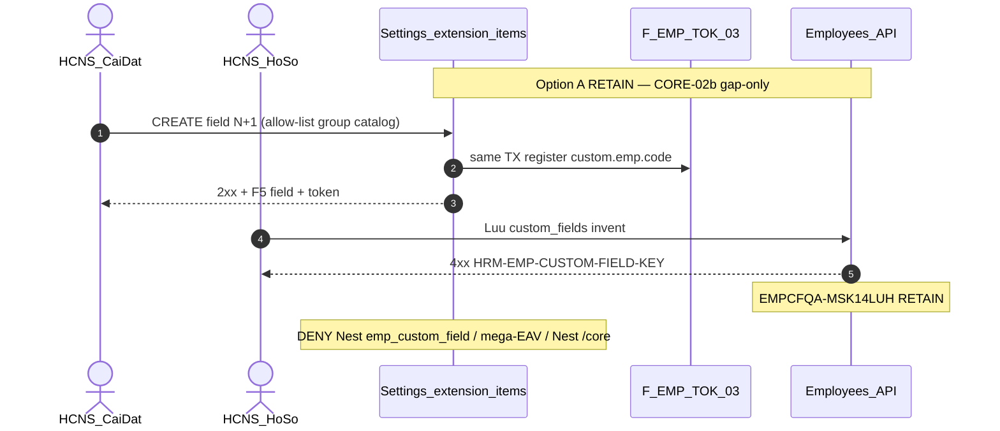

# PO-HRM-MVP-GD1-CORE-02B-CLUSTER-SA-01 — Option/F.1 · Nhóm field hồ sơ (metadata) — RETAIN gap-only

| Field | Value |
|-------|--------|
| **work_item_id** | `PO-HRM-MVP-GD1-CORE-02B-CLUSTER-SA-01` |
| **program** | `PO-HRM-MVP-GD1-CONTINUOUS` (**U89** — single GD continuous · **NO** phase split) |
| **lane** | governance · sa |
| **change_mode** | **ADD** Option/F.1 disposition · **gap-only** · **NO CODE** `apps/**` · **no seed** · **preserve_default** · **DENY** Nest `emp_custom_field` · **DENY** mega-EAV |
| **Date** | 2026-08-09 |
| **Status** | **CONFIRMED** · Option **A** **LOCKED** · unlock BA AC → (ba-data HOLD default) → API/FE residual only if BA proves closable gap → Dev |
| **depends_on** | QC-01 GWC Wave-16 UC-BP-CORE-09d **SEALED** — stamp `CORE09DQC1-MSLDR8I3` · evidence `docs/qa/evidence/po-hrm-mvp-gd1-core-09d-cluster-qc-01.md` · peer must_keep `CORE09CQC1-MSLBXMUT` / `CORE09BQC1-MSLB05DZ` / `CORE09AQC1-MSLA4LX9` / `CORE08QC1-MSL9BFFE` / `CORE02QC1-MSL80DU6` / `CORE01QC1-MSL6WMS7` · printable **false** · **≠** closed-8 TPL DONE · **≠** CORE-09c=printable DONE |
| **uc_ids** | `UC-BP-CORE-02b` |
| **board** | `docs/program/PO_HRM_MVP_GD1_CONTINUOUS.md` — seat **#19** after CORE-09d (#18 SEALED) |
| **ref_prior_emp_cf** | [`PO-HRM-DYNAMIC-CONFIG-PLATFORM-EMP-CUSTOM-FIELD-SA-01.md`](./PO-HRM-DYNAMIC-CONFIG-PLATFORM-EMP-CUSTOM-FIELD-SA-01.md) Option **A** LOCKED · BA-01 AC-PLT-EMP-CUSTOM-01* CONFIRMED · BE CNS invent KEY · QA stamp **`EMPCFQA-MSK14LUH`** · QC GWC · FE-SA Option **B** ACCEPT_AS_IS_P2 HOLD **`R-PLT-EMP-CF-FE-01`** · MergeToken EXT **`EMPTOKEXTQA-MSJ57PE1`** — **RETAIN baseline · gap-only this seat** |
| **ref_sa_spine** | Peer TPL [`PO-HRM-MVP-GD1-CORE-09D-CLUSTER-SA-01.md`](./PO-HRM-MVP-GD1-CORE-09D-CLUSTER-SA-01.md) · VER/PDF [`…-09C-…`](./PO-HRM-MVP-GD1-CORE-09C-CLUSTER-SA-01.md) · pack+PREV [`…-09B-…`](./PO-HRM-MVP-GD1-CORE-09B-CLUSTER-SA-01.md) · CL [`…-09A-…`](./PO-HRM-MVP-GD1-CORE-09A-CLUSTER-SA-01.md) · RD [`…-08-…`](./PO-HRM-MVP-GD1-CORE-08-CLUSTER-SA-01.md) · C&B [`…-02-…`](./PO-HRM-MVP-GD1-CORE-02-CLUSTER-SA-01.md) · public [`…-01-…`](./PO-HRM-MVP-GD1-CORE-01-CLUSTER-SA-01.md) — **reuse · DENY reopen sealed J-HRM-CORE-09D-01..04 / 09C / 09B / 09A / 08 / 02 / 01 without regression** |
| **ref_honesty** | `recruitment_uat_ready=false` · `jd_dynamic_done=false` · **`contracts_printable_ready=false`** · **`hrm_personnel_uat_ready=false`** · personnel / CORE / CTR module UAT **false** · **DENY claim CORE-09d TPL = printable UAT** · **DENY claim closed-8 TPL DONE** · **DENY claim CORE-09c=printable DONE** · **DENY claim EMPCF L1 = CORE-02b / personnel module DONE** |
| **ref_srs** | `SRS_HRM_ENTERPRISE.md` **FR-UC-BP-CORE-02b** · Diễn biến **#1–#4 + Thành công** · **AC-PLT-EMP-CUSTOM-01*** · **FR-UC-BP-PLT-01** pointer · **BR-PLT-01/02/04/05** · **BR-BP-MD-01** · peers CORE-09d..01 (**must_keep**) |
| **ref_paper_api** | `API_DESIGN_HRM_ENTERPRISE.md` **F-EMP-CF-01..03** · **F-EMP-CF-CNS-01/02** · **F-EMP-TOK-03** · RETAIN **F-CORE-CTR-TPL-01/02** (+ PUT clauses) · VER/PDF · PACK+PREV ephemeral · CL · CORE-08/02/01 |
| **ref_db** | LIVE `hrm_catalog_extension_items` · `hrm_merge_tokens` (`origin=extension_field`) · `employees.custom_fields` values · paper `profile_groups_json` on DB_DESIGN employees = **optional · NOT LIVE ensureSchema** (CORE-01 DATA OUT invent) — **HOLD invent GĐ1 unless BA proves closable gap beyond four catalog keys + `sort_order`** |
| **ref_code** | `settings-catalogs.controller/service` (`GET catalogs` · `POST …/extension-items`) · `emp-merge-token-register.ts` (F-EMP-TOK-03) · `emp-custom-field-consumer-assert.ts` + `employees.service` (F-EMP-CF-CNS-01) · FE `SettingsCatalogsTab` · `EmployeeFormDialog` `buildDynamicFields` — **read-only cite** |
| **OUT** | Nest `/core` dual · Nest `emp_custom_field` / `emp_field_definition` · mega-EAV FormSchema · invent `profile_groups_json` as primary SoT · wipe Settings extension SoT · reopen CORE-09d..01 · claim Wave-16 TPL printable · claim closed-8 DONE · claim EMPCF = personnel UAT · seed · honesty flip |
| **Honesty** | all ready flags **false** · **C-SLICE** · U65 zero-seed |
| **ack_status** | **PASS_TO_PM** · Option A CONFIRMED |

---

## 1. Decision Context

| | |
|--|--|
| **Decision title** | Wave-17 architecture unlock: **profile field-group / metadata** (Settings extension allow-list · consumer `custom_fields` KEY · merge-token `custom.emp.*`) vs AS-IS LIVE EMP-CUSTOM seals — **gap-only** for FR-UC-BP-CORE-02b |
| **Requestor** | PM · program `PO-HRM-MVP-GD1-CONTINUOUS` · U89 after CORE-09d QC-01 GWC (`CORE09DQC1-MSLDR8I3`) |
| **Date** | 2026-08-09 |
| **Decision owner** | SA |
| **Related requirements** | FR-UC-BP-CORE-02b · AC-PLT-EMP-CUSTOM-01* · F-EMP-CF-* · F-EMP-CF-CNS-* · F-EMP-TOK-03 · must_keep CORE-09d TPL+clause · CORE-09c VER/PDF · CORE-09b PACK+PREV ephemeral · CORE-09a CL · CORE-08 · CORE-02 · CORE-01 · Nest `/core` DENY · DENY Nest emp_custom_field / mega-EAV · cite EMPCF **`EMPCFQA-MSK14LUH`** RETAIN |

### 1.1 Problem to Solve

| | |
|--|--|
| **Current state (AS-IS LIVE)** | **CORE-09d SEALED (`CORE09DQC1-MSLDR8I3`):** open TPL catalog Settings 9+ · PREV ephemeral · PUT …/clauses IT↔DRIVER · Nest `/core` 0 · **printable false** · **≠** closed-8 DONE · **≠** CORE-09c=printable · **≠** module CORE/CTR UAT. **EMP-CUSTOM baseline (RETAIN):** (1) Definition SoT = Settings **`hrm_catalog_extension_items`** on allow-list **`hrm_employee_{basic\|personal\|work\|finance}_fields`** (+ aliases) — SA Option A LOCKED. (2) Admin CREATE N+1 via `POST …/settings-catalogs/:catalogKey/extension-items` (**F-EMP-CF-02**) · soft-retire (**F-EMP-CF-03**). (3) Same-TX **F-EMP-TOK-03** → `custom.emp.<code>` `origin=extension_field` — EXT QC **`EMPTOKEXTQA-MSJ57PE1` SEAL RETAIN**. (4) Consumer invent when EFF>0 → **422 `HRM-EMP-CUSTOM-FIELD-KEY`** — QA **`EMPCFQA-MSK14LUH`** · GAP `EMPCFCNSGAP-MSJCUBJB` **CLOSED**. (5) Nest `emp_custom_field` **ABSENT**. (6) FE Settings catalogs + EmployeeFormDialog `buildDynamicFields` mount/persist when EFF>0 **LIVE**. (7) FE residual **`R-PLT-EMP-CF-FE-01`** empty CTA = **P2 HOLD** (FE-SA Option B ACCEPT_AS_IS — not mount/persist FAIL). (8) Paper **`profile_groups_json`** on DB_DESIGN employees — **NOT** in LIVE `employees` ensureSchema (CORE-01 DATA: OUT invent); only mock key `employee_profile_groups` in controller.spec — **not** physical SoT. (9) Four allow-list catalogs **are** the profile groups (cơ bản / cá nhân / công việc / tài chính); item `sort_order` LIVE on extension list. |
| **Paper target** | FR-UC-BP-CORE-02b: CRUD nhóm + mục mở rộng theo tenant; đăng ký trường trộn khi lưu mục; hồ sơ chọn mã ∈ EFF; C&B không lộ public; thứ tự hiển thị CRUD; XBOS hybrid sync policy; **không** bảng Nest field-def ngoài mục mở rộng; **không** claim personnel module UAT. |
| **Gap class** | **GĐ1 continuous AC + journey residual on LIVE EMP-CF spine** — **not** greenfield dual: (1) board #19 needs Option lock mapping CORE-02b ↔ sealed F-EMP-CF-* / CNS / TOK; (2) risk invent Nest `emp_custom_field` / mega-EAV / Nest `/core`; (3) risk invent `profile_groups_json` as second layout SoT without proven gap; (4) risk claim EMPCF L1 / FE mount = CORE-02b / personnel UAT DONE; (5) risk reopen CORE-09d..01 / flip printable·personnel·recruitment; (6) risk wipe Settings SoT for Nest field-def symmetry. |
| **Constraints** | U89 continuous · **preserve** CORE-09d TPL+clause · CORE-09c VER/PDF ≠ printable · CORE-09b PREV ephemeral · CORE-09a CL · CORE-08 · CORE-02 AuthZ/CB-403 · CORE-01 public · Nest `/core` DENY · EMP-CUSTOM Option A · EXT seal · Nest field-def ABSENT · C-SLICE · DENY seed · **cấm code until Option CONFIRMED** · gap-only · **DENY** honesty flip |
| **Failure impact if unresolved** | Board #19 stalls or Dev invents Nest dual / mega-EAV / profile_groups_json engine; honesty flip; regression CORE-09d..01; false personnel UAT |

### 1.2 Architecture diagram (target — Option A)

```text
  UC-BP-CORE-01..09d (SEALED must_keep)
  public · C&B · RD · CL · PACK+PREV ephemeral · VER/PDF · open TPL+clause
  Nest /core DENY · printable false · closed-8 ≠ DONE · C-SLICE
       │
       │  must_keep RETAIN — DENY reopen J-HRM-CORE-09D/09C/09B/09A/08/02/01
       ▼
  ┌────────────── FR-UC-BP-CORE-02b (this seat — gap-only RETAIN) ─────────────────┐
  │                                                                                │
  │  PROFILE GROUPS SoT = four Settings catalog keys (RETAIN)                      │
  │    hrm_employee_basic_fields     → nhóm thông tin cơ bản                       │
  │    hrm_employee_personal_fields  → cá nhân                                     │
  │    hrm_employee_work_fields      → công việc                                   │
  │    hrm_employee_finance_fields   → tài chính (C&B ring — CORE-02 strip public) │
  │    (+ aliases) — DENY invent employee_profile_groups Nest dual                 │
  │                                                                                │
  │  F-EMP-CF-01 RETAIN physical                                                   │
  │    GET /api/hrm/settings-catalogs/:catalogKey (+ extension / effective)        │
  │    → active extension defs · display-ready · empty = 200[] + CTA · no seed     │
  │                                                                                │
  │  F-EMP-CF-02 RETAIN physical                                                   │
  │    POST …/settings-catalogs/:catalogKey/extension-items                        │
  │    → admin CREATE N+1 open slug · UQ · same TX → F-EMP-TOK-03                  │
  │    → DENY apply HRM-EMP-CUSTOM-FIELD-KEY on admin CREATE                       │
  │                                                                                │
  │  F-EMP-CF-03 RETAIN physical                                                   │
  │    soft-retire extension-item → soft-retire custom.emp.* · history values OK   │
  │                                                                                │
  │  F-EMP-TOK-03 RETAIN SEALED (EMPTOKEXTQA-MSJ57PE1)                             │
  │    custom.emp.<code> · origin=extension_field · ring=custom · domain=EMP       │
  │    DENY second register path · DENY reopen EXT suite                           │
  │                                                                                │
  │  F-EMP-CF-CNS-01/02 RETAIN SEALED (EMPCFQA-MSK14LUH)                           │
  │    POST/PUT/PATCH /api/hrm/employees* · custom_fields invent → KEY when EFF>0  │
  │    EFF=0 skip invent assert · CTA · no seed                                    │
  │                                                                                │
  │  VALUES SoT = employees.custom_fields (RETAIN)                                 │
  │    value write ≠ definition register (EXT-04c)                                 │
  │                                                                                │
  │  profile_groups_json (paper DB_DESIGN)                                         │
  │    NOT LIVE ensureSchema · HOLD invent GĐ1 · OUT as primary SoT                │
  │    BA may CONFIRM residual UX order/visibility ONLY if four catalogs +         │
  │    sort_order proven insufficient — else KEEP OUT                              │
  │                                                                                │
  │  FE residual R-PLT-EMP-CF-FE-01 (empty CTA) — P2 HOLD cite (FE-SA Option B)    │
  │    ≠ mount/persist FAIL · ≠ invent Nest field-def UI                           │
  │                                                                                │
  │  RETAIN: CORE-09d TPL+clause · 09c VER/PDF · 09b PREV ephemeral · 09a CL       │
  │          CORE-08 · CORE-02 · CORE-01 · Nest /core DENY                         │
  └────────────────────────────────────────────────────────────────────────────────┘
       │
       │  OUT this seat
       ▼
  Nest emp_custom_field / mega-EAV     = DENY
  Nest /core dual                       = DENY
  profile_groups_json primary SoT       = DENY invent GĐ1 default
  Flip personnel / printable / recruit  = DENY
  Claim EMPCF L1 = CORE-02b module DONE = DENY
  Claim CORE-09d = printable / closed-8 = DENY

  Honesty: C-SLICE ≠ hrm_personnel_uat_ready · ≠ contracts_printable_ready
```

**Label lock:** «Cấu hình nhóm field hồ sơ (metadata)» = **four allow-list EMP field catalogs + extension-items + TOK + CNS** — **not** Nest field-def table; not mega-EAV; not `profile_groups_json` primary.  
**Spine lock:** Physical prefer `/api/hrm/settings-catalogs*` + `/api/hrm/employees*` — paper `/core/…` = **alias only** — **DENY** Nest `/core` second SoT.  
**Group lock:** Catalog key ∈ allow-list = nhóm SoT — **DENY** invent parallel `employee_profile_groups` Nest domain.  
**Honesty lock:** Slice GWC later **≠** auto-flip `hrm_personnel_uat_ready` · `contracts_printable_ready` · `recruitment_uat_ready` · `jd_dynamic_done` · **≠** claim EMPCF = personnel UAT · **≠** claim CORE-09d printable / closed-8 DONE.

---

## 2. LIVE vs gap map (preserve_default)

| Capability | Paper (SRS / API) | AS-IS LIVE | Verdict |
|------------|-------------------|------------|---------|
| Profile groups | FR-02b nhóm cơ bản/cá nhân/công việc/tài chính | Four allow-list catalog keys | **RETAIN** = groups SoT |
| Field-def open catalog | F-EMP-CF-01/02 · AC-01 | `hrm_catalog_extension_items` Settings | **RETAIN** EMP-CUSTOM Option A |
| Merge token register | F-EMP-TOK-03 · AC-01b | same-TX `custom.emp.*` | **RETAIN** EXT seal cite |
| Consumer invent KEY | F-EMP-CF-CNS-01 · AC-01c | **422** `HRM-EMP-CUSTOM-FIELD-KEY` | **RETAIN** `EMPCFQA-MSK14LUH` |
| Empty EFF | AC-01d | BE skip invent · FE section omit | **RETAIN** + P2 CTA HOLD |
| Soft-retire | F-EMP-CF-03 · AC-01e | soft item + token | **RETAIN** |
| Display order | SRS thứ tự CRUD | extension `sort_order` LIVE | **RETAIN** · BA confirm sufficient |
| `profile_groups_json` | DB_DESIGN optional | **ABSENT** ensureSchema | **HOLD invent** · OUT primary SoT |
| Nest `emp_custom_field` | DENY paper | **ABSENT** | **RETAIN ABSENT** · DENY invent |
| C&B vs public | finance group · CORE-02/01 | CB-403 strip public | **must_keep** CORE-02/01 |
| CORE-09d TPL+clause | must_keep | SEALED `CORE09DQC1-MSLDR8I3` | **must_keep RETAIN** |
| CORE-09c VER/PDF | must_keep ≠ printable | SEALED | **must_keep** · DENY claim printable |
| PREV ephemeral | CORE-09b | SEALED | **must_keep** |
| Nest `/core` | paper alias | DENY dual | **DENY** |
| Module / honesty | program | C-SLICE | **DENY flip** |

---

## 3. Options

### Option A — ACCEPT_AS_IS_RETAIN: LIVE F-EMP-CF-* / CNS / TOK as CORE-02b spine · four catalogs = groups · HOLD `profile_groups_json` invent (RECOMMENDED)

| | |
|--|--|
| **Description** | **Preserve** CORE-09d F-CORE-CTR-TPL-01/02 (+ PUT …/clauses · activate) · CORE-09c VER/PDF (**≠** printable UAT) · CORE-09b PACK+PREV **ephemeral** · CORE-09a CL · CORE-08 RD+payroll_link · CORE-02 AuthZ/CB-403 · CORE-01 public · Nest `/core` DENY. **Preserve** sealed EMP-CUSTOM Option A: Settings **`hrm_catalog_extension_items`** on four allow-list EMP field catalogs = **sole** field-def SoT (**F-EMP-CF-01..03**); **F-EMP-TOK-03** `custom.emp.*` (**EXPAND cite** EXT `EMPTOKEXTQA-MSJ57PE1`); **F-EMP-CF-CNS-01/02** invent **`HRM-EMP-CUSTOM-FIELD-KEY`** (**cite** `EMPCFQA-MSK14LUH`). **Map** FR-UC-BP-CORE-02b «nhóm» = catalog keys (basic/personal/work/finance) — **DENY** invent Nest `employee_profile_groups` / `emp_custom_field`. **`profile_groups_json`:** paper optional — **HOLD invent GĐ1**; **OUT** as primary SoT; unlock only if BA proves closable UX gap that `sort_order` + four catalogs cannot cover (then ba-data first — not Dev invent). **Carry** `R-PLT-EMP-CF-FE-01` empty CTA as **P2 HOLD cite** (FE-SA Option B) — **≠** mount/persist FAIL · **≠** invent Nest field-def UI. Paper `/core/…` = **alias only**. **DENY** mega-EAV · reopen sealed J-HRM-CORE-09D-01..04 / 09C / 09B / 09A / 08 / 02 / 01 · flip honesty · claim EMPCF = personnel / CORE-02b module DONE · claim CORE-09d printable / closed-8 DONE. |
| **Benefits** | Aligns FR-02b + sealed EMP-CF spine; zero dual SoT; unlocks U89 #19 BA without greenfield; preserves W10–W16 must_keep; clear personnel/printable honesty boundary |
| **Costs** | BA AC O1–O12 + U65 journey mint; ba-data HOLD default; optional FE P2 CTA only if BA promotes residual |
| **Risks** | Dev invents Nest field-def / profile_groups_json engine / Nest `/core` — **mitigate:** DENY + O locks; false DONE from EMPCF L1 — **mitigate:** C-SLICE + O10 |

### Option B — Nest `emp_custom_field` dual · OR Nest `/core` dual · OR wipe Settings extension SoT · OR mega-EAV FormSchema

| | |
|--|--|
| **Description** | ADD Nest domain table + CRUD `/employees/custom-field-defs*` as new SoT; **or** implement paper `/api/hrm/core/…` as primary; **or** abandon Settings extension-items producer; **or** one mega EAV schema replacing catalogs + DOC/ET. |
| **Benefits** | Illusion of Nest symmetry with DOC/ET |
| **Costs** | Dual writers · reopen EMP-CUSTOM + EXT GWC · ba-data EXPAND · FE rewrite · U89 delay |
| **Risks** | Violates DENY Nest emp_custom_field / mega-EAV / Nest `/core` · seal reopen — **REJECT** |

### Option C — HOLD / EMPCF L1 = CORE-02b DONE / invent `profile_groups_json` primary / honesty flip / reopen CORE-09d seals

| | |
|--|--|
| **Description** | Treat EMPCF CNS L1 GWC or FE mount as FR-UC-BP-CORE-02b complete without GĐ1 BA AC / J-*; **or** invent `profile_groups_json` as primary layout SoT without proven gap; **or** HOLD board; **or** flip `hrm_personnel_uat_ready` / `contracts_printable_ready` / recruitment; **or** reopen sealed J-HRM-CORE-09D/09C/09B/09A/08/02/01; **or** claim Wave-16 TPL = printable / closed-8 DONE. |
| **Benefits** | Short-term idle / false DONE |
| **Costs** | Board #19 false seal or stuck; honesty break; OBS CTA orphan without disposition |
| **Risks** | C-SLICE violation · sponsor idle · printable/personnel flip — **REJECT** |

---

## 4. Trade-off Matrix

| Criteria | Weight | Option A | Option B | Option C |
|----------|-------:|:--------:|:--------:|:--------:|
| Business value (FR-CORE-02b + AC-PLT-EMP-CUSTOM-01*) | 25 | **9** | 3 | 2 |
| Time to deliver (U89 continuous) | 20 | **9** | 1 | 2 |
| Complexity / blast radius | 15 | **9** | 1 | 4 |
| Security / seals CORE-09d..01 + EMPCF + EXT + U19 | 15 | **9** | 1 | 1 |
| Reliability (ONE field-def SoT · no Nest dual · no mega-EAV) | 15 | **9** | 1 | 2 |
| Maintainability (RETAIN LIVE · gap-only · peer seals) | 10 | **9** | 1 | 2 |
| **Weighted (≈)** | 100 | **9.00** | **1.40** | **2.10** |

---

## 5. Failure Modes and Mitigation

| Option | Failure mode | Detection | Mitigation |
|--------|--------------|-----------|------------|
| A | Nest `emp_custom_field` invent | Grep schema/routes | **DENY** · L-EMP-CF-01 RETAIN |
| A | Nest `/core` second SoT | Route grep · browser hits | **DENY** dual · paper alias only |
| A | Invent `profile_groups_json` primary without gap | ba-data/Dev PR | **HOLD invent** · O5 · four catalogs = groups |
| A | Claim EMPCF L1 = CORE-02b / personnel UAT | Honesty review | **DENY** · O10 · C-SLICE |
| A | Claim CORE-09d = printable / closed-8 DONE | QC honesty | **DENY** · must_keep 09d stamp |
| A | Reopen J-HRM-CORE-09D/09C/09B/09A/08/02/01 | Journey rewrite | **DENY reopen** without regression |
| A | Reopen EXT / wipe F-EMP-TOK-03 | Token suite churn | **EXPAND cite only** |
| A | Seed extension density for UF | QA evidence | **DENY** seed U65 |
| A | Treat P2 empty CTA as mount FAIL unlock Nest UI | FE Task invent | **HOLD** `R-PLT-EMP-CF-FE-01` · BA promote only |
| B | Dual SoT / mega-EAV | Integration | Reject B |
| C | Board idle / false DONE / honesty flip | U89 | Reject C |

---

## 6. Decision

| | |
|--|--|
| **Selected option** | **Option A** — **ACCEPT_AS_IS_RETAIN**: LIVE F-EMP-CF-01..03 + F-EMP-TOK-03 + F-EMP-CF-CNS-01/02 as CORE-02b spine; four allow-list catalogs = profile groups; `profile_groups_json` HOLD invent / OUT primary; paper `/core` alias only; **RETAIN** CORE-09d..01 · Nest `/core` DENY · Nest field-def ABSENT · EXT seal; **DENY** mega-EAV · honesty flip · reopen seals · claim EMPCF=module DONE · claim CORE-09d printable/closed-8 |
| **Why selected** | AS-IS already implements FR-02b metadata spine (groups via catalog keys · open extension defs · token register · consumer invent KEY); residual is **GĐ1 BA AC + journey mapping + optional P2 CTA** under U89 — not greenfield Nest dual, not mega-EAV, not `profile_groups_json` invent; preserves W10–W16 + EMPCF/EXT must_keep; unlocks board #19 |
| **Assumptions** | EMP-CUSTOM SA/BA/BE/QA/QC seals **RETAIN** (`EMPCFQA-MSK14LUH` · QC GWC). EXT **`EMPTOKEXTQA-MSJ57PE1` RETAIN**. FE-SA **`R-PLT-EMP-CF-FE-01` P2 HOLD**. CORE-09d **`CORE09DQC1-MSLDR8I3` RETAIN**. CORE-09c..01 stamps **RETAIN**. Nest `/core` DENY **RETAIN**. `hrm_personnel_uat_ready=false` · `contracts_printable_ready=false` · `recruitment_uat_ready=false` · `jd_dynamic_done=false`. |
| **Rejected** | **B** — Nest emp_custom_field / Nest `/core` dual / wipe Settings / mega-EAV · **C** — HOLD / EMPCF=CORE-02b DONE / invent profile_groups_json primary / honesty flip / reopen sealed |

### 6.1 OPEN decisions for BA (lockable — not invent)

| ID | Topic | SA default (Option A) | BA must CONFIRM |
|----|-------|----------------------|-----------------|
| **O1** | Physical path | Prefer `GET/POST …/settings-catalogs*` (+ extension-items) · consumer `/employees*` `custom_fields`; any `/core/…` = alias / DOC-DELTA only — **DENY** Nest `/core` dual · **DENY** Nest `emp_custom_field*` | Cite Network paths Settings + Employee form |
| **O2** | Groups SoT | Four allow-list catalog keys = nhóm (basic/personal/work/finance + aliases) — **DENY** invent parallel Nest group table | Map FR-02b Diễn biến #1 «CRUD nhóm» → catalog keys |
| **O3** | Field-def SoT | `hrm_catalog_extension_items` only — **RETAIN** EMP-CUSTOM Option A · admin CREATE N+1 open · **DENY** closed enum | AC-PLT-EMP-CUSTOM-01 / 01H |
| **O4** | Token register | Same save → `custom.emp.*` via **F-EMP-TOK-03** — **RETAIN smoke** cite EXT · **FORBIDDEN** reopen EXT suite | AC-01b · cite `EMPTOKEXTQA-MSJ57PE1` |
| **O5** | `profile_groups_json` | **HOLD invent** · **OUT** primary SoT GĐ1; order/visibility = catalog + `sort_order` unless BA proves closable gap → then ba-data first | Explicit OUT or residual AC id |
| **O6** | Consumer invent | EFF>0 invent → **`HRM-EMP-CUSTOM-FIELD-KEY`** · EFF=0 skip + CTA · **no seed** — **RETAIN** `EMPCFQA-MSK14LUH` | AC-01c / 01d · VAL-EMP-CF-CNS-* |
| **O7** | Soft-retire | Soft hide picker + token · history values OK — **DENY** hard-delete wipe | AC-01e |
| **O8** | C&B / public | Finance / money keys **must_keep** CORE-02 CB-403 · CORE-01 public strip — **DENY** leak C&B on public form | Cite CORE-02/01 seals |
| **O9** | FE residual | `R-PLT-EMP-CF-FE-01` empty CTA = **P2 HOLD** default — promote to AC only if BA needs U65 CTA copy; **≠** Nest field-def UI | Optional O-FE or KEEP HOLD |
| **O10** | Honesty / peers OUT | All ready flags false · C-SLICE · **DENY** flip personnel/printable/recruitment/jd · **DENY** claim EMPCF=module DONE · **DENY** claim CORE-09d printable / closed-8 DONE · **must_keep** CORE-09d..01 · Nest DENY | Footer every evidence |
| **O11** | Display-ready | Extension DTO: code · label VI · unit/meta · sort_order · status · catalogKey · token_key display optional | FE bind |
| **O12** | Journeys | Mint **J-HRM-CORE-02B-01..0n DRAFT** (Settings append N+1 → F5 → form mount → invent KEY fail · retire hide) · map peer AC-PLT-EMP-CUSTOM · **DENY** reopen sealed J-HRM-CORE-09D/09C/09B/09A/08/02/01 | Journey map delta |

### 6.2 API_DESIGN F.1 map (cite RETAIN — no invent endpoints)

| ID | METHOD / path (physical) | Mục đích | Nghiệp vụ (tóm tắt) | Bước SRS | Disposition |
|----|--------------------------|----------|---------------------|----------|-------------|
| **F-EMP-CF-01** | `GET /api/hrm/settings-catalogs/:catalogKey` (+ extension / effective) | List field defs / nhóm mật độ | Scope · active rows · empty 200[] | FR-02b #1 · AC-01/01d | **RETAIN cite** |
| **F-EMP-CF-02** | `POST …/settings-catalogs/:catalogKey/extension-items` | Admin mở N+1 | Slug validate · upsert · same TX TOK | FR-02b #1–#2 · AC-01/01b | **RETAIN cite** |
| **F-EMP-CF-03** | Soft-retire extension-item | Ngừng mục | Soft item + soft `custom.emp.*` · history OK | FR-02b special · AC-01e | **RETAIN cite** |
| **F-EMP-TOK-03** | Side-effect in CF-02/03 | Đăng ký trường trộn | `custom.emp.<code>` · origin=extension_field | FR-02b #2 · AC-01b | **RETAIN SEALED** EXT |
| **F-EMP-CF-CNS-01** | `POST/PUT/PATCH /api/hrm/employees*` | Consumer invent gate | EFF>0 → KEY · EFF=0 skip | FR-02b #3–#4 · AC-01c/01d | **RETAIN SEALED** EMPCF |
| **F-EMP-CF-CNS-02** | ESS self-PATCH narrow | ESS invent class | KEY or ESS 403 · **cấm** widen | AC-01c spot | **RETAIN cite** |
| **F-CORE-CTR-TPL-01/02** (+ PUT clauses) | `/contracts-insurance/contract-templates*` | must_keep CORE-09d | Open catalog · clause bind | peer 09d | **must_keep** · **OUT invent DONE** |
| **F-CORE-CTR-VER/PDF** | print-versions* / pdf | must_keep CORE-09c | Snapshot · **≠** printable UAT | peer 09c | **must_keep** |
| **F-CORE-CTR-PACK/PREV** | pack-resolve · preview | must_keep CORE-09b | PREV **ephemeral** | peer 09b | **must_keep** |
| **F-CORE-CTR-CL-*** | contract-clauses* | must_keep CORE-09a | Body SoT | peer 09a | **must_keep** |
| **F-CORE-RD / EMP-02 / EMP-01** | rewards/discipline · packages · employees public | must_keep 08/02/01 | AuthZ · CB-403 · public strip | peers | **must_keep** |

**FORBIDDEN GĐ1 invent:** `POST /api/hrm/employees/custom-field-defs*` · Nest `@Controller('core')` dual · Nest table `emp_custom_field` · mega-EAV schema CRUD · `profile_groups_json` column ensure as primary SoT without BA+ba-data gap proof.



---

## 7. must_keep / DENY locks (this seat)

| Lock | Rule |
|------|------|
| **L-CORE-02B-01 Groups** | Profile groups = four allow-list EMP field catalog keys — **FORBIDDEN** Nest `employee_profile_groups` dual |
| **L-CORE-02B-02 Def SoT** | Field-def = `hrm_catalog_extension_items` — **FORBIDDEN** Nest `emp_custom_field` / mega-EAV |
| **L-CORE-02B-03 TOK** | Register = **F-EMP-TOK-03** only — **FORBIDDEN** reopen EXT suite / second token table |
| **L-CORE-02B-04 CNS** | Invent KEY = **`HRM-EMP-CUSTOM-FIELD-KEY`** when EFF>0 — **RETAIN** `EMPCFQA-MSK14LUH` |
| **L-CORE-02B-05 profile_groups_json** | Paper optional — **HOLD invent** · **OUT** primary SoT unless BA+ba-data prove gap |
| **L-CORE-02B-06 Nest /core** | Paper alias only — **FORBIDDEN** Nest `/core` second SoT |
| **L-CORE-02B-07 CORE-09d** | F-CORE-CTR-TPL-01/02 + PUT clauses **RETAIN** — **FORBIDDEN** claim printable / closed-8 DONE · **FORBIDDEN** reopen J-HRM-CORE-09D-01..04 without regression |
| **L-CORE-02B-08 CORE-09c** | VER/PDF **RETAIN** — **FORBIDDEN** claim = printable DONE |
| **L-CORE-02B-09 CORE-09b** | PACK+PREV ephemeral **RETAIN** — **FORBIDDEN** PREV→INSERT VER |
| **L-CORE-02B-10 CORE-09a/08/02/01** | CL · RD · C&B AuthZ · public **RETAIN** stamps |
| **L-CORE-02B-11 Honesty** | **DENIED** flip `recruitment_uat_ready` · `jd_dynamic_done` · `contracts_printable_ready` · `hrm_personnel_uat_ready` · module CORE/CTR/personnel UAT · Phase1 · claim EMPCF = CORE-02b module DONE |
| **L-CORE-02B-12 Seed** | **DENIED** U65 seed for density / UF |
| **L-CORE-02B-13 FE P2** | `R-PLT-EMP-CF-FE-01` HOLD cite — **FORBIDDEN** invent Nest field-def UI as unlock |
| **L-CORE-02B-14 Scope** | Same `resolveHrmListScope` Settings ↔ employees invent assert (**U19**) |

---

## 8. Rollout / unlock

```text
CORE-02B-CLUSTER-SA-01 (this) CONFIRMED · Option A LOCKED
  → ba-data: HOLD default (profile_groups_json invent DENY unless O5 gap proven)
  → ba-process: PO-HRM-MVP-GD1-CORE-02B-CLUSTER-BA-01 AC pack (O1–O12)
  → (after BA) ba-data only if O5 unlocks column/layout residual
  → (after BA/data) sa API RETAIN cite F-EMP-CF-* only if wire gap proven — else FE residual only
  → Dev: cấm until contracts CONFIRMED · DENY Nest emp_custom_field · DENY mega-EAV · DENY Nest /core
  → QA U65 J-HRM-CORE-02B-* · cite EMPCF/EXT retain · must_keep CORE-09d..01
  → QC narrow C-SLICE — DENY personnel/printable/module UAT
```

| Wave | Owner | Exit |
|------|-------|------|
| **This** | sa | Option A LOCKED · F.1 · ba-process UNLOCK · ba-data HOLD |
| **AC pack** | ba-process | O1–O12 CONFIRMED · J-HRM-CORE-02B-* DRAFT |
| **DATA** | ba-data | HOLD unless O5 gap |
| **API/FE** | sa/dev | Only after BA · residual only |
| **QA/QC** | qa → qc | Narrow seal · honesty false |

**Rollback:** Keep EMP-CUSTOM + EXT + CORE-09d..01 seals; disable only unproven residual flags; no schema invent to roll back.

---

## 9. Explicit OUT / DENY

| OUT | Rule |
|-----|------|
| Nest `emp_custom_field` / `emp_field_definition` | **DENIED** |
| Mega-EAV FormSchema replacing catalogs | **DENIED** |
| Nest `/core` dual SoT | **DENIED** |
| Invent `profile_groups_json` as primary SoT without BA+ba-data gap | **DENIED** (HOLD) |
| Wipe Settings extension SoT / reopen EXT | **DENIED** |
| Reopen sealed J-HRM-CORE-09D/09C/09B/09A/08/02/01 | **DENIED** without regression |
| Flip `hrm_personnel_uat_ready` / `contracts_printable_ready` / `recruitment_uat_ready` / `jd_dynamic_done` | **DENIED** |
| Claim CORE-09d TPL = printable UAT / closed-8 DONE / CORE-09c=printable DONE | **DENIED** |
| Claim EMPCF L1 / FE mount = CORE-02b / personnel module UAT / Phase1 DONE | **DENIED** · **C-SLICE-≠-MODULE** |
| Seed extension / token density for UF | **DENIED** (U65) |
| Code `apps/**` this seat | **DENIED** until Option CONFIRMED + BA contracts |

---

## 10. Completion

| Field | Value |
|-------|--------|
| **completion_report** | Option **A CONFIRMED LOCKED** — UC-BP-CORE-02b gap-only RETAIN: profile groups = four Settings allow-list EMP field catalogs; field-def SoT = `hrm_catalog_extension_items` (**F-EMP-CF-01..03**); token **F-EMP-TOK-03** `custom.emp.*` cite EXT **`EMPTOKEXTQA-MSJ57PE1`**; consumer invent **`HRM-EMP-CUSTOM-FIELD-KEY`** cite **`EMPCFQA-MSK14LUH`**; Nest `emp_custom_field` / mega-EAV / Nest `/core` **DENIED**; `profile_groups_json` **HOLD invent / OUT primary**; FE **`R-PLT-EMP-CF-FE-01` P2 HOLD cite**; must_keep CORE-09d TPL+clause (`CORE09DQC1-MSLDR8I3`) · CORE-09c VER/PDF ≠ printable · CORE-09b PREV ephemeral · CORE-09a CL · CORE-08 · CORE-02 · CORE-01; honesty personnel/printable/recruitment/jd **false** · **C-SLICE**; unlock **ba-process** AC O1–O12 — **cấm code** until contracts. |
| **next_owner** | `ba-process` |
| **next_dispatch_prompt** | See §11 |
| **ack_status** | **PASS_TO_PM** |
| **evidence_path** | `docs/program/specs/PO-HRM-MVP-GD1-CORE-02B-CLUSTER-SA-01.md` |

---

## 11. next_dispatch_prompt (copy-ready)

```text
work_item_id: PO-HRM-MVP-GD1-CORE-02B-CLUSTER-BA-01
lane: governance · ba-process
program: PO-HRM-MVP-GD1-CONTINUOUS (U89)
uc_ids: UC-BP-CORE-02b
depends_on: SA-01 Option A LOCKED CONFIRMED evidence docs/program/specs/PO-HRM-MVP-GD1-CORE-02B-CLUSTER-SA-01.md · prior EMP-CUSTOM BA/QA/QC RETAIN (EMPCFQA-MSK14LUH · EMPTOKEXTQA-MSJ57PE1) · peer CORE09DQC1-MSLDR8I3 / CORE09CQC1-MSLBXMUT / CORE09BQC1-MSLB05DZ / CORE09AQC1-MSLA4LX9 / CORE08QC1-MSL9BFFE / CORE02QC1-MSL80DU6 / CORE01QC1-MSL6WMS7 must_keep
spec_ref: SRS FR-UC-BP-CORE-02b · AC-PLT-EMP-CUSTOM-01* · F-EMP-CF-01..03 · F-EMP-CF-CNS-01/02 · F-EMP-TOK-03 · SA O1–O12

MISSION — BA AC pack (narrow):
1) CONFIRM O1–O12 from SA-01 Option A: groups = four allow-list catalogs; field-def = extension-items; TOK+CNS RETAIN; profile_groups_json HOLD invent / OUT primary unless gap proven; Nest emp_custom_field / mega-EAV / Nest /core DENY
2) AC matrix map Diễn biến #1–#4 → AC-PLT-EMP-CUSTOM-01* + VAL-EMP-CF-* cite; mint J-HRM-CORE-02B-01..0n DRAFT; FE R-PLT-EMP-CF-FE-01 P2 HOLD or promote CTA AC
3) ba-data HOLD default; unlock ba-data ONLY if O5 proves profile_groups_json gap
must_keep: CORE-09d TPL+clause · CORE-09c VER/PDF ≠ printable · CORE-09b PREV ephemeral · CORE-09a CL · CORE-08 · CORE-02 · CORE-01 · Nest /core DENY · EMPCF/EXT seals · DENY reopen J-HRM-CORE-09D/09C/09B/09A/08/02/01
cấm: honesty flip · recruitment_uat_ready · jd_dynamic_done · contracts_printable_ready · hrm_personnel_uat_ready · module CORE/CTR/personnel UAT · seed · Nest emp_custom_field · mega-EAV · Nest /core dual · claim CORE-09d printable / closed-8 DONE · claim EMPCF = CORE-02b module DONE · apps/**
exit: evidence docs/program/specs/PO-HRM-MVP-GD1-CORE-02B-CLUSTER-BA-01.md · PASS_TO_PM · next ba-data HOLD (or DATA if O5) / sa API only if gap
```
