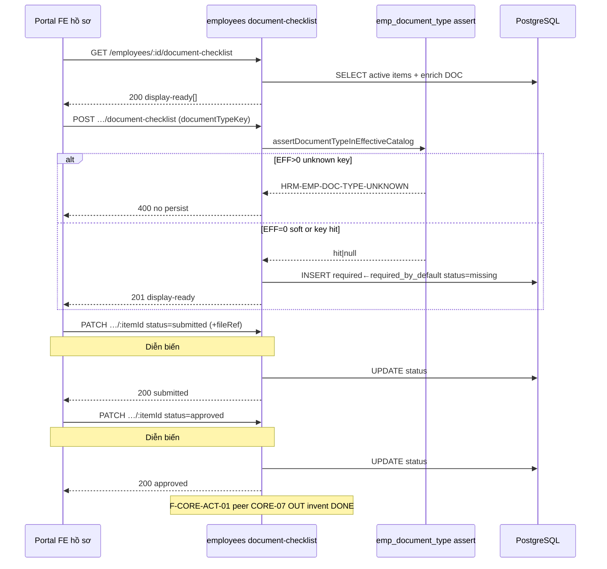

# PO-HRM-MVP-GD1-CORE-03-CLUSTER-API-01 — API F.1 · Checklist instance ADD + DOC/ET/TOK RETAIN cite (Option A PHYSICAL)

| Field | Value |
|-------|--------|
| **work_item_id** | `PO-HRM-MVP-GD1-CORE-03-CLUSTER-API-01` |
| **program** | `PO-HRM-MVP-GD1-CONTINUOUS` (**U89** — Wave-18 seat **#20**) |
| **lane** | governance · sa |
| **change_mode** | **ADD** **F-CORE-CHK-01** (Nest physical residual) · **RETAIN cite** **F-EMP-CAT-DOC-01/02** · **F-EMP-CAT-ET-01/02** · **F-EMP-CAT-EFF-01** · **F-EMP-TOK-01/02** · **wire** `assertDocumentTypeInEffectiveCatalog` · **must_keep** CORE-02b EMP-CF · CORE-09d TPL+clause · 09c VER/PDF ≠ printable · 09b PREV ephemeral · 09a CL · CORE-08 · CORE-02 · CORE-01 · Nest `/core` DENY · **NO** invent rewrite DOC/ET/TOK · **NO** Nest dual · **NO CODE** `apps/**` this seat · **no seed** · **preserve_default** |
| **Date** | 2026-08-09 |
| **Status** | **CONFIRMED** — F.1 physical Option A · unlock **dev-be** + **dev-fe** (rule 26 split) · **DENY** Dev invent Nest `/core` · Nest `emp_position` · Nest `emp_custom_field` · closed DOC enum |
| **uc_ids** | `UC-BP-CORE-03` |
| **depends_on** | DATA-01 **CONFIRMED** · BA-01 O1–O12 **CONFIRMED** · SA-01 Option **A LOCKED** · **R-PLT-EMP-01 IN-SCOPE** · EMP DOC L1 **`EMPPLATQA-MSIZXHIM`** · TOK **`EMPTOKQA-MSJ290VB`** · peer QC **`CORE02BQC1-MSLEFQC1`** / **`CORE09DQC1-MSLDR8I3`** must_keep · peers `CORE09CQC1-MSLBXMUT` / `CORE09BQC1-MSLB05DZ` / `CORE09AQC1-MSLA4LX9` / `CORE08QC1-MSL9BFFE` / `CORE02QC1-MSL80DU6` / `CORE01QC1-MSL6WMS7` |
| **ref_data** | [`PO-HRM-MVP-GD1-CORE-03-CLUSTER-DATA-01.md`](./PO-HRM-MVP-GD1-CORE-03-CLUSTER-DATA-01.md) — **ADD** `public.hrm_document_checklist_item` §4–§5 · **HOLD RETAIN** DOC/ET/TOK · soft links · open TEXT key · status enum · required←catalog |
| **ref_ba** | [`PO-HRM-MVP-GD1-CORE-03-CLUSTER-BA-01.md`](./PO-HRM-MVP-GD1-CORE-03-CLUSTER-BA-01.md) · O1–O12 · AC-CORE-03-* · AC-PLT-EMP-02..06 / TOK · R-PLT-EMP-01 · J-HRM-CORE-03-01..05 DRAFT |
| **ref_sa** | [`PO-HRM-MVP-GD1-CORE-03-CLUSTER-SA-01.md`](./PO-HRM-MVP-GD1-CORE-03-CLUSTER-SA-01.md) Option A · gap-only RETAIN + residual CHK |
| **ref_emp_doc** | [`PO-HRM-DYNAMIC-CONFIG-PLATFORM-EMP-DATA-01.md`](./PO-HRM-DYNAMIC-CONFIG-PLATFORM-EMP-DATA-01.md) · [`PO-HRM-DYNAMIC-CONFIG-PLATFORM-EMP-VERTICAL-SA-01.md`](./PO-HRM-DYNAMIC-CONFIG-PLATFORM-EMP-VERTICAL-SA-01.md) — **AC-PLT-EMP-02..06** · **R-PLT-EMP-01** |
| **ref_core02b_api** | [`PO-HRM-MVP-GD1-CORE-02B-CLUSTER-API-01.md`](./PO-HRM-MVP-GD1-CORE-02B-CLUSTER-API-01.md) — EMP-CF RETAIN · **≠** personnel / EMPCF DONE · FE **`R-PLT-EMP-CF-FE-01` P2 HOLD** |
| **ref_core09d_api** | [`PO-HRM-MVP-GD1-CORE-09D-CLUSTER-API-01.md`](./PO-HRM-MVP-GD1-CORE-09D-CLUSTER-API-01.md) — TPL+clause · **≠ printable / closed-8 DONE** |
| **ref_core09c_api** | [`PO-HRM-MVP-GD1-CORE-09C-CLUSTER-API-01.md`](./PO-HRM-MVP-GD1-CORE-09C-CLUSTER-API-01.md) — VER/PDF · **≠ printable UAT** |
| **ref_core09b_api** | [`PO-HRM-MVP-GD1-CORE-09B-CLUSTER-API-01.md`](./PO-HRM-MVP-GD1-CORE-09B-CLUSTER-API-01.md) — PACK+PREV ephemeral |
| **ref_core09a_api** | [`PO-HRM-MVP-GD1-CORE-09A-CLUSTER-API-01.md`](./PO-HRM-MVP-GD1-CORE-09A-CLUSTER-API-01.md) — CL body+snapshot |
| **ref_core08_api** | [`PO-HRM-MVP-GD1-CORE-08-CLUSTER-API-01.md`](./PO-HRM-MVP-GD1-CORE-08-CLUSTER-API-01.md) — RD + payroll_link |
| **ref_core02_api** | [`PO-HRM-MVP-GD1-CORE-02-CLUSTER-API-01.md`](./PO-HRM-MVP-GD1-CORE-02-CLUSTER-API-01.md) — packages/AuthZ/CB-403 |
| **ref_core01_api** | [`PO-HRM-MVP-GD1-CORE-01-CLUSTER-API-01.md`](./PO-HRM-MVP-GD1-CORE-01-CLUSTER-API-01.md) — public strip · Nest `/core` DENY |
| **ref_srs** | `SRS_HRM_ENTERPRISE.md` **FR-UC-BP-CORE-03** · Diễn biến **#1–#2** · Bổ sung cấu hình · **BR-BP-DOC-01** · **BR-PLT-01/02/04/05** · peers CORE-02b..01 **must_keep** · CORE-04 OCR **OUT** · CORE-07 activate = peer cite **F-CORE-ACT-01** **OUT invent DONE** |
| **ref_paper_api** | **F-CORE-CHK-01 ADD** (this seat) · **F-EMP-CAT-DOC/ET/EFF RETAIN** · **F-EMP-TOK-01/02 RETAIN** · footnote **F-CORE-CTR-01** checklist key ∈ EFF · peer **F-CORE-ACT-01** cite · physical `/employees/:id/document-checklist*` · paper `/core/…` **alias only** · must_keep F-EMP-CF-* / CTR TPL/VER/PDF/PACK/PREV/CL · CORE-08/02/01 |
| **Honesty** | `recruitment_uat_ready=false` · `jd_dynamic_done=false` · **`contracts_printable_ready=false`** · **`hrm_personnel_uat_ready=false`** · personnel / CORE / CTR module UAT **false** · **C-SLICE** · U65 · **DENY** claim EMP DOC L1 = CORE-03 / personnel DONE · **DENY** claim CORE-02b = EMPCF / personnel DONE · **DENY** claim CORE-09d printable / closed-8 DONE |
| **ba-data** | **ALREADY CONFIRMED** (DATA-01) — this seat **does not** re-open schema invent · Dev implements ensureSchema from DATA §4 |
| **ack_status** | **PASS_TO_PM CONFIRMED** |
| **artifact_size** | SPEC_LEN=37334 · EVID_LEN=2981 (NFD path) |

---

## 1. Verdict — **CONFIRMED**

| Decision | Stamp |
|----------|--------|
| Physical CHK SoT GĐ1 | Nest `@Controller('employees')` — **`GET/POST/PATCH /api/hrm/employees/:id/document-checklist*`** **ONLY** instance SoT |
| Table | **ADD** **`public.hrm_document_checklist_item`** (DATA-01 §4) — alias API label `employee_document_checklist` = **same table** · **DENY** dual store |
| **F-CORE-CHK-01** | **ADD** full F.1 — list / create / get / patch (+ soft-archive) · statuses **`missing\|submitted\|approved`** · soft **`archived_at`** · **`required`** default from catalog **`required_by_default`** · display-ready enrich **`nameVi` + flags** · U19 list=get=patch |
| Assert wire | **MUST** call LIVE **`assertDocumentTypeInEffectiveCatalog`** on create / key-change mutate when **EFF>0** → **`HRM-EMP-DOC-TYPE-UNKNOWN`** · history retired keys OK · **EFF=0 soft-allow documented** (U65 · no fake starter) |
| DOC/ET/TOK | **RETAIN cite** LIVE **F-EMP-CAT-DOC-01/02** · **F-EMP-CAT-ET-01/02** · **F-EMP-CAT-EFF-01** · **F-EMP-TOK-01/02** — seals **`EMPPLATQA-MSIZXHIM`** · **`EMPTOKQA-MSJ290VB`** · **HOLD no invent rewrite** |
| Paper path | `GET/POST/PATCH /api/hrm/core/…/document-checklist*` = **logical alias / DOC-DELTA only** — **DENY** Nest `@Controller('core')` checklist/DOC SoT |
| Position / dept | XBOS settings-catalogs — **DENY** Nest `emp_position` |
| CORE-02b EMP-CF | **must_keep** · stamp **`CORE02BQC1-MSLEFQC1`** · FE **`R-PLT-EMP-CF-FE-01` P2 HOLD** · **DENY** Nest `emp_custom_field` / wipe |
| CORE-09d..01 | **must_keep** · **DENY reopen** sealed J-* · **≠ printable / closed-8 DONE** |
| CORE-07 / OCR | **F-CORE-ACT-01** peer cite **OUT invent DONE** · CORE-04 OCR **OUT** |
| Error mint | **`HRM-EMP-DOC-TYPE-UNKNOWN`** (RETAIN) · **`HRM-CORE-CHK-VAL-400`** · **`HRM-CORE-CHK-CONFLICT-409`** · **`HRM-CORE-CHK-404`** · **`HRM-SCOPE-409`** · catalog RETAIN `HRM-PLT-CAT-*` |
| Envelope | **RETAIN** `{ code, message, data }` · success family prefer **`HRM-CORE-CHK-200/201/202`** (mint) **or** LIVE profile family if colocated — fail = domain CHK / DOC-TYPE |
| U19 | list under emp id **=** get-by-id item **=** patch/archive — same `resolveHrmListScope` + employee profile scope family |
| Display-ready | Instance cols + catalog enrich (`nameVi` · `requiredByDefault` · `blocksActivation` · `requiresExpiry` · optional `tokenKey`) — **FE MUST NOT** invent DOC SoT |
| Unlock | **dev-be** + **dev-fe** after this **CONFIRMED** — **DENY** claim catalog L1 alone = Diễn biến #1–#2 DONE |
| This seat | Docs only — **NO** `apps/**` · **NO** seed · **NO** honesty flip · **NO** reopen sealed J-HRM-CORE-02B/09D/09C/09B/09A/08/02/01 |

```text
  FE «Checklist giấy tờ hồ sơ NV» + Settings DOC/ET (RETAIN)
        │  Network MUST contain /employees/:id/document-checklist*
        │                  and /employees/document-types* · /employment-types*
        │  DENY Nest /core/* DOC/checklist SoT
        │  DENY Nest emp_position · Nest emp_custom_field
        │  DENY closed DOC enum · seed · honesty flip
        │  DENY claim EMP DOC L1 = CORE-03 / personnel DONE
        │  DENY claim CORE-02b = EMPCF/personnel DONE
        │  DENY claim CORE-09d printable / closed-8 DONE
        ▼
  F-CORE-CHK-01  GET  /api/hrm/employees/:id/document-checklist
                 GET  /api/hrm/employees/:id/document-checklist/:itemId
                 POST /api/hrm/employees/:id/document-checklist
                 PATCH /api/hrm/employees/:id/document-checklist/:itemId
                 (soft-archive via PATCH archivedAt / POST …/archive — same SoT)
        → public.hrm_document_checklist_item
        → status missing|submitted|approved · required ← required_by_default
        → wire assertDocumentTypeInEffectiveCatalog (EFF>0)
        → HRM-EMP-DOC-TYPE-UNKNOWN on invent
        → display-ready nameVi + flags enrich
        │
  F-EMP-CAT-DOC-01/02 · EFF-01  RETAIN cite (EMPPLATQA-MSIZXHIM)
        → /api/hrm/employees/document-types*
        │
  F-EMP-CAT-ET-01/02 · EFF     RETAIN cite
        → /api/hrm/employees/employment-types*
        │
  F-EMP-TOK-01/02              RETAIN cite (EMPTOKQA-MSJ290VB)
        → same-TX emp.doc.* / emp.et.* origin=emp_catalog
        │
  F-CORE-ACT-01                peer cite OUT invent DONE (CORE-07)
        │
        └─► must_keep CORE-02b EMP-CF · CORE-09d TPL+clause · 09c VER/PDF ≠ printable
              · 09b PREV ephemeral · 09a CL · 08 RD · 02 CB · 01 public · Nest /core DENY
              · personnel/printable false · C-SLICE

  paper /api/hrm/core/…/document-checklist = alias only
  catalog Settings ≠ Diễn biến #1–#2 DONE without CHK instance
```

**Invariant CORE-03-PATH (O1):** Checklist Network **MUST** hit `/employees/:id/document-checklist*` · DOC/ET **MUST** hit `/employees/document-types*` · `/employment-types*` · Nest dual `/core` = **FAIL**.

**Invariant CORE-03-OPEN (O3):** Closed `document_type_key IN (…)` / reject N+1 starter on catalog or CHK = **FAIL**.

**Invariant CORE-03-FLAGS (O2):** New instance without explicit `required` **MUST** default from catalog `required_by_default` · FE starter closed list = **FAIL**.

**Invariant CORE-03-ASSERT (O6 / BR-PLT-02):** EFF>0 invent key on POST/PATCH → **`HRM-EMP-DOC-TYPE-UNKNOWN`** · **not** 2xx.

**Invariant CORE-03-EFF0:** EFF=0 → soft-allow documented · **no** seed fake catalog to force KEY storm.

**Invariant CORE-03-HISTORY:** Retired DOC key on existing row → GET OK · picker hide · new invent key still ∈ EFF when EFF>0.

**Invariant CORE-03-SOFT:** Soft `archived_at` only · hard DELETE sole product path = **FAIL**.

**Invariant CORE-03-DISP (O11):** FE invent DOC catalog SoT from checklist DTO = **FAIL**.

**Invariant CORE-03-≠-L1-DONE (O10):** Claim EMP DOC L1 / TOK = CORE-03 / personnel UAT = **FAIL**.

**Invariant CORE-03-≠-02B-DONE (O10):** Claim CORE-02b = EMPCF / personnel DONE = **FAIL**.

**Invariant CORE-03-≠-09D-PRINTABLE (O10):** Claim CORE-09d printable / closed-8 DONE = **FAIL**.

**Invariant CORE-03-INSTANCE (O6):** Claim catalog-only Settings = Diễn biến #1–#2 DONE without CHK = **FAIL**.

**Invariant CORE-03-ACT-OUT (O9):** Claim CORE-07 activate / OCR DONE this seat = **FAIL**.

**Invariant CORE-03-S-SCOPE (U19):** list = get = patch = soft-archive scope family.

**Invariant CORE-03-DATA-ADD:** ensureSchema **from DATA-01 §4** — **DENY** second Nest `/core` table · hard FK GĐ1 · closed CHECK.

---

## 2. AS-IS Nest baseline → residual gap

| Surface | LIVE (read-only cite) | Gap vs F.1 this seat |
|---------|----------------------|----------------------|
| `GET/POST/PUT/PATCH …/document-types*` · retire · effective | LIVE `EmployeesController` + `EmpDocumentTypeService` · codes `HRM-PLT-CAT-*` · flags typed · open slug | **RETAIN cite** F-EMP-CAT-DOC/EFF — **HOLD invent rewrite** |
| `GET/POST/PUT/PATCH …/employment-types*` | LIVE ET service | **RETAIN cite** F-EMP-CAT-ET |
| F-EMP-TOK-01/02 | LIVE same-TX `emp.doc.*` / `emp.et.*` · seal **`EMPTOKQA-MSJ290VB`** | **RETAIN cite** |
| `assertDocumentTypeInEffectiveCatalog` | LIVE in `emp-document-type.service.ts` — EFF=0 → `null` soft · EFF>0 miss → **`HRM-EMP-DOC-TYPE-UNKNOWN`** | **RETAIN helper** · **WIRE** on CHK mutate |
| Checklist Nest route | **ABSENT** (`apps/` grep **0** `document-checklist`) | **ADD** F-CORE-CHK-01 |
| Checklist Nest table | **ABSENT** (`hrm_document_checklist` **0**) | **ADD** ensureSchema DATA §4 |
| Nest `/core/…` DOC/checklist | CoreModule = DB export only · **no** `@Controller('core')` SoT | **DENY invent** · paper alias only |
| Nest `emp_position` | **ABSENT** as EMP SoT | **DENY** |
| Nest `emp_custom_field*` | **ABSENT** | **DENY** (CORE-02b must_keep) |
| Source cite | `employees.controller.ts` DOC/ET routes · `emp-document-type.service.ts` (+ assert) · `emp-document-type.constants.ts` `HRM_EMP_DOC_TYPE_UNKNOWN` · `emp-employment-type.service.ts` · `emp-merge-token-register.ts` | Dev ADD checklist controller/service after CONFIRMED |

**FORBIDDEN invent this seat (docs):** Nest `@Controller('core')` DOC/checklist SoT · Nest `emp_custom_field*` · Nest `emp_position` · closed DOC enum · wipe EMP-CF · invent rewrite DOC/ET/TOK · claim EMP DOC L1=CORE-03/personnel · claim CORE-02b=EMPCF DONE · claim CORE-09d printable/closed-8 · reopen J-HRM-CORE-02B/09D/09C/09B/09A/08/02/01 · seed · honesty flip · `apps/**`.

---

## 3. Path & alias lock (O1)

| Plane | Path |
|-------|------|
| **PHYSICAL list** | **`GET /api/hrm/employees/:employeeId/document-checklist`** |
| **PHYSICAL get** | **`GET /api/hrm/employees/:employeeId/document-checklist/:itemId`** |
| **PHYSICAL create / materialize** | **`POST /api/hrm/employees/:employeeId/document-checklist`** |
| **PHYSICAL patch (status / file / required / soft-archive)** | **`PATCH /api/hrm/employees/:employeeId/document-checklist/:itemId`** |
| **PHYSICAL soft-archive (alt)** | **`POST …/document-checklist/:itemId/archive`** **or** PATCH `archivedAt` — **same SoT** · **DENY** hard DELETE sole |
| **PHYSICAL DOC catalog RETAIN** | **`/api/hrm/employees/document-types*`** (+ `/effective` · `/:id/retire`) |
| **PHYSICAL ET catalog RETAIN** | **`/api/hrm/employees/employment-types*`** |
| **PHYSICAL TOK side-effect RETAIN** | Same TX inside DOC-02 / ET-02 → `hrm_merge_tokens` (**F-EMP-TOK-01/02**) |
| **PHYSICAL CORE-02b must_keep** | **`/api/hrm/settings-catalogs*`** + **`/employees*`** `custom_fields` |
| **PHYSICAL CORE-09d must_keep** | **`/api/hrm/contracts-insurance/contract-templates*`** (+ PUT clauses) |
| **PHYSICAL CORE-09c must_keep** | **`…/print-versions*`** + pdf — **≠ printable UAT** |
| **PHYSICAL CORE-09b must_keep** | pack-resolve + preview **ephemeral** |
| **PHYSICAL CORE-09a must_keep** | **`…/contract-clauses*`** |
| **PHYSICAL CORE-08/02/01** | rewards*/discipline* · packages · public employees |
| **LOGICAL (paper)** | `/api/hrm/core/…/document-checklist` · F-CORE-CTR-01 footnote GET checklist |
| Rule | Client/docs **may** keep paper names; runtime **physical only**. Gateway rewrite optional — **not** unlock-gate. |
| QA Network assert | Path **contains** `/employees/` + `document-checklist` for instance · DOC/ET on `/document-types` / `/employment-types` — **FAIL O1** if FE hits Nest `/core/*` as second SoT |

| Paper / logical | Physical | DB (DATA-01) |
|-----------------|----------|--------------|
| F-CORE-CHK-01 `/core/…/document-checklist` | `GET/POST/PATCH /employees/:id/document-checklist*` | `hrm_document_checklist_item` |
| F-CORE-CTR-01 footnote checklist | same physical prefer | same table |
| F-EMP-CAT-DOC-01/02 · EFF-01 | `/employees/document-types*` | `emp_document_type` HOLD |
| F-EMP-CAT-ET-01/02 | `/employees/employment-types*` | `emp_employment_type` HOLD |
| F-EMP-TOK-01/02 | side-effect same-TX | `hrm_merge_tokens` HOLD |
| F-EMP-CF-* | CORE-02b SEALED | must_keep |
| F-CORE-CTR-TPL/VER/PDF/PACK/PREV/CL | CORE-09d..09a SEALED | must_keep |
| F-CORE-RD / EMP-02 / EMP-01 | CORE-08/02/01 SEALED | must_keep |
| F-CORE-ACT-01 | peer CORE-07 | **OUT invent DONE** |

---

## 4. F-CORE-CHK-01 — full F.1 (ADD · normative)

### 4.1 Header

| | |
|--|--|
| **Function ID** | **F-CORE-CHK-01** |
| **METHOD / path (physical)** | `GET` · `POST` · `PATCH` **`/api/hrm/employees/:employeeId/document-checklist`** (+ `/:itemId` · optional `…/archive`) |
| **Paper alias** | `GET/POST/PATCH /api/hrm/core/…/document-checklist*` · F-CORE-CTR-01 footnote GET — **alias only** |
| **change_mode** | **ADD** (Nest route+service+DTO ABSENT AS-IS · DATA table ADD locked) |

### 4.2 Mục đích

Cấp API vật lý cho **dòng checklist giấy tờ theo hồ sơ nhân viên**: liệt kê / tạo / cập nhật trạng thái nộp–xác nhận / soft-archive trên **`public.hrm_document_checklist_item`**, gắn mã loại giấy tờ mở từ catalog DOC hiệu lực, trả **display-ready** (tên VI + cờ catalog) để FE hồ sơ bind — phục vụ SRS **FR-UC-BP-CORE-03 Diễn biến #1 (nộp)** và **#2 (xác nhận)** — **không** thay Settings DOC/ET catalog SoT; **không** claim CORE-07 activate DONE.

### 4.3 Nghiệp vụ xử lý

1. **Khóa phạm vi (U19):** resolve employee `:employeeId` trong `resolveHrmListScope` / profile scope family · `company_id` = parent emp · miss/OOS → **`HRM-CORE-CHK-404`** / **`HRM-SCOPE-409`** — **không** empty-mask list≠get.
2. **ensureSchema:** CREATE TABLE IF NOT EXISTS per DATA-01 §4.1 (+ indexes/UQ §4.2) — soft links · **DENY** hard FK GĐ1 · **DENY** closed key CHECK.
3. **GET list:** rows `archived_at IS NULL` (default) · join/enrich DOC catalog by `document_type_key` → `nameVi` + flags · sort prefer catalog `sort_order` then key · empty = **200[]** (U65 · **no seed**).
4. **GET by id:** same scope as list · archived optional query · retired DOC key → last known `nameVi` or key fallback — **no crash**.
5. **POST create / materialize:**
   - Validate `documentTypeKey` non-empty.
   - **Wire** `assertDocumentTypeInEffectiveCatalog({ companyId, documentTypeKey, … })`:
     - **EFF>0** + unknown → throw **`HRM-EMP-DOC-TYPE-UNKNOWN`** · **no persist**.
     - **EFF=0** → soft-allow (`null`) **documented** — **DENY** seed fake DOC to pass UF.
   - `required := body.required ?? catalog.required_by_default` (when hit) · else `false` if soft-allow without catalog row.
   - Default `status='missing'` unless explicit legal status.
   - Partial UQ `(employee_id, lower(document_type_key)) WHERE archived_at IS NULL` → conflict **`HRM-CORE-CHK-CONFLICT-409`**.
   - Persist `file_ref` optional on create.
6. **PATCH:**
   - Legal status transitions DATA §4.4 (`missing↔submitted↔approved` · re-open OK) · illegal → **`HRM-CORE-CHK-VAL-400`**.
   - Diễn biến #1: → `submitted` (+ `file_ref` per MIME policy if present).
   - Diễn biến #2: → `approved` (HCNS confirm).
   - Explicit `required` override OK · **does not** rewrite catalog SoT.
   - Key change on mutate → **re-assert** EFF>0 · history row keeping retired key without key change OK.
   - Soft-archive: set `archived_at=now()` · **DENY** hard DELETE sole path.
7. **Display-ready response:** DATA §5.1 instance cols + §5.2 enrich — optional `tokenKey=emp.doc.<key>` display only (**≠** invent TOK spine).
8. **Envelope:** `{ code, message, data }` · success `HRM-CORE-CHK-200/201/202` (mint) · fail domain codes below.
9. **DENY:** Nest `/core` dual writer · closed DOC enum · FE invent required starter set · claim catalog L1 = instance DONE · seed · CORE-07 DONE.

### 4.4 Tham chiếu bước SRS

| SRS | Bước | API map |
|-----|------|---------|
| **FR-UC-BP-CORE-03** | **Diễn biến #1** — Nộp giấy tờ | **POST/PATCH** → `status=submitted` (+ `file_ref`) |
| **FR-UC-BP-CORE-03** | **Diễn biến #2** — Xác nhận | **PATCH** → `status=approved` |
| **FR-UC-BP-CORE-03** | Bổ sung cấu hình (DOC/ET/TOK) | **RETAIN** F-EMP-CAT-* / F-EMP-TOK-* — **not** this function invent |
| **BR-BP-DOC-01** | Required/optional + nộp/xác nhận | `required` + status lifecycle |
| **BR-PLT-02** | EFF>0 key ∈ EFF | assert wire → `HRM-EMP-DOC-TYPE-UNKNOWN` |
| **BR-PLT-04** | Soft-retire DOC | history checklist GET OK |
| **BR-PLT-05** | Open catalog | **DENY** closed IN |
| **AC-CORE-03-06..08** | Instance mutate + invent KEY | this function |
| **AC-CORE-03-09-OUT** | Activate gate | **F-CORE-ACT-01** peer — **OUT invent DONE** |
| Thành công CORE-03 → CORE-07 | Peer residual | **≠** claim DONE this seat |

### 4.5 Request / Response DTO ↔ DB (DATA-01 §4–§5)

| DTO / response field | DB column / source | Rule |
|----------------------|--------------------|------|
| `id` | `id` | UUID PK |
| `employeeId` | `employee_id` | Soft → employees · path param must match |
| `companyId` | `company_id` | = parent emp · U19 |
| `documentTypeKey` | `document_type_key` | TEXT open · format-only optional |
| `required` | `required` | Default from `required_by_default` |
| `status` | `status` | `missing\|submitted\|approved` CHK |
| `fileRef` | `file_ref` | Nullable storage ref |
| `archivedAt` | `archived_at` | Soft-delete |
| `createdAt` / `updatedAt` | audit | YES |
| `nameVi` / `documentTypeNameVi` | enrich `emp_document_type.name_vi` | Display-ready · fallback key |
| `sortOrder` | catalog `sort_order` | List order hint |
| `requiredByDefault` | catalog | Provenance cite |
| `blocksActivation` | catalog | ACT peer display · **≠** CORE-07 DONE |
| `requiresExpiry` | catalog | Display |
| `catalogStatus` / `source` / `catalogKind` | DOC display | Optional |
| `tokenKey` | display `emp.doc.<key>` | Optional · RETAIN TOK · **≠** invent |

**POST body (min):** `{ documentTypeKey, required?, status?, fileRef? }`  
**PATCH body:** `{ status?, fileRef?, required?, archivedAt? | archive:true }`  
**DENY body invent GĐ1:** OCR payload · hard `documentTypeId` FK · closed enum array.

### 4.6 Lỗi nghiệp vụ (deterministic)

| Condition | HTTP | Code | Persist? |
|-----------|------|------|----------|
| Invent key when EFF>0 | 400 | **`HRM-EMP-DOC-TYPE-UNKNOWN`** | **NO** |
| Empty / missing key | 400 | **`HRM-EMP-DOC-TYPE-UNKNOWN`** or **`HRM-CORE-CHK-VAL-400`** | **NO** |
| Illegal status / transition | 400 | **`HRM-CORE-CHK-VAL-400`** | **NO** |
| Duplicate active emp+key | 409 | **`HRM-CORE-CHK-CONFLICT-409`** | **NO** |
| Item / emp not in scope | 404/409 | **`HRM-CORE-CHK-404`** / **`HRM-SCOPE-409`** | — |
| EFF=0 invent path | 2xx soft-allow | — | YES · documented |
| Catalog format (RETAIN DOC path) | 400 | `HRM-PLT-CAT-CODE-INVALID` | RETAIN |
| Catalog conflict (RETAIN) | 409 | `HRM-PLT-CAT-CODE-CONFLICT` | RETAIN |
| Success create | 201 | `HRM-CORE-CHK-201` | YES |
| Success list/get/patch | 200 | `HRM-CORE-CHK-200` / `202` | YES |

---

## 5. RETAIN cite — DOC / ET / EFF / TOK (HOLD invent rewrite)

| Function | Physical | Decision | Seal / note |
|----------|----------|----------|-------------|
| **F-EMP-CAT-DOC-01** | `GET …/document-types` · `…/:id` · `…/effective` | **RETAIN cite** | `EMPPLATQA-MSIZXHIM` |
| **F-EMP-CAT-DOC-02** | `POST/PUT/PATCH …/document-types*` · `POST …/retire` | **RETAIN cite** · open N+1 · soft retire · flags | same |
| **F-EMP-CAT-EFF-01** | effective list used by assert | **RETAIN cite** | BR-PLT-02 |
| **F-EMP-CAT-ET-01/02** | `/employment-types*` | **RETAIN cite** | dual REF∪tenant |
| **F-EMP-TOK-01** | same-TX DOC save → `emp.doc.<key>` | **RETAIN cite** | `EMPTOKQA-MSJ290VB` |
| **F-EMP-TOK-02** | same-TX ET save → `emp.et.<key>` | **RETAIN cite** | orthogonal CORE-02b EXT |
| Assert helper | `assertDocumentTypeInEffectiveCatalog` | **RETAIN impl** · **WIRE** on CHK | code LIVE unwired AS-IS |

**Paper `/core` for DOC/ET:** alias only — **DENY** Nest dual.

**DENY this seat:** rewrite DOC/ET/TOK F.1 contracts · reopen EMP DOC L1 as wipe · second merge-token table · closed DOC enum.

---

## 6. Lifecycle (instance) — normative cite DATA §4.4

| From → To | Legal? | SRS / note |
|-----------|--------|------------|
| (create) → `missing` | YES | Default |
| `missing` → `submitted` | YES | **Diễn biến #1** |
| `submitted` → `approved` | YES | **Diễn biến #2** |
| `submitted` → `missing` | YES | Yêu cầu nộp lại |
| `approved` → `missing`/`submitted` | YES | Re-open / re-submit |
| Any → archived | YES | Soft-delete |
| Hard DELETE sole | **NO** | Soft only |
| Invent key EFF>0 | **NO** | `HRM-EMP-DOC-TYPE-UNKNOWN` |
| History retired DOC key | **YES read** | Mutate new key must ∈ EFF when EFF>0 |

---

## 7. U19 scope_parity

| Operation | Scope rule |
|-----------|------------|
| List checklist by emp | `company_id` ∈ resolved list scope · emp visible |
| Get item by id | **Same** resolver — OOS → 404/403 **not** empty 200 |
| PATCH / archive | **Same** |
| Assert EFF catalog | Same company partition as DOC effective list |
| Group CEO `main` | Rollup parity — id returned by list must get/patch |

**Jest gate (Dev-BE):** list id → get → patch under group + member personas · mirror `hrm-list-scope` patterns.

---

## 8. Sequence (Diễn biến #1–#2)



---

## 9. Traceability (BA / DATA → API → FE → Test)

| Requirement | API function | FE / Journey | Test expect |
|-------------|--------------|--------------|-------------|
| FR #1 nộp · O6 · AC-CORE-03-06 | F-CORE-CHK-01 POST/PATCH submitted | **J-HRM-CORE-03-04** | Network physical checklist* 2xx · F5 · Nest `/core` 0 |
| FR #2 xác nhận · AC-CORE-03-07 | PATCH approved | **J-HRM-CORE-03-04** | status approved F5 |
| Invent KEY · AC-CORE-03-08 · BR-PLT-02 | assert wire | **J-HRM-CORE-03-03** | EFF>0 → `HRM-EMP-DOC-TYPE-UNKNOWN` · F5 no row |
| Required default · O2 | POST required←catalog | AC-CORE-03-02 | VAL-CORE-CHK-04/05 |
| Soft archive · O7 | PATCH archive | — | soft only · UQ re-open OK |
| Bổ sung cấu hình DOC | F-EMP-CAT-DOC RETAIN | **J-HRM-CORE-03-01** | cite `EMPPLATQA-MSIZXHIM` |
| TOK emp.doc.* | F-EMP-TOK-01 RETAIN | **J-HRM-CORE-03-02** | cite `EMPTOKQA-MSJ290VB` |
| Soft-retire DOC | DOC retire RETAIN | **J-HRM-CORE-03-05** | history CHK OK · picker hide |
| Position/dept O5 | XBOS settings-catalogs | AC-CORE-03-05 | Nest emp_position 0 |
| CORE-07 / OCR O9 | F-CORE-ACT-01 cite | AC-CORE-03-09-OUT | **≠** DONE |
| CORE-02b must_keep O8 | F-EMP-CF-* | — | `CORE02BQC1-MSLEFQC1` · no wipe |
| CORE-09d..01 O10 | peer F-* | — | stamps · ≠ printable/closed-8 |
| U19 | CORE-03-S-SCOPE | Group CEO | list=get=patch |
| DATA §4–§5 | ensureSchema + DTO | — | no hard FK · no closed CHECK · no Nest `/core` table |

**ba-data:** ALREADY CONFIRMED — Dev implements ensureSchema from DATA §4 · **no** re-invent Nest `/core` dual table.

**J-* DRAFT (BA):** `J-HRM-CORE-03-01..05` — promote after Dev+QA.

**must_keep journeys:** `J-HRM-CORE-02B-*` · `J-HRM-CORE-09D/09C/09B/09A-*` · `J-HRM-CORE-08-*` · `J-HRM-CORE-02-*` · `J-HRM-CORE-01-*` — **DENY** reopen rewrite.

---

## 10. DENY / must_keep footer

| Class | Items |
|-------|--------|
| **must_keep** | LIVE DOC/ET `/document-types*` · `/employment-types*` · F-EMP-TOK-01/02 · assert helper · seals **`EMPPLATQA-MSIZXHIM`** · **`EMPTOKQA-MSJ290VB`** · CORE-02b EMP-CF **`CORE02BQC1-MSLEFQC1`** · **`R-PLT-EMP-CF-FE-01` P2 HOLD** · CORE-09d TPL+clause **`CORE09DQC1-MSLDR8I3`** (**≠ printable · ≠ closed-8 DONE**) · CORE-09c VER/PDF **`CORE09CQC1-MSLBXMUT`** (**≠ printable UAT**) · CORE-09b PREV ephemeral **`CORE09BQC1-MSLB05DZ`** · CORE-09a CL **`CORE09AQC1-MSLA4LX9`** · CORE-08 **`CORE08QC1-MSL9BFFE`** · CORE-02 **`CORE02QC1-MSL80DU6`** · CORE-01 **`CORE01QC1-MSL6WMS7`** · Nest `/core` DENY · soft-delete · U19 · honesty false · C-SLICE |
| **DENY** | Nest `/core` dual DOC/checklist SoT · Nest `emp_custom_field` / mega-EAV / wipe EMP-CF · Nest `emp_position` · closed DOC enum · hard FK GĐ1 · claim EMP DOC L1 = CORE-03 / personnel DONE · claim CORE-02b = EMPCF / personnel DONE · claim CORE-09d printable / closed-8 DONE · claim catalog-only = Diễn biến #1–#2 DONE · claim CORE-07 / OCR DONE · reopen sealed J-HRM-CORE-02B/09D/09C/09B/09A/08/02/01 · seed · honesty flip · apps/** this seat · invent rewrite DOC/ET/TOK F.1 |
| **OUT** | F-CORE-ACT-01 implement as DONE · CORE-04 OCR · invent printable / closed-8 · personnel UAT |
| **Honesty** | `recruitment_uat_ready=false` · `jd_dynamic_done=false` · **`contracts_printable_ready=false`** · **`hrm_personnel_uat_ready=false`** · CORE/personnel/CTR UAT **false** · **C-SLICE** |

---

## 11. Dev unlock packet

### 11.1 Dev-BE (`PO-HRM-MVP-GD1-CORE-03-CLUSTER-BE-01`)

1. **ensureSchema** ADD `public.hrm_document_checklist_item` per DATA-01 §4.1–§4.2 (cols · status CHK · partial UQ · indexes) — soft links · **DENY** hard FK · **DENY** closed key CHECK · **DENY** Nest `/core` table.
2. **ADD** Nest routes under `@Controller('employees')`: `GET/POST …/:employeeId/document-checklist` · `GET/PATCH …/:employeeId/document-checklist/:itemId` (+ optional archive) — **F-CORE-CHK-01**.
3. **Wire** `EmpDocumentTypeService.assertDocumentTypeInEffectiveCatalog` on POST + key-change PATCH when EFF>0 → **`HRM-EMP-DOC-TYPE-UNKNOWN`** · EFF=0 soft-allow documented · history retired keys OK.
4. **`required` default** from catalog `required_by_default` · status lifecycle DATA §4.4 · soft `archived_at` · mint `HRM-CORE-CHK-*` + RETAIN DOC-TYPE / SCOPE codes.
5. **Display-ready** enrich `nameVi` + flags (DATA §5) · U19 jest list=get=patch · envelope `{ code, message, data }`.
6. **RETAIN** DOC/ET/TOK services untouched except assert **call sites** · **must_keep** CORE-02b EMP-CF · CORE-09d..01 · Nest `/core` DENY · **OUT** F-CORE-ACT-01 DONE · OCR.
7. **DENY** Nest `@Controller('core')` · Nest `emp_position` · Nest `emp_custom_field` · closed enum · wipe EMP-CF · claim L1=CORE-03/personnel DONE · claim CORE-02b=EMPCF DONE · claim CORE-09d printable/closed-8 · reopen sealed J-* · seed · honesty flip.

### 11.2 Dev-FE (`PO-HRM-MVP-GD1-CORE-03-CLUSTER-FE-01`)

1. Bind hồ sơ checklist UI → Network **`/api/hrm/employees/:id/document-checklist*`** — **no** Nest `/core` SoT.
2. Settings DOC/ET remain **`/document-types*`** · **`/employment-types*`** RETAIN — bind flags · **DENY** FE hardcode required starter set.
3. Submit → `submitted` · Confirm → `approved` · toast invent KEY · F5 retain · empty list OK (U65 · **no seed**).
4. Display-ready: `nameVi` · `required` · status labels VI · dates `dd/MM/yyyy` if shown · **DENY** FE invent DOC catalog SoT · claim CORE-07 DONE · claim personnel/printable DONE · reopen sealed journeys · honesty flip.

---

## 12. Validation plan (QA after Dev)

| Gate | PASS when |
|------|-----------|
| L0/L1 | Stack + ensureSchema · POST default required · invent KEY 400 when EFF>0 · submit/approve · soft archive · Nest `/core` 0 · emp_position 0 · emp_custom_field 0 |
| L2.5 | **J-HRM-CORE-03-01..05** browser U65 — no seed |
| Network | Path `document-checklist` + DOC/ET physical · F5 · assert code `HRM-EMP-DOC-TYPE-UNKNOWN` |
| Honesty | Flags remain false · C-SLICE · **DENY** EMP DOC L1=CORE-03/personnel · CORE-02b=EMPCF DONE · CORE-09d printable/closed-8 · reopen J-CORE-02B/09D..01 rewrite |

---

## 13. Exit / handoff

| Field | Value |
|-------|--------|
| **completion_report** | API F.1 **CONFIRMED** for UC-BP-CORE-03: **ADD F-CORE-CHK-01** physical **`GET/POST/PATCH /api/hrm/employees/:id/document-checklist*`** on **`public.hrm_document_checklist_item`** (DATA §4–§5) — statuses `missing\|submitted\|approved` · soft `archived_at` · `required`←`required_by_default` · display-ready `nameVi`+flags · U19 list=get=patch · **wire** `assertDocumentTypeInEffectiveCatalog` EFF>0 → **`HRM-EMP-DOC-TYPE-UNKNOWN`** · EFF=0 soft-allow · history retired keys OK · paper `/core` alias only; **RETAIN cite** F-EMP-CAT-DOC/ET/EFF · F-EMP-TOK-01/02 (`EMPPLATQA-MSIZXHIM` · `EMPTOKQA-MSJ290VB`); **must_keep** CORE-02b EMP-CF · CORE-09d TPL+clause · 09c VER/PDF ≠ printable · 09b PREV ephemeral · 09a CL · 08 · 02 · 01 · Nest `/core` DENY · F-CORE-ACT-01 peer OUT invent DONE; **DENY** wipe EMP-CF · Nest `emp_custom_field` · Nest `emp_position` · closed DOC enum · claim EMP DOC L1=CORE-03/personnel DONE · claim CORE-02b=EMPCF/personnel DONE · claim CORE-09d printable/closed-8 · honesty flip · reopen J-HRM-CORE-02B/09D/09C/09B/09A/08/02/01 · seed · apps/** this seat; unlock **Dev-BE + Dev-FE**. |
| **next_owner** | **pm** → **dev-be** + **dev-fe** (parallel · rule 26) |
| **next_dispatch_prompt** | see §14 |
| **evidence_path** | `docs/program/specs/PO-HRM-MVP-GD1-CORE-03-CLUSTER-API-01.md` · `docs/qa/evidence/po-hrm-mvp-gd1-core-03-cluster-api-01.md` |
| **ack_status** | **PASS_TO_PM CONFIRMED** |

---

## 14. next_dispatch_prompt (copy-ready — BE + FE unlock)

```text
work_item_id: PO-HRM-MVP-GD1-CORE-03-CLUSTER-BE-01 (+ parallel FE-01)
lane: execution · dev-be + dev-fe (rule 26 split)
program: PO-HRM-MVP-GD1-CONTINUOUS (U89)
uc_ids: UC-BP-CORE-03
depends_on: API-01 CONFIRMED · docs/program/specs/PO-HRM-MVP-GD1-CORE-03-CLUSTER-API-01.md · DATA-01 CONFIRMED · BA-01 O1–O12 · SA-01 Option A · R-PLT-EMP-01 · EMPPLATQA-MSIZXHIM · EMPTOKQA-MSJ290VB · peer CORE02BQC1-MSLEFQC1 · CORE09DQC1-MSLDR8I3 must_keep
spec_ref: F-CORE-CHK-01 ADD · assertDocumentTypeInEffectiveCatalog wire · F-EMP-CAT-DOC/ET/EFF RETAIN · F-EMP-TOK-01/02 RETAIN · physical /api/hrm/employees/:id/document-checklist* · paper /core alias only · DTO↔DB DATA-01 §4–§5 · Nest /core DENY · Nest emp_position DENY · Nest emp_custom_field DENY

MISSION — Dev implement (split BE/FE; U65 zero-seed):
BE-01:
1) ensureSchema ADD public.hrm_document_checklist_item per DATA-01 §4 (soft links · open TEXT key · status missing|submitted|approved · archived_at · required default · partial UQ) — DENY hard FK · closed CHECK · Nest /core table
2) ADD GET/POST/PATCH /api/hrm/employees/:id/document-checklist* (F-CORE-CHK-01) · display-ready enrich nameVi+flags · U19 list=get=patch jest
3) Wire assertDocumentTypeInEffectiveCatalog on create/key-change when EFF>0 → HRM-EMP-DOC-TYPE-UNKNOWN; EFF=0 soft-allow; history retired keys OK
4) Mint HRM-CORE-CHK-* · RETAIN DOC-TYPE/SCOPE · RETAIN DOC/ET/TOK services (no invent rewrite)
5) must_keep CORE-02b EMP-CF · CORE-09d TPL+clause · 09c VER/PDF ≠ printable · 09b PREV ephemeral · 09a CL · 08 · 02 · 01 · Nest /core DENY · F-CORE-ACT-01 OUT invent DONE
6) DENY Nest emp_custom_field · Nest emp_position · wipe EMP-CF · closed DOC enum · claim EMP DOC L1=CORE-03/personnel DONE · claim CORE-02b=EMPCF DONE · claim CORE-09d printable/closed-8 · honesty flip · reopen J-HRM-CORE-02B/09D/09C/09B/09A/08/02/01 · seed

FE-01 (parallel):
1) Bind hồ sơ checklist → Network /api/hrm/employees/:id/document-checklist* only — no Nest /core
2) Settings DOC/ET RETAIN /document-types* · /employment-types* — DENY FE hardcode required starter
3) Nộp→submitted · Xác nhận→approved · toast invent KEY · F5 · empty OK U65 no seed
4) DENY invent DOC SoT · claim CORE-07/personnel/printable DONE · reopen sealed J-* · honesty flip

exit: evidence docs/qa/evidence/po-hrm-mvp-gd1-core-03-cluster-be-01.md · fe-01.md · READY_FOR_QA · next qa J-HRM-CORE-03-01..05
```
