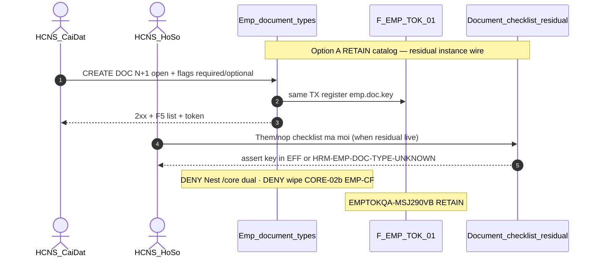

# PO-HRM-MVP-GD1-CORE-03-CLUSTER-SA-01 — Option/F.1 · Checklist giấy tờ động — RETAIN gap-only

| Field | Value |
|-------|--------|
| **work_item_id** | `PO-HRM-MVP-GD1-CORE-03-CLUSTER-SA-01` |
| **program** | `PO-HRM-MVP-GD1-CONTINUOUS` (**U89** — single GD continuous · **NO** phase split) |
| **lane** | governance · sa |
| **change_mode** | **ADD** Option/F.1 disposition · **gap-only** · **NO CODE** `apps/**` · **no seed** · **preserve_default** · **DENY** Nest `/core` dual · **DENY** wipe CORE-02b EMP-CF spine · **DENY** Nest `emp_custom_field` / mega-EAV reopen |
| **Date** | 2026-08-09 |
| **Status** | **CONFIRMED** · Option **A** **LOCKED** · unlock BA AC → (ba-data HOLD default) → API/FE residual only if BA proves closable gap → Dev |
| **depends_on** | QC-01 GWC Wave-17 UC-BP-CORE-02b **SEALED** — stamp `CORE02BQC1-MSLEFQC1` · evidence `docs/qa/evidence/po-hrm-mvp-gd1-core-02b-cluster-qc-01.md` · peer must_keep `CORE09DQC1-MSLDR8I3` / `CORE09CQC1-MSLBXMUT` / `CORE09BQC1-MSLB05DZ` / `CORE09AQC1-MSLA4LX9` / `CORE08QC1-MSL9BFFE` / `CORE02QC1-MSL80DU6` / `CORE01QC1-MSL6WMS7` · EMPCF `EMPCFQA-MSK14LUH` · EXT `EMPTOKEXTQA-MSJ57PE1` · DOC/ET MergeToken `EMPTOKQA-MSJ290VB` · EMP DOC/ET L1 `EMPPLATQA-MSIZXHIM` · **`R-PLT-EMP-CF-FE-01` P2 HOLD RETAIN** · printable **false** · personnel **false** |
| **uc_ids** | `UC-BP-CORE-03` |
| **board** | `docs/program/PO_HRM_MVP_GD1_CONTINUOUS.md` — seat **#20** after CORE-02b (#19 SEALED) |
| **ref_prior_emp_doc** | [`PO-HRM-DYNAMIC-CONFIG-PLATFORM-EMP-VERTICAL-SA-01.md`](./PO-HRM-DYNAMIC-CONFIG-PLATFORM-EMP-VERTICAL-SA-01.md) Option **B** EMP DOC+ET · DATA-01 · BE-01 · QA/QC L1 `EMPPLATQA-MSIZXHIM` · MergeToken EMP `EMPTOKQA-MSJ290VB` · FE Settings `EmpDocumentTypeSettingsPanel` — **RETAIN baseline · gap-only this seat** |
| **ref_sa_spine** | Peer EMP-CF [`PO-HRM-MVP-GD1-CORE-02B-CLUSTER-SA-01.md`](./PO-HRM-MVP-GD1-CORE-02B-CLUSTER-SA-01.md) · TPL [`…-09D-…`](./PO-HRM-MVP-GD1-CORE-09D-CLUSTER-SA-01.md) · VER/PDF [`…-09C-…`](./PO-HRM-MVP-GD1-CORE-09C-CLUSTER-SA-01.md) · pack+PREV [`…-09B-…`](./PO-HRM-MVP-GD1-CORE-09B-CLUSTER-SA-01.md) · CL [`…-09A-…`](./PO-HRM-MVP-GD1-CORE-09A-CLUSTER-SA-01.md) · RD [`…-08-…`](./PO-HRM-MVP-GD1-CORE-08-CLUSTER-SA-01.md) · C&B [`…-02-…`](./PO-HRM-MVP-GD1-CORE-02-CLUSTER-SA-01.md) · public [`…-01-…`](./PO-HRM-MVP-GD1-CORE-01-CLUSTER-SA-01.md) — **reuse · DENY reopen sealed J-HRM-CORE-02B-01..04 / 09D/09C/09B/09A/08/02/01 without regression** |
| **ref_honesty** | `recruitment_uat_ready=false` · `jd_dynamic_done=false` · **`contracts_printable_ready=false`** · **`hrm_personnel_uat_ready=false`** · personnel / CORE / CTR module UAT **false** · **DENY claim CORE-02b EMP-CF = personnel UAT / EMPCF DONE** · **DENY claim CORE-09d printable/closed-8 DONE** · **DENY claim EMP DOC L1 / TOK = CORE-03 / personnel DONE** |
| **ref_srs** | `SRS_HRM_ENTERPRISE.md` **FR-UC-BP-CORE-03** · Diễn biến checklist động · **Bổ sung cấu hình** open DOC/ET + TOK register-on-save · **AC-PLT-EMP-TOK-01..03** · **AC-PLT-EMP-01*** (position/dept) · program AC-PLT-EMP-02..06 (vertical) · **BR-BP-DOC-01** · **BR-PLT-01/02/04/05** · peers CORE-02b..01 (**must_keep**) · CORE-04 OCR **OUT** · CORE-07 activate = consumer peer (**≠** this seat DONE) |
| **ref_paper_api** | `API_DESIGN_HRM_ENTERPRISE.md` **F-EMP-CAT-DOC-01/02** · **F-EMP-CAT-ET-01/02** · **F-EMP-CAT-EFF-01/02** · **F-EMP-TOK-01/02** · footnote **F-CORE-CTR-01** checklist key ∈ EFF · **F-CORE-ACT-01** blocks_activation · RETAIN **F-EMP-CF-*** / **F-EMP-TOK-03** (CORE-02b) · CTR TPL/VER/PDF/PACK/PREV/CL · CORE-08/02/01 |
| **ref_db** | LIVE `public.emp_document_type` · `public.emp_employment_type` · `public.hrm_merge_tokens` (`origin=emp_catalog` · `emp.doc.*` / `emp.et.*`) · paper `hrm_document_checklist_item` (§3.5) — **instance SoT ABSENT Nest route AS-IS** · position/dept = settings-catalogs XBOS REF (**DENY** Nest `emp_position`) |
| **ref_code** | `employees.controller` DOC/ET routes · `emp-document-type.service` (+ `assertDocumentTypeInEffectiveCatalog` · F-EMP-TOK-01 same-TX) · `emp-employment-type.service` · `emp-merge-token-register.ts` · FE `EmpDocumentTypeSettingsPanel` · `Settings` tab `emp-document-types` · `CoreModule` = DB export only (**no** Nest `@Controller('core')` DOC dual) — **read-only cite** |
| **OUT** | Nest `/core` dual · wipe CORE-02b EMP-CF four catalogs / KEY / soft-draft · Nest `emp_custom_field` / mega-EAV · invent Nest `emp_position` · closed `document_type_key IN (…)` · hard-delete DOC · claim CORE-04 OCR · claim CORE-07 activate DONE · reopen CORE-02b/09d..01 · claim EMP DOC L1 = CORE-03 module DONE · seed · honesty flip |
| **Honesty** | all ready flags **false** · **C-SLICE** · U65 zero-seed |
| **ack_status** | **PASS_TO_PM** · Option A CONFIRMED |

---

## 1. Decision Context

| | |
|--|--|
| **Decision title** | Wave-18 architecture unlock: **dynamic document checklist** (required/optional · open DOC catalog · open ET · position/dept from group catalog · TOK register-on-save) vs AS-IS LIVE EMP DOC/ET/TOK + CORE-02b EMP-CF seals — **gap-only** for FR-UC-BP-CORE-03 |
| **Requestor** | PM · program `PO-HRM-MVP-GD1-CONTINUOUS` · U89 after CORE-02b QC-01 GWC (`CORE02BQC1-MSLEFQC1`) |
| **Date** | 2026-08-09 |
| **Decision owner** | SA |
| **Related requirements** | FR-UC-BP-CORE-03 · AC-PLT-EMP-TOK-* · AC-PLT-EMP-01* · F-EMP-CAT-DOC/ET/EFF · F-EMP-TOK-01/02 · must_keep CORE-02b EMP-CF · CORE-09d TPL+clause · CORE-09c VER/PDF ≠ printable · CORE-09b PREV ephemeral · CORE-09a CL · CORE-08 · CORE-02 · CORE-01 · Nest `/core` DENY · cite `EMPTOKQA-MSJ290VB` · `EMPPLATQA-MSIZXHIM` · `EMPCFQA-MSK14LUH` · `EMPTOKEXTQA-MSJ57PE1` RETAIN |

### 1.1 Problem to Solve

| | |
|--|--|
| **Current state (AS-IS LIVE)** | **CORE-02b SEALED (`CORE02BQC1-MSLEFQC1`):** EMP-CF four Settings catalogs + extension-items + invent KEY + soft-retire draft · Nest `/core` 0 · **≠** personnel UAT · **≠** EMPCF DONE · **`R-PLT-EMP-CF-FE-01` P2 HOLD**. **EMP DOC/ET baseline (RETAIN):** (1) SoT DOC = LIVE `emp_document_type` via `/api/hrm/employees/document-types*` (**F-EMP-CAT-DOC-01/02** · EFF-01) — open slug · `required_by_default` / `requires_expiry` / `blocks_activation` / `is_identity_doc` typed flags · soft retire · U19 scope — L1 seal **`EMPPLATQA-MSIZXHIM`**. (2) SoT ET = LIVE `emp_employment_type` via `/employees/employment-types*` (+ effective union REF). (3) Same-TX **F-EMP-TOK-01/02** → `emp.doc.<key>` / `emp.et.<key>` `origin=emp_catalog` — seal **`EMPTOKQA-MSJ290VB` RETAIN** (peer EXT `custom.emp.*` = CORE-02b / **`EMPTOKEXTQA-MSJ57PE1`** — **orthogonal · DENY wipe**). (4) FE Settings tabs DOC/ET LIVE (`EmpDocumentTypeSettingsPanel`). (5) Helper **`assertDocumentTypeInEffectiveCatalog`** LIVE — **consumer checklist/ACT wire = residual `R-PLT-EMP-01` (NOT wired)** — **no** Nest `document-checklist` route found. (6) Paper `hrm_document_checklist_item` / `GET …/document-checklist` = design SoT — **ABSENT Nest physical instance CRUD AS-IS**. (7) Position/dept = XBOS settings-catalogs pickers (**AC-PLT-EMP-01**) — Nest `emp_position` **ABSENT/DENIED**. (8) `apps/api/hrm-api/src/core/core.module.ts` = **HrmDbService export only** — **no** Nest DOC dual controller. |
| **Paper target** | FR-UC-BP-CORE-03: checklist động bắt buộc/tùy chọn; CRUD open DOC catalog; ET open; position/dept from group catalog; TOK register khi Lưu DOC/ET; nộp/xác nhận → đủ điều kiện CORE-07; thiếu bắt buộc chặn Hoạt động; OCR CORE-04 OUT. |
| **Gap class** | **GĐ1 continuous AC + journey residual on LIVE DOC/ET/TOK spine** — **not** greenfield dual: (1) board #20 needs Option lock mapping CORE-03 ↔ sealed F-EMP-CAT-* / TOK; (2) **checklist instance** mutate + ACT assert = **closable residual** (`R-PLT-EMP-01`) — BA must AC physical prefer path; (3) risk invent Nest `/core` dual / wipe EMP-CF / closed enum / Nest emp_position; (4) risk claim EMP DOC L1 / TOK = CORE-03 / personnel UAT DONE; (5) risk reopen CORE-02b/09d..01 / flip printable·personnel·recruitment; (6) risk invent Nest `emp_custom_field` as DOC symmetry. |
| **Constraints** | U89 continuous · **preserve** CORE-02b EMP-CF · CORE-09d TPL+clause · CORE-09c VER/PDF ≠ printable · CORE-09b PREV ephemeral · CORE-09a CL · CORE-08 · CORE-02 AuthZ/CB-403 · CORE-01 public · Nest `/core` DENY · EMP DOC/ET Option B · TOK DOC/ET seal · EMPCF/EXT seals · C-SLICE · DENY seed · **cấm code until Option CONFIRMED** · gap-only · **DENY** honesty flip |
| **Failure impact if unresolved** | Board #20 stalls or Dev invents Nest `/core` checklist dual / wipes EMP-CF / closed DOC enum; honesty flip; regression CORE-02b..01; false personnel UAT |

### 1.2 Architecture diagram (target — Option A)

```text
  UC-BP-CORE-01..09d + CORE-02b (SEALED must_keep)
  public · C&B · RD · CL · PACK+PREV ephemeral · VER/PDF · open TPL+clause · EMP-CF
  Nest /core DENY · printable false · closed-8 ≠ DONE · personnel false · C-SLICE
       │
       │  must_keep RETAIN — DENY reopen J-HRM-CORE-02B / 09D/09C/09B/09A/08/02/01
       ▼
  ┌────────────── FR-UC-BP-CORE-03 (this seat — gap-only RETAIN + residual wire) ──┐
  │                                                                                │
  │  DOC CATALOG SoT = emp_document_type (RETAIN LIVE)                             │
  │    GET/POST/PUT/PATCH/retire /api/hrm/employees/document-types*                │
  │    GET …/document-types/effective  → F-EMP-CAT-DOC-01/02 · EFF-01               │
  │    flags: required_by_default · requires_expiry · blocks_activation            │
  │    open slug · format-only CODE-INVALID · soft archive · U19                   │
  │                                                                                │
  │  ET CATALOG SoT = emp_employment_type (RETAIN LIVE)                            │
  │    /api/hrm/employees/employment-types* (+ effective)                          │
  │    open catalog · dual SoT REF employment_types ∪ tenant (BR-PLT-06)           │
  │                                                                                │
  │  F-EMP-TOK-01/02 RETAIN SEALED (EMPTOKQA-MSJ290VB)                             │
  │    same TX save DOC/ET → emp.doc.<key> / emp.et.<key> origin=emp_catalog       │
  │    DENY second register path · DENY reopen DOC TOK suite as wipe               │
  │                                                                                │
  │  Position / dept = XBOS settings-catalogs REF (AC-PLT-EMP-01) RETAIN           │
  │    DENY invent Nest emp_position / free-text SoT                               │
  │                                                                                │
  │  CHECKLIST INSTANCES (gap residual — R-PLT-EMP-01)                             │
  │    Paper: hrm_document_checklist_item · F-CORE-CTR-01 footnote                 │
  │    AS-IS: Nest document-checklist route ABSENT                                 │
  │    Helper LIVE: assertDocumentTypeInEffectiveCatalog (unwired consumers)       │
  │    BA unlock: AC physical prefer /employees/:id/document-checklist*            │
  │              (paper /core = alias only) · wire assert when EFF>0               │
  │              · status missing|submitted|approved · required flag               │
  │    CORE-07 ACT gate = peer residual cite F-CORE-ACT-01 — ≠ this seat DONE      │
  │                                                                                │
  │  must_keep CORE-02b EMP-CF (four catalogs + KEY + soft-draft + TOK-03)         │
  │    DENY wipe / reopen J-HRM-CORE-02B-01..04 · R-PLT-EMP-CF-FE-01 P2 HOLD       │
  │                                                                                │
  │  RETAIN: CORE-09d TPL+clause · 09c VER/PDF · 09b PREV ephemeral · 09a CL       │
  │          CORE-08 · CORE-02 · CORE-01 · Nest /core DENY                         │
  └────────────────────────────────────────────────────────────────────────────────┘
       │
       │  OUT this seat
       ▼
  Nest /core dual DOC/checklist            = DENY
  Wipe CORE-02b EMP-CF spine               = DENY
  Nest emp_custom_field / mega-EAV         = DENY
  Nest emp_position                        = DENY
  Closed document_type_key IN (…)          = DENY
  Flip personnel / printable / recruit     = DENY
  Claim EMP DOC L1 = CORE-03 module DONE   = DENY
  Claim CORE-02b = personnel / EMPCF DONE  = DENY
  Claim CORE-09d = printable / closed-8    = DENY
  CORE-04 OCR / CORE-07 activate DONE      = OUT / peer ≠ DONE

  Honesty: C-SLICE ≠ hrm_personnel_uat_ready · ≠ contracts_printable_ready
```

**Label lock:** «Checklist giấy tờ động» GĐ1 = **open DOC catalog + required/optional flags + ET open + position/dept REF + TOK register-on-save** + **checklist instance residual wire** — **not** Nest `/core` dual; not wipe EMP-CF; not OCR.  
**Spine lock:** Physical prefer `/api/hrm/employees/document-types*` · `/employment-types*` · (residual) `/employees/:id/document-checklist*` — paper `/core/…` = **alias only** — **DENY** Nest `/core` second SoT.  
**Honesty lock:** Slice GWC later **≠** auto-flip `hrm_personnel_uat_ready` · `contracts_printable_ready` · `recruitment_uat_ready` · `jd_dynamic_done` · **≠** claim EMP DOC L1 = CORE-03 / personnel UAT · **≠** claim CORE-02b = EMPCF/personnel DONE · **≠** claim CORE-09d printable / closed-8 DONE.

---

## 2. LIVE vs gap map (preserve_default)

| Capability | Paper (SRS / API) | AS-IS LIVE | Verdict |
|------------|-------------------|------------|---------|
| Open DOC catalog | F-EMP-CAT-DOC-01/02 · AC-PLT-EMP-02 class | `emp_document_type` · `/employees/document-types*` | **RETAIN** |
| Required / optional flags | `required_by_default` · `blocks_activation` | Typed cols LIVE on DOC | **RETAIN** |
| Effective DOC read | F-EMP-CAT-EFF-01 | `GET …/document-types/effective` | **RETAIN** |
| Soft-retire DOC | BR-PLT-04 · AC-03 class | retire + archived_at · history OK | **RETAIN** |
| Open ET catalog | F-EMP-CAT-ET-* | `/employees/employment-types*` | **RETAIN** |
| TOK register-on-save | F-EMP-TOK-01/02 · AC-PLT-EMP-TOK-01/02 | same-TX `emp.doc.*` / `emp.et.*` | **RETAIN** `EMPTOKQA-MSJ290VB` |
| Position / dept | AC-PLT-EMP-01* | settings-catalogs XBOS REF | **RETAIN** · DENY Nest emp_position |
| Checklist instance CRUD | FR Diễn biến #1–#2 · F-CORE-CTR-01 | **ABSENT** Nest route | **UNLOCK residual** R-PLT-EMP-01 · BA AC |
| Assert key ∈ EFF | BR-PLT-02 · HRM-EMP-DOC-TYPE-UNKNOWN | Helper LIVE · **unwired** | **UNLOCK residual** wire |
| Activate gate CORE-07 | F-CORE-ACT-01 · Thành công CORE-03 | Peer CORE-07 | **OUT invent DONE** · cite residual |
| OCR | CORE-04 | OUT MVP | **OUT** |
| CORE-02b EMP-CF | must_keep | SEALED `CORE02BQC1-MSLEFQC1` | **must_keep RETAIN** · DENY wipe |
| CORE-09d TPL+clause | must_keep | SEALED | **must_keep** · DENY printable/closed-8 |
| CORE-09c VER/PDF | must_keep ≠ printable | SEALED | **must_keep** |
| PREV ephemeral | CORE-09b | SEALED | **must_keep** |
| Nest `/core` | paper alias | CoreModule = DB only | **DENY** dual |
| Module / honesty | program | C-SLICE | **DENY flip** |

---

## 3. Options

### Option A — ACCEPT_AS_IS_RETAIN: LIVE DOC/ET/TOK + flags as CORE-03 catalog spine · unlock checklist-instance residual only (RECOMMENDED)

| | |
|--|--|
| **Description** | **Preserve** CORE-02b F-EMP-CF-01..03 + F-EMP-TOK-03 + CNS invent KEY + soft-draft (**≠** personnel UAT · **≠** EMPCF DONE · **`R-PLT-EMP-CF-FE-01` P2 HOLD**). **Preserve** CORE-09d F-CORE-CTR-TPL-01/02 (+ PUT …/clauses) · CORE-09c VER/PDF (**≠** printable) · CORE-09b PACK+PREV **ephemeral** · CORE-09a CL · CORE-08 · CORE-02 AuthZ/CB-403 · CORE-01 public · Nest `/core` DENY. **Preserve** sealed EMP DOC/ET: LIVE **`emp_document_type` / `emp_employment_type`** on physical `/api/hrm/employees/document-types*` · `/employment-types*` (**F-EMP-CAT-DOC/ET/EFF**); typed **required/optional / blocks_activation** flags; **F-EMP-TOK-01/02** `emp.doc.*` / `emp.et.*` (**cite** `EMPTOKQA-MSJ290VB`); L1 seal **`EMPPLATQA-MSIZXHIM`**. **Position/dept** = XBOS settings-catalogs (**AC-PLT-EMP-01**) — **DENY** Nest `emp_position`. **Checklist instances:** AS-IS Nest route **ABSENT** — treat as **IN-SCOPE residual** `R-PLT-EMP-01`: BA AC pack for physical prefer `GET/POST/PATCH /api/hrm/employees/:id/document-checklist*` (paper `/core` alias only) · wire `assertDocumentTypeInEffectiveCatalog` when EFF>0 → `HRM-EMP-DOC-TYPE-UNKNOWN` · statuses missing\|submitted\|approved · required from catalog default · history may hold retired keys · **DENY** hard FK GĐ1 · **DENY** invent Nest `/core` dual · ba-data HOLD until BA proves table/ensureSchema gap vs paper §3.5. **CORE-07** activate gate = **peer residual** cite F-CORE-ACT-01 — **≠** claim DONE this seat. Paper `/core/…` = **alias only**. **DENY** wipe EMP-CF · Nest emp_custom_field / mega-EAV · closed DOC enum · reopen sealed J-HRM-CORE-02B-01..04 / 09D/09C/09B/09A/08/02/01 · flip honesty · claim EMP DOC L1 = CORE-03 / personnel DONE · claim CORE-02b = personnel/EMPCF DONE · claim CORE-09d printable/closed-8 DONE. |
| **Benefits** | Aligns FR-03 catalog+TOK with LIVE seals; isolates instance wire as measurable residual; zero Nest `/core` dual; preserves W10–W17 + EMP DOC/TOK + EMP-CF must_keep; unlocks U89 #20 BA without greenfield wipe |
| **Costs** | BA AC O1–O12 + U65 journey mint; ba-data HOLD default; optional BE/FE residual only after BA proves instance gap closable |
| **Risks** | Dev invents Nest `/core` checklist / wipes EMP-CF / closed enum — **mitigate:** DENY + O locks; false DONE from EMP DOC L1 — **mitigate:** C-SLICE + O10 |

### Option B — Nest `/core` dual DOC/checklist · OR wipe CORE-02b EMP-CF · OR closed DOC enum · OR Nest emp_position / mega-EAV

| | |
|--|--|
| **Description** | Implement paper `/api/hrm/core/…` as primary DOC/checklist SoT; **or** abandon `/employees/document-types*` for Nest dual; **or** wipe Settings EMP-CF four catalogs for «symmetry»; **or** `CHECK document_type_key IN (starter)`; **or** invent Nest `emp_position` / mega-EAV FormSchema for checklist. |
| **Benefits** | Illusion of Nest `/core` symmetry with paper stubs |
| **Costs** | Dual writers · reopen EMP DOC/TOK + CORE-02b GWC · ba-data EXPAND · FE rewrite · U89 delay |
| **Risks** | Violates DENY Nest `/core` · wipe EMP-CF · BR-PLT-05 · seal reopen — **REJECT** |

### Option C — HOLD / EMP DOC L1 = CORE-03 DONE / honesty flip / reopen CORE-02b/09d seals

| | |
|--|--|
| **Description** | Treat EMP DOC L1 GWC or TOK seal or Settings DOC panel as FR-UC-BP-CORE-03 complete without GĐ1 BA AC / J-* / instance residual disposition; **or** HOLD board; **or** flip `hrm_personnel_uat_ready` / `contracts_printable_ready` / recruitment; **or** reopen sealed J-HRM-CORE-02B/09D/09C/09B/09A/08/02/01; **or** claim CORE-02b = personnel/EMPCF DONE · claim CORE-09d printable/closed-8 DONE. |
| **Benefits** | Short-term idle / false DONE |
| **Costs** | Board #20 false seal or stuck; honesty break; R-PLT-EMP-01 orphan |
| **Risks** | C-SLICE violation · sponsor idle · printable/personnel flip — **REJECT** |

---

## 4. Trade-off Matrix

| Criteria | Weight | Option A | Option B | Option C |
|----------|-------:|:--------:|:--------:|:--------:|
| Business value (FR-CORE-03 + AC-PLT-EMP-TOK / DOC open) | 25 | **9** | 3 | 2 |
| Time to deliver (U89 continuous) | 20 | **9** | 1 | 2 |
| Complexity / blast radius | 15 | **8** | 1 | 4 |
| Security / seals CORE-02b..01 + EMP DOC/TOK + EMPCF/EXT + U19 | 15 | **9** | 1 | 1 |
| Reliability (ONE DOC SoT · no Nest `/core` · no EMP-CF wipe) | 15 | **9** | 1 | 2 |
| Maintainability (RETAIN LIVE · gap-only · peer seals) | 10 | **9** | 1 | 2 |
| **Weighted (≈)** | 100 | **8.85** | **1.40** | **2.10** |

---

## 5. Failure Modes and Mitigation

| Option | Failure mode | Detection | Mitigation |
|--------|--------------|-----------|------------|
| A | Nest `/core` second DOC/checklist SoT | Route grep · browser hits | **DENY** dual · paper alias only |
| A | Wipe CORE-02b EMP-CF / reopen J-02B | Diff Settings / journeys | **must_keep** `CORE02BQC1-MSLEFQC1` · O8 |
| A | Closed `document_type_key IN (…)` | Schema grep | **DENY** · BR-PLT-05 · O3 |
| A | Invent Nest `emp_position` | New table/routes | **DENY** · AC-PLT-EMP-01 · O5 |
| A | Claim EMP DOC L1 = CORE-03 / personnel UAT | Honesty review | **DENY** · O10 · C-SLICE |
| A | Claim CORE-02b = EMPCF/personnel DONE | QC honesty | **DENY** · must_keep 02b stamp |
| A | Claim CORE-09d = printable / closed-8 DONE | QC honesty | **DENY** · must_keep 09d stamp |
| A | Invent Nest emp_custom_field as DOC twin | Schema/routes | **DENY** mega-EAV / field-def Nest |
| A | Skip instance residual → false «checklist DONE» | BA O6 | Explicit residual R-PLT-EMP-01 |
| A | Seed DOC density for UF | QA evidence | **DENY** seed U65 |
| A | Wire ACT/CORE-07 as this seat DONE | Scope creep | OUT invent DONE · peer CORE-07 |
| B | Dual SoT / wipe EMP-CF | Integration | Reject B |
| C | Board idle / false DONE / honesty flip | U89 | Reject C |

---

## 6. Decision

| | |
|--|--|
| **Selected option** | **Option A** — **ACCEPT_AS_IS_RETAIN**: LIVE F-EMP-CAT-DOC/ET/EFF + F-EMP-TOK-01/02 + required/optional flags as CORE-03 catalog spine; position/dept XBOS REF; unlock checklist-instance residual `R-PLT-EMP-01` for BA AC only; paper `/core` alias only; **RETAIN** CORE-02b EMP-CF · CORE-09d..01 · Nest `/core` DENY; **DENY** wipe EMP-CF · closed enum · Nest emp_position · honesty flip · reopen seals · claim EMP DOC L1 = CORE-03 DONE · claim CORE-02b = personnel/EMPCF DONE · claim CORE-09d printable/closed-8 DONE |
| **Why selected** | AS-IS already implements FR-03 **catalog + flags + TOK + ET + position REF** spine; remaining gap is **instance wire + U65 journeys** under U89 — not greenfield Nest `/core`, not EMP-CF wipe; preserves W10–W17 + EMP DOC/TOK + EMP-CF must_keep; unlocks board #20 |
| **Assumptions** | EMP DOC/ET L1 **`EMPPLATQA-MSIZXHIM` RETAIN**. DOC/ET TOK **`EMPTOKQA-MSJ290VB` RETAIN**. CORE-02b **`CORE02BQC1-MSLEFQC1` RETAIN** · EMPCF **`EMPCFQA-MSK14LUH`** · EXT **`EMPTOKEXTQA-MSJ57PE1`** · FE CTA **`R-PLT-EMP-CF-FE-01` P2 HOLD**. CORE-09d **`CORE09DQC1-MSLDR8I3` RETAIN**. CORE-09c..01 stamps **RETAIN**. Nest `/core` DENY **RETAIN**. `hrm_personnel_uat_ready=false` · `contracts_printable_ready=false` · `recruitment_uat_ready=false` · `jd_dynamic_done=false`. Checklist Nest instance route **ABSENT** (grep 2026-08-09). |
| **Rejected** | **B** — Nest `/core` dual / wipe EMP-CF / closed enum / Nest emp_position / mega-EAV · **C** — HOLD / EMP DOC L1=CORE-03 DONE / honesty flip / reopen sealed |

### 6.1 OPEN decisions for BA (lockable — not invent)

| ID | Topic | SA default (Option A) | BA must CONFIRM |
|----|-------|----------------------|-----------------|
| **O1** | Physical path DOC/ET | Prefer `/api/hrm/employees/document-types*` · `/employment-types*`; any `/core/…` = alias / DOC-DELTA only — **DENY** Nest `/core` dual | Cite Network Settings DOC/ET |
| **O2** | Required / optional | Catalog flags `requiredByDefault` / `blocksActivation` / `requiresExpiry` = SoT defaults for new checklist lines — **DENY** FE hardcode starter set | Map FR-03 «Bắt buộc?» → flags + instance `required` |
| **O3** | Open catalog | N+1 slug format-only · **DENY** closed enum / reject «not in starter» | AC-PLT-EMP-02 class · BR-PLT-05 |
| **O4** | Token register | Same save DOC/ET → `emp.doc.*` / `emp.et.*` via **F-EMP-TOK-01/02** — **RETAIN smoke** cite `EMPTOKQA-MSJ290VB` · **FORBIDDEN** reopen as wipe · **orthogonal** to CORE-02b `custom.emp.*` EXT | AC-PLT-EMP-TOK-01/02 |
| **O5** | Position / dept | XBOS settings-catalogs REF only (**AC-PLT-EMP-01***) — **DENY** Nest `emp_position` / free-text SoT | Cite position picker AC |
| **O6** | Checklist instances | Residual **R-PLT-EMP-01** IN-SCOPE: prefer `/employees/:id/document-checklist*` · wire assert EFF>0 → `HRM-EMP-DOC-TYPE-UNKNOWN` · statuses missing\|submitted\|approved · history retired keys OK · ba-data HOLD until gap proven vs §3.5 — **DENY** Nest `/core` dual · **DENY** claim catalog-only = full Diễn biến DONE without AC disposition | Explicit AC ids + empty EFF CTA (no seed) |
| **O7** | Soft-retire DOC | Soft hide picker + soft TOK · history checklist OK — **DENY** hard-delete | AC-PLT-EMP-03 class |
| **O8** | CORE-02b must_keep | Four catalogs + invent KEY + soft-draft + TOK-03 + **`R-PLT-EMP-CF-FE-01` P2 HOLD** — **FORBIDDEN** wipe / reopen J-HRM-CORE-02B-01..04 | Footer every evidence |
| **O9** | CORE-07 / OCR | Activate gate = peer F-CORE-ACT-01 residual · OCR CORE-04 **OUT** — **≠** this seat DONE | Explicit OUT |
| **O10** | Honesty / peers OUT | All ready flags false · C-SLICE · **DENY** flip personnel/printable/recruitment/jd · **DENY** claim EMP DOC L1 = CORE-03/personnel DONE · **DENY** claim CORE-02b = EMPCF/personnel DONE · **DENY** claim CORE-09d printable/closed-8 DONE · **must_keep** CORE-02b..01 · Nest DENY | Footer every evidence |
| **O11** | Display-ready | DOC DTO: key · nameVi · sortOrder · flags · status · source · catalogKind · optional token_key display | FE bind Settings + checklist picker |
| **O12** | Journeys | Mint **J-HRM-CORE-03-01..0n DRAFT** (Settings DOC N+1 → F5 → TOK emp.doc.* → checklist pick new key · invent unknown KEY fail when EFF>0 · retire hide · instance submit/confirm if O6 unlocks) · **DENY** reopen sealed J-HRM-CORE-02B/09D/09C/09B/09A/08/02/01 | Journey map delta |

### 6.2 API_DESIGN F.1 map (cite RETAIN — residual unlock only if BA proves)

| ID | METHOD / path (physical) | Mục đích | Nghiệp vụ (tóm tắt) | Bước SRS | Disposition |
|----|--------------------------|----------|---------------------|----------|-------------|
| **F-EMP-CAT-DOC-01** | `GET /api/hrm/employees/document-types` · `GET …/:id` · `GET …/effective` | List/get/effective DOC open catalog | Scope · active · empty 200[] · U19 | FR-03 cấu hình · AC-02 | **RETAIN cite** |
| **F-EMP-CAT-DOC-02** | `POST/PUT …/document-types` · `PATCH …/:id` · `POST …/:id/retire` | CRUD + soft-retire DOC | Open slug · flags · UQ · soft archive · same TX TOK | FR-03 · AC-02/03 · TOK-01 | **RETAIN cite** |
| **F-EMP-CAT-ET-01/02** | `/api/hrm/employees/employment-types*` (+ effective) | Open ET catalog | Dual SoT REF∪tenant · soft retire · TOK-02 | FR-03 ET · TOK-02 | **RETAIN cite** |
| **F-EMP-CAT-EFF-01** | (effective DOC) | Picker / assert source | Active rows only | BR-PLT-02 | **RETAIN cite** |
| **F-EMP-TOK-01** | Side-effect in DOC-02 | Đăng ký trường trộn DOC | `emp.doc.<key>` · origin=emp_catalog · rollback on fail | AC-PLT-EMP-TOK-01 | **RETAIN SEALED** `EMPTOKQA-MSJ290VB` |
| **F-EMP-TOK-02** | Side-effect in ET-02 | Đăng ký trường trộn ET | `emp.et.<key>` · origin=emp_catalog | AC-PLT-EMP-TOK-02 | **RETAIN SEALED** |
| **F-CORE-CHK-01** *(residual name)* | Prefer `GET/POST/PATCH /api/hrm/employees/:id/document-checklist*` | Instance checklist hồ sơ | Key ∈ EFF when >0 · required/status/file · soft history | FR-03 Diễn biến #1–#2 | **UNLOCK residual** — BA AC · ba-data HOLD · **DENY** Nest `/core` invent as primary |
| **Assert helper** | `assertDocumentTypeInEffectiveCatalog` | Consumer gate | EFF=0 soft allow · EFF>0 unknown → `HRM-EMP-DOC-TYPE-UNKNOWN` | BR-PLT-02 | **RETAIN helper** · **wire residual** |
| **F-CORE-ACT-01** | Activate employee | Chặn thiếu bắt buộc | blocks_activation / required | FR-03 Thành công · CORE-07 | **must_keep cite peer** · **OUT invent DONE** |
| **F-EMP-CF-01..03 / TOK-03 / CNS** | settings-catalogs + employees custom_fields | must_keep CORE-02b | Four catalogs · KEY · soft-draft | peer 02b | **must_keep** · **DENY wipe** |
| **F-CORE-CTR-TPL/VER/PDF/PACK/PREV/CL** | contracts-insurance* | must_keep 09d..09a | Open TPL · ≠ printable · PREV ephemeral | peers | **must_keep** |
| **F-CORE-RD / EMP-02 / EMP-01** | rewards · packages · employees public | must_keep 08/02/01 | AuthZ · CB-403 · public | peers | **must_keep** |

**FORBIDDEN GĐ1 invent:** Nest `@Controller('core')` DOC/checklist dual SoT · wipe `/settings-catalogs*` EMP-CF · Nest `emp_custom_field` · closed `document_type_key IN (…)` · Nest `emp_position` · hard-delete DOC · claim CORE-04 OCR · claim CORE-07 DONE from this seat alone.



---

## 7. must_keep / DENY locks (this seat)

| Lock | Rule |
|------|------|
| **L-CORE-03-01 DOC SoT** | DOC = LIVE `emp_document_type` on `/employees/document-types*` — **FORBIDDEN** Nest `/core` second SoT |
| **L-CORE-03-02 Open catalog** | Open slug format-only — **FORBIDDEN** `CHECK document_type_key IN (…)` |
| **L-CORE-03-03 Flags** | `required_by_default` / `blocks_activation` / `requires_expiry` typed SoT — **FORBIDDEN** FE starter closed list as SoT |
| **L-CORE-03-04 TOK** | Register = **F-EMP-TOK-01/02** only — **RETAIN** `EMPTOKQA-MSJ290VB` — **FORBIDDEN** second token table |
| **L-CORE-03-05 ET** | ET open catalog LIVE — **RETAIN** dual SoT REF∪tenant pattern |
| **L-CORE-03-06 Position/dept** | XBOS settings-catalogs — **FORBIDDEN** Nest `emp_position` |
| **L-CORE-03-07 Instance residual** | Checklist instances = **R-PLT-EMP-01** unlock via BA — **FORBIDDEN** claim catalog L1 alone = FR-03 Diễn biến DONE without O6 disposition |
| **L-CORE-03-08 CORE-02b EMP-CF** | Four catalogs + KEY + soft-draft + TOK-03 + FE P2 HOLD **RETAIN** — **FORBIDDEN** wipe / reopen J-HRM-CORE-02B-01..04 · **FORBIDDEN** invent Nest emp_custom_field |
| **L-CORE-03-09 CORE-09d** | TPL+clause **RETAIN** — **FORBIDDEN** claim printable / closed-8 DONE · **FORBIDDEN** reopen J-HRM-CORE-09D-01..04 without regression |
| **L-CORE-03-10 CORE-09c** | VER/PDF **RETAIN** — **FORBIDDEN** claim = printable DONE |
| **L-CORE-03-11 CORE-09b** | PACK+PREV ephemeral **RETAIN** — **FORBIDDEN** PREV→INSERT VER |
| **L-CORE-03-12 CORE-09a/08/02/01** | CL · RD · C&B AuthZ · public **RETAIN** stamps |
| **L-CORE-03-13 Honesty** | **DENIED** flip `recruitment_uat_ready` · `jd_dynamic_done` · `contracts_printable_ready` · `hrm_personnel_uat_ready` · module CORE/CTR/personnel UAT · Phase1 · claim EMP DOC L1 = CORE-03 module DONE · claim CORE-02b = EMPCF/personnel DONE |
| **L-CORE-03-14 Seed** | **DENIED** U65 seed for density / UF |
| **L-CORE-03-15 Scope** | Same `resolveHrmListScope` DOC list↔get↔mutate↔assert (**U19**) |
| **L-CORE-03-16 Soft-delete** | Soft retire only — **FORBIDDEN** hard-delete when history checklist exists |

---

## 8. Rollout / unlock

```text
CORE-03-CLUSTER-SA-01 (this) CONFIRMED · Option A LOCKED
  → ba-process: PO-HRM-MVP-GD1-CORE-03-CLUSTER-BA-01 AC pack (O1–O12)
  → ba-data: HOLD default (instance table/ensureSchema ONLY if O6 gap proven vs LIVE/paper §3.5)
  → (after BA/data) sa API RETAIN cite F-EMP-CAT-* / TOK + residual F-CORE-CHK-01 if wire gap proven
  → Dev: cấm until contracts CONFIRMED · DENY Nest /core dual · DENY wipe EMP-CF · DENY closed enum
  → QA U65 J-HRM-CORE-03-* · cite EMP DOC/TOK + CORE-02b retain · must_keep CORE-09d..01
  → QC narrow C-SLICE — DENY personnel/printable/module UAT
```

**cấm code until Option CONFIRMED** — this seat = docs-only Option lock.

---

## 9. Validation / acceptance evidence plan

| Gate | Evidence |
|------|----------|
| SA Option | This file · Option A LOCKED · PASS_TO_PM |
| BA | O1–O12 CONFIRM · map Diễn biến + AC-PLT-EMP-TOK/01/DOC · mint J-HRM-CORE-03-* DRAFT · residual R-PLT-EMP-01 disposition |
| ba-data | HOLD unless O6 unlocks physical instance |
| API | RETAIN cite F-EMP-CAT-* / TOK; residual CHK only if gap proven |
| QA | U65 browser: Settings DOC N+1 → F5 → TOK emp.doc.* → (if unlocked) checklist pick/assert · Nest `/core` 0 · no seed |
| QC | C-SLICE GWC only · honesty false · must_keep CORE-02b/09d..01 |
| NFR | Prefer `@xevn/platform-core` on any future Nest residual — **no** RLS invent · cite `NFR_OBSERVABILITY_SECURITY_BASELINE.md` |

---

## 10. Handoff

| Field | Value |
|-------|--------|
| **completion_report** | Option **A LOCKED** for UC-BP-CORE-03: gap-only **RETAIN** LIVE F-EMP-CAT-DOC/ET/EFF + required/optional flags + F-EMP-TOK-01/02 (`EMPTOKQA-MSJ290VB`) + position/dept XBOS REF; checklist **instance** = residual **R-PLT-EMP-01** unlock for BA (Nest checklist route ABSENT; assert helper LIVE unwired); **must_keep** CORE-02b EMP-CF (`CORE02BQC1-MSLEFQC1` · EMPCF/EXT · FE P2 HOLD) · CORE-09d TPL+clause · 09c VER/PDF ≠ printable · 09b PREV ephemeral · 09a CL · 08 · 02 · 01 · Nest `/core` DENY; **REJECT** B (Nest `/core` dual / wipe EMP-CF / closed enum / Nest emp_position / mega-EAV) · **REJECT** C (HOLD / L1=CORE-03 DONE / honesty flip / reopen seals); **DENY** claim EMP DOC L1 = CORE-03/personnel DONE · claim CORE-02b = EMPCF/personnel DONE · claim CORE-09d printable/closed-8 DONE · seed · apps/**; unlock **ba-process** AC next — **cấm code** until contracts. |
| **next_owner** | `ba-process` |
| **next_dispatch_prompt** | See §11 |
| **evidence_path** | `docs/program/specs/PO-HRM-MVP-GD1-CORE-03-CLUSTER-SA-01.md` |
| **ack_status** | **PASS_TO_PM** |

---

## 11. next_dispatch_prompt (copy-ready)

```text
work_item_id: PO-HRM-MVP-GD1-CORE-03-CLUSTER-BA-01
lane: governance · ba-process
program: PO-HRM-MVP-GD1-CONTINUOUS (U89 — single GĐ continuous)
uc_ids: UC-BP-CORE-03
depends_on: SA-01 Option A LOCKED · docs/program/specs/PO-HRM-MVP-GD1-CORE-03-CLUSTER-SA-01.md · peer QC CORE02BQC1-MSLEFQC1 · CORE09DQC1-MSLDR8I3 / CORE09CQC1-MSLBXMUT / CORE09BQC1-MSLB05DZ / CORE09AQC1-MSLA4LX9 / CORE08QC1-MSL9BFFE / CORE02QC1-MSL80DU6 / CORE01QC1-MSL6WMS7 · EMPPLATQA-MSIZXHIM · EMPTOKQA-MSJ290VB · EMPCFQA-MSK14LUH · EMPTOKEXTQA-MSJ57PE1 must_keep · R-PLT-EMP-CF-FE-01 P2 HOLD RETAIN
board: docs/program/PO_HRM_MVP_GD1_CONTINUOUS.md — #20 UC-BP-CORE-03
spec_ref: SRS FR-UC-BP-CORE-03 · Diễn biến checklist động · AC-PLT-EMP-TOK-01..03 · AC-PLT-EMP-01* · program AC-PLT-EMP-02..06 · SA Option A O1–O12 · F-EMP-CAT-DOC/ET/EFF · F-EMP-TOK-01/02 · residual R-PLT-EMP-01 checklist instances · must_keep CORE-02b EMP-CF · CORE-09d TPL+clause · CORE-09c VER/PDF ≠ printable · CORE-09b PREV ephemeral · CORE-09a CL · CORE-08 · CORE-02 · CORE-01 · Nest /core DENY

MISSION — BA AC pack (narrow):
1) CONFIRM O1–O12 from SA-01 Option A (physical prefer /employees/document-types* · open DOC+flags · ET open · TOK emp.doc/et · position/dept XBOS · residual checklist instances R-PLT-EMP-01 · soft-retire · CORE-02b must_keep · CORE-07/OCR OUT · honesty · display-ready · J-HRM-CORE-03-* DRAFT)
2) Map Diễn biến FR-UC-BP-CORE-03 + Bổ sung cấu hình → AC rows (catalog CRUD · TOK · picker · instance submit/confirm if O6 · invent KEY fail · retire) — cite LIVE Network paths; DENY invent Nest /core dual
3) Disposition R-PLT-EMP-01: IN-SCOPE residual vs OUT with rationale; ba-data HOLD default unless physical gap proven
4) must_keep CORE-02b EMP-CF RETAIN · CORE-09d..01 · DENY wipe EMP-CF · DENY reopen sealed J-HRM-CORE-02B/09D/09C/09B/09A/08/02/01 · DENY flip recruitment_uat_ready / jd_dynamic_done / contracts_printable_ready / hrm_personnel_uat_ready · DENY claim EMP DOC L1 = CORE-03/personnel DONE · DENY claim CORE-02b = EMPCF/personnel DONE · DENY claim CORE-09d printable/closed-8 DONE · DENY seed · DENY apps/**

exit: evidence docs/program/specs/PO-HRM-MVP-GD1-CORE-03-CLUSTER-BA-01.md · PASS_TO_PM · next ba-data HOLD (or sa API if BA proves wire-only)
cấm: honesty flip · Nest /core dual · wipe CORE-02b · Nest emp_custom_field · closed DOC enum · Nest emp_position · seed · code · claim module UAT
Provide completion_report, next_owner, next_dispatch_prompt.
```

---

## 12. SA lesson (append KB)

- **Context:** U89 after CORE-02b GWC (`CORE02BQC1-MSLEFQC1`) · board #20 UC-BP-CORE-03.
- **Action:** Option A gap-only RETAIN LIVE DOC/ET/TOK + flags; checklist instances = residual R-PLT-EMP-01; DENY Nest `/core` dual / wipe EMP-CF / closed enum / honesty flip.
- **Outcome:** PASS_TO_PM · unlock ba-process BA-01.
- **Evidence:** this file.
- **Reuse-tag:** `core-03-doc-checklist-retain-option-a`, `deny-core-nest-dual`, `deny-empcf-wipe`, `r-plt-emp-01-residual`, `deny-personnel-uat`, `deny-printable-flip`, `u89-wave18-unlock`, `path-lock-nfd`
