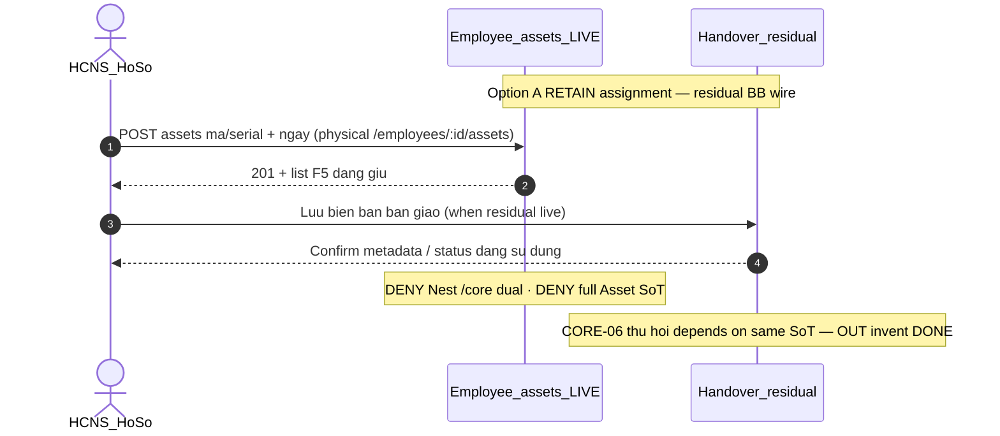

# PO-HRM-MVP-GD1-CORE-05-CLUSTER-SA-01 — Option/F.1 · Cấp phát tài sản & biên bản bàn giao — RETAIN gap-only

| Field | Value |
|-------|--------|
| **work_item_id** | `PO-HRM-MVP-GD1-CORE-05-CLUSTER-SA-01` |
| **program** | `PO-HRM-MVP-GD1-CONTINUOUS` (**U89** — single GD continuous · **NO** phase split) |
| **lane** | governance · sa |
| **change_mode** | **ADD** Option/F.1 disposition · **gap-only** · **NO CODE** `apps/**` · **no seed** · **preserve_default** · **DENY** Nest `/core` dual · **DENY** wipe CORE-03 DOC/ET/CHK · **DENY** wipe CORE-02b EMP-CF · **DENY** full accounting Asset module invent |
| **Date** | 2026-08-09 |
| **Status** | **CONFIRMED** · Option **A** **LOCKED** · unlock BA AC → (ba-data HOLD default) → API/FE residual only if BA proves closable gap → Dev |
| **depends_on** | QC-01 GWC Wave-18 UC-BP-CORE-03 **SEALED** — stamp `CORE03QC1-MSLFJH0K` · evidence `docs/qa/evidence/po-hrm-mvp-gd1-core-03-cluster-qc-01.md` · peer must_keep `CORE02BQC1-MSLEFQC1` / `CORE09DQC1-MSLDR8I3` / `CORE09CQC1-MSLBXMUT` / `CORE09BQC1-MSLB05DZ` / `CORE09AQC1-MSLA4LX9` / `CORE08QC1-MSL9BFFE` / `CORE02QC1-MSL80DU6` / `CORE01QC1-MSL6WMS7` · EMP DOC/ET L1 `EMPPLATQA-MSIZXHIM` · MergeToken EMP `EMPTOKQA-MSJ290VB` · **`R-CORE-03-CC-EMBED-OBS` P2 optional RETAIN idle-ok** · printable **false** · personnel **false** |
| **uc_ids** | `UC-BP-CORE-05` |
| **board** | `docs/program/PO_HRM_MVP_GD1_CONTINUOUS.md` — seat **#21** after CORE-03 (#20 SEALED) · CORE-04 **OUT** · CORE-06/07 remain **QUEUED** after 05 |
| **ref_sa_spine** | Checklist [`PO-HRM-MVP-GD1-CORE-03-CLUSTER-SA-01.md`](./PO-HRM-MVP-GD1-CORE-03-CLUSTER-SA-01.md) · EMP-CF [`…-02B-…`](./PO-HRM-MVP-GD1-CORE-02B-CLUSTER-SA-01.md) · TPL [`…-09D-…`](./PO-HRM-MVP-GD1-CORE-09D-CLUSTER-SA-01.md) · VER/PDF [`…-09C-…`](./PO-HRM-MVP-GD1-CORE-09C-CLUSTER-SA-01.md) · pack+PREV [`…-09B-…`](./PO-HRM-MVP-GD1-CORE-09B-CLUSTER-SA-01.md) · CL [`…-09A-…`](./PO-HRM-MVP-GD1-CORE-09A-CLUSTER-SA-01.md) · RD [`…-08-…`](./PO-HRM-MVP-GD1-CORE-08-CLUSTER-SA-01.md) · C&B [`…-02-…`](./PO-HRM-MVP-GD1-CORE-02-CLUSTER-SA-01.md) · public [`…-01-…`](./PO-HRM-MVP-GD1-CORE-01-CLUSTER-SA-01.md) — **reuse · DENY reopen sealed J-HRM-CORE-03-01..05 / J-HRM-CORE-02B / J-HRM-CORE-09D..01 without regression** |
| **ref_honesty** | `recruitment_uat_ready=false` · `jd_dynamic_done=false` · **`contracts_printable_ready=false`** · **`hrm_personnel_uat_ready=false`** · personnel / CORE / CTR module UAT **false** · **DENY claim CORE-03 checklist = personnel UAT / EMP DOC L1 DONE** · **DENY claim CORE-07 activation DONE** · **DENY claim printable/closed-8 DONE** · **DENY invent CORE-06 DONE** |
| **ref_srs** | `SRS_HRM_ENTERPRISE.md` **FR-UC-BP-CORE-05** · Diễn biến cấp phát + biên bản · **BR-BP-AST-01** · danh mục tài sản/serial tenant · MVP ≠ full kế toán · UC kế **CORE-06** thu hồi (**depends on CORE-05 SoT · ≠ invent DONE**) · peers CORE-03..01 (**must_keep**) · CORE-04 OCR **OUT** · CORE-07 activate = peer (**≠** this seat DONE) |
| **ref_adr** | `ADR-HRM-4-PILLAR-API-BOUNDARY.md` **§11 Q-ASSET-MODULE** — GĐ1 **assignment stub** (mã/serial + BB + status) · **Không** SoT kho/CCDC toàn tập đoàn · full Asset SoT phase sau |
| **ref_paper_api** | `API_DESIGN_HRM_ENTERPRISE.md` **F-CORE-AST-01** (paper path `/api/hrm/core/employees/{id}/assets` · assignment stub) · **F-CORE-AST-02** = CORE-06 peer **OUT invent DONE** · must_keep F-CORE-CHK-01 · F-EMP-CAT-DOC/ET/EFF · F-EMP-TOK · F-EMP-CF · CTR TPL/VER/PDF/PACK/PREV/CL · CORE-08/02/01 |
| **ref_db** | LIVE `public.employee_assets` (ensureSchema in `employee-profile.service`) — physical alias of paper `hrm_asset_assignment` / `employee_asset_assignments` · paper `hrm_asset_handover` **ABSENT Nest AS-IS** · **DENY** invent full Asset ledger tables this seat |
| **ref_code** | `employees.controller` `GET/POST/PATCH/DELETE :employeeId/assets*` · `employee-profile.service` list/create/update/deleteAsset · FE `EmployeeAssets` + `hrmApi.listEmployeeAssets*` · Profile tab `assets` · `CoreModule` = DB export only (**no** Nest `@Controller('core')` AST dual) — **read-only cite** |
| **OUT** | Nest `/core` dual · wipe CORE-03 DOC/ET/CHK · wipe CORE-02b EMP-CF · full accounting Asset / kho / depreciation invent · invent CORE-06 return-checklist DONE · invent CORE-07 DONE · reopen CORE-03/02b/09d..01 · claim CORE-03 = personnel UAT · seed · honesty flip |
| **Honesty** | all ready flags **false** · **C-SLICE** · U65 zero-seed |
| **ack_status** | **PASS_TO_PM** · Option A CONFIRMED |

---

## 1. Decision Context

| | |
|--|--|
| **Decision title** | Wave-19 architecture unlock: **asset issuance + handover biên bản** (CRUD serial/catalog stub · attach employee · list on hồ sơ) vs AS-IS LIVE `employee_assets` — **gap-only** for FR-UC-BP-CORE-05 under **Q-ASSET-MODULE** GĐ1 stub |
| **Requestor** | PM · program `PO-HRM-MVP-GD1-CONTINUOUS` · U89 after CORE-03 QC-01 GWC (`CORE03QC1-MSLFJH0K`) |
| **Date** | 2026-08-09 |
| **Decision owner** | SA |
| **Related requirements** | FR-UC-BP-CORE-05 · BR-BP-AST-01 · F-CORE-AST-01 · Q-ASSET-MODULE · must_keep CORE-03 DOC/ET/CHK · CORE-02b EMP-CF · CORE-09d TPL+clause · CORE-09c VER/PDF ≠ printable · CORE-09b PREV ephemeral · CORE-09a CL · CORE-08 · CORE-02 · CORE-01 · Nest `/core` DENY · cite `EMPPLATQA-MSIZXHIM` · `EMPTOKQA-MSJ290VB` · `R-CORE-03-CC-EMBED-OBS` P2 idle-ok |

### 1.1 Problem to Solve

| | |
|--|--|
| **Current state (AS-IS LIVE)** | **CORE-03 SEALED (`CORE03QC1-MSLFJH0K`):** DOC/ET/CHK physical RETAIN · Nest `/core` 0 · **≠** personnel UAT · **≠** CORE-07/printable DONE · **`R-CORE-03-CC-EMBED-OBS` P2 idle-ok**. **Asset baseline (LIVE):** (1) SoT assignment = LIVE `public.employee_assets` via physical `/api/hrm/employees/:employeeId/assets` **GET/POST/PATCH/DELETE** — codes `HRM-EMP-PROFILE-200/201/202` · U19 scope via profile list resolver — cite controller + `employee-profile.service`. (2) Columns LIVE: `asset_code` · `asset_name` · `category` · `serial_number` · `assigned_date` · `return_date` · `status` (default `assigned` · FE also `returned`/`maintenance`/`lost`) · `condition` · `notes` · `brand`/`model`/`specifications`/`value`. (3) FE Profile tab **Tài sản** (`EmployeeAssets`) CRUD LIVE. (4) Paper `hrm_asset_handover` / `handover_doc_id` / dual-sign metadata = **ABSENT Nest table/route AS-IS** — BB currently at best = free-text `notes` (gap). (5) Tenant **asset master catalog** (SKU/serial pool) = **ABSENT** — category = free FE enum on row (stub OK per ADR §11). (6) Serial uniqueness / «Đang sử dụng» gate = **not proven enforced** (gap residual). (7) `CoreModule` = **HrmDbService export only** — **no** Nest AST dual under `/core`. (8) **F-CORE-AST-02** return-on-termination = CORE-06 board #22 — **OUT invent DONE**. |
| **Paper target** | FR-UC-BP-CORE-05: chọn NV → thêm cấp phát → nhập mã/serial · ngày · ghi chú → lưu biên bản bàn giao → danh sách tài sản đang giữ trên hồ sơ; BR-BP-AST-01 «Đang sử dụng» + BB hai bên; MVP ≠ full kế toán; UC kế CORE-06 thu hồi. |
| **Gap class** | **GĐ1 continuous AC + journey residual on LIVE assignment stub** — **not** greenfield dual / full Asset SoT: (1) board #21 needs Option lock mapping CORE-05 ↔ LIVE `/employees/:id/assets*` + Q-ASSET-MODULE; (2) **biên bản bàn giao** structured + confirm = **closable residual**; (3) serial/catalog rules + status map = residual; (4) risk invent Nest `/core` dual / wipe CORE-03 CHK / wipe EMP-CF / invent full accounting Asset; (5) risk claim LIVE CRUD alone = CORE-05 / personnel UAT DONE; (6) risk invent CORE-06/07 DONE; (7) risk reopen sealed J-CORE-03/02B/09D..01 / flip honesty. |
| **Constraints** | U89 continuous · **preserve** CORE-03 DOC/ET/CHK · CORE-02b EMP-CF · CORE-09d TPL+clause · CORE-09c VER/PDF ≠ printable · CORE-09b PREV ephemeral · CORE-09a CL · CORE-08 · CORE-02 AuthZ/CB-403 · CORE-01 public · Nest `/core` DENY · EMP DOC/ET seals · C-SLICE · DENY seed · **cấm code until Option CONFIRMED** · gap-only · **DENY** honesty flip · **DENY** invent CORE-06 DONE · CORE-06 **depends on** CORE-05 SoT |
| **Failure impact if unresolved** | Board #21 stalls or Dev invents Nest `/core` asset dual / full kho module / wipes CORE-03 checklist; honesty flip; false personnel UAT; CORE-06 loses assignment SoT |

### 1.2 Architecture diagram (target — Option A)

```text
  UC-BP-CORE-01..09d + CORE-02b + CORE-03 (SEALED must_keep)
  public · C&B · RD · CL · PACK+PREV ephemeral · VER/PDF · open TPL+clause · EMP-CF · DOC/ET/CHK
  Nest /core DENY · printable false · closed-8 ≠ DONE · personnel false · C-SLICE
       │
       │  must_keep RETAIN — DENY reopen J-HRM-CORE-03 / 02B / 09D/09C/09B/09A/08/02/01
       ▼
  ┌────────────── FR-UC-BP-CORE-05 (this seat — gap-only RETAIN + residual BB) ────┐
  │                                                                                │
  │  ASSIGNMENT SoT = public.employee_assets (RETAIN LIVE)                         │
  │    GET/POST/PATCH/DELETE /api/hrm/employees/:id/assets*                        │
  │    = physical prefer for paper F-CORE-AST-01                                   │
  │    paper /api/hrm/core/employees/{id}/assets = ALIAS ONLY                      │
  │    Q-ASSET-MODULE GĐ1 stub — NOT full Asset / kho / depreciation SoT           │
  │                                                                                │
  │  Fields RETAIN: asset_code · serial_number · asset_name · category ·           │
  │    assigned_date · status · condition · notes · brand/model/value              │
  │    status map: assigned ≈ «Đang sử dụng» (BA lock labels)                      │
  │                                                                                │
  │  BIÊN BẢN BÀN GIAO (gap residual — R-CORE-05-HANDOVER-01)                      │
  │    Paper: hrm_asset_handover · handover_type=issue · signer metadata           │
  │    AS-IS: Nest handover table/route ABSENT · notes free-text ≠ BR-BP-AST-01    │
  │    BA unlock: AC physical prefer (ADD cols/table OR structured notes+confirm)  │
  │              · DENY Nest /core dual · DENY invent full e-sign platform DONE    │
  │                                                                                │
  │  CATALOG / SERIAL (gap residual — R-CORE-05-CAT-SERIAL-01)                     │
  │    SRS tiên quyết «danh mục / serial tenant» — AS-IS category free on row      │
  │    Option A default: row-level stub OK (ADR §11) · optional light catalog      │
  │              via settings-catalogs REF if BA proves need — DENY full Asset SoT │
  │    Serial trùng đang cấp: BA CONFIRM chặn vs cảnh báo                          │
  │                                                                                │
  │  PROFILE LIST = FE EmployeeAssets tab assets (RETAIN chrome)                   │
  │    Diễn biến #4 «danh sách đang giữ» = list filter status=assigned (BA AC)     │
  │                                                                                │
  │  CORE-06 thu hồi (board #22) DEPENDS ON this assignment SoT                    │
  │    F-CORE-AST-02 / return_pending — OUT invent DONE this seat                  │
  │                                                                                │
  │  must_keep CORE-03 DOC/ET/CHK physical · CORE-02b EMP-CF · CORE-09d..01        │
  │  RETAIN: Nest /core DENY · R-CORE-03-CC-EMBED-OBS P2 idle-ok                   │
  └────────────────────────────────────────────────────────────────────────────────┘
       │
       │  OUT this seat
       ▼
  Nest /core dual AST                          = DENY
  Wipe CORE-03 DOC/ET/CHK                      = DENY
  Wipe CORE-02b EMP-CF spine                   = DENY
  Full accounting Asset / kho / CCDC SoT       = DENY (phase sau)
  Invent CORE-06 / CORE-07 DONE                = DENY
  Flip personnel / printable / recruit         = DENY
  Claim LIVE CRUD alone = CORE-05 module DONE  = DENY
  Claim CORE-03 = personnel UAT                = DENY
  Claim printable / closed-8 DONE              = DENY

  Honesty: C-SLICE ≠ hrm_personnel_uat_ready · ≠ contracts_printable_ready
```

**Label lock:** «Cấp phát tài sản & biên bản» GĐ1 = **assignment stub** (mã/serial + attach NV + list hồ sơ + BB residual) per **Q-ASSET-MODULE** — **not** Nest `/core` dual; not full kế toán Asset; not wipe CORE-03/02b.  
**Spine lock:** Physical prefer `/api/hrm/employees/:id/assets*` — paper `/core/…/assets` = **alias only** — **DENY** Nest `/core` second SoT.  
**Honesty lock:** Slice GWC later **≠** auto-flip `hrm_personnel_uat_ready` · `contracts_printable_ready` · `recruitment_uat_ready` · `jd_dynamic_done` · **≠** claim CORE-03 = personnel UAT · **≠** claim CORE-07 DONE · **≠** invent CORE-06 DONE · **≠** claim printable/closed-8 DONE.

---

## 2. LIVE vs gap map (preserve_default)

| Capability | Paper (SRS / API / DB) | AS-IS LIVE | Verdict |
|------------|------------------------|------------|---------|
| Assignment CRUD attach NV | F-CORE-AST-01 · FR-05 Diễn biến #1 | `employee_assets` · `/employees/:id/assets*` | **RETAIN** |
| List trên hồ sơ | FR-05 Diễn biến #4 | FE `EmployeeAssets` tab | **RETAIN** |
| Mã / serial fields | `asset_code` / `serial` · BR-AST-01 | `asset_code` · `serial_number` cols | **RETAIN** |
| Status «Đang sử dụng» | allocated / in_use | `status=assigned` (default) | **RETAIN map** — BA lock VI labels |
| Scope U19 | list=get=mutate | Profile scope resolver | **RETAIN** |
| Paper `/core` path | `/api/hrm/core/employees/{id}/assets` | Nest `@Controller('core')` **ABSENT** | **paper = alias only** |
| Biên bản bàn giao structured | `hrm_asset_handover` · dual-sign | Table/route **ABSENT** · `notes` free-text | **UNLOCK residual** |
| Catalog tenant master | SRS tiên quyết danh mục | FE category enum on row · no master | **RETAIN stub** · optional light catalog residual |
| Serial trùng đang cấp | FR-05 đặc biệt | Not proven unique gate | **UNLOCK residual** |
| Soft-delete history | Soft archive preferred | `deleteProfileRow` path exists — BA confirm soft vs hard | **BA CONFIRM** |
| Thu hồi khi nghỉ | F-CORE-AST-02 · CORE-06 | Not this seat | **OUT invent DONE** · depends on CORE-05 SoT |
| Activate / checklist | CORE-07 · CORE-03 | Sealed peer | **must_keep** · **OUT invent DONE** |
| Full Asset / kho / depreciation | Phase sau ADR §11 | ABSENT | **OUT** |

---

## 3. Options A / B / C

### Option A — ACCEPT_AS_IS_RETAIN + residual BB/serial (RECOMMENDED)

| | |
|--|--|
| **Summary** | **RETAIN** LIVE physical `/api/hrm/employees/:id/assets*` + `public.employee_assets` as **GĐ1 assignment stub SoT** (Q-ASSET-MODULE). Paper F-CORE-AST-01 path `/core/…` = **alias only**. Unlock BA for **biên bản** residual + serial/catalog policy + status VI map + soft-delete confirmation. **must_keep** CORE-03 DOC/ET/CHK · CORE-02b EMP-CF · CORE-09d..01 · Nest `/core` DENY. CORE-06 thu hồi **depends on** this SoT — **≠ invent DONE**. |
| **Scope** | Gap-only docs lock · no `apps/**` this seat |
| **Complexity** | Low–medium (residual BB/serial only) |
| **Risk** | Low if BA does not invent Nest dual / full Asset |
| **Cost / timeline** | BA → ba-data HOLD → API cite → FE residual U65 |
| **Pros** | Matches ADR §11 + SRS «MVP ≠ full kế toán»; preserves LIVE FE/BE; unlocks board #21; clean SoT for CORE-06 later |
| **Cons** | BB structured still residual until BA/data; not dual-sign platform |
| **Failure modes** | BA over-scopes full Asset · claim CRUD=DONE without BB AC · invent CORE-06 |
| **Mitigation** | O1–O12 locks · DENY invent · CORE-06 OUT explicit |

### Option B — Nest `/core` dual + full Asset invent (REJECT)

| | |
|--|--|
| **Summary** | Stand up Nest `@Controller('core')` assets + invent `hrm_asset_*` master/ledger/depreciation + wipe/reimplement CORE-03 checklist or EMP-CF «for symmetry» |
| **Pros** | Paper path literal match |
| **Cons** | Dual SoT · violates U89 preserve · DENY full accounting this wave · high blast · regression CORE-03..01 |
| **Failure modes** | Dual-write · Nest `/core` non-404 SoT · honesty flip |
| **Mitigation** | **REJECT** |

### Option C — HOLD / claim LIVE CRUD = CORE-05 DONE / honesty (REJECT)

| | |
|--|--|
| **Summary** | Declare seat DONE because Profile assets CRUD exists; flip personnel/printable; invent CORE-06/07 DONE; reopen sealed peers |
| **Pros** | Fast chat claim |
| **Cons** | Violates BR-BP-AST-01 BB · U65 journey gap · honesty locks · CORE-06 SoT unclear |
| **Failure modes** | False UAT · sponsor distrust |
| **Mitigation** | **REJECT** |

### Trade-off matrix

| Dimension | A (RETAIN+gap) | B (Nest dual+full Asset) | C (HOLD/claim DONE) |
|-----------|----------------|--------------------------|---------------------|
| Performance | Neutral | Worse (dual path) | Fake PASS |
| Reliability | High if residual AC’d | Dual-write risk | High defect risk |
| Security / scope | U19 RETAIN | New surface | Honesty breach |
| Scalability | Stub → full Asset later | Premature SoT | Blocks CORE-06 |
| Maintainability | Best preserve | Worst | Spec lie |
| Fit Q-ASSET-MODULE | **Yes** | No (phase jump) | No |

---

## 4. Decision

| | |
|--|--|
| **Selected option** | **Option A** — **ACCEPT_AS_IS_RETAIN**: LIVE `employee_assets` + `/employees/:id/assets*` as CORE-05 assignment stub spine; paper `/core` alias only; unlock BB + serial/catalog policy residuals for BA; **RETAIN** CORE-03 DOC/ET/CHK · CORE-02b EMP-CF · CORE-09d..01 · Nest `/core` DENY; **DENY** full Asset invent · wipe CORE-03/02b · honesty flip · reopen seals · invent CORE-06/07 DONE · claim CORE-03 = personnel UAT · claim printable/closed-8 DONE |
| **Why selected** | AS-IS already implements FR-05 **CRUD attach + list hồ sơ + mã/serial fields** spine under ADR GĐ1 stub; remaining gap is **biên bản + policy + U65 journeys** — not greenfield Nest `/core`, not accounting Asset; preserves W10–W18 must_keep; unlocks board #21; leaves CORE-06 SoT unambiguous |
| **Assumptions** | CORE-03 **`CORE03QC1-MSLFJH0K` RETAIN** · QA `CORE03QA-MSLFGIQ4` · DOC/ET/CHK physical RETAIN · **`R-CORE-03-CC-EMBED-OBS` P2 idle-ok**. CORE-02b **`CORE02BQC1-MSLEFQC1` RETAIN**. CORE-09d **`CORE09DQC1-MSLDR8I3` RETAIN**. CORE-09c..01 stamps **RETAIN**. EMP DOC/ET **`EMPPLATQA-MSIZXHIM`** · TOK **`EMPTOKQA-MSJ290VB` RETAIN**. Nest `/core` DENY **RETAIN**. `hrm_personnel_uat_ready=false` · `contracts_printable_ready=false` · `recruitment_uat_ready=false` · `jd_dynamic_done=false`. Handover Nest table **ABSENT** (grep 2026-08-09). |
| **Rejected** | **B** — Nest `/core` dual / wipe CORE-03·02b / full Asset invent · **C** — HOLD / claim CRUD=CORE-05 DONE / invent CORE-06·07 / honesty flip / reopen sealed |

### 4.1 OPEN decisions for BA (lockable — not invent)

| ID | Topic | SA default (Option A) | BA must CONFIRM |
|----|-------|----------------------|-----------------|
| **O1** | Physical path | Prefer `/api/hrm/employees/:id/assets*`; any `/core/…/assets` = alias / DOC-DELTA only — **DENY** Nest `/core` dual | Cite Network Profile Tài sản |
| **O2** | Assignment SoT | LIVE `public.employee_assets` = GĐ1 stub SoT (paper `hrm_asset_assignment` alias) — **DENY** second Nest table as primary | Map FR-05 fields ↔ cols |
| **O3** | Status map | `assigned` ≈ «Đang sử dụng» · `returned`/`lost`/`maintenance` retain — BA lock VI + filter «đang giữ» | BR-BP-AST-01 |
| **O4** | Biên bản bàn giao | Residual **R-CORE-05-HANDOVER-01** IN-SCOPE: structured issue BB (confirm/sign metadata) — prefer ADD soft cols/table **or** structured confirm UX on assignment — ba-data HOLD until gap proven vs §3.8 handover — **DENY** invent full e-sign platform DONE · **DENY** Nest `/core` dual | Explicit AC + empty CTA (no seed) |
| **O5** | Catalog / serial | Row-level `category` + `asset_code`/`serial_number` **OK** as stub (ADR §11); optional light settings-catalog REF only if BA proves — **DENY** full Asset master/kho | SRS tiên quyết disposition |
| **O6** | Serial trùng | BA CONFIRM **chặn 409** vs **cảnh báo** when serial already `assigned` in scope | FR-05 đặc biệt |
| **O7** | Soft-delete | Prefer soft-archive / status transition over hard DELETE when history needed for CORE-06 — BA confirm vs LIVE `deleteProfileRow` | Soft-delete policy |
| **O8** | CORE-06 dependency | Thu hồi SoT = **same** `employee_assets` rows — F-CORE-AST-02 **OUT invent DONE** · board #22 remains QUEUED | Explicit OUT · note depends_on |
| **O9** | CORE-03 / CORE-07 | must_keep DOC/ET/CHK · activate peer OUT invent DONE — **≠** this seat | Footer every evidence |
| **O10** | Honesty / peers OUT | All ready flags false · C-SLICE · **DENY** flip personnel/printable/recruitment/jd · **DENY** claim CORE-03 = personnel UAT · **DENY** claim printable/closed-8 · **DENY** invent CORE-06/07 DONE · **must_keep** CORE-03..01 · Nest DENY · **`R-CORE-03-CC-EMBED-OBS` P2 idle-ok** | Footer every evidence |
| **O11** | Display-ready | Asset DTO: name · code · serial · category · assigned_date · status VI · condition · notes · optional BB confirm flags | FE bind Profile tab |
| **O12** | Journeys | Mint **J-HRM-CORE-05-01..0n DRAFT** (Profile assets → Thêm → serial/ngày → Lưu → list đang giữ F5 · BB confirm if O4 · serial duplicate fail/warn · Nest `/core` 0) · **DENY** reopen sealed J-HRM-CORE-03-01..05 / 02B / 09D..01 | Journey map delta |

### 4.2 API_DESIGN F.1 map (cite RETAIN — residual unlock only if BA proves)

| ID | METHOD / path (physical) | Mục đích | Nghiệp vụ (tóm tắt) | Bước SRS | Disposition |
|----|--------------------------|----------|---------------------|----------|-------------|
| **F-CORE-AST-01** | `GET/POST /api/hrm/employees/:id/assets` · `PATCH/DELETE …/assets/:assetId` | CRUD cấp phát stub gắn NV · list hồ sơ | Scope U19 · insert/update cols · status `assigned` · display-ready | FR-05 Diễn biến #1–#4 · BR-AST-01 | **RETAIN cite LIVE** (paper `/core/…` = alias) |
| **F-CORE-AST-BB-01** *(residual name)* | Prefer PATCH assignment confirm **or** `…/assets/:id/handover` ADD if data proves | Lưu biên bản bàn giao issue | Confirm/sign metadata · forbid «Đang dùng» without BB if BR requires | FR-05 Diễn biến #2–#3 · #1 Thành công | **UNLOCK residual** — BA AC · ba-data HOLD · **DENY** Nest `/core` invent as primary |
| **F-CORE-AST-02** | paper `…/assets/{id}/return` | Thu hồi khi nghỉ | CORE-06 | FR-UC-BP-CORE-06 | **OUT invent DONE** · depends on AST-01 SoT |
| **F-CORE-CHK-01** | `/employees/:id/document-checklist*` | must_keep CORE-03 | DOC instance | peer 03 | **must_keep** · **DENY wipe** |
| **F-EMP-CAT-DOC/ET/EFF · TOK** | document-types* · employment-types* | must_keep CORE-03 catalog | open DOC/ET | peer 03 | **must_keep** |
| **F-EMP-CF-01..03 / TOK-03 / CNS** | settings-catalogs + custom_fields | must_keep CORE-02b | Four catalogs · KEY | peer 02b | **must_keep** · **DENY wipe** |
| **F-CORE-CTR-TPL/VER/PDF/PACK/PREV/CL** | contracts-insurance* | must_keep 09d..09a | Open TPL · ≠ printable · PREV ephemeral | peers | **must_keep** |
| **F-CORE-RD / EMP-02 / EMP-01** | rewards · packages · employees public | must_keep 08/02/01 | AuthZ · CB-403 · public | peers | **must_keep** |
| **F-CORE-ACT-01** | Activate employee | CORE-07 peer | blocks_activation | CORE-07 | **OUT invent DONE** |

**FORBIDDEN GĐ1 invent:** Nest `@Controller('core')` AST dual SoT · wipe `/document-checklist*` / DOC/ET · wipe `/settings-catalogs*` EMP-CF · full Asset kho/depreciation module · invent CORE-06 return engine as this WI DONE · invent CORE-07 DONE · claim printable DONE.



---

## 5. must_keep / DENY locks (this seat)

| Lock | Rule |
|------|------|
| **L-CORE-05-01 AST SoT** | Assignment = LIVE `employee_assets` on `/employees/:id/assets*` — **FORBIDDEN** Nest `/core` second SoT |
| **L-CORE-05-02 Q-ASSET stub** | GĐ1 stub mã/serial + BB residual — **FORBIDDEN** invent full accounting Asset / kho / depreciation as this seat DONE |
| **L-CORE-05-03 Paper alias** | Paper F-CORE-AST-01 `/core/…/assets` = alias only — **FORBIDDEN** Nest dual controller |
| **L-CORE-05-04 BB residual** | Structured handover = **R-CORE-05-HANDOVER-01** unlock via BA — **FORBIDDEN** claim row CRUD alone = BR-BP-AST-01 BB DONE without O4 disposition |
| **L-CORE-05-05 CORE-06** | Thu hồi depends on CORE-05 SoT — **FORBIDDEN** invent F-CORE-AST-02 / CORE-06 DONE this seat |
| **L-CORE-05-06 CORE-03 CHK** | DOC/ET/CHK physical **RETAIN** `CORE03QC1-MSLFJH0K` — **FORBIDDEN** wipe / reopen J-HRM-CORE-03-01..05 without regression · **FORBIDDEN** claim CORE-03 = personnel UAT · **`R-CORE-03-CC-EMBED-OBS` P2 idle-ok** |
| **L-CORE-05-07 CORE-02b EMP-CF** | Four catalogs + KEY + soft-draft + TOK-03 **RETAIN** — **FORBIDDEN** wipe / reopen J-HRM-CORE-02B |
| **L-CORE-05-08 CORE-09d** | TPL+clause **RETAIN** — **FORBIDDEN** claim printable / closed-8 DONE · **FORBIDDEN** reopen J-HRM-CORE-09D without regression |
| **L-CORE-05-09 CORE-09c** | VER/PDF **RETAIN** — **FORBIDDEN** claim = printable DONE |
| **L-CORE-05-10 CORE-09b** | PACK+PREV ephemeral **RETAIN** — **FORBIDDEN** PREV→INSERT VER |
| **L-CORE-05-11 CORE-09a/08/02/01** | CL · RD · C&B AuthZ · public **RETAIN** stamps |
| **L-CORE-05-12 Honesty** | **DENIED** flip `recruitment_uat_ready` · `jd_dynamic_done` · `contracts_printable_ready` · `hrm_personnel_uat_ready` · module CORE/CTR/personnel UAT · Phase1 · claim CORE-07 DONE · claim printable/closed-8 DONE |
| **L-CORE-05-13 Seed** | **DENIED** U65 seed for density / UF |
| **L-CORE-05-14 Scope** | Same profile scope resolver assets list↔get↔mutate (**U19**) |
| **L-CORE-05-15 Soft-delete** | Prefer soft / status — **FORBIDDEN** silent hard-delete of history needed for CORE-06 without BA disposition |

---

## 6. Rollout / unlock

```text
CORE-05-CLUSTER-SA-01 (this) CONFIRMED · Option A LOCKED
  → ba-process: PO-HRM-MVP-GD1-CORE-05-CLUSTER-BA-01 AC pack (O1–O12)
  → ba-data: HOLD default (handover cols/table ONLY if O4 gap proven vs LIVE employee_assets / paper §3.8)
  → (after BA/data) sa API RETAIN cite F-CORE-AST-01 + residual F-CORE-AST-BB-01 if wire gap proven
  → Dev: cấm until contracts CONFIRMED · DENY Nest /core dual · DENY wipe CORE-03/02b · DENY full Asset invent · DENY invent CORE-06
  → QA U65 J-HRM-CORE-05-* · cite LIVE assets · must_keep CORE-03..01
  → QC narrow C-SLICE — DENY personnel/printable/module UAT · DENY CORE-06/07 DONE
```

**cấm code until Option CONFIRMED** — this seat = docs-only Option lock.

---

## 7. Validation / acceptance evidence plan

| Gate | Evidence |
|------|----------|
| SA Option | This file · Option A LOCKED · PASS_TO_PM |
| BA | O1–O12 CONFIRM · map Diễn biến FR-05 + BR-AST-01 · mint J-HRM-CORE-05-* DRAFT · residual R-CORE-05-HANDOVER-01 / CAT-SERIAL disposition · CORE-06 OUT explicit |
| ba-data | HOLD unless O4 unlocks physical handover |
| API | RETAIN cite F-CORE-AST-01; residual BB only if gap proven |
| QA | U65 browser: Profile Tài sản → Thêm → Lưu → F5 list đang giữ · BB confirm if unlocked · Nest `/core` 0 · no seed |
| QC | C-SLICE GWC only · honesty false · must_keep CORE-03/02b/09d..01 · DENY CORE-06/07 DONE |
| NFR | Prefer `@xevn/platform-core` on any future Nest residual — **no** RLS invent · cite `NFR_OBSERVABILITY_SECURITY_BASELINE.md` |

---

## 8. Handoff

| Field | Value |
|-------|--------|
| **completion_report** | Option **A LOCKED** for UC-BP-CORE-05: gap-only **RETAIN** LIVE `public.employee_assets` + physical `/api/hrm/employees/:id/assets*` (GET/POST/PATCH/DELETE) as **Q-ASSET-MODULE GĐ1 assignment stub** SoT; paper F-CORE-AST-01 `/core/…` = alias only; FE Profile tab Tài sản RETAIN; unlock residuals **R-CORE-05-HANDOVER-01** (structured BB ABSENT AS-IS) + serial/catalog policy for BA; **must_keep** CORE-03 DOC/ET/CHK (`CORE03QC1-MSLFJH0K` · `R-CORE-03-CC-EMBED-OBS` P2 idle-ok) · CORE-02b EMP-CF · CORE-09d TPL+clause · 09c VER/PDF ≠ printable · 09b PREV ephemeral · 09a CL · 08 · 02 · 01 · Nest `/core` DENY; **CORE-06** thu hồi **depends on** this SoT — **OUT invent DONE**; **REJECT** B (Nest `/core` dual / wipe CORE-03·02b / full Asset invent) · **REJECT** C (HOLD / claim CRUD=DONE / invent CORE-06·07 / honesty); **DENY** claim CORE-03 = personnel UAT · claim CORE-07 DONE · claim printable/closed-8 DONE · seed · apps/**; unlock **ba-process** AC next — **cấm code** until contracts. |
| **next_owner** | `ba-process` |
| **next_dispatch_prompt** | See §9 |
| **evidence_path** | `docs/program/specs/PO-HRM-MVP-GD1-CORE-05-CLUSTER-SA-01.md` |
| **ack_status** | **PASS_TO_PM** |

---

## 9. next_dispatch_prompt (copy-ready)

```text
work_item_id: PO-HRM-MVP-GD1-CORE-05-CLUSTER-BA-01
lane: governance · ba-process
program: PO-HRM-MVP-GD1-CONTINUOUS (U89 — single GĐ continuous)
uc_ids: UC-BP-CORE-05
depends_on: SA-01 Option A LOCKED · docs/program/specs/PO-HRM-MVP-GD1-CORE-05-CLUSTER-SA-01.md · peer QC CORE03QC1-MSLFJH0K · CORE02BQC1-MSLEFQC1 · CORE09DQC1-MSLDR8I3 / CORE09CQC1-MSLBXMUT / CORE09BQC1-MSLB05DZ / CORE09AQC1-MSLA4LX9 / CORE08QC1-MSL9BFFE / CORE02QC1-MSL80DU6 / CORE01QC1-MSL6WMS7 · EMPPLATQA-MSIZXHIM · EMPTOKQA-MSJ290VB must_keep · R-CORE-03-CC-EMBED-OBS P2 idle-ok RETAIN
board: docs/program/PO_HRM_MVP_GD1_CONTINUOUS.md — #21 UC-BP-CORE-05 · CORE-06/07 remain QUEUED
spec_ref: SRS FR-UC-BP-CORE-05 · Diễn biến cấp phát + biên bản · BR-BP-AST-01 · ADR Q-ASSET-MODULE GĐ1 stub · SA Option A O1–O12 · F-CORE-AST-01 LIVE /employees/:id/assets* · residual R-CORE-05-HANDOVER-01 · must_keep CORE-03 DOC/ET/CHK · CORE-02b EMP-CF · CORE-09d TPL+clause · CORE-09c VER/PDF ≠ printable · CORE-09b PREV ephemeral · CORE-09a CL · CORE-08 · CORE-02 · CORE-01 · Nest /core DENY · CORE-06 depends_on · DENY invent CORE-06/07 DONE

MISSION — BA AC pack (narrow):
1) CONFIRM O1–O12 from SA-01 Option A (physical prefer /employees/:id/assets* · employee_assets SoT stub · status map Đang sử dụng · residual BB R-CORE-05-HANDOVER-01 · catalog/serial stub · serial trùng policy · soft-delete · CORE-06 OUT depends_on · CORE-03/07 must_keep · honesty · display-ready · J-HRM-CORE-05-* DRAFT)
2) Map Diễn biến FR-UC-BP-CORE-05 + BR-BP-AST-01 → AC rows (CRUD attach · list đang giữ F5 · BB confirm · serial duplicate) — cite LIVE Network paths; DENY invent Nest /core dual · DENY full Asset accounting
3) Disposition R-CORE-05-HANDOVER-01 + CAT-SERIAL: IN-SCOPE residual vs OUT with rationale; ba-data HOLD default unless physical gap proven; note CORE-06 thu hồi depends on CORE-05 SoT — DENY invent CORE-06 DONE
4) must_keep CORE-03 DOC/ET/CHK RETAIN · CORE-02b EMP-CF · CORE-09d..01 · DENY wipe CORE-03/02b · DENY reopen sealed J-HRM-CORE-03-01..05 / 02B / 09D/09C/09B/09A/08/02/01 · DENY flip recruitment_uat_ready / jd_dynamic_done / contracts_printable_ready / hrm_personnel_uat_ready · DENY claim CORE-03 = personnel UAT · DENY claim CORE-07 DONE · DENY claim printable/closed-8 DONE · DENY seed · DENY apps/**

exit: evidence docs/program/specs/PO-HRM-MVP-GD1-CORE-05-CLUSTER-BA-01.md · PASS_TO_PM · next ba-data HOLD (or sa API if BA proves wire-only)
```

---

## 10. Residual (explicit)

| ID | Class | Disposition |
|----|-------|-------------|
| **R-CORE-05-HANDOVER-01** | P1 residual | Structured biên bản issue ABSENT Nest — unlock BA/data |
| **R-CORE-05-CAT-SERIAL-01** | P2 residual | Tenant catalog + serial-uniqueness policy — BA CONFIRM |
| **R-CORE-03-CC-EMBED-OBS** | P2 optional | **RETAIN idle-ok** from CORE-03 QC — **≠** invent DONE without FE WI |
| **CORE-06 / F-CORE-AST-02** | Peer OUT | Depends on CORE-05 SoT — **≠ invent DONE** |
| **CORE-07 / F-CORE-ACT-01** | Peer OUT | **≠ invent DONE** |

**DENY:** honesty flip · Nest `/core` dual · wipe CORE-03/02b · reopen sealed J-* · claim Wave-18 checklist = personnel UAT · invent CORE-07 DONE · invent R-CORE-03-CC-EMBED-OBS DONE without FE WI · invent CORE-06 DONE · printable flip.
