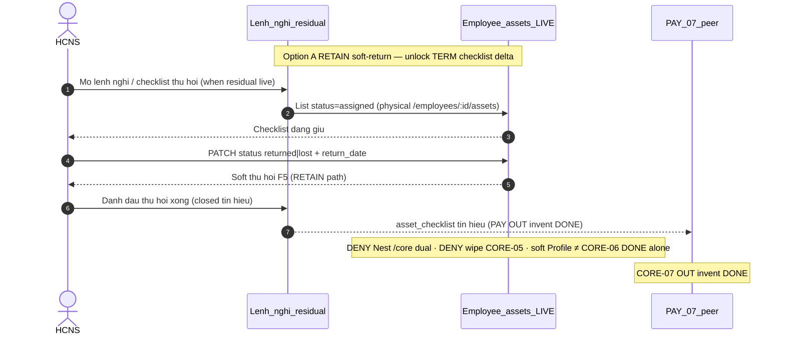

# PO-HRM-MVP-GD1-CORE-06-CLUSTER-SA-01 — Option/F.1 · Thu hồi tài sản khi kích hoạt nghỉ việc — RETAIN soft-return + unlock termination checklist delta

| Field | Value |
|-------|--------|
| **work_item_id** | `PO-HRM-MVP-GD1-CORE-06-CLUSTER-SA-01` |
| **program** | `PO-HRM-MVP-GD1-CONTINUOUS` (**U89** — single GD continuous · **NO** phase split) |
| **lane** | governance · sa |
| **change_mode** | **ADD** Option/F.1 disposition · **gap-only** · **NO CODE** `apps/**` · **no seed** · **preserve_default** · **DENY** Nest `/core` dual · **DENY** wipe CORE-05 assets spine / BB / serial 409 / DELETE-FORBIDDEN · **DENY** wipe CORE-03 DOC/ET/CHK · **DENY** wipe CORE-02b EMP-CF · **DENY** full accounting Asset invent · **DENY** invent CORE-07 DONE · **DENY** claim soft-return alone = CORE-06 DONE |
| **Date** | 2026-08-09 |
| **Status** | **CONFIRMED** · Option **A** **LOCKED** · unlock BA AC → (ba-data HOLD default) → API/FE residual only if BA proves closable gap → Dev |
| **depends_on** | QC-01 GWC Wave-19 UC-BP-CORE-05 **SEALED** — stamp `CORE05QC1-MSLGVT40` · evidence `docs/qa/evidence/po-hrm-mvp-gd1-core-05-cluster-qc-01.md` · QA `CORE05QA2-MSLGSWSF` · peer must_keep `CORE03QC1-MSLFJH0K` / `CORE02BQC1-MSLEFQC1` / `CORE09DQC1-MSLDR8I3` / `CORE09CQC1-MSLBXMUT` / `CORE09BQC1-MSLB05DZ` / `CORE09AQC1-MSLA4LX9` / `CORE08QC1-MSL9BFFE` / `CORE02QC1-MSL80DU6` / `CORE01QC1-MSL6WMS7` · EMP DOC/ET L1 `EMPPLATQA-MSIZXHIM` · MergeToken EMP `EMPTOKQA-MSJ290VB` · **`R-CORE-05-HONESTY` INFO RETAIN idle-ok** · printable **false** · personnel **false** · **≠** claim CORE-05 DONE |
| **uc_ids** | `UC-BP-CORE-06` |
| **board** | `docs/program/PO_HRM_MVP_GD1_CONTINUOUS.md` — seat **#22** after CORE-05 (#21 SEALED GWC) · CORE-04 **OUT** · CORE-07 remain **QUEUED** after 06 |
| **ref_sa_spine** | Assets [`PO-HRM-MVP-GD1-CORE-05-CLUSTER-SA-01.md`](./PO-HRM-MVP-GD1-CORE-05-CLUSTER-SA-01.md) · Checklist [`…-03-…`](./PO-HRM-MVP-GD1-CORE-03-CLUSTER-SA-01.md) · EMP-CF [`…-02B-…`](./PO-HRM-MVP-GD1-CORE-02B-CLUSTER-SA-01.md) · TPL [`…-09D-…`](./PO-HRM-MVP-GD1-CORE-09D-CLUSTER-SA-01.md) · VER/PDF [`…-09C-…`](./PO-HRM-MVP-GD1-CORE-09C-CLUSTER-SA-01.md) · pack+PREV [`…-09B-…`](./PO-HRM-MVP-GD1-CORE-09B-CLUSTER-SA-01.md) · CL [`…-09A-…`](./PO-HRM-MVP-GD1-CORE-09A-CLUSTER-SA-01.md) · RD [`…-08-…`](./PO-HRM-MVP-GD1-CORE-08-CLUSTER-SA-01.md) · C&B [`…-02-…`](./PO-HRM-MVP-GD1-CORE-02-CLUSTER-SA-01.md) · public [`…-01-…`](./PO-HRM-MVP-GD1-CORE-01-CLUSTER-SA-01.md) — **reuse · DENY reopen sealed J-HRM-CORE-05-01..05 / J-HRM-CORE-03 / J-HRM-CORE-02B / J-HRM-CORE-09D..01 without regression** |
| **ref_honesty** | `recruitment_uat_ready=false` · `jd_dynamic_done=false` · **`contracts_printable_ready=false`** · **`hrm_personnel_uat_ready=false`** · personnel / CORE / CTR module UAT **false** · **DENY claim CORE-05 assets = personnel UAT / FR DONE** · **DENY claim soft-return alone = CORE-06 DONE** · **DENY invent CORE-07 activation DONE** · **DENY claim printable/closed-8 DONE** |
| **ref_srs** | `SRS_HRM_ENTERPRISE.md` **FR-UC-BP-CORE-06** · Diễn biến checklist thu hồi từ lệnh nghỉ · **BR-BP-AST-02** · phụ thuộc danh sách đang giữ từ **CORE-05** · gate **PAY-07** tín hiệu · peers CORE-05..01 (**must_keep**) · CORE-04 OCR **OUT** · CORE-07 activate = peer (**≠** this seat DONE) · PAY-07 settlement = peer consumer (**≠** invent PAY DONE) |
| **ref_adr** | `ADR-HRM-4-PILLAR-API-BOUNDARY.md` **§11 Q-ASSET-MODULE** — GĐ1 assignment stub **must** support thu hồi khi nghỉ (BR-BP-AST-02) trên stub — **Không** SoT kho/CCDC toàn tập đoàn · full Asset SoT phase sau |
| **ref_paper_api** | `API_DESIGN_HRM_ENTERPRISE.md` **F-CORE-AST-02** (paper path `/api/hrm/core/employees/{id}/assets/{assignmentId}/return`) · peer **F-CORE-TERM-01** terminations · PAY **F-PAY-TERM-SETTLE-01** reads `asset_checklist_ack` · must_keep **F-CORE-AST-01** + **F-CORE-AST-BB-01** · F-CORE-CHK-01 · F-EMP-CAT-DOC/ET/EFF · F-EMP-TOK · F-EMP-CF · CTR TPL/VER/PDF/PACK/PREV/CL · CORE-08/02/01 |
| **ref_db** | LIVE `public.employee_assets` (RETAIN CORE-05 spine — status `assigned`/`returned`/`lost`/`maintenance` · `return_date` · BB confirm cols) · paper `hrm_termination.asset_checklist_closed` + `pay_termination_settlement.asset_checklist_ack` = **consumer flags** · Nest `hrm_termination` / terminations route **ABSENT AS-IS** · **DENY** invent full Asset ledger this seat |
| **ref_code** | `employees.controller` `GET/POST/PATCH/DELETE :employeeId/assets*` · `employee-profile.service` list/create/update/deleteAsset · soft prefer PATCH `status→returned|lost|maintenance` · `HRM-EMP-ASSET-DELETE-FORBIDDEN` · `HRM-EMP-ASSET-SERIAL-CONFLICT` · FE `EmployeeAssets` + `useEmployeeAssets` soft Thu hồi toast · `CoreModule` = DB export only (**no** Nest `@Controller('core')` AST/TERM dual) — **read-only cite** |
| **OUT** | Nest `/core` dual · wipe CORE-05 assets/BB/serial/DELETE-FORBIDDEN · wipe CORE-03 DOC/ET/CHK · wipe CORE-02b EMP-CF · full accounting Asset / kho invent · invent CORE-07 DONE · invent PAY-07 settlement engine DONE · claim soft-return alone = CORE-06 DONE · claim CORE-05 = personnel UAT / FR DONE · reopen CORE-05/03/02b/09d..01 · seed · honesty flip |
| **Honesty** | all ready flags **false** · **C-SLICE** · U65 zero-seed |
| **ack_status** | **PASS_TO_PM** · Option A CONFIRMED |

---

## 1. Decision Context

| | |
|--|--|
| **Decision title** | Wave-20 architecture unlock: **termination-triggered asset recovery checklist** (list assigned from CORE-05 · mark returned/lost/exception · gate PAY-07 tín hiệu) vs AS-IS LIVE soft-return on Profile — **gap-only** for FR-UC-BP-CORE-06 under **Q-ASSET-MODULE** GĐ1 stub |
| **Requestor** | PM · program `PO-HRM-MVP-GD1-CONTINUOUS` · U89 after CORE-05 QC-01 GWC (`CORE05QC1-MSLGVT40`) |
| **Date** | 2026-08-09 |
| **Decision owner** | SA |
| **Related requirements** | FR-UC-BP-CORE-06 · BR-BP-AST-02 · F-CORE-AST-02 · Q-ASSET-MODULE · FR-UC-BP-PAY-07 (consumer tín hiệu) · must_keep CORE-05 physical assets + BB soft-confirm + serial 409 + DELETE-FORBIDDEN · CORE-03 DOC/ET/CHK · CORE-02b EMP-CF · CORE-09d TPL+clause · CORE-09c VER/PDF ≠ printable · CORE-09b PREV ephemeral · CORE-09a CL · CORE-08 · CORE-02 · CORE-01 · Nest `/core` DENY · cite `EMPPLATQA-MSIZXHIM` · `EMPTOKQA-MSJ290VB` · `R-CORE-05-HONESTY` INFO idle-ok |

### 1.1 Problem to Solve

| | |
|--|--|
| **Current state (AS-IS LIVE)** | **CORE-05 SEALED (`CORE05QC1-MSLGVT40`):** physical `/api/hrm/employees/:id/assets*` + `public.employee_assets` RETAIN · BB soft-confirm (`handover_confirmed_*` · `handoverDocId=id`) · serial **409** `HRM-EMP-ASSET-SERIAL-CONFLICT` · hard DELETE issued → **409** `HRM-EMP-ASSET-DELETE-FORBIDDEN` · soft status prefer · Nest `/core` 0 · J-HRM-CORE-05-01..05 PASS · **≠** CORE-05 DONE · **≠** personnel UAT · **`R-CORE-05-HONESTY` INFO idle-ok**. **Soft-return LIVE (≠ CORE-06 DONE):** (1) FE Profile **Tài sản** CTA «Thu hồi» → PATCH `status=returned` (+ `return_date`) · also `lost`/`maintenance` · toast «Đã thu hồi (đổi trạng thái) — lịch sử còn cho CORE-06». (2) BE `updateAsset` allowlist status · `deleteAsset` forbid issued. (3) List đang giữ = filter `status=assigned`. **ABSENT AS-IS for FR-06:** (4) **Lệnh nghỉ / termination case** Nest route + `hrm_termination` table — **ABSENT**. (5) **Checklist thu hồi** triggered from `termination.started` (mọi `assigned` → cần thu / checklist instance) — **ABSENT**. (6) **Cờ thu hồi xong** (`asset_checklist_closed` / display-ready signal for PAY-07) — **ABSENT**. (7) Paper `POST …/assets/{id}/return` under Nest `/core` — **ABSENT** (physical prefer = PATCH status on same SoT). (8) Exception/lost with bồi thường structured — at best free `notes` + `status=lost` (gap residual). (9) `CoreModule` = **HrmDbService export only**. (10) **CORE-07** activate · **PAY-07** settle engine = peers **OUT invent DONE**. |
| **Paper target** | FR-UC-BP-CORE-06: mở checklist thu hồi từ lệnh nghỉ → xác nhận từng tài sản đã thu / ngoại lệ → đánh dấu thu hồi xong → PAY-07 đọc tín hiệu; BR-BP-AST-02: kích hoạt nghỉ → 100% Đang sử dụng vào thu hồi; chưa đủ → cảnh báo/chặn tất toán; giữ lịch sử cấp–thu · không xóa cứng. |
| **Gap class** | **GĐ1 continuous AC + journey residual on LIVE assignment SoT** — **not** greenfield dual / full Asset: (1) board #22 needs Option lock mapping CORE-06 ↔ LIVE soft-return + termination checklist delta; (2) soft Thu hồi on Profile **≠** termination checklist DONE; (3) TERM trigger + closed flag + PAY-07 read = closable residuals; (4) risk invent Nest `/core` dual / wipe CORE-05 spine / wipe CORE-03/02b / invent full Asset / invent CORE-07 DONE; (5) risk claim soft-return alone = CORE-06 / personnel UAT DONE; (6) risk reopen sealed J-CORE-05/03/02B/09D..01 / honesty flip. |
| **Constraints** | U89 continuous · **preserve** CORE-05 assets physical + BB + serial 409 + DELETE-FORBIDDEN · CORE-03 DOC/ET/CHK · CORE-02b EMP-CF · CORE-09d..01 · Nest `/core` DENY · EMP DOC/ET seals · C-SLICE · DENY seed · **cấm code until Option CONFIRMED** · gap-only · **DENY** honesty flip · **DENY** invent CORE-07 DONE · **DENY** claim soft-return alone = CORE-06 DONE · **DENY** claim CORE-05 DONE |
| **Failure impact if unresolved** | Board #22 stalls or Dev invents Nest `/core` return dual / full kho / wipes CORE-05 history; false claim soft-return = FR-06 DONE; PAY-07 lacks tín hiệu; CORE-07/personnel honesty flip |

### 1.2 Architecture diagram (target — Option A)

```text
  UC-BP-CORE-01..09d + CORE-02b + CORE-03 + CORE-05 (SEALED must_keep)
  public · C&B · RD · CL · PACK+PREV ephemeral · VER/PDF · open TPL+clause · EMP-CF · DOC/ET/CHK
  employee_assets physical + BB soft-confirm + serial 409 + DELETE-FORBIDDEN
  Nest /core DENY · printable false · closed-8 ≠ DONE · personnel false · C-SLICE
  ≠ claim CORE-05 DONE · R-CORE-05-HONESTY INFO idle-ok
       │
       │  must_keep RETAIN — DENY reopen J-HRM-CORE-05-01..05 / 03 / 02B / 09D..01
       ▼
  ┌────────────── FR-UC-BP-CORE-06 (this seat — gap-only RETAIN soft-return + unlock TERM checklist) ─┐
  │                                                                                                   │
  │  ASSIGNMENT SoT = public.employee_assets (RETAIN CORE-05 — DENY wipe)                             │
  │    Physical /api/hrm/employees/:id/assets* GET/POST/PATCH/DELETE                                  │
  │    Soft-return LIVE = PATCH status → returned|lost|maintenance + return_date                      │
  │    = physical prefer for paper F-CORE-AST-02                                                      │
  │    paper /api/hrm/core/…/assets/{id}/return = ALIAS ONLY                                          │
  │                                                                                                   │
  │  AS-IS soft Thu hồi on Profile = RETAIN path for mark returned/lost                               │
  │    ≠ CORE-06 DONE (missing lệnh nghỉ trigger + checklist closed + PAY-07 tín hiệu)                │
  │                                                                                                   │
  │  TERMINATION CHECKLIST DELTA (gap residual — R-CORE-06-TERM-CHK-01)                               │
  │    Paper: F-CORE-TERM-01 → termination.started → list status=assigned → checklist thu hồi         │
  │    AS-IS: Nest terminations / hrm_termination ABSENT                                              │
  │    BA unlock: AC for soft TERM case OR manual checklist entry from lệnh nghỉ UI                   │
  │              · DENY invent Nest /core dual · DENY invent full PAY-07 engine DONE                  │
  │                                                                                                   │
  │  CLOSED SIGNAL (gap residual — R-CORE-06-CLOSED-01)                                               │
  │    Paper: asset_checklist_closed / asset_checklist_ack for PAY-07                                 │
  │    AS-IS: ABSENT — unlock BA flag on TERM case or aggregate from open assigned count              │
  │                                                                                                   │
  │  EXCEPTION / LOST (gap residual — R-CORE-06-EXCEPTION-01)                                         │
  │    status=lost + notes LIVE stub OK · structured bồi thường OUT invent full accounting            │
  │                                                                                                   │
  │  must_keep CORE-05 AST/BB/serial/DELETE-FORBIDDEN · CORE-03 DOC/ET/CHK · CORE-02b · CORE-09d..01  │
  │  RETAIN: Nest /core DENY · R-CORE-05-HONESTY INFO idle-ok                                         │
  └───────────────────────────────────────────────────────────────────────────────────────────────────┘
       │
       │  OUT this seat
       ▼
  Nest /core dual AST/TERM                     = DENY
  Wipe CORE-05 assets / BB / serial / DELETE   = DENY
  Wipe CORE-03 DOC/ET/CHK                      = DENY
  Wipe CORE-02b EMP-CF spine                   = DENY
  Full accounting Asset / kho / CCDC SoT       = DENY (phase sau)
  Invent CORE-07 / PAY-07 settle engine DONE   = DENY
  Claim soft-return alone = CORE-06 DONE       = DENY
  Claim CORE-05 = personnel UAT / FR DONE      = DENY
  Flip personnel / printable / recruit         = DENY
  Claim printable / closed-8 DONE              = DENY

  Honesty: C-SLICE ≠ hrm_personnel_uat_ready · ≠ contracts_printable_ready
```

**Label lock:** «Thu hồi tài sản khi kích hoạt nghỉ việc» GĐ1 = **termination checklist on assignment stub** (list đang giữ · mark returned/lost/exception · closed tín hiệu PAY-07) per **Q-ASSET-MODULE** — **not** Nest `/core` dual; not full kế toán Asset; not wipe CORE-05/03/02b; **not** soft Profile Thu hồi alone = FR-06 DONE.  
**Spine lock:** Physical prefer `/api/hrm/employees/:id/assets*` (PATCH soft status) — paper `/core/…/return` = **alias only** — **DENY** Nest `/core` second SoT.  
**Honesty lock:** Slice GWC later **≠** auto-flip `hrm_personnel_uat_ready` · `contracts_printable_ready` · `recruitment_uat_ready` · `jd_dynamic_done` · **≠** claim CORE-05 = personnel UAT / FR DONE · **≠** claim soft-return alone = CORE-06 DONE · **≠** invent CORE-07 DONE · **≠** claim printable/closed-8 DONE.

---

## 2. LIVE vs gap map (preserve_default)

| Capability | Paper (SRS / API / DB) | AS-IS LIVE | Verdict |
|------------|------------------------|------------|---------|
| Danh sách đang giữ từ CORE-05 | FR-06 input · BR-AST-02 | `employee_assets` filter `status=assigned` · GET `/employees/:id/assets` | **RETAIN** |
| Soft mark returned/lost | F-CORE-AST-02 status returned · FR-06 #2 | PATCH status `returned`/`lost`/`maintenance` + `return_date` · FE Thu hồi | **RETAIN path** · **≠** FR-06 DONE alone |
| DELETE-FORBIDDEN / history | Soft-delete · không xóa cứng | `HRM-EMP-ASSET-DELETE-FORBIDDEN` | **RETAIN must_keep** |
| Serial 409 + BB confirm | CORE-05 peers | LIVE sealed Wave-19 | **RETAIN must_keep** |
| Paper `/core` return path | `POST …/core/…/assets/{id}/return` | Nest `@Controller('core')` **ABSENT** | **paper = alias only** |
| Lệnh nghỉ / termination.started | F-CORE-TERM-01 · Diễn biến #1 | Nest terminations / `hrm_termination` **ABSENT** | **UNLOCK residual** |
| Checklist thu hồi instance | FR-06 #1–#3 · BR-AST-02 | No TERM-triggered checklist | **UNLOCK residual** |
| Cờ thu hồi xong | `asset_checklist_closed` · PAY-07 tín hiệu | ABSENT | **UNLOCK residual** |
| Exception / mất + bồi thường | FR-06 đặc biệt | `status=lost` + notes stub | **RETAIN stub** · structured bồi thường OUT invent full |
| PAY-07 settlement engine | FR-UC-BP-PAY-07 | Peer PAY vertical | **OUT invent DONE** · CORE emits tín hiệu only |
| Activate hồ sơ | CORE-07 | Peer QUEUED | **OUT invent DONE** |
| Full Asset / kho | Phase sau ADR §11 | ABSENT | **OUT** |

---

## 3. Options A / B / C

### Option A — ACCEPT_AS_IS_RETAIN soft-return + unlock termination checklist delta (RECOMMENDED)

| | |
|--|--|
| **Summary** | **RETAIN** LIVE soft-return on physical `/api/hrm/employees/:id/assets*` + `public.employee_assets` (same CORE-05 SoT) as GĐ1 mark returned/lost path. Paper F-CORE-AST-02 `/core/…/return` = **alias only**. Unlock BA for **termination-triggered checklist** residual + closed tín hiệu PAY-07 + exception policy — **explicit note: soft Thu hồi on Profile ≠ CORE-06 DONE**. **must_keep** CORE-05 AST/BB/serial/DELETE-FORBIDDEN · CORE-03 DOC/ET/CHK · CORE-02b EMP-CF · CORE-09d..01 · Nest `/core` DENY. CORE-07 / PAY-07 engine **OUT invent DONE**. |
| **Scope** | Gap-only docs lock · no `apps/**` this seat |
| **Complexity** | Low–medium (TERM checklist + closed flag residual; soft-return RETAIN) |
| **Risk** | Low if BA does not invent Nest dual / claim soft-return = DONE / invent PAY |
| **Cost / timeline** | BA → ba-data HOLD → API cite → FE residual U65 |
| **Pros** | Matches ADR §11 invariant BR-AST-02 on stub; preserves Wave-19 spine; unlocks board #22; clean PAY-07 consumer contract later |
| **Cons** | TERM case still residual until BA/data; not full offboard product |
| **Failure modes** | BA over-scopes Nest `/core` TERM dual · claim soft-return=DONE · invent CORE-07/PAY |
| **Mitigation** | O1–O12 locks · DENY invent · CORE-07/PAY OUT explicit · soft≠DONE footer |

### Option B — Nest `/core` dual + full Asset/TERM invent (REJECT)

| | |
|--|--|
| **Summary** | Stand up Nest `@Controller('core')` return + terminations + invent Asset ledger/kho + wipe/reimplement CORE-05 soft-return «for symmetry» |
| **Pros** | Paper path literal match |
| **Cons** | Dual SoT · violates U89 preserve · DENY full accounting this wave · high blast · regression CORE-05..01 |
| **Failure modes** | Dual-write · Nest `/core` non-404 SoT · honesty flip · wipe DELETE-FORBIDDEN history |
| **Mitigation** | **REJECT** |

### Option C — HOLD / claim soft-return = CORE-06 DONE / honesty (REJECT)

| | |
|--|--|
| **Summary** | Declare seat DONE because Profile «Thu hồi» exists; flip personnel/printable; invent CORE-07 DONE; invent PAY-07 DONE; reopen sealed peers |
| **Pros** | Fast chat claim |
| **Cons** | Violates FR-06 Diễn biến #1 (lệnh nghỉ) · BR-AST-02 checklist · PAY-07 tín hiệu · honesty locks |
| **Failure modes** | False UAT · sponsor distrust · settlement without closed gate |
| **Mitigation** | **REJECT** |

### Trade-off matrix

| Dimension | A (RETAIN soft + unlock TERM chk) | B (Nest dual+full Asset) | C (HOLD/claim soft=DONE) |
|-----------|-----------------------------------|--------------------------|--------------------------|
| Performance | Neutral | Worse (dual path) | Fake PASS |
| Reliability | High if residual AC’d | Dual-write risk | High defect risk |
| Security / scope | U19 RETAIN | New surface | Honesty breach |
| Scalability | Stub → full Asset later | Premature SoT | Blocks PAY-07 |
| Maintainability | Best preserve | Worst | Spec lie |
| Fit Q-ASSET-MODULE | **Yes** (BR-AST-02 on stub) | No (phase jump) | No |

---

## 4. Decision

| | |
|--|--|
| **Selected option** | **Option A** — **ACCEPT_AS_IS_RETAIN**: LIVE soft-return PATCH on `employee_assets` + `/employees/:id/assets*` as CORE-06 mark path; paper `/core` return = alias only; unlock termination checklist + closed tín hiệu residuals for BA; **RETAIN** CORE-05 AST/BB/serial/DELETE-FORBIDDEN · CORE-03 DOC/ET/CHK · CORE-02b EMP-CF · CORE-09d..01 · Nest `/core` DENY; **DENY** full Asset invent · wipe CORE-05/03/02b · honesty flip · reopen seals · invent CORE-07 DONE · invent PAY-07 engine DONE · claim soft-return alone = CORE-06 DONE · claim CORE-05 = personnel UAT / FR DONE · claim printable/closed-8 DONE |
| **Why selected** | AS-IS already implements FR-06 **mark returned/lost on same SoT** under ADR GĐ1 stub; remaining gap is **lệnh nghỉ trigger + checklist closed + PAY-07 tín hiệu + U65 journeys** — not greenfield Nest `/core`, not accounting Asset; preserves W10–W19 must_keep; unlocks board #22; leaves CORE-07/PAY peers unambiguous |
| **Assumptions** | CORE-05 **`CORE05QC1-MSLGVT40` RETAIN** · QA `CORE05QA2-MSLGSWSF` · physical assets + BB + serial 409 + DELETE-FORBIDDEN RETAIN · **`R-CORE-05-HONESTY` INFO idle-ok** · **≠** claim CORE-05 DONE. CORE-03 **`CORE03QC1-MSLFJH0K` RETAIN**. CORE-02b **`CORE02BQC1-MSLEFQC1` RETAIN**. CORE-09d **`CORE09DQC1-MSLDR8I3` RETAIN**. CORE-09c..01 stamps **RETAIN**. EMP DOC/ET **`EMPPLATQA-MSIZXHIM`** · TOK **`EMPTOKQA-MSJ290VB` RETAIN**. Nest `/core` DENY **RETAIN**. `hrm_personnel_uat_ready=false` · `contracts_printable_ready=false` · `recruitment_uat_ready=false` · `jd_dynamic_done=false`. Nest terminations / `hrm_termination` **ABSENT** (grep 2026-08-09). |
| **Rejected** | **B** — Nest `/core` dual / wipe CORE-05·03·02b / full Asset invent · **C** — HOLD / claim soft-return=CORE-06 DONE / invent CORE-07·PAY / honesty flip / reopen sealed |

### 4.1 OPEN decisions for BA (lockable — not invent)

| ID | Topic | SA default (Option A) | BA must CONFIRM |
|----|-------|----------------------|-----------------|
| **O1** | Physical path | Prefer PATCH `/api/hrm/employees/:id/assets/:assetId` (status/return_date); optional thin `…/return` on **same** controller if UX needs — any `/core/…/return` = alias / DOC-DELTA only — **DENY** Nest `/core` dual | Cite Network Profile + future checklist UI |
| **O2** | Assignment SoT | LIVE `public.employee_assets` = **same** CORE-05 SoT — **DENY** second Nest table as primary · **DENY** wipe CORE-05 spine | Map FR-06 fields ↔ cols |
| **O3** | Status map | `assigned` = đang giữ / cần thu · `returned` = đã thu · `lost` = mất/ngoại lệ · `maintenance` retain — BA lock VI + filter checklist | BR-BP-AST-02 |
| **O4** | Soft-return vs CORE-06 | Soft Thu hồi Profile = **RETAIN path** for Diễn biến #2 mark — **≠** CORE-06 DONE without TERM checklist + closed — footer every evidence | Explicit AC-CORE-06-≠-SOFT-DONE |
| **O5** | Termination trigger | Residual **R-CORE-06-TERM-CHK-01** IN-SCOPE: soft TERM case **or** checklist UI entry from lệnh nghỉ — ba-data HOLD until gap proven vs paper `hrm_termination` — **DENY** invent Nest `/core` TERM dual as primary · **DENY** invent full offboard product DONE | Explicit AC + empty CTA (no seed) |
| **O6** | Closed tín hiệu PAY-07 | Residual **R-CORE-06-CLOSED-01**: flag / aggregate «0 assigned bắt buộc còn mở» readable by PAY-07 — **DENY** invent PAY settlement engine DONE | Map FR-06 #4 · FR-PAY-07 input |
| **O7** | Exception / lost | `status=lost` + reason notes **OK** stub; structured bồi thường **OUT** invent full accounting Asset | FR-06 đặc biệt |
| **O8** | Partial thu hồi | FR-06 «nghỉ trong ngày»: allow partial close + track remainder — BA CONFIRM | Đặc biệt |
| **O9** | CORE-07 / PAY-07 | must_keep peers · activate + settlement engine **OUT invent DONE** — CORE emits tín hiệu only | Footer every evidence |
| **O10** | Honesty / peers OUT | All ready flags false · C-SLICE · **DENY** flip personnel/printable/recruitment/jd · **DENY** claim CORE-05 = personnel UAT / FR DONE · **DENY** claim soft-return alone = CORE-06 DONE · **DENY** invent CORE-07 DONE · **DENY** claim printable/closed-8 · **must_keep** CORE-05..01 · Nest DENY · **`R-CORE-05-HONESTY` INFO idle-ok** | Footer every evidence |
| **O11** | Display-ready | Checklist DTO: asset rows + statusLabelVi + return_date + closed flag + optional TERM id | FE bind |
| **O12** | Journeys | Mint **J-HRM-CORE-06-01..0n DRAFT** (lệnh nghỉ / checklist → list đang giữ → mark returned/lost → closed → Nest `/core` 0 · soft Profile ≠ DONE alone) · **DENY** reopen sealed J-HRM-CORE-05-01..05 / 03 / 02B / 09D..01 | Journey map delta |

### 4.2 API_DESIGN F.1 map (cite RETAIN — residual unlock only if BA proves)

| ID | METHOD / path (physical) | Mục đích | Nghiệp vụ (tóm tắt) | Bước SRS | Disposition |
|----|--------------------------|----------|---------------------|----------|-------------|
| **F-CORE-AST-01** | `GET/POST /api/hrm/employees/:id/assets` · `PATCH/DELETE …/assets/:assetId` | Assignment stub SoT · list đang giữ | Scope U19 · status `assigned` · BB · serial 409 · DELETE-FORBIDDEN | FR-05 · CORE-05 must_keep | **RETAIN cite LIVE** · **DENY wipe** |
| **F-CORE-AST-BB-01** | PATCH confirm flags | BB issue soft-confirm | handoverConfirmed · handoverDocId=id | FR-05 | **RETAIN must_keep** |
| **F-CORE-AST-02** | Prefer PATCH status/return_date on `…/assets/:assetId` · optional `…/assets/:assetId/return` thin · paper `/core/…/return` alias | Mark thu hồi / mất trên checklist nghỉ | Soft status · history · U19 | FR-06 Diễn biến #2–#3 · BR-AST-02 | **UNLOCK residual** (path RETAIN; TERM checklist delta ADD) |
| **F-CORE-TERM-01** *(residual peer)* | Prefer physical `…/terminations*` if unlocked · paper `/core/…/terminations` alias | Mở lệnh nghỉ → kick checklist | `termination.started` soft | FR-06 #1 · Meeting C9 | **UNLOCK residual** — ba-data HOLD · **DENY** Nest `/core` invent as primary · **≠** invent full offboard DONE |
| **F-PAY-TERM-SETTLE-01** | PAY peer | Đọc tín hiệu thu hồi | `asset_checklist_ack` | FR-PAY-07 | **OUT invent DONE** · CORE emits only |
| **F-CORE-CHK-01** | `/employees/:id/document-checklist*` | must_keep CORE-03 | DOC instance | peer 03 | **must_keep** · **DENY wipe** |
| **F-EMP-CAT-DOC/ET/EFF · TOK** | document-types* · employment-types* | must_keep CORE-03 catalog | open DOC/ET | peer 03 | **must_keep** |
| **F-EMP-CF-01..03 / TOK-03 / CNS** | settings-catalogs + custom_fields | must_keep CORE-02b | Four catalogs · KEY | peer 02b | **must_keep** · **DENY wipe** |
| **F-CORE-CTR-TPL/VER/PDF/PACK/PREV/CL** | contracts-insurance* | must_keep 09d..09a | Open TPL · ≠ printable · PREV ephemeral | peers | **must_keep** |
| **F-CORE-RD / EMP-02 / EMP-01** | rewards · packages · employees public | must_keep 08/02/01 | AuthZ · CB-403 · public | peers | **must_keep** |
| **F-CORE-ACT-01** | Activate employee | CORE-07 peer | blocks_activation | CORE-07 | **OUT invent DONE** |

**FORBIDDEN GĐ1 invent:** Nest `@Controller('core')` AST/TERM dual SoT · wipe `/employees/:id/assets*` CORE-05 · wipe BB/serial/DELETE-FORBIDDEN · wipe `/document-checklist*` / DOC/ET · wipe `/settings-catalogs*` EMP-CF · full Asset kho/depreciation · invent CORE-07 DONE · invent PAY-07 settle engine DONE · claim soft-return alone = CORE-06 DONE · claim printable DONE.



---

## 5. must_keep / DENY locks (this seat)

| Lock | Rule |
|------|------|
| **L-CORE-06-01 AST SoT** | Assignment = LIVE `employee_assets` on `/employees/:id/assets*` — **FORBIDDEN** Nest `/core` second SoT · **FORBIDDEN** wipe CORE-05 spine |
| **L-CORE-06-02 Soft≠DONE** | Soft Thu hồi Profile = RETAIN mark path — **FORBIDDEN** claim soft-return alone = FR-UC-BP-CORE-06 / CORE-06 DONE |
| **L-CORE-06-03 Q-ASSET stub** | GĐ1 stub + BR-AST-02 checklist on stub — **FORBIDDEN** invent full accounting Asset / kho / depreciation as this seat DONE |
| **L-CORE-06-04 Paper alias** | Paper F-CORE-AST-02 `/core/…/return` = alias only — **FORBIDDEN** Nest dual controller |
| **L-CORE-06-05 CORE-05 RETAIN** | Physical assets + BB soft-confirm + serial 409 + DELETE-FORBIDDEN **RETAIN** `CORE05QC1-MSLGVT40` — **FORBIDDEN** reopen J-HRM-CORE-05-01..05 without regression · **FORBIDDEN** claim CORE-05 = personnel UAT / FR DONE · **`R-CORE-05-HONESTY` INFO idle-ok** |
| **L-CORE-06-06 TERM residual** | Termination checklist = **R-CORE-06-TERM-CHK-01** unlock via BA — **FORBIDDEN** invent Nest `/core` TERM dual as primary · **FORBIDDEN** invent full offboard DONE |
| **L-CORE-06-07 CLOSED residual** | PAY-07 tín hiệu = **R-CORE-06-CLOSED-01** — **FORBIDDEN** invent PAY settlement engine DONE |
| **L-CORE-06-08 CORE-03 CHK** | DOC/ET/CHK physical **RETAIN** `CORE03QC1-MSLFJH0K` — **FORBIDDEN** wipe / reopen J-HRM-CORE-03 without regression |
| **L-CORE-06-09 CORE-02b EMP-CF** | Four catalogs + KEY + soft-draft + TOK-03 **RETAIN** — **FORBIDDEN** wipe / reopen J-HRM-CORE-02B |
| **L-CORE-06-10 CORE-09d** | TPL+clause **RETAIN** — **FORBIDDEN** claim printable / closed-8 DONE · **FORBIDDEN** reopen J-HRM-CORE-09D without regression |
| **L-CORE-06-11 CORE-09c** | VER/PDF **RETAIN** — **FORBIDDEN** claim = printable DONE |
| **L-CORE-06-12 CORE-09b** | PACK+PREV ephemeral **RETAIN** — **FORBIDDEN** PREV→INSERT VER |
| **L-CORE-06-13 CORE-09a/08/02/01** | CL · RD · C&B AuthZ · public **RETAIN** stamps |
| **L-CORE-06-14 Honesty** | **DENIED** flip `recruitment_uat_ready` · `jd_dynamic_done` · `contracts_printable_ready` · `hrm_personnel_uat_ready` · module CORE/CTR/personnel UAT · Phase1 · invent CORE-07 DONE · claim printable/closed-8 DONE |
| **L-CORE-06-15 Seed** | **DENIED** U65 seed for density / UF |
| **L-CORE-06-16 Scope** | Same profile scope resolver assets list↔get↔mutate (**U19**) |
| **L-CORE-06-17 Soft-delete** | Prefer soft status — **FORBIDDEN** silent hard-delete of history (DELETE-FORBIDDEN RETAIN) |

---

## 6. Rollout / unlock

```text
CORE-06-CLUSTER-SA-01 (this) CONFIRMED · Option A LOCKED
  → ba-process: PO-HRM-MVP-GD1-CORE-06-CLUSTER-BA-01 AC pack (O1–O12)
  → ba-data: HOLD default (TERM case / closed flag ONLY if O5–O6 gap proven vs LIVE employee_assets / paper hrm_termination)
  → (after BA/data) sa API RETAIN cite F-CORE-AST-02 physical prefer PATCH + residual TERM/CLOSED if wire gap proven
  → Dev: cấm until contracts CONFIRMED · DENY Nest /core dual · DENY wipe CORE-05/03/02b · DENY full Asset invent · DENY invent CORE-07 · DENY claim soft-return alone = CORE-06 DONE
  → QA U65 J-HRM-CORE-06-* · cite LIVE assets soft-return + checklist delta · must_keep CORE-05..01
  → QC narrow C-SLICE — DENY personnel/printable/module UAT · DENY CORE-05 DONE · DENY CORE-07 DONE · DENY soft=CORE-06 DONE
```

**cấm code until Option CONFIRMED** — this seat = docs-only Option lock.

---

## 7. Validation / acceptance evidence plan

| Gate | Evidence |
|------|----------|
| SA Option | This file · Option A LOCKED · PASS_TO_PM |
| BA | O1–O12 CONFIRM · map Diễn biến FR-06 + BR-AST-02 · mint J-HRM-CORE-06-* DRAFT · residual R-CORE-06-TERM-CHK-01 / CLOSED / EXCEPTION disposition · soft≠DONE explicit · CORE-07/PAY OUT explicit |
| ba-data | HOLD unless O5–O6 unlocks physical TERM/closed |
| API | RETAIN cite soft PATCH as F-CORE-AST-02 physical prefer; residual TERM/closed only if gap proven |
| QA | U65 browser: checklist từ lệnh nghỉ (when unlocked) → list đang giữ → mark returned/lost → closed tín hiệu · Nest `/core` 0 · soft Profile alone ≠ PASS FR-06 · no seed |
| QC | C-SLICE GWC only · honesty false · must_keep CORE-05/03/02b/09d..01 · DENY CORE-05 DONE · DENY CORE-07 DONE · DENY soft=CORE-06 DONE |
| NFR | Prefer `@xevn/platform-core` on any future Nest residual — **no** RLS invent · cite `NFR_OBSERVABILITY_SECURITY_BASELINE.md` |

---

## 8. Handoff

| Field | Value |
|-------|--------|
| **completion_report** | Option **A LOCKED** for UC-BP-CORE-06: gap-only **RETAIN** LIVE soft-return PATCH on `public.employee_assets` + physical `/api/hrm/employees/:id/assets*` (same CORE-05 SoT · BB soft-confirm · serial 409 · DELETE-FORBIDDEN) as mark returned/lost path; paper F-CORE-AST-02 `/core/…/return` = alias only; **explicit: soft Thu hồi on Profile ≠ CORE-06 termination checklist DONE**; unlock residuals **R-CORE-06-TERM-CHK-01** (lệnh nghỉ → checklist) + **R-CORE-06-CLOSED-01** (PAY-07 tín hiệu) + exception stub for BA; **must_keep** CORE-05 (`CORE05QC1-MSLGVT40` · `R-CORE-05-HONESTY` INFO idle-ok · **≠** claim CORE-05 DONE) · CORE-03 DOC/ET/CHK · CORE-02b EMP-CF · CORE-09d TPL+clause · 09c VER/PDF ≠ printable · 09b PREV ephemeral · 09a CL · 08 · 02 · 01 · Nest `/core` DENY; **CORE-07 / PAY-07 engine OUT invent DONE**; **REJECT** B (Nest `/core` dual / wipe CORE-05·03·02b / full Asset invent) · **REJECT** C (HOLD / claim soft=DONE / invent CORE-07·PAY / honesty); **DENY** claim CORE-05 = personnel UAT · claim printable/closed-8 DONE · seed · apps/**; unlock **ba-process** AC next — **cấm code** until contracts. |
| **next_owner** | `ba-process` |
| **next_dispatch_prompt** | See §9 |
| **evidence_path** | `docs/program/specs/PO-HRM-MVP-GD1-CORE-06-CLUSTER-SA-01.md` |
| **ack_status** | **PASS_TO_PM** |

---

## 9. next_dispatch_prompt (copy-ready)

```text
work_item_id: PO-HRM-MVP-GD1-CORE-06-CLUSTER-BA-01
lane: governance · ba-process
program: PO-HRM-MVP-GD1-CONTINUOUS (U89 — single GĐ continuous)
uc_ids: UC-BP-CORE-06
depends_on: SA-01 Option A LOCKED · docs/program/specs/PO-HRM-MVP-GD1-CORE-06-CLUSTER-SA-01.md · peer QC CORE05QC1-MSLGVT40 · CORE05QA2-MSLGSWSF · CORE03QC1-MSLFJH0K · CORE02BQC1-MSLEFQC1 · CORE09DQC1-MSLDR8I3 / CORE09CQC1-MSLBXMUT / CORE09BQC1-MSLB05DZ / CORE09AQC1-MSLA4LX9 / CORE08QC1-MSL9BFFE / CORE02QC1-MSL80DU6 / CORE01QC1-MSL6WMS7 · EMPPLATQA-MSIZXHIM · EMPTOKQA-MSJ290VB must_keep · R-CORE-05-HONESTY INFO idle-ok RETAIN
board: docs/program/PO_HRM_MVP_GD1_CONTINUOUS.md — #22 UC-BP-CORE-06 · CORE-07 remain QUEUED · CORE-04 OUT
spec_ref: SRS FR-UC-BP-CORE-06 · Diễn biến checklist thu hồi từ lệnh nghỉ · BR-BP-AST-02 · phụ thuộc danh sách đang giữ CORE-05 · PAY-07 tín hiệu · SA Option A O1–O12 · F-CORE-AST-02 physical prefer PATCH /employees/:id/assets* · residual R-CORE-06-TERM-CHK-01 / CLOSED · must_keep CORE-05 assets+BB+serial409+DELETE-FORBIDDEN · CORE-03 DOC/ET/CHK · CORE-02b EMP-CF · CORE-09d..01 · Nest /core DENY · DENY invent CORE-07 DONE · DENY claim soft-return alone = CORE-06 DONE · DENY claim CORE-05 DONE

MISSION — BA AC pack (narrow):
1) CONFIRM O1–O12 from SA-01 Option A (physical prefer PATCH assets* · same employee_assets SoT · status map · soft Profile ≠ CORE-06 DONE · residual TERM checklist R-CORE-06-TERM-CHK-01 · closed tín hiệu R-CORE-06-CLOSED-01 · exception stub · partial thu hồi · CORE-07/PAY OUT · honesty · display-ready · J-HRM-CORE-06-* DRAFT)
2) Map Diễn biến FR-UC-BP-CORE-06 + BR-BP-AST-02 → AC rows (list đang giữ từ CORE-05 · mark returned/lost/exception · closed → PAY-07 tín hiệu) — cite LIVE Network soft-return; DENY invent Nest /core dual · DENY full Asset accounting · DENY claim soft Thu hồi alone = FR-06 DONE
3) Disposition R-CORE-06-TERM-CHK-01 + CLOSED + EXCEPTION: IN-SCOPE residual vs OUT with rationale; ba-data HOLD default unless physical gap proven; note CORE-07 activate OUT invent DONE · PAY-07 settle engine OUT invent DONE
4) must_keep CORE-05 AST/BB/serial/DELETE-FORBIDDEN RETAIN · CORE-03 DOC/ET/CHK · CORE-02b EMP-CF · CORE-09d..01 · DENY wipe CORE-05/03/02b · DENY reopen sealed J-HRM-CORE-05-01..05 / 03 / 02B / 09D/09C/09B/09A/08/02/01 · DENY flip recruitment_uat_ready / jd_dynamic_done / contracts_printable_ready / hrm_personnel_uat_ready · DENY claim CORE-05 = personnel UAT / FR DONE · DENY invent CORE-07 DONE · DENY claim printable/closed-8 DONE · DENY seed · DENY apps/**

exit: evidence docs/program/specs/PO-HRM-MVP-GD1-CORE-06-CLUSTER-BA-01.md · PASS_TO_PM · next ba-data HOLD (or sa API if BA proves wire-only)
```

---

## 10. Residual (explicit)

| ID | Class | Disposition |
|----|-------|-------------|
| **R-CORE-06-TERM-CHK-01** | P1 residual | Lệnh nghỉ → checklist thu hồi ABSENT Nest — unlock BA/data |
| **R-CORE-06-CLOSED-01** | P1 residual | `asset_checklist_closed` / PAY-07 tín hiệu ABSENT — unlock BA/data |
| **R-CORE-06-EXCEPTION-01** | P2 residual | Structured bồi thường beyond `lost`+notes — BA CONFIRM stub vs OUT invent |
| **R-CORE-05-HONESTY** | INFO | **RETAIN idle-ok** from CORE-05 QC — C-SLICE · ≠ CORE-05 DONE · ≠ invent CORE-06/07 from Wave-19 alone |
| **CORE-07 / F-CORE-ACT-01** | Peer OUT | Board #23 **QUEUED** — **≠ invent DONE** |
| **PAY-07 / F-PAY-TERM-SETTLE-01** | Peer OUT | Consumer of closed tín hiệu — **≠ invent settlement engine DONE** this seat |

**DENY:** honesty flip · Nest `/core` dual · wipe CORE-05/03/02b · reopen sealed J-* · claim Wave-19 asset = CORE-05 DONE / personnel UAT · invent CORE-07 DONE · invent soft-return alone = CORE-06 DONE · invent PAY-07 DONE · printable flip.
