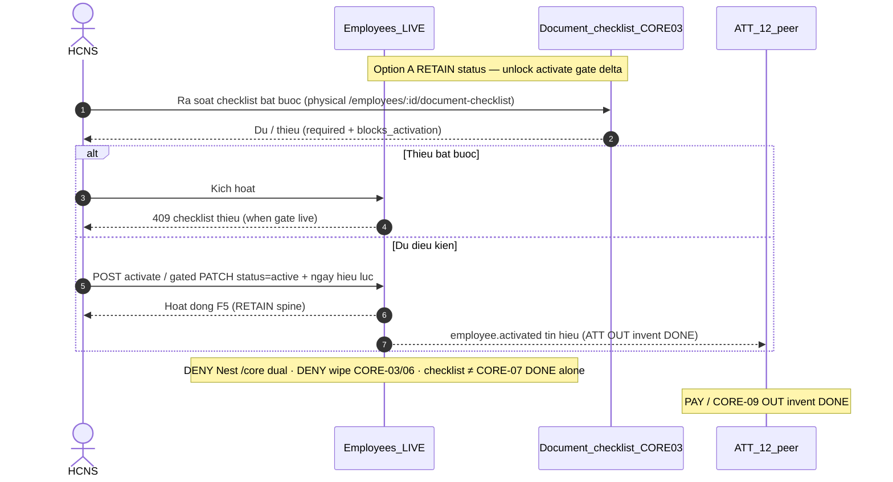

# PO-HRM-MVP-GD1-CORE-07-CLUSTER-SA-01 — Option/F.1 · Kích hoạt hồ sơ Hoạt động khi checklist đủ — RETAIN status spine + unlock activate gate delta

| Field | Value |
|-------|--------|
| **work_item_id** | `PO-HRM-MVP-GD1-CORE-07-CLUSTER-SA-01` |
| **program** | `PO-HRM-MVP-GD1-CONTINUOUS` (**U89** — single GD continuous · **NO** phase split) |
| **lane** | governance · sa |
| **change_mode** | **ADD** Option/F.1 disposition · **gap-only** · **NO CODE** `apps/**` · **no seed** · **preserve_default** · **DENY** Nest `/core` dual · **DENY** wipe CORE-06 return checklist / soft≠DONE · **DENY** wipe CORE-05 assets/BB/serial/DELETE-FORBIDDEN · **DENY** wipe CORE-03 DOC/ET/CHK · **DENY** wipe CORE-02b EMP-CF · **DENY** invent PAY DONE · **DENY** invent CORE-09 DONE · **DENY** claim checklist đủ alone = CORE-07 module DONE · **DENY** claim soft Profile / status PATCH alone = CORE-07 DONE |
| **Date** | 2026-08-09 |
| **Status** | **CONFIRMED** · Option **A** **LOCKED** · unlock BA AC → (ba-data HOLD default) → API/FE residual only if BA proves closable gap → Dev |
| **depends_on** | QC-01 GWC Wave-20 UC-BP-CORE-06 **SEALED** — stamp `CORE06QC1-MSLID363` · evidence `docs/qa/evidence/po-hrm-mvp-gd1-core-06-cluster-qc-01.md` · QA `CORE06QA2-MSLI95K8` · BE `CORE06BE2-MSLI26NR` · peer must_keep `CORE05QC1-MSLGVT40` / `CORE03QC1-MSLFJH0K` / `CORE02BQC1-MSLEFQC1` / `CORE09DQC1-MSLDR8I3` / `CORE09CQC1-MSLBXMUT` / `CORE09BQC1-MSLB05DZ` / `CORE09AQC1-MSLA4LX9` / `CORE08QC1-MSL9BFFE` / `CORE02QC1-MSL80DU6` / `CORE01QC1-MSL6WMS7` · EMP DOC/ET L1 `EMPPLATQA-MSIZXHIM` · MergeToken EMP `EMPTOKQA-MSJ290VB` · **`R-CORE-06-HONESTY` INFO RETAIN idle-ok** · soft≠CORE-06 DONE **RETAIN** · printable **false** · personnel **false** · **≠** claim CORE-06 DONE |
| **uc_ids** | `UC-BP-CORE-07` |
| **board** | `docs/program/PO_HRM_MVP_GD1_CONTINUOUS.md` — seat **#23** after CORE-06 (#22 SEALED GWC) · CORE-09/10 remain **QUEUED** · PAY OUT invent DONE |
| **ref_sa_spine** | Return [`PO-HRM-MVP-GD1-CORE-06-CLUSTER-SA-01.md`](./PO-HRM-MVP-GD1-CORE-06-CLUSTER-SA-01.md) · Assets [`…-05-…`](./PO-HRM-MVP-GD1-CORE-05-CLUSTER-SA-01.md) · Checklist [`…-03-…`](./PO-HRM-MVP-GD1-CORE-03-CLUSTER-SA-01.md) · EMP-CF [`…-02B-…`](./PO-HRM-MVP-GD1-CORE-02B-CLUSTER-SA-01.md) · TPL [`…-09D-…`](./PO-HRM-MVP-GD1-CORE-09D-CLUSTER-SA-01.md) · VER/PDF [`…-09C-…`](./PO-HRM-MVP-GD1-CORE-09C-CLUSTER-SA-01.md) · pack+PREV [`…-09B-…`](./PO-HRM-MVP-GD1-CORE-09B-CLUSTER-SA-01.md) · CL [`…-09A-…`](./PO-HRM-MVP-GD1-CORE-09A-CLUSTER-SA-01.md) · RD [`…-08-…`](./PO-HRM-MVP-GD1-CORE-08-CLUSTER-SA-01.md) · C&B [`…-02-…`](./PO-HRM-MVP-GD1-CORE-02-CLUSTER-SA-01.md) · public [`…-01-…`](./PO-HRM-MVP-GD1-CORE-01-CLUSTER-SA-01.md) — **reuse · DENY reopen sealed J-HRM-CORE-06-01..05 / J-HRM-CORE-05 / J-HRM-CORE-03 / J-HRM-CORE-02B / J-HRM-CORE-09D..01 without regression** |
| **ref_honesty** | `recruitment_uat_ready=false` · `jd_dynamic_done=false` · **`contracts_printable_ready=false`** · **`hrm_personnel_uat_ready=false`** · personnel / CORE / CTR module UAT **false** · **DENY claim CORE-06 soft-return = personnel UAT / FR DONE** · **DENY claim soft Profile alone = CORE-06 DONE** · **DENY claim checklist đủ alone = CORE-07 module DONE** · **DENY invent PAY DONE** · **DENY invent CORE-09 DONE** · **DENY claim printable/closed-8 DONE** |
| **ref_srs** | `SRS_HRM_ENTERPRISE.md` **FR-UC-BP-CORE-07** · Diễn biến checklist đủ → kích hoạt Hoạt động · **BR-BP-LC-02** (matrix/`UC_BR_MATRIX_DEPTH` · WBS lifecycle — **note:** FR header still cites BR-BP-LC-01 = REC-07 hire; BA cite **LC-02** for activate) · phụ thuộc **CORE-03** checklist giấy tờ · peers CORE-06..01 **must_keep** · ATT-12 = peer consumer tín hiệu (**≠** invent ATT DONE) · CORE-09/10 / PAY **OUT invent DONE** |
| **ref_adr** | ADR 4-pillar boundary · Nest physical prefer · paper `/core` alias only · U19 scope parity list↔get↔mutate |
| **ref_paper_api** | `API_DESIGN_HRM_ENTERPRISE.md` **F-CORE-ACT-01** (paper path `POST /api/hrm/core/employees/{id}/activate`) · must_keep **F-CORE-CHK-01** · F-EMP-CAT-DOC/ET/EFF · F-EMP-TOK · F-CORE-AST-01/02 + BB · F-EMP-CF · CTR TPL/VER/PDF/PACK/PREV/CL · CORE-08/02/01 · peer ATT enroll via `employee.activated` (**OUT invent ATT DONE**) |
| **ref_db** | LIVE `public.employees` (open status catalog · hire default `pending_docs` from REC-07) · LIVE `public.hrm_document_checklist_item` (CORE-03) · LIVE `emp_document_type.blocks_activation` / `required_by_default` · paper `activated_at` · Nest `@Controller('core')` **ABSENT** · **DENY** invent Nest `/core` dual |
| **ref_code** | `employees.controller` `PATCH /employees/:id` · `employees.service` `updateEmployee` + `assertEmployeeStatusPayload` (**catalog only — no checklist gate AS-IS**) · `emp-document-checklist.service` F-CORE-CHK-01 · FE Profile status display · `CoreModule` = DB export only (**no** Nest `@Controller('core')` ACT dual) — **read-only cite** |
| **OUT** | Nest `/core` dual · wipe CORE-06 return / soft≠DONE · wipe CORE-05 assets/BB · wipe CORE-03 DOC/ET/CHK · wipe CORE-02b EMP-CF · invent PAY DONE · invent CORE-09 DONE · invent ATT-12 enroll engine DONE · claim checklist đủ alone = CORE-07 DONE · claim unrestricted status PATCH = CORE-07 DONE · claim CORE-06 = personnel UAT / FR DONE · reopen CORE-06/05/03/02b/09d..01 · seed · honesty flip |
| **Honesty** | all ready flags **false** · **C-SLICE** · U65 zero-seed |
| **ack_status** | **PASS_TO_PM** · Option A CONFIRMED |

---

## 1. Decision Context

| | |
|--|--|
| **Decision title** | Wave-21 architecture unlock: **employee activation when required document checklist complete** (PENDING→ENABLED / Hoạt động) vs AS-IS LIVE status PATCH — **gap-only** for FR-UC-BP-CORE-07 under BR-BP-LC-02 |
| **Requestor** | PM · program `PO-HRM-MVP-GD1-CONTINUOUS` · U89 after CORE-06 QC-01 GWC (`CORE06QC1-MSLID363`) |
| **Date** | 2026-08-09 |
| **Decision owner** | SA |
| **Related requirements** | FR-UC-BP-CORE-07 · BR-BP-LC-02 · F-CORE-ACT-01 · FR-UC-BP-CORE-03 (gate input) · FR-UC-BP-ATT-12 (consumer tín hiệu) · must_keep CORE-06 soft≠DONE + TERM-CHK/CLOSED FE-derive · CORE-05 physical assets + BB · CORE-03 DOC/ET/CHK · CORE-02b EMP-CF · CORE-09d..01 · Nest `/core` DENY · cite `EMPPLATQA-MSIZXHIM` · `EMPTOKQA-MSJ290VB` · `R-CORE-06-HONESTY` INFO idle-ok |

### 1.1 Status vocabulary lock (PENDING → ENABLED)

| Program / matrix | SRS VI | LIVE SoT (RETAIN) |
|------------------|--------|-------------------|
| **PENDING** | Chờ hoàn thiện | `employees.status = pending_docs` (REC-07 accept-offer default · CORE-01 hire handoff) |
| **ENABLED** / Hoạt động | Hoạt động | `employees.status = active` (open employment-status catalog key — **not** invent closed PENDING\|ENABLED enum) |
| Paper F-CORE-ACT-01 | `status='active'` + `activated_at` | Physical prefer gated transition on same `employees` row |

**DENY** invent Nest second lifecycle enum table as primary SoT when LIVE open catalog + `pending_docs`/`active` already carry hire→onboard spine.

### 1.2 Problem to Solve

| | |
|--|--|
| **Current state (AS-IS LIVE)** | **CORE-06 SEALED (`CORE06QC1-MSLID363`):** soft-return / assigned query / closed FE-derive / Nest `/core` 0 · soft≠CORE-06 DONE · **`R-CORE-06-HONESTY` INFO idle-ok** · **≠** invent CORE-07/PAY DONE. **CORE-03 SEALED (`CORE03QC1-MSLFJH0K`):** physical `/employees/:id/document-checklist*` + DOC flags `required_by_default` / `blocks_activation` RETAIN. **Status spine LIVE:** (1) `PATCH /api/hrm/employees/:id` can set `status` via `assertEmployeeStatusPayload` (employment-status catalog + optional reason) — **no** checklist completeness gate. (2) REC-07 hire → `pending_docs`. (3) Directory/list often defaults filter `active`. (4) **ABSENT AS-IS for FR-07:** dedicated `POST …/activate` · Nest `/core/…/activate` · `activated_at` persist confirmed · BE assert «required checklist approved / blocks_activation clear» before PENDING→ENABLED · FE CTA «Kích hoạt Hoạt động» + effective date · `employee.activated` → ATT-12 enroll. (5) `CoreModule` = **HrmDbService export only**. (6) **PAY / CORE-09 / ATT-12 engine** = peers **OUT invent DONE**. |
| **Paper target** | FR-UC-BP-CORE-07: HCNS kiểm tra đủ → bấm kích hoạt + ngày hiệu lực → status Hoạt động + tín hiệu ATT-12; thiếu giấy tờ bắt buộc → chặn; BR-BP-LC-02: không ENABLED khi checklist bắt buộc chưa xong (trừ override + lý do). |
| **Gap class** | **GĐ1 continuous AC + journey residual on LIVE employees status + CORE-03 checklist** — **not** greenfield Nest `/core` dual: (1) board #23 needs Option lock mapping CORE-07 ↔ LIVE status + activate gate delta; (2) unrestricted status PATCH / checklist CRUD **≠** activation DONE; (3) gate + effective_date + ATT tín hiệu = closable residuals; (4) risk invent Nest `/core` dual / wipe CORE-06/05/03 / invent PAY·CORE-09 DONE; (5) risk claim checklist đủ alone = CORE-07 / personnel UAT DONE; (6) risk reopen sealed J-CORE-06/05/03/02B/09D..01 / honesty flip. |
| **Constraints** | U89 continuous · **preserve** CORE-06 soft≠DONE + assets return · CORE-05 AST/BB · CORE-03 DOC/ET/CHK · CORE-02b EMP-CF · CORE-09d..01 · Nest `/core` DENY · EMP DOC/ET seals · C-SLICE · DENY seed · **cấm code until Option CONFIRMED** · gap-only · **DENY** honesty flip · **DENY** invent PAY/CORE-09 DONE · **DENY** claim CORE-06 DONE · **DENY** claim checklist đủ = CORE-07 DONE |
| **Failure impact if unresolved** | Board #23 stalls or Dev invents Nest `/core` activate dual / wipes CORE-03 checklist; false claim checklist CRUD or free status PATCH = FR-07 DONE; ATT/PAY open early without gate; honesty flip |

### 1.3 Architecture diagram (target — Option A)

```text
  UC-BP-CORE-01..09d + CORE-02b + CORE-03 + CORE-05 + CORE-06 (SEALED must_keep)
  public · C&B · RD · CL · PACK+PREV ephemeral · VER/PDF · open TPL+clause · EMP-CF
  DOC/ET/CHK · assets+BB · soft-return / assigned / closed FE-derive · soft≠CORE-06 DONE
  Nest /core DENY · printable false · closed-8 ≠ DONE · personnel false · C-SLICE
  ≠ claim CORE-06 DONE · R-CORE-06-HONESTY INFO idle-ok
       │
       │  must_keep RETAIN — DENY reopen J-HRM-CORE-06-01..05 / 05 / 03 / 02B / 09D..01
       ▼
  ┌────────────── FR-UC-BP-CORE-07 (this seat — gap-only RETAIN status + unlock activate gate) ─┐
  │                                                                                             │
  │  EMPLOYEE SoT = public.employees (RETAIN — DENY wipe / DENY Nest /core dual)                │
  │    Physical PATCH /api/hrm/employees/:id (status open catalog)                              │
  │    PENDING = pending_docs · ENABLED/Hoạt động = active                                      │
  │    paper POST /api/hrm/core/employees/{id}/activate = ALIAS ONLY                            │
  │                                                                                             │
  │  CHECKLIST GATE INPUT = F-CORE-CHK-01 RETAIN CORE-03 (DENY wipe)                            │
  │    required + blocks_activation from DOC catalog · statuses missing|submitted|approved      │
  │                                                                                             │
  │  AS-IS status PATCH without checklist gate = RETAIN path for status column                  │
  │    ≠ CORE-07 DONE (missing gate + effective_date + ATT tín hiệu + U65 journeys)             │
  │                                                                                             │
  │  ACTIVATE GATE DELTA (gap residual — R-CORE-07-GATE-01 / R-CORE-07-ACT-01)                  │
  │    Paper: F-CORE-ACT-01 verify required docs → set active + activated_at                     │
  │    Prefer: thin POST /employees/:id/activate OR gated PATCH status on SAME controller       │
  │    409 when required checklist incomplete · optional override+reason (BA)                   │
  │                                                                                             │
  │  ATT-12 SIGNAL (gap residual — R-CORE-07-ATT-12)                                            │
  │    Paper: employee.activated → mở quỹ/ca · AS-IS enroll engine = peer OUT invent DONE       │
  │                                                                                             │
  │  must_keep CORE-06 soft≠DONE · CORE-05 AST/BB · CORE-03 CHK · CORE-02b · CORE-09d..01       │
  │  RETAIN: Nest /core DENY · R-CORE-06-HONESTY INFO idle-ok                                   │
  └─────────────────────────────────────────────────────────────────────────────────────────────┘
       │
       │  OUT this seat
       ▼
  Nest /core dual ACT                          = DENY
  Wipe CORE-06 return / soft≠DONE              = DENY
  Wipe CORE-05 assets / BB / serial / DELETE   = DENY
  Wipe CORE-03 DOC/ET/CHK                      = DENY
  Wipe CORE-02b EMP-CF spine                   = DENY
  Invent PAY DONE / CORE-09 DONE               = DENY
  Invent ATT-12 enroll engine DONE             = DENY
  Claim checklist đủ alone = CORE-07 DONE      = DENY
  Claim free status PATCH = CORE-07 DONE       = DENY
  Claim CORE-06 = personnel UAT / FR DONE      = DENY
  Flip personnel / printable / recruit         = DENY
  Claim printable / closed-8 DONE              = DENY

  Honesty: C-SLICE ≠ hrm_personnel_uat_ready · ≠ contracts_printable_ready
```

**Label lock:** «Kích hoạt hồ sơ Hoạt động khi checklist đủ» GĐ1 = **gated PENDING→ENABLED on LIVE employees + CORE-03 checklist** — **not** Nest `/core` dual; not wipe CORE-06/05/03; **not** checklist CRUD alone = FR-07 DONE; **not** unrestricted status PATCH = FR-07 DONE.  
**Spine lock:** Physical prefer `/api/hrm/employees/:id` (+ optional thin `…/activate`) — paper `/core/…/activate` = **alias only** — **DENY** Nest `/core` second SoT.  
**Honesty lock:** Slice GWC later **≠** auto-flip `hrm_personnel_uat_ready` · `contracts_printable_ready` · `recruitment_uat_ready` · `jd_dynamic_done` · **≠** claim CORE-06 = personnel UAT / FR DONE · **≠** claim soft Profile = CORE-06 DONE · **≠** claim checklist đủ = CORE-07 DONE · **≠** invent PAY/CORE-09 DONE · **≠** claim printable/closed-8 DONE.

---

## 2. LIVE vs gap map (preserve_default)

| Capability | Paper (SRS / API / DB) | AS-IS LIVE | Verdict |
|------------|------------------------|------------|---------|
| Hire → PENDING | BR-BP-LC-01 / REC-07 | `status=pending_docs` on accept-offer | **RETAIN must_keep** (peer REC-07 / CORE-01) |
| Checklist instance | CORE-03 · F-CORE-CHK-01 | `/employees/:id/document-checklist*` · statuses missing\|submitted\|approved | **RETAIN must_keep** `CORE03QC1-MSLFJH0K` |
| Required / blocks flags | DOC `required_by_default` · `blocks_activation` | Typed cols LIVE on `emp_document_type` | **RETAIN must_keep** |
| Status column / catalog | Open employment-status | `assertEmployeeStatusPayload` · PATCH employees | **RETAIN path** · **≠** FR-07 DONE alone |
| Activate with checklist gate | F-CORE-ACT-01 · BR-BP-LC-02 | **ABSENT** — PATCH status ignores checklist | **UNLOCK residual** |
| Paper `/core` activate | `POST …/core/employees/{id}/activate` | Nest `@Controller('core')` **ABSENT** | **paper = alias only** |
| Effective date / `activated_at` | FR-07 ngày hiệu lực · paper DB | **ABSENT / unconfirmed** col | **UNLOCK residual** · ba-data HOLD |
| ATT-12 enroll | FR-ATT-12 · `employee.activated` | Peer ATT | **OUT invent DONE** · CORE emits tín hiệu only |
| Override thiếu giấy | Matrix BR-BP-LC-02 override+lý do | ABSENT | **UNLOCK residual** BA |
| Soft-return / CORE-06 | Peer | SEALED Wave-20 · soft≠DONE | **must_keep RETAIN** · **≠** reopen |
| Assets CORE-05 | Peer | SEALED Wave-19 | **must_keep RETAIN** |
| PAY / CORE-09 | Peers | QUEUED / OUT | **OUT invent DONE** |
| Module / honesty | program | C-SLICE | **DENY flip** |

---

## 3. Options A / B / C

### Option A — ACCEPT_AS_IS_RETAIN status spine + unlock activate gate delta (RECOMMENDED)

| | |
|--|--|
| **Summary** | **RETAIN** LIVE `public.employees` status spine on physical `PATCH /api/hrm/employees/:id` (+ open employment-status catalog) as GĐ1 PENDING/ENABLED storage. **RETAIN** CORE-03 checklist + DOC flags as **gate input**. Paper F-CORE-ACT-01 `/core/…/activate` = **alias only**. Unlock BA for **checklist completeness gate** + effective_date + ATT-12 tín hiệu + override policy — **explicit note: unrestricted status PATCH ≠ CORE-07 DONE · checklist CRUD ≠ CORE-07 DONE**. **must_keep** CORE-06 soft≠DONE + TERM/CLOSED FE-derive · CORE-05 AST/BB · CORE-03 DOC/ET/CHK · CORE-02b · CORE-09d..01 · Nest `/core` DENY. PAY / CORE-09 / ATT-12 engine **OUT invent DONE**. |
| **Scope** | Gap-only docs lock · no `apps/**` this seat |
| **Complexity** | Low–medium (gate + thin activate residual; status RETAIN) |
| **Risk** | Low if BA does not invent Nest dual / claim checklist=DONE / invent PAY·09 |
| **Cost / timeline** | BA → ba-data HOLD → API cite → FE residual U65 |
| **Pros** | Matches BR-BP-LC-02 on LIVE hire→onboard spine; preserves Wave-10–W20 seals; unlocks board #23; clean ATT-12 consumer contract later |
| **Cons** | Gate still residual until BA/data; not full onboarding product |
| **Failure modes** | BA over-scopes Nest `/core` ACT dual · claim checklist=DONE · invent PAY/CORE-09 · wipe CORE-06 soft≠DONE |
| **Mitigation** | O1–O12 locks · DENY invent · peers OUT explicit · checklist≠DONE · soft≠CORE-06 DONE footer |

### Option B — Nest `/core` dual activate + wipe CORE-03/06 status invent (REJECT)

| | |
|--|--|
| **Summary** | Stand up Nest `@Controller('core')` activate as primary SoT; dual-write status; or wipe/reimplement CORE-03 checklist «for symmetry»; invent closed PENDING\|ENABLED enum replacing open catalog |
| **Pros** | Paper path literal match |
| **Cons** | Dual SoT · violates U89 preserve · high blast · regression CORE-06..01 |
| **Failure modes** | Dual-write · Nest `/core` non-404 SoT · honesty flip · wipe checklist / soft≠DONE |
| **Mitigation** | **REJECT** |

### Option C — HOLD / claim checklist or free PATCH = CORE-07 DONE / honesty (REJECT)

| | |
|--|--|
| **Summary** | Declare seat DONE because checklist UI exists or HCNS can PATCH `active`; flip personnel/printable; invent PAY/CORE-09 DONE; reopen sealed peers; claim CORE-06 DONE |
| **Pros** | Fast chat claim |
| **Cons** | Violates FR-07 Diễn biến #1–#2 · BR-BP-LC-02 gate · ATT-12 tín hiệu · honesty locks |
| **Failure modes** | False UAT · Active sớm → chấm/phép/lương sớm · sponsor distrust |
| **Mitigation** | **REJECT** |

### Trade-off matrix

| Dimension | A (RETAIN status + unlock gate) | B (Nest dual+wipe) | C (HOLD/claim DONE) |
|-----------|---------------------------------|--------------------|---------------------|
| Performance | Neutral | Worse (dual path) | Fake PASS |
| Reliability | High if residual AC’d | Dual-write risk | High defect risk |
| Security / scope | U19 RETAIN | New surface | Honesty breach |
| Scalability | Stub → ATT/PAY consumers later | Premature Nest dual | Blocks ATT-12 |
| Maintainability | Best preserve | Worst | Spec lie |
| Fit BR-BP-LC-02 | **Yes** (gate on LIVE) | No (phase jump) | No |

---

## 4. Decision

| | |
|--|--|
| **Selected option** | **Option A** — **ACCEPT_AS_IS_RETAIN**: LIVE employees status (`pending_docs`→`active`) + CORE-03 checklist as gate input; paper `/core` activate = alias only; unlock activate gate + effective_date + ATT tín hiệu residuals for BA; **RETAIN** CORE-06 soft≠DONE · CORE-05 AST/BB · CORE-03 DOC/ET/CHK · CORE-02b EMP-CF · CORE-09d..01 · Nest `/core` DENY; **DENY** Nest dual · wipe CORE-06/05/03/02b · honesty flip · reopen seals · invent PAY DONE · invent CORE-09 DONE · invent ATT-12 DONE · claim checklist đủ alone = CORE-07 DONE · claim free status PATCH = CORE-07 DONE · claim CORE-06 = personnel UAT / FR DONE · claim printable/closed-8 DONE |
| **Why selected** | AS-IS already implements FR-07 **storage spine** (hire PENDING + status column + checklist instances); remaining gap is **gate + activate UX + effective_date + ATT tín hiệu + U65 journeys** — not greenfield Nest `/core`, not wipe CORE-06/03; preserves W10–W20 must_keep; unlocks board #23; leaves PAY/CORE-09/ATT peers unambiguous |
| **Assumptions** | CORE-06 **`CORE06QC1-MSLID363` RETAIN** · QA `CORE06QA2-MSLI95K8` · BE `CORE06BE2-MSLI26NR` · soft≠DONE · **`R-CORE-06-HONESTY` INFO idle-ok** · **≠** claim CORE-06 DONE. CORE-05 **`CORE05QC1-MSLGVT40` RETAIN**. CORE-03 **`CORE03QC1-MSLFJH0K` RETAIN**. CORE-02b **`CORE02BQC1-MSLEFQC1` RETAIN**. CORE-09d **`CORE09DQC1-MSLDR8I3` RETAIN**. CORE-09c..01 stamps **RETAIN**. EMP DOC/ET **`EMPPLATQA-MSIZXHIM`** · TOK **`EMPTOKQA-MSJ290VB` RETAIN**. Nest `/core` DENY **RETAIN**. `hrm_personnel_uat_ready=false` · `contracts_printable_ready=false` · `recruitment_uat_ready=false` · `jd_dynamic_done=false`. Dedicated activate route / checklist gate on status transition **ABSENT** (grep 2026-08-09). |
| **Rejected** | **B** — Nest `/core` dual / wipe CORE-06·05·03·02b / closed enum invent · **C** — HOLD / claim checklist or free PATCH = CORE-07 DONE / invent PAY·CORE-09 / honesty flip / reopen sealed |

### 4.1 OPEN decisions for BA (lockable — not invent)

| ID | Topic | SA default (Option A) | BA must CONFIRM |
|----|-------|----------------------|-----------------|
| **O1** | Physical path | Prefer thin `POST /api/hrm/employees/:id/activate` **or** gated `PATCH /api/hrm/employees/:id` (`status=active` + effective_date) on **same** employees controller — any `/core/…/activate` = alias / DOC-DELTA only — **DENY** Nest `/core` dual | Cite Network Profile CTA |
| **O2** | Status map | PENDING=`pending_docs` · ENABLED/Hoạt động=`active` — **DENY** invent closed PENDING\|ENABLED enum as primary · open catalog RETAIN | Map FR-07 ↔ LIVE keys · VI labels |
| **O3** | Checklist gate | Residual **R-CORE-07-GATE-01**: all `required=true` items `approved` (and/or `blocks_activation` clear) before activate — else **409** mint class — **DENY** silent allow | BR-BP-LC-02 · FR Diễn biến #1 |
| **O4** | Checklist ≠ DONE | Checklist CRUD / «đủ» badge alone = **RETAIN path** for Diễn biến #1 check — **≠** CORE-07 DONE without gated status transition + journeys — footer every evidence | Explicit AC-CORE-07-≠-CHK-DONE |
| **O5** | Free PATCH ≠ DONE | Unrestricted status PATCH to `active` without gate = **FAIL** FR-07 once gate IN-SCOPE — until gate live, **≠** claim current free PATCH = CORE-07 DONE | AC-CORE-07-≠-PATCH-DONE |
| **O6** | Effective date | Residual **R-CORE-07-EFF-01**: `activated_at` / effective_date `dd/MM/yyyy` — ba-data HOLD until gap proven vs LIVE cols | FR-07 input |
| **O7** | ATT-12 tín hiệu | Residual **R-CORE-07-ATT-12**: emit readable signal / event for ATT-12 — **DENY** invent ATT enroll / quỹ/ca engine DONE | Map FR-07 #3 · FR-ATT-12 |
| **O8** | Override | Optional override + lý do + audit when thiếu giấy — BA CONFIRM IN/OUT GĐ1 — default prefer **deny** without override | Matrix BR-BP-LC-02 đặc biệt |
| **O9** | C&B tối thiểu | FR tiên quyết «C&B tối thiểu theo cấu hình» — soft gate vs CORE-02 ring — BA CONFIRM scope (may HOLD / OUT invent C&B DONE) | FR-07 tiên quyết |
| **O10** | Honesty / peers OUT | All ready flags false · C-SLICE · **DENY** flip personnel/printable/recruitment/jd · **DENY** claim CORE-06 = personnel UAT / FR DONE · **DENY** claim soft Profile = CORE-06 DONE · **DENY** claim checklist đủ = CORE-07 DONE · **DENY** invent PAY DONE · **DENY** invent CORE-09 DONE · **DENY** claim printable/closed-8 · **must_keep** CORE-06..01 · Nest DENY · **`R-CORE-06-HONESTY` INFO idle-ok** | Footer every evidence |
| **O11** | Display-ready | Activate DTO: statusLabelVi · checklist_complete · blocking_items[] · activated_at · can_activate | FE bind |
| **O12** | Journeys | Mint **J-HRM-CORE-07-01..0n DRAFT** (pending_docs → checklist đủ → kích hoạt → active F5 → thiếu bắt buộc 409 → Nest `/core` 0 · checklist≠DONE alone) · **DENY** reopen sealed J-HRM-CORE-06-01..05 / 05 / 03 / 02B / 09D..01 | Journey map delta |

### 4.2 API_DESIGN F.1 map (cite RETAIN — residual unlock only if BA proves)

| ID | METHOD / path (physical) | Mục đích | Nghiệp vụ (tóm tắt) | Bước SRS | Disposition |
|----|--------------------------|----------|---------------------|----------|-------------|
| **F-CORE-ACT-01** | Prefer `POST /api/hrm/employees/:id/activate` **or** gated `PATCH /api/hrm/employees/:id` · paper `POST /api/hrm/core/employees/{id}/activate` alias | Checklist đủ → Hoạt động | Verify required docs · set `active` · `activated_at` · U19 · **không** PAY calculate · emit ATT tín hiệu | FR-07 Diễn biến #1–#2 · BR-BP-LC-02 | **UNLOCK residual** (status RETAIN; gate ADD) |
| **F-CORE-CHK-01** | `/employees/:id/document-checklist*` | Gate input SoT | required · approved · blocks_activation enrich | FR-03 · CORE-03 must_keep | **RETAIN cite LIVE** · **DENY wipe** |
| **F-EMP-CAT-DOC/ET/EFF · TOK** | document-types* · employment-types* | Catalog flags | open DOC/ET · blocks_activation | peer 03 | **must_keep** |
| **Employees status spine** | `PATCH/GET /api/hrm/employees/:id` | PENDING/ENABLED storage | open catalog assert · **gate when ACT residual live** | FR-07 · CORE-01 | **RETAIN** · gate unlock |
| **F-CORE-AST-01/02 + BB** | `/employees/:id/assets*` | must_keep CORE-05/06 | soft-return · assigned · closed FE-derive · soft≠DONE | peers 05/06 | **must_keep** · **DENY wipe** · soft≠DONE RETAIN |
| **F-EMP-CF-01..03 / TOK-03 / CNS** | settings-catalogs + custom_fields | must_keep CORE-02b | Four catalogs · KEY | peer 02b | **must_keep** · **DENY wipe** |
| **F-CORE-CTR-TPL/VER/PDF/PACK/PREV/CL** | contracts-insurance* | must_keep 09d..09a | Open TPL · ≠ printable · PREV ephemeral | peers | **must_keep** |
| **F-CORE-RD / EMP-02 / EMP-01** | rewards · packages · employees public | must_keep 08/02/01 | AuthZ · CB-403 · public · Hoạt động gate on RD | peers | **must_keep** |
| **ATT-12 enroll** | peer ATT | Consumer tín hiệu | quỹ/ca | FR-ATT-12 | **OUT invent DONE** · CORE emits only |
| **PAY / CORE-09** | peers | — | — | — | **OUT invent DONE** |

**FORBIDDEN GĐ1 invent:** Nest `@Controller('core')` ACT dual SoT · wipe `/document-checklist*` / DOC/ET · wipe CORE-06 soft≠DONE / assets return · wipe CORE-05 BB/serial/DELETE-FORBIDDEN · wipe `/settings-catalogs*` EMP-CF · invent PAY DONE · invent CORE-09 DONE · invent ATT-12 enroll DONE · claim checklist đủ alone = CORE-07 DONE · claim free PATCH = CORE-07 DONE · claim printable DONE.



---

## 5. must_keep / DENY locks (this seat)

| Lock | Rule |
|------|------|
| **L-CORE-07-01 Emp SoT** | Employee status = LIVE `public.employees` on `/api/hrm/employees*` — **FORBIDDEN** Nest `/core` second SoT |
| **L-CORE-07-02 Paper alias** | Paper F-CORE-ACT-01 `/core/…/activate` = alias only — **FORBIDDEN** Nest dual controller |
| **L-CORE-07-03 Chk≠DONE** | Checklist đủ / CRUD = RETAIN gate input — **FORBIDDEN** claim checklist alone = FR-UC-BP-CORE-07 / CORE-07 module DONE |
| **L-CORE-07-04 Patch≠DONE** | Free status PATCH without gate = **FORBIDDEN** claim = CORE-07 DONE |
| **L-CORE-07-05 CORE-06 RETAIN** | soft≠DONE · assigned query · closed FE-derive · Nest `/core` 0 **RETAIN** `CORE06QC1-MSLID363` — **FORBIDDEN** reopen J-HRM-CORE-06-01..05 without regression · **FORBIDDEN** claim CORE-06 = personnel UAT / FR DONE · **FORBIDDEN** claim soft Profile = CORE-06 DONE · **`R-CORE-06-HONESTY` INFO idle-ok** |
| **L-CORE-07-06 CORE-05 RETAIN** | Physical assets + BB + serial 409 + DELETE-FORBIDDEN **RETAIN** `CORE05QC1-MSLGVT40` — **FORBIDDEN** reopen J-HRM-CORE-05 without regression |
| **L-CORE-07-07 CORE-03 RETAIN** | DOC/ET/CHK physical **RETAIN** `CORE03QC1-MSLFJH0K` — **FORBIDDEN** wipe / reopen J-HRM-CORE-03 without regression |
| **L-CORE-07-08 CORE-02b EMP-CF** | Four catalogs + KEY + soft-draft + TOK-03 **RETAIN** — **FORBIDDEN** wipe / reopen J-HRM-CORE-02B |
| **L-CORE-07-09 CORE-09d** | TPL+clause **RETAIN** — **FORBIDDEN** claim printable / closed-8 DONE · **FORBIDDEN** reopen J-HRM-CORE-09D · **FORBIDDEN** invent CORE-09 DONE |
| **L-CORE-07-10 CORE-09c** | VER/PDF **RETAIN** — **FORBIDDEN** claim = printable DONE |
| **L-CORE-07-11 CORE-09b** | PACK+PREV ephemeral **RETAIN** — **FORBIDDEN** PREV→INSERT VER |
| **L-CORE-07-12 CORE-09a/08/02/01** | CL · RD · C&B AuthZ · public **RETAIN** stamps |
| **L-CORE-07-13 ATT/PAY OUT** | ATT-12 enroll + PAY DONE **FORBIDDEN invent** this seat — CORE emits tín hiệu only |
| **L-CORE-07-14 Honesty** | **DENIED** flip `recruitment_uat_ready` · `jd_dynamic_done` · `contracts_printable_ready` · `hrm_personnel_uat_ready` · module CORE/CTR/personnel UAT · Phase1 · invent PAY/CORE-09 DONE · claim printable/closed-8 DONE |
| **L-CORE-07-15 Seed** | **DENIED** U65 seed for density / UF |
| **L-CORE-07-16 Scope** | Same profile scope resolver employees list↔get↔activate (**U19**) |
| **L-CORE-07-17 Soft-delete** | Prefer soft status transitions — **FORBIDDEN** silent hard-delete of history |

---

## 6. Rollout / unlock

```text
CORE-07-CLUSTER-SA-01 (this) CONFIRMED · Option A LOCKED
  → ba-process: PO-HRM-MVP-GD1-CORE-07-CLUSTER-BA-01 AC pack (O1–O12)
  → ba-data: HOLD default (activated_at / gate aggregate ONLY if O3/O6 gap proven vs LIVE employees + checklist)
  → (after BA/data) sa API RETAIN cite F-CORE-ACT-01 physical prefer activate/gated PATCH + residual ATT tín hiệu if wire gap proven
  → Dev: cấm until contracts CONFIRMED · DENY Nest /core dual · DENY wipe CORE-06/05/03/02b · DENY invent PAY/CORE-09 · DENY claim checklist alone = CORE-07 DONE
  → QA U65 J-HRM-CORE-07-* · cite LIVE status + checklist gate · must_keep CORE-06..01 · soft≠CORE-06 DONE
  → QC narrow C-SLICE — DENY personnel/printable/module UAT · DENY CORE-06 DONE · DENY CORE-07 module DONE · DENY checklist=CORE-07 DONE
```

**cấm code until Option CONFIRMED** — this seat = docs-only Option lock.

---

## 7. Validation / acceptance evidence plan

| Layer | Plan |
|-------|------|
| **SA (this)** | Option A LOCK · F.1 map · must_keep · O1–O12 · residuals R-CORE-07-GATE/ACT/EFF/ATT-12 |
| **BA next** | AC O1–O12 · mint J-HRM-CORE-07-* DRAFT · footer checklist≠DONE · soft≠CORE-06 DONE · BR-BP-LC-02 cite |
| **ba-data** | HOLD unless `activated_at` / completeness aggregate proven ABSENT |
| **API later** | F.1 Mục đích + Nghiệp vụ + SRS Diễn biến on physical activate path · paper alias |
| **QA** | U65 browser: pending_docs → checklist → kích hoạt → F5 active · thiếu bắt buộc 409 · Nest `/core` 0 · **no seed** |
| **QC** | C-SLICE GWC only · honesty false · **≠** personnel/printable · **≠** invent PAY/CORE-09 · **≠** CORE-06 DONE |

---

## 8. Completion contract

| Field | Value |
|-------|--------|
| **completion_report** | **Closed:** Option **A CONFIRMED** for UC-BP-CORE-07 — gap-only **RETAIN** LIVE employees status spine (`pending_docs`→`active`) + CORE-03 checklist/DOC flags as gate input; paper F-CORE-ACT-01 `/core/…/activate` = **alias only**; unlock residuals **R-CORE-07-GATE-01** · **R-CORE-07-ACT-01** · **R-CORE-07-EFF-01** · **R-CORE-07-ATT-12**; O1–O12 for BA; F.1 map; must_keep CORE-06 soft≠DONE (`CORE06QC1-MSLID363`) · CORE-05..01 · Nest `/core` DENY · `R-CORE-06-HONESTY` INFO idle-ok. **Residual / DENY:** Nest `/core` dual · wipe CORE-06/05/03/02b · invent PAY/CORE-09/ATT-12 DONE · claim checklist đủ = CORE-07 DONE · claim free PATCH = CORE-07 DONE · claim CORE-06 DONE/personnel · printable/closed-8 · honesty flip · reopen sealed J-* · seed · `apps/**`. **Note:** checklist đủ ≠ claim CORE-07 module DONE · CORE-06 soft≠DONE RETAIN. |
| **next_owner** | **ba-process** |
| **next_dispatch_prompt** | See §9 |
| **evidence_path** | `docs/program/specs/PO-HRM-MVP-GD1-CORE-07-CLUSTER-SA-01.md` |
| **ack_status** | **PASS_TO_PM** |

---

## 9. next_dispatch_prompt (copy-ready)

```text
work_item_id: PO-HRM-MVP-GD1-CORE-07-CLUSTER-BA-01
lane: governance · ba-process
program: PO-HRM-MVP-GD1-CONTINUOUS (U89)
uc_ids: UC-BP-CORE-07
depends_on: SA-01 Option A CONFIRMED evidence docs/program/specs/PO-HRM-MVP-GD1-CORE-07-CLUSTER-SA-01.md · peer CORE06QC1-MSLID363 · CORE05QC1-MSLGVT40 · CORE03QC1-MSLFJH0K · CORE02BQC1-MSLEFQC1 · CORE09DQC1-MSLDR8I3..CORE01QC1-MSL6WMS7 · EMPPLATQA-MSIZXHIM · EMPTOKQA-MSJ290VB must_keep · R-CORE-06-HONESTY INFO idle-ok · soft≠CORE-06 DONE RETAIN
spec_ref: SRS FR-UC-BP-CORE-07 · BR-BP-LC-02 · F-CORE-ACT-01 · CORE-03 F-CORE-CHK-01 · SA O1–O12 · residuals R-CORE-07-GATE-01 / ACT-01 / EFF-01 / ATT-12

MISSION — BA AC pack (O1–O12):
1) Lock AC for PENDING(pending_docs)→ENABLED(active) gated by required checklist approved; physical prefer POST …/employees/:id/activate OR gated PATCH — paper /core activate = alias only
2) Explicit AC: checklist đủ ≠ CORE-07 DONE · free status PATCH ≠ CORE-07 DONE · CORE-06 soft≠DONE RETAIN
3) Mint J-HRM-CORE-07-01..0n DRAFT · DENY reopen J-HRM-CORE-06/05/03/02B/09D..01 · DENY Nest /core dual · DENY invent PAY/CORE-09/ATT-12 DONE · DENY honesty flip · DENY seed · DENY apps/**
4) ba-data HOLD default unless O3/O6 gap proven
exit: docs/program/specs/PO-HRM-MVP-GD1-CORE-07-CLUSTER-BA-01.md · PASS_TO_PM · next ba-data HOLD or sa API
cấm: honesty flip · recruitment_uat_ready · jd_dynamic_done · contracts_printable_ready · hrm_personnel_uat_ready · module CORE/CTR/personnel UAT · seed · Nest /core dual · reopen sealed CORE-06..01 · claim CORE-06 DONE · claim checklist=CORE-07 DONE · invent PAY/CORE-09 DONE
```

---

## 10. SA disposition stamp

| | |
|--|--|
| **Disposition** | **RETAIN** cite LIVE activate path = employees status spine (`pending_docs`/`active` · PATCH) + CORE-03 checklist input · **unlock** activate gate / effective_date / ATT tín hiệu delta |
| **Option** | **A LOCKED** |
| **Code** | **cấm** until Option CONFIRMED (this seat docs-only) → BA next |
| **Module DONE** | **DENIED** — checklist đủ ≠ CORE-07 module DONE · C-SLICE |
| **CORE-06** | soft≠DONE **RETAIN** · **≠** invent DONE from this seat |
