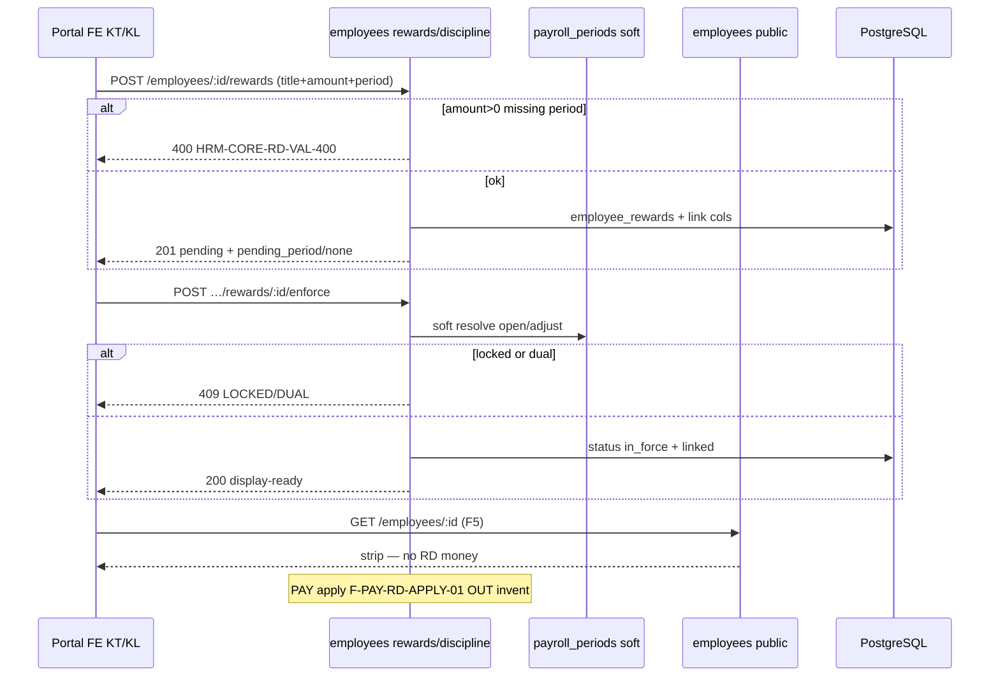

# PO-HRM-MVP-GD1-CORE-08-CLUSTER-API-01 — API F.1 · KT/KL execute + payroll_link (Option A PHYSICAL)

| Field | Value |
|-------|--------|
| **work_item_id** | `PO-HRM-MVP-GD1-CORE-08-CLUSTER-API-01` |
| **program** | `PO-HRM-MVP-GD1-CONTINUOUS` (**U89** — Wave-12 seat **#14**) |
| **lane** | governance · sa |
| **change_mode** | **UPGRADE** DOC-DELTA residual **F-CORE-RD-01** · **ADD** enforce/cancel · **RETAIN** dual LIVE rewards+discipline · **RETAIN** CORE-02 / CORE-01 seals · **NO CODE** `apps/**` · **no seed** · **preserve_default** |
| **Date** | 2026-08-09 |
| **Status** | **CONFIRMED** — F.1 physical Option A · unlock **dev-be** + **dev-fe** |
| **uc_ids** | `UC-BP-CORE-08` |
| **depends_on** | DATA-01 **CONFIRMED** · BA-01 O1–O12 **CONFIRMED** · SA-01 Option **A LOCKED** · Wave-11 CORE-02 **SEALED** stamp **`CORE02QC1-MSL80DU6`** · peer CORE-01 **`CORE01QC1-MSL6WMS7`** |
| **ref_data** | [`PO-HRM-MVP-GD1-CORE-08-CLUSTER-DATA-01.md`](./PO-HRM-MVP-GD1-CORE-08-CLUSTER-DATA-01.md) — §4 link cols ADD both · §5 execution map · soft `payroll_periods` |
| **ref_ba** | [`PO-HRM-MVP-GD1-CORE-08-CLUSTER-BA-01.md`](./PO-HRM-MVP-GD1-CORE-08-CLUSTER-BA-01.md) · AC-CORE-08-* · VAL-CORE-RD-* · O1–O12 · **BR-BP-RD-01** |
| **ref_sa** | [`PO-HRM-MVP-GD1-CORE-08-CLUSTER-SA-01.md`](./PO-HRM-MVP-GD1-CORE-08-CLUSTER-SA-01.md) Option A · F-CORE-RD-01 UPGRADE |
| **ref_core02_api** | [`PO-HRM-MVP-GD1-CORE-02-CLUSTER-API-01.md`](./PO-HRM-MVP-GD1-CORE-02-CLUSTER-API-01.md) — packages/eins · AuthZ/CB-403 **SEALED must_keep** · **≠** CORE pillar DONE |
| **ref_core01_api** | [`PO-HRM-MVP-GD1-CORE-01-CLUSTER-API-01.md`](./PO-HRM-MVP-GD1-CORE-01-CLUSTER-API-01.md) — public strip · Nest `/core` DENY · **≠** RD DONE |
| **ref_srs** | `SRS_HRM_ENTERPRISE.md` **FR-UC-BP-CORE-08** Diễn biến **#1–#5** · **BR-BP-RD-01** · partner **HR-005** |
| **ref_paper_api** | **F-CORE-RD-01** UPGRADE residual · **F-PAY-RD-APPLY-01** peer **OUT invent** · physical prefer rewards* + discipline* · paper `/core/reward-discipline` alias |
| **Honesty** | `recruitment_uat_ready=false` · `jd_dynamic_done=false` · personnel / CORE module UAT **false** · **C-SLICE** · U65 · **DENY** claim CORE-02 packages = pillar DONE · **DENY** claim note-CRUD = FR-08 DONE |
| **ba-data** | **ALREADY CONFIRMED** (DATA-01) — this seat **does not** re-open schema invent |
| **ack_status** | **PASS_TO_PM CONFIRMED** |
| **artifact_size** | SPEC_LEN=36195 · EVID_LEN=8249 (NFD path) |

---

## 1. Verdict — **CONFIRMED**

| Decision | Stamp |
|----------|--------|
| Physical RD SoT GĐ1 | Nest `@Controller('employees')` — **`/api/hrm/employees/:employeeId/rewards*`** + **`/api/hrm/employees/:employeeId/discipline*`** **ONLY** SoT |
| Dual tables | **RETAIN** `employee_rewards` ∪ `employee_discipline` — **DENY** Nest `/core` dual · **DENY** silent wipe for greenfield `hrm_reward_discipline` |
| F-CORE-RD-01 | **UPGRADE residual** — DTO/ensureSchema **ADD** `payroll_link_status` + soft `payroll_period_id` (+ recommended audit/`archived_at`/`payroll_period_ref`) · execution map DATA §5 · amount>0→period · note-only `none` · emp Hoạt động · display-ready VI |
| Enforce / cancel | **ADD** **`POST …/rewards/:rewardId/enforce`** · **`POST …/rewards/:rewardId/cancel-enforce`** · same for **`…/discipline/:disciplineId/…`** — **or** PATCH transition **same SoT** (AC-CORE-08-ALT-04) |
| Paper path | `POST/GET /api/hrm/core/reward-discipline` (+ `…/{id}/enforce`) = **logical alias only** — **DENY** Nest `@Controller('core')` RD dual SoT |
| Period soft | Soft resolve LIVE **`payroll_periods`** (open/adjust unlocked for enforce) — **OUT** invent period process |
| PAY peer | **OUT invent** **F-PAY-RD-APPLY-01** · **DENY** mandatory `pay_reward_link` · **DENY** CORE `payslip_line` write |
| Decisions | Soft `decision_number` OK · **`/api/hrm/decisions*` ≠ RD payroll SoT** |
| Error mint | **`HRM-CORE-RD-VAL-400`** · **`HRM-CORE-RD-ENFORCE-409`** · **`HRM-CORE-RD-DUAL-PERIOD-409`** · **`HRM-CORE-RD-LOCKED-PERIOD-409`** · **`HRM-CORE-RD-EMP-INACTIVE-409`** · optional **`HRM-CORE-RD-PERIOD-404`** / **`HRM-CORE-RD-404`** |
| Envelope | **RETAIN** `{ code, message, data }` · success family **`HRM-EMP-PROFILE-200/201/202`** (LIVE) · domain **`HRM-CORE-RD-*`** on fail |
| U19 | list rewards **=** get/patch/enforce/cancel-enforce rewards · list discipline **=** get/patch/enforce/cancel · soft period resolve — same `resolveHrmListScope` + employee profile scope family |
| Display-ready | Amounts (number + optional `amount_display` vi-VN) · dates ISO · UX `dd/MM/yyyy` · `status_label` / `payroll_link_status_label` / period label from BE |
| CORE-02 / CORE-01 | **RETAIN** packages\|eins · **`HRM-CORE-CB-AUTHZ-403`** · **`HRM-CORE-CB-403`** · public strip · Nest `/core` DENY · stamps **`CORE02QC1-MSL80DU6`** · **`CORE01QC1-MSL6WMS7`** · J-HRM-CORE-02-* / J-HRM-CORE-01-* — **≠** pillar DONE · **≠** FR-08 DONE via note-CRUD |
| Peers OUT | F-PAY-RD-APPLY-01 · F-PAY-PROCESS-01 · CORE-09/05/06/07 · ATT · CORE-02b invent |
| This seat | Docs only — **NO** `apps/**` · **NO** seed · **NO** honesty flip · **NO** reopen sealed J-CORE-02/01 |
| Unlock | **dev-be** + **dev-fe** (rule 26 split) after this **CONFIRMED** |

```text
  FE «Khen thưởng & kỷ luật» (tab hồ sơ NV)
        │  Network assert path contains /employees/:id/rewards
        │  OR /employees/:id/discipline — NOT Nest /core SoT
        ▼
  GET/POST/PATCH /api/hrm/employees/:id/rewards*
  GET/POST/PATCH /api/hrm/employees/:id/discipline*
        │  Title-first · amount>0 → payroll_period_id
        │  create → status pending (Chờ) · link none|pending_period
        │  ADD POST …/:caseId/enforce → Đang/Đã + linked
        │  ADD POST …/:caseId/cancel-enforce → Hủy/unlink (unlocked)
        │  dual-period 409 · locked 409 · emp inactive 409
        │
        ├─► Soft resolve payroll_periods (open/adjust)
        │     DENY invent pay process / payslip_line CORE write
        │
        ├─► Soft decision_number (≠ /decisions* SoT)
        │
        └─► Public GET /employees/:id (CORE-01 SEALED)
              still strip C&B/RD money · F5 no leak
              public body C&B/RD money → HRM-CORE-CB-403 RETAIN

  paper /api/hrm/core/reward-discipline (+ /enforce) = alias only
  note-CRUD alone ≠ FR-UC-BP-CORE-08 DONE
  CORE-02 packages GWC ≠ CORE pillar DONE
```

**Invariant CORE-RD-PATH (O1):** KT/KL mutate Network **MUST** hit rewards and/or discipline · Nest dual `/core` RD = **FAIL**.

**Invariant CORE-RD-AMOUNT-PERIOD (O2):** amount/`penalty_amount` >0 **without** soft `payroll_period_id` on create and/or enforce → **400/409** · **not** silent 2xx.

**Invariant CORE-RD-NOTE (O4):** amount null/0 **and** no period → `payroll_link_status=none` → **EXCLUDE** from PAY apply filter contract.

**Invariant CORE-RD-ENFORCE (O3):** Enforce amount>0 → execution Đang/Đã + `payroll_link_status ∈ {linked,executed}` + period bound · F5 retains.

**Invariant CORE-RD-CANCEL-UNLOCK (O3):** Cancel on unlocked → unlink (`none`/`pending_period` or Hủy) · gone from open PAY filter.

**Invariant CORE-RD-LOCKED (O3):** Period locked → deny mutate/cancel affecting locked payslip → **409** `HRM-CORE-RD-LOCKED-PERIOD-409`.

**Invariant CORE-RD-DUAL-PERIOD (BR-BP-RD-01):** One case → two open/adjust periods → **409** `HRM-CORE-RD-DUAL-PERIOD-409`.

**Invariant CORE-RD-EMP (O2):** Emp not Hoạt động → create and/or enforce → **409** `HRM-CORE-RD-EMP-INACTIVE-409`.

**Invariant CORE-RD-SOFT-PERIOD (O6):** Soft resolve existence + company scope — **no** hard FK CASCADE SoT.

**Invariant CORE-RD-NO-PAY-WRITE (O8):** CORE **MUST NOT** invent `payslip_line` / dual-write amount onto payslip engine this seat.

**Invariant CORE-RD-NO-PAY-LINK-MANDATORY (O8):** **DENY** requiring `pay_reward_link` row as CORE create/enforce SoT — soft cols on dual tables suffice.

**Invariant CORE-RD-≠-DECISIONS (O7):** `/decisions*` **≠** RD payroll SoT.

**Invariant CORE-RD-≠-CB-DONE (O9):** CORE-02 packages GWC **≠** CORE pillar DONE.

**Invariant CORE-RD-≠-NOTE-DONE (O10):** note-CRUD alone **≠** FR-UC-BP-CORE-08 DONE.

**Invariant CORE-RD-S-SCOPE (U19):** list = get = patch = enforce = cancel-enforce = soft period resolve.

---

## 2. AS-IS Nest baseline → residual gap

| Surface | LIVE (read-only cite) | Gap vs F.1 residual |
|---------|----------------------|---------------------|
| `GET/POST/PATCH/DELETE …/employees/:employeeId/rewards*` | LIVE `EmployeesController` + `EmployeeProfileService` · codes `HRM-EMP-PROFILE-*` | **RETAIN** SoT · **UPGRADE** link DTO + gates · prefer soft archive over hard DELETE when linked |
| `GET/POST/PATCH/DELETE …/employees/:employeeId/discipline*` | LIVE same profile service | **RETAIN** · same UPGRADE |
| ensureSchema dual tables | `employee_rewards` / `employee_discipline` — **no** `payroll_link_*` | **ADD** DATA §4 cols both |
| Create default status | DB default `'active'` · FE often `approved`/`active` | Prefer create → **`pending`** + link `none`/`pending_period` (DATA §5.2) |
| Enforce / cancel routes | **ABSENT** | **ADD** POST enforce + cancel-enforce (or PATCH transition same SoT) |
| amount>0 without period | Allowed | **FAIL-CLOSED** VAL/ENFORCE |
| Dual-period / locked / emp inactive | **ABSENT** guards | **ADD** 409 mint family |
| Nest `/core/reward-discipline` | **ABSENT** as controller SoT | **DENY** invent · paper alias only |
| `pay_reward_link` / payslip_line | **ABSENT** / PAY peer | **OUT** invent · **DENY** mandatory CORE |
| Period catalog | LIVE `payroll_periods` | Soft target **RETAIN** · picker read |
| `/decisions*` | LIVE personnel peer | **≠** RD SoT **RETAIN** |
| CORE-02 / CORE-01 | SEALED | **must_keep** · **≠** DONE claims |
| Source | `employees.controller.ts` (~L1073–1207) · `employee-profile.service.ts` ensureSchema + CRUD · FE `EmployeeRewardsDiscipline` | Dev after this CONFIRMED |

**FORBIDDEN invent this seat:** Nest `@Controller('core')` RD SoT · second unified table wipe dual · mandatory `pay_reward_link` · payslip_line CORE write · fold into `/decisions` · claim CORE-02=pillar DONE · claim note-CRUD=FR-08 DONE · reopen J-CORE-02/01 · seed · honesty flip · apps/** · F-PAY-RD-APPLY-01 implement.

---

## 3. Path & alias lock (O1)

| Plane | Path |
|-------|------|
| **PHYSICAL (Nest GĐ1)** | **`/api/hrm/employees/:employeeId/rewards`** · **`…/rewards/:rewardId`** · **`…/rewards/:rewardId/enforce`** · **`…/rewards/:rewardId/cancel-enforce`** · **`…/discipline`** · **`…/discipline/:disciplineId`** · **`…/discipline/:disciplineId/enforce`** · **`…/discipline/:disciplineId/cancel-enforce`** |
| **LOGICAL (paper)** | `POST/GET /api/hrm/core/reward-discipline` · `POST …/core/reward-discipline/{id}/enforce` (+ cancel peer) |
| Rule | Client/docs **may** keep paper names; Dev **implements physical only**. Gateway rewrite optional — **not** unlock-gate. |
| QA Network assert | Path **contains** `/employees/` + `/rewards` **or** `/discipline` for RD mutate — **FAIL O1** if FE mutates Nest `/core/*` as second SoT |

| Paper / logical | Physical | DB |
|-----------------|----------|-----|
| F-CORE-RD-01 `/core/reward-discipline` | rewards* + discipline* | `employee_rewards` ∪ `employee_discipline` |
| kind=reward | `/rewards*` | `employee_rewards` |
| kind=discipline | `/discipline*` | `employee_discipline` |
| enforce / cancel | `POST …/enforce` · `…/cancel-enforce` (or PATCH same SoT) | status + `payroll_link_*` |
| Period soft | resolve `payroll_periods` | soft `payroll_period_id` |
| F-PAY-RD-APPLY-01 | Peer **OUT** | optional §5.9 `pay_reward_link` · payslip |
| F-CORE-EMP-02 / SI | CORE-02 SEALED | packages\|eins |
| F-CORE-EMP-01 public | `/employees*` | CORE-01 SEALED strip |

**DELETE residual:** Hard DELETE AS-IS = residual — product remove **SHOULD** prefer `archived_at` or cancel · **FORBIDDEN** hard delete when `payroll_link_status ∈ {linked,executed}` on **locked** period → **409**.

---

## 4. Link + execution (DATA §4–§5 — normative)

### 4.1 DTO ADD (create + get/list + patch)

| Field | Type | Null | Rule |
|-------|------|------|------|
| **`payroll_link_status`** | enum string | NO (response) | `none`\|`pending_period`\|`linked`\|`executed` · create default `none` or `pending_period` if period set |
| **`payroll_period_id`** | uuid | YES | Soft → `payroll_periods` · **required** when amount/`penalty_amount` >0 |
| **`payroll_period_ref`** | string | YES | Display/legacy label — prefer BE join |
| **`payslip_id`** | uuid | YES | Optional audit · **PAY owns** set on executed path — CORE **MAY** observe · **DENY** CORE invent write as SoT |
| **`archived_at`** | timestamptz | YES | Soft-delete preferred |
| **`enforced_at` / `enforced_by`** | audit | YES | Optional on enforce |
| **`cancelled_at` / `cancelled_by`** | audit | YES | Optional on cancel |
| **`link_updated_at`** | timestamptz | YES | Optional |

**Minimum ship:** `payroll_link_status` + `payroll_period_id` on **both** tables/DTOs.

### 4.2 Execution status map (RETAIN column `status`)

| UI / SRS | Canonical write (preferred) | LIVE residual read alias | Typical `payroll_link_status` |
|----------|----------------------------|--------------------------|-------------------------------|
| **Chờ** | `pending` | `pending` | `none` (note) **or** `pending_period` |
| **Đang thi hành** | `in_force` | `approved` · early `active` | `linked` |
| **Đã thi hành** | `executed` | `completed` · `active` · `executed` | `linked` **or** `executed` (after PAY) |
| **Hủy** | `cancelled` | **`cancelled`** (**ADD**) | `none` |

**Serializer:** Response **MUST** expose display-ready `status` (canonical preferred) + `status_label` VI · **MAY** accept residual reads via alias map — **DENY** silent mass wipe of historical `active`/`approved`/`completed`.

**Create residual:** Prefer **`pending` + link none/pending_period`** — FE default `approved`/`active` = impl_gap until FE-01 (not FR-08 DONE).

### 4.3 Soft period resolve

| Rule | Spec |
|------|------|
| Target | LIVE **`public.payroll_periods`** |
| Enforce allow | Period status **open** or **adjust** (unlocked) |
| Unknown / out-of-scope | **404** `HRM-CORE-RD-PERIOD-404` or VAL-400 |
| Dual open attach | **409** `HRM-CORE-RD-DUAL-PERIOD-409` |
| Locked | **409** `HRM-CORE-RD-LOCKED-PERIOD-409` |
| OUT | Invent F-PAY-PROCESS-01 / period catalog write as RD SoT |

### 4.4 PAY filter contract (CORE publishes; PAY implements later)

**INCLUDE** when: amount/`penalty_amount` >0 **AND** `payroll_period_id` matches target period **AND** execution ∈ {Đang, Đã} / status ∈ `{in_force,executed,…residual}` **AND** `payroll_link_status ∈ {linked,executed}`.

**EXCLUDE:** `payroll_link_status=none` (note-only) · cancelled/unlinked · wrong period.

CORE **MAY** reach `linked` on enforce **without** writing payslip. Transition to `executed` = **PAY peer** — **OUT** this seat to **require** payslip write.

---

## 5. F.1 API functions (PHYSICAL)

> Mỗi function: **Mục đích** · **Nghiệp vụ xử lý** · **Tham chiếu bước SRS** · Request/Response → DB · Lỗi.

**Scope:** rewards list/get/patch/enforce/cancel **=** discipline family **=** soft period resolve — **cùng** employee profile `resolveHrmListScope` (**U19**).

---

### 5.1 F-CORE-RD-01 — Rewards CRUD (**UPGRADE**)

| | |
|--|--|
| **METHOD / path** | **`GET/POST /api/hrm/employees/:employeeId/rewards`** · **`PATCH/DELETE /api/hrm/employees/:employeeId/rewards/:rewardId`** |
| **Mục đích** | Tạo/đọc/sửa bản ghi **khen thưởng** title-first trên LIVE SoT; gắn kỳ lương khi có tiền; chuẩn bị lifecycle thi hành — phục vụ FR-UC-BP-CORE-08 Diễn biến **#1** · **BR-BP-RD-01** · AC-CORE-08-01/02/06. |
| **Nghiệp vụ xử lý** | (1) JWT + scope → assert employee in `resolveHrmListScope`. (2) Emp **Hoạt động** gate on create — else **409** `HRM-CORE-RD-EMP-INACTIVE-409`. (3) **Title required** — missing → **400** `HRM-CORE-RD-VAL-400`. (4) `amount` ≥0 · if **amount>0** → require `payroll_period_id` soft-valid open/adjust (or allow create with period → `pending_period`; missing period → **400** VAL). (5) Note-only (amount 0/null + no period) → force `payroll_link_status=none`. (6) Persist ensureSchema link cols · prefer `status=pending` on create. (7) Soft `decision_number` OK — **cấm** require `/decisions` row. (8) Display-ready DTO §6. (9) Soft-delete prefer `archived_at` / cancel · hard DELETE residual fail-closed if linked+locked. (10) **cấm** Nest `/core` dual · payslip_line write · seed. |
| **Tham chiếu bước SRS** | **FR-UC-BP-CORE-08** Diễn biến **#1** · **BR-BP-RD-01** · AC-CORE-08-01/02/06/07 · EX-01/04/18 · O1/O2/O4/O5/O6/O7/O11 · DATA §4–§5 · VAL-CORE-RD-* |
| **Request (POST)** | RETAIN: `reward_date` · `reward_type` · `title` · `description?` · `decision_number?` · `amount?` · `issued_by?` · `notes?` · **ADD:** `payroll_period_id?` · `payroll_period_ref?` · (status omit → pending) |
| **Request → DB** | `employee_rewards` + link cols DATA §4 |
| **Response** | Reward DTO §6.1 · list/get **200** `HRM-EMP-PROFILE-200` · create **201** `HRM-EMP-PROFILE-201` · patch **202** `HRM-EMP-PROFILE-202` |
| **Lỗi** | `HRM-CORE-RD-VAL-400` · `HRM-CORE-RD-EMP-INACTIVE-409` · `HRM-CORE-RD-DUAL-PERIOD-409` · `HRM-CORE-RD-LOCKED-PERIOD-409` · `HRM-CORE-RD-PERIOD-404` · `HRM-CORE-RD-404` / profile 404 · scope 404/409 |

---

### 5.2 F-CORE-RD-01 — Discipline CRUD (**UPGRADE** · same spine)

| | |
|--|--|
| **METHOD / path** | **`GET/POST /api/hrm/employees/:employeeId/discipline`** · **`PATCH/DELETE /api/hrm/employees/:employeeId/discipline/:disciplineId`** |
| **Mục đích** | Tạo/đọc/sửa bản ghi **kỷ luật** title-first — cùng gates amount=`penalty_amount` · kỳ · link · Hoạt động — FR-UC-BP-CORE-08 · AC-CORE-08-ALT-05. |
| **Nghiệp vụ xử lý** | Same as §5.1 with discipline fields (`discipline_date` · `discipline_type` · `penalty_amount` · `effective_from/to`) · identical link enum + period gates · dual-period / locked / note-only. |
| **Tham chiếu bước SRS** | Same FR-UC-BP-CORE-08 · ALT-05 · O1–O6 |
| **Request → DB** | `employee_discipline` + same link family |
| **Response / Lỗi** | Same envelope + `HRM-CORE-RD-*` |

---

### 5.3 F-CORE-RD-01 — Enforce (**ADD**)

| | |
|--|--|
| **METHOD / path** | **`POST /api/hrm/employees/:employeeId/rewards/:rewardId/enforce`** · **`POST /api/hrm/employees/:employeeId/discipline/:disciplineId/enforce`** |
| **Mục đích** | Chuyển Chờ → **Đang/Đã thi hành**; gắn `payroll_link_status=linked` (+ period bound) để PAY-read filter nhận case — FR #2–#3 · AC-CORE-08-03/04 · **BR-BP-RD-01**. |
| **Nghiệp vụ xử lý** | (1) Scope U19 same as get. (2) Emp Hoạt động — else **409** EMP-INACTIVE. (3) Load case · if amount/`penalty_amount`>0 and missing/invalid period → **409** `HRM-CORE-RD-ENFORCE-409` (or VAL-400). (4) Soft resolve period open/adjust unlocked — locked → **409** LOCKED. (5) Dual open period attach → **409** DUAL-PERIOD. (6) Set execution `in_force` or `executed` (product: prefer `in_force` for Đang; `executed` for Đã if business marks complete without PAY) · set `payroll_link_status=linked` · set audit `enforced_at/by` · `link_updated_at`. (7) **DENY** CORE payslip_line write · **DENY** require `pay_reward_link`. (8) Response display-ready · F5 retain. |
| **Tham chiếu bước SRS** | Diễn biến **#2–#3** · O3 · O8 · BR-BP-RD-01 · AC-CORE-08-03/04 · EX-01/02/03/04 |
| **Request** | Optional `{ target_status?: 'in_force'\|'executed', payroll_period_id? }` — if period already on row, body period optional; override must pass dual/locked gates |
| **Response** | Case DTO §6 · **200** `HRM-EMP-PROFILE-200` (or **202** if project prefers mutate code) |
| **Lỗi** | `HRM-CORE-RD-ENFORCE-409` · `HRM-CORE-RD-VAL-400` · `HRM-CORE-RD-DUAL-PERIOD-409` · `HRM-CORE-RD-LOCKED-PERIOD-409` · `HRM-CORE-RD-EMP-INACTIVE-409` · `HRM-CORE-RD-404` · scope |

**PATCH transition alternate (AC-CORE-08-ALT-04):** `PATCH …/rewards/:id` with `{ status: 'in_force' }` **MUST** run **same** enforce gates/service — **FAIL** if PATCH bypasses period/dual/locked checks.

---

### 5.4 F-CORE-RD-01 — Cancel-enforce (**ADD**)

| | |
|--|--|
| **METHOD / path** | **`POST /api/hrm/employees/:employeeId/rewards/:rewardId/cancel-enforce`** · **`POST …/discipline/:disciplineId/cancel-enforce`** |
| **Mục đích** | Hủy thi hành trên kỳ **unlocked** → unlink / Hủy; case **không** còn trên kỳ mở PAY filter — FR #4 · AC-CORE-08-05. |
| **Nghiệp vụ xử lý** | (1) Scope U19. (2) If period **locked** → **409** LOCKED — **DENY** 2xx. (3) Set `status=cancelled` (or unlink to `pending` + `none` per product — prefer **cancelled** + `payroll_link_status=none` · clear or retain period ref as audit). (4) Audit `cancelled_at/by`. (5) Assert gone from open PAY filter contract. (6) Adjust-later period = new case/period (**ALT-02**) — prior locked untouched. |
| **Tham chiếu bước SRS** | Diễn biến **#4–#5** · O3 · AC-CORE-08-05 · EX-03 · ALT-02 |
| **Response** | Case DTO · **200** |
| **Lỗi** | `HRM-CORE-RD-LOCKED-PERIOD-409` · `HRM-CORE-RD-404` · scope · invalid transition → ENFORCE-409 family |

---

### 5.5 Paper alias `/core/reward-discipline` (**ALIAS ONLY**)

| | |
|--|--|
| **METHOD / path** | Paper `POST/GET /api/hrm/core/reward-discipline` · `POST …/{id}/enforce` |
| **Rule** | **DOC-DELTA / optional gateway rewrite** → physical §5.1–§5.4 · **DENY** Nest `@Controller('core')` second RD persist SoT |
| **QA** | Nest dual `/core` RD controller = **FAIL O1** |

---

### 5.6 CORE-02 / CORE-01 / decisions / PAY (**RETAIN / OUT**)

| Surface | Rule |
|---------|------|
| packages / eins / AuthZ / CB-403 | **RETAIN** CORE-02 API/DATA/QC stamp **`CORE02QC1-MSL80DU6`** · J-HRM-CORE-02-* — **≠** pillar DONE |
| Public EMP strip | **RETAIN** CORE-01 · **`HRM-CORE-CB-403`** · stamp **`CORE01QC1-MSL6WMS7`** · **DENY** grow RD money into public GET |
| `/decisions*` | Soft `decision_number` only · **≠** RD mutate SoT |
| F-PAY-RD-APPLY-01 | **OUT invent** — CORE publishes filter contract §4.4 only |

---

## 6. Display-ready DTO

### 6.1 Reward DTO

| Field | Notes |
|-------|--------|
| `id`, `employee_id`, `company_id` | Scope |
| `title`, `reward_type` (+ label), `description?`, `notes?` | Title-first |
| `amount` (number) · optional `amount_display` vi-VN | Money |
| `reward_date` ISO · UX `dd/MM/yyyy` | |
| `decision_number?` | Soft · ≠ decisions SoT |
| `status` · **`status_label`** VI (Chờ/Đang thi hành/Đã thi hành/Hủy) | Map §4.2 |
| **`payroll_link_status`** · **`payroll_link_status_label`** | enum + VI |
| **`payroll_period_id`** · **`payroll_period_ref`** / period label | Soft |
| `payslip_id?` | Observe only |
| `enforced_at?`, `cancelled_at?`, `archived_at?` | Audit |
| `created_at`, `updated_at` | |

### 6.2 Discipline DTO

Same link/status family · `penalty_amount` (+ display) · `discipline_type` · `discipline_date` · `effective_from/to`.

**FORBIDDEN on public EMP DTO:** RD money / period link fields (CORE-01 must_keep).

**FORBIDDEN FE invent:** payslip Net / dual-write amount local (O11).

---

## 7. Error taxonomy (mint / RETAIN)

| Code | HTTP | When | ≠ |
|------|------|------|---|
| **`HRM-CORE-RD-VAL-400`** | **400** | Missing title · invalid amount · amount>0 missing period on create · bad enum | AuthZ |
| **`HRM-CORE-RD-ENFORCE-409`** | **409** | Enforce missing period (amount>0) · invalid transition | VAL-400 |
| **`HRM-CORE-RD-DUAL-PERIOD-409`** | **409** | One case → two open/adjust periods | Scope 409 |
| **`HRM-CORE-RD-LOCKED-PERIOD-409`** | **409** | Mutate/cancel affecting locked payslip | Dual-period |
| **`HRM-CORE-RD-EMP-INACTIVE-409`** | **409** | Emp not Hoạt động on create/enforce | Scope |
| **`HRM-CORE-RD-PERIOD-404`** | **404** | Soft period unknown / out of scope | VAL |
| **`HRM-CORE-RD-404`** | **404** | Case miss (optional mint) · or RETAIN profile 404 | Scope |
| `HRM-EMP-PROFILE-200/201/202` | 2xx | Success envelope **RETAIN** | RD fail codes |
| **`HRM-CORE-CB-403`** | **403** | Public body C&B/RD money leak | **RETAIN** |
| **`HRM-CORE-CB-AUTHZ-403`** | **403** | C&B AuthZ open/mutate packages | **RETAIN** · ≠ RD |
| `HRM-SCOPE-409` / 404 | 409/404 | Out of scope employee/case | RD-* |

**VI messages (intent):** VAL — thiếu tiêu đề / thiếu kỳ lương khi có số tiền · ENFORCE — chưa gắn kỳ hoặc trạng thái không hợp lệ để thi hành · DUAL — một khoản không gắn hai kỳ mở · LOCKED — kỳ đã khóa, không sửa/hủy ảnh hưởng phiếu lương · EMP — nhân viên không ở trạng thái Hoạt động.

**DENY** rewrite sealed `HRM-COMP-*` / `HRM-EINS-*` / public `HRM-EMP-*` success semantics beyond RD residual.

---

## 8. U19 scope_parity

| Surface | Resolver |
|---------|----------|
| rewards list/get/patch/enforce/cancel-enforce | `resolveHrmListScope` + assert employee/resource |
| discipline list/get/patch/enforce/cancel-enforce | same |
| soft `payroll_periods` resolve | same company/employee scope family |
| Public employees | CORE-01 RETAIN same ladder · no RD money leak |

**Flag `scope_parity`:** list reward/discipline id → get/enforce **404** under group CEO `main` = **defect** (U19).



---

## 9. Traceability (BA / DATA → API → FE → Test)

| Requirement | API function | FE / Journey | Test expect |
|-------------|--------------|--------------|-------------|
| FR #1 · O1/O2 | §5.1/§5.2 create | **J-HRM-CORE-08-01** | POST rewards\|discipline 2xx · Chờ · period if money · path physical |
| FR #2–#3 · O3 · BR-BP-RD-01 | §5.3 enforce | **J-HRM-CORE-08-02** | linked F5 · no payslip_line CORE |
| FR #4 · O3/O4 | §5.4 cancel · note-only | **J-HRM-CORE-08-03** | unlink · none not PAY |
| O1/O7/O9/O10 · locked | §5.5 alias · seals | **J-HRM-CORE-08-04** | Nest `/core` 0 · CB/AuthZ RETAIN · LOCKED 409 · ≠ DONE claims |
| O5 DATA | ensureSchema both tables | — | cols present |
| O6 soft period | resolve `payroll_periods` | picker | open/adjust only |
| O8 OUT | — | — | no F-PAY invent · no pay_reward_link mandatory |
| U19 | CORE-RD-S-SCOPE | Group CEO | list=get=enforce |
| DATA §4–§5 | link + status map | — | no wipe dual · no silent status wipe |

**ba-data:** ALREADY CONFIRMED — Dev implements ensureSchema from DATA §4 · **no** re-invent sole `hrm_reward_discipline` wipe.

**J-* DRAFT (BA):** `J-HRM-CORE-08-01..04` — promote after Dev+QA.

**must_keep journeys:** `J-HRM-CORE-02-*` · `J-HRM-CORE-01-*` — **DENY** reopen rewrite.

---

## 10. DENY / must_keep footer

| Class | Items |
|-------|--------|
| **must_keep** | LIVE dual `employee_rewards` + `employee_discipline` · LIVE `/employees/:id/rewards*` + `/discipline*` · LIVE `payroll_periods` soft target · CORE-02 packages\|lines\|history + `employee_insurances` + rate period · **`HRM-CORE-CB-AUTHZ-403`** · **`HRM-CORE-CB-403`** · CORE-01 public strip · Nest `/core` DENY · stamps **`CORE02QC1-MSL80DU6`** · **`CORE01QC1-MSL6WMS7`** · J-HRM-CORE-02-* · J-HRM-CORE-01-* · soft-delete doctrine · U19 · W1–W11 seals · honesty false · success `HRM-EMP-PROFILE-*` envelope |
| **DENY** | Nest `/core` dual RD SoT · second `hrm_reward_discipline` wipe dual without migrate · mandatory `pay_reward_link` as CORE SoT · payslip_line / dual-write amount on CORE · fold RD into `/decisions` · claim CORE-02=pillar DONE · claim note-CRUD=FR-08 DONE · reopen sealed J-CORE-02/01 without regression · seed · honesty flip · apps/** this seat · silent auto-link legacy amount>0 |
| **OUT** | F-PAY-RD-APPLY-01 implement · F-PAY-PROCESS-01 · UC-BP-CORE-09/05/06/07 · ATT · CORE-02b invent |
| **Honesty** | `recruitment_uat_ready=false` · `jd_dynamic_done=false` · CORE/personnel UAT **false** · **C-SLICE** |

---

## 11. Dev unlock packet

### 11.1 Dev-BE (`PO-HRM-MVP-GD1-CORE-08-CLUSTER-BE-01`)

1. **ensureSchema** ADD DATA §4 link cols on **both** `employee_rewards` + `employee_discipline` (minimum `payroll_link_status` + `payroll_period_id`; recommended `archived_at` + `payroll_period_ref` + audit).
2. **UPGRADE** create/list/get/patch DTOs + persist · prefer create `status=pending` · note-only → `none` · amount>0 → period gate VAL-400.
3. **ADD** `POST …/rewards/:id/enforce` + `…/cancel-enforce` · same for discipline · (or PATCH transition same service gates).
4. Soft resolve `payroll_periods` · mint `HRM-CORE-RD-*` (VAL/ENFORCE/DUAL/LOCKED/EMP/PERIOD-404) · dual-period + locked + emp inactive.
5. Execution serializer map DATA §5 · display-ready VI labels · U19 jest list=get=enforce.
6. Prefer soft archive over hard DELETE when linked; locked+linked hard delete → 409.
7. **RETAIN** CORE-02 AuthZ/CB-403 · CORE-01 public strip · Nest `/core` DENY · decisions ≠ RD · **OUT** payslip_line / pay_reward_link mandatory / F-PAY invent.
8. **DENY** claim CORE-02=pillar DONE · note-CRUD=FR-08 DONE · reopen J-CORE-02/01 · seed · honesty flip.

### 11.2 Dev-FE (`PO-HRM-MVP-GD1-CORE-08-CLUSTER-FE-01`)

1. Bind tab KT/KL → Network **`/api/hrm/employees/:id/rewards*`** + **`/discipline*`** — **no** Nest `/core` SoT.
2. Title-first form · amount>0 → period picker (open/adjust) · create Chờ · toast VAL/ENFORCE/DUAL/LOCKED/EMP.
3. Enforce / cancel-enforce buttons → POST physical routes · F5 retain link/status labels from BE.
4. Amounts vi-VN · dates `dd/MM/yyyy` · **DENY** FE invent payslip Net · fold into decisions UI as RD SoT · claim DONE · seed · honesty.

---

## 12. Validation plan (QA after Dev)

| Gate | PASS when |
|------|-----------|
| L0/L1 | Stack + create+period · enforce linked · cancel unlink · note-only excluded · dual/locked/emp 409 · Nest `/core` 0 |
| L2.5 | **J-HRM-CORE-08-01..04** browser U65 — no seed |
| Network | Path rewards*/discipline* · F5 · CORE-02 AuthZ/CB smoke RETAIN |
| Honesty | Flags remain false · C-SLICE · **DENY** CORE-02=pillar DONE · note=FR-08 DONE · reopen J-CORE-02/01 rewrite |

---

## 13. Exit / handoff

| Field | Value |
|-------|--------|
| **ack_status** | **PASS_TO_PM** · API **CONFIRMED** |
| **next_owner** | **pm** → unlock **dev-be** + **dev-fe** |
| **evidence_path** | `docs/qa/evidence/po-hrm-mvp-gd1-core-08-cluster-api-01.md` |
| **Unlocks** | Execution residual F-CORE-RD-01 link + enforce/cancel on LIVE dual |
| **Does not unlock** | Honesty flips · Nest `/core` dual · module CORE UAT · reopen sealed J-CORE-02/01 · claim CORE-02=pillar DONE · claim note-CRUD=FR-08 DONE · F-PAY invent |

### next_dispatch_prompt (copy-ready) — Dev-BE

```text
work_item_id: PO-HRM-MVP-GD1-CORE-08-CLUSTER-BE-01
lane: execution · dev-be
program: PO-HRM-MVP-GD1-CONTINUOUS (U89)
uc_ids: UC-BP-CORE-08
depends_on: API-01 CONFIRMED — docs/program/specs/PO-HRM-MVP-GD1-CORE-08-CLUSTER-API-01.md · DATA-01 · BA-01 O1–O12 · SA Option A · peer CORE02QC1-MSL80DU6
entry_criteria: F.1 CONFIRMED; honesty false; C-SLICE; U65; cấm Nest /core dual · wipe dual for hrm_reward_discipline · pay_reward_link mandatory · payslip_line CORE write · fold /decisions · claim CORE-02=pillar DONE · claim note-CRUD=FR-08 DONE · reopen J-CORE-02/01 · seed · honesty flip
MISSION: Implement physical Nest /api/hrm/employees/:id/rewards* + /discipline* — UPGRADE F-CORE-RD-01: ensureSchema ADD payroll_link_status + soft payroll_period_id (+ archived_at/payroll_period_ref/audit) on BOTH employee_rewards AND employee_discipline; DTO create/list/get/patch display-ready VI; prefer create status=pending + link none|pending_period; amount>0→period VAL-400; note-only→none; ADD POST …/enforce + …/cancel-enforce (or PATCH transition same gates); soft resolve payroll_periods open/adjust; mint HRM-CORE-RD-VAL-400 / ENFORCE-409 / DUAL-PERIOD-409 / LOCKED-PERIOD-409 / EMP-INACTIVE-409 / PERIOD-404; execution map DATA §5; U19 list=get=enforce; RETAIN HRM-CORE-CB-AUTHZ-403 · HRM-CORE-CB-403 · CORE-01 public · Nest /core DENY · decisions≠RD; OUT F-PAY-RD-APPLY-01 invent. Parallel FE-01.
exit: docs/qa/evidence/po-hrm-mvp-gd1-core-08-cluster-be-01.md · READY_FOR_QA
cấm: Nest /core dual · second RD wipe · pay_reward_link mandatory · payslip_line CORE · fold /decisions · claim CORE-02=DONE · claim note=FR-08 DONE · reopen J-CORE-02/01 · seed · honesty flip
```

### Parallel FE

```text
work_item_id: PO-HRM-MVP-GD1-CORE-08-CLUSTER-FE-01
lane: execution · dev-fe
program: PO-HRM-MVP-GD1-CONTINUOUS (U89)
uc_ids: UC-BP-CORE-08
depends_on: API-01 CONFIRMED · BE-01 in parallel OK for UI bind stubs
MISSION: Bind tab KT/KL → GET/POST/PATCH /api/hrm/employees/:id/rewards* + /discipline*; title-first; amount>0 → period picker; Enforce/Cancel → POST …/enforce · …/cancel-enforce; F5 retain status_label + payroll_link_status + period label from BE; amounts vi-VN · dates dd/MM/yyyy; toast VAL/ENFORCE/DUAL/LOCKED/EMP; DENY Nest /core SoT · FE invent payslip Net · fold decisions as RD SoT · claim CORE-02=pillar DONE · claim note-CRUD=FR-08 DONE · seed · honesty.
exit: docs/qa/evidence/po-hrm-mvp-gd1-core-08-cluster-fe-01.md · READY_FOR_QA
```

---

## completion_report

- **Closed:** F.1 physical Option A **CONFIRMED** — **UPGRADE F-CORE-RD-01** on LIVE `/api/hrm/employees/:id/rewards*` + `/discipline*`: DTO/ensureSchema **ADD** `payroll_link_status` + soft `payroll_period_id` (+ audit) · **ADD** enforce/cancel-enforce · execution map Chờ/Đang/Đã/Hủy ↔ LIVE residual · amount>0→period · note-only `none` not PAY-visible · dual-period 409 · locked deny · emp Hoạt động · display-ready VI · paper `/core/reward-discipline` alias only · soft `payroll_periods` · **OUT** F-PAY-RD-APPLY-01 / pay_reward_link mandatory / payslip_line CORE · decisions ≠ RD · **RETAIN** CORE-02 AuthZ/CB-403 · CORE-01 public · Nest `/core` DENY · U19 · **DENY** claim CORE-02=pillar DONE · claim note-CRUD=FR-08 DONE · reopen J-CORE-02/01 · seed · honesty · apps/** · ba-data already CONFIRMED.
- **Residual:** Dev-BE/FE implement · QA U65 J-HRM-CORE-08-01..04 · QC GWC C-SLICE.
- **O1/path:** Physical rewards* + discipline* · paper `/core/reward-discipline` = alias.
