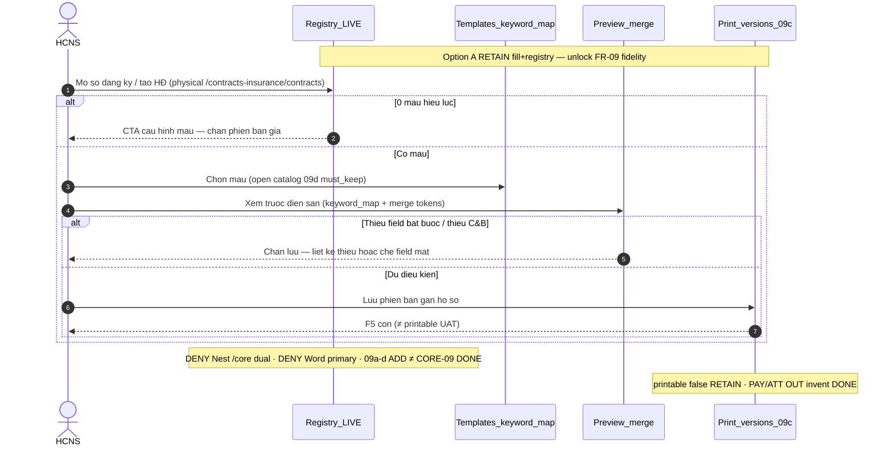

# PO-HRM-MVP-GD1-CORE-09-CLUSTER-SA-01 — Option/F.1 · Hợp đồng LĐ — mẫu điền sẵn / sổ đăng ký — RETAIN LIVE fill+registry vs peer 09a–09d ADD

| Field | Value |
|-------|--------|
| **work_item_id** | `PO-HRM-MVP-GD1-CORE-09-CLUSTER-SA-01` |
| **program** | `PO-HRM-MVP-GD1-CONTINUOUS` (**U89** — single GD continuous · **NO** phase split) |
| **lane** | governance · sa |
| **change_mode** | **ADD** Option/F.1 disposition · **gap-only** · **NO CODE** `apps/**` · **no seed** · **preserve_default** · **DENY** Nest `/core` dual · **DENY** wipe CORE-07 activate / GATE 409 / ACT-400 · **DENY** wipe CORE-06 soft≠DONE · **DENY** wipe CORE-05 assets/BB · **DENY** wipe CORE-03 DOC/ET/CHK · **DENY** wipe CORE-02b EMP-CF · **DENY** wipe CORE-09d..09a ADD seals · **DENY** invent Word/DOCX primary GĐ1 · **DENY** invent PAY/ATT DONE · **DENY** invent printable flip · **DENY** claim 09a–09d ADD alone = CORE-09 EXPAND module DONE |
| **Date** | 2026-08-09 |
| **Status** | **CONFIRMED** · Option **A** **LOCKED** · unlock BA AC → (ba-data HOLD default) → API/FE residual only if BA proves closable gap → Dev |
| **depends_on** | QC-01 GWC Wave-21 UC-BP-CORE-07 **SEALED** — stamp `CORE07QC1-KZJTSHNT` · evidence `docs/qa/evidence/po-hrm-mvp-gd1-core-07-cluster-qc-01.md` · QA `CORE07QA1-MSLJSPGO` · peer must_keep `CORE06QC1-MSLID363` soft≠DONE · `CORE05QC1-MSLGVT40` · `CORE03QC1-MSLFJH0K` · `CORE02BQC1-MSLEFQC1` · `CORE09DQC1-MSLDR8I3` · `CORE09CQC1-MSLBXMUT` · `CORE09BQC1-MSLB05DZ` · `CORE09AQC1-MSLA4LX9` · `CORE08QC1-MSL9BFFE` · `CORE02QC1-MSL80DU6` · `CORE01QC1-MSL6WMS7` · **`R-CORE-07-FE-EMPLOYEE-RECORD` P2 idle-ok** · **`R-CORE-07-HONESTY` INFO RETAIN** · checklist≠CORE-07 DONE · free PATCH≠DONE · soft≠CORE-06 DONE · printable **false** · personnel **false** · **≠** claim CORE-07 DONE |
| **uc_ids** | `UC-BP-CORE-09` |
| **board** | `docs/program/PO_HRM_MVP_GD1_CONTINUOUS.md` — seat **#24** after CORE-07 (#23 SEALED GWC) · CORE-10 remain **QUEUED** · PAY/ATT OUT invent DONE from CORE-07 seat |
| **ref_sa_spine** | Activate [`PO-HRM-MVP-GD1-CORE-07-CLUSTER-SA-01.md`](./PO-HRM-MVP-GD1-CORE-07-CLUSTER-SA-01.md) · Return [`…-06-…`](./PO-HRM-MVP-GD1-CORE-06-CLUSTER-SA-01.md) · Assets [`…-05-…`](./PO-HRM-MVP-GD1-CORE-05-CLUSTER-SA-01.md) · Checklist [`…-03-…`](./PO-HRM-MVP-GD1-CORE-03-CLUSTER-SA-01.md) · EMP-CF [`…-02B-…`](./PO-HRM-MVP-GD1-CORE-02B-CLUSTER-SA-01.md) · TPL [`…-09D-…`](./PO-HRM-MVP-GD1-CORE-09D-CLUSTER-SA-01.md) · VER/PDF [`…-09C-…`](./PO-HRM-MVP-GD1-CORE-09C-CLUSTER-SA-01.md) · pack+PREV [`…-09B-…`](./PO-HRM-MVP-GD1-CORE-09B-CLUSTER-SA-01.md) · CL [`…-09A-…`](./PO-HRM-MVP-GD1-CORE-09A-CLUSTER-SA-01.md) · RD [`…-08-…`](./PO-HRM-MVP-GD1-CORE-08-CLUSTER-SA-01.md) · C&B [`…-02-…`](./PO-HRM-MVP-GD1-CORE-02-CLUSTER-SA-01.md) · public [`…-01-…`](./PO-HRM-MVP-GD1-CORE-01-CLUSTER-SA-01.md) — **reuse · DENY reopen sealed J-HRM-CORE-07-01..05 / J-HRM-CORE-06 / J-HRM-CORE-05 / J-HRM-CORE-03 / J-HRM-CORE-02B / J-HRM-CORE-09D..01 without regression** |
| **ref_honesty** | `recruitment_uat_ready=false` · `jd_dynamic_done=false` · **`contracts_printable_ready=false`** · **`hrm_personnel_uat_ready=false`** · personnel / CORE / CTR module UAT **false** · **DENY claim CORE-07 activate = personnel UAT / FR DONE** · **DENY claim checklist/free PATCH = CORE-07 DONE** · **DENY claim soft = CORE-06 DONE** · **DENY claim 09a–09d ADD = CORE-09 EXPAND module DONE** · **DENY invent PAY/ATT DONE** · **DENY claim printable/closed-8 DONE** |
| **ref_srs** | `SRS_HRM_ENTERPRISE.md` **FR-UC-BP-CORE-09** · Diễn biến mẫu điền sẵn / sổ đăng ký HĐ · AC-CTR-TPL-01..05 · **BR-BP-CTR-01** · peers **FR-UC-BP-CORE-09a · 09b · 09c · 09d** = ADD expand (CL · PREV · VER/PDF · open TPL) — **không** thay vai trò mẫu điền sẵn / sổ đăng ký của FR này · **FR-UC-BP-PLT-01** merge-token principles · SRS 09a: **không** dùng tệp DOCX làm nguồn nội dung GĐ1 |
| **ref_adr** | ADR Catalog+FormSchema+MergeToken · Nest physical prefer · paper `/core` alias only · U19 scope parity · **REJECT** DOCX-primary GĐ1 (prior Option) |
| **ref_paper_api** | `API_DESIGN_HRM_ENTERPRISE.md` **F-CORE-CTR-01** (registry must_keep) · **F-CORE-CTR-PREV-01** (merge keyword) · **F-CORE-CTR-TPL/CL/PACK/VER/PDF** · **F-PLT-TOK / F-EMP-TOK** · must_keep **F-CORE-ACT-01** (CORE-07) · Nest `@Controller('core')` **ABSENT** |
| **ref_db** | LIVE `public.employee_contracts` (registry) · `public.hrm_contract_templates.keyword_map` · `public.hrm_merge_tokens` · `hrm_contract_print_versions` · `hrm_contract_clauses` · Nest `@Controller('core')` **ABSENT** · **DENY** invent Nest `/core` dual |
| **ref_code** | `contracts-insurance.controller` `POST/GET/PATCH/DELETE …/contracts*` · `…/preview` · `…/print-versions*` · `contract-templates*` · `contract-clauses*` · `contract-legal-print.service` keyword_map + resolveMergeTokens · FE `Contracts.tsx` / `ContractPrintSpinePanel.tsx` · `CoreModule` = DB export only — **read-only cite** |
| **OUT** | Nest `/core` dual · Word/DOCX primary invent GĐ1 · wipe CORE-07 activate/GATE/ACT-400 · wipe CORE-06 soft≠DONE · wipe CORE-05/03/02b · wipe 09d..09a ADD · invent PAY/ATT DONE · invent printable DONE · claim 09a–09d ADD = CORE-09 module DONE · claim CORE-07 DONE · claim checklist/free PATCH = CORE-07 DONE · claim soft = CORE-06 DONE · reopen sealed peers · seed · honesty flip |
| **Honesty** | all ready flags **false** · **C-SLICE** · U65 zero-seed · **printable false RETAIN** |
| **ack_status** | **PASS_TO_PM** · Option A CONFIRMED |

---

## 1. Decision Context

| | |
|--|--|
| **Decision title** | Wave-22 architecture unlock: **labor-contract keyword fill + registry** (FR-UC-BP-CORE-09) vs AS-IS LIVE `/contracts-insurance` + peer **09a–09d ADD already SEALED** — **gap-only** under U89 |
| **Requestor** | PM · program `PO-HRM-MVP-GD1-CONTINUOUS` · U89 after CORE-07 QC-01 GWC (`CORE07QC1-KZJTSHNT`) |
| **Date** | 2026-08-09 |
| **Decision owner** | SA |
| **Related requirements** | FR-UC-BP-CORE-09 · BR-BP-CTR-01 · AC-CTR-TPL-01..05 · F-CORE-CTR-01 · F-CORE-CTR-PREV-01 · peers 09a–09d ADD must_keep · CORE-07 activate RETAIN · Nest `/core` DENY · U19 · printable false |

### 1.1 Label lock — board «Word» ≠ DOCX SoT

| Surface | Meaning (GĐ1 LOCK) |
|---------|---------------------|
| Board #24 title | «Hợp đồng LĐ — mẫu Word keyword fill» = **colloquial** for **mẫu điền sẵn từ khóa** |
| SRS FR-UC-BP-CORE-09 | Sinh HĐ từ mẫu (điền từ khóa) + **giữ sổ đăng ký** |
| SRS FR-UC-BP-CORE-09a | Chỗ điền `{{tên_trường}}` · **không** dùng tệp **DOCX** làm nguồn nội dung giai đoạn 1 |
| LIVE SoT | `keyword_map` JSONB + `hrm_merge_tokens` + PREV merge · HTML/PDFKit spine — **not** docxtemplater / Word binary SoT |
| **DENY** | Invent Word/DOCX upload-as-primary template engine **this seat** · claim DOCX = FR-09 DONE · invent printable flip from Option alone |

### 1.2 Problem to Solve

| | |
|--|--|
| **Current state (AS-IS LIVE)** | **CORE-07 SEALED (`CORE07QC1-KZJTSHNT`):** physical `POST /employees/:id/activate` **201** · GATE **409** `HRM-EMP-ACT-CHECKLIST-INCOMPLETE` · free PATCH **400** ACT-400 · Nest `/core` ACT **0** · checklist≠DONE · free PATCH≠DONE · soft≠CORE-06 DONE · **`R-CORE-07-FE-EMPLOYEE-RECORD` P2 idle-ok** · **`R-CORE-07-HONESTY` INFO** · **≠** invent PAY/CORE-09/ATT DONE · **≠** claim CORE-07 DONE. **Peer 09a–09d ADD SEALED:** CL (`CORE09AQC1-MSLA4LX9`) · PACK+PREV ephemeral (`CORE09BQC1-MSLB05DZ`) · VER/PDF ≠ printable (`CORE09CQC1-MSLBXMUT`) · open TPL+clause (`CORE09DQC1-MSLDR8I3`) — **printable false RETAIN** · **≠** closed-8 DONE · **≠** module CTR UAT. **CORE-09 parent AS-IS (Nest PRESENT):** (1) Registry SoT `public.employee_contracts` via **F-CORE-CTR-01** physical `POST/GET/PATCH/DELETE /api/hrm/contracts-insurance/contracts*` (UF-HRM-02 must_keep — create without print template still OK per AC-CTR-XEVN-08). (2) Keyword fill: template `keyword_map` + **F-CORE-CTR-PREV-01** `POST …/contracts/:id/preview` resolve via **F-PLT-TOK-03** / registry wins → empty→keyword_map; C&B mask when ACL thiếu. (3) Version persist **F-CORE-CTR-VER-01** + PDF **F-CORE-CTR-PDF-01** (peer 09c — **≠** printable UAT). (4) **ABSENT:** Nest `@Controller('core')` CTR dual · Word/DOCX binary merge engine as primary SoT. (5) **Gap class:** parent FR-09 **EXPAND** seat after ADD peers — risk claim «09a–d sealed = CORE-09 DONE» / invent Word / invent printable / wipe activate. |
| **Paper target** | FR-UC-BP-CORE-09: 0 mẫu → chỉ CTA cấu hình; có mẫu → xem trước điền sẵn hồ sơ+C&B; thiếu field bắt buộc → chặn; field mật che khi thiếu C&B; lưu phiên bản gắn hồ sơ + F5 còn; **giữ** sổ đăng ký; 09a–09d mở rộng — **không** thay vai trò FR-09. |
| **Gap class** | **GĐ1 continuous AC + journey residual on LIVE registry + keyword fill** — **not** greenfield Nest `/core` dual · **not** Word invent · **not** wipe 09a–d: (1) board #24 needs Option lock mapping CORE-09 ↔ LIVE fill+registry; (2) 09a–d ADD seals **≠** CORE-09 EXPAND module DONE; (3) fidelity residuals on AC-CTR-TPL-01..05 / U65 journeys; (4) risk invent printable / PAY/ATT DONE / reopen CORE-07..01; (5) risk claim CORE-07 activate = personnel UAT. |
| **Constraints** | U89 continuous · **preserve** CORE-07 activate RETAIN (GATE 409 · ACT-400 · Nest DENY · checklist≠DONE · free PATCH≠DONE) · CORE-06 soft≠DONE · CORE-05/03/02b · CORE-09d..01 ADD · Nest `/core` DENY · C-SLICE · DENY seed · **cấm code until Option CONFIRMED** · gap-only · **DENY** honesty flip · **DENY** invent Word/printable/PAY/ATT DONE · **DENY** claim 09a–d = CORE-09 DONE |
| **Failure impact if unresolved** | Board #24 stalls or Dev invents Nest `/core` / Word dual; false claim ADD peers = parent FR DONE; printable honesty flip; regression CORE-07 activate / 09d..01 |

### 1.3 Architecture diagram (target — Option A)

```text
  UC-BP-CORE-01..08 + CORE-02b + CORE-03 + CORE-05 + CORE-06 + CORE-07 (SEALED must_keep)
  + CORE-09a CL · 09b PACK+PREV ephemeral · 09c VER/PDF ≠ printable · 09d open TPL+clause
  Nest /core DENY · printable false · closed-8 ≠ DONE · personnel false · C-SLICE
  ≠ claim CORE-07 DONE · checklist≠DONE · free PATCH≠DONE · soft≠CORE-06 DONE
  ≠ claim 09a–09d ADD = CORE-09 EXPAND module DONE
       │
       │  must_keep RETAIN — DENY reopen J-HRM-CORE-07-01..05 / 06 / 05 / 03 / 02B / 09D..01
       ▼
  ┌────────────── FR-UC-BP-CORE-09 (this seat — gap-only RETAIN fill+registry) ──────┐
  │                                                                                   │
  │  REGISTRY SoT = public.employee_contracts (RETAIN — UF-HRM-02)                    │
  │    Physical /api/hrm/contracts-insurance/contracts*                               │
  │    paper /core/…/contracts = ALIAS ONLY                                           │
  │    Create/sửa sổ (mã · loại · NV · hiệu lực · trạng thái) WITHOUT bắt buộc mẫu in │
  │                                                                                   │
  │  KEYWORD FILL SoT = keyword_map + hrm_merge_tokens + F-CORE-CTR-PREV-01           │
  │    {{token}} ONLY — DENY dual merge syntax · DENY Word/DOCX primary GĐ1           │
  │    Fill from hồ sơ công khai + C&B đủ quyền (mask when thiếu)                     │
  │                                                                                   │
  │  VERSION / PDF spine = F-CORE-CTR-VER/PDF (peer 09c must_keep)                    │
  │    ≠ contracts_printable_ready · ≠ invent printable DONE this Option              │
  │                                                                                   │
  │  PEER ADD (must_keep — DENY wipe / DENY claim = parent DONE)                       │
  │    09a CL · 09b PACK+PREV ephemeral · 09c VER/PDF · 09d open TPL+clause           │
  │                                                                                   │
  │  AS-IS registry CRUD + preview fill = RETAIN path                                 │
  │    ≠ CORE-09 EXPAND module DONE without BA AC + U65 J-* for AC-CTR-TPL-*          │
  │                                                                                   │
  │  FILL / ZERO-TPL / MANDATORY DELTA (gap residual — unlock BA)                     │
  │    R-CORE-09-REG-01 · R-CORE-09-FILL-01 · R-CORE-09-ZERO-TPL · R-CORE-09-MANDATORY│
  │                                                                                   │
  │  must_keep CORE-07 activate · GATE 409 · ACT-400 · Nest /core DENY                │
  │  must_keep CORE-06 soft≠DONE · CORE-05 · CORE-03 · CORE-02b · 09d..01             │
  └───────────────────────────────────────────────────────────────────────────────────┘
       │
       │  OUT this seat
       ▼
  Nest /core dual CTR                          = DENY
  Word/DOCX primary invent GĐ1                 = DENY / OUT
  Wipe CORE-07 activate / GATE / ACT-400       = DENY
  Wipe CORE-06 soft≠DONE / CORE-05 / 03 / 02b  = DENY
  Wipe CORE-09d..09a ADD seals                 = DENY
  Invent PAY DONE / ATT DONE                   = DENY
  Invent printable DONE / flip ready           = DENY
  Claim 09a–09d ADD = CORE-09 module DONE      = DENY
  Claim CORE-07 DONE / checklist / free PATCH  = DENY
  Claim soft = CORE-06 DONE                    = DENY
  Claim printable / closed-8 DONE              = DENY

  Honesty: C-SLICE ≠ hrm_personnel_uat_ready · ≠ contracts_printable_ready
```

**Label lock:** «Hợp đồng LĐ — mẫu điền sẵn / sổ đăng ký» GĐ1 = **LIVE registry + `{{token}}` keyword fill** — **not** Nest `/core` dual; **not** Word/DOCX primary; **not** 09a–d ADD alone = FR-09 DONE; **not** printable UAT.  
**Spine lock:** Physical prefer `/api/hrm/contracts-insurance/*` — paper `/core/…` = **alias only** — **DENY** Nest `/core` second SoT.  
**Peer lock:** 09a–09d ADD seals **RETAIN** and **do not** replace FR-09 registry/fill role — **DENY** claim ADD seals = CORE-09 EXPAND module DONE.  
**Honesty lock:** Slice GWC later **≠** auto-flip `hrm_personnel_uat_ready` · `contracts_printable_ready` · `recruitment_uat_ready` · `jd_dynamic_done` · **≠** claim CORE-07 DONE · **≠** invent PAY/ATT/printable DONE · **≠** claim printable/closed-8 DONE.

---

## 2. LIVE vs gap map (preserve_default)

| Capability | Paper (SRS / API / DB) | AS-IS LIVE | Verdict |
|------------|------------------------|------------|---------|
| Sổ đăng ký HĐ | FR-09 Mục đích · F-CORE-CTR-01 · UF-HRM-02 | `employee_contracts` · `/contracts-insurance/contracts*` | **RETAIN must_keep** |
| Registry without print template | AC-CTR-XEVN-08 / AC-PLT-CTR-TPL-06 | Create contract without template_id OK | **RETAIN** |
| Keyword fill / xem trước | FR-09 Diễn biến #2 · AC-CTR-TPL-02 · F-CORE-CTR-PREV-01 | `POST …/preview` · keyword_map · merge tokens | **RETAIN path** · **≠** FR-09 module DONE alone |
| 0 mẫu hiệu lực | AC-CTR-TPL-01 · Diễn biến #1 | TPL-NONE / CTA Settings (peer 09d) | **UNLOCK residual fidelity** |
| Thiếu field bắt buộc | AC-CTR-TPL-03 · `missing_*` / `can_issue` | PREV returns missing + block VER | **RETAIN** · U65 AC residual |
| C&B mask field mật | AC-CTR-TPL-04 · CORE-02 AuthZ | PREV `cb_masked` / CB-403 peer | **must_keep RETAIN** |
| Lưu phiên bản + F5 | AC-CTR-TPL-05 · F-CORE-CTR-VER-01 | print-versions* LIVE (09c) | **must_keep RETAIN** · **≠** printable UAT |
| Clause library | FR-09a | `/contract-clauses*` SEALED | **must_keep** · **≠** parent DONE |
| Pack + PREV ephemeral | FR-09b | PACK+PREV SEALED | **must_keep** · PREV≠INSERT VER |
| PDF / print | FR-09c | VER/PDF SEALED | **must_keep** · **printable false** |
| Open TPL catalog | FR-09d | open catalog SEALED | **must_keep** · **≠** closed-8 DONE |
| Word / DOCX primary | Board colloquial · SRS 09a DENY GĐ1 | **ABSENT** as SoT | **OUT invent / DENY** |
| Paper `/core` CTR | paper alias | Nest `@Controller('core')` **ABSENT** | **paper = alias only** |
| CORE-07 activate | Peer Wave-21 | GATE 409 · ACT-400 · Nest 0 | **must_keep RETAIN** · **≠** claim DONE |
| PAY / ATT | Peers | OUT from CORE-07 seat | **OUT invent DONE** |
| Module / honesty | program | C-SLICE | **DENY flip** |

---

## 3. Options A / B / C

### Option A — ACCEPT_AS_IS_RETAIN registry + `{{token}}` keyword fill + unlock FR-09 fidelity delta (RECOMMENDED)

| | |
|--|--|
| **Summary** | **RETAIN** LIVE `public.employee_contracts` registry on physical `/api/hrm/contracts-insurance/contracts*` (UF-HRM-02) + keyword fill via `keyword_map` + `hrm_merge_tokens` + **F-CORE-CTR-PREV-01**. Paper `/core/…` = **alias only**. **RETAIN** peer **09a–09d ADD** seals as expand peers — **explicit: ADD seals ≠ CORE-09 EXPAND module DONE**. Unlock BA for AC-CTR-TPL-01..05 / U65 journeys residuals (**R-CORE-09-***). **must_keep** CORE-07 activate (GATE 409 · ACT-400 · Nest DENY · checklist≠DONE · free PATCH≠DONE) · CORE-06 soft≠DONE · CORE-05/03/02b · Nest `/core` DENY. **DENY** Word/DOCX primary invent · invent printable/PAY/ATT DONE. |
| **Scope** | Gap-only docs lock · no `apps/**` this seat |
| **Complexity** | Low–medium (fidelity AC on LIVE spine; no greenfield) |
| **Risk** | Low if BA does not invent Nest dual / Word / claim ADD=DONE / invent printable |
| **Cost / timeline** | BA → ba-data HOLD → API cite → FE residual U65 |
| **Pros** | Matches FR-09 registry+fill role; preserves W10–W21 seals; unlocks board #24; clear printable honesty; aligns SRS DENY DOCX GĐ1 |
| **Cons** | Parent FR still residual until BA/journeys; board «Word» wording needs BA AC language lock |
| **Failure modes** | BA over-scopes Nest `/core` / Word invent · claim 09a–d = CORE-09 DONE · invent printable · wipe CORE-07 |
| **Mitigation** | O1–O12 locks · DENY invent · peers OUT explicit · 09a–d≠DONE · printable false footer |

### Option B — Nest `/core` dual CTR + Word/DOCX primary + wipe 09a–d / CORE-07 (REJECT)

| | |
|--|--|
| **Summary** | Stand up Nest `@Controller('core')` contracts as primary SoT; invent docxtemplater/Word binary merge as GĐ1 SoT; dual-write registry; or wipe/reimplement 09a–d «for symmetry»; reopen CORE-07 activate |
| **Pros** | Paper path / board «Word» literal match illusion |
| **Cons** | Dual SoT · violates U89 preserve · SRS DENY DOCX GĐ1 · high blast · regression CORE-07..01 / 09d..01 |
| **Failure modes** | Dual-write · Nest `/core` non-404 SoT · printable flip · wipe ADD seals |
| **Mitigation** | **REJECT** |

### Option C — HOLD / claim 09a–d ADD = CORE-09 DONE / invent printable / honesty (REJECT)

| | |
|--|--|
| **Summary** | Declare seat DONE because CL/PREV/VER/TPL ADD waves sealed; flip `contracts_printable_ready`; invent PAY/ATT DONE; claim CORE-07 DONE; reopen sealed peers |
| **Pros** | Fast chat claim |
| **Cons** | Violates FR-09 Diễn biến + Mục đích («không thay vai trò» của 09a–d) · honesty locks · C-SLICE |
| **Failure modes** | False UAT · sponsor distrust · printable lie |
| **Mitigation** | **REJECT** |

### Trade-off matrix

| Dimension | A (RETAIN fill+registry) | B (Nest dual+Word) | C (HOLD/claim DONE) |
|-----------|--------------------------|--------------------|---------------------|
| Performance | Neutral | Worse (binary merge / dual) | Fake PASS |
| Reliability | High if residual AC’d | Dual-write + format risk | High defect risk |
| Security / scope | U19 RETAIN · CB mask | New surface | Honesty breach |
| Scalability | Stub → GĐ2 DOCX later | Premature Word SoT | Blocks CORE-10 |
| Maintainability | Best preserve | Worst | Spec lie |
| Fit FR-09 + SRS DENY DOCX | **Yes** | No | No |

---

## 4. Decision

| | |
|--|--|
| **Selected option** | **Option A** — **ACCEPT_AS_IS_RETAIN**: LIVE registry + `{{token}}` keyword fill on `/contracts-insurance/*`; paper `/core` alias only; peer 09a–09d ADD **must_keep ≠** claim CORE-09 EXPAND module DONE; unlock FR-09 fidelity residuals for BA; **RETAIN** CORE-07 activate (GATE 409 · ACT-400 · Nest DENY · checklist≠DONE · free PATCH≠DONE) · CORE-06 soft≠DONE · CORE-05/03/02b · Nest `/core` DENY; **DENY** Nest dual · Word/DOCX primary · wipe peers · honesty flip · reopen seals · invent PAY/ATT/printable DONE · claim CORE-07 DONE · claim printable/closed-8 DONE |
| **Why selected** | AS-IS already implements FR-09 **storage + fill spine** (registry CRUD + keyword_map/merge PREV + VER peer); remaining gap is **GĐ1 BA AC + U65 journeys + explicit parent≠ADD-peer DONE lock** — not greenfield Nest `/core`, not Word invent, not wipe 09a–d/CORE-07; preserves W10–W21 must_keep; unlocks board #24; leaves printable honesty unambiguous |
| **Assumptions** | CORE-07 **`CORE07QC1-KZJTSHNT` RETAIN** · QA `CORE07QA1-MSLJSPGO` · checklist≠DONE · free PATCH≠DONE · soft≠CORE-06 DONE · **`R-CORE-07-FE-EMPLOYEE-RECORD` P2 idle-ok** · **`R-CORE-07-HONESTY` INFO** · **≠** claim CORE-07 DONE. CORE-06 **`CORE06QC1-MSLID363` RETAIN** soft≠DONE. CORE-05 **`CORE05QC1-MSLGVT40` RETAIN**. CORE-03 **`CORE03QC1-MSLFJH0K` RETAIN**. CORE-02b **`CORE02BQC1-MSLEFQC1` RETAIN**. CORE-09d **`CORE09DQC1-MSLDR8I3` RETAIN**. CORE-09c..09a stamps **RETAIN**. Nest `/core` DENY **RETAIN**. `hrm_personnel_uat_ready=false` · `contracts_printable_ready=false` · `recruitment_uat_ready=false` · `jd_dynamic_done=false`. Word/DOCX primary SoT **ABSENT** (grep 2026-08-09). |
| **Rejected** | **B** — Nest `/core` dual / Word invent / wipe CORE-07·06·05·03·02b·09d..01 · **C** — HOLD / claim 09a–d ADD = CORE-09 DONE / invent printable·PAY·ATT / honesty flip / reopen sealed |

### 4.1 OPEN decisions for BA (lockable — not invent)

| ID | Topic | SA default (Option A) | BA must CONFIRM |
|----|-------|----------------------|-----------------|
| **O1** | Physical path | Prefer `/api/hrm/contracts-insurance/contracts*` (+ preview / print-versions / templates) — any `/core/…` = alias / DOC-DELTA only — **DENY** Nest `/core` dual | Cite Network Contracts + Profile |
| **O2** | Keyword syntax | `{{token}}` / `{{tên_trường}}` ONLY on keyword_map + clause body — **DENY** dual syntax · **DENY** Word field codes as GĐ1 SoT | AC language · HDSD cite |
| **O3** | Word/DOCX | Board «Word» = colloquial — **OUT invent** Word/DOCX primary GĐ1 — GĐ2 / peer FR later — **DENY** claim DOCX = FR-09 DONE | Explicit OUT in AC footer |
| **O4** | Registry ≠ DONE | UF-HRM-02 registry CRUD alone = **RETAIN** sổ — **≠** CORE-09 EXPAND module DONE without fill AC + journeys | AC-CORE-09-≠-REG-DONE |
| **O5** | 09a–d ≠ DONE | Peer ADD seals CL/PREV/VER/TPL = **must_keep** expand — **≠** claim = CORE-09 parent module DONE | AC-CORE-09-≠-ADD-PEER-DONE |
| **O6** | Zero template | Residual **R-CORE-09-ZERO-TPL**: 0 active template → CTA cấu hình · **DENY** lưu phiên bản giả | AC-CTR-TPL-01 |
| **O7** | Fill preview | Residual **R-CORE-09-FILL-01**: có mẫu → PREV điền hồ sơ + C&B đủ quyền · **DENY** empty form bắt nhập lại toàn bộ | AC-CTR-TPL-02 |
| **O8** | Mandatory block | Residual **R-CORE-09-MANDATORY**: thiếu field bắt buộc → chặn + liệt kê · **DENY** silent save | AC-CTR-TPL-03 |
| **O9** | C&B mask | Field mật chỉ với đủ quyền C&B — **must_keep** CORE-02 AuthZ/CB-403 · **DENY** invent C&B engine DONE | AC-CTR-TPL-04 |
| **O10** | Honesty / peers OUT | All ready flags false · C-SLICE · **printable false RETAIN** · **DENY** flip personnel/printable/recruitment/jd · **DENY** claim CORE-07 DONE · checklist/free PATCH = CORE-07 DONE · soft = CORE-06 DONE · invent PAY/ATT DONE · claim printable/closed-8 · **must_keep** CORE-07..01 · Nest DENY | Footer every evidence |
| **O11** | Display-ready | PREV/VER DTO: merged_fields · missing_fields · can_issue · cb_masked · template_code · statusLabelVi | FE bind |
| **O12** | Journeys | Mint **J-HRM-CORE-09-01..0n DRAFT** (0 mẫu CTA · chọn mẫu fill PREV · thiếu field block · C&B mask · lưu VER F5 · registry without template · Nest `/core` 0 · 09a–d≠DONE · printable false) · **DENY** reopen sealed J-HRM-CORE-07-01..05 / 06 / 05 / 03 / 02B / 09D..01 | Journey map delta |

### 4.2 API_DESIGN F.1 map (cite RETAIN — residual unlock only if BA proves)

| ID | METHOD / path (physical) | Mục đích | Nghiệp vụ (tóm tắt) | Bước SRS | Disposition |
|----|--------------------------|----------|---------------------|----------|-------------|
| **F-CORE-CTR-01** | `POST/GET/PATCH/DELETE /api/hrm/contracts-insurance/contracts*` · paper `/core/…` alias | Sổ đăng ký HĐ must_keep | Upsert registry · salary off-body · soft-delete · optional template_id · **không** bắt buộc mẫu in | FR-09 Mục đích · AC-CTR-XEVN-08 · Diễn biến gắn hồ sơ | **RETAIN cite LIVE** · **≠** module DONE alone |
| **F-CORE-CTR-PREV-01** | `POST …/contracts/:id/preview` | Xem trước điền sẵn | Resolve TPL+clauses · merge tokens (registry wins → keyword_map) · mask C&B · missing_* · can_issue · **ephemeral** (không INSERT VER) | FR-09 Diễn biến #2 · AC-CTR-TPL-02/03/04 · peer 09b | **RETAIN cite** · unlock fidelity residual |
| **F-CORE-CTR-VER-01/02** | `POST/GET …/print-versions*` | Lưu / đọc phiên bản | Re-validate · INSERT issued · supersede prior · F5 còn | FR-09 Diễn biến #3–#4 · AC-CTR-TPL-05 · peer 09c | **must_keep RETAIN** · **≠** printable UAT |
| **F-CORE-CTR-PDF-01** | `GET …/pdf` | Xuất PDF stub/spine | PDFKit from snapshot · **≠** printable ready | peer 09c | **must_keep** · **printable false** |
| **F-CORE-CTR-TPL-01/02 + CFG** | `…/contract-templates*` · company-settings | Catalog mẫu + keyword_map | Open catalog · starter≠ceiling · activate · clauses bind | peer 09d · FR-09 mẫu | **must_keep RETAIN** · **≠** closed-8 DONE |
| **F-CORE-CTR-CL-01..04** | `…/contract-clauses*` | Thư viện điều khoản | Versioned body · `{{token}}` · snapshot freeze | peer 09a | **must_keep RETAIN** |
| **F-CORE-CTR-PACK-01** | pack-resolve / pack-rules | Gói nghề suggest | Ephemeral suggest | peer 09b | **must_keep RETAIN** |
| **F-PLT-TOK / F-EMP-TOK** | `/merge-tokens*` | Trường trộn | Registry SoT · emp.doc.* / emp.et.* | FR-PLT-01 · fill | **must_keep RETAIN** |
| **F-CORE-ACT-01** | `POST /employees/:id/activate` | must_keep CORE-07 | GATE 409 · ACT-400 · Nest DENY · checklist≠DONE · free PATCH≠DONE | peer 07 | **must_keep RETAIN** · **≠** claim CORE-07 DONE |
| **F-CORE-AST / CHK / EMP-CF / RD / EMP-02 / EMP-01** | peers | must_keep 06/05/03/02b/08/02/01 | soft≠DONE · assets · DOC/ET/CHK · EMP-CF · RD · C&B · public | peers | **must_keep** · **DENY wipe** |
| **PAY / ATT** | peers | — | — | — | **OUT invent DONE** |

**FORBIDDEN GĐ1 invent:** Nest `@Controller('core')` CTR dual SoT · Word/DOCX primary merge engine · wipe `/contracts*` registry · wipe 09a–d ADD · wipe CORE-07 activate/GATE/ACT-400 · wipe CORE-06 soft≠DONE / assets · wipe CORE-03 DOC/ET/CHK · wipe EMP-CF · invent PAY DONE · invent ATT DONE · invent printable DONE · claim 09a–d ADD = CORE-09 DONE · claim CORE-07 DONE · claim checklist/free PATCH = CORE-07 DONE · claim soft = CORE-06 DONE · claim printable/closed-8 DONE.



---

## 5. must_keep / DENY locks (this seat)

| Lock | Rule |
|------|------|
| **L-CORE-09-01 Registry SoT** | Contract registry = LIVE `public.employee_contracts` on `/api/hrm/contracts-insurance/contracts*` — **FORBIDDEN** Nest `/core` second SoT |
| **L-CORE-09-02 Paper alias** | Paper `/core/…/contracts*` = alias only — **FORBIDDEN** Nest dual controller |
| **L-CORE-09-03 Keyword fill** | Fill = `keyword_map` + `hrm_merge_tokens` + PREV — **FORBIDDEN** Word/DOCX primary GĐ1 invent |
| **L-CORE-09-04 09a–d ≠ DONE** | Peer ADD seals CL/PREV/VER/TPL = expand must_keep — **FORBIDDEN** claim = FR-UC-BP-CORE-09 / CORE-09 EXPAND module DONE |
| **L-CORE-09-05 Reg ≠ DONE** | Registry CRUD alone — **FORBIDDEN** claim = CORE-09 module DONE without fill AC + journeys |
| **L-CORE-09-06 Printable** | **`contracts_printable_ready=false` RETAIN** — **FORBIDDEN** invent printable DONE / flip from this Option |
| **L-CORE-09-07 Closed-8** | Open catalog CORR-01 RETAIN — **FORBIDDEN** claim closed-8 TPL DONE |
| **L-CORE-09-08 CORE-07 RETAIN** | Physical activate · GATE 409 · ACT-400 · Nest `/core` DENY · checklist≠DONE · free PATCH≠DONE **RETAIN** `CORE07QC1-KZJTSHNT` — **FORBIDDEN** reopen J-HRM-CORE-07-01..05 without regression · **FORBIDDEN** claim CORE-07 = personnel UAT / FR DONE · **`R-CORE-07-FE-EMPLOYEE-RECORD` P2 idle-ok** · **`R-CORE-07-HONESTY` INFO idle-ok** |
| **L-CORE-09-09 CORE-06 RETAIN** | soft≠DONE · Nest `/core` 0 **RETAIN** `CORE06QC1-MSLID363` — **FORBIDDEN** claim soft = CORE-06 DONE · reopen J-HRM-CORE-06 without regression |
| **L-CORE-09-10 CORE-05 RETAIN** | Assets + BB + serial 409 + DELETE-FORBIDDEN **RETAIN** `CORE05QC1-MSLGVT40` — **FORBIDDEN** reopen J-HRM-CORE-05 without regression |
| **L-CORE-09-11 CORE-03 RETAIN** | DOC/ET/CHK **RETAIN** `CORE03QC1-MSLFJH0K` — **FORBIDDEN** wipe / reopen J-HRM-CORE-03 |
| **L-CORE-09-12 CORE-02b EMP-CF** | Four catalogs + KEY + TOK-03 **RETAIN** — **FORBIDDEN** wipe / reopen J-HRM-CORE-02B |
| **L-CORE-09-13 CORE-09d..09a** | TPL+clause · VER/PDF ≠ printable · PREV ephemeral · CL **RETAIN** stamps — **FORBIDDEN** wipe / reopen J-HRM-CORE-09D..09A without regression |
| **L-CORE-09-14 CORE-08/02/01** | RD · C&B AuthZ · public **RETAIN** stamps |
| **L-CORE-09-15 PAY/ATT OUT** | PAY DONE + ATT DONE **FORBIDDEN invent** this seat |
| **L-CORE-09-16 Honesty** | **DENIED** flip `recruitment_uat_ready` · `jd_dynamic_done` · `contracts_printable_ready` · `hrm_personnel_uat_ready` · module CORE/CTR/personnel UAT · Phase1 · invent PAY/ATT/printable DONE · claim printable/closed-8 DONE · claim CORE-07 DONE |
| **L-CORE-09-17 Seed** | **DENIED** U65 seed for density / UF |
| **L-CORE-09-18 Scope** | Same company scope resolver list↔get↔mutate contracts (**U19**) |
| **L-CORE-09-19 Soft-delete** | Prefer soft-delete contracts / retire templates — **FORBIDDEN** silent hard-delete of issued history |

---

## 6. Rollout / unlock

```text
CORE-09-CLUSTER-SA-01 (this) CONFIRMED · Option A LOCKED
  → ba-process: PO-HRM-MVP-GD1-CORE-09-CLUSTER-BA-01 AC pack (O1–O12)
  → ba-data: HOLD default (no schema invent — keyword_map / employee_contracts / merge_tokens LIVE)
  → (after BA/data) sa API RETAIN cite F-CORE-CTR-01 + PREV + VER/TPL/CL — residual wire ONLY if BA proves closable gap
  → Dev: cấm until contracts CONFIRMED · DENY Nest /core dual · DENY Word invent · DENY wipe CORE-07/06/05/03/02b/09d..01 · DENY invent printable/PAY/ATT · DENY claim 09a–d = CORE-09 DONE
  → QA U65 J-HRM-CORE-09-* · cite LIVE registry + fill · must_keep CORE-07..01 · printable false
  → QC narrow C-SLICE — DENY personnel/printable/module UAT · DENY CORE-09 module DONE · DENY CORE-07 DONE
```

**cấm code until Option CONFIRMED** — this seat = docs-only Option lock.

---

## 7. Validation / acceptance evidence plan

| Layer | Plan |
|-------|------|
| **SA (this)** | Option A LOCK · F.1 map · must_keep · O1–O12 · residuals R-CORE-09-REG/FILL/ZERO-TPL/MANDATORY · printable false · 09a–d≠DONE |
| **BA next** | AC O1–O12 · mint J-HRM-CORE-09-* DRAFT · footer 09a–d≠DONE · printable false · CORE-07 RETAIN · BR-BP-CTR-01 cite · Word OUT |
| **ba-data** | HOLD unless BA proves typed col ABSENT (prefer LIVE keyword_map / employee_contracts / merge_tokens) |
| **API / FE** | Only after BA+data · wire residual fidelity — **DENY** Nest dual · **DENY** Word invent |
| **QA** | U65 browser · AC-CTR-TPL-01..05 · Nest `/core` SoT 0 · must_keep CORE-07 GATE/ACT-400 · printable false |
| **QC** | Narrow C-SLICE GWC only — **DENY** module CORE/CTR/personnel UAT · **DENY** printable flip · **DENY** claim CORE-09 DONE |

---

## 8. Residuals (unlock BA — not invent DONE)

| ID | Class | Disposition |
|----|-------|-------------|
| **R-CORE-09-REG-01** | Registry fidelity | UF-HRM-02 create/edit/F5 sổ — **≠** CORE-09 module DONE alone |
| **R-CORE-09-FILL-01** | Keyword fill | PREV điền hồ sơ+C&B · `{{token}}` — U65 AC |
| **R-CORE-09-ZERO-TPL** | 0 mẫu | CTA cấu hình · chặn phiên bản giả |
| **R-CORE-09-MANDATORY** | Missing fields | Block + liệt kê · DENY silent save |
| **R-CORE-09-ADD-≠-DONE** | Honesty | 09a–09d ADD seals ≠ parent EXPAND DONE — **INFO lock** |
| **R-CORE-09-PRINTABLE** | Honesty | `contracts_printable_ready=false` RETAIN — **INFO lock** · DENY flip from Option |
| **R-CORE-07-*** | Peer idle-ok | FE-EMPLOYEE-RECORD P2 · HONESTY INFO — **RETAIN** · ≠ reopen CORE-07 |

**PAY / ATT / Word-DOCX-primary / Nest `/core` / printable invent** = **OUT invent DONE** this seat.

---

## 9. Completion contract

| Field | Value |
|-------|--------|
| **completion_report** | Option **A LOCKED** for `UC-BP-CORE-09`: gap-only **RETAIN** LIVE registry (`employee_contracts` / F-CORE-CTR-01) + `{{token}}` keyword fill (keyword_map + merge tokens + PREV). Board «Word» = colloquial — **DOCX primary OUT** (SRS 09a DENY GĐ1). Peer **09a–09d ADD seals must_keep ≠ claim CORE-09 EXPAND module DONE**. **must_keep** CORE-07 activate (`CORE07QC1-KZJTSHNT` · GATE 409 · ACT-400 · Nest DENY · checklist≠DONE · free PATCH≠DONE) · CORE-06 soft≠DONE · CORE-05/03/02b · Nest `/core` DENY · printable **false**. **REJECT** Option B (Nest dual/Word/wipe) · Option C (claim ADD=DONE/honesty). Unlock BA AC O1–O12 · residuals R-CORE-09-* · **cấm code** until Option CONFIRMED. **DENY** invent PAY/ATT/printable DONE · reopen sealed J-CORE-07..01 / 09D..01 · seed · apps/**. |
| **next_owner** | **ba-process** |
| **next_dispatch_prompt** | `work_item_id: PO-HRM-MVP-GD1-CORE-09-CLUSTER-BA-01` · lane ba-process · UC-BP-CORE-09 · depends_on SA-01 Option A CONFIRMED `docs/program/specs/PO-HRM-MVP-GD1-CORE-09-CLUSTER-SA-01.md` · stamp peers CORE07QC1-KZJTSHNT · CORE06QC1-MSLID363 soft≠DONE · CORE05QC1-MSLGVT40 · CORE03QC1-MSLFJH0K · CORE02BQC1-MSLEFQC1 · CORE09DQC1-MSLDR8I3..CORE01QC1-MSL6WMS7 · printable false · MISSION: AC pack O1–O12 · mint J-HRM-CORE-09-01..0n DRAFT · footer 09a–d ADD ≠ CORE-09 DONE · registry ≠ DONE alone · Word/DOCX OUT · printable false RETAIN · must_keep CORE-07 activate GATE/ACT-400/Nest DENY/checklist≠DONE/free PATCH≠DONE · soft≠CORE-06 DONE · DENY Nest /core dual · DENY invent PAY/ATT/printable · DENY reopen sealed J-CORE-07/06/05/03/02B/09D..01 · DENY claim CORE-07 DONE · cấm apps/** · evidence `docs/program/specs/PO-HRM-MVP-GD1-CORE-09-CLUSTER-BA-01.md` · next ba-data HOLD default |
| **ack_status** | **PASS_TO_PM** |
| **evidence_path** | `docs/program/specs/PO-HRM-MVP-GD1-CORE-09-CLUSTER-SA-01.md` |

---

*End SA-01 · Option A CONFIRMED · unlock ba-process BA-01 · U89 Wave-22 · printable false RETAIN · 09a–d ADD ≠ CORE-09 DONE · CORE-07 RETAIN · Nest /core DENY · Word OUT · no apps/** · no seed.*
