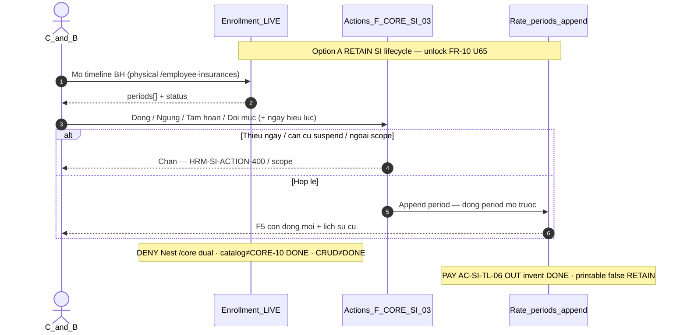

# PO-HRM-MVP-GD1-CORE-10-CLUSTER-SA-01 — Option/F.1 · BHXH lifecycle (Đóng / Ngừng / Tạm hoãn) — RETAIN LIVE enrollment actions

| Field | Value |
|-------|--------|
| **work_item_id** | `PO-HRM-MVP-GD1-CORE-10-CLUSTER-SA-01` |
| **program** | `PO-HRM-MVP-GD1-CONTINUOUS` (**U89** — single GD continuous · **NO** phase split) |
| **lane** | governance · sa |
| **change_mode** | **ADD** Option/F.1 disposition · **gap-only** · **NO CODE** `apps/**` · **no seed** · **preserve_default** · **DENY** Nest `/core` dual · **DENY** wipe CORE-09 fill/registry/PREV/VER (**printable false** · ≠ CORE-09 DONE) · **DENY** wipe CORE-07 activate (**GATE 409** · **ACT-400** · Nest DENY · checklist≠DONE · free PATCH≠DONE) · **DENY** soft=CORE-06 DONE · **DENY** invent PAY/ATT/printable DONE · **DENY** invent Word/DOCX · **DENY** honesty flip · **DENY** claim catalog alone = CORE-10 DONE · **DENY** claim enrollment CRUD alone = CORE-10 DONE |
| **Date** | 2026-08-09 |
| **Status** | **CONFIRMED** · Option **A** **LOCKED** · unlock BA AC → (ba-data HOLD default) → API/FE residual only if BA proves closable gap → Dev |
| **depends_on** | QC-01 GWC Wave-22 UC-BP-CORE-09 **SEALED** — stamp `CORE09QC1-MSLNBA89` · evidence `docs/qa/evidence/po-hrm-mvp-gd1-core-09-cluster-qc-01.md` · QA `CORE09QA1-MSLNTR5P` · must_keep CORE-07 `CORE07QC1-KZJTSHNT` (GATE 409 · ACT-400 · Nest `/core` DENY · checklist≠DONE · free PATCH≠DONE) · soft≠CORE-06 DONE `CORE06QC1-MSLID363` · peer `CORE05QC1-MSLGVT40` · `CORE03QC1-MSLFJH0K` · `CORE02BQC1-MSLEFQC1` · `CORE09DQC1-MSLDR8I3` · `CORE09CQC1-MSLBXMUT` · `CORE09BQC1-MSLB05DZ` · `CORE09AQC1-MSLA4LX9` · `CORE08QC1-MSL9BFFE` · `CORE02QC1-MSL80DU6` · `CORE01QC1-MSL6WMS7` · EMP DOC/ET `EMPPLATQA-MSIZXHIM` · TOK `EMPTOKQA-MSJ290VB` · SI type/insurer platform peers **RETAIN cite** (OUT fold into this seat as catalog DONE) · printable **false** · personnel **false** · **≠** claim CORE-09/07/06 DONE |
| **uc_ids** | `UC-BP-CORE-10` |
| **board** | `docs/program/PO_HRM_MVP_GD1_CONTINUOUS.md` — seat **#25** after CORE-09 (#24 SEALED GWC) · PLT-01 / ATT / PAY remain **QUEUED** · PAY/ATT OUT invent DONE |
| **ref_sa_spine** | Fill+registry [`PO-HRM-MVP-GD1-CORE-09-CLUSTER-SA-01.md`](./PO-HRM-MVP-GD1-CORE-09-CLUSTER-SA-01.md) · Activate [`…-07-…`](./PO-HRM-MVP-GD1-CORE-07-CLUSTER-SA-01.md) · Return [`…-06-…`](./PO-HRM-MVP-GD1-CORE-06-CLUSTER-SA-01.md) · Assets [`…-05-…`](./PO-HRM-MVP-GD1-CORE-05-CLUSTER-SA-01.md) · Checklist [`…-03-…`](./PO-HRM-MVP-GD1-CORE-03-CLUSTER-SA-01.md) · EMP-CF [`…-02B-…`](./PO-HRM-MVP-GD1-CORE-02B-CLUSTER-SA-01.md) · TPL [`…-09D-…`](./PO-HRM-MVP-GD1-CORE-09D-CLUSTER-SA-01.md) · VER/PDF [`…-09C-…`](./PO-HRM-MVP-GD1-CORE-09C-CLUSTER-SA-01.md) · pack+PREV [`…-09B-…`](./PO-HRM-MVP-GD1-CORE-09B-CLUSTER-SA-01.md) · CL [`…-09A-…`](./PO-HRM-MVP-GD1-CORE-09A-CLUSTER-SA-01.md) · RD [`…-08-…`](./PO-HRM-MVP-GD1-CORE-08-CLUSTER-SA-01.md) · C&B [`…-02-…`](./PO-HRM-MVP-GD1-CORE-02-CLUSTER-SA-01.md) · public [`…-01-…`](./PO-HRM-MVP-GD1-CORE-01-CLUSTER-SA-01.md) · prior SI deepen [`PO-HRM-E2E-LINK-EMP-SA-01.md`](./PO-HRM-E2E-LINK-EMP-SA-01.md) **F-CORE-SI-02/03** · SI type [`PO-HRM-DYNAMIC-CONFIG-PLATFORM-SI-INS-CATALOG-SA-01.md`](./PO-HRM-DYNAMIC-CONFIG-PLATFORM-SI-INS-CATALOG-SA-01.md) · SI insurer [`…-SI-INSURER-…`](./PO-HRM-DYNAMIC-CONFIG-PLATFORM-SI-INSURER-CATALOG-BA-01.md) — **reuse · DENY reopen sealed J-HRM-CORE-09-01..06 / J-HRM-CORE-07-01..05 / J-HRM-CORE-06 / 05 / 03 / 02B / 09D..01 without regression** |
| **ref_honesty** | `recruitment_uat_ready=false` · `jd_dynamic_done=false` · **`contracts_printable_ready=false`** · **`hrm_personnel_uat_ready=false`** · personnel / CORE / CTR / SI module UAT **false** · **DENY claim CORE-09 registry/09a–d/VER = CORE-09 DONE** · **DENY claim CORE-07 activate = personnel UAT / FR DONE** · **DENY soft = CORE-06 DONE** · **DENY invent PAY/ATT/printable DONE** · **DENY claim type/insurer catalog alone = CORE-10 DONE** · **DENY claim enrollment CRUD alone = CORE-10 DONE** · **C-SLICE** |
| **ref_srs** | `SRS_HRM_ENTERPRISE.md` **FR-UC-BP-CORE-10** · Diễn biến **#0a–#0f** (danh mục loại / nhà BH) · **#1–#5** (timeline actions) · **AC-SI-TL-01..06** · **AC-SI-CAT-01..03** · **AC-SI-INR-01..03** · **BR-BP-SI-01** · peers CORE-09 printable false · CORE-07 activate · CORE-02 C&B · PAY-07 / PAY-05 OUT invent DONE |
| **ref_adr** | ADR 4-pillar · Nest physical prefer · paper `/core` alias only · U19 scope parity list↔get↔actions · enrollment **ONE SoT** `employee_insurances` · append-only rate periods |
| **ref_paper_api** | `API_DESIGN_HRM_ENTERPRISE.md` **F-CORE-SI-01** · deepen **F-CORE-SI-02/03** (EMP-SA-01) · **F-SI-CAT-TYP/EFF** · **F-SI-CAT-INS-*/EFF** · **F-SI-POL-01** · must_keep **F-CORE-CTR-*** (CORE-09) · **F-CORE-ACT-01** (CORE-07) · Nest `@Controller('core')` **ABSENT** |
| **ref_db** | LIVE `public.employee_insurances` (enrollment ONE SoT) · LIVE `public.hrm_insurance_rate_period` (append-only timeline) · LIVE `si_insurance_type` / `si_insurer` (catalog peers) · Nest `@Controller('core')` **ABSENT** · **DENY** invent Nest `/core` dual |
| **ref_code** | `employee-insurances.controller` `GET/POST/PATCH/DELETE /employee-insurances*` · `POST :insuranceId/actions` · `InsuranceActionDto` `close\|stop\|suspend\|change_rate\|resume` · `employee-insurances.service` `applyAction` append period + status map · FE `EmployeeInsurance.tsx` · `InsuranceTimelineActionsPanel` · `insuranceTimelineActions.ts` · contracts-insurance list bridge enrollment_id · `CoreModule` = DB export only — **read-only cite** |
| **OUT** | Nest `/core` dual · wipe CORE-09 fill/registry/PREV/VER · wipe CORE-07 activate/GATE/ACT-400 · wipe CORE-06 soft≠DONE · wipe CORE-05/03/02b/09d..01 · invent PAY DONE · invent ATT DONE · invent printable DONE · invent Word/DOCX · claim catalog alone = CORE-10 DONE · claim enrollment CRUD alone = CORE-10 DONE · claim LIVE actions without U65 journeys = module DONE · claim CORE-09/07/06 DONE · reopen sealed peers · seed · honesty flip |
| **Honesty** | all ready flags **false** · **C-SLICE** · U65 zero-seed · **printable false RETAIN** |
| **ack_status** | **PASS_TO_PM** · Option A CONFIRMED |

---

## 1. Decision Context

| | |
|--|--|
| **Decision title** | Wave-23 architecture unlock: **BHXH lifecycle Active / Stop / Suspend** (FR-UC-BP-CORE-10 Đóng / Ngừng / Tạm hoãn + đổi mức) vs AS-IS LIVE `/employee-insurances` actions — **gap-only** under U89 |
| **Requestor** | PM · program `PO-HRM-MVP-GD1-CONTINUOUS` · U89 after CORE-09 QC-01 GWC (`CORE09QC1-MSLNBA89`) |
| **Date** | 2026-08-09 |
| **Decision owner** | SA |
| **Related requirements** | FR-UC-BP-CORE-10 · BR-BP-SI-01 · AC-SI-TL-01..06 · AC-SI-CAT · AC-SI-INR · F-CORE-SI-01/02/03 · F-SI-CAT-* peers · must_keep CORE-09 printable false · CORE-07 activate RETAIN · Nest `/core` DENY · U19 · soft≠CORE-06 DONE |

### 1.1 Status vocabulary lock (BHXH ≠ employee Hoạt động)

| Surface | Meaning (GĐ1 LOCK) |
|---------|---------------------|
| Board #25 «Hoạt động» | **Enrollment** status `active` on BH timeline — **not** CORE-07 employee `employees.status=active` |
| SRS Đóng | Action `close` → enrollment `closed` + period row `closed` |
| SRS Ngừng | Action `stop` → enrollment `stopped` + period row `stopped` |
| SRS Tạm hoãn | Action `suspend` → enrollment `suspended` + `suspend_reason` required |
| Đổi mức | Action `change_rate` → append period · keep active unless already suspended |
| Tiếp tục | Action `resume` → enrollment `active` |
| CORE-07 Hoạt động | Employee activate gate — **peer must_keep** · **DENY** conflate / wipe / claim = CORE-10 |

**DENY** invent second BH lifecycle enum table or Nest `/core` dual as primary SoT when LIVE `employee_insurances` + `hrm_insurance_rate_period` already carry the spine.

### 1.2 Problem to Solve

| | |
|--|--|
| **Current state (AS-IS LIVE)** | **CORE-09 SEALED (`CORE09QC1-MSLNBA89`):** registry + keyword fill + PREV ephemeral + VER F5 · Nest `/core` CTR **0** · printable **false** · 09a–d≠DONE · must_keep CORE-07 GATE/ACT · soft≠CORE-06 DONE · **≠** invent PAY/ATT/Word/printable DONE · **≠** claim CORE-09 DONE. **CORE-07 SEALED (`CORE07QC1-KZJTSHNT`):** physical activate · GATE **409** · ACT-400 · Nest `/core` DENY · checklist≠DONE · free PATCH≠DONE. **SI AS-IS (Nest PRESENT):** (1) Enrollment ONE SoT `public.employee_insurances` via physical `/api/hrm/employee-insurances*` (list/get/create/patch/soft-delete). (2) **F-CORE-SI-03 LIVE:** `POST /api/hrm/employee-insurances/:id/actions` with `InsuranceActionDto.action ∈ close\|stop\|suspend\|change_rate\|resume` · `effective_from` required · `suspend_reason` required on suspend · append `hrm_insurance_rate_period` · close prior open period · denorm status on enrollment — **no silent overwrite of history**. (3) FE Profile BH tab: `EmployeeInsurance` + `InsuranceTimelineActionsPanel` + `buildInsuranceActionBody` · change_rate via actions (not silent PATCH contrib). (4) Type/insurer catalogs Nest (`si_insurance_type` / `si_insurer` + EFF pickers) — platform peers **RETAIN cite** · **≠** fold as CORE-10 DONE. (5) contracts-insurance list bridges enrollment_id for actions targets. (6) **ABSENT:** Nest `@Controller('core')` SI dual. (7) **PAY read AC-SI-TL-06** = peer residual **OUT invent PAY DONE**. |
| **Paper target** | FR-UC-BP-CORE-10: quản trị loại/nhà BH + timeline Đóng/Ngừng/Tạm hoãn/Đổi mức kèm ngày hiệu lực → dòng lịch sử mới; F5 còn; kỳ lương đọc mức hiệu lực (PAY peer). |
| **Gap class** | **GĐ1 continuous AC + U65 journey residual on LIVE SI actions** — **not** greenfield Nest `/core` dual: (1) board #25 needs Option lock mapping CORE-10 ↔ LIVE F-CORE-SI-*; (2) catalog seals / enrollment CRUD / LIVE actions **≠** CORE-10 module DONE without AC journeys; (3) risk invent Nest `/core` / wipe CORE-09/07 / invent PAY·ATT·printable DONE; (4) risk conflate BH «Hoạt động» with CORE-07 employee activate; (5) risk claim Word/printable flip from peer seats. |
| **Constraints** | U89 continuous · **preserve** CORE-09 fill/registry printable false · CORE-07 activate RETAIN · CORE-06 soft≠DONE · CORE-05/03/02b/09d..01 · Nest `/core` DENY · C-SLICE · DENY seed · **cấm code until Option CONFIRMED** · gap-only · **DENY** honesty flip · **DENY** invent PAY/ATT/printable/Word DONE · **DENY** claim CORE-09/07/06 DONE |
| **Failure impact if unresolved** | Board #25 stalls or Dev invents Nest `/core` SI dual; false claim catalog/CRUD = FR-10 DONE; PAY/ATT open early; wipe CORE-09/07 seals; honesty flip |

### 1.3 Architecture diagram (target — Option A)

```text
  UC-BP-CORE-01..09d + CORE-02b + CORE-03 + CORE-05 + CORE-06 + CORE-07 + CORE-09 (SEALED must_keep)
  Nest /core DENY · printable false · closed-8 ≠ DONE · personnel false · C-SLICE
  ≠ claim CORE-09/07/06 DONE · checklist≠DONE · free PATCH≠DONE · soft≠CORE-06 DONE
  SI type/insurer platform peers RETAIN cite ≠ CORE-10 DONE
       │
       │  must_keep RETAIN — DENY reopen J-HRM-CORE-09-01..06 / 07 / 06 / 05 / 03 / 02B / 09D..01
       ▼
  ┌────────────── FR-UC-BP-CORE-10 (this seat — gap-only RETAIN SI lifecycle) ─────────┐
  │                                                                                     │
  │  ENROLLMENT SoT = public.employee_insurances (RETAIN — ONE SoT)                     │
  │    Physical /api/hrm/employee-insurances*                                           │
  │    paper /core/…/insurance* = ALIAS ONLY                                            │
  │                                                                                     │
  │  LIFECYCLE ACTIONS = F-CORE-SI-03 LIVE                                              │
  │    POST …/employee-insurances/:id/actions                                           │
  │    close|stop|suspend|change_rate|resume + effective_from                           │
  │    suspend → suspend_reason required (HRM-SI-ACTION-400)                            │
  │    Append hrm_insurance_rate_period — DENY silent overwrite history                 │
  │    Status map: closed|stopped|suspended|active                                      │
  │                                                                                     │
  │  TIMELINE READ = F-CORE-SI-02 LIVE                                                  │
  │    GET list/get-by-id → enrollment + periods[]                                      │
  │                                                                                     │
  │  CATALOG peers (AC-SI-CAT / AC-SI-INR) = F-SI-CAT-* RETAIN cite                     │
  │    ≠ claim catalog admin alone = CORE-10 DONE                                       │
  │                                                                                     │
  │  AS-IS actions LIVE = RETAIN path                                                   │
  │    ≠ CORE-10 module DONE without U65 AC-SI-TL journeys + fidelity AC                │
  │                                                                                     │
  │  PAY read AC-SI-TL-06 = peer residual OUT invent PAY DONE                           │
  │  must_keep CORE-09 printable false · CORE-07 activate · Nest /core DENY             │
  └─────────────────────────────────────────────────────────────────────────────────────┘
       │
       │  OUT this seat
       ▼
  Nest /core dual SI                         = DENY
  Wipe CORE-09 fill/registry/PREV/VER        = DENY
  Wipe CORE-07 activate/GATE/ACT-400         = DENY
  soft = CORE-06 DONE                        = DENY
  Invent PAY/ATT/printable/Word DONE         = DENY
  Claim catalog alone = CORE-10 DONE         = DENY
  Claim enrollment CRUD alone = CORE-10 DONE = DENY
  Conflate BH Hoạt động ↔ CORE-07 activate   = DENY
  Flip personnel / printable / recruit       = DENY
  C-SLICE ≠ module SI / CORE / CTR UAT

  Honesty: C-SLICE ≠ hrm_personnel_uat_ready · ≠ contracts_printable_ready
```

**Label lock:** Board «BHXH lifecycle (Hoạt động / Ngừng / Tạm hoãn)» GĐ1 = **enrollment lifecycle on LIVE `/employee-insurances` actions** — **not** Nest `/core` dual; **not** employee CORE-07 activate; **not** catalog CRUD alone = FR-10 DONE; **not** enrollment create alone = FR-10 DONE.  
**Spine lock:** Physical prefer `/api/hrm/employee-insurances*` + `POST …/actions` — paper `/core/…/insurance*` = **alias only** — **DENY** Nest `/core` second SoT.  
**Honesty lock:** Slice GWC later **≠** auto-flip ready flags · **≠** claim CORE-09/07/06 DONE · **≠** invent PAY/ATT/printable/Word DONE · **C-SLICE**.

---

## 2. LIVE vs gap map (preserve_default)

| Capability | Paper (SRS / API / DB) | AS-IS LIVE | Verdict |
|------------|------------------------|------------|---------|
| Enrollment SoT | F-CORE-SI-01 · ONE SoT | `public.employee_insurances` · `/employee-insurances*` | **RETAIN must_keep** |
| Timeline list/detail | F-CORE-SI-02 · Diễn biến #1/#4 | GET list + get-by-id `periods[]` · FE Profile BH | **RETAIN** · unlock U65 residual |
| Actions Đóng/Ngừng/Tạm hoãn/Đổi mức | F-CORE-SI-03 · AC-SI-TL-01..04 · Diễn biến #2–#3 | `POST …/:id/actions` LIVE · FE panel LIVE | **RETAIN cite** · unlock journey fidelity |
| Append history | AC-SI-TL-04/05 · Diễn biến #4 | `hrm_insurance_rate_period` append + close prior open | **RETAIN must_keep** |
| Suspend căn cứ | AC-SI-TL-03 | `suspend_reason` required → `HRM-SI-ACTION-400` | **RETAIN** |
| Type catalog | AC-SI-CAT · F-SI-CAT-TYP/EFF | Nest `si_insurance_type` + EFF | **RETAIN cite peer** · **≠** CORE-10 DONE alone |
| Insurer catalog | AC-SI-INR · F-SI-CAT-INS-* | Nest `si_insurer` + EFF | **RETAIN cite peer** · **≠** CORE-10 DONE alone |
| Paper `/core` SI | `…/core/employees/{id}/insurance*` | Nest `@Controller('core')` **ABSENT** | **paper = alias only** |
| PAY read mức kỳ | AC-SI-TL-06 · Diễn biến #5 | PAY peer | **OUT invent PAY DONE** · residual cite |
| CORE-09 fill/registry | Peer | SEALED `CORE09QC1-MSLNBA89` · printable false | **must_keep RETAIN** · **≠** reopen |
| CORE-07 activate | Peer | SEALED `CORE07QC1-KZJTSHNT` | **must_keep RETAIN** · **≠** conflate |
| soft CORE-06 | Peer | soft≠DONE | **must_keep RETAIN** |
| Module / honesty | program | C-SLICE | **DENY flip** |

---

## 3. Options A / B / C

### Option A — ACCEPT_AS_IS_RETAIN SI enrollment + actions spine (RECOMMENDED)

| | |
|--|--|
| **Summary** | **RETAIN** LIVE enrollment ONE SoT `public.employee_insurances` on physical `/api/hrm/employee-insurances*` + **RETAIN** LIVE `POST …/:id/actions` (close\|stop\|suspend\|change_rate\|resume) + append-only `hrm_insurance_rate_period` as GĐ1 BHXH lifecycle SoT. Paper `/core/…/insurance*` = **alias only**. **RETAIN cite** type/insurer Nest catalogs (AC-SI-CAT / AC-SI-INR) as peers — **explicit ≠ CORE-10 DONE alone**. Unlock BA for **U65 AC-SI-TL journeys** + fidelity AC + vocabulary lock (BH Hoạt động ≠ CORE-07) + PAY-read trace-only. **must_keep** CORE-09 printable false · CORE-07 activate GATE/ACT-400 · soft≠CORE-06 DONE · Nest `/core` DENY. PAY/ATT/printable/Word **OUT invent DONE**. |
| **Scope** | Gap-only docs lock · no `apps/**` this seat |
| **Complexity** | Low (spine LIVE; residual = journeys/AC packaging) |
| **Risk** | Low if BA does not invent Nest dual / claim catalog=DONE / invent PAY·ATT |
| **Cost / timeline** | BA → ba-data HOLD → API cite RETAIN → FE residual only if gap · QA U65 |
| **Pros** | Matches FR-10 Diễn biến on LIVE F-CORE-SI-*; preserves W10–W22 seals; unlocks board #25; clean PAY consumer later |
| **Cons** | AC-SI-TL-06 still PAY residual; not full insurance product UAT |
| **Failure modes** | BA over-scopes Nest `/core` SI dual · claim catalog/CRUD=DONE · invent PAY/ATT · wipe CORE-09/07 · conflate CORE-07 |
| **Mitigation** | O1–O12 locks · DENY invent · peers OUT explicit · ≠DONE footers |

### Option B — Nest `/core` dual SI + wipe enrollment / invent second SoT (REJECT)

| | |
|--|--|
| **Summary** | Stand up Nest `@Controller('core')` insurance as primary SoT; dual-write enrollment; or wipe/reimplement `employee_insurances` «for paper path literal»; invent Word/DOCX BH form |
| **Pros** | Paper path literal match |
| **Cons** | Dual SoT · violates U89 preserve · high blast · regression CORE-09/07/EMP-SI seals |
| **Failure modes** | Dual-write · Nest `/core` non-404 SoT · honesty flip · wipe actions history |
| **Mitigation** | **REJECT** |

### Option C — HOLD / claim catalog or LIVE actions = CORE-10 DONE / honesty (REJECT)

| | |
|--|--|
| **Summary** | Declare seat DONE because type/insurer panels exist or FE action buttons exist; flip personnel/printable; invent PAY/ATT DONE; reopen sealed peers; claim CORE-09/07 DONE; conflate employee activate |
| **Pros** | Fast chat claim |
| **Cons** | Violates AC-SI-TL U65 · C-SLICE · peer must_keep |
| **Failure modes** | False UAT · PAY reads wrong mức · sponsor distrust |
| **Mitigation** | **REJECT** |

### Trade-off matrix

| Dimension | Weight | A (RETAIN SI actions) | B (Nest dual+wipe) | C (HOLD/claim DONE) |
|-----------|-------:|----------------------:|-------------------:|--------------------:|
| Business value (FR-10) | 5 | **5** | 2 | 0 |
| Time to deliver | 4 | **5** | 1 | Fake PASS |
| Complexity (lower=better) | 3 | **5** | 1 | — |
| Security / scope U19 | 4 | **5** | 2 | Honesty breach |
| Reliability / history | 5 | **5** | 1 | High defect |
| Maintainability | 4 | **5** | 1 | Spec lie |
| Fit AC-SI-TL + preserve | 5 | **5** | 0 | 0 |

---

## 4. Decision

| | |
|--|--|
| **Selected option** | **Option A** — **ACCEPT_AS_IS_RETAIN**: LIVE `/api/hrm/employee-insurances*` + `POST …/actions` (close\|stop\|suspend\|change_rate\|resume) + `hrm_insurance_rate_period` append; paper `/core` = alias only; unlock BA AC-SI-TL U65 + catalog cite ≠ DONE; **RETAIN** CORE-09 printable false · CORE-07 activate · soft≠CORE-06 DONE · Nest `/core` DENY · type/insurer peers; **DENY** Nest dual · wipe CORE-09/07/06/05/03/02b/09d..01 · invent PAY/ATT/printable/Word DONE · claim catalog/CRUD alone = CORE-10 DONE · claim CORE-09/07/06 DONE · honesty flip · reopen seals · seed · apps/** |
| **Why selected** | AS-IS already implements FR-10 **action + append-history spine** (EMP-SA-01 F-CORE-SI-02/03 + FE panel); remaining gap is **U65 journey AC packaging + fidelity + PAY-read cite** — not greenfield Nest `/core`, not wipe CORE-09/07; preserves W10–W22 must_keep; unlocks board #25 |
| **Assumptions** | CORE-09 **`CORE09QC1-MSLNBA89` RETAIN** · QA `CORE09QA1-MSLNTR5P` · printable false · ≠ CORE-09 DONE. CORE-07 **`CORE07QC1-KZJTSHNT` RETAIN** · GATE 409 · ACT-400 · Nest DENY · checklist≠DONE · free PATCH≠DONE · ≠ CORE-07 DONE. soft≠CORE-06 DONE **`CORE06QC1-MSLID363` RETAIN**. Peer CORE-05/03/02b/09d..01 stamps **RETAIN**. Nest `/core` DENY **RETAIN**. `hrm_personnel_uat_ready=false` · `contracts_printable_ready=false` · `recruitment_uat_ready=false` · `jd_dynamic_done=false`. Physical actions route **PRESENT** (grep 2026-08-09). |
| **Rejected** | **B** — Nest `/core` dual / wipe enrollment / Word invent · **C** — HOLD / claim catalog or LIVE actions = CORE-10 DONE / invent PAY·ATT / honesty flip / reopen sealed |

### 4.1 OPEN decisions for BA (lockable — not invent)

| ID | Topic | SA default (Option A) | BA must CONFIRM |
|----|-------|----------------------|-----------------|
| **O1** | Physical path | Prefer `/api/hrm/employee-insurances*` + `POST …/:id/actions` — any `/core/…/insurance*` = alias / DOC-DELTA only — **DENY** Nest `/core` dual | Cite Network Profile BH |
| **O2** | Action vocab | `close`=Đóng · `stop`=Ngừng · `suspend`=Tạm hoãn · `change_rate`=Đổi mức · `resume`=Tiếp tục — 1:1 LIVE DTO | AC-SI-TL map VI↔API |
| **O3** | BH «Hoạt động» | Enrollment `active` — **DENY** conflate with CORE-07 employee activate / claim CORE-07 DONE | Vocabulary footer |
| **O4** | History | Append period only — **DENY** silent overwrite amount/status history · F5 keeps prior rows | AC-SI-TL-04/05 |
| **O5** | Suspend căn cứ | `suspend_reason` required — **DENY** save without căn cứ when config bắt buộc | AC-SI-TL-03 |
| **O6** | Catalog ≠ DONE | AC-SI-CAT / AC-SI-INR = **RETAIN cite** peers — **≠** claim = CORE-10 module DONE | AC-CORE-10-≠-CAT-DONE |
| **O7** | CRUD ≠ DONE | Enrollment create/patch alone = **RETAIN** gắn người — **≠** CORE-10 DONE without lifecycle actions journeys | AC-CORE-10-≠-ENR-DONE |
| **O8** | Actions ≠ module DONE | LIVE panel/API alone — **≠** CORE-10 module DONE without U65 J-* pack | AC-CORE-10-≠-LIVE-DONE |
| **O9** | PAY read | AC-SI-TL-06 = **OUT invent PAY DONE** — cite residual only · **DENY** invent PAY engine | Footer OUT |
| **O10** | Honesty / peers OUT | All ready flags false · C-SLICE · **printable false RETAIN** · **DENY** flip · **DENY** invent ATT/Word · **must_keep** CORE-09/07/06..01 · Nest DENY | Footer every evidence |
| **O11** | Display-ready | periods[] · statusLabelVi · effective_from/to dd/MM/yyyy · suspend_reason · amounts — **DENY** ISO leak / raw key as label | FE bind |
| **O12** | Journeys | Mint **J-HRM-CORE-10-01..0n DRAFT** (timeline load · Đóng · Ngừng · Tạm hoãn+căn cứ · Đổi mức · F5 history · Nest `/core` 0 · catalog≠DONE · CRUD≠DONE · printable false · CORE-07 RETAIN) · **DENY** reopen sealed J-HRM-CORE-09-01..06 / 07 / 06 / 05 / 03 / 02B / 09D..01 | Journey map delta |

### 4.2 API_DESIGN F.1 map (cite RETAIN — residual unlock only if BA proves)

| ID | METHOD / path (physical) | Mục đích | Nghiệp vụ (tóm tắt) | Bước SRS | Disposition |
|----|--------------------------|----------|---------------------|----------|-------------|
| **F-CORE-SI-01** | `POST/PATCH/GET/DELETE /api/hrm/employee-insurances*` · paper `/core/…/insurance` alias | Enrollment + type ∈ EFF | ONE SoT · soft-delete · type KEY assert · **≠** lifecycle DONE alone | FR-10 0b/0e · gắn người | **RETAIN cite LIVE** · **≠** module DONE alone |
| **F-CORE-SI-02** | `GET …/employee-insurances` · `GET …/:id` | Mở timeline + lịch sử | List/detail + `periods[]` · U19 scope | FR-10 Diễn biến **#1/#4** · AC-SI-TL-05 | **RETAIN cite** · unlock U65 residual |
| **F-CORE-SI-03** | `POST …/employee-insurances/:id/actions` | Đóng / Ngừng / Tạm hoãn / Đổi mức / Resume | Append period · map status · suspend_reason · effective_from · **cấm** silent overwrite | FR-10 Diễn biến **#2–#3** · AC-SI-TL-01..04 | **RETAIN cite LIVE** · unlock journey fidelity |
| **F-SI-CAT-TYP/EFF** | `…/insurance-types*` · `/effective` | Danh mục loại BH | Admin N+1 · consumer ∈ EFF · `HRM-INS-TYPE-KEY` | FR-10 **#0a–#0c** · AC-SI-CAT | **RETAIN cite peer** · **≠** CORE-10 DONE |
| **F-SI-CAT-INS-*/EFF** | `…/insurers*` · `/effective` | Danh mục nhà BH | Admin N+1 · consumer ∈ EFF · `HRM-INS-INSURER-KEY` ≠ TYPE | FR-10 **#0d–#0f** · AC-SI-INR | **RETAIN cite peer** · **≠** CORE-10 DONE |
| **F-SI-POL-01** | policies on contracts-insurance | Chính sách | insurer_key ∈ INS-EFF | FR-10 chính sách | **RETAIN cite** · OUT invent DONE as CORE-10 alone |
| **F-CORE-CTR-*** | contracts-insurance contracts/PREV/VER | must_keep CORE-09 | printable false · ≠ CORE-09 DONE | peer 09 | **must_keep RETAIN** |
| **F-CORE-ACT-01** | `POST /employees/:id/activate` | must_keep CORE-07 | GATE 409 · ACT-400 · Nest DENY | peer 07 | **must_keep RETAIN** · **≠** conflate CORE-10 |
| **F-CORE-AST / CHK / EMP-CF / RD / EMP-02 / EMP-01** | peers | must_keep 06/05/03/02b/08/02/01 | soft≠DONE · assets · DOC/ET/CHK · EMP-CF · RD · C&B · public | peers | **must_keep** · **DENY wipe** |
| **PAY / ATT** | peers | AC-SI-TL-06 / ATT-12 | — | — | **OUT invent DONE** |

**FORBIDDEN GĐ1 invent:** Nest `@Controller('core')` SI dual SoT · wipe `/employee-insurances` actions · wipe rate_period append · wipe CORE-09 fill/registry · wipe CORE-07 activate/GATE/ACT-400 · wipe CORE-06 soft≠DONE / assets · wipe CORE-03 DOC/ET/CHK · wipe EMP-CF · invent PAY DONE · invent ATT DONE · invent printable DONE · invent Word/DOCX · claim catalog = CORE-10 DONE · claim enrollment CRUD = CORE-10 DONE · claim CORE-09/07/06 DONE · claim printable/closed-8 DONE.



---

## 5. must_keep / DENY locks (this seat)

| Lock | Rule |
|------|------|
| **L-CORE-10-01 Enrollment SoT** | BH enrollment = LIVE `public.employee_insurances` on `/api/hrm/employee-insurances*` — **FORBIDDEN** Nest `/core` second SoT |
| **L-CORE-10-02 Actions SoT** | Lifecycle = LIVE `POST …/:id/actions` + append `hrm_insurance_rate_period` — **FORBIDDEN** silent overwrite history / invent second action API |
| **L-CORE-10-03 Paper alias** | Paper `/core/…/insurance*` = alias only — **FORBIDDEN** Nest dual controller |
| **L-CORE-10-04 Vocab** | BH Hoạt động = enrollment `active` — **FORBIDDEN** conflate with CORE-07 employee activate |
| **L-CORE-10-05 Catalog ≠ DONE** | Type/insurer Nest catalogs = peer RETAIN — **FORBIDDEN** claim = FR-UC-BP-CORE-10 / CORE-10 module DONE alone |
| **L-CORE-10-06 CRUD ≠ DONE** | Enrollment CRUD alone — **FORBIDDEN** claim = CORE-10 module DONE without AC-SI-TL journeys |
| **L-CORE-10-07 LIVE ≠ module DONE** | Actions LIVE without U65 J-* pack — **FORBIDDEN** claim module SI/CORE DONE |
| **L-CORE-10-08 CORE-09 RETAIN** | Fill+registry · PREV · VER · printable **false** · 09a–d≠DONE **RETAIN** `CORE09QC1-MSLNBA89` — **FORBIDDEN** reopen J-HRM-CORE-09-01..06 · **FORBIDDEN** invent printable/Word DONE · **FORBIDDEN** claim CORE-09 DONE |
| **L-CORE-10-09 CORE-07 RETAIN** | Physical activate · GATE 409 · ACT-400 · Nest `/core` DENY · checklist≠DONE · free PATCH≠DONE **RETAIN** `CORE07QC1-KZJTSHNT` — **FORBIDDEN** reopen J-HRM-CORE-07-01..05 · **FORBIDDEN** claim CORE-07 DONE |
| **L-CORE-10-10 CORE-06 RETAIN** | soft≠DONE **RETAIN** `CORE06QC1-MSLID363` — **FORBIDDEN** claim soft = CORE-06 DONE |
| **L-CORE-10-11 CORE-05..01** | Assets/BB · DOC/ET/CHK · EMP-CF · 09d..01 · RD · C&B · public **RETAIN** stamps — **FORBIDDEN** wipe / reopen without regression |
| **L-CORE-10-12 PAY/ATT OUT** | PAY DONE + ATT DONE **FORBIDDEN invent** this seat (AC-SI-TL-06 cite only) |
| **L-CORE-10-13 Printable/Word** | **`contracts_printable_ready=false` RETAIN** · Word/DOCX invent **FORBIDDEN** |
| **L-CORE-10-14 Honesty** | **DENIED** flip `recruitment_uat_ready` · `jd_dynamic_done` · `contracts_printable_ready` · `hrm_personnel_uat_ready` · module CORE/CTR/SI/personnel UAT · invent PAY/ATT/printable DONE |
| **L-CORE-10-15 Seed** | **DENIED** U65 seed for density / UF |
| **L-CORE-10-16 Scope** | Same company scope resolver list↔get↔actions (**U19**) |
| **L-CORE-10-17 Soft-delete** | Prefer soft-delete enrollment / retire catalogs — **FORBIDDEN** hard-delete history periods for AC cheat |

---

## 6. Rollout / unlock

```text
CORE-10-CLUSTER-SA-01 (this) CONFIRMED · Option A LOCKED
  → ba-process: PO-HRM-MVP-GD1-CORE-10-CLUSTER-BA-01 AC pack (O1–O12)
  → ba-data: HOLD default (no schema invent — employee_insurances + hrm_insurance_rate_period LIVE)
  → (after BA/data) sa API RETAIN cite F-CORE-SI-01/02/03 — residual wire ONLY if BA proves closable gap
  → Dev: cấm until contracts CONFIRMED · DENY Nest /core dual · DENY wipe CORE-09/07/06.. · DENY invent PAY/ATT/printable/Word · DENY claim catalog/CRUD = CORE-10 DONE
  → QA U65 J-HRM-CORE-10-* · cite LIVE actions · must_keep CORE-09/07 · printable false
  → QC narrow C-SLICE — DENY personnel/printable/module UAT · DENY CORE-10 module DONE · DENY CORE-09/07 DONE
```

**cấm code until Option CONFIRMED** — this seat = docs-only Option lock.

---

## 7. Validation / acceptance evidence plan

| Layer | Plan |
|-------|------|
| **SA (this)** | Option A LOCK · F.1 map · must_keep · O1–O12 · residuals R-CORE-10-* · printable false · catalog/CRUD ≠ DONE |
| **BA next** | AC O1–O12 · mint J-HRM-CORE-10-* DRAFT · footer catalog≠DONE · CRUD≠DONE · printable false · CORE-09/07 RETAIN · BR-BP-SI-01 · PAY OUT |
| **ba-data** | HOLD unless BA proves typed col ABSENT (prefer LIVE enrollment + rate_period) |
| **API / FE** | Only after BA+data · wire residual fidelity — **DENY** Nest dual · **DENY** invent PAY |
| **QA** | U65 browser · AC-SI-TL-01..05 · Nest `/core` SoT 0 · must_keep CORE-09 printable false · CORE-07 GATE/ACT · soft≠CORE-06 DONE |
| **QC** | Narrow C-SLICE GWC only — **DENY** module CORE/CTR/SI/personnel UAT · **DENY** printable flip · **DENY** claim CORE-10 DONE |

---

## 8. Residuals (unlock BA — not invent DONE)

| ID | Class | Notes |
|----|-------|-------|
| **R-CORE-10-TL-01** | Journey | U65 Đóng / Ngừng / Tạm hoãn / Đổi mức + F5 history |
| **R-CORE-10-SUSPEND** | AC | suspend_reason / căn cứ config fidelity |
| **R-CORE-10-DISP** | Display | statusLabelVi · dd/MM/yyyy periods · no raw key |
| **R-CORE-10-PAY-06** | Peer OUT | AC-SI-TL-06 PAY read — **OUT invent PAY DONE** |
| **R-CORE-10-CAT-CITE** | Peer | AC-SI-CAT / AC-SI-INR RETAIN ≠ CORE-10 DONE |
| **R-CORE-10-HONESTY** | INFO | C-SLICE · all ready false · printable false |

---

## 9. Handoff

| Field | Value |
|-------|--------|
| **ack_status** | **PASS_TO_PM** |
| **next_owner** | **ba-process** |
| **evidence_path** | `docs/program/specs/PO-HRM-MVP-GD1-CORE-10-CLUSTER-SA-01.md` |
| **completion_report** | Option **A LOCKED** RETAIN LIVE F-CORE-SI-01/02/03 on `/employee-insurances*` + `POST …/actions` (close\|stop\|suspend\|change_rate\|resume) + append `hrm_insurance_rate_period`; paper `/core` alias only; catalog peers RETAIN ≠ CORE-10 DONE; must_keep CORE-09 `CORE09QC1-MSLNBA89` printable false · CORE-07 `CORE07QC1-KZJTSHNT` · soft≠CORE-06 DONE · Nest `/core` DENY; DENY invent PAY/ATT/printable/Word · honesty flip · wipe peers · apps/**; unlock BA AC O1–O12. |
| **next_dispatch_prompt** | See §10 |

---

## 10. next_dispatch_prompt (copy-ready)

```text
work_item_id: PO-HRM-MVP-GD1-CORE-10-CLUSTER-BA-01
role: ba-process
lane: governance
entry_criteria:
  - SA Option A CONFIRMED: docs/program/specs/PO-HRM-MVP-GD1-CORE-10-CLUSTER-SA-01.md
  - CORE-09 SEALED CORE09QC1-MSLNBA89 · printable false · ≠ CORE-09 DONE
  - must_keep CORE-07 CORE07QC1-KZJTSHNT · soft≠CORE-06 DONE · Nest /core DENY
  - NO apps/** · NO seed · U65
mission:
  Produce AC pack O1–O12 for UC-BP-CORE-10 BHXH lifecycle (Đóng/Ngừng/Tạm hoãn/Đổi mức)
  Map AC-SI-TL-01..05 to LIVE POST /api/hrm/employee-insurances/:id/actions
  Explicit: catalog ≠ CORE-10 DONE · enrollment CRUD ≠ DONE · LIVE actions ≠ module DONE without J-*
  Vocabulary: BH Hoạt động = enrollment active — DENY conflate CORE-07 employee activate
  Mint J-HRM-CORE-10-01..0n DRAFT · footer honesty false · printable false · PAY AC-SI-TL-06 OUT invent DONE
  DENY wipe CORE-09/07 seals · DENY invent PAY/ATT/printable/Word · DENY Nest /core dual · C-SLICE
exit_criteria:
  - AC pack path written · O1–O12 locked · PASS_TO_PM · unlock prefer ba-data HOLD then API cite
evidence_path: docs/program/specs/PO-HRM-MVP-GD1-CORE-10-CLUSTER-BA-01.md
ack_status target: PASS_TO_PM
```
