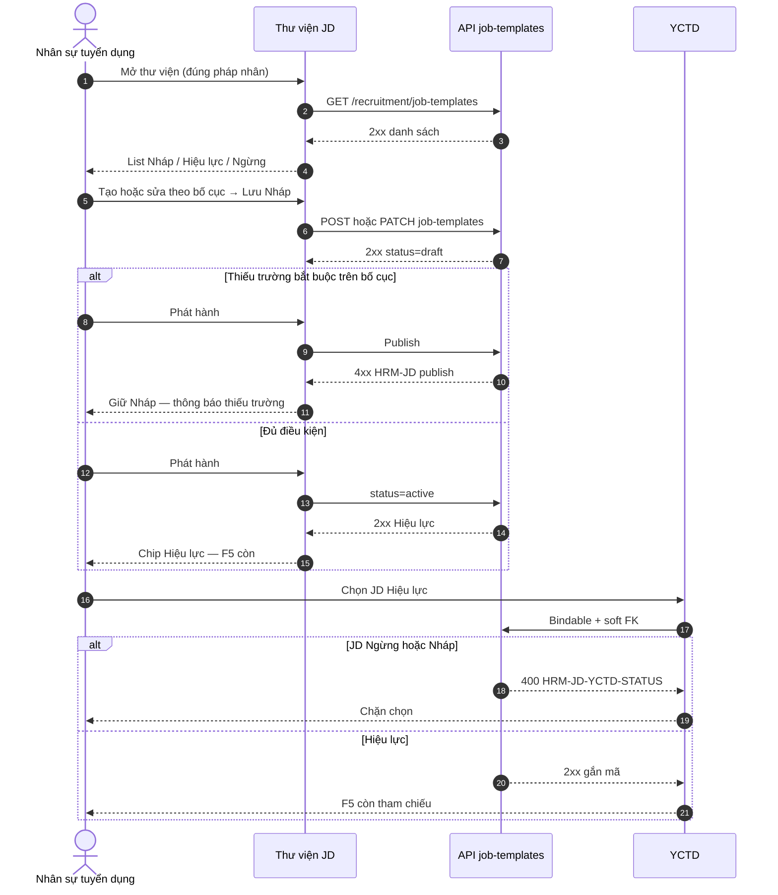

# BA AC pack — Wave-5 REC cluster · UC-BP-REC-00 (Thư viện JD master)

| Meta | Value |
|------|--------|
| **work_item_id** | `PO-HRM-MVP-GD1-REC-00-CLUSTER-BA-01` |
| **program** | `PO-HRM-MVP-GD1-CONTINUOUS` (U89 — single GD continuous · Wave-5 seat **#7**) |
| **lane** | governance · ba-process |
| **Date** | 2026-08-09 |
| **Status** | **CONFIRMED against SA Option A LOCKED** · O1–O7 **CONFIRMED** · Dev **HOLD** until ba-data (O2 status) + SA/API F.1 residual |
| **change_mode** | **ADD** (align SA-01 — **no** wipe paper FR-00 · **no** reopen W1–W4 · **no** redefine 00a/00b/00c) |
| **uc_ids** | `UC-BP-REC-00` *(spine master; 00a/00b/00c = CFG peers RETAIN)* |
| **depends_on** | `PO-HRM-MVP-GD1-REC-00-CLUSTER-SA-01` **Option A LOCKED** · evidence `docs/qa/evidence/po-hrm-mvp-gd1-rec-00-cluster-sa-01.md` |
| **ref_sa** | `PO-HRM-MVP-GD1-REC-00-CLUSTER-SA-01.md` |
| **ref_evidence_sa** | `docs/qa/evidence/po-hrm-mvp-gd1-rec-00-cluster-sa-01.md` |
| **ref_ba_style** | `PO-HRM-MVP-GD1-REC-06A-CLUSTER-BA-01.md` · `PO-HRM-MVP-GD1-REC-08-CLUSTER-BA-01.md` |
| **ref_srs** | `SRS_HRM_ENTERPRISE.md` **FR-UC-BP-REC-00** · **BR-BP-JD-01** · Diễn biến #1–#3 · cross-ref 00a·00b·00c |
| **ref_wbs** | `WBS_HRM_ENTERPRISE.md` **WBS-REC-00** · partner **REQ_REC_003** |
| **ref_yctd** | `PO-HRM-JD-YCTD-REF-*` · soft FK `job_template_id` · F-YCTD-JD-01..05 · **J-HRM-JD-YCTD-01** PASS RETAIN |
| **ref_jd_dyn** | `PO-HRM-JD-DYNAMIC-ARCH-02` Option A · L3 QC-01 GWC · HOLD `jd_dynamic_done=false` |
| **ref_api_paper** | Logical **F-REC-JD-01** · **physical Option A:** `/api/hrm/recruitment/job-templates*` · paper `/api/hrm/rec/job-descriptions*` = **alias only** |
| **ref_spine** | `job_description_templates` + `rec_jd_*` CFG · JobTemplatesTab / Thư viện |
| **Honesty** | `recruitment_uat_ready=false` · **`jd_dynamic_done=false`** · **`C-SLICE-≠-MODULE`** · DENY flip |
| **Cấm** | Nest `/rec` dual · second JD SoT · `job_postings` SoT · REC-03 · seed · reopen W1–W4 · invent beyond SRS · apps/** · flip honesty |

---

## 0. Process objective & actors

### Objective

Khóa **AC đo được** + **Diễn biến FE mutate (U63/U65)** cho Wave-5 seat #7:

1. **UC-BP-REC-00** — Thư viện mô tả công việc (JD master): list theo pháp nhân → tạo/sửa theo bố cục → phát hành Hiệu lực → YCTD chọn JD Hiệu lực → Ngừng giữ lịch sử.
2. **Option A** — ACCEPT_AS_IS_UPGRADE trên spine LIVE `job_description_templates` + Nest `/recruitment/job-templates*` + `rec_jd_*`; paper F-REC-JD-01 = **alias only**.
3. **Không** claim module REC UAT / `jd_dynamic_done=true` sau GWC slice; **không** reopen L3 00a/00b/00c như rewrite.

### Actors

| Actor | Trách nhiệm |
|-------|-------------|
| Nhân sự tuyển dụng (HR) | Mở thư viện · tạo/sửa · phát hành · Ngừng |
| Trưởng bộ phận / HCNS | Cùng quyền thư viện theo scope (SRS) |
| Group CEO | Scope rollup member — không leak JD ngoài scope |
| Member CEO / HRBP | Chỉ pháp nhân / membership · cùng `resolveHrmListScope` |
| Hệ thống (Nest) | CRUD templates · publish gate · code UQ · bindable STATUS · soft FK |

### Scope

| In (this seat) | Out |
|----------------|-----|
| O1–O7 CONFIRM · AC-REC-JD-00-* · VAL-REC-JD-* · Diễn biến FE #1–#3 · J-* DRAFT | Impl `apps/**` / migration / seed |
| Status 3-state lock → ba-data DOC-DELTA | Greenfield `rec_job_description` table |
| Publish required-on-layout · code UQ · Network physical | Nest `/rec/job-descriptions` dual SoT |
| YCTD bind must_keep cite (không redefine F-YCTD-JD) | **UC-BP-REC-03** / `job_postings` JD SoT |
| Peers 00a/00b/00c **reference only** | Rewrite catalog DnD / L3 as FR-00 |
| Honesty footer | Flip `jd_dynamic_done` / `recruitment_uat_ready` / Phase1 DONE |
| | Reopen W1–W4 seals |

### SA Option A — BA CONFIRM (đóng O1–O7)

| # | Topic | BA CONFIRM (normative) |
|---|-------|-------------------------|
| **O1** | Physical path | **YES** — FE mutate/list/get **chỉ** `/api/hrm/recruitment/job-templates*` (F-JD-01..04) · paper `/api/hrm/rec/job-descriptions*` (**F-REC-JD-01**) = **alias only** · Network QA assert path chứa `/recruitment/job-templates` · **FAIL** nếu Nest dual `/rec/job-descriptions` SoT |
| **O2** | Status model | **CONFIRMED — ADD explicit `status`** `draft` \| `active` \| `retired` trên **cùng** bảng `job_description_templates` (ba-data DOC-DELTA · **không** bảng JD thứ hai) · UI VI: **Nháp** / **Hiệu lực** / **Ngừng** · **bridge:** `active` ⇒ `is_active=true`; `draft`\|`retired` ⇒ `is_active=false` (RETAIN YCTD-REF bindable `is_active=true` ∧ not retired) · **REJECT** MVP «chỉ boolean labels» vì SRS Diễn biến #2/#3 + BR-BP-JD-01 **bắt buộc** phân biệt Nháp ≠ Ngừng · create default **`draft`** (không auto-Hiệu lực) |
| **O3** | Publish gate | **YES** — chuyển **Nháp → Hiệu lực** (publish) chỉ khi **đủ trường bắt buộc** trên **bố cục hiệu lực** (00a catalog required ∩ 00b layout) · thiếu → **4xx** family `HRM-JD-*` / `HRM-REC-JD-*` (mint API seat nếu thiếu code) · toast VI · **không** 2xx Hiệu lực · empty layout publish = **FAIL** |
| **O4** | Code UQ | **YES** — UQ `(company_id, code)` trong tập non-archived/non-deleted · trùng → **409** · Hiệu lực không trùng mã đang Hiệu lực cùng pháp nhân (SRS) · case-insensitive per AS-IS RETAIN |
| **O5** | YCTD bind | **YES must_keep** — chỉ JD **Hiệu lực** (`status=active` / bindable) · Ngừng/Nháp → **400** `HRM-JD-YCTD-STATUS` · lịch sử YCTD soft FK **không** CASCADE · **cấm** reopen/rewrite F-YCTD-JD-01..05 contracts · cite **J-HRM-JD-YCTD-01** PASS RETAIN |
| **O6** | Peers 00a/00b/00c | **YES** — CFG SoT RETAIN L3 GWC · FR-00 AC **tham chiếu** bố cục/required · **không** redefine field catalog / DnD / form canvas · claim L3 = FR-00 DONE = **FAIL** |
| **O7** | Honesty | **YES false** — `recruitment_uat_ready=false` · `jd_dynamic_done=false` · **C-SLICE** · GWC slice ≠ module REC UAT · ≠ program DONE |
| **Architecture** | SoT | `job_description_templates` sole JD master · U19 list=get=mutate · `position_code` ∈ job_titles (`HRM-REC-JD-POS`) · soft-retire only |

---

## 1. As-is vs to-be

| | AS-IS (LIVE + seals) | TO-BE (Wave-5 · Option A) |
|---|----------------------|---------------------------|
| JD master table | `job_description_templates` | **RETAIN** sole SoT |
| Nest path | `/recruitment/job-templates*` | **RETAIN** physical prefer |
| Paper `/rec/job-descriptions` | Naming | **Alias only** — DENY dual |
| CFG 00a/00b/00c | `rec_jd_*` + L3 GWC | **RETAIN** peer |
| Status | `is_active` boolean (Nháp≈Ngừng undifferentiated) | **UPGRADE** `status` draft\|active\|retired + `is_active` bridge (**O2**) |
| Create default | Often `is_active=true` | Default **`draft`**; publish explicit (**O3**) |
| Publish gate | Shallow / missing | **UNLOCK** required-on-layout |
| Code UQ | LIVE `(company_id, code)` | **RETAIN** + AC depth (**O4**) |
| YCTD soft FK | LIVE + J-HRM-JD-YCTD-01 PASS | **RETAIN** must_keep (**O5**) |
| `job_postings` | Lane B leftover | **OUT** ≠ JD SoT |
| Honesty | L3 GWC | **false** · C-SLICE (**O7**) |

### Status dictionary (BA lock = O2)

| UI (VI) | `status` | `is_active` bridge | Bindable YCTD mới? | Library list |
|---------|----------|--------------------|--------------------|--------------|
| **Nháp** | `draft` | `false` | **No** | Yes (filterable) |
| **Hiệu lực** | `active` | `true` | **Yes** | Yes |
| **Ngừng** | `retired` | `false` | **No** (`HRM-JD-YCTD-STATUS`) | Yes (history); soft-retire **không** hard DELETE |

**Transitions (normative):**

| From → To | Rule |
|-----------|------|
| → `draft` | Create default; edit nội dung khi draft |
| `draft` → `active` | **Publish** — O3 required-on-layout PASS |
| `active` → `retired` | Ngừng — YCTD history OK |
| `retired` → `active` | Chỉ nếu tenant policy + re-publish gate (O3) — **optional residual**; default MVP: **không** auto; API seat chốt |
| Any → hard DELETE | **FORBIDDEN** |

---

## 2. Business rules (normative — SRS + SA; không invent)

| ID | Condition | Action | Outcome |
|----|-----------|--------|---------|
| **BR-BP-JD-01** | YCTD mới cần JD chuẩn | Chỉ chọn JD **Hiệu lực** | Ngừng/Nháp chặn; lịch sử YCTD vẫn xem JD đã gắn |
| **BR-REC-JD-PATH** | Mutate/list FR-00 | Physical `/recruitment/job-templates*` | Nest `/rec` dual = **FAIL O1** |
| **BR-REC-JD-SOT** | JD master | One table `job_description_templates` | Second table / `job_postings` SoT = **FAIL** |
| **BR-REC-JD-STATUS** | Trạng thái thư viện | 3-state `draft\|active\|retired` | Boolean-only undifferentiated = **FAIL O2** AC |
| **BR-REC-JD-PUB** | Publish Hiệu lực | Required fields on effective layout | Thiếu → 4xx · không Hiệu lực (**O3**) |
| **BR-REC-JD-CODE** | Mã JD | UQ per `company_id` | Conflict → **409** (**O4**) |
| **BR-REC-JD-POS** | `position_code` | ∈ job_titles EFF | Fail → `HRM-REC-JD-POS` (RETAIN) |
| **BR-REC-JD-SCOPE** | list = get = mutate | `resolveHrmListScope` | U19 parity |
| **BR-REC-JD-TENANT** | Catalog / values / layout | Không trộn pháp nhân | Cross-tenant = **FAIL** |
| **BR-REC-JD-SOFT** | Ngừng | Soft `retired` | Hard DELETE = **FAIL** |
| **BR-REC-JD-PEER** | 00a/00b/00c | RETAIN CFG | Redefine L3 = **FAIL O6** |
| **BR-REC-JD-NO-CAMPAIGN** | JD content | Thư viện only | REC-03 / postings = **FAIL** |
| **BR-REC-JD-NO-SEED** | Nghiệm thu | Chuỗi FE only | Seed = **FAIL U65** |
| **BR-REC-JD-HONESTY** | Sau GWC | Flags false | Flip ready / jd_dynamic_done = **FAIL O7** |
| **BR-YCTD-JD-REF-01/02** | Bind / snapshot | Soft FK + one-way snapshot | **RETAIN** — không mở lại seat này |

### Error taxonomy (BA / QA assert)

| Code | HTTP | UX intent (VI) | ≠ |
|------|------|----------------|--|
| `HRM-REC-JD-*` | 2xx/4xx | Library CRUD envelope (RETAIN) | — |
| `HRM-REC-JD-POS` | 400 | Chức danh không thuộc catalog | — |
| **409** code conflict | 409 | Mã JD trùng pháp nhân (**O4**) | Soft other VAL |
| `HRM-JD-YCTD-STATUS` | 400 | Bind/preview JD không Hiệu lực | Publish VAL |
| `HRM-JD-YCTD-REQUIRED` / NOT-FOUND | 400/404 | BR YCTD-REF RETAIN | — |
| Residual publish | 4xx `HRM-JD-*` / `HRM-REC-JD-PUB-*` *(mint API)* | Thiếu trường bắt buộc bố cục (**O3**) | YCTD STATUS |
| Scope mismatch | 409/404 | Ngoài phạm vi pháp nhân | — |

---

## 3. UC-BP-REC-00 — Acceptance criteria

### 3.0 Scope ladder (mọi AC — U19)

| Persona | User sees | Fail |
|---------|-----------|------|
| **Group CEO** (`main`) | JD member units trong token scope | Silent cross-tenant JD |
| **Member CEO** | Chỉ pháp nhân mình; ngoài scope → 404/409 | Thấy JD đơn vị khác |
| **HRBP** | Narrow membership — **cùng** resolver | Rollup tập đoàn khi không được phép |

**Invariant JD-S-SCOPE:** list templates **=** get-by-id **=** create/patch/publish/retire **=** bindable list.

### 3.1 Happy path (Diễn biến #1–#3)

| AC-ID | SRS # | Given | When | Then (measurable — **user sees**) | Evidence |
|-------|-------|-------|------|-------------------------------------|----------|
| **AC-REC-JD-00-01** | #1 | Persona in-scope; quyền thư viện | FE: Tuyển dụng → **Thư viện mô tả công việc** (JD) | Network **GET** `/api/hrm/recruitment/job-templates` **2xx**; danh sách theo pháp nhân; cột trạng thái VI Nháp/Hiệu lực/Ngừng (sau O2); empty hợp lệ + CTA Thêm — **không** banner ERROR / storm | DevTools + FE · U65 |
| **AC-REC-JD-00-02** | #2 | Bố cục hiệu lực có ≥1 required; catalog 00a sẵn | **Thêm** / **Sửa** → nhập tiêu đề (đầu form) + mã + fields layout → **Lưu** (Nháp) | **POST/PATCH** `/recruitment/job-templates*` **2xx**; row `status=draft`; **F5** còn Nháp; Network path physical | Browser + F5 |
| **AC-REC-JD-00-03** | #2 | Bản **Nháp** đủ required-on-layout | **Phát hành** / đưa sang **Hiệu lực** | Transition → `active` **2xx**; UI **Hiệu lực**; **F5** còn; bindable list có mã này | Browser + Network |
| **AC-REC-JD-00-04** | #3 | Có ≥1 JD Hiệu lực | YCTD tạo/sửa → picker JD → chọn Hiệu lực → preview → Lưu | Soft FK `job_template_id` gắn; **F5** cột/detail JD còn; **RETAIN** **J-HRM-JD-YCTD-01** / F-YCTD-JD-* | Cross-nav + Network |
| **AC-REC-JD-00-05** | BR-01 | YCTD đã gắn JD; JD chuyển **Ngừng** | Mở YCTD lịch sử / detail | Vẫn xem được mã/tiêu đề JD đã gắn; **không** CASCADE xóa YCTD; picker YCTD **mới** **không** còn JD Ngừng | FE history + picker |

### 3.2 Publish / status residual

| AC-ID | Given | When | Then | Evidence |
|-------|-------|------|------|----------|
| **AC-REC-JD-00-P01** | Nháp thiếu required trên bố cục | Thử Phát hành | **4xx** publish family; vẫn `draft`; toast VI nêu thiếu trường | Network O3 |
| **AC-REC-JD-00-P02** | Layout trống / không effective | Thử Phát hành | **4xx**; không `active` | Network |
| **AC-REC-JD-00-P03** | Hiệu lực | **Ngừng** | `retired` **2xx**; soft; list còn (filter); hard DELETE **FAIL** | Browser |
| **AC-REC-JD-00-P04** | Create | Lưu lần đầu không bấm Phát hành | Default **`draft`** — **không** auto `active` | Network body / list |
| **AC-REC-JD-00-P05** | Trùng `code` cùng `company_id` | Lưu / publish | **409**; toast mã trùng | Network O4 |

### 3.3 Alternate

| AC-ID | Given | When | Then | Evidence |
|-------|-------|------|------|----------|
| **AC-REC-JD-00-ALT-01** | 0 JD trong scope | Mở thư viện | Empty state + CTA; **không** crash; **không** seed | UI |
| **AC-REC-JD-00-ALT-02** | Group CEO đổi đơn vị trong scope | List / tạo JD member | Thành công trong scope; không leak | Persona U19 |
| **AC-REC-JD-00-ALT-03** | Filter Hiệu lực | List | Chỉ `active`; Nháp/Ngừng ẩn theo filter | UI |
| **AC-REC-JD-00-ALT-04** | Click row list | Mở detail / form | **GET** `/job-templates/:id` **2xx** (F-JD-03); Back list còn | Cross-nav |
| **AC-REC-JD-00-ALT-05** | Hai pháp nhân cùng chức danh | Tạo JD | Thư viện **không** trộn values/layout giữa PN | Scope |

### 3.4 Exception

| AC-ID | Given | When | Then | Evidence |
|-------|-------|------|------|----------|
| **AC-REC-JD-00-EX-01** | `company_id` ngoài scope | GET/POST/PATCH | 404/409 scope — không lộ JD chéo | Network |
| **AC-REC-JD-00-EX-02** | FE gọi Nest `/rec/job-descriptions` như SoT | Review / QA | **FAIL O1** | Diff + Network |
| **AC-REC-JD-00-EX-03** | Greenfield bảng `rec_job_description` | Impl | **FAIL** SoT | Diff |
| **AC-REC-JD-00-EX-04** | Dual-write `job_postings` làm master | Impl | **FAIL** · REC-03 OUT | Diff |
| **AC-REC-JD-00-EX-05** | Picker YCTD chọn Nháp/Ngừng | Bind | **400** `HRM-JD-YCTD-STATUS`; không gắn | Network O5 |
| **AC-REC-JD-00-EX-06** | `position_code` invent | Lưu | `HRM-REC-JD-POS` / catalog assert | Network |
| **AC-REC-JD-00-EX-07** | Hard DELETE thay Ngừng | Impl | **FAIL** soft-retire | Diff |
| **AC-REC-JD-00-EX-08** | Seed templates rồi claim PASS | QA | **FAIL U65** | Process |
| **AC-REC-JD-00-EX-09** | Flip `jd_dynamic_done` / `recruitment_uat_ready` | QC | **FAIL O7** C-SLICE | Honesty |
| **AC-REC-JD-00-EX-10** | Reopen W1–W4 / rewrite 00a–00c | Process | **FAIL** must_keep O6 | Bus |
| **AC-REC-JD-00-EX-11** | Claim L3 GWC = FR-00 DONE | QC | **FAIL** | Honesty |
| **AC-REC-JD-00-EX-12** | Boolean-only UI gộp Nháp=Ngừng sau DATA | FE | **FAIL O2** | UI |

### 3.5 Diễn biến FE (U63/U65) — mutate thư viện JD

| # | Actor FE | Action | Network | FE ngay sau 2xx | F5 / navigate lại |
|---|----------|--------|---------|-----------------|-------------------|
| **1** | HR | Mở Tuyển dụng → **Thư viện JD** | **GET** `/recruitment/job-templates` **2xx** | Danh sách / empty + CTA; chip trạng thái | — |
| **2a** | HR | **Thêm** → nhập theo bố cục → **Lưu** Nháp | **POST** `/recruitment/job-templates` **2xx** | Row Nháp xuất hiện | F5 còn Nháp |
| **2b** | HR | Sửa Nháp → Lưu | **PATCH** `…/job-templates/:id` **2xx** | Nội dung cập nhật | F5 còn |
| **2c** | HR | **Phát hành** (đủ required) | **PATCH** status→`active` (hoặc publish action) **2xx** | Chip **Hiệu lực** | F5 Hiệu lực |
| **2d** | HR | Phát hành thiếu required | **4xx** PUB | Vẫn Nháp; toast thiếu trường | F5 vẫn draft |
| **2e** | HR | Trùng mã | **409** | Toast mã trùng | — |
| **3** | HR | YCTD → chọn JD **Hiệu lực** → Lưu | Requisitions + bindable **2xx** | Mã JD gắn | F5 còn (J-HRM-JD-YCTD-01) |
| **3b** | HR | Thử chọn JD Ngừng/Nháp | **400** STATUS | Chặn; thông báo rõ | — |
| **4** | HR | **Ngừng** JD đang Hiệu lực | **PATCH** →`retired` **2xx** | Chip Ngừng; khỏi bindable | YCTD cũ vẫn xem được |
| **5** | HR | List → click JD → detail | **GET** `…/job-templates/:id` **2xx** | Form/view phân tầng (00c RETAIN) | Back list |
| **Cấm** | QA/Dev | seed; Nest `/rec` dual; second SoT; postings SoT; honesty flip; reopen W1–W4 | — | — | **FAIL** |

**Thành công SRS:** Một nguồn mô tả theo pháp nhân; có bản Hiệu lực; YCTD gắn mã; Ngừng không xóa lịch sử; UC kế = tạo YCTD / CFG peers (không mở rewrite trong seat).

---

## 4. Validation table

| VAL-ID | Field / rule | Valid | Invalid → outcome |
|--------|--------------|-------|-------------------|
| **VAL-REC-JD-01** | Scope / `company_id` | In token scope | Out → 404/409 |
| **VAL-REC-JD-02** | `code` | Required; UQ per company | Missing → 400; dup → **409** |
| **VAL-REC-JD-03** | `title` | Required; first on form | Missing → 400 |
| **VAL-REC-JD-04** | `position_code` | ∈ job_titles | Invent → `HRM-REC-JD-POS` |
| **VAL-REC-JD-05** | `status` | `draft`\|`active`\|`retired` | Unknown → 400 |
| **VAL-REC-JD-06** | Create default | `draft` | Auto-`active` without publish → **FAIL P04** |
| **VAL-REC-JD-07** | Publish required-on-layout | All required on effective layout filled | Missing → **4xx** PUB (**O3**) |
| **VAL-REC-JD-08** | `is_active` bridge | Consistent with `status` | Drift active≠is_active → **FAIL** |
| **VAL-REC-JD-09** | Bindable filter | Only `active` | Nháp/Ngừng in picker → **FAIL O5** |
| **VAL-REC-JD-10** | YCTD bind non-active | Reject | **400** `HRM-JD-YCTD-STATUS` |
| **VAL-REC-JD-11** | Soft-retire | `retired` + FK intact | Hard DELETE / CASCADE → **FAIL** |
| **VAL-REC-JD-12** | Physical path | `/recruitment/job-templates*` | Dual Nest `/rec` SoT → **FAIL O1** |
| **VAL-REC-JD-13** | Second JD table | Forbidden | `rec_job_description` physical → **FAIL** |
| **VAL-REC-JD-14** | `job_postings` | Not JD master | Dual-write master → **FAIL** |
| **VAL-REC-JD-15** | Scope parity | list=get=mutate | Mismatch → **FAIL U19** |
| **VAL-REC-JD-16** | Tenant isolation | No cross-PN mix | Leak → **FAIL** |
| **VAL-REC-JD-17** | U65 | FE-only evidence | Seed/API fake = **FAIL** |
| **VAL-REC-JD-18** | Honesty | both flags false | Flip = **FAIL O7** |
| **VAL-REC-JD-19** | Peers 00a–00c | Cite only | Redefine CFG = **FAIL O6** |
| **VAL-REC-JD-20** | Display-ready | BE status labels / bindable | FE invent status SoT = **FAIL** |

---

## 5. Traceability — UC → BR → partner_req → AC → Journey/UF

| UC | BR | partner_req | Decision | AC (primary) | UF / J-* |
|----|-----|-------------|----------|--------------|----------|
| **UC-BP-REC-00** | BR-BP-JD-01 · BR-REC-JD-* · BR-YCTD-JD-REF-* | **REQ_REC_003** | SA Option **A** LOCKED · O1–O7 CONFIRMED | AC-REC-JD-00-01..05 · P01..P05 · ALT · EX · VAL-01..20 | **UF-HRM-REC-JD-00** *(DRAFT)* · **J-HRM-REC-JD-00-01..04** (DRAFT) |
| UC-BP-REC-00a/00b/00c | BR-BP-JD-DYN-* | — | Peer RETAIN L3 | Reference O3/O6 only | **J-HRM-JD-01..03** RETAIN — **không** reopen |
| UC-BP-REC-02 (#3) | BR-BP-JD-01 | — | Soft FK RETAIN | AC-REC-JD-00-04/05 | **J-HRM-JD-YCTD-01** PASS RETAIN |
| UC-BP-REC-03 | — | — | OUT | — | **DENY** |
| UC-BP-REC-01/02/08/06a | — | — | Sealed W1–W4 | — | must_keep |

### Journey placeholders (U19) — DRAFT

| J-ID | Click path (draft) | Pass when |
|------|--------------------|-----------|
| **J-HRM-REC-JD-00-01** | Login HR → Tuyển dụng → **Thư viện JD** → GET `/recruitment/job-templates` 2xx → list/empty → F5 | AC-REC-JD-00-01 · U65 · no seed |
| **J-HRM-REC-JD-00-02** | Thêm/Sửa → Lưu Nháp → Phát hành (đủ required) → chip Hiệu lực → F5; Network POST/PATCH `/job-templates*` | AC-REC-JD-00-02/03 · P01–P05 · O2/O3/O4 |
| **J-HRM-REC-JD-00-03** | YCTD → chọn JD Hiệu lực → preview → Lưu → F5 mã JD; thử Nháp/Ngừng → 400 STATUS | AC-REC-JD-00-04 · O5 · cite **J-HRM-JD-YCTD-01** |
| **J-HRM-REC-JD-00-04** | JD Hiệu lực → Ngừng → YCTD lịch sử vẫn xem; picker mới không còn JD đó → F5 | AC-REC-JD-00-05 · BR-BP-JD-01 |

**Group CEO:** list/mutate chỉ JD trong scope rollup; Member/HRBP không thấy ngoài membership.

### UF matrix note

| UF | Status | Relation |
|----|--------|----------|
| **UF-HRM-REC-JD-00** | ⬜ DRAFT | Browser library publish/status sau DATA+API+Dev |
| **J-HRM-JD-YCTD-01** | 🟢 PASS RETAIN | must_keep O5 — **cấm** đè |
| **J-HRM-JD-01..03** | L3 peer | RETAIN — **không** reopen as FR-00 rewrite |
| Sealed W1–W4 UF/J | must_keep | **không** reopen |

---

## 6. Honesty & must_keep

| Item | Rule |
|------|------|
| `recruitment_uat_ready` | **false** |
| `jd_dynamic_done` | **false** RETAIN HOLD (`R-PLT-JD-DYNAMIC-DONE-01`) |
| C-SLICE | GWC REC-00 ≠ module REC UAT ≠ Phase1 DONE |
| must_keep W1 | REC-01 cell/spawn |
| must_keep W2 | YCTD mode/BOD/open_for_hire · soft FK JD |
| must_keep W3 | dashboard physical |
| must_keep W4 | IV one-active `REC06AQC2-MSKZAM58` |
| must_keep | F-YCTD-JD-* · F-JD-03 · `HRM-REC-JD-POS` · `rec_jd_*` · U19 · soft-retire |
| DENY | Nest `/rec` dual · second JD SoT · `job_postings` SoT · seed · honesty flip · invent beyond SRS · apps/** this seat |

---

## 7. Handoff

| Field | Value |
|-------|--------|
| **ack_status** | **PASS_TO_PM** · O1–O7 **CONFIRMED** |
| **next_owner** | **ba-data** *(O2 status column DOC-DELTA)* **then** **sa** API F.1 residual (publish codes + DTO `status`) |
| **Does not unlock** | Dev `apps/**` · honesty flips · REC-03 · Nest `/rec` dual · reopen W1–W4 |
| **evidence_path** | `docs/qa/evidence/po-hrm-mvp-gd1-rec-00-cluster-ba-01.md` |

### Assumptions

- SA Option A LOCKED; YCTD-REF + JD-DYNAMIC Option A RETAIN.
- Paper F-REC-JD-01 remains alias — no Nest dual.
- ba-data ADD `status` without new physical JD table.

### Dependencies

1. **ba-data** — DOC-DELTA `status` + CHK + backfill bridge from `is_active` (active←true; draft/retired←false — ba-data chốt backfill rule cho rows `is_active=false`).
2. **sa** — API F.1 residual publish transition + error mint + display-ready `status`.
3. **Dev-BE/FE** — after DATA+API CONFIRMED only.
4. **QA** — U65 J-HRM-REC-JD-00-01..04.

### Open / non-blocking

| ID | Note |
|----|------|
| Q-REC-JD-REACTIVE | `retired`→`active` re-publish — default MVP **không** bắt buộc; API seat may HOLD |
| Backfill Nháp vs Ngừng for legacy `is_active=false` | ba-data rule (prefer `retired` if ever bindable-historical else `draft`) — **không** invent FE |

---

## completion_report

- **Closed:** O1–O7 CONFIRMED; AC-REC-JD-00-* + VAL-REC-JD-01..20; Diễn biến FE #1–#3 U65; J-HRM-REC-JD-00-01..04 DRAFT; BR map; DENY Nest dual / second SoT / seed / honesty flip; must_keep W1–W4 + YCTD-REF + L3.
- **Residual:** ba-data status column; sa API F.1 publish/status DTO; Dev after contracts; QA browser.
- **O2 decision:** ADD `status` draft\|active\|retired on same table — **not** boolean-only MVP.
