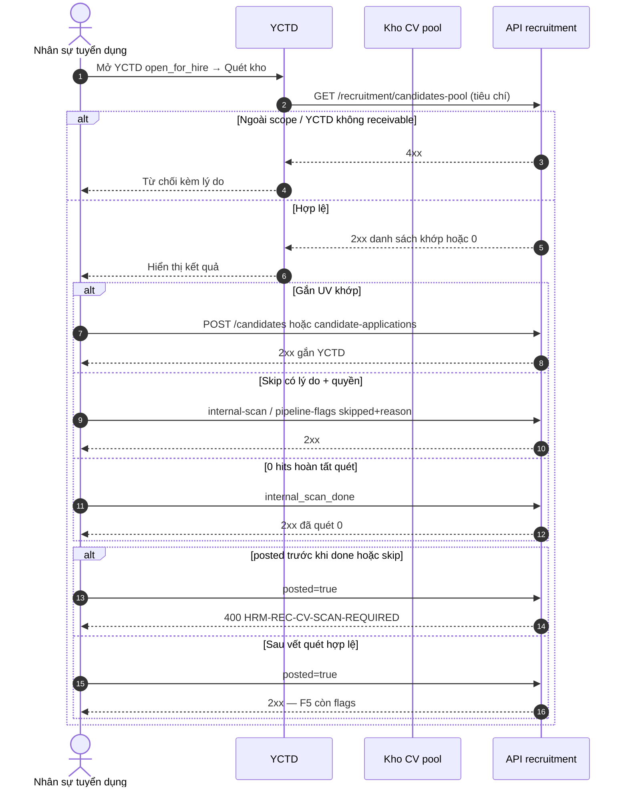

# BA AC pack — Wave-6 REC cluster · UC-BP-REC-04 (Quét kho CV nội bộ trước kênh ngoài)

| Meta | Value |
|------|--------|
| **work_item_id** | `PO-HRM-MVP-GD1-REC-04-CLUSTER-BA-01` |
| **program** | `PO-HRM-MVP-GD1-CONTINUOUS` (U89 — single GD continuous · Wave-6 seat **#8**) |
| **lane** | governance · ba-process |
| **Date** | 2026-08-09 |
| **Status** | **CONFIRMED against SA Option A LOCKED** · O1–O8 **CONFIRMED** · Dev **HOLD** until SA/API F.1 residual F-REC-CV-SCAN-* |
| **change_mode** | **ADD** (align SA-01 — **no** wipe paper FR-04 · **no** reopen W1–W5 · **no** redefine UV-YCTD/CMP) |
| **uc_ids** | `UC-BP-REC-04` |
| **depends_on** | `PO-HRM-MVP-GD1-REC-04-CLUSTER-SA-01` **Option A LOCKED** · evidence `docs/qa/evidence/po-hrm-mvp-gd1-rec-04-cluster-sa-01.md` · peer seal `REC00QC1-MSL0JMUT` |
| **ref_sa** | `PO-HRM-MVP-GD1-REC-04-CLUSTER-SA-01.md` |
| **ref_evidence_sa** | `docs/qa/evidence/po-hrm-mvp-gd1-rec-04-cluster-sa-01.md` |
| **ref_ba_style** | `PO-HRM-MVP-GD1-REC-00-CLUSTER-BA-01.md` · `PO-HRM-MVP-GD1-REC-06A-CLUSTER-BA-01.md` |
| **ref_srs** | `SRS_HRM_ENTERPRISE.md` **FR-UC-BP-REC-04** · **BR-BP-CV-01** · Diễn biến #1–#2 · Thành công · special 0-hits / skip |
| **ref_wbs** | `WBS_HRM_ENTERPRISE.md` **WBS-REC-03** · partner **REQ_REC_002** |
| **ref_br_depth** | `UC_BR_MATRIX_DEPTH.md` UC-BP-REC-04 · BR-BP-CV-01 |
| **ref_uv_yctd** | `PO-HRM-REC-UV-YCTD-API-01` · `PO-HRM-REC-UV-YCTD-DB-01` · ONE soft FK `requisition_id` · F-REC-UV-YCTD-* · F-REC-CMP-* **RETAIN** |
| **ref_api_paper** | Logical F-REC-APP-* / F-REC-CV-SCAN-* · **physical Option A:** `/api/hrm/recruitment/candidates-pool*` · `/candidates*` · `candidate-applications*` · `applications` · `compare` · `requisitions/*/pipeline-flags` (+ optional `…/internal-scan`) · paper `/api/hrm/rec/*` = **alias only** |
| **ref_spine** | Lane B `public.candidates` · Lane A `recruitment_candidates` · `job_requisitions.pipeline_flags_json` · `open_for_hire` |
| **Honesty** | `recruitment_uat_ready=false` · **`jd_dynamic_done=false`** · **`C-SLICE-≠-MODULE`** · DENY flip |
| **Cấm** | Nest `/rec` dual · second CV SoT · REC-03 Campaign · seed · invent beyond SRS · apps/** · reopen sealed REC-00 / W1–W4 without regression · claim UV-YCTD create = FR-04 DONE |

---

## 0. Process objective & actors

### Objective

Khóa **AC đo được** + **Diễn biến FE mutate (U63/U65)** cho Wave-6 seat #8:

1. **UC-BP-REC-04** — Trước khi mở kênh ngoài (GĐ1 = readiness `pipeline_flags.posted`), HR/TP **quét kho nội bộ** theo chức danh + kỹ năng/kinh nghiệm; gắn UV khớp vào YCTD **hoặc** skip có lý do + quyền; **0 hits vẫn «đã quét»**.
2. **Option A** — ACCEPT_AS_IS_UPGRADE trên LIVE `candidates-pool` + UV-YCTD/applications + YCTD `pipeline_flags_json`; paper `rec_candidate` / `/rec/*` = **alias only**.
3. **Không** claim module REC UAT / flip honesty sau GWC slice; **không** reopen REC-03 / Nest dual / second CV SoT.

### Actors

| Actor | Trách nhiệm |
|-------|-------------|
| Nhân sự tuyển dụng (HR) | Mở YCTD → Quét kho → tiêu chí → gắn / hoàn tất quét / skip+lý do |
| Trưởng bộ phận (TP) | Cùng quyền quét/skip trên YCTD thuộc scope (SRS) |
| Group CEO | Scope rollup member — không leak kho/YCTD ngoài scope |
| Member CEO / HRBP | Chỉ pháp nhân / membership · cùng `resolveHrmListScope` |
| Hệ thống (Nest) | Pool search · attach UV/application · stamp `internal_scan_*` · gate `posted` |

### Scope

| In (this seat) | Out |
|----------------|-----|
| O1–O8 CONFIRM · AC-REC-CV-04-* · VAL-REC-CV-* · Diễn biến FE #1–#2 · J-HRM-REC-CV-04-* DRAFT | Impl `apps/**` / migration / seed |
| Scan audit = ADD keys trên `pipeline_flags_json` (**O2**) | Greenfield `rec_cv_scan_log` / second CV table as SoT |
| Posted gate BR-BP-CV-01 · 0-hits · skip+reason | **UC-BP-REC-03** Campaign / `job_postings` SoT |
| Cite attach via UV-YCTD/CMP (**must_keep**) | Redefine FR-05a create / F-REC-UV-YCTD-* contracts |
| Honesty footer | Flip `jd_dynamic_done` / `recruitment_uat_ready` / Phase1 DONE |
| | Reopen sealed REC-00 J-HRM-REC-JD-00-* / W1–W4 without regression |
| | Claim pool-list alone hoặc UV create = FR-04 DONE |

### SA Option A — BA CONFIRM (đóng O1–O8)

| # | Topic | BA CONFIRM (normative) |
|---|-------|-------------------------|
| **O1** | Physical path | **YES** — FE scan/list/attach/flags **chỉ** `/api/hrm/recruitment/*` (pool · candidates · applications · requisitions/pipeline-flags · optional `…/internal-scan`) · paper `/api/hrm/rec/*` = **alias only** · Network QA assert path chứa `/recruitment/` · **FAIL** nếu Nest dual `/rec/*` SoT |
| **O2** | Scan audit persist | **CONFIRMED — ADD keys trên `pipeline_flags_json`** (cùng cột LIVE): `internal_scan_done` · `internal_scan_skipped` · `internal_scan_at` · `internal_scan_skip_reason` · **không** thêm cột physical / bảng event làm SoT · thin `POST …/requisitions/:id/internal-scan` **được phép** nếu chỉ ghi cùng keys · **ba-data NOT REQUIRED** · dedicated event table = **HOLD** (append-only tương lai — **DENY** sole SoT) |
| **O3** | Kho search SoT | **YES** — primary scan list = Lane B **`candidates-pool`** (`public.candidates`) · attach khớp → Lane A / N–N applications · **Lane A list alone ≠ «kho»** · UI «Quét kho» không chỉ filter hành chính |
| **O4** | Match criteria | **YES MVP** — bắt buộc tiêu chí **chức danh** (`position_code` / job_titles family khớp YCTD hoặc picker cùng family) **+** ít nhất một chiều **kỹ năng hoặc kinh nghiệm** (filter/ô tiêu chí — không chỉ tên/admin fields) · **exact-title-only** = **FAIL** (UC_BR_MATRIX_DEPTH) · 0 hits vẫn cho hoàn tất «đã quét» |
| **O5** | External gate | **YES** — **DENY** `pipeline_flags.posted=true` cho đến khi `internal_scan_done=true` **hoặc** (`internal_scan_skipped=true` ∧ lý do hợp lệ ∧ quyền) · GĐ1 «kênh ngoài» = readiness `posted` — **không** mở REC-03 UI · Campaign / `job_postings` = **OUT** |
| **O6** | Peers UV-YCTD / CMP / REC-05a | **YES must_keep** — RETAIN F-REC-UV-YCTD-* · F-REC-CMP-* · stage catalog soft-gate · ONE soft FK `requisition_id` · FR-04 AC **được cite attach** nhưng **cấm** redefine create 05a / compare SoT · claim UV create = FR-04 DONE = **FAIL** |
| **O7** | Skip permission | **YES** — Skip chỉ khi actor ∈ **HR tuyển dụng** hoặc **Trưởng bộ phận** **và** có quyền mutate YCTD trong scope · **bắt buộc** `internal_scan_skip_reason` non-empty · thiếu lý do → **400** `HRM-REC-CV-SCAN-*` · thiếu quyền → **403** (mint API) · toast VI khác «đã quét 0 hits» |
| **O8** | Honesty | **YES false** — `recruitment_uat_ready=false` · `jd_dynamic_done=false` · **C-SLICE** · GWC slice ≠ module REC UAT · ≠ program DONE |
| **Architecture** | SoT | One CV person SoT = pool · scan audit on YCTD flags · U19 list=get=mutate=scan=flags · soft-delete RETAIN |

---

## 1. As-is vs to-be

| | AS-IS (LIVE + seals) | TO-BE (Wave-6 · Option A) |
|---|----------------------|---------------------------|
| Kho person | `candidates` + `/candidates-pool*` | **RETAIN** — UPGRADE as scan surface |
| UV↔YCTD | Lane A + applications N–N | **RETAIN** must_keep |
| Compare | `GET applications` · `GET compare` | **RETAIN** |
| YCTD receivable | `open_for_hire` + transitions | **RETAIN** |
| `pipeline_flags_json` | `posted` · `has_cv` · `interview_started` · `cv_intake_allowed` (+ `*_at`) | **UPGRADE ADD** `internal_scan_*` (**O2**) — **không wipe** keys cũ |
| Quét skill/title | Pool filter nông / thiếu audit | **UNLOCK** criteria AC + stamp |
| Skip + lý do | Absent | **UNLOCK** |
| 0 hits = đã quét | Absent | **UNLOCK** |
| Gate `posted` | Có flag, **chưa** gắn scan | **UNLOCK** BR-BP-CV-01 |
| REC-03 / postings | OUT GĐ1 leftover | **DENY** reopen as SoT |
| Paper `/rec/*` | Naming | **Alias only** |
| Honesty | W1–W5 C-SLICE | **false** · C-SLICE (**O8**) |

### Scan flag dictionary (BA lock = O2)

| Key | Type | Rule |
|-----|------|------|
| `internal_scan_done` | boolean | `true` sau hoàn tất quét (kể cả **0 hits**) |
| `internal_scan_skipped` | boolean | `true` khi skip hợp lệ (O7) — **mutually exclusive prefer:** skip ⇒ `done` có thể `false` **hoặc** API seat chốt `done=false` ∧ `skipped=true` (không cả hai `true` mâu thuẫn) |
| `internal_scan_at` | ISO timestamptz string \| null | Thời điểm stamp |
| `internal_scan_skip_reason` | string \| null | **Required** khi `skipped=true`; empty khi done-path |

**Gate invariant (O5):** `posted=true` **chỉ** khi `(internal_scan_done=true)` **∨** `(internal_scan_skipped=true ∧ reason non-empty)`.

**Transitions (normative):**

| Action | Flags outcome |
|--------|---------------|
| Complete scan (N≥0 hits) | `done=true` · `skipped=false` · `skip_reason=null` · `at=now` |
| Skip valid | `skipped=true` · `done=false` · `skip_reason` set · `at=now` |
| Attempt `posted` without above | **4xx** `HRM-REC-CV-SCAN-*` · flags không đổi `posted` |
| Re-scan after done | Optional residual — default MVP: cho stamp lại (audit mới) **không** xóa attach đã có |

---

## 2. Business rules (normative — SRS + SA; không invent)

| ID | Condition | Action | Outcome |
|----|-----------|--------|---------|
| **BR-BP-CV-01** | Mở kênh ngoài / set `posted` khi chưa quét\|skip | Chặn hoặc bắt skip có lý do | Ưu tiên tái sử dụng CV nội bộ |
| **BR-BP-CV-03** | Attach UV | N–N qua soft FK `requisition_id` | **RETAIN** peer — không invent cột physical thứ hai |
| **BR-REC-CV-PATH** | Scan/attach/flags FR-04 | Physical `/recruitment/*` | Nest `/rec` dual = **FAIL O1** |
| **BR-REC-CV-SOT** | Kho person | One SoT `candidates` / pool | Second CV table = **FAIL** |
| **BR-REC-CV-AUDIT** | Vết quét | Keys trên `pipeline_flags_json` | Event-only SoT bypass YCTD = **FAIL O2** |
| **BR-REC-CV-CRITERIA** | Quét | Title family + skill/experience | Exact-title-only = **FAIL O4** |
| **BR-REC-CV-ZERO** | 0 hits | Cho stamp «đã quét» | Không bắt buộc gắn UV |
| **BR-REC-CV-SKIP** | Skip | Reason + HR\|TP quyền | Thiếu → 400/403 (**O7**) |
| **BR-REC-CV-POSTED** | `posted=true` | Chỉ sau done\|skip valid | Ungated posted = **FAIL O5** |
| **BR-REC-CV-ATTACH** | Gắn khớp | F-REC-UV-YCTD-03/04 / applications | Redefine 05a = **FAIL O6** |
| **BR-REC-CV-SCOPE** | list pool = get = scan = flags = attach | `resolveHrmListScope` | U19 parity |
| **BR-REC-CV-NO-CAMPAIGN** | Kênh ngoài GĐ1 | `posted` readiness only | REC-03 UI = **FAIL** |
| **BR-REC-CV-NO-SEED** | Nghiệm thu | Chuỗi FE only | Seed = **FAIL U65** |
| **BR-REC-CV-HONESTY** | Sau GWC | Flags false | Flip ready / jd_dynamic_done = **FAIL O8** |
| **BR-REC-CV-PEER-SEAL** | W1–W5 · UV-YCTD · JD | RETAIN | Reopen without regression = **FAIL** |

### Error taxonomy (BA / QA assert — mint codes in API seat)

| Code family | HTTP | UX intent (VI) | ≠ |
|-------------|------|----------------|--|
| **`HRM-REC-CV-SCAN-REQUIRED`** *(mint)* | 400 | Chưa quét / chưa skip — không đặt `posted` | UV-YCTD |
| **`HRM-REC-CV-SCAN-SKIP-REASON`** *(mint)* | 400 | Skip thiếu lý do | 0-hits done |
| **`HRM-REC-CV-SCAN-FORBIDDEN`** *(mint)* | 403 | Skip không đủ quyền (không HR/TP hoặc ngoài scope) | Scope 409 |
| **`HRM-REC-CV-SCAN-YCTD`** *(mint)* | 400 | YCTD không receivable / không `open_for_hire` khi bắt đầu quét | — |
| **`HRM-REC-CV-SCAN-ALREADY`** *(mint · optional)* | 409/400 | Conflict policy nếu API chặn re-scan — default MVP cho phép re-stamp | — |
| `HRM-REC-UV-YCTD-*` | 4xx | Attach / receivable / position (**RETAIN**) | Scan gate |
| `HRM-YCTD-*` | 4xx | Mode/BOD/flags W2 (**RETAIN**) | — |
| `HRM-REC-CMP-*` | 4xx | Compare (**RETAIN**) | — |
| Scope mismatch | 409/404 | Ngoài phạm vi pháp nhân | — |

---

## 3. UC-BP-REC-04 — Acceptance criteria

### 3.0 Scope ladder (mọi AC — U19)

| Persona | User sees | Fail |
|---------|-----------|------|
| **Group CEO** (`main`) | Quét/attach/flags trong member units thuộc token scope | Silent cross-tenant kho / YCTD |
| **Member CEO** | Chỉ pháp nhân mình; ngoài scope → 404/409 | Thấy UV/YCTD đơn vị khác |
| **HRBP** | Narrow membership — **cùng** resolver | Rollup tập đoàn khi không được phép |

**Invariant CV-S-SCOPE:** list pool **=** get-by-id pool/candidate **=** scan wrapper **=** YCTD get **=** patch flags / internal-scan **=** attach application.

**Prerequisite:** YCTD in-scope ở trạng thái **`open_for_hire`** (receivable W2 RETAIN) trước khi bắt đầu Quét kho.

### 3.1 Happy path (Diễn biến #1–#2 + Thành công)

| AC-ID | SRS # | Given | When | Then (measurable — **user sees**) | Evidence |
|-------|-------|-------|------|-------------------------------------|----------|
| **AC-REC-CV-04-01** | #1 | YCTD `open_for_hire`; persona in-scope; quyền HR/TP | FE: Tuyển dụng → Yêu cầu tuyển → mở YCTD → bước **Quét kho nội bộ** | UI bước Quét kho; Network **GET** `/api/hrm/recruitment/candidates-pool?…` (hoặc thin `…/requisitions/:id/internal-scan/candidates`) **2xx**; tiêu chí **chức danh + kỹ năng/kinh nghiệm** hiện; **không** chỉ ô hành chính; **không** banner ERROR / storm | DevTools + FE · U65 |
| **AC-REC-CV-04-02** | #1 | Tiêu chí hợp lệ; kho có ≥1 UV khớp family | Nhập/chọn tiêu chí → xem danh sách | Danh sách khớp hiển thị; **không** exact-title-only sole; row clickable cross-nav detail pool/UV | Browser O4 |
| **AC-REC-CV-04-03** | #2 attach | Có ≥1 UV khớp | **Gắn** vào pipeline YCTD (POST candidates + `requisition_id` **hoặc** candidate-applications) → **Hoàn tất quét** | Attach **2xx** (F-REC-UV-YCTD-03/04 RETAIN); flags `internal_scan_done=true` · `at` set; list apps/YCTD có UV; **F5** còn; Network physical `/recruitment/*` | Browser + F5 · O6 |
| **AC-REC-CV-04-04** | #2 · special 0-hits | Tiêu chí hợp lệ; **0** UV khớp | **Hoàn tất quét** / xác nhận đã quét | Flags `internal_scan_done=true` · `skipped=false`; UI «đã quét — 0 kết quả»; **không** bắt buộc gắn UV; **F5** còn vết | Browser · BR-REC-CV-ZERO |
| **AC-REC-CV-04-05** | #2 skip | HR/TP; YCTD receivable | **Bỏ qua quét** → nhập lý do → Xác nhận | Flags `internal_scan_skipped=true` · `skip_reason` non-empty · `at` set; **F5** còn lý do; cho readiness `posted` sau đó (AC-06) | Browser O7 |
| **AC-REC-CV-04-06** | Thành công · BR-01 | Sau done **hoặc** skip valid | Đặt readiness kênh ngoài (`posted=true` qua PATCH flags / transition UI GĐ1) | **2xx**; `posted=true` + `posted_at`; **F5** còn; **không** mở Campaign / REC-03 | Browser O5 · DENY REC-03 |

### 3.2 Alternate

| AC-ID | Given | When | Then | Evidence |
|-------|-------|------|------|----------|
| **AC-REC-CV-04-ALT-01** | 0 UV trong pool scope | Mở Quét kho | Empty list hợp lệ + CTA; cho 0-hits complete (AC-04); **không** seed | UI U65 |
| **AC-REC-CV-04-ALT-02** | Group CEO đổi đơn vị trong scope | Quét / gắn | Thành công trong scope; không leak | Persona U19 |
| **AC-REC-CV-04-ALT-03** | Đã `internal_scan_done` | Mở lại Quét kho | Xem trạng thái đã quét; re-stamp optional không xóa attach | UI residual |
| **AC-REC-CV-04-ALT-04** | UV đã gắn YCTD khác (N–N) | Gắn thêm YCTD hiện tại | Cho phép theo BR-BP-CV-03 / UV-YCTD RETAIN; pipeline riêng | Network O6 |
| **AC-REC-CV-04-ALT-05** | List kết quả quét | Click UV → detail | **GET** pool/candidate **2xx**; Back còn bước Quét | Cross-nav |
| **AC-REC-CV-04-ALT-06** | Sau attach | Mở applications / compare (nếu UI có) | **RETAIN** F-REC-CMP — **không** FAIL FR-04 nếu compare OUT surface; cite must_keep | Peer |

### 3.3 Exception

| AC-ID | Given | When | Then | Evidence |
|-------|-------|------|------|----------|
| **AC-REC-CV-04-EX-01** | Chưa done ∧ chưa skip valid | Thử `posted=true` | **400** `HRM-REC-CV-SCAN-REQUIRED` (mint); `posted` vẫn false; toast VI | Network O5 · BR-BP-CV-01 |
| **AC-REC-CV-04-EX-02** | Skip form | Xác nhận **không** lý do | **400** `HRM-REC-CV-SCAN-SKIP-REASON`; flags không `skipped` | Network O7 |
| **AC-REC-CV-04-EX-03** | Actor không HR/TP hoặc thiếu quyền YCTD | Thử skip | **403** `HRM-REC-CV-SCAN-FORBIDDEN` (hoặc scope 403/409); không stamp skip | Network O7 |
| **AC-REC-CV-04-EX-04** | YCTD chưa `open_for_hire` | Mở Quét / complete scan | **400** scan-YCTD family; không stamp done như bypass receivable | Network |
| **AC-REC-CV-04-EX-05** | `company_id` ngoài scope | GET pool / PATCH flags / attach | 404/409 scope — không lộ | Network U19 |
| **AC-REC-CV-04-EX-06** | FE gọi Nest `/rec/*` như SoT | Review / QA | **FAIL O1** | Diff + Network |
| **AC-REC-CV-04-EX-07** | Greenfield second CV table / scan-only SoT | Impl | **FAIL** SoT O2/O3 | Diff |
| **AC-REC-CV-04-EX-08** | Reopen REC-03 / `job_postings` làm kênh ngoài SoT | Impl / AC | **FAIL** | Diff |
| **AC-REC-CV-04-EX-09** | Exact-title-only search (không skill/experience chiều) | Quét MVP | **FAIL O4** AC | UX review |
| **AC-REC-CV-04-EX-10** | Seed pool rồi claim PASS | QA | **FAIL U65** | Process |
| **AC-REC-CV-04-EX-11** | Flip `jd_dynamic_done` / `recruitment_uat_ready` | QC | **FAIL O8** C-SLICE | Honesty |
| **AC-REC-CV-04-EX-12** | Reopen sealed REC-00 / W1–W4 / rewrite UV-YCTD | Process | **FAIL** must_keep | Bus |
| **AC-REC-CV-04-EX-13** | Claim UV-YCTD create / pool list = FR-04 DONE | QC | **FAIL** O6 | Honesty |
| **AC-REC-CV-04-EX-14** | Wipe `posted`/`has_cv` family khi ADD scan keys | Impl | **FAIL** must_keep flags | Diff |

### 3.4 Diễn biến FE (U63/U65) — Quét kho trên YCTD

| # | Actor FE | Action | Network | FE ngay sau 2xx | F5 / navigate lại |
|---|----------|--------|---------|-----------------|-------------------|
| **1** | HR/TP | Mở YCTD `open_for_hire` → **Quét kho nội bộ** | **GET** `/recruitment/candidates-pool?…` (+ YCTD context) **2xx** | Form tiêu chí chức danh + kỹ năng/kinh nghiệm; list/empty | — |
| **1b** | HR/TP | Nhập tiêu chí → tìm | **GET** pool (filtered) **2xx** | Danh sách khớp (hoặc 0) | — |
| **2a** | HR/TP | Chọn UV → **Gắn** YCTD | **POST** `/recruitment/candidates` (+ `requisition_id`) **hoặc** `candidate-applications` **2xx** | UV trên pipeline YCTD | F5 còn (UV-YCTD RETAIN) |
| **2b** | HR/TP | **Hoàn tất quét** (N≥0) | **POST** `…/internal-scan` **hoặc** **PATCH** `…/pipeline-flags` (`internal_scan_done`) **2xx** | Badge/vết «Đã quét»; 0 hits copy rõ | F5 còn `internal_scan_*` |
| **2c** | HR/TP | **Bỏ qua** + lý do → Xác nhận | Same transition + `internal_scan_skipped` + reason **2xx** | Vết skip + lý do | F5 còn |
| **2d** | HR/TP | Skip **không** lý do | **400** SKIP-REASON | Form lỗi; chưa skip | — |
| **2e** | HR/TP | `posted` **trước** quét/skip | **400** SCAN-REQUIRED | `posted` false; toast chặn | F5 vẫn chưa posted |
| **2f** | HR/TP | Sau done\|skip → bật readiness `posted` | **PATCH** flags `posted=true` **2xx** | Flag posted; **không** Campaign | F5 còn |
| **3** | HR/TP | Click UV từ kết quả | **GET** pool/:id hoặc candidates/:id **2xx** | Detail; Back Quét | — |
| **Cấm** | QA/Dev | seed; Nest `/rec` dual; second SoT; REC-03; honesty flip; reopen REC-00/W1–W4; redefine 05a | — | — | **FAIL** |

**Thành công SRS:** Có vết quét (hoặc skip hợp lệ); sẵn sàng nhận hồ sơ ngoài **khi** GĐ1 set `posted` / GĐ2 bật kênh — UC kế = pipeline FR-05 / tạo UV 05a (peer) — **không** mở rewrite trong seat.

---

## 4. Validation table

| VAL-ID | Field / rule | Valid | Invalid → outcome |
|--------|--------------|-------|-------------------|
| **VAL-REC-CV-01** | Scope / `company_id` | In token scope | Out → 404/409 |
| **VAL-REC-CV-02** | YCTD status | `open_for_hire` (receivable) | Else → 400 scan-YCTD |
| **VAL-REC-CV-03** | Scan criteria title | `position_code` / job_titles family | Missing sole admin filter → **FAIL O4** |
| **VAL-REC-CV-04** | Scan criteria skill/exp | ≥1 skill **or** experience dimension | Exact-title-only → **FAIL O4** |
| **VAL-REC-CV-05** | `internal_scan_done` | boolean after complete | Stamp without API → **FAIL** |
| **VAL-REC-CV-06** | `internal_scan_skipped` | true only with reason + role | Skip no reason → **400** |
| **VAL-REC-CV-07** | `internal_scan_skip_reason` | non-empty when skipped | Empty → **400** SKIP-REASON |
| **VAL-REC-CV-08** | Skip actor | HR tuyển dụng \| TP + YCTD mutate | Else → **403** FORBIDDEN |
| **VAL-REC-CV-09** | `posted` gate | Only after done\|skip valid | Else → **400** SCAN-REQUIRED |
| **VAL-REC-CV-10** | Flag merge | ADD keys; RETAIN posted/has_cv/… | Wipe family → **FAIL** |
| **VAL-REC-CV-11** | Attach | F-REC-UV-YCTD / applications | Missing `requisition_id` → UV-YCTD REQUIRED RETAIN |
| **VAL-REC-CV-12** | Physical path | `/recruitment/*` | Dual Nest `/rec` → **FAIL O1** |
| **VAL-REC-CV-13** | Second CV SoT | Forbidden | New person table → **FAIL** |
| **VAL-REC-CV-14** | Scan event sole SoT | Forbidden | Bypass YCTD flags → **FAIL O2** |
| **VAL-REC-CV-15** | REC-03 / postings | OUT | Campaign as gate SoT → **FAIL** |
| **VAL-REC-CV-16** | Scope parity | list=get=scan=flags=attach | Mismatch → **FAIL U19** |
| **VAL-REC-CV-17** | U65 | FE-only evidence | Seed/API fake = **FAIL** |
| **VAL-REC-CV-18** | Honesty | both flags false | Flip = **FAIL O8** |
| **VAL-REC-CV-19** | Peers UV-YCTD/CMP | Cite attach only | Redefine 05a = **FAIL O6** |
| **VAL-REC-CV-20** | 0-hits | done without attach | Force attach → **FAIL** AC-04 |
| **VAL-REC-CV-21** | Display-ready | BE returns scan flags on YCTD DTO | FE invent flag SoT = **FAIL** |

---

## 5. Traceability — UC → BR → partner_req → AC → Journey/UF

| UC | BR | partner_req | Decision | AC (primary) | UF / J-* |
|----|-----|-------------|----------|--------------|----------|
| **UC-BP-REC-04** | BR-BP-CV-01 · BR-REC-CV-* · BR-BP-CV-03 (peer) | **REQ_REC_002** | SA Option **A** LOCKED · O1–O8 CONFIRMED | AC-REC-CV-04-01..06 · ALT · EX · VAL-01..21 | **UF-HRM-REC-CV-04** *(DRAFT)* · **J-HRM-REC-CV-04-01..04** (DRAFT) |
| UC-BP-REC-05a / UV-YCTD | BR-BP-CV-03 | — | Peer RETAIN | Cite attach O6 only | **J-HRM-REC-UV-*** RETAIN — **không** reopen as FR-04 |
| UC-BP-REC-03 | — | — | OUT | — | **DENY** |
| UC-BP-REC-00/01/02/08/06a | — | — | Sealed W1–W5 | — | must_keep |

### Journey placeholders (U19) — DRAFT

| J-ID | Click path (draft) | Pass when |
|------|--------------------|-----------|
| **J-HRM-REC-CV-04-01** | Login HR → Tuyển dụng → YCTD `open_for_hire` → **Quét kho** → tiêu chí chức danh+skill/exp → GET pool 2xx → list/empty | AC-REC-CV-04-01/02 · O3/O4 · U65 · no seed |
| **J-HRM-REC-CV-04-02** | Kết quả N≥1 → Gắn UV → Hoàn tất quét → F5 `internal_scan_done`; **hoặc** 0 hits → Hoàn tất → F5 đã quét | AC-REC-CV-04-03/04 · O6 attach RETAIN |
| **J-HRM-REC-CV-04-03** | Skip + lý do → F5 skipped; skip không lý do → 400; actor sai → 403 | AC-REC-CV-04-05 · EX-02/03 · O7 |
| **J-HRM-REC-CV-04-04** | `posted` trước quét → 400 SCAN-REQUIRED; sau done\|skip → `posted` 2xx → F5; **không** Campaign | AC-REC-CV-04-06 · EX-01 · O5 · BR-BP-CV-01 |

**Group CEO:** quét/gắn/flags chỉ trong scope rollup; Member/HRBP không thấy ngoài membership.

### UF matrix note

| UF | Status | Relation |
|----|--------|----------|
| **UF-HRM-REC-CV-04** | ⬜ DRAFT | Browser Quét kho + posted gate sau API+Dev |
| **J-HRM-REC-UV-*** / CMP | RETAIN | must_keep O6 — **cấm** đè |
| Sealed W1–W5 UF/J | must_keep | **không** reopen |
| **J-HRM-REC-JD-00-01..04** | Sealed REC-00 | **DENY** reopen without regression |

---

## 6. Honesty & must_keep

| Item | Rule |
|------|------|
| `recruitment_uat_ready` | **false** |
| `jd_dynamic_done` | **false** RETAIN HOLD (`R-PLT-JD-DYNAMIC-DONE-01`) |
| C-SLICE | GWC REC-04 ≠ module REC UAT ≠ Phase1 DONE |
| must_keep W1 | REC-01 cell/spawn |
| must_keep W2 | YCTD mode/BOD/`open_for_hire` · `pipeline_flags` family (**extend**, không wipe) · soft FK JD |
| must_keep W3 | dashboard physical |
| must_keep W4 | IV one-active |
| must_keep W5 | JD `job-templates` · `REC00QC1-MSL0JMUT` |
| must_keep | Lane B pool · Lane A candidates · applications/compare · UV-YCTD ONE `requisition_id` · U19 · soft-delete |
| DENY | Nest `/rec` dual · second CV SoT · REC-03 · scan event sole SoT · seed · honesty flip · invent beyond SRS · apps/** this seat · reopen REC-00 without regression |

---

## 7. Handoff

| Field | Value |
|-------|--------|
| **ack_status** | **PASS_TO_PM** · O1–O8 **CONFIRMED** |
| **next_owner** | **sa** — API F.1 residual **F-REC-CV-SCAN-01..03** + posted gate + error mint + DTO `internal_scan_*` on YCTD |
| **ba-data** | **NOT REQUIRED** — O2 = JSON keys on existing `pipeline_flags_json` (no new columns/table) |
| **Does not unlock** | Dev `apps/**` · honesty flips · REC-03 · Nest `/rec` dual · reopen W1–W5 / REC-00 · `jd_dynamic_done=true` · `recruitment_uat_ready=true` |
| **evidence_path** | `docs/qa/evidence/po-hrm-mvp-gd1-rec-04-cluster-ba-01.md` |

### Assumptions

- SA Option A LOCKED; UV-YCTD + W2 flags LIVE.
- Paper `/rec/*` remains alias — no Nest dual.
- GĐ1 external = `posted` readiness; Campaign OUT.
- Skill/experience filter uses fields already on pool person or documented query params — API seat maps without inventing second SoT.

### Dependencies

1. **sa** — API F.1 F-REC-CV-SCAN-01..03 · gate `posted` · mint `HRM-REC-CV-SCAN-*` · display-ready flags on requisition DTO.
2. **Dev-BE/FE** — after API CONFIRMED only (residual Quét kho UI + gate).
3. **QA** — U65 J-HRM-REC-CV-04-01..04 · no seed.
4. **QC** — GWC C-SLICE · honesty false.

### Open / non-blocking

| ID | Note |
|----|------|
| Q-REC-CV-RESCAN | Re-stamp after done — default MVP allow; API may add ALREADY policy |
| Q-REC-CV-SKILL-FIELD | Exact pool column/query for skill family — API/FE map from LIVE person fields; **không** invent mega-EAV |
| Event append table | HOLD — only if future audit depth; never sole SoT |

---

## completion_report

- **Closed:** O1–O8 CONFIRMED; AC-REC-CV-04-* + VAL-REC-CV-01..21; Diễn biến FE #1–#2 U65; J-HRM-REC-CV-04-01..04 DRAFT; BR-BP-CV-01 posted gate; 0-hits + skip+reason; DENY Nest dual / second CV SoT / REC-03 / seed / honesty flip; must_keep UV-YCTD/CMP/W1–W5; **O2 = flags JSON → ba-data NOT REQUIRED**.
- **Residual:** sa API F.1 F-REC-CV-SCAN-*; Dev after contracts; QA browser.
- **O2 decision:** ADD `internal_scan_*` on `pipeline_flags_json` — **not** new columns/table.
