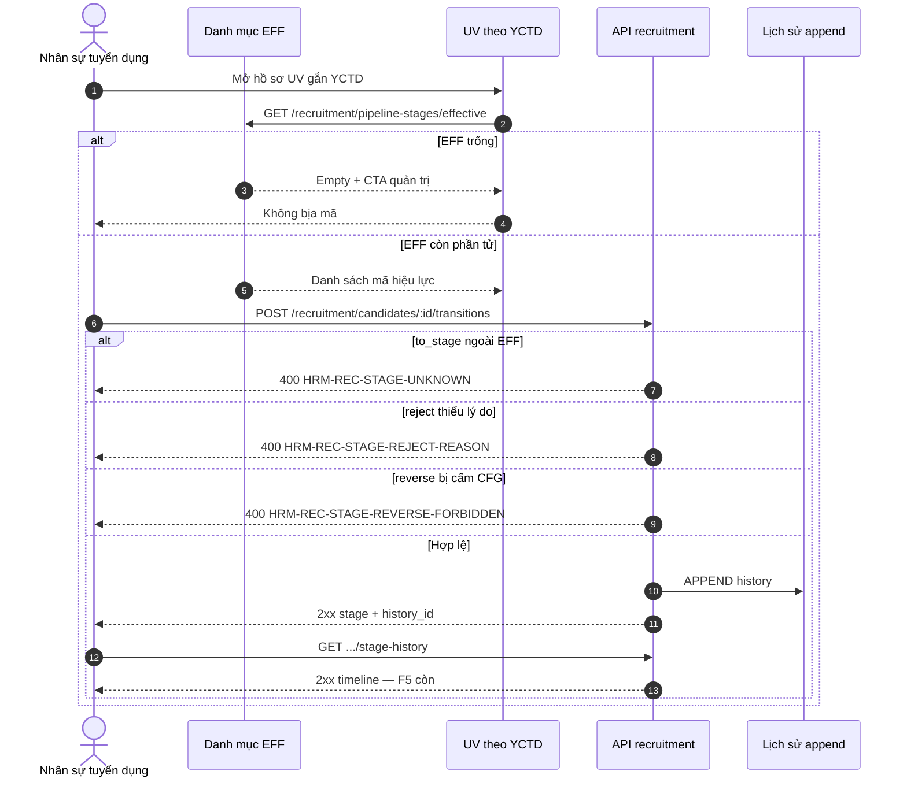

# BA AC pack — Wave-7 REC cluster · UC-BP-REC-05 (Lịch sử trạng thái UV gắn YCTD)

| Meta | Value |
|------|--------|
| **work_item_id** | `PO-HRM-MVP-GD1-REC-05-CLUSTER-BA-01` |
| **program** | `PO-HRM-MVP-GD1-CONTINUOUS` (U89 — single GD continuous · Wave-7 seat **#9**) |
| **lane** | governance · ba-process |
| **Date** | 2026-08-09 |
| **Status** | **CONFIRMED against SA Option A LOCKED** · O1–O9 **CONFIRMED** · Dev **HOLD** until ba-data + SA/API F.1 residual |
| **change_mode** | **ADD** (align SA-01 — **no** wipe paper FR-05 · **no** reopen W1–W6 · **no** redefine 05a / UV-YCTD / REC-04 / 06a / CAT) |
| **uc_ids** | `UC-BP-REC-05` |
| **depends_on** | `PO-HRM-MVP-GD1-REC-05-CLUSTER-SA-01` **Option A LOCKED** · evidence `docs/qa/evidence/po-hrm-mvp-gd1-rec-05-cluster-sa-01.md` · peer seal **`REC04QC1-MSL1LU4H`** |
| **ref_sa** | `PO-HRM-MVP-GD1-REC-05-CLUSTER-SA-01.md` |
| **ref_evidence_sa** | `docs/qa/evidence/po-hrm-mvp-gd1-rec-05-cluster-sa-01.md` |
| **ref_ba_style** | `PO-HRM-MVP-GD1-REC-04-CLUSTER-BA-01.md` · `PO-HRM-MVP-GD1-REC-06A-CLUSTER-BA-01.md` |
| **ref_srs** | `SRS_HRM_ENTERPRISE.md` **FR-UC-BP-REC-05** · **BR-BP-CV-02** · Diễn biến #0a–#2 · Thành công · special reverse / invent / empty EFF · peer **FR-UC-BP-REC-05a** RETAIN |
| **ref_wbs** | `WBS_HRM_ENTERPRISE.md` · partner **REQ_REC_002** |
| **ref_br_depth** | `UC_BR_MATRIX_DEPTH.md` UC-BP-REC-05 · BR-BP-CV-02 |
| **ref_uv_yctd** | `PO-HRM-REC-UV-YCTD-API-01` · `PO-HRM-REC-UV-YCTD-DB-01` · ONE soft FK `requisition_id` · F-REC-UV-YCTD-* · F-REC-CMP-* **RETAIN** |
| **ref_paper_db** | `DB_DESIGN_HRM_ENTERPRISE.md` §2.4a `rec_pipeline_stage` · §2.5 application · §2.6 `rec_candidate_stage_history` |
| **ref_api_paper** | **F-REC-APP-02** (+ timeline GET disposition) · F-REC-CAT-STG/EFF · UV-YCTD · CMP · IV soft-gate · CV-SCAN — **physical Option A:** `/api/hrm/recruitment/*` · paper `/api/hrm/rec/*` = **alias only** |
| **Honesty** | `recruitment_uat_ready=false` · **`jd_dynamic_done=false`** · **`C-SLICE-≠-MODULE`** · DENY flip |
| **Cấm** | Nest `/rec` dual · second catalog/history SoT · REC-03 Campaign · `job_posting_id` apps as FR-05 SoT · pool stage as FR-05 SoT · overwrite-only as DONE · seed · invent beyond SRS · apps/** · honesty flip · reopen sealed REC-04 J-HRM-REC-CV-04-01..04 / W1–W5 without regression · claim 05a create = FR-05 DONE |

---

## 0. Process objective & actors

### Objective

Khóa **AC đo được** + **Diễn biến FE mutate (U63/U65)** cho Wave-7 seat #9:

1. **UC-BP-REC-05** — Đổi trạng thái pipeline trên **từng liên kết UV↔YCTD**; picker từ **EFF** khi còn phần tử; **append lịch sử** (không ghi đè mất); xem timeline; từ chối bắt buộc lý do; reverse chỉ khi CFG cho phép + luôn audit.
2. **Option A** — ACCEPT_AS_IS_UPGRADE trên LIVE catalog `rec_pipeline_stage` + Lane A `/candidates*` + applications/compare; **ADD** một bảng history append-only; paper `/rec/*` = **alias only**.
3. **Không** claim module REC UAT / flip honesty; **không** reopen REC-03 / Nest dual / second SoT / REC-04 J-*.

### Actors

| Actor | Trách nhiệm |
|-------|-------------|
| Nhân sự tuyển dụng (HR) | Mở UV theo YCTD → chọn stage EFF → Lưu → xem timeline; nhập lý do khi từ chối |
| Người phỏng vấn | Xem/đọc pipeline theo quyền (không invent stage) |
| Quản trị danh mục | Thêm mã giai đoạn (STG-02) — **≠** consumer invent — peer CAT RETAIN |
| Group CEO | Scope rollup — không leak timeline ngoài scope |
| Member CEO / HRBP | Chỉ pháp nhân / membership · cùng `resolveHrmListScope` |
| Hệ thống (Nest) | Assert EFF · UPDATE current stage · APPEND history · reject/reverse VAL · scope |

### Scope

| In (this seat) | Out |
|----------------|-----|
| O1–O9 CONFIRM · AC-REC-05-* · VAL-REC-STG-* · Diễn biến FE #1–#2 · J-HRM-REC-STG-05-* DRAFT | Impl `apps/**` / migration / seed |
| Transition + GET timeline trên **YCTD-bound** link | Greenfield Nest `/rec/*` SoT · second catalog/history |
| ADD append-only history (**O2** → **ba-data REQUIRED**) | Overwrite-only stage claimed DONE |
| EFF picker · reject reason · reverse CFG · open CHK when EFF>0 | **UC-BP-REC-03** Campaign / `job_postings` / posting-apps SoT |
| Cite 05a create / CAT / REC-04 / 06a (**must_keep**) | Redefine UV-YCTD / scan / IV soft-gate SoT |
| Honesty footer · C-SLICE | Flip `jd_dynamic_done` / `recruitment_uat_ready` / Phase1 DONE |
| Kanban columns=EFF | Kanban MVP **OUT** this seat (**O9** = P2) |
| | Pool `PATCH …/candidates-pool/:id/stage` as FR-05 timeline SoT |
| | Claim 05a create / catalog CNS / overwrite PATCH = FR-05 DONE |

### SA Option A — BA CONFIRM (đóng O1–O9)

| # | Topic | BA CONFIRM (normative) |
|---|-------|-------------------------|
| **O1** | Physical path | **YES** — FE transition / timeline / picker **chỉ** `/api/hrm/recruitment/*` · paper `/api/hrm/rec/applications/{id}/transitions` (+ `/rec/…/stage-history`) = **alias only** · Network QA assert path chứa `/recruitment/` · **FAIL** nếu Nest dual `/rec/*` SoT |
| **O2** | History persist | **CONFIRMED — ADD một** bảng append-only (paper `rec_candidate_stage_history` / `candidate_stage_history`) · columns tối thiểu: `from_stage`, `to_stage`, `note`, `changed_by`, `changed_at` + FK link · **DENY** overwrite-only as DONE · **DENY** dual history tables · **ba-data REQUIRED** (physical name + FK + soft-delete/CHK open-catalog migrate) |
| **O3** | Stage home (link SoT) | **CONFIRMED** — **Primary SoT** = Lane A `public.recruitment_candidates` current stage (`status` ↔ DTO `stage`) với soft FK `requisition_id` NOT NULL · FE transition id = **`candidate_id`** (Lane A) · khi tồn tại N–N application cùng `requisition_id`: **đồng bộ** `application.stage` trong cùng transaction · **DENY** `candidate_applications` keyed `job_posting_id` làm FR-05 SoT · **DENY** pool person stage làm FR-05 timeline SoT |
| **O4** | Open catalog vs CHK six | **YES** — khi **EFF>0**: `to_stage` ∈ effective `stage_key` (admin mở N+1 — **không** trần sáu mã); ba-data/BE migrate hoặc drop closed CHK six trên Lane A · khi **EFF=0**: picker empty trung thực + CTA quản trị (SRS) — **không** fake starter SoT / seed |
| **O5** | Reject / terminal reason | **YES** — khi `to_stage` thuộc reject class (`is_reject_outcome=true` trên catalog **hoặc** key ∈ reject set đã map catalog) ⇒ `note`/lý do **bắt buộc** non-empty · thiếu → **400** `HRM-REC-STAGE-REJECT-REASON` (mint API) · **F5** không đổi stage |
| **O6** | Reverse transitions | **YES** — đảo chiều stage **chỉ** khi CFG/policy cho phép (default GĐ1: **`allow_reverse_stage=true`** cho đến khi admin tắt) · **mọi** reverse hợp lệ **vẫn APPEND** history · cấm → **400** `HRM-REC-STAGE-REVERSE-FORBIDDEN` (mint) · không silent drop history |
| **O7** | Peers must_keep | **YES** — RETAIN 05a UV-YCTD · REC-04 scan/posted (`REC04QC1-MSL1LU4H` · J-HRM-REC-CV-04-01..04) · 06a IV one-active + soft-gate DISALLOW · CMP · CAT STG/EFF · W1–W3 · FR-05 **được cite** create/attach nhưng **cấm** redefine · claim 05a create = FR-05 DONE = **FAIL** |
| **O8** | Honesty | **YES false** — `recruitment_uat_ready=false` · `jd_dynamic_done=false` · **C-SLICE** · GWC slice ≠ module REC UAT · ≠ program DONE |
| **O9** | Kanban | **OUT MVP this seat (P2)** — PASS FR-05 khi **list + detail + transition + timeline** đủ Diễn biến #1–#2; Kanban kéo cột = residual P2 **chỉ** nếu cột = EFF khi EFF>0 · **không** block ba-data/API unlock |
| **Architecture** | SoT | ONE catalog `rec_pipeline_stage` · ONE history append-only · stage on YCTD-link Lane A · U19 list=get=transition=timeline · soft-delete RETAIN |

### Primary API surface (BA lock — O1 + O3)

| Intent | Physical (normative) | Paper alias |
|--------|----------------------|-------------|
| Transition + append | **`POST /api/hrm/recruitment/candidates/:id/transitions`** body `{ to_stage, note?, desired_salary? }` — **primary** | `POST /api/hrm/rec/applications/{id}/transitions` |
| Thin alternate | `PATCH /api/hrm/recruitment/candidates/:id` với field stage — **chỉ** nếu cùng atomic append history + cùng VAL | — |
| Timeline GET | **`GET /api/hrm/recruitment/candidates/:id/stage-history`** (+ optional `requisition_id` filter — Lane A đã bound YCTD) | `/rec/…/stage-history` |
| EFF picker | `GET /api/hrm/recruitment/pipeline-stages/effective` | **RETAIN** F-REC-CAT-EFF-01 |
| Admin catalog | `/pipeline-stages*` STG-01/02 | **RETAIN** — **không** consumer invent |

**Atomic invariant:** mỗi transition **2xx** ⇒ (1) current stage cập nhật **và** (2) ≥1 history row mới cùng `changed_at` · thiếu (2) = **FAIL** FR-05 / BR-BP-CV-02.

---

## 1. As-is vs to-be

| | AS-IS (LIVE + seals) | TO-BE (Wave-7 · Option A) |
|---|----------------------|---------------------------|
| Stage catalog | `rec_pipeline_stage` + `/pipeline-stages*` | **RETAIN** must_keep |
| Consumer invent ban | `HRM-REC-STAGE-UNKNOWN` · IV DISALLOW | **RETAIN** |
| UV↔YCTD | Lane A + applications N–N | **RETAIN** must_keep (05a) |
| Current stage | Lane A `status` closed CHK six; posting-apps overwrite | **UNLOCK** open catalog + YCTD-bound SoT |
| History table | **ABSENT** | **ADD** append-only (**O2**) |
| Transition YCTD | Incomplete / posting/pool | **UNLOCK** `POST …/candidates/:id/transitions` |
| Timeline GET | Absent | **UNLOCK** |
| Reject reason | Weak / optional | **UNLOCK** VAL (**O5**) |
| Reverse | Unclear | **UNLOCK** CFG + append (**O6**) |
| Kanban | Peer CNS optional | **P2 OUT** this seat (**O9**) |
| REC-03 / postings | OUT leftover | **DENY** as FR-05 SoT |
| Paper `/rec/*` | Naming | **Alias only** |
| Honesty | W1–W6 C-SLICE | **false** · C-SLICE (**O8**) |

### History row dictionary (BA lock = O2 — ba-data physicalizes)

| Column (logical) | Rule |
|------------------|------|
| `id` | uuid PK |
| `recruitment_candidate_id` | **NOT NULL** FK → Lane A (YCTD-bound link) — **primary FK** |
| `application_id` | nullable FK → N–N application khi tồn tại; paper `application_id` NOT NULL = **logical alias** của link — ba-data map |
| `company_id` / scope | Persist per U19 (ba-data) |
| `from_stage` | text nullable — prior key (may be retired) |
| `to_stage` | text NOT NULL — new key (may later retire) |
| `note` | text nullable — **required** when reject outcome |
| `desired_salary` | numeric nullable — optional snapshot (BR-BP-CV-02 depth) |
| `changed_by` | uuid/user ref nullable |
| `changed_at` | timestamptz NOT NULL |
| Mutate | **APPEND only** — no UPDATE/DELETE of history rows for stage rewrite |

---

## 2. Business rules (normative — SRS + SA; không invent)

| ID | Condition | Action | Outcome |
|----|-----------|--------|---------|
| **BR-BP-CV-02** | Đổi stage / đóng YCTD | Append timeline; giữ nguồn / từ chối / desired salary theo thời gian | Không ghi đè mất lịch sử |
| **BR-REC-STG-PATH** | Transition / timeline FR-05 | Physical `/recruitment/*` | Nest `/rec` dual = **FAIL O1** |
| **BR-REC-STG-HOME** | Current stage SoT | Lane A YCTD-bound `candidate_id` | Posting-apps / pool stage sole = **FAIL O3** |
| **BR-REC-STG-HIST** | Mỗi transition 2xx | APPEND ≥1 history row | Overwrite-only DONE = **FAIL O2** |
| **BR-REC-STG-ONE-HIST** | History SoT | Exactly one append-only table | Dual history = **FAIL** |
| **BR-REC-STG-EFF** | EFF>0 | `to_stage` ∈ effective | Invent → **`HRM-REC-STAGE-UNKNOWN`** RETAIN |
| **BR-REC-STG-EMPTY** | EFF=0 | Empty picker + CTA admin | Fake seed starter = **FAIL O4** |
| **BR-REC-STG-OPEN** | EFF>0 persist | Open catalog keys (N+1) | Closed-six ceiling sole = **FAIL O4** |
| **BR-REC-STG-REJECT** | Reject outcome | `note` required | Missing → **400** REJECT-REASON (**O5**) |
| **BR-REC-STG-REV** | Reverse | CFG allow + always append | Forbidden → **400** REVERSE-FORBIDDEN (**O6**) |
| **BR-REC-STG-YCTD** | Multi-YCTD | Stage per link (Lane A row / requisition) | Cross-link overwrite = **FAIL** |
| **BR-REC-STG-CLOSE** | Đóng YCTD | Không xóa history | Cascade wipe = **FAIL** BR-BP-CV-02 |
| **BR-REC-STG-SCOPE** | list = get = transition = timeline | `resolveHrmListScope` | U19 parity |
| **BR-REC-STG-CAT-ADMIN** | Admin STG-02 | Mở mã mới được | Invent-ban trên admin = **FAIL** peer |
| **BR-REC-STG-NO-CAMPAIGN** | Pipeline | Trong UV–YCTD | REC-03 / Campaign SoT = **FAIL** |
| **BR-REC-STG-NO-SEED** | Nghiệm thu | Chuỗi FE only | Seed = **FAIL U65** |
| **BR-REC-STG-HONESTY** | Sau GWC | Flags false | Flip ready / jd_dynamic = **FAIL O8** |
| **BR-REC-STG-PEER** | 05a / REC-04 / 06a / CAT / CMP / W1–W3 | RETAIN | Reopen without regression = **FAIL O7** |
| **BR-REC-STG-05A-≠-DONE** | Create UV | Peer 05a | Claim create = FR-05 DONE = **FAIL** |
| **BR-PLT-05** cite | Open catalog | Consumer chọn EFF | Six-ceiling as sole SoT when EFF>0 = **FAIL** |

### Error taxonomy (BA / QA assert — mint codes in API seat)

| Code family | HTTP | UX intent (VI) | ≠ |
|-------------|------|----------------|--|
| **`HRM-REC-STAGE-UNKNOWN`** | 400 | Mã ngoài EFF khi EFF>0 | IV DISALLOW |
| **`HRM-REC-STAGE-REJECT-REASON`** *(mint)* | 400 | Từ chối thiếu lý do | UNKNOWN |
| **`HRM-REC-STAGE-REVERSE-FORBIDDEN`** *(mint)* | 400 | Đảo chiều khi CFG tắt | UNKNOWN |
| **`HRM-REC-STAGE-EMPTY-CATALOG`** *(mint · optional)* | 400 | Transition khi EFF=0 mà FE gửi mã bịa | Empty picker UI |
| **`HRM-REC-STAGE-HISTORY-FAIL`** *(mint · optional)* | 500/409 | Persist history fail → **không** commit stage alone | — |
| **`HRM-REC-STAGE-WF-LOCKED`** *(mint · optional)* | 409 | Transition bị khóa WF (nếu có) | — |
| `HRM-REC-IV-400-STAGE-DISALLOW` | 400 | IV soft-gate (**RETAIN** · ≠ UNKNOWN) | Transition UNKNOWN |
| `HRM-REC-UV-YCTD-*` | 4xx | Attach / receivable (**RETAIN**) | Stage |
| `HRM-REC-CV-SCAN-*` | 4xx | Scan/posted (**RETAIN** · **không** redefine) | — |
| Scope mismatch | 409/404 | Ngoài phạm vi pháp nhân | — |

---

## 3. UC-BP-REC-05 — Acceptance criteria

### 3.0 Scope ladder (mọi AC — U19)

| Persona | User sees | Fail |
|---------|-----------|------|
| **Group CEO** (`main`) | Transition/timeline UV–YCTD trong member units thuộc token scope | Silent cross-tenant timeline |
| **Member CEO** | Chỉ pháp nhân mình; ngoài scope → 404/409 | Thấy UV/timeline đơn vị khác |
| **HRBP** | Narrow membership — **cùng** resolver | Rollup tập đoàn khi không được phép |

**Invariant STG-S-SCOPE:** list candidates **=** get-by-id **=** transition **=** stage-history **=** applications by YCTD.

**Prerequisite:** UV đã gắn ≥1 YCTD (FR-UC-BP-REC-05a) · YCTD in-scope · persona có quyền mutate pipeline.

### 3.1 Happy path (Diễn biến #1–#2 + Thành công)

| AC-ID | SRS # | Given | When | Then (measurable — **user sees**) | Evidence |
|-------|-------|-------|------|-------------------------------------|----------|
| **AC-REC-05-01** | #0b/#1 | UV gắn YCTD; EFF>0; persona in-scope | FE: Tuyển dụng → Ứng viên → mở UV theo YCTD → ô **Trạng thái** | Picker chỉ mã EFF; Network **GET** `/api/hrm/recruitment/pipeline-stages/effective` **2xx**; **không** free-text SoT; **không** chỉ hardcode six | DevTools + FE · O4 |
| **AC-REC-05-02** | #1 | EFF>0; chọn `to_stage` ∈ EFF; không reject | **Lưu** / Xác nhận đổi trạng thái | Network **POST** `/api/hrm/recruitment/candidates/:id/transitions` **2xx** (hoặc PATCH atomic tương đương); FE stage mới; **F5** còn; history ≥1 row mới | Browser + F5 · O1/O2/O3 |
| **AC-REC-05-03** | #1 · BR-02 | Sau AC-02 | Mở **Timeline** / lịch sử trạng thái | Network **GET** `…/candidates/:id/stage-history` **2xx**; thấy `from→to`, thời điểm, người; **F5** không mất vết | Browser · BR-BP-CV-02 |
| **AC-REC-05-04** | #1 reject | `to_stage` reject class; nhập lý do non-empty | Lưu | **2xx**; stage reject; history `note` có lý do; **F5** còn | Browser O5 |
| **AC-REC-05-05** | #2 multi | Cùng người gắn YCTD A và YCTD B (hai link) | Đổi stage trên link A | Chỉ A đổi; timeline A có vết mới; B không đổi | Browser · BR-REC-STG-YCTD |
| **AC-REC-05-06** | Thành công | Sau ≥1 transition hợp lệ | Quan sát pipeline | Pipeline truy vết được; UC kế = thư/PV/offer (**không** mở Campaign); Network path `/recruitment/` | Browser O7/O1 |
| **AC-REC-05-07** | #0a peer | Admin quyền cấu hình | Thêm mã giai đoạn mới trên Cài đặt → Lưu → F5 | Mã còn trên EFF; consumer picker thấy mã mới — **không** FAIL invent-ban trên admin | Peer CAT RETAIN · cite only |
| **AC-REC-05-08** | BR-02 depth | Transition kèm `desired_salary` (optional) | Lưu | History/snapshot giữ mức mong muốn theo thời gian nếu gửi; không xóa vết cũ | Browser residual |

### 3.2 Alternate

| AC-ID | Given | When | Then | Evidence |
|-------|-------|------|------|----------|
| **AC-REC-05-ALT-01** | EFF=0 | Mở đổi trạng thái | Picker empty + CTA quản trị; **không** seed mã giả | UI O4 · U65 |
| **AC-REC-05-ALT-02** | CFG `allow_reverse_stage=true` (default) | Đổi về stage trước ∈ EFF | **2xx** + history append (from/to đảo) | Browser O6 |
| **AC-REC-05-ALT-03** | Group CEO đổi đơn vị trong scope | Transition / timeline | Thành công trong scope; không leak | Persona U19 |
| **AC-REC-05-ALT-04** | List UV theo YCTD | Click UV → detail → Back | Detail **2xx**; Back còn list/YCTD | Cross-nav |
| **AC-REC-05-ALT-05** | N–N application tồn tại cùng YCTD | Transition trên Lane A | `application.stage` đồng bộ; **không** dùng posting-apps | Network O3 |
| **AC-REC-05-ALT-06** | Stage catalog retired key trong history | Xem timeline | Hiển thị mã lịch sử (retired OK); picker **ẩn** retired | BR-PLT-04 cite |
| **AC-REC-05-ALT-07** | Kanban P2 (nếu FE có) | Kéo cột | Chỉ PASS nếu cột = EFF khi EFF>0; **không** bắt buộc seat này | O9 OUT MVP |

### 3.3 Exception

| AC-ID | Given | When | Then | Evidence |
|-------|-------|------|------|----------|
| **AC-REC-05-EX-01** | EFF>0 | Gửi `to_stage` ngoài EFF / free-text | **400** `HRM-REC-STAGE-UNKNOWN`; stage không đổi; F5 không giữ mã lạ | Network O4 |
| **AC-REC-05-EX-02** | Reject class | Lưu **không** lý do | **400** `HRM-REC-STAGE-REJECT-REASON`; không đổi stage | Network O5 |
| **AC-REC-05-EX-03** | CFG reverse **false** | Thử đảo chiều | **400** `HRM-REC-STAGE-REVERSE-FORBIDDEN`; history không fake | Network O6 |
| **AC-REC-05-EX-04** | `company_id` ngoài scope | GET timeline / POST transition | 404/409 scope — không lộ | Network U19 |
| **AC-REC-05-EX-05** | FE gọi Nest `/rec/*` như SoT | Review / QA | **FAIL O1** | Diff + Network |
| **AC-REC-05-EX-06** | Overwrite stage **không** append history | Impl claim DONE | **FAIL O2** BR-BP-CV-02 | Diff + GET timeline |
| **AC-REC-05-EX-07** | Second history table / second catalog | Impl | **FAIL** SoT | Diff |
| **AC-REC-05-EX-08** | Dùng `job_posting_id` apps / Campaign làm FR-05 SoT | Impl / AC | **FAIL O3** · REC-03 OUT | Diff |
| **AC-REC-05-EX-09** | Pool `candidates-pool/:id/stage` làm sole FR-05 timeline | Impl | **FAIL O3** | Diff |
| **AC-REC-05-EX-10** | Closed-six CHK reject mã EFF thứ 7 | Persist | **FAIL O4** | Integration |
| **AC-REC-05-EX-11** | Seed UV/history rồi claim PASS | QA | **FAIL U65** | Process |
| **AC-REC-05-EX-12** | Flip `jd_dynamic_done` / `recruitment_uat_ready` | QC | **FAIL O8** C-SLICE | Honesty |
| **AC-REC-05-EX-13** | Reopen REC-04 J-HRM-REC-CV-04-* / rewrite scan | Process | **FAIL O7** | Bus |
| **AC-REC-05-EX-14** | Claim 05a create / catalog CNS / overwrite PATCH = FR-05 DONE | QC | **FAIL** | Honesty |
| **AC-REC-05-EX-15** | Xóa history khi đóng YCTD | Impl | **FAIL** BR-BP-CV-02 | Diff |

### 3.4 Diễn biến FE (U63/U65) — Đổi trạng thái + timeline trên UV–YCTD

| # | Actor FE | Action | Network | FE ngay sau 2xx | F5 / navigate lại |
|---|----------|--------|---------|-----------------|-------------------|
| **0a** | Admin | (peer) Thêm mã giai đoạn | **POST** `/recruitment/pipeline-stages` **2xx** | Mã trên list | F5 còn — **RETAIN CAT** |
| **0b** | HR | Mở UV theo YCTD → picker | **GET** `/recruitment/pipeline-stages/effective` **2xx** | Ô chọn ∈ EFF (hoặc empty+CTA) | — |
| **1** | HR | Chọn stage ∈ EFF → **Lưu** | **POST** `/recruitment/candidates/:id/transitions` **2xx** | Stage mới trên detail/list | F5 còn stage |
| **1b** | HR | Mở **Timeline** | **GET** `/recruitment/candidates/:id/stage-history` **2xx** | Vết from→to + thời điểm + người | F5 còn vết |
| **1c** | HR | Từ chối + lý do → Lưu | Same POST + `note` **2xx** | Stage reject; note trên timeline | F5 còn |
| **1d** | HR | Từ chối **không** lý do | **400** REJECT-REASON | Form lỗi; stage cũ | — |
| **1e** | HR | Invent mã ngoài EFF | **400** UNKNOWN | Không lưu mã lạ | F5 không giữ |
| **1f** | HR | Reverse khi CFG allow | POST transitions **2xx** + history | Stage đảo; timeline thêm dòng | F5 còn |
| **1g** | HR | Reverse khi CFG deny | **400** REVERSE-FORBIDDEN | Stage không đổi | — |
| **2** | HR | Click UV list → detail → Back | **GET** candidates/:id **2xx** | Detail; Back list | — |
| **Cấm** | QA/Dev | seed; Nest `/rec` dual; posting-apps SoT; second history; honesty flip; reopen REC-04 J-*; redefine 05a/06a | — | — | **FAIL** |

**Thành công SRS:** Pipeline truy vết được trên từng YCTD; UC kế = thư/PV hoặc offer — **không** mở rewrite REC-03 / REC-04 trong seat.

---

## 4. Validation table

| VAL-ID | Field / rule | Valid | Invalid → outcome |
|--------|--------------|-------|-------------------|
| **VAL-REC-STG-01** | Scope / `company_id` | In token scope | Out → 404/409 |
| **VAL-REC-STG-02** | Link home | Lane A `candidate_id` + `requisition_id` | Posting-apps / pool sole → **FAIL O3** |
| **VAL-REC-STG-03** | `to_stage` when EFF>0 | ∈ effective `stage_key` | Else → **400** UNKNOWN |
| **VAL-REC-STG-04** | EFF=0 picker | Empty + CTA | Fake seed codes → **FAIL O4** |
| **VAL-REC-STG-05** | Open catalog persist | N+1 EFF keys on Lane A | Closed-six reject 7th → **FAIL O4** |
| **VAL-REC-STG-06** | History append | ≥1 row per 2xx transition | Overwrite-only → **FAIL O2** |
| **VAL-REC-STG-07** | History columns | from/to/note/changed_by/changed_at + FK | Missing FK → ba-data FAIL |
| **VAL-REC-STG-08** | Reject `note` | Required non-empty on reject class | Empty → **400** REJECT-REASON |
| **VAL-REC-STG-09** | Reverse | CFG allow + append | CFG deny → **400** REVERSE-FORBIDDEN |
| **VAL-REC-STG-10** | Physical path | `/recruitment/*` | Dual Nest `/rec` → **FAIL O1** |
| **VAL-REC-STG-11** | Second history/catalog | Forbidden | Dual SoT → **FAIL** |
| **VAL-REC-STG-12** | REC-03 / postings | OUT | Campaign as pipeline SoT → **FAIL** |
| **VAL-REC-STG-13** | Scope parity | list=get=transition=timeline | Mismatch → **FAIL U19** |
| **VAL-REC-STG-14** | U65 | FE-only evidence | Seed/API fake = **FAIL** |
| **VAL-REC-STG-15** | Honesty | both flags false | Flip = **FAIL O8** |
| **VAL-REC-STG-16** | Peers 05a/REC-04/06a/CAT | Cite only | Redefine / reopen J-CV-04 = **FAIL O7** |
| **VAL-REC-STG-17** | Close YCTD | History retained | Cascade wipe → **FAIL** |
| **VAL-REC-STG-18** | Multi-YCTD | Stage per link | Cross-link bleed → **FAIL** |
| **VAL-REC-STG-19** | Sync N–N application.stage | When app row exists | Lane A only silent desync OK only if no app row |
| **VAL-REC-STG-20** | `desired_salary` optional | Snapshot on transition | Required always → **not** MVP (optional) |
| **VAL-REC-STG-21** | Display-ready | BE returns stage + history DTO | FE invent timeline SoT = **FAIL** |
| **VAL-REC-STG-22** | Kanban | P2 optional; columns=EFF | Kanban required this seat → **FAIL O9** scope creep |
| **VAL-REC-STG-23** | IV soft-gate | RETAIN DISALLOW ≠ UNKNOWN | Conflate codes → **FAIL** peer |
| **VAL-REC-STG-24** | Atomic write | Stage+history same txn | Stage commit without history → **FAIL** |

---

## 5. Traceability — UC → BR → partner_req → AC → Journey/UF

| UC | BR | partner_req | Decision | AC (primary) | UF / J-* |
|----|-----|-------------|----------|--------------|----------|
| **UC-BP-REC-05** | BR-BP-CV-02 · BR-REC-STG-* · BR-PLT-05 cite | **REQ_REC_002** | SA Option **A** LOCKED · O1–O9 CONFIRMED | AC-REC-05-01..08 · ALT · EX · VAL-01..24 | **UF-HRM-REC-STG-05** *(DRAFT)* · **J-HRM-REC-STG-05-01..04** (DRAFT) |
| UC-BP-REC-05a / UV-YCTD | BR-BP-CV-03 | — | Peer RETAIN | Cite prerequisite only | **J-HRM-REC-UV-*** RETAIN — **không** reopen as FR-05 |
| UC-BP-REC-04 | BR-BP-CV-01 | — | Peer SEALED `REC04QC1-MSL1LU4H` | — | **J-HRM-REC-CV-04-01..04** RETAIN — **DENY reopen** |
| UC-BP-REC-06a | BR-BP-REC-IV-* | — | Peer RETAIN soft-gate | — | **J-HRM-REC-IV-*** RETAIN |
| UC-BP-REC-03 | — | — | OUT | — | **DENY** |
| UC-BP-REC-00/01/02/08 | — | — | Sealed W1–W5/W3 | — | must_keep |

### Journey placeholders (U19) — DRAFT

| J-ID | Click path (draft) | Pass when |
|------|--------------------|-----------|
| **J-HRM-REC-STG-05-01** | Login HR → Tuyển dụng → Ứng viên → mở UV theo YCTD → picker EFF → GET effective 2xx | AC-REC-05-01 · O1/O4 · U65 · no seed |
| **J-HRM-REC-STG-05-02** | Chọn stage ∈ EFF → Lưu → POST transitions 2xx → F5 stage còn → mở Timeline → GET stage-history 2xx → F5 vết còn | AC-REC-05-02/03 · O2/O3 · BR-BP-CV-02 |
| **J-HRM-REC-STG-05-03** | Reject + lý do → F5; reject không lý do → 400; invent ngoài EFF → 400 UNKNOWN | AC-REC-05-04 · EX-01/02 · O5 |
| **J-HRM-REC-STG-05-04** | Reverse allow → 2xx + history; CFG deny → 400; multi-YCTD chỉ link đang mở đổi; **không** Campaign / Nest `/rec` | AC-REC-05-05 · ALT-02 · EX-03/05/08 · O6/O7 |

**Group CEO:** transition/timeline chỉ trong scope rollup; Member/HRBP không thấy ngoài membership.

### UF matrix note

| UF | Status | Relation |
|----|--------|----------|
| **UF-HRM-REC-STG-05** | ⬜ DRAFT | Browser transition + timeline sau DATA+API+Dev |
| **J-HRM-REC-UV-*** / CMP | RETAIN | must_keep O7 — **cấm** đè |
| **J-HRM-REC-CV-04-01..04** | 🟢 SEALED Wave-6 | **DENY** reopen without regression |
| Sealed W1–W5 / 06a UF/J | must_keep | **không** reopen |

---

## 6. Honesty & must_keep

| Item | Rule |
|------|------|
| `recruitment_uat_ready` | **false** |
| `jd_dynamic_done` | **false** RETAIN HOLD (`R-PLT-JD-DYNAMIC-DONE-01`) |
| C-SLICE | GWC REC-05 slice ≠ module REC UAT ≠ Phase1 DONE |
| must_keep W1–W3 | HC / YCTD / dashboard |
| must_keep W4 | IV one-active + soft-gate DISALLOW |
| must_keep W5 | JD `job-templates` |
| must_keep W6 | REC-04 scan/posted · stamp **`REC04QC1-MSL1LU4H`** · J-CV-04-* |
| must_keep | `rec_pipeline_stage` + EFF · Lane A candidates · applications/compare · UV-YCTD ONE `requisition_id` · U19 · soft-delete |
| DENY | Nest `/rec` dual · second catalog/history · REC-03 · posting-apps SoT · pool stage as FR-05 SoT · overwrite-only DONE · seed · honesty flip · invent beyond SRS · apps/** this seat · reopen REC-04 J-* without regression · claim 05a = FR-05 DONE |

---

## 7. Handoff

| Field | Value |
|-------|--------|
| **ack_status** | **PASS_TO_PM** · O1–O9 **CONFIRMED** |
| **next_owner** | **ba-data** — physical ADD history table + FK + open-CHK migrate (O2/O4) |
| **ba-data** | **REQUIRED** |
| **Then** | **sa** — API F.1 UPGRADE **F-REC-APP-02** + timeline GET + mint `HRM-REC-STAGE-*` residual |
| **Does not unlock** | Dev `apps/**` · honesty flips · REC-03 · Nest `/rec` dual · reopen W1–W6 / REC-04 J-* · `jd_dynamic_done=true` · `recruitment_uat_ready=true` |
| **evidence_path** | `docs/qa/evidence/po-hrm-mvp-gd1-rec-05-cluster-ba-01.md` |

### Assumptions

- SA Option A LOCKED; UV-YCTD + CAT STG/EFF LIVE; REC-04 sealed.
- Paper `/rec/*` remains alias — no Nest dual.
- Default CFG reverse = allow until admin disables.
- Kanban P2 does not block DATA/API unlock.

### Dependencies

1. **ba-data** — ONE history table physical name + `recruitment_candidate_id` FK (+ optional `application_id`) · Lane A open-catalog CHK migrate when EFF>0 · **no** second catalog.
2. **sa** — API F.1 F-REC-APP-02 UPGRADE · GET stage-history · mint REJECT-REASON / REVERSE-FORBIDDEN · display-ready DTO.
3. **Dev-BE/FE** — after DATA + API CONFIRMED only (residual transition UI + timeline).
4. **QA** — U65 J-HRM-REC-STG-05-01..04 · no seed · no reopen J-CV-04 rewrite.
5. **QC** — GWC C-SLICE · honesty false.

### Open / non-blocking

| ID | Note |
|----|------|
| Q-REC-STG-KANBAN | Kanban drag = P2 after list+timeline PASS — columns must = EFF |
| Q-REC-STG-CFG-KEY | Exact settings key name for `allow_reverse_stage` — API/CFG seat |
| Q-REC-STG-APP-SYNC | Sync strategy when N–N application absent — Lane A only OK |
| Physical table name | ba-data picks `candidate_stage_history` vs `rec_candidate_stage_history` — ONE SoT |

---

## completion_report

- **Closed:** O1–O9 CONFIRMED; AC-REC-05-01..08 + ALT + EX; VAL-REC-STG-01..24; Diễn biến FE #1–#2 U65; J-HRM-REC-STG-05-01..04 DRAFT; stage home Lane A YCTD-bound; EFF picker; reject reason; reverse CFG; ADD append-only history; DENY Nest dual / REC-03 / posting-apps / pool-as-SoT / second history / seed / honesty flip / reopen REC-04 J-*; must_keep UV-YCTD/CAT/06a/REC-04/W1–W5; **O2 → ba-data REQUIRED**; Kanban P2 OUT.
- **Residual:** ba-data physical history + CHK; sa API F.1 F-REC-APP-02 + timeline; Dev after contracts; QA browser.
- **O3 decision:** Primary FE id = Lane A `candidate_id`; DENY `job_posting_id` apps.
