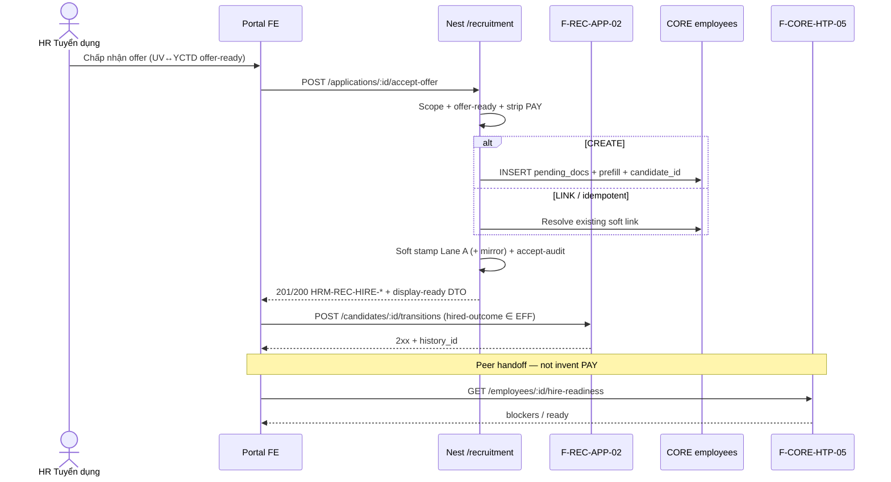

# PO-HRM-MVP-GD1-REC-07-CLUSTER-API-01 — API F.1 · Accept offer → create/link hồ sơ NS (Option A PHYSICAL)

| Field | Value |
|-------|--------|
| **work_item_id** | `PO-HRM-MVP-GD1-REC-07-CLUSTER-API-01` |
| **program** | `PO-HRM-MVP-GD1-CONTINUOUS` (**U89** — Wave-9 seat **#11**) |
| **lane** | governance · sa |
| **change_mode** | **ADD** DOC-DELTA residual F-REC-HIRE-01 · **NO CODE** `apps/**` · **no seed** · **preserve_default** |
| **Date** | 2026-08-09 |
| **Status** | **CONFIRMED** — F.1 physical Option A · unlock **dev-be** + **dev-fe** |
| **uc_ids** | `UC-BP-REC-07` |
| **depends_on** | DATA-01 **CONFIRMED** · BA-01 O1–O12 **CONFIRMED** · SA-01 Option **A LOCKED** · peer seal **`REC06QC1-MSL4CU2G`** · REC-05/06a/04 **RETAIN** |
| **ref_data** | [`PO-HRM-MVP-GD1-REC-07-CLUSTER-DATA-01.md`](./PO-HRM-MVP-GD1-REC-07-CLUSTER-DATA-01.md) — UV→EMP map §4 · soft stamp + reverse `employees.candidate_id` · optional accept-audit · `pending_docs` |
| **ref_ba** | [`PO-HRM-MVP-GD1-REC-07-CLUSTER-BA-01.md`](./PO-HRM-MVP-GD1-REC-07-CLUSTER-BA-01.md) · AC-REC-07-* · VAL-REC-HIRE-01..24 · O1–O12 |
| **ref_sa** | [`PO-HRM-MVP-GD1-REC-07-CLUSTER-SA-01.md`](./PO-HRM-MVP-GD1-REC-07-CLUSTER-SA-01.md) Option A · F-REC-HIRE-01 ADD residual |
| **ref_peer_api** | [`PO-HRM-MVP-GD1-REC-05-CLUSTER-API-01.md`](./PO-HRM-MVP-GD1-REC-05-CLUSTER-API-01.md) **F-REC-APP-02** RETAIN sole hired-outcome writer · [`PO-HRM-MVP-GD1-REC-06-CLUSTER-API-01.md`](./PO-HRM-MVP-GD1-REC-06-CLUSTER-API-01.md) mail **≠ hire** |
| **ref_uv** | [`PO-HRM-REC-UV-YCTD-API-01.md`](./PO-HRM-REC-UV-YCTD-API-01.md) · ONE soft FK `requisition_id` · GĐ1 `application_id = recruitment_candidates.id` |
| **ref_htp** | F-CORE-HTP-05 LIVE `GET /api/hrm/employees/:id/hire-readiness` · peer EMP |
| **ref_srs** | `SRS_HRM_ENTERPRISE.md` **FR-UC-BP-REC-07** Diễn biến **#1–#2** (+ #3–#5 handoff) · **BR-BP-LC-01** / **BR-BP-ONB-01** · AC-HTP-05-01..03 |
| **ref_paper_api** | `API_DESIGN_HRM_ENTERPRISE.md` **F-REC-HIRE-01** = **logical alias** `POST /api/hrm/rec/applications/{id}/accept-offer` · physical prefer `/recruitment/*` |
| **Honesty** | `recruitment_uat_ready=false` · `jd_dynamic_done=false` · **C-SLICE** · U65 |
| **ba-data** | **ALREADY CONFIRMED** (DATA-01) — this seat **does not** re-open schema invent |
| **ack_status** | **PASS_TO_PM CONFIRMED** |

---

## 1. Verdict — **CONFIRMED**

| Decision | Stamp |
|----------|--------|
| Physical base | Nest `@Controller('recruitment')` — **`/api/hrm/recruitment/*` ONLY** |
| Hire primary | **`POST /api/hrm/recruitment/applications/:applicationId/accept-offer`** — **ADD F-REC-HIRE-01** |
| Application neo (GĐ1) | `:applicationId` = Lane A **`recruitment_candidates.id`** with **`requisition_id IS NOT NULL`** (display `application_id = id` AS-IS UV) — **DENY** Lane B `candidate_applications.job_posting_id` as SoT (REC-03) |
| Create+prefill | INSERT `employees` from DATA-01 §4 map **or** LINK existing soft reverse same CT · status default **`pending_docs`** · **no re-key** |
| Soft stamp | Lane A `employee_id` (+ Lane B mirror when `pool_candidate_id`) + reverse **`employees.candidate_id`** · **no** hard FK (G-DB-02) |
| Accept-audit | Optional Lane A cols `offer_accepted_at` / `offer_accepted_by` / `accepted_application_id` / soft `offer_id` — **DENY** second hire table |
| Idempotent | Re-accept same application already hired+linked → **2xx** same `employee_id` · **no** second emp · true conflict → **409** `HRM-REC-HIRE-DUP` |
| Stage writer | **RETAIN F-REC-APP-02** — hired-outcome **ONLY after** accept success · accept **never** silent-writes `status` without history |
| HTP | **RETAIN F-CORE-HTP-05** — consume after emp exists · ≠ create fail |
| Link assert | **RETAIN** `HRM-REC-HIRE-400` / `HRM-REC-HIRE-409` · create path must satisfy assert after stamp |
| PAY | Client payroll/payslip payload → **`HRM-REC-PAY-403`** · REC ↛ PAY |
| Display-ready DTO | `employee_id` + prefilled fields + `status=pending_docs` + soft neo ids + optional `hired_outcome` after APP-02 |
| Mint codes | **EXPAND `HRM-REC-HIRE-*`** — OFFER-INVALID · CANCELLED · DUP · PREFILL-FAIL · success **`HRM-REC-HIRE-200` / `HRM-REC-HIRE-201`** |
| U19 | get application/UV **=** accept-offer **=** get employee **=** hire-readiness — same `resolveHrmListScope` |
| Paper path | `POST /api/hrm/rec/applications/{id}/accept-offer` = **logical alias only** — **DENY** Nest dual SoT |
| Thin candidate alias | `POST …/candidates/:id/accept-offer` **optional** only if resolves **one** in-scope YCTD application + **same** VAL/SoT — **primary FE** = applications/:id |
| Mail template `offer` | REC-06 SEALED **≠ hire** — stamp **`REC06QC1-MSL4CU2G`** |
| Peers | **RETAIN** UV-YCTD · REC-05 transitions/history · 06a IV · REC-04 scan · CAT STG/EFF · hire-employee-link · HTP-05 · W1–W3 |
| This seat | Docs only — **NO** `apps/**` · **NO** seed · **NO** honesty flip · **NO** reopen sealed J-06 |
| Unlock | **dev-be** + **dev-fe** (rule 26 split) after this CONFIRMED |

```text
  FE «Chấp nhận offer» trên UV↔YCTD (offer-ready)
        │  Network assert path contains /recruitment/
        ▼
  GET  /api/hrm/recruitment/candidates/:id | /applications?requisition_id=…   (U19 RETAIN)
        │
        ├─► POST /api/hrm/recruitment/applications/:applicationId/accept-offer
        │     (F-REC-HIRE-01 ADD)
        │     1) Scope + load Lane A YCTD-bound (:id = recruitment_candidates.id)
        │     2) Offer-ready gate · cancel gate · strip PAY keys
        │     3) CREATE emp (DATA-01 §4) OR LINK reverse/soft same CT
        │        status=pending_docs · employee_code mint · no re-key
        │     4) Soft stamp Lane A (+ pool mirror) + employees.candidate_id
        │        optional accept-audit · RETAIN hire-employee-link assert
        │     5) Emit offer.accepted · DENY PAY · DENY silent stage
        │     6) Idempotent re-accept → 2xx same employee_id
        │
        ├─► POST /api/hrm/recruitment/candidates/:id/transitions
        │     (F-REC-APP-02 RETAIN — hired-outcome ONLY after accept 2xx)
        │     + GET …/stage-history
        │
        └─► GET /api/hrm/employees/:employeeId/hire-readiness
              (F-CORE-HTP-05 RETAIN — CORE handoff · ≠ accept create fail)

  paper /api/hrm/rec/applications/{id}/accept-offer = alias only
  HireEmployeeLinkDialog / pool PATCH hired / Kanban drag / mail template offer = ≠ FR-07 DONE alone
```

**Envelope RETAIN:** `{ code, message, data }` · success **`HRM-REC-HIRE-201`** (create) · **`HRM-REC-HIRE-200`** (link / idempotent re-accept) · domain errors §7.

**Invariant HIRE-APP (O1/O7):** accept **2xx** ⇒ YCTD-bound application in-scope + soft `employee_id` stamped + reverse `candidate_id` set + **no** second emp for same application neo.

**Invariant HIRE-STAGE-APP-02 (O6):** accept endpoint **never** UPDATE `recruitment_candidates.status` / invent hired without **F-REC-APP-02** history row — sequential (or same logical unit orchestrated) Network: accept **2xx** then transitions **2xx** + `history_id`.

**Invariant HIRE-NO-REKEY (O3/O4):** response exposes UV/YCTD-sourced fields · FE **must not** require re-type of those fields for success.

**Invariant HIRE-≠-MAIL (O9):** REC-06 `template_code=offer` **≠** F-REC-HIRE-01.

**Invariant HIRE-S-SCOPE (U19):** list/get UV·application **=** accept **=** get employee **=** hire-readiness.

---

## 2. AS-IS Nest baseline → residual gap

| Surface | LIVE (read-only cite) | Gap vs F.1 residual |
|---------|----------------------|---------------------|
| `POST …/applications/:id/accept-offer` | **ABSENT** | **ADD** F-REC-HIRE-01 |
| Soft hire link | `hire-employee-link.ts` · Lane A/B `employee_id` · reverse SELECT `employees.candidate_id` · **HIRE-400/409** | **RETAIN** assert · CREATE path stamps then assert |
| Employee CREATE from UV | **ABSENT** (picker-only `HireEmployeeLinkDialog`) | **ADD** create+prefill |
| `employees.candidate_id` ensureSchema | Queried; **ADD COLUMN** may be ABSENT cold DB | **ADD** per DATA-01 §5.1 (Dev) |
| Accept-audit cols Lane A | **ABSENT** | **EXPAND** optional per DATA-01 §5.2 |
| `POST …/candidates/:id/transitions` | SEALED REC-05 APP-02 | **RETAIN** sole hired-outcome writer |
| `GET …/employees/:id/hire-readiness` | LIVE HTP-05 | **RETAIN** consume |
| `POST …/candidates/:id/mail` | SEALED REC-06 | **RETAIN ≠ hire** |
| Nest `/rec/*` | Paper naming | **Alias only — DENY** controller SoT |
| Pool / Kanban hired | Prior deny | **≠** FR-07 DONE |
| REC-03 / Campaign posting apps | OUT | **DENY** as accept SoT |

**FORBIDDEN invent this seat:** Nest `/rec` dual · second hire/accept SoT · hard FK · PAY/C&B columns · claim mail `offer` = hire · pool PATCH hired alone = DONE · seed · honesty flip · reopen sealed J-06 · redefine APP-02 / HTP-05 · apps/**.

---

## 3. Path & alias lock (O1 · Q-REC-HIRE-CAND-ALIAS)

| Plane | Path |
|-------|------|
| **PHYSICAL (Nest GĐ1)** | **`POST /api/hrm/recruitment/applications/:applicationId/accept-offer`** · peers `POST …/candidates/:id/transitions` · `GET …/stage-history` · `GET /api/hrm/employees/:id/hire-readiness` · `GET …/pipeline-stages/effective` |
| **LOGICAL (paper)** | `POST /api/hrm/rec/applications/{id}/accept-offer` |
| Rule | Client/docs **may** keep paper names; Dev **implements physical only**. Gateway rewrite optional — **not** unlock-gate. |
| QA Network assert | Path **contains** `/recruitment/` — **FAIL O1** if FE mutates Nest `/rec/*` as SoT |

| Paper / logical | Physical | DB |
|-----------------|----------|-----|
| F-REC-HIRE-01 `/rec/…/accept-offer` | `POST …/applications/:id/accept-offer` | CREATE/LINK `employees` + soft stamps |
| `rec_candidate.employee_id` | Lane A `recruitment_candidates.employee_id` (+ pool mirror) | Soft UUID |
| `hrm_employee.candidate_id` | `employees.candidate_id` | Soft reverse ADD |
| application hired stage | **F-REC-APP-02** transitions | `status` + `rec_candidate_stage_history` |
| Hire readiness | `GET …/hire-readiness` | contracts peer · HTP-05 |

**Q-REC-HIRE-CAND-ALIAS LOCKED:** Thin `POST …/candidates/:candidateId/accept-offer` **optional synonym** only if: (a) resolves **exactly one** in-scope YCTD-bound application neo for that UV, (b) **same** service + VAL as applications path, (c) response identical shape — **primary FE** = **`applications/:id`**. Ambiguous multi-YCTD → **400** `HRM-REC-HIRE-OFFER-INVALID` (or dedicated neo-required) — **DENY** silent pick.

**Application resolve (GĐ1 LOCKED):**

```text
:applicationId → SELECT recruitment_candidates
  WHERE id = :applicationId
    AND requisition_id IS NOT NULL
    AND archived_at IS NULL (if col)
  + company scope via resolveHrmListScope / assertResourceInHrmScope
→ else 404/409
DENY: candidate_applications.job_posting_id · Campaign posting as accept home
```

---

## 4. CFG / gate dictionary (O2)

| Key | Type | Default GĐ1 | Rule |
|-----|------|-------------|------|
| **Offer-ready stage** | EFF catalog | stage `code`/`stage_key` = **`offer`** **or** flag **`allows_accept_offer=true`** on stage | Not ready ⇒ **400** `HRM-REC-HIRE-OFFER-INVALID` · **no** emp · **no** transition |
| **Offer cancelled** | UV/app flag or status ∈ cancel set | if cancelled after intent | **400** `HRM-REC-HIRE-CANCELLED` (or OFFER-INVALID) + reason · **no** new emp |
| **Hired outcome target** | EFF | exactly one active `is_hired_outcome` / `hiredOutcomeKey` | Invent → **`HRM-REC-STAGE-UNKNOWN`** on APP-02 · RETAIN |
| **`pending_docs` status** | EMP soft key | default on CREATE | If EMP EFF >0 and key missing → bootstrap/catalog residual (CORE) — **not** PAY invent |
| Strip PAY keys | body sanitize | always | `base_salary` / `payslip_*` / payroll payload ⇒ **403** `HRM-REC-PAY-403` before mutate |

**Q-REC-HIRE-OFFER-FLAG LOCKED:** Default GĐ1 = stage ∈ EFF with `offer` **or** `allows_accept_offer=true` — BA default retained; Dev must not hardcode only English label outside EFF.

---

## 5. F.1 API functions (PHYSICAL)

> Mỗi function: **Mục đích** · **Nghiệp vụ xử lý** · **Tham chiếu bước SRS** · Request/Response → DB · Lỗi.

**Prefix:** `/api/hrm/recruitment` (hire) · `/api/hrm/employees` (HTP peer)  
**Scope:** UV/application get · accept · employee get · hire-readiness = **cùng** `resolveHrmListScope` + `assertResourceInHrmScope` (**U19** · VAL-REC-HIRE-13 · HIRE-S-SCOPE).

---

### 5.1 F-REC-HIRE-01 — Accept offer → CREATE/LINK hồ sơ NS (**ADD**)

| | |
|--|--|
| **METHOD / path** | **`POST /api/hrm/recruitment/applications/:applicationId/accept-offer`** |
| **Mục đích** | Xác nhận chấp nhận offer trên neo UV↔YCTD; **tạo hoặc gắn** hồ sơ nhân sự cùng pháp nhân với **điền sẵn** từ UV+YCTD — **không** bắt nhập lại; soft-link; **không** tạo payslip — phục vụ FR-UC-BP-REC-07 Diễn biến **#1–#2** · BR-BP-LC-01 / BR-BP-ONB-01. |
| **Nghiệp vụ xử lý** | (1) JWT + `company_id` → `resolveHrmListScope`; load Lane A by `:applicationId` (= `recruitment_candidates.id`) with `requisition_id IS NOT NULL` in-scope — else **404/409**. (2) Join YCTD `job_requisitions` same CT — mismatch ⇒ **409** `HRM-REC-HIRE-409` / SCOPE. (3) **Offer-ready gate** (§4) — fail ⇒ **400** `HRM-REC-HIRE-OFFER-INVALID` · **no** INSERT emp · **no** stamp · **no** stage. (4) Cancel gate ⇒ **400** `HRM-REC-HIRE-CANCELLED`. (5) Body sanitize: any payroll/payslip/salary invent keys ⇒ **403** `HRM-REC-PAY-403`. (6) **Idempotent:** if soft `employee_id` already set **and** reverse `employees.candidate_id` matches same application neo / Lane A id · same CT · not archived ⇒ return **200** `HRM-REC-HIRE-200` existing DTO · **do not** wipe `offer_accepted_at` · **do not** INSERT second emp. (7) **True conflict** (different active emp linked / race) ⇒ **409** `HRM-REC-HIRE-DUP`. (8) **CREATE path** (no valid reverse/soft same CT): map DATA-01 §4 M01–M14 → `INSERT employees` (`full_name`, `email`, `company_id`, `job_title_key`, `hired_at`, `custom_fields.phone_number` / `department_key`, `status='pending_docs'`, mint `employee_code`, set `candidate_id`=Lane A id) — missing M01/M05[/email NOT NULL] ⇒ **400** `HRM-REC-HIRE-PREFILL-FAIL` · **no** stamp. Optional CORE fields missing ⇒ still CREATE `pending_docs` (FR-07 special). (9) **LINK path:** existing reverse/soft same CT → confirm stamp · **no** new emp · RETAIN assert via `assertHireEmployeeLinkOrThrow` after stamp. (10) Soft stamp Lane A `employee_id` · mirror Lane B when `pool_candidate_id` · set reverse `employees.candidate_id` (**ADD col** if ABSENT ensureSchema). (11) Optional accept-audit: set `offer_accepted_at` (first only) · `offer_accepted_by` · `accepted_application_id=:applicationId` · soft `offer_id` if provided — **DENY** invent `rec_offer` table. (12) Emit domain event **`offer.accepted`** payload `{ tenant_id?, company_id, candidate_id, application_id, offer_id?, position_key?, accepted_at }` — **DENY** PAY call. (13) **DENY** UPDATE stage here — caller/orchestrator **must** invoke **F-REC-APP-02** next for hired-outcome. (14) **cấm** Nest `/rec` dual · hard FK · second hire SoT · seed. |
| **Tham chiếu bước SRS** | **FR-UC-BP-REC-07** Diễn biến **#1–#2** · special cancel / missing fields / no-contract (handoff) · **BR-BP-LC-01** / **BR-BP-ONB-01** · AC-REC-07-01/03/07/08 · ALT-01/02 · EX-01..13 · VAL-REC-HIRE-01..24 · **O1–O7 / O11 / O12** · DATA-01 DV-REC-HIRE-MAP-* / FK-*. |
| **Request** | Path `:applicationId` (UUID Lane A / application neo). Body optional: `{ expected_start_date?: string (ISO date), note?: string, offer_id?: string }` — **DENY** payroll fields. |
| **Request → DB** | Prefill map DATA-01 §4 → `employees.*` (+ `custom_fields`); stamps → `recruitment_candidates.employee_id` · `candidates.employee_id?` · `employees.candidate_id`; audit → Lane A optional cols; `expected_start_date` → `hired_at` Prefer. |
| **Response** | Display-ready §6 · create **`HRM-REC-HIRE-201`** · link/idempotent **`HRM-REC-HIRE-200`**. |
| **Lỗi** | `HRM-REC-HIRE-OFFER-INVALID` · `HRM-REC-HIRE-CANCELLED` · `HRM-REC-HIRE-PREFILL-FAIL` · `HRM-REC-HIRE-DUP` · `HRM-REC-HIRE-400` · `HRM-REC-HIRE-409` · `HRM-REC-PAY-403` · scope 404/409 · (stage invent only on APP-02 → `HRM-REC-STAGE-UNKNOWN`) |

**Paper alias:** `POST /api/hrm/rec/applications/{id}/accept-offer` — maps to physical applications path (same `:id`).

**Orchestration note (O6):** BE **may** optionally chain APP-02 inside the same request **only if** it still produces a visible transitions Network contract **or** returns `history_id` + stage display in accept DTO **and** writes history via the **same** APP-02 service (no silent status UPDATE). Prefer **explicit sequential** FE calls for QA Network clarity — either way **history row required** before claiming hired-outcome.

**DENY as FR-07 SoT:** picker-only without create · empty re-key form · Nest `/rec` controller dual · pool PATCH hired alone · mail template `offer` · Campaign posting application.

---

### 5.2 F-REC-HIRE-01-A — Thin candidate accept alias (**OPTIONAL ADD**)

| | |
|--|--|
| **METHOD / path** | **`POST /api/hrm/recruitment/candidates/:candidateId/accept-offer`** |
| **Mục đích** | Thuận tiện FE khi đã mở UV detail — **không** second SoT. |
| **Nghiệp vụ xử lý** | Resolve single YCTD application neo for `:candidateId` in-scope → delegate **identical** service as §5.1 · multi/ambiguous ⇒ **400** OFFER-INVALID. |
| **Tham chiếu bước SRS** | Same FR-07 #1–#2 · **O1** · Q-REC-HIRE-CAND-ALIAS. |
| **Lỗi** | Same family as §5.1. |

**Primary FE remain:** applications/:id (BA O1).

---

### 5.3 F-REC-APP-02 — Hired-outcome stage (**RETAIN** — cite only)

| | |
|--|--|
| **METHOD / path** | **`POST /api/hrm/recruitment/candidates/:candidateId/transitions`** (+ **`GET …/stage-history`**) |
| **Mục đích** | Ghi stage `is_hired_outcome` ∈ EFF + APPEND history — **sole** hired-outcome writer after accept success. |
| **Nghiệp vụ xử lý** | RETAIN REC-05 F.1 · target = EFF hiredOutcomeKey · missing link when outcome hired ⇒ **HIRE-400** RETAIN · invent stage ⇒ **`HRM-REC-STAGE-UNKNOWN`** · **DENY** accept silent stage. |
| **Tham chiếu bước SRS** | FR-07 #2 stage · AC-REC-07-02 · O6 · peer FR-UC-BP-REC-05. |
| **This seat** | **No rewrite** — wire after accept only. |

---

### 5.4 F-CORE-HTP-05 — Hire readiness (**RETAIN** — cite only)

| | |
|--|--|
| **METHOD / path** | **`GET /api/hrm/employees/:employeeId/hire-readiness`** |
| **Mục đích** | Blocker trước lương / hoàn tất onboard — profile + HĐ hiệu lực cùng CT (AC-HTP-05-01..03). |
| **Nghiệp vụ xử lý** | RETAIN LIVE · missing active contract ⇒ ready=false / blocker **`HRM-HTP-NO-ACTIVE-CONTRACT`** · **≠** fail accept CREATE · **DENY** claim payroll-ready from accept alone. |
| **Tham chiếu bước SRS** | FR-07 #3–#5 · AC-REC-07-04/05 · O8. |
| **This seat** | **Consume only** — CORE contract/SI/checklist = peer handoff. |

---

### 5.5 Hire-employee-link assert (**RETAIN** — cite only)

| | |
|--|--|
| **Surface** | `hire-employee-link.ts` · callers catalog/workflow/transitions |
| **Mục đích** | Soft enforce employee present same CT before hired-outcome stamp paths. |
| **Codes** | **`HRM-REC-HIRE-400`** missing · **`HRM-REC-HIRE-409`** cross-company |
| **Rule** | Create/accept path **must** leave state that assert passes; link-only picker residual ≠ FR-07 DONE alone (O3 ALT-03). |

---

## 6. Display-ready DTO (O12)

### 6.1 Accept-offer response `data`

| Field | Type | Source | Notes |
|-------|------|--------|-------|
| `application_id` | uuid | path / Lane A id | Neo |
| `candidate_id` | uuid | Lane A id | Same as application neo GĐ1 |
| `employee_id` | uuid | `employees.id` | Soft link |
| `company_id` | string | YCTD / emp | Scope |
| `requisition_id` | uuid | Lane A | YCTD soft FK |
| `full_name` | string | emp ← UV | Prefill |
| `email` | string | emp ← UV | Prefill |
| `phone_number` | string\|null | `custom_fields.phone_number` | Prefer |
| `department_key` | string\|null | `custom_fields.department_key` | Prefer YCTD |
| `job_title_key` / `position_key` | string\|null | emp ← YCTD | Prefer |
| `hired_at` / `expected_start_date` | date\|null | emp.hired_at | Prefer |
| `status` | string | emp.status | Default **`pending_docs`** |
| `employee_code` | string | emp | Minted |
| `offer_accepted_at` | timestamptz\|null | Lane A audit | First accept |
| `accepted_application_id` | uuid\|null | Lane A audit | = application_id |
| `mode` | `created` \| `linked` \| `idempotent` | derived | UX toast |
| `history_id` | uuid\|null | if chained APP-02 | Optional |
| `hired_outcome_stage` | string\|null | if chained / subsequent | Display after APP-02 |
| `event` | `offer.accepted` | emit ack | Optional echo |

**DENY:** FE invent hire aggregate from mail outbox · re-derive employee from pool-only PATCH.

### 6.2 Employee GET (peer — bind after accept)

Must expose same prefilled fields + `candidate_id` reverse for F5 — existing employees DTO **UPGRADE bind** only (no invent PAY columns).

---

## 7. Error taxonomy (mint + RETAIN)

| Code | HTTP | When | ≠ |
|------|------|------|---|
| **`HRM-REC-HIRE-201`** | 201 | CREATE success | — |
| **`HRM-REC-HIRE-200`** | 200 | LINK / idempotent re-accept | DUP |
| **`HRM-REC-HIRE-OFFER-INVALID`** *(mint)* | 400 | Not offer-ready / ambiguous thin alias | STAGE-UNKNOWN |
| **`HRM-REC-HIRE-CANCELLED`** *(mint)* | 400 | Offer cancelled | OFFER-INVALID |
| **`HRM-REC-HIRE-PREFILL-FAIL`** *(mint)* | 400 | Missing required name/company[/email] | optional CORE miss |
| **`HRM-REC-HIRE-DUP`** *(mint)* | 409 | True conflict different emp | Idempotent 200 |
| **`HRM-REC-HIRE-400`** | 400 | Link-only missing emp (**RETAIN**) | Create path |
| **`HRM-REC-HIRE-409`** | 409 | Cross-company (**RETAIN**) | Scope |
| **`HRM-REC-STAGE-UNKNOWN`** | 400 | Hired target ∉ EFF (**RETAIN** APP-02) | OFFER-INVALID |
| **`HRM-REC-PAY-403`** | 403 | Payroll payload (**RETAIN**) | — |
| **`HRM-SCOPE-409`** / 404 | 409/404 | Outside scope | HIRE-409 |
| **`HRM-HTP-NO-ACTIVE-CONTRACT`** | ready=false / 4xx peer | HTP blocker (**RETAIN**) | Create fail |

---

## 8. U19 scope_parity matrix

| Operation | Resolver | Fail |
|-----------|----------|------|
| GET candidates / applications by YCTD | `resolveHrmListScope` | Cross-CT leak |
| POST accept-offer | **same** + assert resource company | 404/409 if list would hide |
| GET employee | **same** CT ladder | Member sees foreign emp |
| GET hire-readiness | **same** | Scope bypass |
| Transitions hired-outcome | **same** (REC-05) | — |

**Flag defect:** list returns application id but accept 404 under group CEO `main` → **scope_parity FAIL**.

Personas: Group CEO rollup · Member CEO own CT · HRBP membership — **same** ladder as REC-05/06.

---

## 9. Traceability (SRS → DB → API → FE → Test)

| Requirement | DB (DATA-01) | API (this) | FE / Journey | Test expect |
|-------------|--------------|------------|--------------|-------------|
| FR-07 #1–#2 · BR-BP-LC-01 | §4 map + §5 stamp | **F-REC-HIRE-01** ADD | **J-HRM-REC-07-01** | Prefill + employee_id F5 · path `/recruitment/` |
| O5 idempotent | Soft stamp + audit | Same POST 200 | **J-HRM-REC-07-02** | Same emp · no dup |
| O6 hired-outcome | APP-02 history RETAIN | F-REC-APP-02 after accept | J-07-01 transitions | `history_id` |
| O7 soft link · G-DB-02 | §5 no hard FK | hire-employee-link RETAIN | Link assert | 400/409 |
| O8 HTP | employees + contracts | F-CORE-HTP-05 | **J-HRM-REC-07-03** | NO-ACTIVE-CONTRACT |
| O11 no PAY | no PAY cols | PAY-403 | J-07-04 | 403 |
| O9 mail≠hire | no mail SoT change | F-REC-MAIL-01 RETAIN | — | ≠ hire DONE |
| U19 | company_id soft CT | HIRE-S-SCOPE | **J-HRM-REC-07-04** | 404/409 |

**ba-data:** ALREADY CONFIRMED — Dev implements ensureSchema from DATA-01 · **no** re-invent columns this seat.

---

## 10. Sequence (normative)



---

## 11. Honesty & must_keep / DENY

| Item | Rule |
|------|------|
| `recruitment_uat_ready` | **false** |
| `jd_dynamic_done` | **false** RETAIN HOLD |
| C-SLICE | GWC REC-07 ≠ module REC UAT ≠ Phase1 DONE |
| must_keep W1–W3 | HC / YCTD / dashboard |
| must_keep W4 | IV one-active + soft-gate · J-IV-* |
| must_keep W5 | JD `job-templates` |
| must_keep W6 | REC-04 scan/posted · J-CV-04-* |
| must_keep W7 | REC-05 transitions/history · **`REC05QC1-MSL35D49`** · J-STG-05-* |
| must_keep W8 | REC-06 mail+eval · **`REC06QC1-MSL4CU2G`** · J-06-* · **mail ≠ hire** |
| must_keep | UV-YCTD ONE `requisition_id` · CAT STG/EFF · soft hire-link HIRE-400/409 · HTP-05 · U19 · soft-delete · G-DB-02 · APP-02 sole hired-outcome |
| **DENY** | Nest `/rec` dual · second hire SoT · hard FK · PAY invent · pool/Kanban hired alone = FR-07 DONE · REC-03 · seed · honesty flip · invent beyond BA/SRS/DATA · apps/** this seat · reopen sealed J-06 without regression · claim REC-06 mail `offer` = F-REC-HIRE-01 · accept silent stage |

---

## 12. Dev unlock packet

### 12.1 Dev-BE (`PO-HRM-MVP-GD1-REC-07-CLUSTER-BE-01`)

1. ensureSchema **ADD** `employees.candidate_id` (+ IX) per DATA-01 §5.1; optional Lane A accept-audit cols §5.2.
2. **ADD** `POST …/applications/:applicationId/accept-offer` on physical `/recruitment/` — resolve Lane A YCTD-bound · gates §4 · CREATE/LINK §5.1 · soft stamp + reverse · idempotent 2xx · emit `offer.accepted`.
3. Optional thin `POST …/candidates/:id/accept-offer` same service (Q-REC-HIRE-CAND-ALIAS).
4. Mint codes §7 · RETAIN HIRE-400/409 · PAY-403 · STAGE-UNKNOWN on APP-02.
5. Wire/orchestrate **APP-02** hired-outcome **after** success (no silent status) · RETAIN hire-employee-link assert.
6. U19 jest: list=get=accept=emp=HTP; offer-invalid; prefill-fail; idempotent; DUP; PAY-403; cross-CT 409; regression APP-02 / mail≠hire / IV / REC-04 / UV-YCTD.
7. **DENY** Nest `/rec` controller · hard FK · second hire table · seed · honesty · reopen sealed J-06 rewrite.

### 12.2 Dev-FE (`PO-HRM-MVP-GD1-REC-07-CLUSTER-FE-01`)

1. UV–YCTD offer-ready → **Chấp nhận offer** → **POST …/applications/:id/accept-offer** physical `/recruitment/` · show prefilled emp · **no** re-key primary form.
2. After accept 2xx → **POST transitions** hired-outcome ∈ EFF · Timeline F5 · toast HIRE-* / STAGE-UNKNOWN.
3. Open emp + **hire-readiness** surface (HTP blocker VI) — handoff CORE contract/checklist · **no** PAY invent.
4. Idempotent re-accept UX · **no** Nest `/rec` SoT · **no** claim mail offer / pool drag = FR-07 DONE · **no** seed.

---

## 13. Validation plan (QA after Dev)

| Gate | PASS when |
|------|-----------|
| L0/L1 | Stack + accept 2xx/4xx mint codes · PAY-403 · HIRE-400/409 retain |
| L2.5 | **J-HRM-REC-07-01..04** browser U65 — no seed |
| Network | Path `/recruitment/` · accept then transitions · F5 soft link · mail ≠ hire |
| Honesty | Flags remain false · C-SLICE · **DENY** reopen J-06 / J-STG-05 / J-IV / J-CV-04 rewrite |

---

## 14. Exit / handoff

| Field | Value |
|-------|--------|
| **ack_status** | **PASS_TO_PM** · API **CONFIRMED** |
| **next_owner** | **pm** → unlock **dev-be** + **dev-fe** |
| **evidence_path** | `docs/qa/evidence/po-hrm-mvp-gd1-rec-07-cluster-api-01.md` |
| **Unlocks** | Execution residual accept-offer create+prefill+soft-link + APP-02 wire + HTP consume |
| **Does not unlock** | Honesty flips · REC-03 · Nest `/rec` dual · module REC UAT · reopen sealed J-06 · PAY · claim REC-06=hire |

### next_dispatch_prompt (copy-ready)

```text
work_item_id: PO-HRM-MVP-GD1-REC-07-CLUSTER-BE-01
lane: execution · dev-be
program: PO-HRM-MVP-GD1-CONTINUOUS (U89)
uc_ids: UC-BP-REC-07
depends_on: API-01 CONFIRMED — docs/program/specs/PO-HRM-MVP-GD1-REC-07-CLUSTER-API-01.md · DATA-01 · BA-01 O1–O12 · SA Option A
entry_criteria: F.1 CONFIRMED; honesty false; C-SLICE; U65; cấm Nest /rec dual · second hire SoT · hard FK · PAY · mail=hire · seed · honesty flip · reopen sealed J-06
MISSION: Implement physical Nest /api/hrm/recruitment/* — ADD POST /applications/:id/accept-offer (create+prefill DATA-01 §4 · soft stamp Lane A + pool mirror · reverse employees.candidate_id · optional accept-audit); idempotent 2xx; APP-02 hired-outcome ONLY after success; RETAIN HTP-05 · HIRE-400/409 · PAY-403 · STAGE-UNKNOWN; mint HRM-REC-HIRE-*; U19; ensureSchema per DATA-01; jest. Parallel FE-01.
exit: docs/qa/evidence/po-hrm-mvp-gd1-rec-07-cluster-be-01.md · READY_FOR_QA
cấm: Nest /rec dual · second hire SoT · hard FK · PAY invent · mail=hire · seed · honesty flip · reopen sealed J-06 · claim picker/pool/Kanban = FR-07 DONE
```

Parallel FE:

```text
work_item_id: PO-HRM-MVP-GD1-REC-07-CLUSTER-FE-01
lane: execution · dev-fe
program: PO-HRM-MVP-GD1-CONTINUOUS (U89)
uc_ids: UC-BP-REC-07
depends_on: API-01 CONFIRMED · BE-01 in parallel OK for UI bind stubs
MISSION: Bind Chấp nhận offer → POST /api/hrm/recruitment/applications/:id/accept-offer only; display-ready prefill no re-key; then transitions hired-outcome; HTP hire-readiness surface; toast HIRE-*; F5 soft link; DENY Nest /rec · mail=hire · pool/Kanban DONE · seed · honesty.
exit: docs/qa/evidence/po-hrm-mvp-gd1-rec-07-cluster-fe-01.md · READY_FOR_QA
```

---

## completion_report

- **Closed:** F.1 physical Option A CONFIRMED — **ADD F-REC-HIRE-01** `POST …/applications/:id/accept-offer` (create+prefill · soft stamp · reverse `candidate_id` · optional accept-audit) · idempotent 2xx · **APP-02 hired-outcome ONLY after success** · **RETAIN** HTP-05 · HIRE-400/409 · PAY-403 · STAGE-UNKNOWN · mint `HRM-REC-HIRE-*` · display-ready DTO · U19 HIRE-S-SCOPE · paper `/rec` alias · ba-data already CONFIRMED · DENY Nest dual / second hire SoT / hard FK / PAY / mail=hire / seed / honesty / reopen sealed J-06.
- **Residual:** Dev-BE/FE implement · QA U65 J-HRM-REC-07-* · QC GWC C-SLICE.
- **O1/path:** Physical `/recruitment/applications/:id/accept-offer` only · GĐ1 `:id` = Lane A `recruitment_candidates.id` (YCTD-bound).
