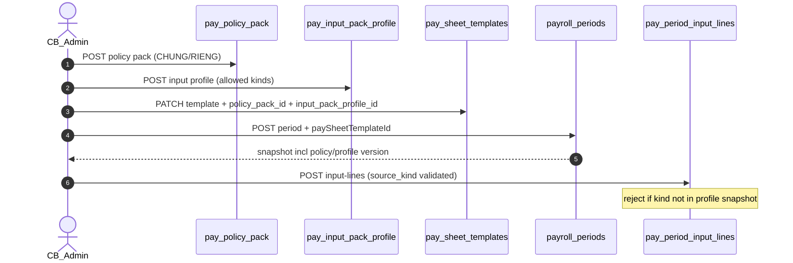

# PO-HRM-PAY-CNTT-API-01 — API_DESIGN F.1 · policy pack + input profile (CNTT Thiết lập)

| Field | Value |
|-------|--------|
| **work_item_id** | `PO-HRM-PAY-CNTT-API-01` |
| **Parent** | `PO-HRM-PAY-XEVN-CUSTOMER-CNTT-INTAKE-01` |
| **prior** | `PO-HRM-PAY-CNTT-BA-DATA-01` **PASS** · `PO-HRM-PAY-CNTT-SA-01` **CONFIRMED** · TPL-API-01 · INPUT-PACK-API-01 **CONFIRMED** (cite — cấm reopen) |
| **lane** | governance · sa |
| **change_mode** | **ADD** F-PAY-POLICY-PACK-* · F-PAY-INPUT-PROFILE-* · F-PAY-SETUP-RESOLVE-01 · **EXPAND** F-PAY-SHEET-TPL-* · F-PAY-PERIOD-01 · F-PAY-PERIOD-INPUT-01 · F-PAY-PROCESS-01 (note) · **DOC-DELTA** · **NO CODE** `apps/**` |
| **Date** | 2026-08-11 |
| **Status** | **CONFIRMED** — unlock **dev-be** ensureSchema + CRUD policy/profile + TPL FK expand |
| **ref_data** | `docs/qa/evidence/po-hrm-pay-cntt-ba-data-01.md` §4–§6 · `docs/hrm/DB_DESIGN_HRM_PAYROLL.md` CNTT APPEND |
| **ref_sa** | `PO-HRM-PAY-CNTT-SA-01.md` §3 · `ADR-HRM-PAY-MULTI-TEMPLATE-01` §4 · `ADR-HRM-PAY-XEVN-CUSTOMER-CNTT-01` |
| **ref_process** | `PO-HRM-PAY-CNTT-BA-PROCESS-01.md` UC-BP-PAY-STP-01..12 · F-STP-03/04 |
| **Honesty** | `payroll_e2e_ready=false` · formula **evaluator HOLD** · tables **PAPER** until BE ensureSchema |
| **must_keep** | TPL F.1 · INPUT-PACK F.1 · formula F.1 · SRC BR-AMIS-PAY-SRC-01..05 · ATT-412 · scope_parity U19 · U65 · open catalog · soft-delete |
| **ack_status** | **PASS_TO_PM** |

---

## 0. Objective & locks

Unlock **API_DESIGN F.1** for CNTT **Thiết lập lương** layers L4–L6 after ba-data physical CONFIRMED:

| Layer | Entity | F-id family |
|-------|--------|-------------|
| L4 Policy | `pay_policy_pack` | **F-PAY-POLICY-PACK-*** |
| L5 Input profile | `pay_input_pack_profile` | **F-PAY-INPUT-PROFILE-*** |
| L6 Applicability | template FK + resolve helper | **F-PAY-SETUP-RESOLVE-01** · **EXPAND** TPL |

| Lock | Rule |
|------|------|
| **Physical** | `pay_policy_pack` · `pay_input_pack_profile` · EXPAND `pay_sheet_templates` nullable FKs — cite `DB_DESIGN_HRM_PAYROLL.md` CNTT APPEND |
| **Open catalog** | `code` · `business_line_tag` · `source_kind` open string — **FORBIDDEN** `CHECK (code IN ('DPHH',…))` |
| **CHUNG / RIÊNG** | `pay_policy_pack.scope` = `CHUNG` \| `RIENG` — fragment refs in `policy_doc_refs_json` per `PO-HRM-PAY-CNTT-POLICY-READ-METHOD.md` |
| **Profile validation** | Period `POST/PATCH input-lines` must reject `source_kind` ∉ snapshot `allowed_source_kinds_json` → **`HRM-PAY-INP-PROFILE-422`** |
| **Snapshot** | Period create/bind copies `policy_pack` + `input_pack_profile` version into `sheet_template_snapshot_json` sibling fields |
| **Scope** | list ↔ get-by-id ↔ mutate = **same** `resolveHrmListScope` (U19) |
| **Soft-delete** | `archived_at` — no hard DELETE |
| **Formula / eval** | **cấm** reopen F-PAY-FORMULA-* · **cấm** claim PROCESS amounts LIVE |
| **Pack mount** | Column `map_confidence=INV` until XLSX mount — API contract valid; BA re-bind fragments later |

**Envelope:** `{ code, message, data }`  
**Auth:** HRM JWT / membership — same payroll peers.  
**Prefix:** `/api/hrm/payroll`

---

## 1. Capability map

| Cap | F-id | METHOD / path | AC / UC |
|-----|------|---------------|---------|
| List / get policy pack | **F-PAY-POLICY-PACK-LIST-01** | `GET /pay-policy-packs` · `GET …/:id` | **UC-BP-PAY-STP-01/02** · **AC-CNTT-SETUP-02** |
| Upsert policy pack | **F-PAY-POLICY-PACK-UPSERT-01** | `POST /pay-policy-packs` · `PATCH …/:id` | STP-01..06 · VAL-CNTT-01 |
| Archive policy pack | **F-PAY-POLICY-PACK-ARCHIVE-01** | `POST …/:id/archive` | Soft-delete |
| List / get input profile | **F-PAY-INPUT-PROFILE-LIST-01** | `GET /pay-input-pack-profiles` · `GET …/:id` | **UC-BP-PAY-STP-12** · **AC-CNTT-SETUP-04** |
| Upsert input profile | **F-PAY-INPUT-PROFILE-UPSERT-01** | `POST /pay-input-pack-profiles` · `PATCH …/:id` | STP-12 · BR-DATA-INP-01 |
| Archive input profile | **F-PAY-INPUT-PROFILE-ARCHIVE-01** | `POST …/:id/archive` | Soft-delete |
| Resolve setup tuple | **F-PAY-SETUP-RESOLVE-01** | `GET /pay-setup/resolve` | **AC-CNTT-SETUP-*** period form helper |
| TPL header EXPAND | **F-PAY-SHEET-TPL-LIST/UPSERT-01** EXPAND | existing paths | **UC-BP-PAY-STP-10/11** |
| Period snapshot EXPAND | **F-PAY-PERIOD-01** EXPAND | existing `POST /periods` | **AC-CNTT-SETUP-03** |
| Input line validation EXPAND | **F-PAY-PERIOD-INPUT-01** EXPAND | existing input-lines | **HRM-PAY-INP-PROFILE-422** |
| Process note | **F-PAY-PROCESS-01** EXPAND note | existing process | policy scalar read-only GĐ1 |



---

## 2. API_DESIGN F.1 — F-PAY-POLICY-PACK-*

### 2.1 F-PAY-POLICY-PACK-LIST-01 — List / GET by id

| | |
|--|--|
| **METHOD / path** | `GET /api/hrm/payroll/pay-policy-packs` · `GET /api/hrm/payroll/pay-policy-packs/:id` |
| **Mục đích** | Liệt kê / xem **gói chính sách lương** (QĐ/PDF fragment refs + tham số số) theo pháp nhân — phục vụ Thiết lập lương bước 1 AMIS và bind vào mẫu bảng. |
| **Nghiệp vụ xử lý** | (1) `resolveHrmListScope` + required `company_id` (slug Plane B). (2) Default exclude `archived_at IS NOT NULL` unless `include_archived=true`. (3) Filters: `status?` (`draft`\|`active`\|`retired`), `scope?` (`CHUNG`\|`RIENG`), `business_line_tag?`, `effective_on?` (date — pack active on date), `q?` (code/name). (4) Empty `[]` = **200**. (5) Get-by-id: **same** company/rollup predicate — out of scope → **404** (U19). (6) Display-ready: `code`, `nameVi`, `scope`, `businessLineTag`, `effectiveFrom`/`effectiveTo` — **cấm** raw UUID-only. (7) `policyDocRefs` returned as parsed jsonb array; `rateParams` as object — **no** binary PDF inline. (8) Optional `include_usage_count=true` returns count templates referencing pack (read-only). |
| **Tham chiếu bước SRS** | **UC-BP-PAY-STP-01** Quản lý policy pack CHUNG · **UC-BP-PAY-STP-02** Bind policy RIÊNG theo OU/BP · **UC-BP-PAY-STP-03** Tham số KPI/PCCV/đơn giá · AMIS Step 1 · **AC-CNTT-SETUP-02** |
| **Request (query)** | `company_id` · `status?` · `scope?` · `business_line_tag?` · `effective_on?` · `include_archived?` · `q?` · `include_usage_count?` |
| **Response → DB** | |

| DTO field | DB column (`pay_policy_pack`) |
|-----------|-------------------------------|
| `id` | `id` |
| `companyId` | `company_id` |
| `code` | `code` |
| `nameVi` | `name_vi` |
| `status` | `status` |
| `scope` | `scope` |
| `businessLineTag` | `business_line_tag` |
| `effectiveFrom` | `effective_from` |
| `effectiveTo` | `effective_to` |
| `policyDocRefs` | `policy_doc_refs_json` |
| `rateParams` | `rate_params_json` |
| `archivedAt` | `archived_at` |
| `createdAt` / `updatedAt` | `created_at` / `updated_at` |

| **Lỗi** | Scope 403/409 · empty list ≠ 404 |
| **scope_parity** | List predicate ≡ get-by-id (**must_keep**) |

---

### 2.2 F-PAY-POLICY-PACK-UPSERT-01 — Create / patch

| | |
|--|--|
| **METHOD / path** | `POST /api/hrm/payroll/pay-policy-packs` · `PATCH /api/hrm/payroll/pay-policy-packs/:id` |
| **Mục đích** | Tạo / sửa gói chính sách — mã, tên, phạm vi CHUNG/RIÊNG, thẻ BP, hiệu lực, tham chiếu tài liệu QĐ/PDF, tham số số (KPI ngưỡng, đơn giá tuyến, % DT…). |
| **Nghiệp vụ xử lý** | (1) Scope + `resolveHrmPersistCompanyIdText`. (2) **Create:** require `code` + `nameVi` + `effectiveFrom`; default `status=draft`, `scope=RIENG`. (3) Duplicate active `(company_id, lower(code))` where `archived_at IS NULL` → **`HRM-PAY-POL-409-CODE`**. (4) `code` format slug/open — **not** closed enum of 6 models. (5) `scope=CHUNG`: `business_line_tag` optional null; `RIENG`: recommend tag (`DPHH`, `TDHK`, `LX_ROUTE`, …) open string. (6) `effective_to` if set must be ≥ `effective_from` → **`HRM-PAY-POL-400-DATE`**. (7) `policy_doc_refs_json`: validate array shape `{ docId?, path?, fragmentIds[]? }` — paths reference-only (no upload GĐ1). (8) `rate_params_json`: validate finite numeric leaves only; keys open (e.g. `kpi_threshold_1500`, `cpsc_unit_price`) — **no** formula eval GĐ1. (9) **Patch:** refuse if `archived_at` set. (10) Transition `active`/`retired` via `status`. (11) **FORBIDDEN:** duplicate tax/SI master tables inside pack; hard DELETE. |
| **Tham chiếu bước SRS** | **UC-BP-PAY-STP-01** · **UC-BP-PAY-STP-02** · **UC-BP-PAY-STP-03** · **UC-BP-PAY-STP-05** policy địa bàn/tuyến · **UC-BP-PAY-STP-06** trợ lương VP · AMIS Step 1 · **BR-PAY-STP-02** effective dating · DATA §6.1 |
| **Request → DB** | |

| DTO | DB column | Required (POST) |
|-----|-----------|-----------------|
| `companyId` | `company_id` | YES |
| `code` | `code` | YES |
| `nameVi` | `name_vi` | YES |
| `status` | `status` | optional |
| `scope` | `scope` | optional default `RIENG` |
| `businessLineTag` | `business_line_tag` | optional |
| `effectiveFrom` | `effective_from` | YES |
| `effectiveTo` | `effective_to` | optional |
| `policyDocRefs` | `policy_doc_refs_json` | optional |
| `rateParams` | `rate_params_json` | optional |
| *(server)* | `created_by`/`updated_by`, timestamps | server |

| **Response** | Policy pack DTO (§2.1) |
| **Lỗi** | `HRM-PAY-POL-409-CODE` · `HRM-PAY-POL-400-DATE` · `HRM-VAL-400` · scope |

---

### 2.3 F-PAY-POLICY-PACK-ARCHIVE-01 — Soft-delete

| | |
|--|--|
| **METHOD / path** | `POST /api/hrm/payroll/pay-policy-packs/:id/archive` |
| **Mục đích** | Ẩn gói chính sách khỏi picker — giữ lịch sử kỳ đã snapshot. |
| **Nghiệp vụ xử lý** | (1) Scope + load. (2) Set `archived_at=now()`; optionally `status=retired`. (3) Templates still referencing pack remain valid; new binds discouraged with `warnings[]` if `block_archive_when_in_use=false` GĐ1. (4) Period snapshots **immutable** — archive does not rewrite past periods. (5) **FORBIDDEN** hard DELETE. |
| **Tham chiếu bước SRS** | **UC-BP-PAY-STP-01** alternate · Platform soft-delete · DATA §6.1 |
| **Lỗi** | `404` scope · optional `409` if sole CHUNG pack and policy requires ≥1 active |

---

## 3. API_DESIGN F.1 — F-PAY-INPUT-PROFILE-*

### 3.1 F-PAY-INPUT-PROFILE-LIST-01 — List / GET by id

| | |
|--|--|
| **METHOD / path** | `GET /api/hrm/payroll/pay-input-pack-profiles` · `GET /api/hrm/payroll/pay-input-pack-profiles/:id` |
| **Mục đích** | Liệt kê / xem **profile nhập liệu kỳ** — loại `source_kind` cho phép, component bắt buộc, gợi ý cột theo mô hình (ĐPHH DLL, TĐHK KPI, LX CPSC, LX-TR DT…). |
| **Nghiệp vụ xử lý** | (1) `resolveHrmListScope` + `company_id`. (2) Default exclude archived. (3) Filters: `status?`, `business_line_tag?`, `q?`. (4) Parse `allowedSourceKinds`, `requiredComponentCodes`, `columnHints` from jsonb. (5) Get-by-id scope parity U19. (6) Display-ready `code`, `nameVi`. (7) Empty `[]` = **200**. |
| **Tham chiếu bước SRS** | **UC-BP-PAY-STP-12** Loại input pack theo mô hình · AMIS Step 4 · **AC-CNTT-SETUP-04** · **AC-PAY-STP-04** · DATA §4 |
| **Request (query)** | `company_id` · `status?` · `business_line_tag?` · `include_archived?` · `q?` |
| **Response → DB** | |

| DTO field | DB column (`pay_input_pack_profile`) |
|-----------|--------------------------------------|
| `id` | `id` |
| `companyId` | `company_id` |
| `code` | `code` |
| `nameVi` | `name_vi` |
| `status` | `status` |
| `allowedSourceKinds` | `allowed_source_kinds_json` |
| `requiredComponentCodes` | `required_component_codes_json` |
| `columnHints` | `column_hints_json` |
| `archivedAt` | `archived_at` |
| `createdAt` / `updatedAt` | timestamps |

| **Lỗi** | Scope · empty ≠ 404 |

---

### 3.2 F-PAY-INPUT-PROFILE-UPSERT-01 — Create / patch

| | |
|--|--|
| **METHOD / path** | `POST /api/hrm/payroll/pay-input-pack-profiles` · `PATCH /api/hrm/payroll/pay-input-pack-profiles/:id` |
| **Mục đích** | Tạo / sửa profile — khai báo taxonomy input pack (DLL_CPN, KPI_TDHK, CPSC, REVENUE_DT, ADVANCE, VP_COST…) và component bắt buộc cho từng mô hình lương khách. |
| **Nghiệp vụ xử lý** | (1) Scope persist. (2) **Create:** require `code` + `nameVi` + `allowedSourceKinds` (non-empty array). (3) Duplicate active code → **`HRM-PAY-INP-PROF-409-CODE`**. (4) `allowed_source_kinds_json`: open string array — recommended values per DATA §4: `manual`, `kpi`, `dll_cpn`, `cpsc`, `cldv`, `revenue`, `advance`, `xdtn`, `vp_cost`, `vp_allowance`, `other_income`, `rd_transfer` — **no** DB CHECK enum. (5) `required_component_codes_json`: each code must exist in active `salary_components` when `status=active` transition → else **`HRM-SC-COMP-KEY`**. (6) `column_hints_json`: map `input_pack_type` → `component_code[]` (BA §3) — validation shape only GĐ1. (7) **Patch:** refuse archived. (8) **FORBIDDEN:** hard DELETE; closed enum of 6 profile codes. |
| **Tham chiếu bước SRS** | **UC-BP-PAY-STP-12** · **F-STP-04** Input pack types · **BR-DATA-INP-01** open `source_kind` · **BR-DATA-INP-02** unique active input line · DATA §3 profiles (`INP_DPHH_DLL`, …) |
| **Request → DB** | |

| DTO | DB column | Required (POST) |
|-----|-----------|-----------------|
| `companyId` | `company_id` | YES |
| `code` | `code` | YES |
| `nameVi` | `name_vi` | YES |
| `status` | `status` | optional |
| `allowedSourceKinds` | `allowed_source_kinds_json` | YES |
| `requiredComponentCodes` | `required_component_codes_json` | optional |
| `columnHints` | `column_hints_json` | optional |

| **Lỗi** | `HRM-PAY-INP-PROF-409-CODE` · `HRM-SC-COMP-KEY` · `400` |

---

### 3.3 F-PAY-INPUT-PROFILE-ARCHIVE-01 — Soft-delete

| | |
|--|--|
| **METHOD / path** | `POST /api/hrm/payroll/pay-input-pack-profiles/:id/archive` |
| **Mục đích** | Ẩn profile khỏi bind mẫu mới — giữ snapshot kỳ cũ. |
| **Nghiệp vụ xử lý** | Set `archived_at`; `status=retired`; idempotent; **FORBIDDEN** hard DELETE. |
| **Tham chiếu bước SRS** | **UC-BP-PAY-STP-12** alternate · DATA §6.2 |

---

## 4. API_DESIGN F.1 — F-PAY-SETUP-RESOLVE-01

| | |
|--|--|
| **METHOD / path** | `GET /api/hrm/payroll/pay-setup/resolve` |
| **Mục đích** | Helper **read-only** cho form lập kỳ / Thiết lập hub — gợi ý bộ `(template, policyPack?, inputProfile?)` theo OU và `business_line_tag` mà không mutate. |
| **Nghiệp vụ xử lý** | (1) Query: `company_id` (required), `ou_id?`, `business_line_tag?`, `position_key?`, `employee_id?`, `effective_on?` (date). (2) Rank active non-archived `pay_sheet_templates` by applicability: `employee` > `position` > `ou` > `company`; tie-break `is_default` then `updated_at DESC`. (3) Join resolved `policy_pack_id` → policy DTO summary; `input_pack_profile_id` → profile summary. (4) If multiple candidates → return `candidates[]` + `recommended` single — FE shows picker. (5) If none → `recommended=null` + `reason_vi` — **200** honest empty (not 404). (6) **FORBIDDEN:** auto-create template/policy; Nest hardcode per model. |
| **Tham chiếu bước SRS** | **UC-BP-PAY-STP-10/11** chọn mẫu · **UC-BP-PAY-STP-02** policy bind · **AC-CNTT-SETUP-01..03** · FR-UC-BP-PAY-06 lập kỳ |
| **Response** | `{ recommended: { template, policyPack?, inputProfile? }, candidates[] }` |
| **Lỗi** | Scope 403/409 |

---

## 5. EXPAND — F-PAY-SHEET-TPL-* (policy/profile FKs)

> Cite **PO-HRM-AMIS-PARITY-PAY-TPL-API-01** §5.1–5.2 — **APPEND columns only**.

### 5.1 F-PAY-SHEET-TPL-LIST-01 EXPAND

| EXPAND | Filters + response fields |
|--------|---------------------------|
| **Query ADD** | `business_line_tag?` · `policy_pack_id?` · `input_pack_profile_id?` |
| **Response ADD** | `businessLineTag`, `policyPackId`, `policyPackDisplayLabel`, `inputPackProfileId`, `inputPackProfileDisplayLabel` |
| **Nghiệp vụ ADD** | Join display labels from pack tables; filter templates by tag/FK for OU-specific picker (**VAL-CNTT-08** cross-BP leak guard on list scope) |
| **Tham chiếu bước SRS** | **UC-BP-PAY-STP-10** · **UC-BP-PAY-STP-11** multi mẫu/tỉnh · DATA §3.1 |

### 5.2 F-PAY-SHEET-TPL-UPSERT-01 EXPAND

| DTO ADD | DB column | Rule |
|---------|-----------|------|
| `businessLineTag` | `business_line_tag` | optional open string |
| `policyPackId` | `policy_pack_id` | optional FK → `pay_policy_pack.id`; assert same company scope |
| `inputPackProfileId` | `input_pack_profile_id` | optional FK → `pay_input_pack_profile.id`; assert same company scope |

| **Nghiệp vụ ADD** | (1) On bind FK: target pack/profile not archived; company scope match → else **`HRM-PAY-SETUP-404-PACK`**. (2) Nullable — template without pack/profile valid (rollback-safe ADR). (3) **FORBIDDEN:** require all three FKs for save GĐ1. |
| **Tham chiếu bước SRS** | **UC-BP-PAY-STP-02** bind policy · **UC-BP-PAY-STP-12** bind input profile · **AC-CNTT-SETUP-03** |

---

## 6. EXPAND — F-PAY-PERIOD-01 (snapshot policy/profile version)

| | |
|--|--|
| **EXPAND** | `POST /api/hrm/payroll/periods` · bind-sheet-template · existing PERIOD-01 |
| **Mục đích ADD** | Khi snapshot mẫu, **đóng băng** policy pack + input profile version phục vụ validation input-lines trong kỳ. |
| **Nghiệp vụ xử lý ADD** | (1) From resolved template load `policy_pack_id`, `input_pack_profile_id`. (2) Embed in `sheet_template_snapshot_json` sibling object `setupContext`: `{ policyPackId, policyPackCode, policyPackVersionAt, policyPackRateParams, inputPackProfileId, inputPackProfileCode, inputPackProfileVersionAt, allowedSourceKinds[], requiredComponentCodes[] }` where `*VersionAt` = source row `updated_at` ISO. (3) If template FK null → omit keys; input validation falls back to open kinds (**honest** until profile bound). (4) After `processed`/`closed` → refuse mutating setup context → **`HRM-PAY-TPL-409-IMMUTABLE`**. |
| **Tham chiếu bước SRS** | **AC-CNTT-SETUP-03** · **UC-BP-PAY-STP-10** snapshot kỳ · AMIS Step 5 · TPL-API-01 §6 |
| **Lỗi** | IMMUTABLE · TPL-412 |

---

## 7. EXPAND — F-PAY-PERIOD-INPUT-01 (profile validation)

| | |
|--|--|
| **EXPAND** | `POST/PATCH …/periods/:periodId/input-lines` — cite INPUT-PACK-API-01 §5.2 |
| **Mục đích ADD** | Từ chối `source_kind` không thuộc profile đã snapshot khi tạo/sửa dòng nhập liệu kỳ. |
| **Nghiệp vụ xử lý ADD** | (1) Load period `sheet_template_snapshot_json.setupContext.allowedSourceKinds` (or live profile if period pre-snapshot GĐ1 edge). (2) If array present and `source_kind` ∉ array → **`HRM-PAY-INP-PROFILE-422`** with `message_vi` listing allowed kinds. (3) If `required_component_codes` present and policy mandates (process GĐ2) — document only GĐ1; POST may warn in `warnings[]` when missing required component for employee. (4) ATT-driven hours **exempt** — profile gates **input-lines** only (BR-DATA-INP-01). (5) Sales bridge `source_kind=revenue` must be in profile for LX-TR model (**BR-DATA-SALES-01**). |
| **Tham chiếu bước SRS** | **UC-BP-PAY-STP-12** · **AC-CNTT-SETUP-04** · **VAL-CNTT-02** · **VAL-CNTT-07** · INPUT-PACK-API-01 §5.2 |
| **Lỗi** | **`HRM-PAY-INP-PROFILE-422`** · existing INP-404/DUP/IMMUTABLE |

---

## 8. EXPAND — F-PAY-PROCESS-01 (note only — eval HOLD)

| | |
|--|--|
| **EXPAND note** | `POST …/periods/:id/process` |
| **Mục đích ADD** | GĐ1: `rate_params_json` from snapshot **read-only context** for validation hints / audit — **no** auto-evaluate policy formulas. |
| **Nghiệp vụ ADD** | (1) Load `setupContext.policyPackRateParams` into process context bag. (2) **FORBIDDEN:** apply rates to amounts until evaluator LIVE. (3) Optional payslip line `policy_ref` metadata GĐ2. |
| **Tham chiếu bước SRS** | **UC-BP-PAY-STP-03** · SA §3.3 HOLD · formula eval gate |
| **Honesty** | `payroll_e2e_ready=false` |

---

## 9. Error taxonomy (ADD)

| Code | Meaning |
|------|---------|
| `HRM-PAY-POL-409-CODE` | Duplicate active policy pack code |
| `HRM-PAY-POL-400-DATE` | effective_to < effective_from |
| `HRM-PAY-INP-PROF-409-CODE` | Duplicate active input profile code |
| `HRM-PAY-SETUP-404-PACK` | Policy/profile FK out of scope or archived |
| `HRM-PAY-INP-PROFILE-422` | `source_kind` not allowed by period profile snapshot |
| *(existing)* | `HRM-SC-COMP-KEY` · `HRM-PAY-TPL-*` · `HRM-PAY-INP-*` · scope 409 |

---

## 10. must_keep / non-goals

| Keep | Non-goal |
|------|----------|
| TPL + INPUT-PACK CONFIRMED F.1 | REWRITE meeting-locked rows |
| Open catalog codes | Hardcode 6 CNTT models in Nest |
| Soft-delete | XLSX import API GĐ1 |
| Formula evaluator HOLD | Claim `payroll_e2e_ready=true` |
| U65 browser path after BE | Seed customer pack for QA |

---

## 11. Handoff

| Field | Value |
|-------|--------|
| **next_owner** | `pm` → `dev-be` (`PO-HRM-PAY-CNTT-BE-01` ensureSchema + CRUD) |
| **evidence_path** | `docs/qa/evidence/po-hrm-pay-cntt-api-01.md` |
| **ack_status** | **PASS_TO_PM** |

---

## 12. EXPAND — fragment bind (`PO-HRM-PAY-CNTT-API-FRAGMENT-MAP-02`)

| Field | Value |
|-------|--------|
| **work_item_id** | `PO-HRM-PAY-CNTT-API-FRAGMENT-MAP-02` |
| **parent** | `PO-HRM-PAY-CNTT-SA-FRAGMENT-MAP-02` PASS · `ADR-HRM-PAY-FRAGMENT-BIND-01` CONFIRMED |
| **change_mode** | **ADD** EXPAND rows only — **cấm** reopen API-01 §0–§10 baseline · CNTT CRUD CONFIRMED |
| **Date** | 2026-08-11 |
| **Honesty** | `payroll_e2e_ready=false` · formula evaluator **HOLD** · `xevn_today=MISSING` all catalog fragments |
| **must_keep** | TPL-API-01 `F-PAY-SHEET-TPL-LINES-01` · POLICY-PACK UPSERT shape · AMIS parity locks |

> Normative physical columns: `DB_DESIGN_HRM_PAYROLL.md` §8.7. Resolver algorithm: ADR-HRM-PAY-FRAGMENT-BIND-01 §5.

### 12.1 F-PAY-SHEET-TPL-LINES-01 EXPAND — `fragment_id` + `fragment_bind_mode`

> Cite **PO-HRM-AMIS-PARITY-PAY-TPL-API-01** §5.3 — **APPEND DTO columns only** on `GET/PUT …/pay-sheet-templates/:id/lines`.

| | |
|--|--|
| **METHOD / path** | *(unchanged)* `GET` · `PUT /api/hrm/payroll/pay-sheet-templates/:id/lines` |
| **Mục đích ADD** | Gắn mỗi cột mẫu với **fragment chính sách** (`FRG-*`) từ catalog — traceability QĐ/PDF; chuẩn bị resolver kỳ mà **không** tính số GĐ1. |
| **Nghiệp vụ xử lý ADD** | (1) **GET:** trả `fragmentId`, `fragmentBindMode` trên mỗi line; optional join `fragmentDisplayLabel` từ catalog read model (governance export). (2) **PUT:** accept optional `fragmentId`, `fragmentBindMode` per `lines[]` row. (3) `fragmentId` khi set: regex `^FRG-[A-Z0-9-]+$` → else **`HRM-VAL-400`**. (4) `fragmentId` set ⇒ `fragmentBindMode` ∈ {`CHUNG_ONLY`,`RIENG_OVERRIDE`} → else **`HRM-VAL-400`**. (5) `fragmentId` ∉ catalog export ⇒ **`HRM-PAY-FRG-404`**. (6) `fragment_bind_mode=RIENG_OVERRIDE` khi template `policy_pack.scope=CHUNG` (load via `policy_pack_id`) ⇒ **`HRM-PAY-FRG-409`** unless catalog documents `extends` chain (CHUNG base retained). (7) Modes `STATUTORY` \| `IDENTITY` \| `INPUT_PACK` \| `DEDUCTION_GAP`: **`fragmentId` must be null** — GAP-FRG 18 rows (ADR §8). (8) On template `status` transition to `active`: re-validate all non-null `fragment_id` ⊆ catalog + pack membership (union `policy_doc_refs_json` fragment ids) → **`HRM-PAY-FRG-404`** if orphan. (9) **FORBIDDEN:** invent `fragment_id` not in catalog; persist amounts from fragment params; require `fragment_id` on every line GĐ1. |
| **Tham chiếu bước SRS** | **UC-BP-PAY-STP-08** TP theo fragment policy · **UC-BP-PAY-STP-02** bind RIÊNG/CHUNG · **UC-BP-PAY-STP-03** tham số theo QĐ · **AC-CNTT-SETUP-03** snapshot cột · XLSX-COLUMN-MAP §2–§5 · ADR-FRAGMENT-BIND §3 |
| **Request → DB (lines[] ADD)** | |

| DTO ADD | DB column (`pay_sheet_template_lines`) | Rule |
|---------|----------------------------------------|------|
| `fragmentId` | `fragment_id` | optional · NULL for GAP-FRG / identity / statutory |
| `fragmentBindMode` | `fragment_bind_mode` | optional · enum per DB §8.7 CHK |

| **Response ADD** | Same fields + optional `fragmentDisplayLabel` (VI) from catalog |
| **Lỗi ADD** | **`HRM-PAY-FRG-404`** · **`HRM-PAY-FRG-409`** · existing TPL line errors |
| **scope_parity** | Template get-by-id before PUT — **must_keep** |

---

### 12.2 F-PAY-POLICY-PACK-UPSERT-01 EXPAND — `fragment_ids[]` validation

| | |
|--|--|
| **METHOD / path** | *(unchanged)* `POST` · `PATCH /api/hrm/payroll/pay-policy-packs` |
| **Mục đích ADD** | Đảm bảo mọi `fragmentIds[]` trong `policyDocRefs` trỏ tới catalog governance — tránh pack «ảo» không trace được QĐ. |
| **Nghiệp vụ xử lý ADD** | (1) Parse `policyDocRefs[]` shape `{ docId?, path?, fragmentIds[]? }` (existing). (2) For each `fragmentIds[]` entry: must exist in **catalog export** (static JSON / seeded read model GĐ1 — cite `PO-HRM-PAY-CNTT-POLICY-FRAGMENT-CATALOG.md` §4). (3) Any unknown id → **`HRM-PAY-FRG-404`** with `message_vi` listing invalid ids. (4) Duplicate ids across docs in same pack → dedupe server-side; warn in `warnings[]`. (5) `scope=CHUNG`: reject pack containing fragment catalog-marked `scope=RIENG` only (no CHUNG `extends` parent) → **`HRM-PAY-FRG-409`**. (6) `scope=RIENG`: `business_line_tag` recommended; fragment set should ⊆ RIENG chain for tag (soft warn GĐ1, hard block on `status=active` optional). (7) **LIST/GET** unchanged — returns stored refs; validation on write only. (8) **FORBIDDEN:** auto-OCR PDF into `fragmentIds`; hard DELETE pack. |
| **Tham chiếu bước SRS** | **UC-BP-PAY-STP-01** policy CHUNG · **UC-BP-PAY-STP-02** bind RIÊNG · **UC-BP-PAY-STP-08** fragment ↔ TP · **BR-PAY-STP-02** effective dating · POLICY-FRAGMENT-CATALOG §3–§5 |
| **Request ADD validation** | `policyDocRefs[].fragmentIds[]` ⊆ catalog `fragment_id` set |
| **Lỗi ADD** | **`HRM-PAY-FRG-404`** · **`HRM-PAY-FRG-409`** |

**Starter pack fragment sets (onboarding — not API enum):** `POL_CNTT_CHUNG_2A_127A` · `POL_CNTT_DPHH` · `POL_CNTT_TDHK` · `POL_CNTT_LX_ROUTE` · `POL_CNTT_TIME_VP_HN` — per ADR-HRM-PAY-FRAGMENT-BIND-01 §4.1.

---

### 12.3 F-PAY-SETUP-RESOLVE-01 EXPAND — `resolvedFragments[]` preview

| | |
|--|--|
| **METHOD / path** | *(unchanged)* `GET /api/hrm/payroll/pay-setup/resolve` |
| **Mục đích ADD** | Preview **resolver** `effective_from` / RIENG-OVERRIDE cho form lập kỳ — read-only; không mutate template/period. |
| **Nghiệp vụ xử lý ADD** | (1) **Query ADD:** `pay_period_start?` (ISO date) · `pay_period_end?` (ISO date) — default `effective_on` if only one date provided. (2) After existing template/policy/profile rank (§4): load recommended template lines where `fragment_id IS NOT NULL`. (3) Run resolver (ADR §5.2) per line: input `pay_period_end_date`, `policy_pack_id`, `fragment_id` candidate, optional `context_json` from query `province_code?` · `shift_code?`. (4) Build `resolvedFragments[]`: `{ templateLineId?, componentCode, fragmentId, fragmentBindMode, resolvedFragmentId, resolvedEffectiveFrom, resolverTraceJson }`. (5) If override chain has **no** fragment effective for period window → line entry `resolverStatus: "HRM-PAY-FRG-412"` in `warnings[]` — **200** honest preview (not 404). (6) ENGINE-GAP: `resolvedAmount` **omitted** or `null` — **cấm** claim calculated ₫. (7) **FORBIDDEN:** auto-bind period; write snapshot on GET. |
| **Tham chiếu bước SRS** | **UC-BP-PAY-STP-03** tham số hiệu lực · **UC-BP-PAY-STP-10/11** chọn mẫu kỳ · **AC-CNTT-SETUP-03** · **FR-UC-BP-PAY-06** lập kỳ preview · ADR-FRAGMENT-BIND §5 · VAL-FRG-02 |
| **Response ADD** | |

```json
{
  "recommended": { "template": {}, "policyPack": {}, "inputProfile": {} },
  "candidates": [],
  "resolvedFragments": [
    {
      "componentCode": "PC_LXT_LUOT",
      "fragmentId": "FRG-LXT-LUOT-ND",
      "fragmentBindMode": "RIENG_OVERRIDE",
      "resolvedFragmentId": "FRG-LXT-QD439-LUOT",
      "resolvedEffectiveFrom": "2025-09-01",
      "resolverTraceJson": { "chain": ["FRG-LXT-LUOT-ND", "FRG-LXT-QD439-LUOT"], "rule": "max_effective_from" }
    }
  ],
  "warnings": []
}
```

| **Lỗi ADD** | Scope 403/409 · per-line **`HRM-PAY-FRG-412`** in `warnings[]` only on preview |

---

### 12.4 F-PAY-PERIOD-01 EXPAND — dual-template bind (`GAP-CNTT-08` · `GAP-CNTT-10`)

| | |
|--|--|
| **EXPAND** | `POST /api/hrm/payroll/periods` · `POST …/periods/:id/bind-sheet-template` · existing PERIOD-01 |
| **Mục đích ADD** | Hỗ trợ **Option A** (ADR D8/D11): primary + secondary mẫu trong cùng kỳ; BHXH/TNCN khấu trừ **một lần** trên tổng hợp. |
| **Nghiệp vụ xử lý ADD** | (1) **Request ADD:** `paySheetTemplateId` (primary — existing) · `secondaryTemplateIds?` UUID[] (max 2 GĐ1: ĐPHH time+DT · TĐHK TG+KPI). (2) Each secondary: same `company_id` scope · `status=active` · not archived → else **`HRM-PAY-TPL-412-TEMPLATE`**. (3) **`mergeRule`** required when `secondaryTemplateIds.length > 0`: open string; starter values `DPHH_BHXH_NET_ONCE` (GAP-CNTT-08) · `TDHK_STATUTORY_ONCE` (GAP-CNTT-10). (4) Build snapshot: existing primary `lines[]` + per-line fragment resolution (`fragment_id`, `resolved_fragment_id`, `resolver_trace_json` at bind). (5) **Snapshot ADD** `sheet_template_snapshot_json`: |

```json
{
  "primaryTemplateId": "uuid",
  "setupContext": { },
  "lines": [ ],
  "secondaryTemplates": [
    {
      "templateId": "uuid",
      "templateCode": "DPHH_VP_DOANH_THU",
      "policyPackId": "uuid",
      "lines": [ ],
      "resolvedFragments": [ ]
    }
  ],
  "mergeRule": "DPHH_BHXH_NET_ONCE",
  "siBaseSource": "MAX(time_sheet_si_base, dt_sheet_si_base)"
}
```

| (6) `siBaseSource` = architecture hint GĐ1 — **exact formula HOLD** until evaluator LIVE. (7) GAP-CNTT-09 LX: **cấm** second bind for summary sheet — detail template only (`LX_TUYEN`). (8) After `processed`/`closed`: refuse mutating `secondaryTemplates` / `mergeRule` → **`HRM-PAY-TPL-409-IMMUTABLE`**. (9) Process GĐ1: merge gross lines per employee across snapshots; emit **one** `KH_BHXH` payslip line — amounts HOLD. |
| **Tham chiếu bước SRS** | **UC-BP-PAY-STP-10** multi mẫu · **UC-BP-PAY-STP-11** nhiều mẫu/BP · **AC-CNTT-SETUP-03** · **VAL-CNTT-05** BHXH net once · GAP-CNTT-08/09/10 · ADR-FRAGMENT-BIND §6 |
| **Lỗi ADD** | `HRM-PAY-TPL-412-TEMPLATE` · `HRM-PAY-TPL-409-IMMUTABLE` · **`HRM-PAY-FRG-412`** on bind if resolver fails (hard fail on period bind vs soft on resolve preview) |

---

### 12.5 Error taxonomy ADD (fragment bind)

| Code | HTTP | Meaning (VI) | When | **Tham chiếu bước SRS** |
|------|------|--------------|------|-------------------------|
| **`HRM-PAY-FRG-404`** | 404 | Fragment không tồn tại trong catalog | `fragment_id` / `fragmentIds[]` ∉ catalog export | **UC-BP-PAY-STP-08** · **UC-BP-PAY-STP-02** |
| **`HRM-PAY-FRG-412`** | 412 | Không có fragment hiệu lực trong chuỗi override cho kỳ | Resolver: empty S' at `pay_period_end_date` | **UC-BP-PAY-STP-03** · **BR-PAY-STP-02** · VAL-FRG-02 |
| **`HRM-PAY-FRG-409`** | 409 | Xung đột CHUNG/RIÊNG — line RIENG trên pack/template CHUNG | `RIENG_OVERRIDE` + `policy_pack.scope=CHUNG` | **UC-BP-PAY-STP-02** · **UC-BP-PAY-STP-01** |

> Preview (`F-PAY-SETUP-RESOLVE-01`): FRG-412 → `warnings[]` + **200**. Period bind / template activate: FRG-412 → **412** hard fail.

---

### 12.6 Handoff (fragment-map seat)

| Field | Value |
|-------|--------|
| **next_owner** | `pm` → `dev-be` (`PO-HRM-PAY-CNTT-BE-02` ensureSchema §8.7 + fragment validation) |
| **evidence_path** | `docs/qa/evidence/po-hrm-pay-cntt-api-fragment-map-02.md` |
| **ack_status** | **PASS_TO_PM** |
| **Residual** | Catalog read model seed/export · INPUT-DATA input_pack keys · formula evaluator GAP-CNTT-11 |
