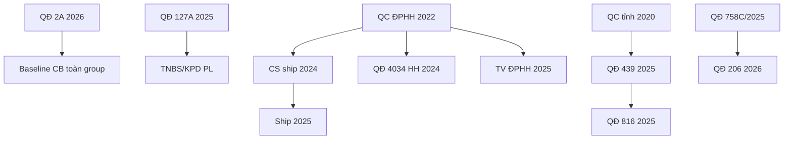

# PO-HRM-PAY-CNTT — Policy Fragment Catalog (Master SoT)

| Meta | Value |
|------|--------|
| **work_item_id** | `PO-HRM-PAY-CNTT-BA-POLICY-DECOMPOSE-01` |
| **parent** | `PO-HRM-PAY-XEVN-CUSTOMER-CNTT-INTAKE-01` |
| **method** | `PO-HRM-PAY-CNTT-POLICY-READ-METHOD.md` |
| **date** | 2026-08-11 |
| **pdf_count** | 30/30 (EasyOCR scanned pack) |
| **fragment_count** | 63 |
| **honesty** | `payroll_e2e_ready=false` · governance catalog ≠ UAT |

## 1. CHUNG vs RIÊNG (phân định mô hình)

| Mã mô hình | Scope | PDF pack | Ghi chú |
| --- | --- | --- | --- |
| **CHUNG** | CHUNG | 2 | QĐ 2A thang/bảng lương · QĐ 127A TNBS/KPD |
| **ĐPHH** | RIÊNG-ĐPHH | 7 | KPI+DT+ship; override thang local |
| **TĐHK** | RIÊNG-TĐHK | 3 | KPI 1500/1731 · cuộc/HĐ/TG/Top |
| **TG** | (không PDF riêng) | 0 | Dùng CHUNG + mẫu VP Hà Nội xlsx |
| **LX-T** | RIÊNG-LX-T | 13 | QC theo tỉnh + QĐ 439/816/837… |
| **LX-TR** | RIÊNG-LX-TR | 2 | QĐ 206 + khoán NL |
| **VP-T** | RIÊNG-VP-T | 3 | QC chấm công+quỹ CN (ND/NB/TB) |

## 2. Chuỗi thay thế (supersedes)

## 3. Document inventory (30 PDF)

| doc_id | scope | effective_from | supersedes | pages | ocr_chars |
| --- | --- | --- | --- | --- | --- |
| POL-CHUNG-20260102-2A | CHUNG | 01/01/2026 | — | 3 | 4217 |
| POL-CHUNG-20250601-127A | CHUNG | 01/06/2025 | PL QĐ 17/2025 | 5 | 7532 |
| POL-DPHH-20220401-001 | RIÊNG-ĐPHH | 01/04/2022 | — | 5 | 6695 |
| POL-DPHH-20240422-044 | RIÊNG-ĐPHH | 22/04/2024 | CS ship cũ | 3 | 4099 |
| POL-DPHH-20240710-DX | RIÊNG-ĐPHH | 01/07/2024 | — | 1 | 1006 |
| POL-DPHH-20241003-4034 | RIÊNG-ĐPHH | 01/10/2024 | QC ĐPHH §DT | 2 | 1816 |
| POL-DPHH-20250218-TV | RIÊNG-ĐPHH | 01/12/2024 | FRG-DPHH-TV-01 | 1 | 1000 |
| POL-DPHH-20250404-TDN | RIÊNG-ĐPHH | 04/04/2025 | — | 1 | 1145 |
| POL-DPHH-20250822-SHIP | RIÊNG-ĐPHH | 22/08/2025 | FRG-DPHH-SHIP-01 | 1 | 835 |
| POL-TDHK-20240619-1500 | RIÊNG-TĐHK | 01/07/2024 | — | 5 | 7064 |
| POL-TDHK-20250918-TV | RIÊNG-TĐHK | 01/09/2025 | — | 1 | 1238 |
| POL-TDHK-20251128-752 | RIÊNG-TĐHK | 28/11/2025 | — | 1 | 960 |
| POL-LXT-20200901-ND | RIÊNG-LX-T | 01/09/2020 | — | 6 | 8615 |
| POL-LXT-20200901-NB | RIÊNG-LX-T | 01/09/2020 | — | 6 | 8663 |
| POL-LXT-20200901-TB | RIÊNG-LX-T | 01/10/2020 | — | 6 | 8686 |
| POL-LXT-20230828-HD | RIÊNG-LX-T | 28/08/2023 | FRG-LXT-HD-01 | 1 | 1222 |
| POL-LXT-20231001-PT | RIÊNG-LX-T | 01/10/2023 | QC tỉnh cũ | 6 | 9370 |
| POL-LXT-20250905-VTP | RIÊNG-LX-T | 01/07/2025 | — | 1 | 1331 |
| POL-LXT-20251029-439 | RIÊNG-LX-T | 01/09/2025 | QĐ 1023/2024 | 2 | 2017 |
| POL-LXT-20251128-753 | RIÊNG-LX-T | 28/11/2025 | — | 1 | 965 |
| POL-LXT-20251213-816 | RIÊNG-LX-T | 13/12/2025 | — | 2 | 1790 |
| POL-LXT-20251223-837 | RIÊNG-LX-T | 23/12/2025 | — | 1 | 1041 |
| POL-LXT-20251230-NB | RIÊNG-LX-T | 30/12/2025 | — | 1 | 1468 |
| POL-LXT-20260326-169 | RIÊNG-LX-T | 01/04/2026 | — | 1 | 1049 |
| POL-LXT-DX-YB | RIÊNG-LX-T | — | — | 1 | 1306 |
| POL-LXTR-20260401-206 | RIÊNG-LX-TR | 01/04/2026 | QĐ 758C/2025 | 8 | 17543 |
| POL-LXTR-20260401-NL | RIÊNG-LX-TR | 01/04/2026 | — | 2 | — |
| POL-VPT-20201001-ND | RIÊNG-VP-T | 01/10/2020 | — | 7 | 11420 |
| POL-VPT-20201001-NB | RIÊNG-VP-T | 01/10/2020 | — | 7 | 11402 |
| POL-VPT-20201001-TB | RIÊNG-VP-T | 01/10/2020 | — | 7 | 11377 |

## 4. Master fragment catalog

| fragment_id | doc_id | scope | effective_from | fragment_type | rule_text_vi | parameters | inputs_required | outputs | system_home | amis_neo | xevn_today | overrides | extends |
| --- | --- | --- | --- | --- | --- | --- | --- | --- | --- | --- | --- | --- | --- |
| FRG-CHUNG-2A-01 | POL-CHUNG-20260102-2A | CHUNG | 01/01/2026 | THANG_LUONG | Ban hành hệ thống thang lương, bảng lương toàn Công ty; mức LTT vùng 5.310.000đ/tháng | LTT=5_310_000 VND/tháng; hiệu lực 01/01/2026 | job_grade_key · job_title_key · bậc III–IX | Lương cơ bản (P1) · thang bậc theo chức danh | settings_catalog · policy_rule | 1 Thiết lập | MISSING | — | — |
| FRG-CHUNG-2A-02 | POL-CHUNG-20260102-2A | CHUNG | 01/01/2026 | THANG_LUONG | Bảng lương Lãnh đạo (D1–D3): CEO 11.1M–21.4M theo bậc | D1 Chairman 13.1M–26M; D2 CEO; D3 CFO/CCO/COO… | chức danh · bậc lương | Mức lương CB leadership | settings_catalog | 1 | MISSING | — | — |
| FRG-CHUNG-2A-03 | POL-CHUNG-20260102-2A | CHUNG | 01/01/2026 | THANG_LUONG | Bảng lương quản lý M1–M2 và L1–L2 (Trưởng phòng → Trưởng BP) | M1 8.3M–17.1M; L1 6.4M–11.7M (bậc III–VIII) | chức danh · bậc | Lương CB quản lý | settings_catalog | 1 | MISSING | — | — |
| FRG-CHUNG-2A-04 | POL-CHUNG-20260102-2A | CHUNG | 01/01/2026 | THANG_LUONG | Bảng lương NV E1–E2: NV nghiệp vụ 5.7M–9.4M; thừa hành từ 5.31M | E1/E2 theo bậc III–IX | chức danh · bậc | Lương CB nhân viên | settings_catalog | 1 | MISSING | — | — |
| FRG-CHUNG-127A-01 | POL-CHUNG-20250601-127A | CHUNG | 01/06/2025 | PHU_CAP | Phụ lục 01 — Định mức thu nhập bổ sung (TNBS) theo chức danh Mức 1/2 | VD: GĐ Mức1 TNBS=30.05M (xăng 1.5M, đi lại 4M, nhà ở 10.5M…) | job_title_key · mức 1|2 | TNBS (P2) · các khoản PC trong TNBS | policy_rule · salary_component | 1–2 | MISSING | — | QĐ 17/2025 |
| FRG-CHUNG-127A-02 | POL-CHUNG-20250601-127A | CHUNG | 01/06/2025 | THUONG | Phụ lục 02 — Thưởng hiệu quả công việc (KPD/KPI) | Theo PL02 đính kèm (OCR partial) | KPI điểm · chức danh | Thưởng HQCV (P3/P4) | policy_rule | 2 | MISSING | — | QĐ 17/2025 |
| FRG-DPHH-BASE-01 | POL-DPHH-20220401-001 | RIÊNG-ĐPHH | 01/04/2022 | KHAC | Tổng lương ĐPHH = KPI + Doanh thu + Thưởng + PC + OT − giảm trừ | — | BCC · DT hàng gửi/nhận · KPI | Tổng thu nhập ĐPHH | policy_rule | 4–5 | MISSING | CHUNG thang (local scale ĐPHH) | — |
| FRG-DPHH-KPI-01 | POL-DPHH-20220401-001 | RIÊNG-ĐPHH | 01/04/2022 | KPI | Lương KPI = KPI × Quỹ KPI khu vực / Ncc | HN Quỹ KPI=4_000_000; Tỉnh=3_000_000 VND | KPI điểm · Ncc · khu vực VP | Lương KPI | policy_rule | 4 | MISSING | — | — |
| FRG-DPHH-DT-HG-01 | POL-DPHH-20220401-001 | RIÊNG-ĐPHH | 01/04/2022 | DOANH_THU | Lương DT hàng gửi: %HH bậc thang DT + Đơn giá DTHG × T | DT<150M:6%; 150–250M:7%; >250M:8% | DTHG · T giờ công NV · T tổng VP | Lương doanh thu hàng gửi | policy_rule | 4 | MISSING | FRG-DPHH-DT-HG-02 (2024.10) | — |
| FRG-DPHH-DT-HN-01 | POL-DPHH-20220401-001 | RIÊNG-ĐPHH | 01/04/2022 | DOANH_THU | Lương DT hàng nhận: 1% × Đơn giá DTHN × T | 1% trên DTHN (bản gốc) | DTHN · giờ công | Lương DT hàng nhận | policy_rule | 4 | MISSING | FRG-DPHH-DT-HN-02 | — |
| FRG-DPHH-THUONG-DT-01 | POL-DPHH-20220401-001 | RIÊNG-ĐPHH | 01/04/2022 | THUONG | Thưởng vượt mốc DTHG: vượt 15% mốc VP → thưởng 20% phần chênh (lặp mốc) | Mốc VP theo bảng (80M–265M tùy VP) | DTHG VP · mốc thưởng | Thưởng doanh thu | policy_rule | 4 | MISSING | — | — |
| FRG-DPHH-THANG-01 | POL-DPHH-20220401-001 | RIÊNG-ĐPHH | 01/04/2022 | THANG_LUONG | Thang bậc ĐPHH local (hệ số 1.00–2.35; mức 4.8M–11.28M triệu) | 10 bậc · hệ số | bậc ĐPHH | Lương cơ bản ĐPHH | template_override | 1 | MISSING | FRG-CHUNG-2A-04 (local) | — |
| FRG-DPHH-TV-01 | POL-DPHH-20220401-001 | RIÊNG-ĐPHH | 01/04/2022 | THU_VIEC | Thử việc tính như CT, hưởng 85% tổng thu nhập (bản QC 2022) | TV=85% | flag thử việc | Hệ số TV | policy_rule | 1 | MISSING | FRG-DPHH-TV-02 | — |
| FRG-DPHH-SHIP-01 | POL-DPHH-20240422-044 | RIÊNG-ĐPHH | 22/04/2024 | THUONG | Thưởng DT giao hàng = Thưởng giao hàng + Thưởng nỗ lực − giảm trừ | Tỷ lệ thưởng giao hàng ~25% DT thực | DT ship · DT bưu cục | PL Hưởng doanh thu | policy_rule | 4 | MISSING | — | — |
| FRG-DPHH-SHIP-02 | POL-DPHH-20240422-044 | RIÊNG-ĐPHH | 22/04/2024 | THUONG | Thưởng nỗ lực team theo DT bưu cục (4M–16M) | DT BC <25M:4M … ≥100M:16M | DT bưu cục · DT cá nhân | Thưởng nỗ lực | policy_rule | 4 | MISSING | — | — |
| FRG-DPHH-SHIP-03 | POL-DPHH-20240710-DX | RIÊNG-ĐPHH | 01/07/2024 | DOANH_THU | VP tỉnh NB/ND/TB: ship giao-nhận 50% tổng cước, không tính DT/thưởng khác | 50% cước ship | cước ship · VP (NB,ND,TB) | Hưởng ship VP tỉnh | policy_rule | 4 | MISSING | FRG-DPHH-SHIP-01 | — |
| FRG-DPHH-DT-HG-02 | POL-DPHH-20241003-4034 | RIÊNG-ĐPHH | 01/10/2024 | DOANH_THU | Điều chỉnh % hoa hồng hàng gửi | <150M:7%; 150–<200:7.5%; 200–<300:8.5%; ≥300:9.5%; >300 tier:10.5% | DTHG | % hưởng HG | policy_rule | 4 | MISSING | FRG-DPHH-DT-HG-01 | — |
| FRG-DPHH-DT-HN-02 | POL-DPHH-20241003-4034 | RIÊNG-ĐPHH | 01/10/2024 | DOANH_THU | Điều chỉnh % hoa hồng hàng nhận | <300M:2%; ≥300M:3% | DTHN | % hưởng HN | policy_rule | 4 | MISSING | FRG-DPHH-DT-HN-01 | — |
| FRG-DPHH-TV-02 | POL-DPHH-20250218-TV | RIÊNG-ĐPHH | 01/12/2024 | THU_VIEC | TV ĐPHH: không lương cứng; hưởng 85% chính sách Lương Doanh thu | TV=85% DT policy | flag TV | Lương TV ĐPHH | policy_rule | 4 | MISSING | FRG-DPHH-TV-01 | — |
| FRG-DPHH-VP-TDN-01 | POL-DPHH-20250404-TDN | RIÊNG-ĐPHH | 04/04/2025 | KHAC | Điều chỉnh thời gian làm việc và mức lương VP Trần Đại Nghĩa | (OCR: điều chỉnh VP cụ thể) | VP TDN · giờ làm | Lương/PC VP TDN | template_override | 1 | MISSING | — | — |
| FRG-DPHH-SHIP-04 | POL-DPHH-20250822-SHIP | RIÊNG-ĐPHH | 22/08/2025 | DOANH_THU | Điều chỉnh cách tính lương ship điều phối | (chi tiết phụ lục OCR) | DT ship | Lương ship | policy_rule | 4 | MISSING | FRG-DPHH-SHIP-01 | — |
| FRG-TDHK-BASE-01 | POL-TDHK-20240619-1500 | RIÊNG-TĐHK | 01/07/2024 | KHAC | Tổng lương TĐ = Cuộc nghe + HĐ + TG + Top + Hạn chế nhỡ + Phép + PC | — | KPI 1500/1731 · BCC · PCCV | Tổng thu nhập TĐ | policy_rule | 4–5 | MISSING | — | — |
| FRG-TDHK-CUOC-01 | POL-TDHK-20240619-1500 | RIÊNG-TĐHK | 01/07/2024 | KPI | Lương cuộc nghe = Đơn giá/cuộc × Số cuộc | Quỹ CS / tổng cuộc; LCB=5_000_000; nghỉ 4 ngày/tháng | số cuộc nghe · BCC | Lương cuộc nghe | policy_rule | 4 | MISSING | — | — |
| FRG-TDHK-HD-01 | POL-TDHK-20240619-1500 | RIÊNG-TĐHK | 01/07/2024 | DOANH_THU | Lương HĐ = Số HĐ × Đơn giá HĐ | Ca sáng thưởng HĐ=600k; ca chiều=800k; <50% công→50% thưởng | số HĐ · ca | Lương hợp đồng | policy_rule | 4 | MISSING | — | — |
| FRG-TDHK-TG-01 | POL-TDHK-20240619-1500 | RIÊNG-TĐHK | 01/07/2024 | KPI | Lương thời gian = Giờ TT × Đơn giá TG | Ca sáng 700k; ca chiều 1.5M/tháng | BCC giờ | Lương thời gian | policy_rule | 4 | MISSING | — | — |
| FRG-TDHK-TOP-01 | POL-TDHK-20240619-1500 | RIÊNG-TĐHK | 01/07/2024 | THUONG | Thưởng Top theo CLDV và số cuộc | CLDV≥9.5→105%; 9–<9.5→100%; <9 không xét; Top 1M/500k | điểm CLDV · cuộc nghe | Thưởng Top | policy_rule | 4 | MISSING | — | — |
| FRG-TDHK-MISS-01 | POL-TDHK-20240619-1500 | RIÊNG-TĐHK | 01/07/2024 | THUONG | Thưởng hạn chế gọi nhỡ | Quỹ 500k/tháng; hệ số theo % nhỡ (≤2%→1.1 … >8%→0) | tỷ lệ gọi nhỡ | Thưởng hạn chế nhỡ | policy_rule | 4 | MISSING | — | — |
| FRG-TDHK-TV-01 | POL-TDHK-20250918-TV | RIÊNG-TĐHK | 01/09/2025 | THU_VIEC | Mức lương TV tổng đài: ca sáng 6M; ca chiều 6.8M (từ 5.5M) | TV sáng=6_000_000; TV chiều=6_800_000 | ca làm · flag TV | Lương TV TĐ | policy_rule | 1 | MISSING | CHUNG TV default | — |
| FRG-TDHK-PC-01 | POL-TDHK-20251128-752 | RIÊNG-TĐHK | 28/11/2025 | PHU_CAP | QĐ 752 — chi phụ cấp nhân viên tổng đài hành khách | (OCR: PC cụ thể theo PL) | vị trí TĐ | Phụ cấp TĐ | policy_rule | 2 | MISSING | — | — |
| FRG-LXT-BASE-01 | POL-LXT-20200901-ND | RIÊNG-LX-T | 01/09/2020 | KHAC | Tổng lương LX tuyến = Lượt + CLDV + CPN + Khăn nước + HĐ − giảm trừ | — | BCC · lượt · DT · CLDV · CPSC | Tổng lương LX | policy_rule | 4–5 | MISSING | — | — |
| FRG-LXT-LUOT-01 | POL-LXT-20200901-ND | RIÊNG-LX-T | 01/09/2020 | DOANH_THU | Lương lượt = Số lượt × Đơn giá (bậc 1–100:45k; >100:55k Nam Định mẫu) | 45_000/55_000 VND/lượt (ND 2020) | số lượt · tỉnh | Lương lượt | policy_rule | 4 | MISSING | FRG-LXT-QD439-* | — |
| FRG-LXT-DT-01 | POL-LXT-20200901-ND | RIÊNG-LX-T | 01/09/2020 | DOANH_THU | Quỹ lương DT: ≤100M×4%; >100M×8% (cá nhân, trừ HĐ tour) | Bậc 100M · 4%/8% | DT cá nhân | Quỹ DT → CLDV | policy_rule | 4 | MISSING | — | — |
| FRG-LXT-CLDV-01 | POL-LXT-20200901-ND | RIÊNG-LX-T | 01/09/2020 | KPI | Lương CLDV = Quỹ DT × hệ số C (9.0–10 điểm) | 9.0–9.4:100%; 9.5–9.9:105%; ≥10:110% | điểm CLDV | Lương CLDV | policy_rule | 4 | MISSING | — | — |
| FRG-LXT-CPN-01 | POL-LXT-20200901-ND | RIÊNG-LX-T | 01/09/2020 | DOANH_THU | Lương CPN = 10% DT CPN cá nhân | 10% DT CPN | DT CPN | Lương CPN | policy_rule | 4 | MISSING | — | — |
| FRG-LXT-HD-01 | POL-LXT-20200901-ND | RIÊNG-LX-T | 01/09/2020 | DOANH_THU | Lương HĐ khác tỉnh / ngoại giao / Nội Bài | 400–600k/ngày +4% DT; NB 100–200k/lượt | loại HĐ · ngày · lượt | Lương hợp đồng | policy_rule | 4 | MISSING | FRG-LXT-HD-02 | — |
| FRG-LXT-GT-01 | POL-LXT-20200901-ND | RIÊNG-LX-T | 01/09/2020 | KHOAN | Giảm trừ chung sửa chữa BD (GTC) chia tổ | GTC1= A/B×10% (Ford 5%; khác 10%) | chi phí SC · số lái tổ | Khấu trừ GTC | policy_rule | 5 | MISSING | — | — |
| FRG-LXT-LUOT-NB | POL-LXT-20200901-NB | RIÊNG-LX-T | 01/09/2020 | DOANH_THU | Quy chế Ninh Bình — đơn giá lượt (tương tự ND, khác biên) | Bậc lượt theo QC tỉnh | lượt · tỉnh=NB | Lương lượt | template_override | 4 | MISSING | FRG-LXT-LUOT-01 | — |
| FRG-LXT-LUOT-TB | POL-LXT-20200901-TB | RIÊNG-LX-T | 01/10/2020 | DOANH_THU | Quy chế Thái Bình — đơn giá lượt | QC Thái Bình | lượt · tỉnh=TB | Lương lượt | template_override | 4 | MISSING | FRG-LXT-LUOT-01 | — |
| FRG-LXT-LUOT-PT | POL-LXT-20231001-PT | RIÊNG-LX-T | 01/10/2023 | DOANH_THU | Quy chế lương tuyến Tỉnh Phú Thọ (ban hành 01.10.2023) | QC Phú Thọ 6 trang | lượt · tỉnh=PT | Lương lượt/CLDV… | template_override | 4 | MISSING | FRG-LXT-LUOT-01 | — |
| FRG-LXT-HD-02 | POL-LXT-20230828-HD | RIÊNG-LX-T | 28/08/2023 | DOANH_THU | QĐ điều chỉnh lương HĐ khác tỉnh & ngoại giao | (PL QĐ 280823) | loại HĐ | Lương HĐ | policy_rule | 4 | MISSING | FRG-LXT-HD-01 | — |
| FRG-LXT-LUOT-VTP | POL-LXT-20250905-VTP | RIÊNG-LX-T | 01/07/2025 | DOANH_THU | Đề xuất đơn giá lượt Việt Trì, Phú Thọ | Từ 01/07/2025 | lượt · VT/PT | Đơn giá lượt | policy_rule | 4 | MISSING | FRG-LXT-LUOT-PT | — |
| FRG-LXT-QD439-LUOT | POL-LXT-20251029-439 | RIÊNG-LX-T | 01/09/2025 | DOANH_THU | QĐ 439 — điều chỉnh đơn giá lượt theo tuyến/tỉnh | VD ND≤100:65k; >100:70k; NB 55/65k; TB 70/75k; VT/BC 65/75k; PT 70/80k; YB 95/11 | lượt · tuyến · tỉnh | Lương lượt | policy_rule | 4 | MISSING | FRG-LXT-LUOT-* | — |
| FRG-LXT-QD439-ANCA | POL-LXT-20251029-439 | RIÊNG-LX-T | 01/09/2025 | PHU_CAP | Tiền ăn ca Chủ nhật | ND/TB/NB 22k; VT/PT/YB 25k/ngày | CN làm việc · chi nhánh | Tiền ăn ca CN | policy_rule | 4 | MISSING | — | — |
| FRG-LXT-PC-753 | POL-LXT-20251128-753 | RIÊNG-LX-T | 28/11/2025 | PHU_CAP | QĐ 753 — chi phụ cấp hỗ trợ NV lái xe tuyến | (PL OCR) | vị trí LX | Phụ cấp LX | policy_rule | 2 | MISSING | — | — |
| FRG-LXT-816 | POL-LXT-20251213-816 | RIÊNG-LX-T | 13/12/2025 | KHAC | QĐ 816 — điều chỉnh CS lương LX tuyến VTHK | (PL 2 trang) | — | Điều chỉnh cơ chế | policy_rule | 1 | MISSING | partial FRG-LXT-* | — |
| FRG-LXT-NB-837 | POL-LXT-20251223-837 | RIÊNG-LX-T | 23/12/2025 | DOANH_THU | QĐ 837 — cách tính lương lượt tuyến Nội Bài | 100–200k/lượt + 4% DT | lượt NB | Lương lượt NB | policy_rule | 4 | MISSING | FRG-LXT-HD-02 | — |
| FRG-LXT-DCNB | POL-LXT-20251230-NB | RIÊNG-LX-T | 30/12/2025 | KHAC | LX điều chuyển sang Ninh Bình — chính sách lương riêng | (OCR) | điều chuyển · tỉnh đích | Mẫu lương NB | template_override | 3 | MISSING | — | — |
| FRG-LXT-CC-169 | POL-LXT-20260326-169 | RIÊNG-LX-T | 01/04/2026 | CHUYEN_CAN | Thưởng chuyên cần LX: ≥24 ngày công, không nghỉ T6–CN | 1_000_000 VND/người/tháng; đến 31/05/2026 | BCC ngày · nghỉ T6–CN | Thưởng chuyên cần | policy_rule | 4 | MISSING | — | — |
| FRG-LXT-YB-DX | POL-LXT-DX-YB | RIÊNG-LX-T | — | KHAC | Đề xuất chuyển đổi hình thức trả lương Tăng cường Yên Bái dài ngày | (đề xuất — chưa QĐ) | lượt TC YB | Cơ chế trả lương YB | MANUAL | — | MISSING | — | — |
| FRG-LXTR-BASE-01 | POL-LXTR-20260401-206 | RIÊNG-LX-TR | 01/04/2026 | KHAC | TTN LX tải = Lương cứng + Lương QLPT + Thưởng DT + PC đặc thù + KPI(CPN) − GT | — | DT · BCC · tải trọng xe · XDTN | Tổng thu nhập LX tải | policy_rule | 4–5 | MISSING | — | — |
| FRG-LXTR-CUNG-01 | POL-LXTR-20260401-206 | RIÊNG-LX-TR | 01/04/2026 | HE_SO | Lương cứng theo vị trí & tải trọng xe (PL1) | Theo PL1 QĐ 206 | loại xe · ngày công | Lương cứng | policy_rule | 2 | MISSING | — | — |
| FRG-LXTR-QLPT-01 | POL-LXTR-20260401-206 | RIÊNG-LX-TR | 01/04/2026 | PHU_CAP | Lương trách nhiệm QLPT | PL1+PL2 giảm trừ QLPT | ngày QL xe | Lương QLPT | policy_rule | 2 | MISSING | — | — |
| FRG-LXTR-DT-01 | POL-LXTR-20260401-206 | RIÊNG-LX-TR | 01/04/2026 | THUONG | Thưởng doanh thu theo DT thực & bậc (6.3) | Mức DT hỗ trợ vs mục tiêu; tỷ lệ thưởng bảng | DT tháng · loại xe | Thưởng DT | policy_rule | 4 | MISSING | — | — |
| FRG-LXTR-KPI-01 | POL-LXTR-20260401-206 | RIÊNG-LX-TR | 01/04/2026 | KPI | Lương KPI — chỉ lái tải trung chuyển CPN | Đánh giá HTCV tháng | KPI CPN | Lương KPI | policy_rule | 4 | MISSING | — | — |
| FRG-LXTR-TV-01 | POL-LXTR-20260401-206 | RIÊNG-LX-TR | 01/04/2026 | THU_VIEC | TV LX tải: 85% lương cứng + QLPT; các khoản khác như CT | TV=85% cứng+QLPT | flag TV | Hệ số TV | policy_rule | 1 | MISSING | — | — |
| FRG-LXTR-PC-01 | POL-LXTR-20260401-206 | RIÊNG-LX-TR | 01/04/2026 | PHU_CAP | PC giao hàng phân phối & PC khác (XDTN, đi đường) | Theo phát sinh | DT phân phối · km | PC đặc thù | policy_rule | 4 | MISSING | — | — |
| FRG-LXTR-NL-01 | POL-LXTR-20260401-NL | RIÊNG-LX-TR | 01/04/2026 | KHOAN | Thông báo thay đổi mức khoán nhiên liệu theo dòng xe | (bảng NL 2 trang OCR) | dòng xe · km | Khoán NL | policy_rule | 4 | MISSING | — | — |
| FRG-VPT-BASE-01 | POL-VPT-20201001-ND | RIÊNG-VP-T | 01/10/2020 | KHAC | Quỹ lương CN = (A) NV + (B) tổng + (C) chi phí − (D) TV | A=phân bổ quỹ; B=7k/khách+500k/xe; C=CP VP | số khách · số xe · CP · BCC | Quỹ lương VP | policy_rule | 4–5 | MISSING | — | — |
| FRG-VPT-HS-01 | POL-VPT-20201001-ND | RIÊNG-VP-T | 01/10/2020 | HE_SO | Hệ số lương theo chức vụ CN (TCN=20 … KT=12) | TCN 20; ĐH 17; LXTC 16; KT 12 | chức vụ · giờ công | Hệ số hưởng | policy_rule | 4 | MISSING | — | — |
| FRG-VPT-CONG-01 | POL-VPT-20201001-ND | RIÊNG-VP-T | 01/10/2020 | KHAC | Giờ công TT 220–290h/tháng; quy đổi hệ số → đơn giá → tổng lương | HSQĐ = tổng HS / tổng giờ; TL = HS hưởng × đơn giá | BCC máy · giờ OT | Lương VP | policy_rule | 4 | MISSING | — | — |
| FRG-VPT-TV-01 | POL-VPT-20201001-ND | RIÊNG-VP-T | 01/10/2020 | THU_VIEC | TV VP: lương cứng/ngày × ngày TT | TCN 10M; ĐH 8M; LXTC 8M; KT 5.5M/tháng chuẩn | flag TV · ngày công | Lương TV | policy_rule | 1 | MISSING | — | — |
| FRG-VPT-NB-01 | POL-VPT-20201001-NB | RIÊNG-VP-T | 01/10/2020 | KHAC | Quy chế VP Ninh Bình — cùng khung QT-XeVN, biên CN NB | Tương tự ND; áp CN Ninh Bình | CN=NB | Lương VP NB | template_override | 4 | MISSING | FRG-VPT-BASE-01 | — |
| FRG-VPT-TB-01 | POL-VPT-20201001-TB | RIÊNG-VP-T | 01/10/2020 | KHAC | Quy chế VP Thái Bình — cùng khung QT-XeVN | CN Thái Bình | CN=TB | Lương VP TB | template_override | 4 | MISSING | FRG-VPT-BASE-01 | — |

## 5. Override vs extend CHUNG

| fragment_id | Quan hệ | CHUNG bị ảnh hưởng | Ghi chú |
| --- | --- | --- | --- |
| FRG-DPHH-THANG-01 | **override** | FRG-CHUNG-2A-04 | Thang bậc ĐPHH local |
| FRG-DPHH-TV-02 | **override** | TV % CHUNG | TV chỉ hưởng 85% DT |
| FRG-DPHH-DT-HG-02 | **override** | FRG-DPHH-DT-HG-01 | QĐ 4034 |
| FRG-LXT-QD439-LUOT | **override** | FRG-LXT-LUOT-* | Đơn giá lượt tập trung |
| FRG-TDHK-* | **extend** | CHUNG P1–P4 | Thêm cuộc/HĐ/Top |
| FRG-LXT-* | **extend** | CHUNG | Lượt/CLDV/CPSC — không thay thang |
| FRG-VPT-BASE-01 | **extend** | CHUNG | Quỹ CN — khác công thức TG |
| FRG-LXTR-* | **extend** | CHUNG | DT-driven; không OT/phép Tết |

## 6. Gợi ý map cột XLSX → fragment_id (handoff ba-data)

### RIÊNG-ĐPHH

- `Phiếu lương ĐP` → `FRG-DPHH-BASE-01` (ba-data xác nhận cột chính xác)
- `PL Hưởng doanh thu` → `FRG-DPHH-BASE-01` (ba-data xác nhận cột chính xác)
- `DLL CPN` → `FRG-DPHH-BASE-01` (ba-data xác nhận cột chính xác)

### RIÊNG-TĐHK

- `Lương thời gian` → `FRG-TDHK-BASE-01` (ba-data xác nhận cột chính xác)
- `Lương KPI` → `FRG-TDHK-BASE-01` (ba-data xác nhận cột chính xác)
- `Điểm KPI` → `FRG-TDHK-BASE-01` (ba-data xác nhận cột chính xác)
- `P1+P2` → `FRG-TDHK-BASE-01` (ba-data xác nhận cột chính xác)
- `P3` → `FRG-TDHK-BASE-01` (ba-data xác nhận cột chính xác)
- `P4` → `FRG-TDHK-BASE-01` (ba-data xác nhận cột chính xác)
- `OT 150%` → `FRG-TDHK-BASE-01` (ba-data xác nhận cột chính xác)
- `OT 200%` → `FRG-TDHK-BASE-01` (ba-data xác nhận cột chính xác)

### RIÊNG-LX-T

- `Lương lượt` → `FRG-LXT-BASE-01` (ba-data xác nhận cột chính xác)
- `Lương CLDV` → `FRG-LXT-BASE-01` (ba-data xác nhận cột chính xác)
- `CPSC` → `FRG-LXT-BASE-01` (ba-data xác nhận cột chính xác)
- `Lương hợp đồng` → `FRG-LXT-BASE-01` (ba-data xác nhận cột chính xác)
- `Chuyển phát nhanh` → `FRG-LXT-BASE-01` (ba-data xác nhận cột chính xác)
- `Đơn giá lượt` → `FRG-LXT-BASE-01` (ba-data xác nhận cột chính xác)

### RIÊNG-LX-TR

- `Lương cứng` → `FRG-LXTR-BASE-01` (ba-data xác nhận cột chính xác)
- `QLPT` → `FRG-LXTR-BASE-01` (ba-data xác nhận cột chính xác)
- `Doanh thu` → `FRG-LXTR-BASE-01` (ba-data xác nhận cột chính xác)
- `Phụ cấp XDTN` → `FRG-LXTR-BASE-01` (ba-data xác nhận cột chính xác)
- `Phụ cấp đi đường` → `FRG-LXTR-BASE-01` (ba-data xác nhận cột chính xác)
- `Tạm ứng` → `FRG-LXTR-BASE-01` (ba-data xác nhận cột chính xác)

### RIÊNG-VP-T

- `Lương VP` → `FRG-VPT-BASE-01` (ba-data xác nhận cột chính xác)
- `Quỹ lương VP` → `FRG-VPT-BASE-01` (ba-data xác nhận cột chính xác)
- `Trợ lương` → `FRG-VPT-BASE-01` (ba-data xác nhận cột chính xác)
- `Chi phí VP` → `FRG-VPT-BASE-01` (ba-data xác nhận cột chính xác)

### CHUNG

- `Mức lương CB (P1)` → `FRG-CHUNG-2A-01` (ba-data xác nhận cột chính xác)
- `TNBS (P2)` → `FRG-CHUNG-2A-01` (ba-data xác nhận cột chính xác)
- `Lương KPI (P3)` → `FRG-CHUNG-2A-01` (ba-data xác nhận cột chính xác)
- `P4` → `FRG-CHUNG-2A-01` (ba-data xác nhận cột chính xác)
- `BHXH` → `FRG-CHUNG-2A-01` (ba-data xác nhận cột chính xác)
- `Thuế TNCN` → `FRG-CHUNG-2A-01` (ba-data xác nhận cột chính xác)

## 7. Rủi ro / residual

| # | Rủi ro | Owner |
|---|--------|-------|
| R1 | PDF scan — OCR lỗi ký tự số (%/VND) | ba-data verify vs PDF gốc |
| R2 | TG không có PDF — chỉ xlsx VP HN | ba-process: inherit CHUNG |
| R3 | 6 tỉnh VP xlsx nhưng 3 PDF QC — gap PT/VT/YB | SA multi-template |
| R4 | Product chưa policy_pack metadata | SA `PO-HRM-PAY-CNTT-SA-01` |

**ack_status:** PASS_TO_PM