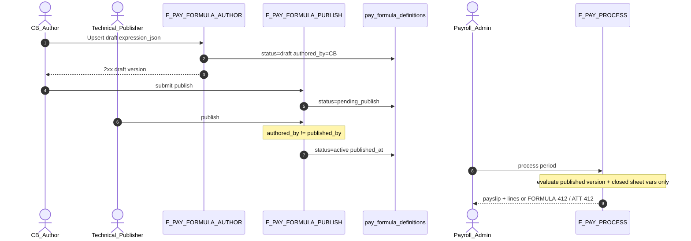

# PO-HRM-PAYROLL-FORMULA-RUN-GAP-API-01 — API_DESIGN F.1 · F-PAY-FORMULA-*

| Field | Value |
|-------|--------|
| **work_item_id** | `PO-HRM-PAYROLL-FORMULA-RUN-GAP-API-01` |
| **Parent** | `PO-HRM-PAYROLL-FORMULA-AND-RUN-GAP-01` |
| **prior** | `PO-HRM-PAYROLL-FORMULA-RUN-GAP-DATA-01` **PASS_TO_PM** · `…-SA-01` unlock checklist |
| **lane** | governance · sa |
| **change_mode** | **ADD** F-PAY-FORMULA-AUTHOR/PUBLISH/LIST/PREVIEW · **EXPAND** F-PAY-PROCESS-01 bind note · **DOC-DELTA** client API HOLD→CONFIRMED · **NO CODE** `apps/**` |
| **Date** | 2026-08-07 |
| **Status** | **CONFIRMED** — DATA-01 ADD-plan columns · Q-PAY-FORMULA Option **A** ANSWERED · residual = **product fidelity only** |
| **ref_data** | Evidence `po-hrm-payroll-formula-run-gap-data-01.md` §2.1 dual-control columns · G-PAY-F-01..09 |
| **ref_sa** | `po-hrm-payroll-formula-run-gap-sa-01.md` §3.4 unlock bar |
| **ref_ba** | `po-hrm-payroll-formula-run-gap-ba-01.md` **AC-PAY-FORMULA-01..08** |
| **ref_adr** | `ADR-HRM-4-PILLAR-API-BOUNDARY.md` §10 Option A · `DECISION_PACKET_Q_PAY_FORMULA.md` |
| **ref_amis** | `PO_HRM_AMIS_PARITY_RESEARCH_01.md` §3 (Thành phần · Mẫu · precedence) |
| **ref_platform** | `ADR-HRM-DYNAMIC-CONFIG-PLATFORM` Option B — PAY catalog open; FormSchema GĐ1 form; **cấm** GĐ1 DnD |
| **Honesty** | `payroll_e2e_ready=false` · **cấm** invent LIVE engine · **cấm** claim Phase1 DONE |
| **must_keep** | Closed-timesheet vars (Q-PAY-F-3) · dual-control author≠publisher · opaque `expression_json` · soft-delete · scope_parity · U65 · R-PAY-DD-01 Form GĐ1 |
| **ack_status** | **PASS_TO_PM** |

---

## 0. Objective & locks

Lift client `F-PAY-FORMULA-*` **HOLD** by publishing **full F.1** (Mục đích · Nghiệp vụ · Tham chiếu bước SRS · DTO↔DATA columns · lỗi) for author / publish / list-get / optional preview — citing **DATA-01** physical ADD-plan. Unlock **dev-be** `ensureSchema` + CRUD **after** this CONFIRMED. Evaluator depth on process remains staged; **hours-var PREVIEW/PROCESS UAT BLOCKED** until `att_timesheet_line` (G-PAY-F-06).

| Lock | Rule |
|------|------|
| **Option A** | Dual-control metadata engine — **LOCKED / ANSWERED** — **cấm** reopen B/C |
| **R-PAY-DD-01** | GĐ1 = **form** author · GĐ2 = DnD — **cấm** invent GĐ1 DnD as API requirement |
| **Physical table** | Nest ADD-plan **`pay_formula_definitions`** (plural) · paper alias `pay_formula_definition` |
| **Paths** | Nest physical **`/api/hrm/payroll/formulas*`** (align live `@Controller('payroll')`) · paper alias `/api/hrm/pay/formulas*` |
| **Expression** | `expression_json` **opaque** jsonb — **cấm** invent AST taxonomy this seat |
| **Engine SoT** | **FORBIDDEN** treat `salary_components.formula` TEXT as versioned engine (G-PAY-F-07) |
| **Open catalog** | `salary_components` / `pay_types` — starter rows ≠ **CHK IN (N)** / API reject N+1 as closed enum |
| **Soft-delete** | Formula: `archived_at` + `status=retired` — **no** hard-delete of published versions |
| **Scope** | list ↔ get-by-id ↔ mutate = **same** `resolveHrmListScope` / company slug as periods (U19) |
| **Honesty** | Docs ≠ UAT · `payroll_e2e_ready=false` |

**Envelope:** `{ code, message, data }`  
**Auth:** HRM JWT / membership — same payroll peers.

---

## 1. Capability map

| Cap | F-id | METHOD / path (Nest physical) | AC / BR |
|-----|------|-------------------------------|---------|
| Draft upsert | **F-PAY-FORMULA-AUTHOR-01** | `POST /api/hrm/payroll/formulas` · `PUT …/formulas/:id` · `POST …/formulas/:code/versions` (new version from prior) | **AC-PAY-FORMULA-01** · FR-UC-BP-PAY-02 soạn |
| Dual-control publish | **F-PAY-FORMULA-PUBLISH-01** | `POST /api/hrm/payroll/formulas/:id/submit-publish` · `POST …/:id/publish` | **AC-PAY-FORMULA-02/03/05** |
| List / get | **F-PAY-FORMULA-LIST-01** | `GET /api/hrm/payroll/formulas` · `GET …/formulas/:id` | **AC-PAY-FORMULA-01** · scope_parity |
| Preview dry-run | **F-PAY-FORMULA-PREVIEW-01** | `POST /api/hrm/payroll/formulas/:id/preview` *(optional GĐ1)* | **AC-PAY-FORMULA-04** |
| Process bind (EXPAND) | **F-PAY-PROCESS-01** | `POST /api/hrm/payroll/periods/:id/process` *(live path)* | **AC-PAY-RUN-06/07/09** · FORMULA-412 |
| Component catalog (EXISTING) | **F-PAY-COMP-CATALOG-01** | `GET|POST|PATCH /api/hrm/payroll/salary-components` *(live)* | **AC-PAY-FORMULA-07** · open catalog |



---

## 2. AMIS parity — catalog · formula · template precedence

Cite [`PO_HRM_AMIS_PARITY_RESEARCH_01.md`](../../program/PO_HRM_AMIS_PARITY_RESEARCH_01.md) **§3**:

| Layer (AMIS) | XeVN GĐ1 API | Role |
|--------------|--------------|------|
| **Thành phần lương** | `salary_components` (+ `pay_types`) via **F-PAY-COMP-CATALOG-01** | Open catalog — picker codes; flags TNCN/BH/ngày công |
| **Công thức** | **`pay_formula_definitions`** via F-PAY-FORMULA-* | Versioned dual-control engine SoT (`expression_json`) |
| **Mẫu bảng lương** | `salary_templates` / future `pay_sheet_template` | Pack columns + **optional formula override** — **GĐ1.5** after AMIS parity SA if template-override layer added |
| **Lập bảng** | Period process **F-PAY-PROCESS-01** | Evaluate **bound published** formula — not draft |

**Evaluate / resolve precedence (target — align AMIS):**

```text
1) Period/payslip bound formula_definition_id (published active version) — GĐ1 must
2) Period input / C&B history variables (read-only bags) — not alternate formulas
3) Template formula override (when template layer ships — prefer wait AMIS parity SA)
4) Component catalog default formula TEXT — DEPRECATED as engine SoT; may seed form defaults only
```

**GĐ1 this API:** layers **1 + catalog picker + C&B/ATT vars**. Template override HTTP **out of this seat** — pointer residual **R-PAY-AMIS-TPL**.

---

## 3. State machine · immutability · soft-delete

| `status` | Meaning | Mutate `expression_json`? |
|----------|---------|---------------------------|
| `draft` | C&B authoring | **YES** (author only) |
| `pending_publish` | Awaiting technical publish | **NO** (withdraw → draft to edit) |
| `active` | Published / bindable | **NO** — new `version` only |
| `retired` | Superseded or archived | **NO** |

| Rule | Behavior |
|------|----------|
| **UQ** | `(company_id, code, version)` — DATA §2.1 |
| **One active bindable** | At most one `status=active` per `(company_id, code)` with overlapping `effective_from`/`effective_to` (app assert on publish) |
| **Immutability after publish** | `active`/`retired`: reject PATCH body on `expression_json` / `required_vars_json` → **`HRM-PAY-FORMULA-409-IMMUTABLE`** |
| **New version** | `POST …/formulas/:code/versions` copies prior → `draft` with `version=N+1` |
| **Soft-delete** | `POST …/:id/retire` or archive: `status=retired` + `archived_at=now()` — list default excludes |
| **Hard-delete** | **FORBIDDEN** |
| **Period bind** | `payroll_periods.formula_definition_id` → **active** id only; after process start / paid: bind **immutable** |

---

## 4. API_DESIGN F.1 — F-PAY-FORMULA-*

### 4.1 F-PAY-FORMULA-AUTHOR-01 — Soạn / sửa bản nháp

| | |
|--|--|
| **METHOD / path** | `POST /api/hrm/payroll/formulas` · `PUT /api/hrm/payroll/formulas/:id` · `POST /api/hrm/payroll/formulas/:code/versions` |
| **Mục đích** | Cho phép C&B soạn công thức trên **form GĐ1** — lưu bản nháp versioned (`expression_json` opaque + `required_vars_json`) theo pháp nhân, **không** tự kích hoạt bản chạy kỳ. |
| **Nghiệp vụ xử lý** | (1) `resolveHrmListScope` + mutate assert `company_id` (slug Plane B — same periods). (2) Require permission **formula:author** (C&B). (3) **Create:** INSERT `pay_formula_definitions` with `status=draft`, `version=1` (or next free), set `authored_by`/`authored_at` from JWT subject; `expression_json` opaque accept; optional `required_vars_json`, `effective_from`/`effective_to`, `code` (stable key). (4) **Update draft only:** if `status≠draft` → **`HRM-PAY-FORMULA-409-IMMUTABLE`** (use new version). (5) **New version:** from `code` + latest row → INSERT draft `version+1`, copy expression unless body overrides; prior `active` unchanged. (6) Validate `code` format (slug) — **`HRM-PAY-FORMULA-CODE-INVALID` = format only** — **cấm** closed code enum. (7) Component refs inside opaque JSON **SHOULD** resolve to existing `salary_components.code` when FE sends known codes — soft warn OK; **no** closed N-set reject. (8) **FORBIDDEN:** set `status=active` on AUTHOR; self-publish; write `salary_components.formula` as SoT. (9) Empty list after create → F5 list must show draft (**AC-PAY-FORMULA-01**). |
| **Tham chiếu bước SRS** | **FR-UC-BP-PAY-02** Diễn biến **soạn** (form GĐ1 · R-PAY-DD-01) · **AC-PAY-FORMULA-01** · ADR §10 Option A author step · DATA §2.1 |
| **Request → DB** | |

| DTO | DB column (`pay_formula_definitions`) | Required |
|-----|----------------------------------------|----------|
| `companyId` | `company_id` | YES |
| `code` | `code` | create / new-version |
| `expression` / `expressionJson` | `expression_json` | YES (create/update) |
| `requiredVars` / `requiredVarsJson` | `required_vars_json` | optional draft; **required before publish** (DV-18) |
| `effectiveFrom` | `effective_from` | optional |
| `effectiveTo` | `effective_to` | optional |
| *(server)* | `version`, `status=draft`, `authored_by`, `authored_at` | server |
| *(server)* | `created_at` / `updated_at` | server |

| **Response → DB** | Single definition DTO (see LIST map) |
| **Lỗi** | `HRM-PAY-FORMULA-409-IMMUTABLE` · `HRM-PAY-FORMULA-CODE-INVALID` · `HRM-PAY-FORMULA-CODE-CONFLICT` (UQ) · `HRM-VAL-400` · scope 403/409 · `403` thiếu author |
| **scope_parity** | Mutate assert = list company scope |

**Paper alias path:** `POST /api/hrm/pay/formulas` (docs only — Nest implements **payroll**).

---

### 4.2 F-PAY-FORMULA-PUBLISH-01 — Dual-control phát hành

| | |
|--|--|
| **METHOD / path** | `POST /api/hrm/payroll/formulas/:id/submit-publish` · `POST /api/hrm/payroll/formulas/:id/publish` |
| **Mục đích** | Chuyển bản nháp → chờ phát hành → **active** theo Option A (C&B soạn ≠ Technical Publisher phát hành); gắn audit `published_by`/`published_at` + effective dating. |
| **Nghiệp vụ xử lý** | (1) Scope + load by id (same list predicate). (2) **submit-publish:** `draft` → `pending_publish`; require `required_vars_json` keys allow-list present (**DV-18** / **AC-PAY-FORMULA-05**) else **`HRM-PAY-FORMULA-412-VARS`**. (3) **publish:** only from `pending_publish` → `active`; require permission **formula:publish** (Technical Publisher / dual-sign). (4) **Dual-control:** if policy on (GĐ1 default **on**): JWT subject **must ≠** `authored_by` → else **`HRM-PAY-FORMULA-403-DUAL`** (**VAL-PAY-F-01** · **AC-PAY-FORMULA-02/03**). (5) On activate: retire prior overlapping `active` for same `(company_id, code)` → `retired` (keep history). (6) Set `published_by`, `published_at`; **freeze** `expression_json`. (7) **FORBIDDEN:** draft→active skip; in-place edit after active; hardcode tenant % in Nest. (8) Withdraw optional: `pending_publish` → `draft` (author only). |
| **Tham chiếu bước SRS** | **FR-UC-BP-PAY-02** Diễn biến **phát hành** · Decision packet 2 bước · ADR §10.4 · **AC-PAY-FORMULA-02/03/05** · DATA publish rules §2.1 |
| **Request → DB** | Path `:id` → row; body optional `{ note? }` → audit meta only |
| **Response → DB** | Updated row: `status`, `published_by`, `published_at`, `effective_from`/`to` |
| **Lỗi** | `HRM-PAY-FORMULA-403-DUAL` · `HRM-PAY-FORMULA-412-VARS` · `HRM-PAY-FORMULA-409-STATE` (wrong SM) · `403` thiếu publish · scope 404/403 |
| **scope_parity** | Get-by-id before mutate |

---

### 4.3 F-PAY-FORMULA-LIST-01 — List / GET by id (scope parity)

| | |
|--|--|
| **METHOD / path** | `GET /api/hrm/payroll/formulas` · `GET /api/hrm/payroll/formulas/:id` |
| **Mục đích** | Liệt kê / xem chi tiết định nghĩa công thức theo pháp nhân (version + status) cho màn soạn và chọn bind kỳ — **cùng** scope resolver với period list. |
| **Nghiệp vụ xử lý** | (1) `resolveHrmListScope` + required `company_id`. (2) Default exclude `archived_at IS NOT NULL` unless `include_archived=true`. (3) Filters: `code?`, `status?` (`draft`\|`pending_publish`\|`active`\|`retired`), `active_only?` (picker), `q?`. (4) Empty `[]` = **200**. (5) Get-by-id: **same** scope — out of scope → **404/403** (not 200 leak) — **U19**. (6) Display-ready: `code`, `version`, `status`, `label` if present in meta, dates vi-ready ISO. |
| **Tham chiếu bước SRS** | **FR-UC-BP-PAY-02** · **AC-PAY-FORMULA-01** · DATA §5.3 scope_parity |
| **Request (query)** | `company_id` · `code?` · `status?` · `active_only?` · `include_archived?` · `q?` |
| **Response → DB** | |

| DTO field | DB column |
|-----------|-----------|
| `id` | `id` |
| `companyId` | `company_id` |
| `code` | `code` |
| `version` | `version` |
| `status` | `status` |
| `expressionJson` | `expression_json` |
| `requiredVarsJson` | `required_vars_json` |
| `authoredBy` / `authoredAt` | `authored_by` / `authored_at` |
| `publishedBy` / `publishedAt` | `published_by` / `published_at` |
| `effectiveFrom` / `effectiveTo` | `effective_from` / `effective_to` |
| `archivedAt` | `archived_at` |
| `createdAt` / `updatedAt` | `created_at` / `updated_at` |

| **Lỗi** | Scope 403/409 · empty **không** 404 |
| **scope_parity** | List predicate ≡ get-by-id assert (**must_keep**) |

---

### 4.4 F-PAY-FORMULA-PREVIEW-01 — Dry-run evaluate *(optional GĐ1)*

| | |
|--|--|
| **METHOD / path** | `POST /api/hrm/payroll/formulas/:id/preview` |
| **Mục đích** | Xem trước kết quả evaluate trên BE (gross/net/dòng) từ draft **hoặc** active definition + biến kỳ/NV mẫu — FE **chỉ hiển thị**, **cấm** POST net tự tính (**AC-PAY-FORMULA-04** · OS28). |
| **Nghiệp vụ xử lý** | (1) Scope + load definition (draft or active). (2) Body: `periodId?`, `employeeId?`, optional `variableOverrides` (admin smoke only). (3) Build variable bag: **closed** timesheet hours (**Q-PAY-F-3**) + CORE C&B read — **deny** Leave/OT HTTP. (4) If hours vars required and `att_timesheet_line` **ABSENT** / sheet not closed → **`HRM-PAY-ATT-412`** or staged **`HRM-PAY-FORMULA-412-PREVIEW-STUB`** with `warnings[]` — **cấm** claim customer-ready preview UAT. (5) Evaluate opaque expression server-side (when evaluator shipped) → return `{ lines[], gross, net, formulaDefinitionId, version, warnings[] }`. (6) **No persist** payslip. (7) **FORBIDDEN:** FE FormulaInput-only as SoT PASS. |
| **Tham chiếu bước SRS** | **FR-UC-BP-PAY-02** Diễn biến **xem trước** · **AC-PAY-FORMULA-04** · Q-PAY-F-3 |
| **Request** | `{ periodId?: uuid, employeeId?: uuid, variableOverrides?: object }` |
| **Response** | Preview DTO — amounts from BE only |
| **Lỗi** | `HRM-PAY-ATT-412` · `HRM-PAY-FORMULA-412-VARS` · `HRM-PAY-FORMULA-412-PREVIEW-STUB` (honest staging) · scope |
| **Staging honesty** | PREVIEW may ship **after** AUTHOR/PUBLISH/LIST CRUD; hours fidelity **BLOCKED** until ATT line (DATA G-PAY-F-06) |

---

## 5. EXPAND — F-PAY-PROCESS-01 bind note

| | |
|--|--|
| **METHOD / path** | Nest live: `POST /api/hrm/payroll/periods/:id/process` · paper: `POST /api/hrm/pay/periods/{id}/process` |
| **Mục đích** *(keep)* | Orchestrate kỳ → phiếu |
| **Nghiệp vụ xử lý — ADD bind rules** | (1) Keep ATT closed precheck → `HRM-PAY-ATT-412`. (2) Resolve `formula_definition_id` on period (or company default active) — **must** be `status=active` published version. (3) **Evaluate** that version against **closed timesheet variable bag + CORE C&B** only. (4) Missing / draft-only → **`HRM-PAY-FORMULA-412`** — **no** silent zero-stub as UAT PASS; **no** tenant hardcoded coeffs (**AC-PAY-FORMULA-08**). (5) Write `payroll_payslips` + **`payroll_payslip_lines`** (`component_code` from open catalog). (6) Snapshot `formula_definition_id` on payslip header. (7) After process: refuse hot-swap definition mid-period. |
| **Tham chiếu bước SRS** | FR-UC-BP-PAY-01/02/06 · **AC-PAY-RUN-06/07/09** · SA unlock §4 runtime |
| **Lỗi** | `HRM-PAY-ATT-412` · `HRM-PAY-FORMULA-412` · `HRM-PAY-BOUNDARY-403` · scope |

**must_keep:** closed sheet vars only · published version only · BE lines · FE display-only.

---

## 6. F-PAY-COMP-CATALOG-01 — Open catalog *(EXISTING deepen note)*

| | |
|--|--|
| **METHOD / path** | Live: `GET|POST|PATCH|DELETE /api/hrm/payroll/salary-components` (+ categories) |
| **Mục đích** | CRUD/list thành phần lương mở — picker cho form CT / lines (**AC-PAY-FORMULA-07** · AMIS Thành phần). |
| **Nghiệp vụ** | Soft deactivate (`is_active=false`) preferred; **FORBIDDEN** DB/API **CHK IN (N)** closed set; create N+1 = **2xx** if format valid. **`formula` TEXT column** = optional default hint **only** — **not** F-PAY-FORMULA SoT after `pay_formula_definitions` ships (G-PAY-F-07). |
| **Tham chiếu** | Platform Option B · AC-PLT-PAY-01 · AC-PAY-COMP-01 · AMIS §3 bước 2 |
| **scope_parity** | Same helpers as periods |

---

## 7. Error taxonomy

| Code | When |
|------|------|
| `HRM-PAY-FORMULA-403-DUAL` | Publish when `authored_by = published_by` (dual-control on) |
| `HRM-PAY-FORMULA-409-IMMUTABLE` | Edit expression on non-draft / active |
| `HRM-PAY-FORMULA-409-STATE` | Illegal SM transition |
| `HRM-PAY-FORMULA-CODE-INVALID` | Code format/slug only — **not** closed enum |
| `HRM-PAY-FORMULA-CODE-CONFLICT` | UQ `(company_id, code, version)` |
| `HRM-PAY-FORMULA-412` | Process without active published bind |
| `HRM-PAY-FORMULA-412-VARS` | Publish/preview missing required_vars (DV-18) |
| `HRM-PAY-FORMULA-412-PREVIEW-STUB` | Honest staging when ATT line absent |
| `HRM-PAY-ATT-412` | Open/missing closed sheet |
| `HRM-PAY-BOUNDARY-403` | Leave/OT/REC dependency detected |
| `HRM-SCOPE-409` / 403/404 | Scope parity |

---

## 8. Validation matrix (cite DATA §6)

| ID | Condition | API |
|----|-----------|-----|
| VAL-PAY-F-01 | Self-publish dual on | `403-DUAL` |
| VAL-PAY-F-02 | Edit active in place | `409-IMMUTABLE` |
| VAL-PAY-F-03 | Publish without required vars | `412-VARS` |
| VAL-PAY-F-04 | Process no active formula | `FORMULA-412` |
| VAL-PAY-F-05 | Process open sheet | `ATT-412` |
| VAL-PAY-F-07 | FE posts net as SoT | Reject / ignore — OS28 |

---

## 9. Client API_DESIGN DOC-DELTA (ADD-only)

**File:** `docs/client-delivery/hrm-enterprise-blueprint/API_DESIGN_HRM_ENTERPRISE.md`

| Change | Detail |
|--------|--------|
| **SUPERSEDE** | §4 `F-PAY-FORMULA-*` **HOLD authoring** block |
| **REPLACE WITH** | Full F.1 AUTHOR/PUBLISH/LIST/PREVIEW + PROCESS bind EXPAND — pointer this SoT |
| **UPGRADE** | §7.1 PAY formula row: authoring **CONFIRMED** (physical ADD-plan) · Nest `pay_formula_definitions` |
| **UPGRADE** | §7.3 F-PAY-FORMULA-* verdict → **PASS** (DRAFT F.1 CONFIRMED) |
| **KEEP** | P1–P6 · GW deny-list · GĐ2 DnD · D7 unsigned · `payroll_e2e_ready=false` |
| **FORBIDDEN** | Wipe P1–P6 · invent GĐ1 DnD OpenAPI · claim LIVE |

---

## 10. Dev unlock gate

| Gate | Status after this seat |
|------|------------------------|
| DATA-01 columns CONFIRMED | **YES** (prior) |
| API F.1 AUTHOR/PUBLISH/LIST (+ PREVIEW optional) | **YES — this file** |
| **dev-be** ensureSchema + CRUD | **UNLOCKED** for formula table + AUTHOR/PUBLISH/LIST |
| Evaluator + PROCESS lines | Staged — BE may stub PREVIEW with honest codes; **no** UAT flip |
| Template override layer | **Prefer wait** `PO-HRM-AMIS-PARITY-SA-01` / PAY-DEPTH if mẫu override in scope |
| `payroll_e2e_ready` | Remains **false** |

---

## 11. Non-claims

- No `apps/**` / migrations / OpenAPI Nest export.
- No invent LIVE evaluator / AST schema / GĐ1 DnD UI requirement.
- No claim `payroll_e2e_ready=true` / formula module UAT.
- No reopen Q-PAY-FORMULA workshop.
- Template-layer HTTP not invented beyond precedence pointer.

---

## 12. Handoff

- **ack_status:** `PASS_TO_PM`
- **next_owner:** `pm` → dispatch **dev-be** ensureSchema+CRUD (prefer wait AMIS parity SA if template override added same wave)
- **evidence_path:** `docs/qa/evidence/po-hrm-payroll-formula-run-gap-api-01.md`

---

## 13. DOC-DELTA — ATT line hours fidelity (ADD-only · 2026-08-07)

> **work_item:** `PO-HRM-PAYROLL-FORMULA-RUN-GAP-API-ATT-LINE-01`  
> **prior:** DATA-ATT-LINE-01 `att_timesheet_line` **CONFIRMED ADD**  
> **SoT (full F.1):** [`PO-HRM-PAYROLL-FORMULA-RUN-GAP-API-ATT-LINE-01.md`](./PO-HRM-PAYROLL-FORMULA-RUN-GAP-API-ATT-LINE-01.md)  
> **change_mode:** **ADD / EXPAND** — **cấm** wipe §1–§12 · **cấm** reopen Option A formula · **cấm** flip `payroll_e2e_ready`

### 13.1 Status lift

| Was (API-01 original) | Now |
|-----------------------|-----|
| Hours-var PREVIEW/PROCESS UAT **BLOCKED** until `att_timesheet_line` (G-PAY-F-06) as **ABSENT forever** language | Physical **CONFIRMED** · API F.1 AGG+bag **CONFIRMED** · runtime hours LIVE still **product OPEN** until BE+QA UF |
| §4.4 «ABSENT → stub» only probe path | EXPAND: when table LIVE → `loadAttHoursFromClosedLine` → bind `PAY_FORMULA_ATT_HOUR_VARS` |
| §5 closed-sheet EXISTS only | EXPAND: closed+**locked line** SELECT; incomplete → **ATT-412** |

### 13.2 SUPERSEDE / EXPAND pointers

| Section | Action |
|---------|--------|
| **§4.4 F-PAY-FORMULA-PREVIEW-01** | **EXPAND** nghiệp vụ bước (3)–(4): call closed+locked line loader; table ABSENT or incomplete ATT keys → **`HRM-PAY-FORMULA-412-PREVIEW-STUB`** + `ATT_TIMESHEET_LINE_ABSENT` / `ATT_HOURS_VAR_BAG_INCOMPLETE` — **cấm** silent `0`; when bag ready may compute staged with `payroll_e2e_ready=false` |
| **§5 F-PAY-PROCESS-01** | **EXPAND** after ATT closed EXISTS: load line hours; open/missing sheet **or** closed incomplete line → **`HRM-PAY-ATT-412`** (`NO_CLOSED_SHEET` \| `ATT_LINE_MISSING` \| `ATT_LINE_INCOMPLETE`) |
| **§7 Error taxonomy** | **ADD** freeze rows — see ATT-LINE-01 §4; **KEEP** dual-control / FORMULA-412 / VARS / BOUNDARY |
| **NEW F-ATT-SHEET-AGG-01** | Full F.1 in ATT-LINE-01 §2 — Nest `POST /api/hrm/attendance/attendance-sheets/:sheetId/aggregate` + submit invokes AGG; close sets `line_locked=true` |
| **OPEN-Q2** | **FROZEN** Option C — dedicated `/aggregate` + submit hook |

### 13.3 Taxonomy freeze (normative — do not re-litigate in BE)

| Code | PROCESS | PREVIEW |
|------|---------|---------|
| `HRM-PAY-ATT-412` | Open/missing closed sheet · closed but line missing/incomplete | Prefer stub for hours staging (below) |
| `HRM-PAY-FORMULA-412-PREVIEW-STUB` | **Do not** use for open-sheet process | Table ABSENT · hours incomplete · opaque form |
| Silent numeric `0` for missing ATT keys | **FORBIDDEN** | **FORBIDDEN** |

### 13.4 Unlock

| Role | Unlocked work |
|------|----------------|
| **dev-be ATT** | `ensureAttTimesheetLineSchema` + AGG writer + close `line_locked` + reopen archive |
| **dev-be PAY** | Replace probe-only: `loadAttHoursFromClosedLine` inside `buildPayFormulaVariableBag` · retain ATT-412 / PREVIEW-STUB |
| **qa** | After BE: closed+line → preview/process without `ATT_TIMESHEET_LINE_ABSENT`; open still ATT-412 |

**Honesty:** `payroll_e2e_ready=false` · formula LIVE **DENIED** · G-PAY-F-06 runtime residual until UF.
