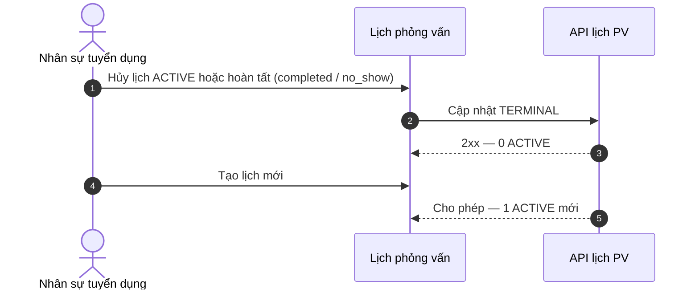

# PO-HRM-REC-INTERVIEW-ONE-ACTIVE-SPEC-01 — Một lịch PV ACTIVE / ứng viên + badge danh sách

| Field | Value |
|-------|--------|
| work_item_id | `PO-HRM-REC-INTERVIEW-ONE-ACTIVE-SPEC-01` |
| lane | governance · ba-process · **NO CODE** `apps/**` |
| program | `PO-HRM-UC-MENU-COVERAGE-01` + REC E2E |
| date | 2026-08-06 |
| SoT khách (read) | `docs/client-delivery/hrm-enterprise-blueprint/SRS_HRM_ENTERPRISE.md` **v0.13** · **FR-UC-BP-REC-06** (+ pipeline **05** / **05a**) |
| Consumer spine | `docs/program/specs/PO-HRM-REC-E2E-LINKAGE-SPEC-01.md` hàng #10 (Lịch PV + đánh giá) |
| Console (impl crash riêng) | `docs/qa/evidence/sponsor-console-20260806-interview.log` — `Select.Item` empty string Uncaught trên InterviewsTab (**FE FIX parallel** — **không** thay BR này) |
| change_mode | ADD draft SRS delta only · **no customer merge** trong wave này |
| honesty | `recruitment_uat_ready=false` · U65 zero-seed · **cấm** invent tin đăng / REC-03 GĐ2 |
| ack_status | **PASS_TO_PM** |

---

## 0. Verdict thẳng (sponsor BR)

| Layer | Honesty |
|-------|---------|
| **Sponsor lock intent** | Mỗi **ứng viên** tối đa **1 lịch phỏng vấn ACTIVE**; chỉ sau **hủy / hoàn tất (theo BR)** mới tạo lịch mới; danh sách UV **hiển thị** đã có lịch + ngày giờ ngắn. |
| **Enterprise SRS REC-06** | Có thư + đánh giá + ghi chú «Nhiều vòng PV → mỗi vòng một bản đánh giá» — **không** khóa cardinality lịch ACTIVE · Diễn biến #1–2 **nông** với create/cancel/reschedule. = **spec_gap** depth. |
| **REC-05 / 05a** | Pipeline + lịch nằm trong pipeline; **không** BR one-active / badge list. |
| **FE skim (read-only)** | `ScheduleInterviewDialog` luôn `createInterviewCatalog` `status: 'scheduled'` — **không** đọc lịch ACTIVE hiện có. `CandidatesTab`: nút lịch luôn bật; **không** cột/badge ngày giờ ACTIVE. `InterviewsTab`: có status UI (`scheduled`/`confirmed`/`completed`/`cancelled`/`rescheduled`/`no_show`) + crash `SelectItem value=""` (lane FE riêng). |
| **BE skim (read-only)** | Lane B `createInterview` INSERT không kiểm tra ACTIVE; Lane A `scheduleInterview` INSERT `recruitment_interviews` cũng không. Từ điển status **lệch** spine (`scheduled\|passed\|failed\|cancelled`) vs catalog/FE (`scheduled\|confirmed\|completed\|…`). |

**Kết luận BA:** Intent sponsor = **BR mới bắt buộc** (draft SRS ADD). Product hiện tại = **impl_gap** nặng trên create + list display. **Không** claim recruitment UAT-ready. Crash Select.Item = **impl_gap UX riêng** — không được gộp thành nghiệm thu one-active.

---

## §1 Định nghĩa trạng thái lịch (BA lock — draft)

> Phạm vi đếm: **một pháp nhân (`company_id`) × một `candidate_id`**. Sponsor: «Mỗi ứng viên» — **không** nới concurrent theo từng YCTD trong MVP (xem OPEN-Q1).

| Nhóm | Status values (catalog/FE hiện dùng) | Ý nghĩa nghiệp vụ |
|------|--------------------------------------|-------------------|
| **ACTIVE** | `scheduled`, `confirmed` | Đã có lịch chưa kết thúc — **chặn** tạo lịch mới |
| **TERMINAL** (cho phép tạo lịch mới) | `cancelled`, `completed` | Hủy hoặc hoàn tất vòng PV (kèm đánh giá theo REC-06 khi `completed`) |
| **TERMINAL mở rộng (đề xuất khóa cùng BR)** | `no_show` | Ứng viên không đến — coi như vòng kết thúc; cho tạo lịch mới |
| **SUPERSEDED** | `rescheduled` | Bản ghi cũ đã bị thay lịch — **không** ACTIVE; lịch mới (nếu tạo) phải ở ACTIVE |

**Ánh xạ spine Lane A (khi sa unify):** `scheduled` = ACTIVE; `cancelled` = TERMINAL; `passed`/`failed` ≈ `completed` + result — sa ghi API_DESIGN; **cấm** Dev tự invent status GĐ2.

**Reschedule (một trong hai — sa chọn 1, BA AC giữ invariant):**

| Option | Hành vi | Invariant |
|--------|---------|-----------|
| **R-A (ưu tiên MVP)** | Đổi ngày/giờ **trên cùng** bản ghi ACTIVE; giữ `scheduled`/`confirmed` | Vẫn đúng 1 ACTIVE |
| **R-B** | Atomic: cũ → `rescheduled` (hoặc `cancelled`) **và** tạo bản ghi mới `scheduled` trong **một** giao dịch | Không bao giờ ≥2 ACTIVE cùng lúc |

---

## §2 Spine — Create / Cancel / Reschedule / List badge

> Gap class: `spec_gap` | `impl_gap` | `broken` | `OUT_MVP`

| # | Bước | Actor | UI hiện tại | Entity SoT | FR cite (as-is) | Spec says (TO-BE draft) | FE/BE does | Gap | Owner next |
|---|------|-------|-------------|------------|-----------------|-------------------------|------------|-----|------------|
| IV-1 | Mở xếp lịch từ danh sách UV | HR | `CandidatesTab` nút CalendarClock → `ScheduleInterviewDialog` | Lịch PV gắn UV (pipeline REC-05) | REC-06 nông | Chỉ mở create khi **0 ACTIVE**; nếu có ACTIVE → chặn + chỉ đường Hủy / Đổi lịch | Nút luôn mở; không prefetch ACTIVE | **impl_gap** + **spec_gap** | ba-docs → sa → fe/be |
| IV-2 | Tạo lịch mới | HR | Dialog Lưu | 1 row lịch | REC-06 #1 «Gửi thư» lệch create lịch | POST chỉ khi 0 ACTIVE; status ban đầu `scheduled` | Catalog INSERT luôn; spine INSERT luôn | **impl_gap** | **dev-be** enforce + **dev-fe** gate |
| IV-3 | Xác nhận lịch | HR · hệ thống | InterviewsTab cập nhật status | Cùng row | — (thiếu) | `confirmed` vẫn ACTIVE (không mở slot mới) | Cho đổi status tự do | **spec_gap** nông + **impl_gap** | ba-docs + be |
| IV-4 | Hủy lịch | HR | InterviewsTab / action hủy | Row → `cancelled` | — | Sau cancel → 0 ACTIVE → cho tạo mới | Có hủy/update status; **không** gate create | **impl_gap** (thiếu gate) | be/fe |
| IV-5 | Hoàn tất vòng | HR · PV | Đánh giá + status `completed` | Lịch + đánh giá REC-06 | REC-06 #2–4 · «Nhiều vòng» | `completed` (+ result) → TERMINAL → cho lịch vòng sau | Có evaluation dialog; không khóa 1 ACTIVE | **impl_gap** | be/fe |
| IV-6 | Đổi lịch (reschedule) | HR | Chip/reschedule UI | R-A hoặc R-B | — | Giữ đúng 1 ACTIVE | UI có status `rescheduled`; không atomic BR | **spec_gap** (chọn R-A/R-B) + **impl_gap** | sa + be/fe |
| IV-7 | Badge / cột trên list UV | HR | `CandidatesTab` columns | Projection ACTIVE | — | Hiển thị «Đã có lịch» + `dd/MM/yyyy HH:mm` (vi-VN) khi có ACTIVE | Không cột/badge lịch | **impl_gap** | **dev-fe** (+ API field nếu cần) |
| IV-8 | Cross-nav list → chi tiết lịch | HR | List → Interviews / candidate detail | J-* | Journey | Click badge/lịch → thấy đúng lịch ACTIVE | Nút lịch mở dialog tạo mới | **impl_gap** J | qa sau Dev |
| IV-9 | Console Select.Item `""` | — | InterviewsTab rating Select | — | — | Ngoài BR; hotfix FE | Uncaught trên log sponsor | **broken** UX | **dev-fe** parallel (`PO-HRM-REC-IV-SELECT-FE-01` hoặc tương đương) |
| IV-10 | Tin đăng / campaign schedule | — | leftover postings | — | **REC-03 OUT** | **Cấm** mở GĐ1 | Menu leftover | **OUT_MVP** | pm — không dispatch |

### §2.1 sequenceDiagram — Tạo lịch (TO-BE)

```mermaid
sequenceDiagram
  autonumber
  actor HR as Nhân sự tuyển dụng
  participant List as Danh sách ứng viên
  participant API as API lịch PV
  participant DB as Kho lịch

  HR->>List: Mở xếp lịch cho ứng viên
  List->>API: Kiểm tra lịch ACTIVE theo ứng viên × pháp nhân
  alt Đã có ACTIVE (scheduled hoặc confirmed)
    API-->>List: Từ chối tạo mới — nêu ngày giờ ACTIVE
    List-->>HR: Không mở form tạo (hoặc form khóa) — hướng Hủy hoặc Đổi lịch
  else Không có ACTIVE
    HR->>List: Nhập ngày giờ · hình thức · người PV · Lưu
    List->>API: Tạo lịch status scheduled
    API->>DB: INSERT khi vẫn 0 ACTIVE (chặn đua)
    DB-->>API: Bản ghi mới
    API-->>List: 2xx
    List-->>HR: Badge «Đã có lịch» + ngày giờ; F5 vẫn còn
  end
```

### §2.2 sequenceDiagram — Hủy / hoàn tất rồi tạo vòng sau



---

## §3 Business rules

| BR-ID | Điều kiện | Hành động | Kết quả |
|-------|-----------|-----------|---------|
| **BR-REC-IV-01** | Ứng viên đã có ≥1 lịch **ACTIVE** (`scheduled` \| `confirmed`) cùng pháp nhân | Từ chối tạo lịch mới (FE chặn + BE 409 deterministic) | Thông báo rõ: đã có lịch + ngày giờ; gợi ý Hủy hoặc Đổi lịch |
| **BR-REC-IV-02** | Lịch ACTIVE → `cancelled` \| `completed` \| `no_show` (TERMINAL) | Cho tạo lịch mới | Đúng 0→1 ACTIVE |
| **BR-REC-IV-03** | Reschedule | Chỉ R-A hoặc R-B atomic | Không bao giờ ≥2 ACTIVE |
| **BR-REC-IV-04** | List ứng viên có ACTIVE | Hiển thị badge/cột/icon + ngày giờ ngắn `dd/MM/yyyy HH:mm` | Không ACTIVE → ô trống / «—» (không crash) |
| **BR-REC-IV-05** | Nhiều vòng PV (REC-06 đặc biệt) | Vòng sau = lịch mới **sau** TERMINAL vòng trước | Không song song 2 ACTIVE; đánh giá vẫn 1 bản / vòng |
| **BR-REC-IV-06** | Soft-delete / ẩn lịch | Không dùng hard-delete để «né» ACTIVE | Hủy = `cancelled` có audit |

**Mã lỗi đề xuất (sa chốt):** `HRM-REC-IV-409-ACTIVE` (hoặc tương đương) — message tiếng Việt kỹ thuật, không nuốt im lặng.

---

## §4 Acceptance criteria (đo được — U65 browser)

| AC-ID | Đạt khi | Không đạt khi |
|-------|---------|---------------|
| **AC-REC-IV-01** | UV chưa có ACTIVE → Lưu lịch → 2xx → list có badge + `dd/MM/yyyy HH:mm` → F5 còn | Tạo được nhưng list không hiện; hoặc chỉ assert API |
| **AC-REC-IV-02** | UV đã ACTIVE → thử tạo mới → **không** 2xx tạo thứ hai; UI báo đã có lịch | FE chặn nhưng BE vẫn INSERT; hoặc ngược lại |
| **AC-REC-IV-03** | Hủy ACTIVE → tạo lịch mới → đúng 1 ACTIVE mới trên list | Hủy xong vẫn chặn tạo; hoặc còn 2 ACTIVE |
| **AC-REC-IV-04** | Hoàn tất (`completed`) vòng 1 → tạo vòng 2 thành công | `completed` vẫn tính ACTIVE |
| **AC-REC-IV-05** | Reschedule (R-A hoặc R-B) → luôn ≤1 ACTIVE; ngày giờ mới hiện trên badge | Hai row `scheduled` cùng UV |
| **AC-REC-IV-06** | Cross-nav: từ badge/list → thấy đúng lịch ACTIVE (J-*) | Badge trang trí không dẫn được lịch |
| **AC-REC-IV-07** | InterviewsTab không Uncaught `Select.Item` empty (lane FE parallel) | Console crash khi mở sửa lịch — **không** claim PASS one-active nếu crash chặn thao tác |

**Persona / UF (QA):** HR tuyển · menu Tuyển dụng → Ứng viên / Lịch PV · **không seed** lịch để pass.

---

## §5 Draft SRS ADD (no customer merge — ba-docs)

> Merge vào `SRS_HRM_ENTERPRISE.md` **sau sponsor CONFIRM**. **Không wipe** FR-06 hiện có. `no_prompt_echo`.

### §5.1 Đề xuất A — ADD `FR-UC-BP-REC-06a` — Xếp / hủy / đổi lịch phỏng vấn (một ACTIVE)

#### Thông tin chung

| Mục | Nội dung |
|-----|----------|
| Tác nhân | Nhân sự tuyển dụng |
| Ưu tiên | Cao — MVP |
| Tiên quyết | Ứng viên thuộc pháp nhân; đã gắn YCTD khi chính sách MVP yêu cầu (REC-05a); quyền xếp lịch |
| Hậu điều kiện | Tối đa một lịch ACTIVE / ứng viên; list UV phản ánh ACTIVE; lịch sử hủy/hoàn tất truy vết |
| BR | **BR-REC-IV-01..06** |
| Liên hệ phần mềm hiện tại | Logic giấy draft; **không** khẳng định đã nghiệm thu vận hành |

**Mục đích:** Xếp lịch phỏng vấn trong pipeline ứng viên với quy tắc **một lịch ACTIVE**; hủy hoặc hoàn tất trước khi xếp vòng sau; danh sách ứng viên hiển thị trạng thái đã có lịch.

#### Dữ liệu đầu vào

| Trường | Bắt buộc | Quy tắc |
|--------|----------|---------|
| Ứng viên | Có | Đúng pháp nhân |
| Ngày · giờ | Có | `dd/MM/yyyy` + giờ; không quá khứ theo chính sách tenant (sa) |
| Hình thức | Có | Trực tiếp / trực tuyến / điện thoại |
| Người phỏng vấn | Có theo chính sách | — |
| Thao tác hủy / hoàn tất | Khi đóng ACTIVE | Lý do hủy khi bắt buộc theo cấu hình |

#### Luồng chính

1. Từ danh sách hoặc hồ sơ ứng viên → Xếp lịch (khi chưa có ACTIVE).
2. Hệ thống kiểm tra cardinality ACTIVE → cho tạo `scheduled`.
3. (Tuỳ chọn) Xác nhận → `confirmed` (vẫn ACTIVE).
4. Hủy → `cancelled` **hoặc** hoàn tất đánh giá → `completed` / `no_show`.
5. Đổi lịch theo R-A hoặc R-B — luôn ≤1 ACTIVE.
6. Danh sách ứng viên hiển thị badge + ngày giờ ngắn khi có ACTIVE.

#### Quy tắc nghiệp vụ

- **BR-REC-IV-01..06** (bảng §3).
- Lịch và đánh giá nằm trong pipeline ứng viên — **không** menu chiến dịch / tin đăng (REC-03 OUT).
- Nhiều vòng = tuần tự sau TERMINAL (không song song ACTIVE).

#### Trường hợp đặc biệt

| Tình huống | Hệ thống xử lý |
|------------|----------------|
| Đua hai request tạo | BE từ chối bản thứ hai — vẫn 1 ACTIVE |
| Không có ACTIVE | Cho tạo; list «—» |
| Sai pháp nhân | 404/409 scope — không lộ lịch chéo |
| Gửi thư mời thất bại (REC-06) | Không tự tạo thêm lịch thứ hai |

#### Diễn biến nghiệp vụ

| # | Tương tác | Điều kiện / quy tắc | Kết quả hoặc lỗi |
|---|-----------|---------------------|------------------|
| 1 | Mở xếp lịch | Có quyền · đúng UV | Form mở **chỉ khi** 0 ACTIVE |
| 2 | Đã có ACTIVE | BR-REC-IV-01 | Chặn; hiện ngày giờ ACTIVE |
| 3 | Lưu lịch mới | 0 ACTIVE | `scheduled`; badge list; F5 còn |
| 4 | Xác nhận | ACTIVE | `confirmed`; vẫn chặn tạo mới |
| 5 | Hủy | ACTIVE → `cancelled` | 0 ACTIVE; cho tạo mới |
| 6 | Hoàn tất / no-show | → TERMINAL | Cho lịch vòng sau |
| 7 | Đổi lịch | R-A hoặc R-B | ≤1 ACTIVE; badge cập nhật |
| Thành công | — | — | Đúng 1 ACTIVE hoặc 0; UC kế = đánh giá / thư REC-06 |

**Tiêu chí đạt:** AC-REC-IV-01..06.

### §5.2 Đề xuất B — EXPAND Diễn biến **FR-UC-BP-REC-06** (nếu không tách 06a)

Chèn vào Diễn biến REC-06 (giữ thư + đánh giá):

| # | Tương tác | Điều kiện / quy tắc | Kết quả hoặc lỗi |
|---|-----------|---------------------|------------------|
| 0a | Xếp lịch PV | 0 ACTIVE / UV | Tạo `scheduled`; badge list |
| 0b | Xếp khi đã ACTIVE | BR-REC-IV-01 | Từ chối |
| 0c | Hủy / hoàn tất lịch | TERMINAL | Cho xếp vòng sau |
| 1… | (giữ gửi thư / đánh giá hiện có) | … | … |

**Khuyến nghị BA:** **Đề xuất A (06a)** — tách lịch khỏi thư/đánh giá cho đủ 7 mục; REC-06 giữ mail+score; 06b giữ compare.

### §5.3 Inventory stamp (ba-docs)

| Inventory | Action |
|-----------|--------|
| Thêm `UC-BP-REC-06a` hoặc EXPAND `UC-BP-REC-06` Diễn biến | ADD-only |
| Menu coverage leaf Interviews + Candidates schedule | `SHALLOW` → `SPEC_READY` sau merge + Tech/DB/API |

---

## §6 Gap matrix — spec_gap vs impl_gap

| ID | Mô tả | Class | Evidence |
|----|-------|-------|----------|
| G1 | Enterprise thiếu cardinality ACTIVE + Diễn biến create/cancel/reschedule | **spec_gap** | REC-06 Diễn biến #1–2 nông; «Nhiều vòng» chỉ nói đánh giá |
| G2 | Create không enforce 1 ACTIVE (FE+BE catalog + spine) | **impl_gap** | `ScheduleInterviewDialog` / `createInterview` / `scheduleInterview` |
| G3 | List UV không badge/cột ngày giờ ACTIVE | **impl_gap** | `CandidatesTab` headers — không cột lịch |
| G4 | Từ điển status Lane A ≠ Lane B/FE | **spec_gap** (sa unify) + **impl_gap** | `recruitment_interviews` chk vs FE `getStatusConfig` |
| G5 | Dual surface `interviews` catalog vs `recruitment_interviews` spine | **impl_gap** / arch residual TechSpec §17.6 | FE đang Lane B catalog |
| G6 | Select.Item `value=""` Uncaught | **broken** (FE) — **ngoài** BR one-active | `sponsor-console-20260806-interview.log` |
| G7 | REC-03 / tin đăng schedule | **OUT_MVP** | Cấm invent |

---

## §7 P0_fix_queue (cascade)

```text
PO-HRM-REC-INTERVIEW-ONE-ACTIVE-SPEC-01 (ba-process) ✅ THIS
  → PO-HRM-REC-IV-ONE-ACTIVE-DOCS-01 (ba-docs)
       merge draft §5 vào SRS_HRM_ENTERPRISE ADD-only (06a hoặc delta REC-06)
       sau sponsor CONFIRM; no_prompt_echo; inventory +1 / EXPAND
  → PO-HRM-REC-IV-ONE-ACTIVE-SA-01 (sa)
       TechSpec F.1 + DB_DESIGN (partial unique ACTIVE / candidate+company)
       + API_DESIGN mục đích · bước SRS · mã 409
       unify status Lane A/B hoặc binding rõ surface MVP
  → PO-HRM-REC-IV-ONE-ACTIVE-BE-01 (dev-be)
       enforce BR-REC-IV-01 trên create (đúng SoT table sa chọn)
       cancel/complete/reschedule transitions
  → PO-HRM-REC-IV-ONE-ACTIVE-FE-01 (dev-fe)
       gate dialog + badge/cột list + vi-VN datetime + AC FE sau 2xx/F5
  → PO-HRM-REC-IV-SELECT-FE-01 (dev-fe) PARALLEL
       fix Select.Item empty — không claim one-active
  → PO-HRM-REC-IV-ONE-ACTIVE-QA-01 (qa)
       AC-REC-IV-01..07 · U65 browser · J-* cross-nav
  → QC hẹp slice — recruitment_uat_ready=false đến spine REC + IV PASS
```

**FORBIDDEN toàn cascade:** `apps/**` trước docs+Tech+DB+API confirm; seed lịch để PASS; invent tin đăng / campaign GĐ2; claim module tuyển UAT-ready từ narrow fix.

---

## §8 Honesty locks

| Flag | Value |
|------|-------|
| `recruitment_uat_ready` | **false** |
| One-active BR paper ≠ product GO | **true** |
| U65 zero-seed | **true** |
| Invent REC-03 / job_postings schedule SoT | **false** |
| Console Select fix ≠ BR done | **true** |

---

## §9 OPEN questions (không bịa — chặn Dev nếu cần)

| ID | Câu hỏi | Default BA (đến khi sponsor đổi) | Owner |
|----|---------|----------------------------------|-------|
| OPEN-Q1 | UV gắn nhiều YCTD: 1 ACTIVE / UV hay / liên kết YCTD? | **1 ACTIVE / ứng viên / pháp nhân** (đúng chữ sponsor) | sponsor / ba-docs |
| OPEN-Q2 | Reschedule R-A vs R-B? | **R-A** (đổi trên chỗ) cho MVP | sa |
| OPEN-Q3 | `no_show` có TERMINAL không? | **Có** | ba-docs confirm |
| OPEN-Q4 | Surface MVP = catalog `interviews` hay spine `recruitment_interviews`? | sa chốt theo TechSpec §17.6 — **một** SoT mutate | sa |

---

## §10 BA accountability

1. Sponsor BR one-active **đúng** và **chưa** nằm đủ depth trong Enterprise REC-06 — đây là **spec_gap** BA phải ADD, không chỉ ticket Dev.
2. Product **impl_gap** rõ trên create + list — Dev chỉ sau ba-docs + sa physical.
3. «Nhiều vòng PV» SRS **không** mâu thuẫn one-active nếu vòng là tuần tự sau TERMINAL.
4. Crash InterviewsTab = lane FE song song — **cấm** dùng làm bằng chứng nghiệp vụ one-active PASS/FAIL.

---

## Completion contract

- `completion_report`: Đã phát hành SoT one-active §0–§10; định nghĩa ACTIVE/TERMINAL; spine IV-1..10; BR-REC-IV-01..06; AC-REC-IV-01..07; draft SRS 06a / delta REC-06; gap + P0 queue; honesty false.
- `next_owner`: **ba-docs** (`PO-HRM-REC-IV-ONE-ACTIVE-DOCS-01`) rồi **pm** giữ parallel **dev-fe** Select.Item; **không** full Dev one-active trước docs/Tech/DB/API.
- `ack_status`: **PASS_TO_PM**
- `evidence_path`: `docs/program/specs/PO-HRM-REC-INTERVIEW-ONE-ACTIVE-SPEC-01.md`
