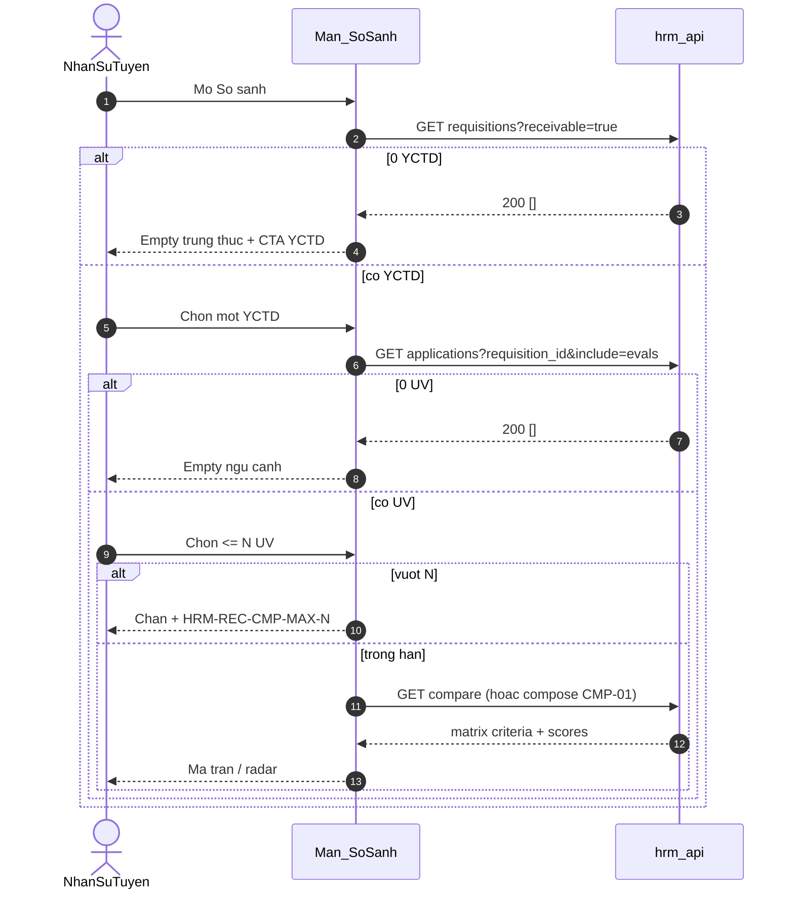

# PO-HRM-REC-UV-YCTD-TECH-01 — TechSpec delta · Thêm UV gắn YCTD + So sánh theo YCTD

| Field | Value |
|-------|--------|
| **work_item_id** | `PO-HRM-REC-UV-YCTD-TECH-01` |
| **lane** | governance · sa |
| **change_mode** | ADD · **NO CODE** `apps/**` |
| **Date** | 2026-08-06 |
| **Status** | **DRAFT TechSpec depth** — cascade **DB_DESIGN → API_DESIGN** còn mở; **cấm Dev** đến khi cả hai confirm |
| **ref_srs** | [`SRS_HRM_ENTERPRISE.md`](../../client-delivery/hrm-enterprise-blueprint/SRS_HRM_ENTERPRISE.md) **v0.11** · **FR-UC-BP-REC-05a** · **FR-UC-BP-REC-06b** · thuật ngữ REC-01 «Kế hoạch tuyển» ↔ định biên |
| **ref_linkage** | [`PO-HRM-REC-E2E-LINKAGE-SPEC-01.md`](./PO-HRM-REC-E2E-LINKAGE-SPEC-01.md) §3.1–§3.2 · §4 cascade |
| **ref_docs** | [`po-hrm-rec-e2e-linkage-docs-01.md`](../../qa/evidence/po-hrm-rec-e2e-linkage-docs-01.md) |
| **ref_soft_fk_pattern** | [`PO-HRM-JD-YCTD-REF-TECHSPEC-01.md`](./PO-HRM-JD-YCTD-REF-TECHSPEC-01.md) · [`PO-HRM-JD-YCTD-REF-DB-01.md`](./PO-HRM-JD-YCTD-REF-DB-01.md) — **reuse** ONE physical soft FK / alias · **không** dual-write |
| **Client pointer** | [`TECHSPEC_HRM_ENTERPRISE.md`](../../client-delivery/hrm-enterprise-blueprint/TECHSPEC_HRM_ENTERPRISE.md) DOC-DELTA (cite only — **no wipe** stubs F-REC-APP-*) |
| **Honesty** | `recruitment_uat_ready=false` · `jd_dynamic_done=false` · U65 zero-seed · FORBIDDEN `job_postings` as JD/compare/UV SoT · **REC-03 OUT** |
| **ack_status** | **PASS_TO_PM** |

---

## 0. Context & objective

**Business intent (sponsor P0):** Thêm ứng viên bắt buộc chọn **YCTD**; vị trí = SELECT / derived từ YCTD (không free-text SoT); So sánh ứng viên theo **một YCTD** + điểm đánh giá trên liên kết UV–YCTD.

**Architecture truth (locked):**

| Lock | Rule |
|------|------|
| Consumer MVP | **YCTD** (`job_requisitions` / logical `rec_recruitment_request`) — **không** tin đăng / campaign |
| Soft FK UV→YCTD | Logical `rec_candidate_application.recruitment_request_id` **NOT NULL**; physical AS-IS alias = `requisition_id` (ba-data confirm **ONE** column — **cấm** invent `job_posting_id` SoT) |
| Position SoT | `position_key` (+ display name) **derived** từ YCTD đã chọn / catalog khớp — **không** `candidates.position` free-text làm SoT |
| Eval SoT for compare | `rec_interview_evaluation` (hoặc AS-IS eval) neo **application_id** (UV×YCTD) — FR-UC-BP-REC-06 |
| Soft FK reuse | Cùng pattern YCTD↔JD: alias DTO, không dual physical FK, không CASCADE-delete history |
| FORBIDDEN | Dual-write / filter / SoT qua `job_postings` · mở **FR-UC-BP-REC-03** GĐ1 · seed để PASS |
| Dev gate | **DB_DESIGN delta confirm + API_DESIGN delta confirm** trước mọi `apps/**` |

Wave này **deepen** stub **F-REC-APP-01** (+ gap compare) thành family **F-REC-UV-YCTD-*** / **F-REC-CMP-*** F.1 map Diễn biến **05a #1–#6** và **06b #1–#6** — **không** wipe API_DESIGN stubs; **không** rewrite JD-dynamic.

---

## 1. Capability map — F-REC-UV-YCTD + F-REC-CMP

**Prefix physical (AS-IS Nest prefer):** `/api/hrm/recruitment`  
**Prefix logical (enterprise API_DESIGN):** `/api/hrm/rec`  
**Envelope:** `{ code, message, data }` — không invent shape song song.  
**Scope:** mọi list / get / mutate dùng **cùng** `resolveHrmListScope` + `company_id` + `assertResourceInHrmScope` (U19 `scope_parity`).

| Cap | F-id | METHOD / path (physical AS-IS prefer) | Logical alias | SRS bước |
|-----|------|----------------------------------------|---------------|----------|
| List YCTD receivable (picker Thêm UV / So sánh) | **F-REC-UV-YCTD-01** | `GET /recruitment/requisitions?company_id=&receivable=true` *(reuse list YCTD; filter trạng thái nhận hồ sơ)* | `GET /rec/recruitment-requests?open_for_hire=true` | **05a #1–#2** · **06b #1–#2** |
| Get YCTD → position display | **F-REC-UV-YCTD-02** | `GET /recruitment/requisitions/:id` *(display-ready `position_key`/`position_name`)* | same get YCTD | **05a #3–#4** |
| Create UV + application (YCTD required) | **F-REC-UV-YCTD-03** | `POST /recruitment/candidates` *(hoặc pool create + application — ba-data/API chốt một write path)* | **overlay** `F-REC-APP-01` `POST /rec/candidates` | **05a #5–#6** · AC-UV-01..04 |
| Update UV / add application link | **F-REC-UV-YCTD-04** | `PATCH …/candidates/:id` · `POST …/candidates/:id/applications` | `F-REC-APP-01` link path | **05a** cập nhật · N–N thêm YCTD |
| List/get UV display YCTD + position | **F-REC-UV-YCTD-05** | `GET /recruitment/candidates` · `GET …/:id` *(include applications)* | `GET /rec/candidates` | **05a Thành công** · AC-UV-02 |
| Compare set: UV + evals theo YCTD | **F-REC-CMP-01** | `GET /recruitment/applications?requisition_id=&include=evals` *(hoặc dedicated compare read)* | `GET /rec/applications?recruitment_request_id=` | **06b #3–#4 · #6** |
| Compare matrix (≤ N ids) | **F-REC-CMP-02** | `GET /recruitment/compare?requisition_id=&candidate_ids=` **hoặc** FE compose từ CMP-01 (BE authoritative max-N optional) | `GET /rec/compare` | **06b #5 · Thành công** · AC-CMP-04/05 |

**Reuse — không invent SoT mới:**

| Reuse | Do not invent |
|-------|----------------|
| YCTD list/get = F-YCTD-JD-05 / F-REC-YCTD-* (+ receivable filter) | Second YCTD table / campaign entity |
| Application N–N = `rec_candidate_application` | `job_postings` join as UV SoT |
| Eval = F-REC-APP-03 / interview_evals on application | Compare scores from postings |
| Position catalog soft key = same `position_key` as YCTD / XBOS catalog | Free-text `position` column as SoT |

---

## 2. API_DESIGN F.1 — F-REC-UV-YCTD-01..05

### 2.1 F-REC-UV-YCTD-01 — List YCTD receivable (picker)

| | |
|--|--|
| **Mục đích** | Cung cấp danh sách YCTD đúng pháp nhân ở trạng thái **được nhận hồ sơ** cho form Thêm UV và bộ chọn So sánh — empty trung thực khi 0. |
| **Nghiệp vụ xử lý** | (1) Resolve scope JWT + `company_id`. (2) Query YCTD **cùng scope** list/get (parity với F-YCTD-JD-05). (3) Filter **receivable** = approved / `open_for_hire` (ba-data chốt enum AS-IS). (4) `items=[]` → **200 empty** (không 500) — FE empty + CTA tạo/duyệt YCTD (SRS **05a #2** · **06b #2**). (5) **FORBIDDEN** đọc từ `job_postings` / campaigns. |
| **Tham chiếu bước SRS** | **FR-UC-BP-REC-05a** Diễn biến **#1** · **#2** · **FR-UC-BP-REC-06b** **#1** · **#2** · BR-BP-CV-03 · BR-BP-REC-CMP-01 (scope YCTD). |
| **Request** | Query: `company_id` (required); `receivable=true` / `open_for_hire=true`. Optional: `q` search code/title. |
| **Response → DB** | `items[]` ← `job_requisitions` / `rec_recruitment_request` display-ready: `id`, `code?`, `title`, `position_key`, `position_name?`, `status`, `headcount?`. |
| **Lỗi nghiệp vụ** | `403`/`409` scope · empty `[]` **hợp lệ** — **không** 404 cho empty list. |

---

### 2.2 F-REC-UV-YCTD-02 — Get YCTD → derive position display

| | |
|--|--|
| **Mục đích** | Sau khi user chọn YCTD, trả **vị trí hiển thị** (mã/tên chức danh) để bind SELECT/read-only — không bắt nhập free-text. |
| **Nghiệp vụ xử lý** | (1) GET YCTD by id **scope_parity**. (2) Reject ngoài scope → 404. (3) Nếu YCTD **không** receivable → `HRM-REC-UV-YCTD-STATUS` 400 (SRS **#3** gate). (4) Compose `position_key` + `position_name` từ YCTD (và catalog join nếu cần) — **không** chấp nhận client ghi đè free-text SoT. |
| **Tham chiếu bước SRS** | **FR-UC-BP-REC-05a** Diễn biến **#3** · **#4** · AC-REC-UV-03 · BR-HRM-MD-01 / AC-HRM-PICKER-01 (team). |
| **Request** | Path `:id` + `company_id`. |
| **Response → DB** | Read YCTD cols: `id`, `status`, `position_key`, display name; optional JD ref display (reuse F-YCTD-JD-05 fields). |
| **Lỗi** | `HRM-REC-UV-YCTD-STATUS` · `HRM-REC-UV-YCTD-NOT-FOUND` · scope 403/409. |

**Position contract (locked):**

```text
UvPositionDisplay = {
  recruitment_request_id: string,  // = physical requisition_id
  position_key: string,            // SoT catalog key from YCTD
  position_name: string,           // display-ready
  source: 'yctd'                   // never 'free_text'
}
```

---

### 2.3 F-REC-UV-YCTD-03 — Create UV + application (YCTD required)

| | |
|--|--|
| **Mục đích** | Tạo hồ sơ ứng viên và **bắt buộc** tạo liên kết application → YCTD; stage pipeline gắn trên application. |
| **Nghiệp vụ xử lý** | (1) Scope assert. (2) Validate PII tối thiểu (họ tên; liên hệ theo chính sách). (3) **BR-BP-CV-03:** `recruitment_request_id` / `requisition_id` **required** trên create MVP — thiếu → `HRM-REC-UV-YCTD-REQUIRED` 400 (SRS **#5**). (4) Load YCTD same scope; nếu không receivable → `HRM-REC-UV-YCTD-STATUS`. (5) Derive `position_key` từ YCTD; nếu client gửi `position_key` lệch → `HRM-REC-UV-POSITION-MISMATCH` **hoặc** ignore free-text `position` (DB-01 chốt: reject write free-text SoT). (6) INSERT `rec_candidate` + `rec_candidate_application` (UQ candidate×YCTD); stage initial trên application. (7) **FORBIDDEN** insert/link qua `job_postings`. (8) Return 201 display-ready gồm YCTD id + position derived. |
| **Tham chiếu bước SRS** | **FR-UC-BP-REC-05a** **#5** · **#6** · **Thành công** · AC-REC-UV-01..04 · BR-BP-CV-01/03. |
| **Request → DB** | Logical: `full_name`, `email?`, `phone?`, `source_code`, `recruitment_request_id` (required), `stage`, optional `position_key` (must match YCTD). Physical alias: `requisition_id` ↔ same id. **Cấm** persist free-text `position` as SoT. |
| **Response → DB** | 201: `candidate_id`, `application_id`, `recruitment_request_id`, `position_key`, `position_name`, `stage`. Code: keep AS-IS 2xx; ADD optional `HRM-REC-UV-201`. |
| **Lỗi nghiệp vụ** | `HRM-REC-UV-YCTD-REQUIRED` · `HRM-REC-UV-YCTD-STATUS` · `HRM-REC-UV-YCTD-NOT-FOUND` · `HRM-REC-UV-POSITION-MISMATCH` · `409` duplicate UQ (candidate, YCTD) · scope 403/409 · `HRM-VAL-400` thiếu họ tên/liên hệ. |

**Context create (AC-REC-UV-04):** khi FE mở từ YCTD, query `?requisition_id=` prefill — BE vẫn validate required + receivable (không tin FE-only).

---

### 2.4 F-REC-UV-YCTD-04 — Update UV / add application (N–N)

| | |
|--|--|
| **Mục đích** | Cập nhật PII ứng viên; gắn thêm YCTD (N–N) với cùng gate receivable + position derived. |
| **Nghiệp vụ xử lý** | Same REQUIRED/STATUS/MISMATCH khi thêm application; không orphan hard FK; soft FK only; **không** đổi YCTD của application đã `hired` (policy GĐ1). |
| **Tham chiếu bước SRS** | **FR-UC-BP-REC-05a** quy tắc N–N · FR-UC-BP-REC-05 pipeline trên từng liên kết. |
| **Request → DB** | PATCH candidate fields; POST application `{ recruitment_request_id, stage }`. |
| **Lỗi** | Same taxonomy §2.3 · `409` invalid stage / duplicate link. |

---

### 2.5 F-REC-UV-YCTD-05 — List/Get UV with YCTD + position (FE sau 2xx / F5)

| | |
|--|--|
| **Mục đích** | Trả UV kèm applications display-ready (YCTD + vị trí derived) để list/detail sau Lưu và F5 còn liên kết (AC-REC-UV-02). |
| **Nghiệp vụ xử lý** | List/get **scope_parity**; join applications → YCTD; expose `position_key`/`position_name` từ YCTD (hoặc denorm sync — **không** free-text SoT). |
| **Tham chiếu bước SRS** | **FR-UC-BP-REC-05a** **Thành công** · AC-REC-UV-02 · UC kế REC-05/06. |
| **Response → DB** | `candidates.*` + `applications[]`: `{ application_id, recruitment_request_id, yctd_title?, position_key, position_name, stage }`. |
| **Lỗi** | 404 out-of-scope get-by-id · không nuốt 500 thành empty list. |

---

## 3. API_DESIGN F.1 — F-REC-CMP-01..02

### 3.1 F-REC-CMP-01 — Applications + evals by YCTD

| | |
|--|--|
| **Mục đích** | Sau khi chọn một YCTD trên So sánh, tải ứng viên đã gắn + điểm đánh giá trên liên kết UV–YCTD (empty ngữ cảnh khi 0 UV). |
| **Nghiệp vụ xử lý** | (1) Scope assert. (2) Require `requisition_id` / `recruitment_request_id`. (3) List applications cho YCTD đó. (4) LEFT JOIN latest evals / criteria scores (F-REC-APP-03). (5) UV chưa đánh giá → `eval_status: none` + label «chưa đánh giá» (SRS **#6**) — vẫn trả row. (6) `items=[]` → **200 empty** (AC-REC-CMP-03). (7) **FORBIDDEN** `job_postings` filter. |
| **Tham chiếu bước SRS** | **FR-UC-BP-REC-06b** Diễn biến **#3** · **#4** · **#6** · AC-REC-CMP-01..03 · **05** · BR-BP-REC-CMP-01 · FR-UC-BP-REC-06 eval SoT. |
| **Request** | Query: `company_id`, `requisition_id` (required), `include=evals`. |
| **Response → DB** | `items[]`: `candidate_id`, `application_id`, `full_name`, `stage`, `eval_status`, `scores[]?`, `result?`. |
| **Lỗi** | `HRM-REC-UV-YCTD-REQUIRED` nếu thiếu id · `NOT-FOUND` / scope · empty `[]` hợp lệ. |

---

### 3.2 F-REC-CMP-02 — Compare matrix (≤ N)

| | |
|--|--|
| **Mục đích** | Trả payload ma trận/radar cho tối đa N ứng viên **cùng một YCTD** theo tiêu chí đã lưu. |
| **Nghiệp vụ xử lý** | (1) Validate tất cả `candidate_ids` / `application_ids` thuộc cùng `requisition_id`. (2) Nếu count > N (default **4**, tenant-config later) → `HRM-REC-CMP-MAX-N` 400 (SRS **#5**). (3) Assemble criteria columns từ eval template + scores; missing → null / «chưa đánh giá». (4) Option A (CHOSEN): BE endpoint compare; Option B: FE compose từ CMP-01 — **BE vẫn enforce max-N** nếu Option B (không chỉ FE). |
| **Tham chiếu bước SRS** | **FR-UC-BP-REC-06b** **#5** · **Thành công** · AC-REC-CMP-04 · AC-REC-CMP-05. |
| **Request** | Query/body: `requisition_id` + `candidate_ids[]` (≤ N) **hoặc** `application_ids[]`. |
| **Response** | `{ requisition_id, criteria[], rows[{ candidate_id, scores{}, eval_status }] }` — display-ready; không C&B. |
| **Lỗi** | `HRM-REC-CMP-MAX-N` · `HRM-REC-CMP-YCTD-MIX` nếu trộn 2 YCTD · scope. |

**Compare SoT (locked):**

```text
Compare filter SoT     = YCTD (requisition / recruitment_request)
Score SoT              = interview eval on application (UV×YCTD)
FORBIDDEN filter SoT   = job_postings / campaign / tin đăng
Empty 0 YCTD / 0 UV    = 200 + FE empty AC (not fake rows)
```

---

## 4. Sequence — Thêm UV gắn YCTD (TechSpec)

```mermaid
sequenceDiagram
  autonumber
  actor HR as NhanSuTuyen
  participant FE as Form_UV
  participant API as hrm_api
  participant DB as PostgreSQL

  HR->>FE: Mo Them ung vien
  FE->>API: GET requisitions?receivable=true
  alt items rong
    API-->>FE: 200 []
    FE-->>HR: Empty + CTA YCTD — disable Luu
  else co YCTD
    API-->>FE: items display-ready
    HR->>FE: Chon YCTD
    FE->>API: GET requisition/:id
    API-->>FE: position_key + position_name
    FE-->>HR: Vi tri SELECT/read-only derived
    alt thieu YCTD / free-text SoT
      FE-->>HR: Chan Luu
    else du bat buoc
      HR->>FE: Luu
      FE->>API: POST candidate + requisition_id
      API->>DB: INSERT candidate + application soft FK
      API-->>FE: 201 + YCTD + position
      FE-->>HR: List cap nhat; F5 con lien ket
    end
  end
```

---

## 5. Sequence — So sánh theo YCTD (TechSpec)



---

## 6. Error taxonomy (ADD)

| Code | HTTP | When | SRS |
|------|------|------|-----|
| `HRM-REC-UV-YCTD-REQUIRED` | 400 | Create/link thiếu YCTD | 05a #5 · AC-UV-01 |
| `HRM-REC-UV-YCTD-STATUS` | 400 | YCTD không được nhận hồ sơ | 05a #3 |
| `HRM-REC-UV-YCTD-NOT-FOUND` | 404 | Id ngoài scope / không tồn tại | 05a đặc biệt |
| `HRM-REC-UV-POSITION-MISMATCH` | 400 | `position_key` lệch YCTD / free-text SoT | 05a #4 · AC-UV-03 |
| `HRM-REC-CMP-MAX-N` | 400 | Chọn > N ứng viên | 06b #5 · AC-CMP-04 |
| `HRM-REC-CMP-YCTD-MIX` | 400 | Trộn ứng viên hai YCTD | BR-BP-REC-CMP-01 |
| *(reuse)* scope 403/409 | — | JWT / company mismatch | U19 |

Empty lists = **200 []** — không dùng error codes cho «0 YCTD» / «0 UV».

---

## 7. DB_DESIGN delta intents (for ba-data — **not** confirm this wave)

> Full column confirm = **`PO-HRM-REC-UV-YCTD-DB-01`**. Pattern = JD-YCTD soft FK (ONE physical).

| Intent | Rule |
|--------|------|
| Application → YCTD | Logical `recruitment_request_id` NOT NULL · physical **ONE** `requisition_id` (alias) — **cấm** dual column + **cấm** `job_posting_id` SoT |
| Position | SoT = YCTD.`position_key`; optional denorm on application for list — **deprecate write** free-text `candidates.position` as SoT |
| UQ | `(candidate_id, recruitment_request_id)` active (đã có logical DB_DESIGN §2.5) |
| Eval | Neo `application_id` — compare đọc từ đây |
| Soft delete | Soft-delete only; retire YCTD không hard-delete applications history |
| FORBIDDEN | FK CASCADE wipe; dual-write postings; invent campaign GĐ1 tables for UV/compare |

---

## 8. FE–BE boundary (OS 28)

| FE | BE |
|----|-----|
| Picker YCTD từ F-REC-UV-YCTD-01 only | Authoritative REQUIRED + STATUS on create |
| Position SELECT/read-only từ F-REC-UV-YCTD-02 | Reject free-text SoT / POSITION-MISMATCH |
| Prefill khi mở từ YCTD (AC-UV-04) | Vẫn validate receivable |
| Compare label **Yêu cầu tuyển / YCTD** | **Cấm** gọi `job_postings` |
| Empty 0 YCTD / 0 UV + CTA | 200 [] — không fake |
| Max N chọn UV | BE `HRM-REC-CMP-MAX-N` (không chỉ disable UI) |
| Display-ready list fields | Không FE join invent aggregate nested write DTO |

---

## 9. Matrix FR ↔ F-id ↔ bước SRS ↔ AC

| FR | Diễn biến | F-id | AC |
|----|-----------|------|-----|
| REC-05a | **#1** mở form | F-REC-UV-YCTD-01 (load) | — |
| REC-05a | **#2** 0 YCTD | F-REC-UV-YCTD-01 empty 200[] | empty CTA |
| REC-05a | **#3** chọn YCTD | F-REC-UV-YCTD-02 (+ STATUS) | — |
| REC-05a | **#4** vị trí derived | F-REC-UV-YCTD-02 · create derive | AC-REC-UV-03 |
| REC-05a | **#5** thiếu YCTD | F-REC-UV-YCTD-03 REQUIRED | AC-REC-UV-01 |
| REC-05a | **#6** lưu đủ | F-REC-UV-YCTD-03 | AC-REC-UV-01/04 |
| REC-05a | **Thành công** / F5 | F-REC-UV-YCTD-05 | AC-REC-UV-02 |
| REC-06b | **#1** mở so sánh | F-REC-UV-YCTD-01 | AC-REC-CMP-01 |
| REC-06b | **#2** 0 YCTD | F-REC-UV-YCTD-01 empty | AC-REC-CMP-02 |
| REC-06b | **#3–#4** chọn YCTD / 0 UV | F-REC-CMP-01 | AC-REC-CMP-03 |
| REC-06b | **#5** ≤ N | F-REC-CMP-02 | AC-REC-CMP-04 |
| REC-06b | **#6** chưa đánh giá | F-REC-CMP-01 eval_status | AC-REC-CMP-05 |
| REC-06b | **Thành công** | F-REC-CMP-02 | AC-REC-CMP-05 |
| REC-03 | — | **OUT** — no F-REC-CAMPAIGN | FORBIDDEN postings |
| REC-05 / 06 | pipeline / eval write | F-REC-APP-02 / 03 (must_keep stubs) | consumer of CMP |

Journey đề xuất (QA sau Dev): `J-HRM-REC-UV-01` (Thêm UV) · `J-HRM-REC-CMP-01` (So sánh YCTD) — browser U65.

---

## 10. Client TechSpec / API_DESIGN / DB_DESIGN — DOC-DELTA pointers

| Artifact | Action this wave | Next wave |
|----------|------------------|-----------|
| `TECHSPEC_HRM_ENTERPRISE.md` | ADD DOC-DELTA cite file này + matrix rows 05a/06b | — |
| `DB_DESIGN_HRM_ENTERPRISE.md` | **HOLD** chi tiết AS-IS alias | **`PO-HRM-REC-UV-YCTD-DB-01`** — confirm ONE `requisition_id`; deprecate free-text position SoT |
| `API_DESIGN_HRM_ENTERPRISE.md` | **HOLD** full rewrite | **`PO-HRM-REC-UV-YCTD-API-01`** — delta F.1 overlay F-REC-APP-01 + ADD F-REC-CMP-* + error codes |
| `PO-HRM-JD-YCTD-REF-*` | **No wipe** — soft FK pattern reuse only | Independent lane |

---

## 11. Cascade & Dev HOLD (explicit)

```text
SRS v0.11 FR-05a/06b (DONE ba-docs)
  → TechSpec this file (DONE sa)
  → DB_DESIGN delta PO-HRM-REC-UV-YCTD-DB-01 (ba-data) CONFIRM
  → API_DESIGN delta PO-HRM-REC-UV-YCTD-API-01 (sa) CONFIRM
  → QA plan (map AC-REC-UV-* / AC-REC-CMP-*)
  → Dev-BE PO-HRM-REC-UV-YCTD-BE-01 + Dev-FE PO-HRM-REC-UV-YCTD-FE-01
  → Dev-FE PO-HRM-REC-CMP-FE-01 (so sánh)
  → QA PO-HRM-REC-E2E-LINKAGE-QA-01 · U65
```

| Gate | Rule |
|------|------|
| **Cấm Dev `apps/**`** | Cho đến khi **DB-01 + API-01** cùng confirm trên bus |
| **Cấm** claim | `recruitment_uat_ready` · `jd_dynamic_done` · remaster · product GO · REC-03 unlocked |
| **must_keep** | N–N application soft FK YCTD · eval trên application · F-REC-APP-02/03/HIRE stubs |
| **U65** | Nghiệm thu browser; zero-seed |

---

## 12. Options (SA) — path chosen

| Option | Summary | Verdict |
|--------|---------|---------|
| **A** | Overlay deepen F-REC-APP-01 + ADD F-REC-UV-YCTD / F-REC-CMP families; physical requisitions + applications; position from YCTD | **CHOSEN** — preserve enterprise logical + AS-IS alias |
| **B** | New microservice / new compare warehouse | Reject — over-scope |
| **C** | Compare / UV bind via `job_postings` | **FORBIDDEN** — REC-03 OUT |

**Compare payload:** Option **A1** dedicated `GET compare` (F-REC-CMP-02) preferred for max-N + mix guard; A2 FE-compose allowed only if BE still enforces max-N on a thin endpoint or create-eval path — API-01 chốt một.

---

## 13. Risks & mitigations

| Risk | Mitigation |
|------|------------|
| Dual physical `requisition_id` + `recruitment_request_id` columns | DB-01 **ONE** physical + alias map (JD-YCTD lesson) |
| FE giữ free-text `position` | AC-UV-03 + BE reject/ignore write; QA browser |
| Compare vẫn gọi postings stub | FORBIDDEN + AC-CMP-01; CMP-01 path only |
| Empty list treated as error | 200 [] contract |
| Scope leak get-by-id UV/YCTD | scope_parity jest both list+get |
| Claim module UAT sau narrow GWC | honesty flags false until spine PASS |

---

## 14. Validation / acceptance (governance)

| Check | Pass |
|-------|------|
| Mọi Diễn biến 05a #1–#6 + Thành công map ≥1 F-id F.1 | §2 · §9 |
| Mọi Diễn biến 06b #1–#6 + Thành công map ≥1 F-id F.1 | §3 · §9 |
| Error codes REQUIRED/STATUS/NOT-FOUND/MISMATCH/MAX-N | §6 |
| Position ≠ free-text SoT | §2.2 · §7 |
| REC-03 / job_postings OUT | §0 · §11 |
| Dev HOLD until DB+API | §11 |
| Evidence | `docs/qa/evidence/po-hrm-rec-uv-yctd-tech-01.md` |

---

## Completion

| Field | Value |
|-------|--------|
| completion_report | TechSpec ADD: F-REC-UV-YCTD-01..05 + F-REC-CMP-01..02 F.1 map SRS v0.11 **05a/06b**; soft FK alias reuse; position derived; REC-03/job_postings FORBIDDEN; Dev HOLD until DB-01+API-01. No apps/**. Honesty false. |
| next_owner | **ba-data** (`PO-HRM-REC-UV-YCTD-DB-01`) rồi **sa** (`PO-HRM-REC-UV-YCTD-API-01`) |
| ack_status | **PASS_TO_PM** |
| evidence_path | `docs/qa/evidence/po-hrm-rec-uv-yctd-tech-01.md` |
