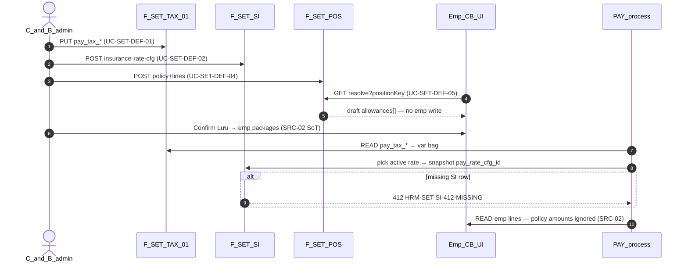

# PO-HRM-SETTINGS-DEFAULTS-API-01 — API_DESIGN F.1 · Settings defaults (tax · SI · position×PC)

| Field | Value |
|-------|--------|
| **work_item_id** | `PO-HRM-SETTINGS-DEFAULTS-API-01` |
| **parent** | `PO-HRM-SETTINGS-DEFAULTS-DATA-01` |
| **lane** | governance · sa |
| **change_mode** | **ADD** F-SET-TAX/SI/POS · **EXPAND** process consumer contracts (read/snapshot only) · **NO CODE** `apps/**` · **no seed** |
| **date** | 2026-08-07 |
| **status** | **CONFIRMED** — unblocks `PO-HRM-SETTINGS-DEFAULTS-BE-01` |
| **ref_data** | [`PO-HRM-SETTINGS-DEFAULTS-DATA-01`](./PO-HRM-SETTINGS-DEFAULTS-DATA-01.md) §2–§7 · [`po-hrm-settings-defaults-data-01`](../../qa/evidence/po-hrm-settings-defaults-data-01.md) |
| **ref_ba** | [`po-hrm-amis-parity-settings-defaults-ba-01`](../../qa/evidence/po-hrm-amis-parity-settings-defaults-ba-01.md) **UC-SET-DEF-01..06** · **BR-AMIS-SET-DEF-01..08** · **AC-AMIS-SET-*** |
| **ref_peer** | [`PO-HRM-ALLOWANCE-CATALOG-SYNC-API-01`](./PO-HRM-ALLOWANCE-CATALOG-SYNC-API-01.md) scope · orphan `HRM-ALLOW-CAT-ORPHAN-CODE` · [`F-CORE-CTR-CFG-01`](./PO-HRM-CONTRACT-LEGAL-PRINT-XEVN-TPL-API-01.md) KV pattern |
| **ref_adr** | [`ADR-HRM-DYNAMIC-CONFIG-PLATFORM`](../../architecture/ADR-HRM-DYNAMIC-CONFIG-PLATFORM.md) Option B L1/L6 |
| **honesty** | `payroll_e2e_ready=false` · no AMIS parity DONE · U65 zero-seed |
| **must_keep** | **SRC-02** emp C&B wins · resolve **read-only** prefill · SI missing → **412** not silent 0% · soft-delete · scope_parity U19 · open `pay_tax_*` / `insurance_type_key` · dual SoT `component_code` |
| **ack_status** | **PASS_TO_PM** |

---

## 0. Objective & path strategy

Deepen **Settings defaults** (AMIS Step1 class: thuế · BH · PC theo vị trí) as **authoritative CRUD** under Settings vertical — per DATA **CONFIRMED** [`PO-HRM-SETTINGS-DEFAULTS-DATA-01`](./PO-HRM-SETTINGS-DEFAULTS-DATA-01.md). Consumers: hire C&B **prefill** (POS-05) · PAY process **read tax KV + snapshot SI** — **never** silent policy overwrite of emp C&B (**BR-AMIS-PAY-SRC-02** / **BR-AMIS-SET-DEF-05**).

| Lock | Rule |
|------|------|
| **Prefix** | **ADD** `/api/hrm/settings/*` for tax KV alias · SI CFG · position policies — Settings vertical; **not** payroll write SoT |
| **Tax physical** | **ONE** table `hrm_company_settings` — Settings mount **aliases** same SoT as CTR `F-CORE-CTR-CFG-01` (`/contracts-insurance/company-settings`); keys partitioned by `setting_key` prefix (`pay_tax_*` vs `contract_number_*` / leave) |
| **Scope resolver** | `resolveHrmSettingsCatalogCompanyId` (main→holding) **same** as ALLOW-CAT / settings-catalogs · list/get/mutate/resolve **scope_parity U19** |
| **SRC-02** | **F-SET-POS-05** = **GET draft only** — **FORBIDDEN** INSERT/UPDATE `employee_compensation_*` · **FORBIDDEN** PROCESS to apply policy amounts over emp lines |
| **SI honesty** | Process/resolver missing active rate → **412** `HRM-SET-SI-412-MISSING` — **cấm** invent 0% (**V-13** · **UC-SET-DEF-06**) |
| **Envelope** | `{ code, message, data }` · camelCase DTO wire |
| **Auth** | Same HRM JWT / membership as Settings catalogs · C&B admin for mutate |
| **Soft-delete** | Retire / `archived_at` only — **409** on hard DELETE (**BR-AMIS-SET-DEF-07**) |

---

## 1. Capability map

| Cap | F-id | METHOD / path | UC / BR / AC |
|-----|------|---------------|--------------|
| Tax KV get/put (+ prefix list) | **F-SET-TAX-01** | `GET/PUT /api/hrm/settings/company-settings` · `GET …?prefix=pay_tax_` | **UC-SET-DEF-01** · **BR-AMIS-SET-DEF-01** · **AC-AMIS-SET-TAX-01** |
| SI list / get | **F-SET-SI-01** | `GET /api/hrm/settings/insurance-rate-cfg` · `GET …/{id}` | **UC-SET-DEF-02/06** · **AC-AMIS-SET-SI-01** read |
| SI create version | **F-SET-SI-02** | `POST /api/hrm/settings/insurance-rate-cfg` | **BR-AMIS-SET-DEF-02** |
| SI patch / retire | **F-SET-SI-03** | `PATCH …/{id}` · `POST …/{id}/retire` | **BR-AMIS-SET-DEF-07** |
| Position policy list/get | **F-SET-POS-01** | `GET /api/hrm/settings/position-compensation-policies` · `GET …/{id}` | **UC-SET-DEF-04** |
| Position policy create | **F-SET-POS-02** | `POST …` (header+lines TX) | **BR-AMIS-SET-DEF-04** · **AC-AMIS-SET-POS-01** |
| Position policy update | **F-SET-POS-03** | `PATCH …/{id}` · lines replace | Same |
| Position policy retire | **F-SET-POS-04** | `POST …/{id}/retire` | **BR-AMIS-SET-DEF-07** |
| Prefill resolve (read-only) | **F-SET-POS-05** | `GET …/resolve?positionKey=&asOf=&ouId=&company_id=` | **UC-SET-DEF-05** · **AC-AMIS-SET-POS-01/02** · **SRC-02** |

**Process consumer (not new Settings F-id — contract lock):**

| Consumer | Behavior |
|----------|----------|
| PAY formula / process var bag | **READ** `pay_tax_*` via same KV service — **FORBIDDEN** Nest hardcoded GTGC (**VAL-SET-TAX-04**) |
| PAY process SI | Pick active `pay_insurance_rate_cfg` · snapshot `pay_rate_cfg_id` + copied % · missing → **412** |
| PAY process PC amounts | Emp C&B only — **must not** call POS-05 write path or apply policy amounts |

**Alias note:** `GET/PUT /api/hrm/contracts-insurance/company-settings` remains for CTR keys — **same physical table**; Settings mount accepts `pay_tax_*` (+ optional future shared keys). BE **may** share one `CompanySettingsService`.

---

## 2. Shared DTOs

### 2.1 CompanySettingRow (tax / KV)

| DTO field | DB (`hrm_company_settings`) | Notes |
|-----------|----------------------------|-------|
| `id` | `id` | uuid |
| `companyId` | `company_id` | Plane B slug (holding when main JWT) |
| `settingKey` | `setting_key` | open registry — starter `pay_tax_*` |
| `value` | `value_json` | typed per key §2.2 |
| `archivedAt` | `archived_at` | soft |
| `updatedAt` / `updatedBy` | timestamps / actor | |
| `meta` | *(computed)* | e.g. `{ cta?: string }` when value null |

### 2.2 `pay_tax_*` value shapes (VAL-SET-TAX-01)

| `settingKey` | `value` JSON | Required fields |
|--------------|--------------|-----------------|
| `pay_tax_personal_deduction_vnd` | `{ amount: number≥0, currency: "VND" }` | amount, currency |
| `pay_tax_dependent_deduction_vnd` | `{ amount: number≥0, currency: "VND" }` | amount, currency |
| `pay_tax_regime` | `{ code: "progressive_vn"\|"other", note?: string }` | code |
| `pay_tax_flags` | `{ applyPersonalDeduction: boolean, applyDependentDeduction: boolean }` | both flags |

Wire may accept snake_case aliases on write; response **camelCase**. Unknown `pay_tax_*` key with invalid shape → **400** `HRM-SET-TAX-400-SHAPE`. Open registry — **cấm** closed CHECK on key set (**BR-PLT-05** class).

### 2.3 InsuranceRateCfgRow

| DTO field | DB (`pay_insurance_rate_cfg`) | Notes |
|-----------|-------------------------------|-------|
| `id` | `id` | |
| `companyId` | `company_id` | |
| `ouId` | `ou_id` | null = company-wide |
| `insuranceTypeKey` | `insurance_type_key` | open catalog (`BHXH`/`BHYT`/`BHTN`/…) |
| `employeeRatePct` | `employee_rate_pct` | numeric — explicit 0 allowed if saved |
| `employerRatePct` | `employer_rate_pct` | |
| `ceilingAmount` | `ceiling_amount` | nullable |
| `currency` | `currency` | default `VND` |
| `effectiveFrom` | `effective_from` | date |
| `effectiveTo` | `effective_to` | nullable |
| `status` | `status` | `draft`\|`active`\|`retired` |
| `version` | `version` | |
| `supersedesId` | `supersedes_id` | |
| `notes` | `notes` | |
| `archivedAt` | `archived_at` | |
| `createdAt` / `updatedAt` | timestamps | |
| `createdBy` / `updatedBy` | actor | |

### 2.4 PositionCompensationPolicyRow (+ lines)

| DTO field | DB | Notes |
|-----------|-----|-------|
| `id` | header.`id` | |
| `companyId` | `company_id` | |
| `ouId` | `ou_id` | nullable |
| `positionKey` | `position_key` | catalog soft key |
| `positionLabelSnapshot` | `position_label_snapshot` | display denorm ≠ SoT |
| `nameVi` | `name_vi` | optional title |
| `effectiveFrom` / `effectiveTo` | dates | |
| `status` | `status` | |
| `archivedAt` | `archived_at` | |
| `lines` | join `_lines` | array §2.5 |
| timestamps / actors | as DATA | |

### 2.5 PositionCompensationPolicyLineRow

| DTO field | DB (`…_policy_lines`) | Notes |
|-----------|----------------------|-------|
| `id` | `id` | |
| `policyId` | `policy_id` | |
| `componentCode` | `component_code` | dual SoT |
| `salaryComponentId` | `salary_component_id` | soft |
| `allowanceTypeId` | `allowance_type_id` | soft |
| `amount` | `amount` | ≥0 |
| `calcMode` | `calc_mode` | `fixed`\|`formula`\|`rate` — GĐ1 prefer `fixed` |
| `currency` | `currency` | |
| `sortOrder` | `sort_order` | |
| `archivedAt` | `archived_at` | |
| `componentNameVi` | *(join display)* | optional from PC/SC |

### 2.6 PositionPrefillDraft (POS-05 response)

| Field | Type | Notes |
|-------|------|-------|
| `companyId` | string | resolved scope |
| `ouId` | string\|null | query echo |
| `positionKey` | string | |
| `asOf` | date | |
| `policyId` | uuid\|null | matched header or null |
| `policyStatus` | string\|null | |
| `lines` | `PrefillLine[]` | draft only |
| `warnings` | string[] | e.g. no policy · retired PC codes |

`PrefillLine`: `{ componentCode, amount, calcMode, currency, salaryComponentId?, allowanceTypeId?, source: "position_policy" }`

**Invariant:** Response **never** includes `employeePackageId` write ack — FE must call emp C&B mutate separately after confirm.

---

## 3. API_DESIGN F.1 — F-SET-*

### 3.1 F-SET-TAX-01 — Company tax params (KV)

| | |
|--|--|
| **METHOD / path** | `GET /api/hrm/settings/company-settings?company_id=&key=` · `GET …?company_id=&prefix=pay_tax_` · `PUT /api/hrm/settings/company-settings` |
| **Mục đích** | Đọc/ghi thông số thuế mặc định pháp nhân (`pay_tax_*`) — Settings Lương — **không** hardcode FE/Nest GTGC (**UC-SET-DEF-01** · **BR-AMIS-SET-DEF-01** · **AC-AMIS-SET-TAX-01**). |
| **Nghiệp vụ xử lý** | (1) Auth + `resolveHrmSettingsCatalogCompanyId` (main→holding persist slug). (2) **GET by key:** load `(company_id, setting_key)` where `archived_at IS NULL`; missing → **200** `{ settingKey, value: null, meta: { cta: "…" } }` — **not** 404 (**VAL-SET-TAX-03** · CTR CFG pattern). (3) **GET prefix=`pay_tax_`:** list non-archived keys matching prefix; empty → **200** `items=[]`. (4) **PUT:** body `{ companyId, settingKey, value }` — validate shape per §2.2 → else **400** `HRM-SET-TAX-400-SHAPE` (**VAL-SET-TAX-01**); amounts finite ≥0 (**VAL-SET-TAX-02**). (5) UPSERT `hrm_company_settings` UQ `(tenant_id, company_id, setting_key)`. (6) Reject PUT of CTR/leave keys on this Settings tax UX with wrong shape — OR allow any key if shared service: document that Settings tax UI only sends `pay_tax_*`; CTR mount remains SoT for contract keys (**must_keep** leave/CTR keys intact). (7) Soft-archive optional `POST …/company-settings/archive` GĐ1.5 — not required; PATCH archive via PUT null not preferred. (8) **scope_parity:** GET/PUT same resolver (**AC-AMIS-SET-SCOPE-01**). |
| **Tham chiếu bước SRS / AC** | **UC-SET-DEF-01** Diễn biến: Settings → Lương → Thông số thuế → sửa key → Lưu 2xx → F5 · **AC-AMIS-SET-TAX-01** · **BR-AMIS-SET-DEF-01** · **AC-PLT-SET-01** KV discipline · DATA §2 |
| **Request PUT → DB** | `{ companyId, settingKey, value }` → `company_id`, `setting_key`, `value_json` |
| **Response** | `200` `HRM-SET-TAX-200` + CompanySettingRow · list: `{ items: CompanySettingRow[] }` |
| **Lỗi** | `HRM-SET-TAX-400-SHAPE` · `HRM-VAL-001` empty body · scope 403/409 · `HRM-AUTH-001` |

**Process read contract (EXPAND note):** Formula/process services **must** call shared KV reader — if required key missing when tax calc enabled → **412** `HRM-SET-TAX-412-MISSING` (**VAL-SET-TAX-04**) — **cấm** Nest const fallback.

---

### 3.2 F-SET-SI-01 — List / get insurance rate CFG

| | |
|--|--|
| **METHOD / path** | `GET /api/hrm/settings/insurance-rate-cfg` · `GET /api/hrm/settings/insurance-rate-cfg/{id}` |
| **Mục đích** | Trả master tỷ lệ BHXH/BHYT/BHTN (+ trần) theo pháp nhân/OU — Settings BH — **≠** enrollment `hrm_insurance_rate_period` (**UC-SET-DEF-02** · **AC-AMIS-SET-SI-01** read). |
| **Nghiệp vụ xử lý** | (1) Scope resolve. (2) List filters: `insurance_type_key?`, `ou_id?` (`ou_id=` empty → company-wide only; omit → all in company), `status?` (default exclude `retired` unless `include_retired=true`), `as_of?` date (optional effective window filter). (3) Sort: `insurance_type_key`, `effective_from DESC`. (4) Empty → **200** `items=[]` honest. (5) **Get-by-id:** same scope predicate as list — OOS → **404** `HRM-SET-SI-404` (**VAL-SET-SI-04** · U19). (6) **Do not** join/mutate enrollment period table. |
| **Tham chiếu bước SRS / AC** | **UC-SET-DEF-02** F5 list · **UC-SET-DEF-06** process pick · **BR-AMIS-SET-DEF-02/06** · DATA §3 |
| **Request (query)** | `company_id` · `insurance_type_key?` · `ou_id?` · `status?` · `as_of?` · `include_retired?` · `page?` · `page_size?` |
| **Response** | `200` `HRM-SET-SI-200` + `{ items: InsuranceRateCfgRow[], total? }` or single row |
| **Lỗi** | `HRM-SET-SI-404` · scope · `HRM-AUTH-001` |

---

### 3.3 F-SET-SI-02 — Create insurance rate CFG (version)

| | |
|--|--|
| **METHOD / path** | `POST /api/hrm/settings/insurance-rate-cfg` |
| **Mục đích** | C&B tạo phiên bản tỷ lệ BH mới (effective-dated) — khóa % + trần cho kỳ lương sau đó snapshot (**BR-AMIS-SET-DEF-02** · **AC-AMIS-SET-SI-01**). |
| **Nghiệp vụ xử lý** | (1) Scope persist slug. (2) Require `insuranceTypeKey`, `employeeRatePct`, `employerRatePct`, `effectiveFrom`; rates ≥0 finite (**CHK**). (3) Open `insuranceTypeKey` — format slug only — **cấm** closed enum CHECK. (4) Optional `ouId`, `ceilingAmount`, `currency`, `notes`, `status` (default `active`), `supersedesId`. (5) **Overlap assert:** no two `active` non-archived rows same `(company_id, coalesce(ou_id,''), insurance_type_key)` overlapping `[from,to)` → **409** `HRM-SET-SI-409-OVERLAP` (**VAL-SET-SI-01**). (6) Date CHK `effective_to > effective_from` or null (**VAL-SET-SI-02**). (7) Optional: when creating active superseding prior open row — set prior `effective_to` + link `supersedes_id` in same TX. (8) INSERT; return display-ready row. (9) Explicit `employeeRatePct=0` / `employerRatePct=0` **allowed** when admin saves — still **not** a license for process to invent missing rows as 0. |
| **Tham chiếu bước SRS / AC** | **UC-SET-DEF-02** happy «thêm/sửa row → Lưu → F5» · **AC-AMIS-SET-SI-01** · **BR-AMIS-SET-DEF-02** · DATA §3.2 |
| **Request → DB** | Body → INSERT `pay_insurance_rate_cfg` |

| DTO (body) | DB | Required |
|------------|-----|----------|
| `companyId` | `company_id` | yes |
| `ouId` | `ou_id` | no |
| `insuranceTypeKey` | `insurance_type_key` | yes |
| `employeeRatePct` | `employee_rate_pct` | yes |
| `employerRatePct` | `employer_rate_pct` | yes |
| `ceilingAmount` | `ceiling_amount` | no |
| `currency` | `currency` | default VND |
| `effectiveFrom` | `effective_from` | yes |
| `effectiveTo` | `effective_to` | no |
| `status` | `status` | default `active` |
| `supersedesId` | `supersedes_id` | no |
| `notes` | `notes` | no |

| **Response** | `201` `HRM-SET-SI-201` + InsuranceRateCfgRow |
| **Lỗi** | §6 taxonomy |

---

### 3.4 F-SET-SI-03 — Patch / retire insurance rate CFG

| | |
|--|--|
| **METHOD / path** | `PATCH /api/hrm/settings/insurance-rate-cfg/{id}` · `POST …/{id}/retire` |
| **Mục đích** | Sửa draft/metadata hoặc **ngừng** phiên bản — prefer **new version** (SI-02) for mid-flight % change; soft retire preserves snapshot integrity (**BR-AMIS-SET-DEF-07**). |
| **Nghiệp vụ xử lý — PATCH** | (1) Scope assert U19. (2) Prefer allowing patch on `draft` / notes / ceiling / close `effectiveTo`; **discourage** mutating rates on already-processed periods — BE **may** reject rate change on `active` with issued payslip refs → recommend SI-02 new version (**GĐ1 guidance**). (3) Re-run overlap if dates/status change (**VAL-SET-SI-01**). (4) Empty body → `HRM-VAL-001`. |
| **Nghiệp vụ xử lý — retire** | (1) Scope assert. (2) `status=retired`, `archived_at=now()`. (3) **FORBIDDEN** hard DELETE → **409** `HRM-SET-SI-409-HARD-DELETE` (**VAL-SET-SI-05**). (4) Issued payslip `pay_rate_cfg_id` snapshots **must_keep**. |
| **Tham chiếu bước SRS / AC** | **UC-SET-DEF-02** alternate version · **BR-AMIS-SET-DEF-07** · **AC-PLT-SET-02** class |
| **Response** | `200` `HRM-SET-SI-200` + row / `{ id, status: 'retired' }` |

**Process pick (EXPAND — PAY wave implements):** Given `company_id`, optional `ou_id`, `insurance_type_key`, period `[start,end]`: select `active` non-archived where `effective_from ≤ period.end` and (`effective_to IS NULL OR effective_to > period.start`); **OU row wins** else company-wide (`ou_id IS NULL`). Zero matches → **412** `HRM-SET-SI-412-MISSING` — **cấm** silent 0% (**VAL-SET-SI-03** · **UC-SET-DEF-06** · **V-13**).

---

### 3.5 F-SET-POS-01 — List / get position compensation policies

| | |
|--|--|
| **METHOD / path** | `GET /api/hrm/settings/position-compensation-policies` · `GET …/{id}` |
| **Mục đích** | Trả chính sách PC mặc định theo vị trí (+ lines) cho admin C&B map AMIS Step1 (**UC-SET-DEF-04**). |
| **Nghiệp vụ xử lý** | (1) Scope resolve. (2) Filters: `position_key?`, `ou_id?`, `status?`, `as_of?`, `include_retired?`. (3) Default exclude retired/archived. (4) Include non-archived `lines` ordered by `sort_order`. (5) Empty → **200** `[]`. (6) Get-by-id same scope — OOS **404** `HRM-SET-POS-404` (**VAL-SET-POS-06** / U19). |
| **Tham chiếu bước SRS / AC** | **UC-SET-DEF-04** · **BR-AMIS-SET-DEF-04/06** · **AC-AMIS-SET-SCOPE-01** · DATA §4 |
| **Response** | `200` `HRM-SET-POS-200` + `{ items: PositionCompensationPolicyRow[] }` or single |

---

### 3.6 F-SET-POS-02 — Create policy (header + lines TX)

| | |
|--|--|
| **METHOD / path** | `POST /api/hrm/settings/position-compensation-policies` |
| **Mục đích** | Tạo map vị trí → danh sách PC + amount (prefill hire) — single Lưu header+lines (**BR-AMIS-SET-DEF-04** · **AC-AMIS-SET-POS-01**). |
| **Nghiệp vụ xử lý** | **BEGIN TX.** (1) Scope. (2) Require `positionKey`, `effectiveFrom`; validate `positionKey` ∈ effective job_titles/positions catalog → else **400** `HRM-SET-POS-400-KEY` (**VAL-SET-POS-01** · **BR-HRM-MD-01**). (3) Snapshot `positionLabelSnapshot` from catalog. (4) UQ active `(company_id, coalesce(ou_id,''), lower(position_key))` → **409** `HRM-SET-POS-409-ACTIVE`. (5) For each line: require `componentCode`, `amount`≥0; **VAL-SET-POS-COMP-01:** if active PC catalog count > 0 → code must exist in active `hrm_allowance_deduction_types` **OR** active `salary_components` same company → else **400** `HRM-ALLOW-CAT-ORPHAN-CODE` (**VAL-SET-POS-02** · peer ALLOW-CAT). (6) Soft-resolve optional `salaryComponentId` / `allowanceTypeId`. (7) UQ line `(policy_id, lower(component_code))` (**VAL-SET-POS-03**). (8) INSERT header + lines; **COMMIT**. (9) **Do not** touch emp C&B. |
| **Tham chiếu bước SRS / AC** | **UC-SET-DEF-04** happy · **AC-AMIS-SET-POS-01** · **BR-AMIS-SET-DEF-03/04/08** · **BR-PLT-02** |
| **Request → DB** | Body → header + lines |

| DTO (body) | DB | Required |
|------------|-----|----------|
| `companyId` | header.`company_id` | yes |
| `ouId` | `ou_id` | no |
| `positionKey` | `position_key` | yes |
| `nameVi` | `name_vi` | no |
| `effectiveFrom` / `effectiveTo` | dates | from yes |
| `status` | `status` | default `active` |
| `lines[]` | `_lines` | ≥0; empty policy allowed with CTA |
| `lines[].componentCode` | `component_code` | yes per line |
| `lines[].amount` | `amount` | yes |
| `lines[].calcMode` | `calc_mode` | default `fixed` |
| `lines[].sortOrder` | `sort_order` | optional |

| **Response** | `201` `HRM-SET-POS-201` + PositionCompensationPolicyRow |
| **Lỗi** | §6 |

---

### 3.7 F-SET-POS-03 — Update policy / replace lines

| | |
|--|--|
| **METHOD / path** | `PATCH /api/hrm/settings/position-compensation-policies/{id}` |
| **Mục đích** | Sửa header và/hoặc **replace** active lines — không đụng emp đã lưu (**SRC-02**). |
| **Nghiệp vụ xử lý** | (1) Scope assert. (2) Partial header patch. (3) If `lines` provided: soft-archive prior lines + INSERT new set in TX (or upsert by component_code) — re-validate orphan/UQ. (4) Position key change → re-validate catalog + UQ active. (5) Empty body → `HRM-VAL-001`. |
| **Tham chiếu bước SRS / AC** | **UC-SET-DEF-04** · **BR-AMIS-SET-DEF-04/05** |
| **Response** | `200` `HRM-SET-POS-200` + row |

---

### 3.8 F-SET-POS-04 — Retire policy

| | |
|--|--|
| **METHOD / path** | `POST /api/hrm/settings/position-compensation-policies/{id}/retire` |
| **Mục đích** | Ngừng chính sách vị trí — soft header (+ lines archive) — **cấm** hard delete (**BR-AMIS-SET-DEF-07**). |
| **Nghiệp vụ xử lý** | (1) Scope. (2) `status=retired`, `archived_at=now()`; soft-archive lines. (3) Hard DELETE → **409**. (4) Emp packages already saved **unchanged**. |
| **Tham chiếu bước SRS / AC** | **BR-AMIS-SET-DEF-07** · **AC-PLT-SET-02** class |
| **Response** | `200` + `{ id, status: 'retired' }` |

---

### 3.9 F-SET-POS-05 — Resolve prefill draft (**read-only**)

| | |
|--|--|
| **METHOD / path** | `GET /api/hrm/settings/position-compensation-policies/resolve?company_id=&positionKey=&asOf=&ouId=` |
| **Mục đích** | Hệ thống/C&B **gợi ý** dòng PC khi tuyển / đổi vị trí — trả draft cho form C&B; **admin xác nhận Lưu** riêng (**UC-SET-DEF-05** · **AC-AMIS-SET-POS-01**). |
| **Nghiệp vụ xử lý** | (1) Scope resolve — **same** as list (**U19**). (2) Require `positionKey`, `asOf` (default today). (3) Pick active non-archived header: match `position_key`, effective window contains `asOf`; **OU override wins** else company-wide (`ou_id IS NULL`) — align SI OU rule. (4) Build `PrefillLine[]` from non-archived lines; skip/warn retired PC codes (**VAL-SET-POS-07**). (5) **No policy** → **200** `{ policyId: null, lines: [], warnings: ["NO_POLICY"] }` — honest empty suggest (**UC-SET-DEF-05** exception). (6) **FORBIDDEN:** INSERT/UPDATE `employee_compensation_packages` / `…_lines` / `allowances_json` (**VAL-SET-POS-04**). (7) **FORBIDDEN:** PAY process calling this endpoint to overwrite emp amounts (**VAL-SET-POS-05** · **AC-AMIS-SET-POS-02** · **SRC-02**). (8) Optional query `employeeId` **may** return `diffHints` vs current emp lines (suggest-only) — still **no write**. |
| **Tham chiếu bước SRS / AC** | **UC-SET-DEF-05** Diễn biến prefill → C&B confirm · **BR-AMIS-SET-DEF-05** · **BR-AMIS-PAY-SRC-02** · **AC-AMIS-SET-POS-01/02** · DATA §4.3 |
| **Response** | `200` `HRM-SET-POS-200` + PositionPrefillDraft |
| **Lỗi** | `HRM-SET-POS-400-KEY` if positionKey not in catalog · scope · **never** 412 for missing policy (empty OK) |

---

## 4. Error taxonomy

| Code | HTTP | When |
|------|------|------|
| `HRM-SET-TAX-200` | 200 | Tax GET/PUT OK |
| `HRM-SET-TAX-400-SHAPE` | 400 | Invalid value_json / negative (**VAL-SET-TAX-01/02**) |
| `HRM-SET-TAX-412-MISSING` | 412 | Process required tax key absent (**VAL-SET-TAX-04**) — not Settings GET |
| `HRM-SET-SI-200` / `201` | 200/201 | SI read/create OK |
| `HRM-SET-SI-404` | 404 | Id OOS / not found |
| `HRM-SET-SI-409-OVERLAP` | 409 | Active window overlap (**VAL-SET-SI-01**) |
| `HRM-SET-SI-409-HARD-DELETE` | 409 | Hard DELETE (**VAL-SET-SI-05**) |
| `HRM-SET-SI-412-MISSING` | 412 | Process pick no active rate (**VAL-SET-SI-03**) — **cấm** silent 0% |
| `HRM-SET-POS-200` / `201` | 200/201 | Policy OK |
| `HRM-SET-POS-404` | 404 | Id OOS |
| `HRM-SET-POS-400-KEY` | 400 | Free-text / unknown position (**VAL-SET-POS-01**) |
| `HRM-SET-POS-409-ACTIVE` | 409 | Duplicate active header |
| `HRM-SET-POS-409-LINE` | 409 | Duplicate line code (**VAL-SET-POS-03**) |
| `HRM-ALLOW-CAT-ORPHAN-CODE` | 400 | Line component orphan when catalog ≠ ∅ (**VAL-SET-POS-02**) |
| `HRM-VAL-001` | 400 | Empty PATCH |
| `HRM-AUTH-001` | 401 | Unauthorized |
| `HRM-SCOPE-409` / 403 | 409/403 | Scope ladder (**AC-AMIS-SET-SCOPE-01**) |

---

## 5. Validation matrix (API)

| ID | Condition | Expected |
|----|-----------|----------|
| **VAL-SET-TAX-01** | Invalid shape | 400 `HRM-SET-TAX-400-SHAPE` |
| **VAL-SET-TAX-02** | Negative amount | 400 |
| **VAL-SET-TAX-03** | Missing key GET | 200 `value: null` |
| **VAL-SET-TAX-04** | Process without required registry | 412 `HRM-SET-TAX-412-MISSING` — no Nest const |
| **VAL-SET-SI-01** | Overlap active | 409 `HRM-SET-SI-409-OVERLAP` |
| **VAL-SET-SI-02** | Bad dates | 400 |
| **VAL-SET-SI-03** | Process missing rate | **412** `HRM-SET-SI-412-MISSING` |
| **VAL-SET-SI-04** | List vs get scope | scope_parity jest |
| **VAL-SET-SI-05** | Hard DELETE | 409 |
| **VAL-SET-POS-01** | Bad position_key | 400 `HRM-SET-POS-400-KEY` |
| **VAL-SET-POS-02** | Orphan component_code | 400 `HRM-ALLOW-CAT-ORPHAN-CODE` |
| **VAL-SET-POS-03** | Dup line code | 409 |
| **VAL-SET-POS-04** | POS-05 writes emp | **FORBIDDEN** — no emp mutate in Settings service |
| **VAL-SET-POS-05** | PROCESS uses policy over emp | **FORBIDDEN** SRC-02 |
| **VAL-SET-POS-06** | Member sees holding-only | Own slug (**AC-AMIS-SET-SCOPE-01**) |
| **VAL-SET-POS-07** | Retire PC with policy lines | Policy retire/allow + warn; picker hide (**VAL-ALLOW-07** reuse) |

---

## 6. scope_parity (U19)

| Cap | List | Get / mutate / resolve |
|-----|------|------------------------|
| F-SET-TAX-01 | prefix list by `company_id` | GET key / PUT same `resolveHrmSettingsCatalogCompanyId` |
| F-SET-SI-01..03 | list scoped | get/PATCH/retire same predicate |
| F-SET-POS-01..04 | list scoped | get/PATCH/retire same |
| F-SET-POS-05 | — | resolve uses **identical** company/OU resolver as list |

Deep link holding rollup iff peer Settings catalogs allow — member CEO isolation per ADR scope ladder.

---

## 7. Traceability

| Requirement | API | QA (later) |
|-------------|-----|------------|
| **BR-AMIS-SET-DEF-01** · **AC-AMIS-SET-TAX-01** | F-SET-TAX-01 | Settings đổi GTGC → F5 → var bag |
| **BR-AMIS-SET-DEF-02** · **AC-AMIS-SET-SI-01** | F-SET-SI-02/01 · process 412 | % + ceiling snapshot ≠ silent 0 |
| **BR-AMIS-SET-DEF-03/08** · **BR-PLT-02** | F-SET-POS-02 orphan assert | peer ALLOW-CAT |
| **BR-AMIS-SET-DEF-04** · **AC-AMIS-SET-POS-01** | F-SET-POS-02 + **05** | Hire prefill → C&B confirm |
| **BR-AMIS-SET-DEF-05** · **SRC-02** · **AC-AMIS-SET-POS-02** | F-SET-POS-05 read-only lock | Process = emp Y not policy X |
| **BR-AMIS-SET-DEF-06** · **AC-AMIS-SET-SCOPE-01** | all F-SET | Member vs holding |
| **BR-AMIS-SET-DEF-07** | SI-03 / POS-04 retire | Soft only |
| **UC-SET-DEF-01..06** | F-SET-TAX/SI/POS-* | **J-HRM-SET-DEF-01/02** |
| **V-13** | SI-412 | no silent 0% |

---

## 8. Dev unlock · BE prerequisites

| Prerequisite | Owner |
|--------------|-------|
| ensureSchema EXPAND `hrm_company_settings` usage for `pay_tax_*` (table LIVE — keys only) | dev-be |
| ensureSchema ADD `pay_insurance_rate_cfg` per DATA §3 | dev-be |
| ensureSchema ADD `hrm_position_compensation_policy` + `_lines` per DATA §4 | dev-be |
| `SettingsTaxParamsService` (or shared CompanySettings) GET/PUT + shape Zod/class-validator | dev-be |
| `InsuranceRateCfgService` CRUD + overlap + process pick helper → 412 | dev-be |
| `PositionCompensationPolicyService` CRUD TX + resolve read-only | dev-be |
| Controllers under `/api/hrm/settings/…` | dev-be |
| jest: VAL-SET-TAX/SI/POS · scope_parity list↔get↔resolve · POS-05 no emp write spy · SI missing→412 | dev-be |
| `@CODE-MEMORY` APPEND on new modules | dev-be |

| Gate | After this seat |
|------|-----------------|
| SA F.1 F-SET-* | **YES — this file** |
| **dev-be** `PO-HRM-SETTINGS-DEFAULTS-BE-01` | **UNLOCKED** |
| PAY process SI/tax wire | Residual PAY wave (R4 DATA) — snapshot + 412 |
| dev-fe Settings surfaces | After BE smoke |
| `payroll_e2e_ready` | Remains **false** |

---

## 9. must_keep · forbidden

| must_keep | forbidden |
|-----------|-----------|
| SRC-02 emp C&B wins on PROCESS | POS-05 or process silent overwrite emp amounts |
| Prefill-only GĐ1 | Auto-save hire without C&B confirm |
| SI missing → 412 | Silent 0% employer/employee |
| Soft-delete retire | Hard DELETE rate/policy |
| Open tax keys / insurance_type_key | Closed CHECK IN forever |
| Dual SoT component_code when catalog ≠ ∅ | Free-text SoT codes |
| CTR + leave settings keys intact | Relocate leave/CTR into pay blob wipe |
| U65 zero-seed | Seed rates/policies for UF PASS |
| `payroll_e2e_ready=false` | Claim Step1 / AMIS DONE |

---

## 10. Non-claims · residual

| # | Item | Owner |
|---|------|-------|
| R1 | BE ensureSchema + CRUD + jest | **dev-be** `PO-HRM-SETTINGS-DEFAULTS-BE-01` |
| R2 | FE Settings tax/SI/position U65 | dev-fe |
| R3 | PROCESS snapshot wire + SI 412 honesty live | PAY formula/process wave |
| R4 | Client DOC-DELTA `API_DESIGN_HRM_ENTERPRISE.md` §Settings | ba-docs optional |
| R5 | Group holding publish tax/SI/PC GĐ2 | pm |
| R6 | Runtime policy fallback P2 | sponsor waiver only |

**Non-claims:** No `apps/**` · no migrate this seat · no Settings UI LIVE · no payroll UAT · no AMIS parity DONE.

---

## ack_status

**PASS_TO_PM**
