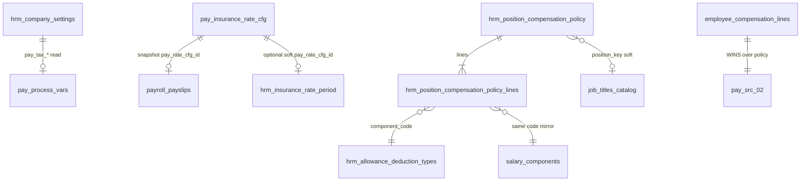

# PO-HRM-SETTINGS-DEFAULTS-DATA-01 — Physical Settings defaults (tax · SI · position×PC)

| Field | Value |
|-------|--------|
| **work_item_id** | `PO-HRM-SETTINGS-DEFAULTS-DATA-01` |
| **parent** | `PO-HRM-AMIS-PARITY-SETTINGS-DEFAULTS-BA-01` |
| **prior** | `PO-HRM-ALLOWANCE-CATALOG-SYNC-01` **CONFIRMED** · `PO-HRM-ALLOWANCE-CATALOG-SYNC-API-01` **CONFIRMED** · ADR Option **B** |
| **lane** | governance · ba-data |
| **change_mode** | **EXPAND** `hrm_company_settings` keys `pay_tax_*` · **ADD** `pay_insurance_rate_cfg` · **ADD** `hrm_position_compensation_policy` + `_lines` |
| **date** | 2026-08-07 |
| **status** | **CONFIRMED** — unlocks SA `PO-HRM-SETTINGS-DEFAULTS-API-01` then BE |
| **spec_ref** | **BR-AMIS-SET-DEF-01..08** · **UC-SET-DEF-01..06** · **AC-AMIS-SET-TAX-01** · **AC-AMIS-SET-SI-01** · **AC-AMIS-SET-POS-01/02** · **AC-AMIS-SET-SCOPE-01** · **BR-AMIS-PAY-SRC-02** · **BR-PLT-02/04/05** · ADR L1/L6 |
| **honesty** | `payroll_e2e_ready=false` · **cấm** `apps/**` · **cấm** migrate this seat · U65 zero-seed · **cấm** AMIS parity DONE |
| **ack_status** | **PASS_TO_PM** |

---

## 0. Verdict (machine-readable)

| Decision | Stamp |
|----------|--------|
| **Tax defaults** | **CONFIRMED EXPAND** registry keys on **LIVE** `public.hrm_company_settings` — prefix `pay_tax_*` · typed `value_json` · **cấm** Nest/FE magic constants |
| **SI company rates** | **CONFIRMED ADD** `public.pay_insurance_rate_cfg` (logical §5.4 DB_DESIGN → physical) — **≠** `hrm_insurance_rate_period` (employee enrollment timeline) |
| **Position × PC policy** | **CONFIRMED ADD** `hrm_position_compensation_policy` (header) + `hrm_position_compensation_policy_lines` |
| **component_code SoT** | Soft bind to **dual SoT** `hrm_allowance_deduction_types.code` ≡ `salary_components.code` (**BR-AMIS-SET-DEF-03** · VAL-ALLOW-08) |
| **position_key SoT** | Soft catalog key (job_titles / settings position family) — **cấm** free-text SoT (**BR-HRM-MD-01**) |
| **SRC-02 process win** | **CONFIRMED** — employee C&B effective line **wins**; position policy = **hire/đổi vị trí prefill only** GĐ1 (**not** silent PAY runtime override) |
| **Runtime fallback Q1** | **LOCKED GĐ1 = prefill-only** — missing emp line → process **warn/block** per PAY wave; **cấm** auto-apply policy amount on PROCESS (P2 only if sponsor waives later) |
| **Effective dating SI** | Versioned rows · overlap reject · process snapshot `pay_rate_cfg_id` — **cấm** silent 0% (**V-13** · **BR-AMIS-SET-DEF-02**) |
| **scope_parity U19** | List/get/mutate tax · SI · policy use **same** `resolveHrmListScope` / settings-catalog company resolve as peers |
| **soft-delete** | **CONFIRMED BR-AMIS-SET-DEF-07** — retire / `archived_at` — **cấm** hard-delete |
| **AS-IS keep** | `hrm_company_settings` CTR keys · leave ladder keys · `hrm_insurance_rate_period` enrollment · emp C&B packages/lines · ALLOW-CAT dual SoT |
| **Unlock** | **sa** `PO-HRM-SETTINGS-DEFAULTS-API-01` F.1 → **dev-be** ensureSchema + CRUD |

---

## 1. Problem & domain map

### 1.1 Gap (from BA-01)

| Surface | AS-IS | Gap |
|---------|-------|-----|
| Tax params | Sparse / CTR-only keys on `hrm_company_settings` | No `pay_tax_*` registry · FE/Nest may hardcode GTGC |
| SI master % | Paper `pay_insurance_rate_cfg` §5.4 · Nest **ABSENT** | Enrollment `hrm_insurance_rate_period` ≠ company master CFG |
| Position default PC | **ABSENT** table | Hire prefill + AMIS Step1 blocked |
| PC codes | ALLOW-CAT **CONFIRMED** dual SoT | Policy lines must consume `component_code` |

### 1.2 Ownership split (must_keep)

| Concern | SoT entity | Not SoT |
|---------|------------|---------|
| Company/OU tax defaults | `hrm_company_settings` `pay_tax_*` | Formula TEXT · FE const |
| Company SI % + ceiling | `pay_insurance_rate_cfg` | `hrm_insurance_rate_period` (per-enrollment append) |
| Position default PC matrix | `hrm_position_compensation_policy*` | Employee fixed PC amounts |
| Employee fixed PC (SRC-02) | `employee_compensation_packages/lines` | Position policy amounts at PROCESS |
| PC/KT kind + PAY code | `hrm_allowance_deduction_types` → mirror `salary_components` | Free-text component code |



---

## 2. CONFIRMED EXPAND — `hrm_company_settings` tax registry

### 2.1 AS-IS physical (Nest LIVE — keep)

| Column | Type | Notes |
|--------|------|-------|
| `id` | uuid | PK |
| `tenant_id` | text | default `xevn` |
| `company_id` | text | Plane B slug |
| `setting_key` | text | |
| `value_json` | jsonb | typed payload |
| `archived_at` | timestamptz | soft |
| UQ | `(tenant_id, company_id, setting_key)` | |

**Existing keys (must_keep):** `contract_number_org_suffix` · `contract_number_pattern` · `leave_l1_max_days` — **do not** relocate.

### 2.2 ADD keys — `pay_tax_*` registry (GĐ1)

> Open registry — **cấm** `CHECK (setting_key IN (...))` closed set. Starter keys below = bootstrap examples (**BR-PLT-05** class).

| `setting_key` | `value_json` shape | Ý nghĩa | Consumer |
|---------------|-------------------|---------|----------|
| `pay_tax_personal_deduction_vnd` | `{ "amount": number≥0, "currency": "VND" }` | Giảm trừ bản thân / GTGC base param | Formula var bag / process tax |
| `pay_tax_dependent_deduction_vnd` | `{ "amount": number≥0, "currency": "VND" }` | Giảm trừ người phụ thuộc (per dependent unit) | CORE dependents × rate |
| `pay_tax_regime` | `{ "code": "progressive_vn" \| "other", "note"?: string }` | Regime hint — **not** full TNCN engine | Display + future formula |
| `pay_tax_flags` | `{ "apply_personal_deduction": true, "apply_dependent_deduction": true }` | Feature toggles | Process |

**Optional GĐ1.5 (document only — SA may deepen):** `pay_tax_region_code`, `pay_tax_min_taxable_vnd` — ADD via same registry without migrate enum.

### 2.3 Rules

| ID | Rule |
|----|------|
| **VAL-SET-TAX-01** | Unknown `pay_tax_*` key with invalid JSON shape → 400 `HRM-SET-TAX-400-SHAPE` |
| **VAL-SET-TAX-02** | Amounts must be finite ≥0 — reject NaN / negative |
| **VAL-SET-TAX-03** | GET missing key → **200** `{ value: null }` + CTA meta (CTR CFG pattern) — **not** 404 |
| **VAL-SET-TAX-04** | PAY/formula **must** read registry — **FORBIDDEN** Nest hardcoded GTGC/deduction (**BR-AMIS-SET-DEF-01** · align SRC-05) |
| **VAL-SET-TAX-05** | Soft-archive key row allowed; issued payslip snapshots keep copied amounts |

---

## 3. CONFIRMED ADD — `pay_insurance_rate_cfg`

> Logical entity already in `DB_DESIGN_HRM_ENTERPRISE.md` §5.4 — Nest table **ABSENT** → physical **ADD**.  
> **≠** `hrm_insurance_rate_period` (per-employee enrollment append under `employee_insurances`).

| Column | Type | Null | Default | Ý nghĩa |
|--------|------|------|---------|---------|
| `id` | uuid | NO | gen_random_uuid() | PK |
| `tenant_id` | text | NO | `xevn` | |
| `company_id` | text | NO | | Plane B slug |
| `ou_id` | text | YES | | Optional OU override — null = company-wide (**Q2 GĐ1**) |
| `insurance_type_key` | text | NO | | Open catalog key: `BHXH` · `BHYT` · `BHTN` · tenant+ (**cấm** closed CHECK on key) |
| `employee_rate_pct` | numeric(8,4) | NO | | % NV — **cấm** silent 0 without explicit save |
| `employer_rate_pct` | numeric(8,4) | NO | | % CTY |
| `ceiling_amount` | numeric(18,2) | YES | | Trần đóng (VND) — BR-BP-SPL-02 |
| `currency` | text | NO | `VND` | |
| `effective_from` | date | NO | | Inclusive |
| `effective_to` | date | YES | | Exclusive/null = open |
| `status` | text | NO | `active` | `draft` \| `active` \| `retired` |
| `version` | int | NO | 1 | Monotonic per company+type+ou lineage (service) |
| `supersedes_id` | uuid | YES | | Soft prior row when versioning |
| `notes` | text | YES | | |
| `archived_at` | timestamptz | YES | | Soft-delete |
| `created_at` / `updated_at` | timestamptz | NO | now() | |
| `created_by` / `updated_by` | text | YES | | |

### 3.1 Constraints / indexes

| Name (hint) | Rule |
|-------------|------|
| **PK** | `id` |
| **IX pick** | `(company_id, insurance_type_key, effective_from DESC)` WHERE `archived_at IS NULL` |
| **IX OU** | `(company_id, ou_id, insurance_type_key)` |
| **CHK status** | `status IN ('draft','active','retired')` |
| **CHK rates** | `employee_rate_pct >= 0 AND employer_rate_pct >= 0` — **0 allowed only if explicitly saved** (audit) · process still **must not invent** missing row as 0 (**V-13**) |
| **CHK dates** | `effective_to IS NULL OR effective_to > effective_from` |
| **Overlap** | App assert: no two `active` non-archived rows same `(company_id, coalesce(ou_id,''), insurance_type_key)` with overlapping `[from,to)` → **409** `HRM-SET-SI-409-OVERLAP` |
| **FORBIDDEN** | `CHECK (insurance_type_key IN ('BHXH','BHYT',...))` closed set |

### 3.2 Lifecycle & process consume

| Event | Behavior |
|-------|----------|
| Create active | INSERT; close prior open version optional via `effective_to` + `supersedes_id` |
| Update rates mid-flight | Prefer **new version** (new row) — keep old for period snapshot integrity |
| Retire | `status=retired` + `archived_at` |
| PAY process | Pick row: `status=active`, `archived_at IS NULL`, `effective_from ≤ period.end`, (`effective_to IS NULL OR effective_to > period.start`), OU resolve: **OU row wins** else company-wide |
| Snapshot | Store `pay_rate_cfg_id` (and copied %) on payslip / period meta — **immutable after process** |
| Missing row | **Block / VI** `HRM-SET-SI-412-MISSING` — **cấm** silent 0% (**UC-SET-DEF-06** · **AC-AMIS-SET-SI-01**) |

### 3.3 Relation to enrollment timeline

| Entity | Role |
|--------|------|
| `pay_insurance_rate_cfg` | **Company master** % + ceiling — Settings CRUD |
| `hrm_insurance_rate_period` | **Employee enrollment** effective amounts/rates — CORE SI actions |
| Optional soft | `hrm_insurance_rate_period.pay_rate_cfg_id` → master used as default seed (**already paper in EMP-DB-01**) — **not** dual-write |

---

## 4. CONFIRMED ADD — position compensation policy

### 4.1 Header — `hrm_position_compensation_policy`

| Column | Type | Null | Default | Ý nghĩa |
|--------|------|------|---------|---------|
| `id` | uuid | NO | gen_random_uuid() | PK |
| `tenant_id` | text | NO | `xevn` | |
| `company_id` | text | NO | | |
| `ou_id` | text | YES | | null = company-wide; set = OU override |
| `position_key` | text | NO | | Soft catalog key (job_titles / positions) |
| `position_label_snapshot` | text | YES | | Display denorm at save — **≠** SoT |
| `name_vi` | text | YES | | Optional policy title |
| `effective_from` | date | NO | | |
| `effective_to` | date | YES | | |
| `status` | text | NO | `active` | `draft` \| `active` \| `retired` |
| `archived_at` | timestamptz | YES | | |
| `created_at` / `updated_at` | timestamptz | NO | now() | |
| `created_by` / `updated_by` | text | YES | | |

| Constraint | Rule |
|------------|------|
| **UQ active** | `(company_id, coalesce(ou_id,''), lower(position_key)) WHERE archived_at IS NULL AND status='active'` — one active header per position scope; version via effective dating / retire+create |
| **CHK status** | `status IN ('draft','active','retired')` |
| **CHK dates** | `effective_to IS NULL OR effective_to > effective_from` |
| **VAL position** | `position_key` ∈ effective job_titles/positions catalog — else **400** `HRM-SET-POS-400-KEY` |

### 4.2 Lines — `hrm_position_compensation_policy_lines`

| Column | Type | Null | Default | Ý nghĩa |
|--------|------|------|---------|---------|
| `id` | uuid | NO | gen_random_uuid() | PK |
| `policy_id` | uuid | NO | | FK → header |
| `company_id` | text | NO | | Denorm scope |
| `component_code` | text | NO | | **Must** match dual SoT PC/SC code |
| `salary_component_id` | uuid | YES | | Optional soft FK after resolve |
| `allowance_type_id` | uuid | YES | | Optional soft FK → `hrm_allowance_deduction_types.id` |
| `amount` | numeric(18,2) | NO | 0 | Prefill amount (VND) |
| `calc_mode` | text | NO | `fixed` | `fixed` \| `formula` \| `rate` — GĐ1 prefer `fixed` |
| `currency` | text | NO | `VND` | |
| `sort_order` | int | NO | 0 | |
| `archived_at` | timestamptz | YES | | Soft remove line |
| `created_at` / `updated_at` | timestamptz | NO | now() | |

| Constraint | Rule |
|------------|------|
| **UQ active line** | `(policy_id, lower(component_code)) WHERE archived_at IS NULL` |
| **CHK calc_mode** | `calc_mode IN ('fixed','formula','rate')` |
| **VAL-SET-POS-COMP-01** | If active PC catalog count > 0 → `component_code` **must** exist in active `hrm_allowance_deduction_types` **or** active `salary_components` same company (**BR-PLT-02** · **BR-AMIS-SET-DEF-08**) → else **400** `HRM-ALLOW-CAT-ORPHAN-CODE` |
| **VAL-SET-POS-COMP-02** | `amount` finite ≥0 |
| **FK** | `policy_id` → header; **ON DELETE** restrict — retire header soft only |

### 4.3 Prefill consumer (SRC-02 wins)

```text
Hire / đổi position_key
  → Resolve active policy (company + optional OU + effective_date)
  → Build draft allowances_json / compensation lines from policy lines
  → C&B UI shows prefill — admin CONFIRMS save → employee_compensation_* version
  → PROCESS reads emp lines (SRC-02) — NEVER overwrite from policy
```

| Mode | GĐ1 lock |
|------|----------|
| **Prefill** | **ON** — **UC-SET-DEF-05** · **AC-AMIS-SET-POS-01** |
| **Auto-save without C&B** | **FORBIDDEN** |
| **PROCESS runtime fallback to policy** | **FORBIDDEN GĐ1** — **AC-AMIS-SET-POS-02** · **BR-AMIS-SET-DEF-05** |
| Emp has line amount Y; policy X | Process = **Y** |

---

## 5. Data interaction matrix

| Operation | Tax KV | SI CFG | Position policy | Notes |
|-----------|--------|--------|-----------------|-------|
| **C**reate | UPSERT settings key | INSERT rate row | INSERT header + lines | Single TX for policy header+lines |
| **R**ead list | GET by key / prefix | Scoped list | Scoped list + lines | scope_parity |
| **R**ead get-by-id | — | Same scope as list | Same | U19 |
| **U**pdate | UPSERT value_json | Prefer new version | PATCH header / replace lines | |
| **D** retire | soft archive key optional | soft | soft header+lines | BR-AMIS-SET-DEF-07 |
| Prefill hire | — | — | READ resolve → draft only | No write emp without confirm |
| PAY process | READ tax keys → var bag | Snapshot rate id | **Do not** apply amounts | SRC-02 emp wins |

---

## 6. Validation matrix

| ID | Condition | Rule | Expected | HTTP / code |
|----|-----------|------|----------|-------------|
| **VAL-SET-TAX-01** | Invalid `value_json` shape | Typed schema per key | Reject | 400 `HRM-SET-TAX-400-SHAPE` |
| **VAL-SET-TAX-02** | Negative amount | ≥0 | Reject | 400 |
| **VAL-SET-TAX-03** | Missing key GET | Honest null | 200 null | — |
| **VAL-SET-TAX-04** | Process without registry when key required | Fail-closed or documented default **meta** — **cấm** Nest const | VI / 412 class | `HRM-SET-TAX-412-MISSING` (if required) |
| **VAL-SET-SI-01** | Overlap active windows | No overlap | Reject | 409 `HRM-SET-SI-409-OVERLAP` |
| **VAL-SET-SI-02** | `effective_to` ≤ `from` | CHK | Reject | 400 |
| **VAL-SET-SI-03** | Process missing rate for type | No silent 0 | Block | 412 `HRM-SET-SI-412-MISSING` |
| **VAL-SET-SI-04** | List id then get OOS | scope_parity | 403/404 | scope |
| **VAL-SET-SI-05** | Hard DELETE | Forbidden | Reject | 409 |
| **VAL-SET-POS-01** | Free-text `position_key` not in catalog | Reject | 400 `HRM-SET-POS-400-KEY` |
| **VAL-SET-POS-02** | Line `component_code` orphan | BR-PLT-02 | Reject | 400 `HRM-ALLOW-CAT-ORPHAN-CODE` |
| **VAL-SET-POS-03** | Duplicate line code on policy | UQ | Reject | 409 |
| **VAL-SET-POS-04** | Prefill without C&B confirm writes emp | Forbidden | No auto INSERT packages | service guard |
| **VAL-SET-POS-05** | PROCESS uses policy over emp line | Forbidden SRC-02 | Emp amount wins | AC-AMIS-SET-POS-02 |
| **VAL-SET-POS-06** | Member CEO sees holding policies | Scope ladder | Own slug only | AC-AMIS-SET-SCOPE-01 |
| **VAL-SET-POS-07** | Retire PC catalog with active policy lines | Allow soft; picker hide; warn metadata | 200 + warn | VAL-ALLOW-07 reuse |

---

## 7. API F.1 hints (SA deepen — not this seat)

| F-id | METHOD / path (proposed) | UC / BR |
|------|--------------------------|---------|
| **F-SET-TAX-01** | `GET/PUT /api/hrm/settings/company-settings?key=pay_tax_*` **or** `/settings/pay-tax-params` | **UC-SET-DEF-01** · **BR-AMIS-SET-DEF-01** |
| **F-SET-SI-01** | `GET /api/hrm/settings/insurance-rate-cfg` · `GET …/{id}` | **UC-SET-DEF-02/06** |
| **F-SET-SI-02** | `POST /api/hrm/settings/insurance-rate-cfg` | Create version |
| **F-SET-SI-03** | `PATCH …/{id}` / `POST …/{id}/retire` | Update/retire |
| **F-SET-POS-01** | `GET /api/hrm/settings/position-compensation-policies` · `GET …/{id}` | **UC-SET-DEF-04** |
| **F-SET-POS-02** | `POST …` (header+lines) | Create |
| **F-SET-POS-03** | `PATCH …/{id}` · lines replace | Update |
| **F-SET-POS-04** | `POST …/{id}/retire` | Soft |
| **F-SET-POS-05** | `GET …/resolve?positionKey=&asOf=&ouId=` | Prefill draft for hire (**UC-SET-DEF-05**) — **read-only** |

**Scope:** Prefer `resolveHrmSettingsCatalogCompanyId` (main→holding) same as ALLOW-CAT / CTR CFG.

**Envelope:** `{ code, message, data }` · camelCase DTO.

---

## 8. Traceability matrix

| Requirement | DB | API (later) | FE (later) | Test |
|-------------|-----|-------------|------------|------|
| **BR-AMIS-SET-DEF-01** | §2 `pay_tax_*` | F-SET-TAX-01 | Settings thuế | **AC-AMIS-SET-TAX-01** |
| **BR-AMIS-SET-DEF-02** | §3 rate CFG | F-SET-SI-* | Settings BH | **AC-AMIS-SET-SI-01** |
| **BR-AMIS-SET-DEF-03** | lines → dual SoT code | assert on save | picker | **AC-AMIS-SET-PC-CAT-01** (peer) |
| **BR-AMIS-SET-DEF-04** | §4 policy+lines | F-SET-POS-02 | Position matrix | **AC-AMIS-SET-POS-01** |
| **BR-AMIS-SET-DEF-05** · **SRC-02** | prefill-only §4.3 | F-SET-POS-05 ≠ process write | C&B confirm | **AC-AMIS-SET-POS-02** |
| **BR-AMIS-SET-DEF-06** | company_id slug | list↔get | — | **AC-AMIS-SET-SCOPE-01** |
| **BR-AMIS-SET-DEF-07** | soft archive | retire | — | **AC-PLT-SET-02** reuse |
| **BR-AMIS-SET-DEF-08** | VAL-SET-POS-02 | — | picker only | BR-PLT-02 |
| **UC-SET-DEF-01..06** | §2–§4 | F-SET-* | Settings menus | **J-HRM-SET-DEF-01/02** |
| **V-13** | §3.2 missing→412 | process | — | no silent 0% |
| **scope_parity U19** | VAL-SET-SI-04 · POS-06 | F.1 | deep link | holding/member |

---

## 9. AS-IS vs ADD summary

| Artifact | Status | Action |
|----------|--------|--------|
| `hrm_company_settings` | **LIVE** | **EXPAND** keys `pay_tax_*` only |
| `pay_insurance_rate_cfg` | **PAPER / ABSENT Nest** | **ADD** physical §3 |
| `hrm_insurance_rate_period` | **LIVE/PARTIAL** | **KEEP** — enrollment ≠ master |
| `hrm_position_compensation_policy(+lines)` | **ABSENT** | **ADD** §4 |
| `hrm_allowance_deduction_types` | **CONFIRMED paper** | **CONSUME** `component_code` |
| `salary_components` | **PARTIAL_LIVE** | **CONSUME** via dual SoT |
| `employee_compensation_*` | **PARTIAL_LIVE** | **KEEP** SRC-02 SoT — policy never overwrites |
| Settings FE tax/SI/policy | ABSENT | after API |

---

## 10. must_keep · forbidden

| must_keep | forbidden |
|-----------|-----------|
| SRC-02 emp C&B wins on PROCESS | Policy silent overwrite emp amounts |
| Prefill-only GĐ1 for position defaults | Auto-save hire without C&B confirm |
| Dual SoT PC codes for policy lines | Free-text `component_code` when catalog ≠ ∅ |
| Soft-delete only | Hard-delete rate/policy/history FK break |
| Open `insurance_type_key` / `pay_tax_*` registry | Closed CHECK IN N keys forever |
| `pay_insurance_rate_cfg` ≠ enrollment period table | Dual-write % into both as one SoT |
| CTR + leave settings keys intact | Relocate leave_l1 into pay blob |
| U65 zero-seed | Seed rates/policies for UF PASS |
| `payroll_e2e_ready=false` | Claim Step1 / AMIS DONE |

---

## 11. Residual · next waves

| # | Item | Owner |
|---|------|-------|
| R1 | SA F.1 `F-SET-TAX/SI/POS-*` full DTO + Mục đích/bước SRS | sa `PO-HRM-SETTINGS-DEFAULTS-API-01` |
| R2 | BE ensureSchema + CRUD + jest VAL overlap/orphan | dev-be |
| R3 | FE Settings surfaces U65 AC block | dev-fe |
| R4 | PROCESS snapshot wire + SI 412 honesty | PAY formula/process wave |
| R5 | Group holding publish tax/SI/PC policy GĐ2 | pm |
| R6 | Optional runtime fallback P2 | sponsor waiver only |

---

## ack_status

**PASS_TO_PM**
