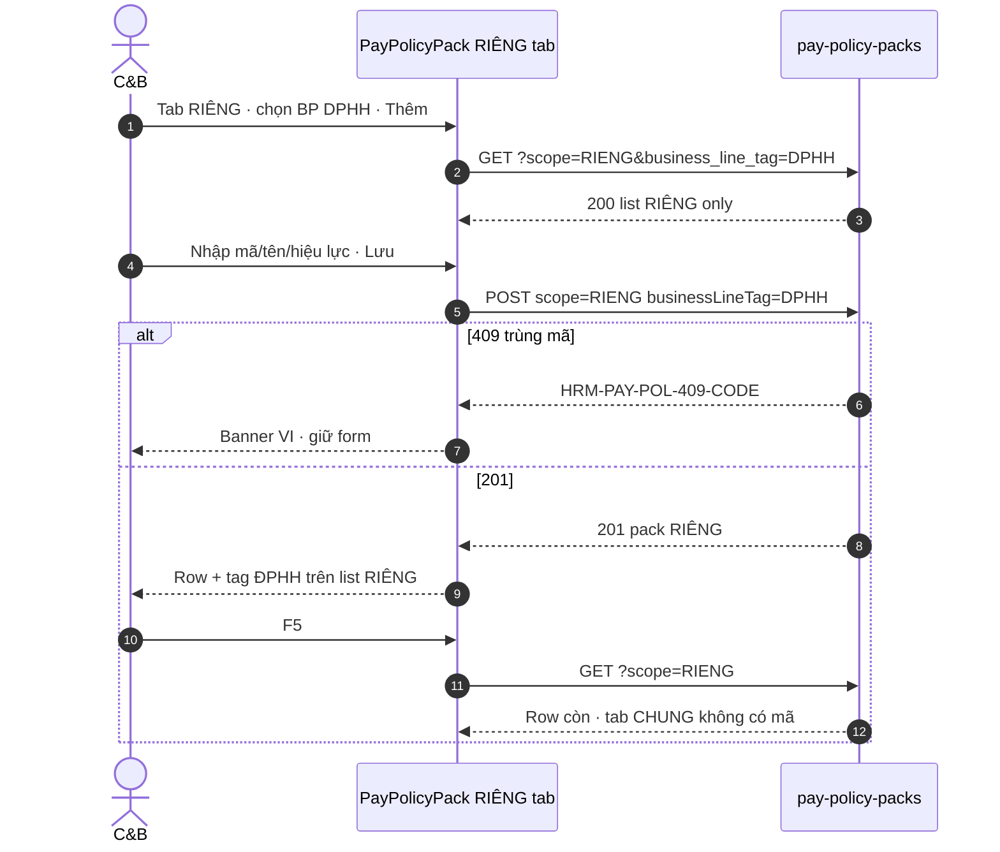

# SA Option + API F.1 delta — RIÊNG Policy Pack (STP-02)

| Meta | Giá trị |
|------|---------|
| **work_item_id** | `SA-PO-HRM-PAY-CNTT-FE-STP-02-RIENG-01` |
| **parent** | `BA-PO-HRM-PAY-CNTT-FE-STP-02-RIENG-01` |
| **from_role** | `sa` |
| **to_role** | `pm` → `dev-fe` (+ optional `dev-be` delta hẹp) |
| **lane** | governance · U88 vertical kế CHUNG POLICY-PACK-01 |
| **date** | 2026-08-12 |
| **change_mode** | **ADD-only** DOC-DELTA — **cấm** reopen CHUNG POLICY-PACK-01 · **cấm** `apps/**` trong WI này |
| **srs_neo** | [`PO-HRM-PAY-CNTT-FE-STP-01-SRS-01.md`](./PO-HRM-PAY-CNTT-FE-STP-01-SRS-01.md) · **UC-BP-PAY-STP-02** |
| **ba_neo** | [`BA-PO-HRM-PAY-CNTT-FE-STP-02-RIENG-01.md`](./BA-PO-HRM-PAY-CNTT-FE-STP-02-RIENG-01.md) |
| **api_parent** | [`PO-HRM-PAY-CNTT-API-01.md`](./PO-HRM-PAY-CNTT-API-01.md) §2 F-PAY-POLICY-PACK-* · stamp BE **`CNTTBEQC1-MSO8HVERQC1`** RETAIN |
| **ui_neo** | `docs/hrm/ui-screens/UI-HRM-PAY-STP-POLICY-PACK.md` §3–§4 |
| **qc_must_keep** | [`qc-po-hrm-pay-cntt-fe-stp-01-policy-pack-01.md`](../../qa/evidence/qc-po-hrm-pay-cntt-fe-stp-01-policy-pack-01.md) · **`PAYPPQC1-MSPXZL1GQC1`** |
| **honesty** | `payroll_e2e_ready=false` LOCK · formula evaluator **HOLD** · `C-SLICE-≠-MODULE` |
| **ack_status** | **PASS_TO_PM** |

---

## 0. read_first ack

| # | Artifact | Kết luận SA |
|---|----------|-------------|
| 1 | BA RIÊNG AC pack | DoD = CRUD+filter+parity archive/dup/date + GLOBAL-01/02; park STP-05/06 + hub 5/6 |
| 2 | SRS UC-BP-PAY-STP-02 | Tab RIÊNG · BP filter · **cấm** gộp CHUNG+RIÊNG một form · API cùng family `pay-policy-packs` |
| 3 | TechSpec `pay_policy_pack` | `scope` CHUNG\|RIENG · `business_line_tag` open TEXT · soft-delete |
| 4 | API parent §2 | LIST/UPSERT/ARCHIVE đã có filter `scope` + `business_line_tag` — **thiếu** F.1 gắn Diễn biến STP-02 + lock tag bắt buộc RIÊNG |
| 5 | QC GWC CHUNG | Seal **`PAYPPQC1-MSPXZL1GQC1`** · residual `R-PAY-STP-RIENG` · cấm claim RIÊNG DONE |

**Gate:** Không cần ba-data DDL mới (cột đã PAPER/LIVE dưới stamp BE). WI này = Option UI + DOC-DELTA F.1 + enum filter lock → unlock Dev.

---

## 1. Option A / B — UI surface

### 1.1 Option summary

| | **Option A — Reuse CHUNG screen + tab RIÊNG** | **Option B — Split screen RIÊNG** |
|--|-----------------------------------------------|-----------------------------------|
| **Mô tả** | Giữ `UI-HRM-PAY-STP-POLICY-PACK` · toolbar `[CHUNG \| RIÊNG]` · `PayPolicyPackList` + `PayPolicyPackDetail` · form tạo khóa `scope` theo tab đang mở | Route/component riêng `/…/policy-packs-rieng` · list/detail duplicate · navigation tách khỏi CHUNG |
| **Scope** | FE delta trên surface đã GWC CHUNG; API reuse | FE + route registry + deep-link + hub wiring mới |
| **Complexity** | Thấp–trung · reuse validate/archive/rate-min | Cao · nhân đôi shell + risk drift AC parity |
| **Risk** | Tab state / F5 query `scope` lệch — mitigable bằng testid + URL `scope=` | Overwrite path lock `policy-pack/**` · regression CHUNG GWC · scope creep hub |
| **Cost / timeline** | 1 wave FE (+ BE probe nếu thiếu enforce tag) | ≥2 wave FE + QA regression CHUNG bắt buộc |
| **Khớp neo** | SRS trace STP-01/02 cùng screen · UI §3 IA · BA §2 «Hai tab» | Lệch UI neo §3 · lệch SRS component map |

### 1.2 Trade-off matrix

| Tiêu chí | Option A | Option B |
|----------|----------|----------|
| Performance | Cùng bundle list query `?scope=` | Thêm route chunk — không lợi thực |
| Reliability | Parity archive/dup/date reuse CHUNG controls | Drift validate giữa 2 screen |
| Security / RBAC | Tab CHUNG vẫn 403 OU (BR-PAY-STP-01 smoke) | Dễ quên wire 403 trên screen mới |
| Scalability | Mở STP-05/06 sau trên cùng detail pane | Phải nhân đôi rate-params UI |
| Maintainability | **Một** entity UI · testid đã neo | Hai codebase form |
| Regression CHUNG GWC | Touch có kiểm soát · must_keep stamp | Cao — reopen surface sealed |

### 1.3 Failure modes (UI)

| Option | Failure mode | Mitigation |
|--------|--------------|------------|
| A | F5 nhảy về tab CHUNG / mất filter BP | Persist `section=policy-pack` + `scope=RIENG` + `business_line_tag?` trên query; AC GLOBAL-01 |
| A | Form RIÊNG gửi nhầm `scope=CHUNG` | Create-only: scope **fixed** từ tab · **cấm** radio gộp (AC-PAY-STP-02-SEP) |
| A | List RIÊNG lộ row CHUNG | GET luôn `scope=RIENG` khi tab RIÊNG; assert 0 CHUNG (AC-02-04) |
| B | Duplicate shell / mojibake / path overwrite CHUNG | Reject Option B trong wave này |
| A/B | Claim STP-05/06 / hub 5/6 trong cùng WI | **FORBIDDEN** — park map BA §7 |

### 1.4 Recommendation

**Chọn Option A** — reuse màn Gói chính sách đã seal CHUNG, bổ sung tab/filter RIÊNG + form khóa `scope=RIENG` + `businessLineTag` bắt buộc lúc tạo.

**Lý do:** khớp UI neo §3, SRS trace «cùng `PayPolicyPackList`/`Detail`», giảm blast radius lên stamp **`PAYPPQC1-MSPXZL1GQC1`**, tái sử dụng parity A/B/C và rate-min KPI/BCC đã PASS CHUNG.

**Assumptions:** (1) BE stamp **`CNTTBEQC1-MSO8HVERQC1`** đã nhận `scope=RIENG` + `businessLineTag` trên POST/PATCH/GET/archive — Dev chỉ **probe** không reopen stamp. (2) Persona wave 1 = `ceo@xe.vn`; GLOBAL-02 OU = CARRY khi thiếu account (BA Q1).

**Option B = REJECT** cho STP-02 — chỉ mở lại nếu Sponsor yêu cầu tách IA sau STP-06.

---

## 2. API_DESIGN F.1 delta — RIÊNG (ADD-only trên parent §2)

> **Không** rewrite `PO-HRM-PAY-CNTT-API-01.md` thân CHUNG. Delta dưới đây là SoT cho Dev/QA wave STP-02. Prefix: `/api/hrm/payroll`. Envelope `{ code, message, data }`. Soft-delete only.

### 2.0 Catalog lock — `businessLineTag` (khớp BA §4)

| Mã API `businessLineTag` / query `business_line_tag` | Nhãn VI filter | Filter semantics |
|-----------------------------------------------------|----------------|------------------|
| `DPHH` | ĐPHH | Exact match |
| `TDHK` | TĐHK | Exact match |
| `LX_ROUTE` | LX (tuyến) | Exact match — UI «LX» → query `LX_ROUTE` (**không** prefix `LX_*` ad-hoc trong wave này) |
| `PROV_OFFICE` | VP | Exact match |

| Rule | Giá trị |
|------|---------|
| Filter «Tất cả» | `scope=RIENG` **không** gửi `business_line_tag` → mọi pack RIÊNG trong JWT company scope |
| Tab RIÊNG | **Luôn** `scope=RIENG` — **0** row `scope=CHUNG` |
| Tab CHUNG | **Luôn** `scope=CHUNG` — không đụng DoD wave này |
| Open catalog | **Cấm** Nest/DB `CHECK (business_line_tag IN (…))` — catalog FE/API contract; giá trị lạ → `HRM-VAL-400` hoặc soft-accept + warn (GĐ1: **reject unknown** trên POST RIÊNG để AC ổn định) |
| STP-05/06 keys | `route_unit_price` / geo / `vp_*` — **park** · không bắt buộc body trong DoD STP-02 |

---

### 2.1 F-PAY-POLICY-PACK-LIST-01 — DELTA RIÊNG

| | |
|--|--|
| **METHOD / path** | `GET /api/hrm/payroll/pay-policy-packs` · `GET /api/hrm/payroll/pay-policy-packs/:id` |
| **Mục đích** | Liệt kê / xem **gói chính sách RIÊNG** theo pháp nhân và nhãn BP — phục vụ tab RIÊNG + dropdown BP trên màn Gói chính sách (STP-02), tách biệt list CHUNG đã GWC. |
| **Nghiệp vụ xử lý** | (1) `resolveHrmListScope` + `company_id` Plane B. (2) Khi FE tab RIÊNG: **bắt buộc** query `scope=RIENG`. (3) Optional `business_line_tag` ∈ catalog §2.0 — exact equality trên cột `business_line_tag`. (4) Default exclude `archived_at`. (5) Empty `[]` = **200**. (6) Get-by-id: **cùng** predicate list (U19) — pack CHUNG id khi caller đang filter RIÊNG vẫn 200 nếu JWT đủ quyền **nhưng** FE không hiển thị trên tab RIÊNG; out-of-company → **404**. (7) OU JWT hẹp (GLOBAL-02): server **MUST** intersect allowed BP tags — không leak cross-BP. (8) Display-ready: `scope`, `businessLineTag`, `code`, `nameVi`, dates. |
| **Tham chiếu bước SRS** | **UC-BP-PAY-STP-02** Diễn biến: *List (filter RIÊNG + BP tag)* · **AC-PAY-STP-02-04** · **AC-PAY-STP-GLOBAL-02** · BA AC-02-04 / GLOBAL-02 |
| **Request (query) DELTA** | `scope=RIENG` (required for RIÊNG tab) · `business_line_tag?` ∈ {`DPHH`,`TDHK`,`LX_ROUTE`,`PROV_OFFICE`} · các query parent khác giữ nguyên |
| **Lỗi** | Scope 403/409 · empty ≠ 404 · unknown tag filter → `HRM-VAL-400` **hoặc** treat as empty list (Dev chọn 1; QA lock trong evidence) — **khuyến nghị:** `400` để fail rõ |

---

### 2.2 F-PAY-POLICY-PACK-UPSERT-01 — DELTA RIÊNG (POST/PATCH)

| | |
|--|--|
| **METHOD / path** | `POST /api/hrm/payroll/pay-policy-packs` · `PATCH /api/hrm/payroll/pay-policy-packs/:id` |
| **Mục đích** | Tạo / sửa **gói RIÊNG** — mã, tên, `scope=RIENG`, **nhãn BP bắt buộc**, hiệu lực, `rateParams` tối thiểu (KPI/BCC reuse) — **không** mở geo/VP DoD trong WI này. |
| **Nghiệp vụ xử lý** | (1) Persist scope company. (2) **POST RIÊNG:** body **MUST** `scope: "RIENG"` + `businessLineTag` ∈ catalog §2.0 — thiếu/invalid → **`HRM-PAY-POL-400-TAG`** (APP-level; **không** DDL NOT NULL). (3) Duplicate active `(company_id, lower(code))` → **`HRM-PAY-POL-409-CODE`**. (4) `effectiveTo` &lt; `effectiveFrom` → **`HRM-PAY-POL-400-DATE`** (FE chặn trước gửi — AC-02-C; BE giữ guard). (5) `rateParams`: finite numbers only · keys open · **cấm** formula eval. (6) PATCH: không đổi `scope` CHUNG↔RIENG im lặng; refuse archived. (7) **FORBIDDEN:** hard DELETE · gộp payload CHUNG+RIÊNG · bắt buộc `vp_*` / geo keys ở wave này. |
| **Tham chiếu bước SRS** | **UC-BP-PAY-STP-02** Diễn biến: *Create → Chọn BP tag → Lưu → Row theo business_line_tag* · **AC-PAY-STP-02-01** · BA AC-02-01 / 02-B / 02-C / 02-RATE-MIN · **AC-PAY-STP-GLOBAL-01** |
| **Request DELTA (POST RIÊNG)** | |

| DTO | Required (POST RIÊNG) | Ghi chú |
|-----|----------------------|---------|
| `companyId` | YES | Plane B slug |
| `code` | YES | open slug |
| `nameVi` | YES | |
| `scope` | YES = `RIENG` | FE fixed từ tab |
| `businessLineTag` | **YES** | Catalog §2.0 — **siết** so với parent «recommend» |
| `effectiveFrom` | YES | `dd/MM/yyyy` FE → ISO BE |
| `effectiveTo` | optional | ≥ from |
| `rateParams` | optional | `kpi_threshold` / `bcc_std` OK; geo/VP park |
| `status` | optional | default draft/active per parent |

| **Lỗi DELTA** | `HRM-PAY-POL-400-TAG` · `HRM-PAY-POL-409-CODE` · `HRM-PAY-POL-400-DATE` · `HRM-VAL-400` · RBAC 403 (OU trên CHUNG — smoke BR-PAY-STP-01) |
| **must_keep parent** | Không reopen stamp BE — nếu `HRM-PAY-POL-400-TAG` chưa có: **dev-be delta hẹp** ADD error code + validate; hoặc wave 1 FE-only enforce + BE soft-accept (QA ghi residual) |

---

### 2.3 F-PAY-POLICY-PACK-ARCHIVE-01 — DELTA RIÊNG

| | |
|--|--|
| **METHOD / path** | `POST /api/hrm/payroll/pay-policy-packs/:id/archive` |
| **Mục đích** | Ngưng / ẩn gói **RIÊNG** khỏi list mặc định tab RIÊNG — giữ lịch sử snapshot kỳ (parity CHUNG AC-01-03). |
| **Nghiệp vụ xử lý** | (1) Scope load — **cấm** archive nhầm pack CHUNG từ UI tab RIÊNG (FE chỉ gọi trên row `scope=RIENG`). (2) Soft `archived_at=now()`. (3) List default RIÊNG không còn row. (4) **FORBIDDEN** hard DELETE. |
| **Tham chiếu bước SRS** | **UC-BP-PAY-STP-02** alternate archive · BA **AC-PAY-STP-02-A** · soft-delete platform |
| **Lỗi** | 404 scope · idempotent OK |

---

### 2.4 Sequence — UC-BP-PAY-STP-02 (Option A)



---

## 3. Failure modes + verification plan

### 3.1 Failure modes (API / product)

| ID | Mode | Detect | Owner |
|----|------|--------|-------|
| FM-01 | POST RIÊNG thiếu `businessLineTag` vẫn 201 | Probe + AC-02-01 Network body | BE delta / FE guard |
| FM-02 | GET tab RIÊNG trả pack CHUNG | AC-02-04 | FE query + BE filter |
| FM-03 | Archive RIÊNG hard-delete / còn active sau F5 | AC-02-A | BE soft-delete |
| FM-04 | Trùng mã ghi đè im lặng | AC-02-B | BE 409 |
| FM-05 | Date invalid vẫn POST | AC-02-C | FE block + BE 400 |
| FM-06 | OU leak cross-BP | GLOBAL-02 | BE JWT intersect |
| FM-07 | Regression CHUNG GWC / path overwrite | QA smoke AC-01-01 subset | FE must_keep |
| FM-08 | Flip `payroll_e2e_ready` / claim STP-05/06 | QC wording | PM/QC deny |

### 3.2 Verification plan

| Lớp | Cách | PASS khi |
|-----|------|----------|
| **L0** | `pnpm run qc:fe-be-health` | exit 0 · hrm-api `:28001` |
| **L1** | Probe (không seed): POST RIÊNG `DPHH` → GET `scope=RIENG&business_line_tag=DPHH` → archive | 201/200/201 · body scope+tag |
| **L2** | Load `/hr/payroll/setup?section=policy-pack` tab RIÊNG | testid `pay-policy-pack-scope-rieng` · `pay-policy-pack-bp-filter` |
| **L2.5** | Browser U65 BA §6 mẫu — **J-HRM-PAY-STP-02** (DRAFT→promote) | AC-02-01 · 02-04 · 02-A..C · GLOBAL-01; FE sau 2xx + F5; tab CHUNG không có mã mới |
| **Regression** | Smoke CHUNG create/list 1 row | Không phá **`PAYPPQC1-MSPXZL1GQC1`** |
| **Honesty** | Banner / flag | `payroll_e2e_ready=false` · formula HOLD · không hub 5/6 DoD |

**U65:** zero-seed · cấm `pnpm seed:*` trong evidence.

---

## 4. must_keep / forbidden

| Lock | Rule |
|------|------|
| **`PAYPPQC1-MSPXZL1GQC1`** | CHUNG POLICY-PACK-01 GWC sealed — **cấm** reopen / claim FAIL CHUNG |
| **`CNTTBEQC1-MSO8HVERQC1`** | BE parent RETAIN — chỉ ADD validate/error code nếu thiếu; **không** rewrite family |
| **Formula HOLD** | FE pass-through `rateParams` — **cấm** evaluator LIVE |
| **`payroll_e2e_ready=false`** | **Cấm** flip |
| **STP-05 / STP-06** | **Cấm** DoD cùng WI (geo picker · `vp_allowance`/`vp_cost`) |
| **Hub 5/6** | Placeholder Danh mục TP / Mẫu / Profile / Nhóm / Gợi ý — **cấm** scope creep |
| **U65** | **Cấm** seed |
| **apps/** | **Cấm** trong WI SA này |
| **C-SLICE-≠-MODULE** | Không claim payroll module / UF-HRM-10 / Phase 1 DONE |

**Park (SRS → wave sau):** AC-PAY-STP-02-02 → STP-05 · AC-PAY-STP-02-03 → STP-06.

---

## 5. ba-data gate

| Câu hỏi | Trả lời |
|---------|---------|
| Cần DB_DESIGN cột mới? | **Không** — `scope` / `business_line_tag` / `archived_at` đã có TechSpec + parent API |
| Cần ba-data Task? | **Không** cho unlock Dev — trừ khi probe phát hiện cột thiếu trên runtime (khi đó PM → ba-data hotfix physical) |
| Physical residual | App-level `HRM-PAY-POL-400-TAG` only — document trong evidence BE nếu thêm |

---

## 6. Handoff contract

| Field | Value |
|-------|--------|
| **completion_report** | Option **A** (reuse STP-POLICY-PACK + tab RIÊNG) **RECOMMENDED**; Option B REJECT. API F.1 delta LIST/UPSERT/ARCHIVE gắn **UC-BP-PAY-STP-02** Diễn biến + BA AC; catalog `businessLineTag` khóa BA §4 (exact). Siết POST RIÊNG: tag **bắt buộc** (`HRM-PAY-POL-400-TAG`). must_keep CHUNG GWC + BE stamp + formula HOLD + `payroll_e2e_ready=false` + cấm STP-05/06/hub. ba-data **không** bắt buộc. |
| **next_owner** | **pm → dev-fe** (primary) · optional **dev-be** nếu probe thiếu enforce `businessLineTag` / mã lỗi TAG |
| **ack_status** | **PASS_TO_PM** |
| **evidence_path** | `docs/program/specs/SA-PO-HRM-PAY-CNTT-FE-STP-02-RIENG-01.md` |

### next_dispatch_prompt (copy-ready)

```text
work_item_id: D-PO-HRM-PAY-CNTT-FE-STP-02-RIENG-01
role: dev-fe
lane: execution
parent: SA-PO-HRM-PAY-CNTT-FE-STP-02-RIENG-01
change_mode: ADD
preserve_default: true
read_first:
  - docs/program/specs/SA-PO-HRM-PAY-CNTT-FE-STP-02-RIENG-01.md  # Option A + F.1 delta
  - docs/program/specs/BA-PO-HRM-PAY-CNTT-FE-STP-02-RIENG-01.md
  - docs/hrm/ui-screens/UI-HRM-PAY-STP-POLICY-PACK.md §3–§4
  - docs/program/specs/PO-HRM-PAY-CNTT-API-01.md §2
  - docs/qa/evidence/qc-po-hrm-pay-cntt-fe-stp-01-policy-pack-01.md  # must_keep PAYPPQC1-MSPXZL1GQC1
entry_criteria: SA Option A + F.1 PASS_TO_PM; CHUNG GWC sealed; payroll_e2e_ready=false LOCK
exit_criteria:
  - Tab RIÊNG + BP filter (testid pay-policy-pack-scope-rieng · pay-policy-pack-bp-filter)
  - Create RIÊNG: POST scope=RIENG + businessLineTag catalog DPHH|TDHK|LX_ROUTE|PROV_OFFICE
  - Parity archive / 409 code / date client validate; rate-min KPI/BCC reuse
  - AC-PAY-STP-02-SEP: không gộp form CHUNG+RIÊNG
  - F5 giữ tab RIÊNG; tab CHUNG không hiện row mới
  - CODE-MEMORY + vitest; READY_FOR_QA
must_keep: PAYPPQC1-MSPXZL1GQC1 · CNTTBEQC1-MSO8HVERQC1 · formula HOLD · cấm flip payroll_e2e_ready · cấm STP-05/06 · cấm hub 5/6
forbidden: apps outside policy-pack allow-list · reopen CHUNG · seed · formula LIVE
spec_read_ack required: srs UC-BP-PAY-STP-02 · sa SA-…-RIENG-01 · api F.1 delta §2 · ba AC pack
evidence_path: docs/qa/evidence/d-po-hrm-pay-cntt-fe-stp-02-rieng-01.md
optional_parallel:
  work_item_id: D-PO-HRM-PAY-CNTT-BE-STP-02-RIENG-TAG-01
  role: dev-be
  only_if: probe POST RIÊNG thiếu tag vẫn 201 hoặc chưa có HRM-PAY-POL-400-TAG
  exit: validate + jest; không reopen CNTTBEQC1 stamp wording
```
