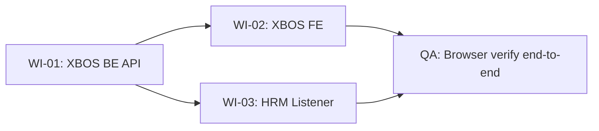

# Work Items — XBOS Tenant Provisioning via Company Settings

| Field | Value |
|-------|-------|
| **Ngày tạo** | 2026-08-15 |
| **Tạo bởi** | Claude Code PM Successor |
| **Sponsor decision** | Tenant được quản lý qua XBOS Settings > Quản lý Công ty (mở rộng) — không tạo module riêng |
| **Priority** | Phase 1b (sau khi Phase 1 exit — trước PROD) |
| **Prerequisite** | `xbos_tenant_registry` + `xbos_legal_entity` đã tồn tại (SA-U71-XBOS-AUTH-TENANT-DESIGN-01) |
| **Blocks** | HRM multi-tenant thật (hiện hardcode `DEFAULT 'xevn'`) |

---

## Context & Decision Rationale

Hiện tại:
- `xbos_tenant_registry` có `modules JSONB DEFAULT '[]'`, `status TEXT` → đủ để lưu tenant config
- `xbos_legal_entity` có company profile đầy đủ (tên, mã, loại, ngành nghề...)
- Không có UI để admin tạo/kích hoạt tenant mới
- HRM hardcode `tenant_id = 'xevn'` — không thể onboard tenant mới end-to-end

Sponsor quyết định: **mở rộng màn hình Company Settings hiện có của XBOS** thay vì tạo màn "Tenant Management" riêng. Khi admin khai báo + kích hoạt một công ty trên XBOS → hệ thống tự provision tenant scope cho HRM và Logistics.

---

## WI-01: BE — Tenant Provisioning Endpoints

| Field | Value |
|-------|-------|
| `work_item_id` | `XBOS-TENANT-PROVISION-BE-01` |
| Lane | `dev-be` (xbos-api) |
| Status | QUEUED |
| Estimate | 1–2 ngày |
| `read_first` | `docs/xbos/API_DESIGN_XBOS_AUTH_TENANT.md` · `docs/xbos/DB_DESIGN_XBOS_AUTH_TENANT.md` · `docs/xbos/API_DESIGN_XBOS_ORG_LEGAL.md` |
| `allowed_paths` | `apps/api/xbos-api/src/settings/**` · `apps/api/xbos-api/src/tenant-provision/**` · `migrations/xbos/` |
| `forbidden_paths` | `apps/api/hrm-api/**` (WI-03 riêng) · `migrations/hrm/**` |

### Scope

Thêm 3 endpoints vào `xbos-api` controller `settings/companies`:

#### A. `GET /api/xbos/settings/companies`
List toàn bộ `xbos_tenant_registry JOIN xbos_legal_entity` với trạng thái provision.

Response shape:
```json
{
  "items": [{
    "tenantId": "xevn",
    "name": "XeVN Group Holding",
    "shortName": "XeVN",
    "tenantKind": "master",
    "defaultCompanyId": "holding",
    "modules": ["hrm", "logistics"],
    "status": "active",
    "legalEntity": { "code": "...", "taxCode": "...", "businessLines": "..." }
  }]
}
```

#### B. `POST /api/xbos/settings/companies` — Tạo company + provision tenant
Body:
```json
{
  "tenantCode": "xe-du-lich",        // → xbos_tenant_registry.tenant_id
  "name": "XeVN Du Lịch",
  "shortName": "XeVN DL",
  "tenantKind": "member",
  "modules": ["hrm"],                // Phân hệ được phép
  "legalEntity": {                   // → xbos_legal_entity
    "code": "XDL",
    "name": "Công ty CP XeVN Du Lịch",
    "taxCode": "0123456789",
    "businessLines": "Du lịch và lữ hành"
  }
}
```

Business rules:
- `BR-TP-01`: `tenantCode` phải unique trong `xbos_tenant_registry`, chỉ lowercase + hyphen
- `BR-TP-02`: `modules` chỉ nhận `["hrm", "logistics"]` hoặc tập con
- `BR-TP-03`: Tạo mới → `status = PROVISIONING` (chưa active ngay)
- `BR-TP-04`: Tạo `xbos_tenant_registry` + `xbos_legal_entity` trong cùng transaction

Response: 201, trả về object vừa tạo.

#### C. `PUT /api/xbos/settings/companies/:tenantId/activate` — Kích hoạt tenant
- Set `xbos_tenant_registry.status = 'active'`
- Emit named event `TENANT_PROVISIONED` (payload: `{tenantId, modules, defaultCompanyId, activatedAt}`)
- Return 200

#### D. `PUT /api/xbos/settings/companies/:tenantId/suspend` — Tạm ngưng
- Set `status = 'suspended'`
- Emit event `TENANT_SUSPENDED` (payload: `{tenantId}`)
- Return 200

#### E. `PATCH /api/xbos/settings/companies/:tenantId/modules` — Cập nhật module
- Update `modules` JSONB
- Nếu thêm module mới vào tenant đang active → emit `TENANT_MODULE_ADDED`
- Return 200

### DB changes (migration mới)
```sql
-- Nếu chưa có index
CREATE INDEX IF NOT EXISTS ix_tenant_registry_status ON xbos_tenant_registry(status);
CREATE INDEX IF NOT EXISTS ix_tenant_registry_kind ON xbos_tenant_registry(tenant_kind);

-- Enum status mở rộng (nếu dùng TEXT CHECK thì thêm):
-- Hiện: active | (không rõ)
-- Cần: PROVISIONING | ACTIVE | SUSPENDED | ARCHIVED
ALTER TABLE xbos_tenant_registry DROP CONSTRAINT IF EXISTS xbos_tenant_registry_status_check;
ALTER TABLE xbos_tenant_registry ADD CONSTRAINT xbos_tenant_registry_status_check
  CHECK (status IN ('provisioning','active','suspended','archived'));
```

### Event contract (`TENANT_PROVISIONED`)
```typescript
// Named event — BullMQ queue 'xbos.tenant'
type TenantProvisionedPayload = {
  eventType: 'TENANT_PROVISIONED';
  tenantId: string;            // khóa text dùng trong Plane B
  defaultCompanyId: string;
  modules: ('hrm' | 'logistics')[];
  activatedAt: string;         // ISO 8601
  issuedBy: string;            // userId admin
};
```

HRM và Logistics subscribe queue này để seed default configs.

### Exit criteria
- [ ] 5 endpoints test được bằng `curl` / Postman với `x-internal-api-key`
- [ ] Khi activate → event `TENANT_PROVISIONED` xuất hiện trong BullMQ UI (hoặc queue log)
- [ ] Transaction rollback nếu tạo `xbos_tenant_registry` OK nhưng `xbos_legal_entity` fail
- [ ] TypeScript strict, không `any`
- [ ] `ack_status: READY_FOR_QA` + evidence tại `docs/qa/evidence/xbos-tenant-provision-be-01.md`

---

## WI-02: FE — XBOS Settings > Quản lý Công ty (mở rộng)

| Field | Value |
|-------|-------|
| `work_item_id` | `XBOS-TENANT-PROVISION-FE-01` |
| Lane | `dev-fe` (xbos-fe) |
| Status | QUEUED (blocked by WI-01 API) |
| Estimate | 2–3 ngày |
| `read_first` | WI-01 spec này · `apps/web/x-bos-core/src/` (xem pattern hiện tại) |
| `allowed_paths` | `apps/web/x-bos-core/src/pages/settings/**` · `apps/web/x-bos-core/src/components/settings/**` · `apps/web/x-bos-core/src/integrations/xbosApi.ts` |
| `forbidden_paths` | `apps/web/hrm/**` · `apps/api/**` |

### Màn hình: Settings > Quản lý Công ty & Tenant

**Pattern:** PAT-SETTINGS-CATALOG-01 (List + Dialog) — giống các settings panel HRM đã có.

#### List view
| Cột | Nguồn | Ghi chú |
|-----|-------|---------|
| Tên công ty | `name` | |
| Mã tenant | `tenantId` | font-mono |
| Phân hệ | `modules[]` | Badge HRM / Logistics |
| Loại | `tenantKind` | Master / Thành viên |
| Trạng thái | `status` | Badge: Đang cấp phép / Hoạt động / Tạm ngưng / Lưu trữ |
| Thao tác | — | Sửa · Kích hoạt (nếu PROVISIONING) · Tạm ngưng (nếu ACTIVE) |

#### Dialog: Thêm công ty mới
Fields:
- Mã tenant (`tenantCode`) — lowercase-hyphen, không được trùng
- Tên đầy đủ, Tên ngắn
- Loại (`tenantKind`): Master / Thành viên
- Phân hệ được phép (`modules`): [x] HRM [ ] Logistics
- Thông tin pháp nhân: Mã, Tên pháp nhân, MST, Ngành nghề (optional)
- Thông tin Quản trị (chỉ dành cho Thành viên): `adminEmail` và `adminPassword` để cấp phát tài khoản Admin cho Tenant mới.

#### Dialog: Cập nhật module
- Cho phép thêm/bỏ module sau khi tạo (nếu tenant chưa có payroll data lock)

#### Actions inline
- **Kích hoạt** (chỉ hiện khi `status=provisioning`) → gọi `PUT .../activate` → toast "Đã kích hoạt — HRM/Logistics sẽ nhận cấu hình trong ít phút"
- **Tạm ngưng** (chỉ hiện khi `status=active`) → confirm dialog → `PUT .../suspend`

### xbosApi.ts functions cần thêm
```typescript
listSettingsCompanies(): Promise<{ items: XbosCompanyRow[] }>
createSettingsCompany(payload): Promise<XbosCompanyRow>
activateTenant(tenantId: string): Promise<XbosCompanyRow>
suspendTenant(tenantId: string): Promise<XbosCompanyRow>
updateTenantModules(tenantId: string, modules: string[]): Promise<XbosCompanyRow>
```

### Exit criteria
- [ ] List render đúng từ API thật
- [ ] Tạo company mới → xuất hiện trong list với `status=provisioning`
- [ ] Kích hoạt → status chuyển `active`, toast thành công
- [ ] TypeScript 0 error
- [ ] `ack_status: READY_FOR_QA` + screenshots tại `docs/qa/evidence/xbos-tenant-provision-fe-01.md`

---

## WI-03: BE/HRM — Event Listener `TENANT_PROVISIONED`

| Field | Value |
|-------|-------|
| `work_item_id` | `HRM-TENANT-PROVISION-LISTENER-01` |
| Lane | `dev-be` (hrm-api) |
| Status | QUEUED (blocked by WI-01 event contract) |
| Estimate | 0.5–1 ngày |
| `read_first` | WI-01 spec này (event contract) · `apps/api/hrm-api/src/` (pattern EventEmitter/BullMQ hiện tại) |
| `allowed_paths` | `apps/api/hrm-api/src/tenant-provision/**` · `apps/api/hrm-api/src/app.module.ts` |
| `forbidden_paths` | `migrations/hrm/**` · `apps/api/hrm-api/src/payroll/**` |

### Scope

HRM subscribe event `TENANT_PROVISIONED` từ BullMQ queue `xbos.tenant`:

```typescript
// TenantProvisionListener (NestJS @Processor)
@OnQueueEvent('TENANT_PROVISIONED')
async handleTenantProvisioned(payload: TenantProvisionedPayload) {
  // 1. Kiểm tra tenant chưa có default settings → idempotent
  // 2. Nếu modules includes 'hrm' → seed HRM default settings cho tenantId:
  //    - Insert default leave types (LABOR_LAW category) nếu chưa có
  //    - Insert default insurance rates (năm hiện tại) nếu chưa có
  //    - Insert default minimum wage regions nếu chưa có
  // 3. Log: "[HRM] Tenant provisioned: {tenantId}, seeded defaults"
}
```

**Quan trọng — idempotent:** Nếu event bị retry, không được tạo duplicate data. Dùng `INSERT ... ON CONFLICT DO NOTHING`.

**Không phải U65 violation:** Đây là seed được trigger bởi business event thật (admin action), không phải seed để pass QA test.

### Default HRM data seed cho tenant mới
| Data | Ghi chú |
|------|---------|
| 8 loại nghỉ phép LABOR_LAW (BLĐ 2019) | Code: `ANNUAL`, `SICK`, `MATERNITY`, `PATERNITY`, `BEREAVEMENT`, `MARRIAGE`, `ELECTION`, `NATIONAL_DISASTER` |
| 3 mức đóng BH năm hiện tại (BHXH/BHYT/BHTN) | Mức chuẩn theo Nghị định 74/2024 |
| 4 vùng lương tối thiểu | REGION_1..4 theo Nghị định 74/2024 |

### Exit criteria
- [ ] Handler đăng ký trong `app.module.ts`
- [ ] Khi XBOS emit `TENANT_PROVISIONED` với `modules: ['hrm']` → HRM log + default data tồn tại trong DB
- [ ] Idempotent: gọi lại lần 2 không tạo duplicate
- [ ] `ack_status: READY_FOR_QA` + evidence tại `docs/qa/evidence/hrm-tenant-provision-listener-01.md`

---

## Dispatch order (sequential)

```
WI-01 (XBOS BE) → WI-02 (XBOS FE, parallel OK sau khi API mock sẵn) → WI-03 (HRM BE, song song WI-02)
```



## Bus entry (copy vào AGENT_MESSAGE_BUS.md khi dispatch)

```
| 2026-08-15 | XBOS-TENANT-PROVISION-BE-01 | QUEUED | dev-be | Mở rộng XBOS Settings > Company: POST/PUT activate/suspend/modules endpoints + TENANT_PROVISIONED event |
| 2026-08-15 | XBOS-TENANT-PROVISION-FE-01 | QUEUED (blocked WI-01) | dev-fe | XBOS FE Settings > Quản lý Công ty: list + dialog tạo + kích hoạt/ngưng + module assignment |
| 2026-08-15 | HRM-TENANT-PROVISION-LISTENER-01 | QUEUED (blocked WI-01) | dev-be | HRM subscribe TENANT_PROVISIONED → seed default leave types + insurance rates cho tenant mới |
```

---

## Migration plan: HRM `tenant_id DEFAULT 'xevn'`

Sau khi WI-01 + WI-03 DONE, các `tenant_id DEFAULT 'xevn'` trong HRM DB **không cần đổi ngay** — đây vẫn là valid tenant (`xevn` = master tenant trong `xbos_tenant_registry`). 

Khi onboard tenant thứ 2 (`xe-du-lich`):
1. Admin tạo trên XBOS Settings → `TENANT_PROVISIONED` event
2. HRM listener nhận → seed defaults với `tenant_id = 'xe-du-lich'`
3. HRM API đọc `tenant_id` từ JWT (đã đúng) — không cần đổi migration cũ
4. Dữ liệu hiện tại (`xevn`) vẫn chạy bình thường

**Không có breaking migration cần làm.** Chỉ cần WI-01 + WI-03 là multi-tenant thật hoạt động.
