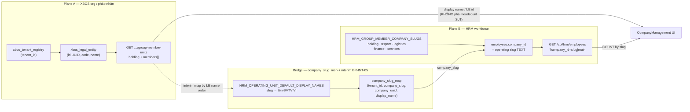

# D-HRM-CO-EMP-COUNT-BA-D-01 — XBOS legal entities ↔ HRM employees headcount linkage

| Field | Value |
|-------|--------|
| **work_item_id** | `D-HRM-CO-EMP-COUNT-BA-D-01` |
| **from_role** | ba-data |
| **to_role** | pm → **dev-be** + **dev-fe** (parallel) → qa |
| **lane** | governance |
| **date** | 2026-07-27 (ICT) |
| **ack_status** | **PASS_TO_PM** |
| **U65** | No seed · no `apps/**` edits in this wave |
| **spec_ref** | `docs/hrm/HRM_SEED_CARDINALITY_RULES.md` §2–§3 · `apps/api/hrm-api/src/common/hrm-list-scope.ts` `HRM_GROUP_MEMBER_COMPANY_SLUGS` · `docs/hrm/SRS.md` §15.4 **BR-INT-05** · `docs/program/governance/p1-prod-int-ba-d-01-20260607.md` Plane A/B · `docs/qa/evidence/be-hrm-emp-company-col-01-20260722.md` interim bridge |

---

## 0. Sponsor one-liner (why Company page shows 0)

Màn **Công ty** (`/command-center/hrm/company`) lấy danh sách từ **XBOS** `group-member-units` (pháp nhân). Mapper FE **cố định** `employee_count: null` → UI hiển thị **0**. Nhân viên thật nằm ở bảng HRM `employees` theo **operating slug** (`holding` / `trsport` / …), **không** theo UUID pháp nhân XBOS. Dashboard ~1109 NV = đếm đúng Plane B; cột «Số nhân viên» trên Company = chưa nối COUNT.

---

## 1. Data linkage map (Plane A → bridge → Plane B)



| Step | Source | Key | Target | Rule |
|------|--------|-----|--------|------|
| 1 | `xbos_legal_entity` / `group-member-units` | `id` (LE UUID) hoặc holding synthetic `xbos-group-holding-root` | Company row `id` (UI) | Plane A identity only — **profile / MST / founded** |
| 2 | Interim BR-INT-05 map | LE **display name** ↔ `operating_slug` | `company_slug_map.company_slug` | **5** slugs on `tenant_id=xevn` (not 1:1 with 4 member tenants — documented gap) |
| 3 | `company_slug_map` | `company_uuid` = `HRM_COMPANY_UUID_BY_SLUG` | Mobile / attendance UUID ladder | Never use as `employees.company_id` filter for headcount |
| 4 | `employees` | `company_id` ∈ `HRM_GROUP_MEMBER_COMPANY_SLUGS` | Headcount SoT | `COUNT` / list filter **by slug** |

**Anti-join (causes 0):**

```text
WRONG:  COUNT(employees) WHERE company_id = <xbos_legal_entity.id UUID>
WRONG:  COUNT via XBOS tenant-scope payload (no employee field)
RIGHT:  COUNT(employees) WHERE company_id = '<operating_slug>'
          AND status='active' AND archived_at IS NULL
          (+ master tenant partition per resolveHrmListScope)
```

---

## 2. Explicit bridge — 5 operating units (Sponsor table)

SoT names = interim LE/ĐVTV map (`hrm-operating-unit-registry.ts` + `org-seed-member-companies.json` order after holding). SA may refine 1:1 later (**BR-INT-05** residual P3); until then names ∈ ĐVTV set.

| # | Display name VI (Plane A label) | XBOS tenant / code | LE id type on Company UI | `operating_slug` (Plane B) | `company_uuid` (map) | Expected employee count source |
|---|--------------------------------|--------------------|---------------------------|----------------------------|----------------------|--------------------------------|
| 1 | Tập đoàn XeVN | `xevn` / `XEVN-HOLDING` | Synthetic string `xbos-group-holding-root` (not LE UUID) | **`holding`** | `10000000-0000-4000-8000-000000000001` | `COUNT employees WHERE company_id='holding'` (CARD-EMP-01 · N≈188–200 UAT active) |
| 2 | Công ty Cổ phần Thương mại và Dịch vụ X.E | Member tenant `xe-tmdv` / `XE_TMDV` | **LE UUID** from `members[].id` | **`trsport`** | `…0002` | `COUNT … company_id='trsport'` |
| 3 | Công ty TNHH Du lịch Visun | `visun` / `VISUN` | **LE UUID** | **`logistics`** | `…0003` | `COUNT … company_id='logistics'` |
| 4 | Công ty TNHH Du lịch X.E Việt Nam | `xe-du-lich` / `XE_DU_LICH` | **LE UUID** | **`finance`** | `…0004` | `COUNT … company_id='finance'` |
| 5 | Công ty TNHH X.E Việt Nam | `xe-vietnam` / `XE_VIETNAM` | **LE UUID** | **`services`** | `…0005` | `COUNT … company_id='services'` |

**Cardinality cite:** `HRM_SEED_CARDINALITY_RULES.md` §3.1 — `N(C)` keyed by **slug** `C`, not LE UUID. Group CEO card «Tổng nhân viên» = **sum** of N(C) over all five slugs (or single `GET …/employees?company_id=main` rollup `total`).

**BR-INT-05 note:** Plane A member tenants = **4** subsidiaries (+ holding legal row); Plane B = **5** slugs. Bridge above is **interim name-order map** (AC-EMP-COL). Do **not** invent a 6th LE; do **not** drop a slug from COUNT.

---

## 3. Field ownership — who owns headcount SoT

| Field / surface | Owner system | Owner store | API | NOT owner |
|-----------------|--------------|-------------|-----|-----------|
| **Headcount / Số nhân viên / Tổng NV** | **HRM** | `public.employees` (`company_id` slug TEXT) | `GET /api/hrm/employees?company_id={slug\|main}&page_size=1` → `.data.total` (or dedicated COUNT if BE adds) | XBOS `group-member-units`, `xbos_legal_entity`, tenant-scope |
| Company **name / MST / email / phone / founded** | **XBOS** | `xbos_legal_entity` + `payload.companyForm` | `GET …/group-member-units` + `GET …/legal-entities` | HRM employees |
| Display name on Employees column | Bridge → LE VI name | `company_slug_map.display_name` + registry defaults | `company_display_name` on employee DTO / `GET /operating-units` | Hardcoded «Khối …» (forbidden on company column) |
| JWT scope for Group CEO | Portal auth | JWT `tenantId=xevn`, `companyId=main` | Headers `x-tenant-id` / `x-company-id` | Passing LE UUID as `company_id` query |

**Ownership rule (normative):**

> **BR-CO-HC-01:** `employee_count` on Company UI is a **derived projection** of HRM `employees` filtered by **operating_slug**. XBOS never stores workforce headcount for this screen.

---

## 4. Validation rules — COUNT must use slug, never LE UUID

| ID | Condition | Rule | Expected result |
|----|-----------|------|-----------------|
| **VAL-CO-HC-01** | Company list row has `id` = LE UUID or `xbos-group-holding-root` | Resolve `operating_slug` via §2 bridge (name/code/map) **before** COUNT | Slug ∈ `HRM_GROUP_MEMBER_COMPANY_SLUGS` |
| **VAL-CO-HC-02** | COUNT / list filter | Predicate `employees.company_id = :operating_slug` | Matches CARD-EMP-01 / dashboard order of magnitude (~188+/slug UAT) |
| **VAL-CO-HC-03** | Filter uses LE UUID as `company_id` | **Forbidden** | Expect **0** rows (or empty) — defect if UI shows 0 while slug COUNT > 0 |
| **VAL-CO-HC-04** | Group CEO total card | Sum of five slug counts **or** `company_id=main` rollup via `resolveHrmListScope` → `HRM_GROUP_MEMBER_COMPANY_SLUGS` | Aligns with Employees list `total` (~1100+); not forced to 0 |
| **VAL-CO-HC-05** | FE `mapGroupMemberUnitsToHrmCompanies` | Must not leave `employee_count: null` after enrich | After wave: number ≥ 0 from HRM; null only if API fail → show `—` / error, not silent 0 |
| **VAL-CO-HC-06** | scope_parity (U19) | List COUNT slug S and deep-link Employees filter S | Same scope helper; no 409/404 for ids visible under `main` |
| **VAL-CO-HC-07** | BR-INT-05 gap | 4 LE ≠ 5 slug | Fail-closed: still COUNT all 5 slugs; do not invent UUID; document interim map |

**Deterministic error map (for BE/FE):**

| Code / UI | When | FE behavior |
|-----------|------|-------------|
| `HRM-CO-HC-SLUG-UNMAPPED` | LE name/code not in bridge | Show `—`; log LE id; do not COUNT UUID |
| `HRM-CO-HC-API` | Employees COUNT non-2xx | Banner/toast; keep profile fields; do not coerce 0 as success |
| Silent `null → 0` | Current as-is | **FAIL** VAL-CO-HC-05 |

---

## 5. Why UI is 0 today (code does / spec says)

| Layer | Spec says | Code does (as of 2026-07-27 explore) |
|-------|-----------|--------------------------------------|
| Load list | Plane A units + headcount from HRM | `CompanyManagement` → `fetchGroupMemberUnitsForHrm()` only |
| Mapper | Enrich count per slug | `mapGroupMemberUnitsToHrmCompanies` sets **`employee_count: null`** (holding + every member) |
| Display | Show SoT count | `{company.employee_count \|\| 0}` → **0** |
| Dashboard | Same SoT `employees` | Uses HRM aggregate → ~1109 — **correct Plane B** |

Root cause class: **missing bridge enrich + wrong plane for COUNT** — not empty DB, not seed gap for this symptom.

---

## 6. Traceability

| Requirement / artifact | Linkage |
|------------------------|---------|
| `HRM_SEED_CARDINALITY_RULES.md` §2–§3 | N(C) by slug; GROUP_MEMBER_SLUGS |
| `hrm-list-scope.ts` | `HRM_GROUP_MEMBER_COMPANY_SLUGS`, `HRM_COMPANY_UUID_BY_SLUG`, `resolveHrmListScope` |
| `docs/hrm/SRS.md` §15.4 **BR-INT-05** | ĐVTV ↔ slug reconciliation |
| Plane A/B | `p1-prod-int-ba-d-01-20260607.md` §2–§3; EMP-COL BE evidence interim map |
| Journey | J-HRM-02 (employees) · Company route P-CC / UF company list — retest after FE enrich |
| Related prior | `fid-p0-ba-data-01` (hard-null profile fields) — same mapper; headcount is **new** residual |

---

## 7. Risks & mitigation

| Risk | Impact | Mitigation |
|------|--------|------------|
| Join COUNT on LE UUID | Permanent 0 | VAL-CO-HC-03; BE reject UUID-as-slug for TEXT company_id ladder |
| Double-count holding + members if FE also sums `main` | Inflated total | Total card = one rollup `main` **or** sum of five — not both |
| BR-INT-05 map drift | Wrong company gets wrong N | Keep §2 table as SoT; SA refine with evidence; AC name ∈ ĐVTV |
| Seed temptation | U65 violation | COUNT live HRM only; no `pnpm seed:*` for evidence |

---

## 8. Handoff

```yaml
work_item_id: D-HRM-CO-EMP-COUNT-BA-D-01
from_role: ba-data
to_role: pm
ack_status: PASS_TO_PM
evidence_path: docs/qa/evidence/ba-data-hrm-co-emp-linkage-01-20260727.md
completion_report: |
  Closed: Sponsor-readable Plane A→bridge→Plane B map; 5-unit bridge keys;
  headcount SoT = HRM employees by slug (not XBOS); VAL-CO-HC-01..07;
  root cause = FE null employee_count + LE UUID ≠ slug.
  Residual: BE/FE implement enrich; SA optional BR-INT-05 1:1 refine (P3).
next_owner: pm → parallel D-HRM-CO-EMP-COUNT-BE-01 + D-HRM-CO-EMP-COUNT-FE-01
```

### next_dispatch_prompt (copy-ready — BE)

```text
work_item_id: D-HRM-CO-EMP-COUNT-BE-01
from_role: pm
to_role: dev-be
lane: execution
entry_criteria: ba-data-hrm-co-emp-linkage-01-20260727.md §2–§4 PASS_TO_PM; U65 zero-seed; HOLD_DEPLOY
spec_read_ack:
  srs: docs/hrm/SRS.md §15.4 BR-INT-05 · CARD via HRM_SEED_CARDINALITY_RULES.md §3
  tech_spec: docs/program/governance/p1-prod-int-ba-d-01-20260607.md Plane A/B · this evidence §1–§4
change_mode: ADD
must_keep: resolveHrmListScope; HRM_GROUP_MEMBER_COMPANY_SLUGS; employees.company_id TEXT slug; no LE UUID as company_id filter
forbidden_paths: seed scripts as UAT evidence; overwrite EMP-COL LE display SoT
exit_criteria: |
  Expose headcount by operating_slug for Company enrich — e.g. GET /api/hrm/employees?company_id={slug}&page_size=1 → total
  and/or batch counts for holding|trsport|logistics|finance|services under company_id=main scope.
  VAL-CO-HC-02/03/04: COUNT uses slug only; UUID filter must not be treated as success path.
  Jest: slug COUNT > 0 for seeded UAT partition; UUID-as-company_id does not return that population.
evidence_path: docs/qa/evidence/be-hrm-co-emp-count-01-YYYYMMDD.md
ack_status: READY_FOR_QA
bridge_keys (mandatory):
  holding → Tập đoàn XeVN → slug holding → uuid …0001
  trsport → Công ty Cổ phần Thương mại và Dịch vụ X.E → …0002
  logistics → Công ty TNHH Du lịch Visun → …0003
  finance → Công ty TNHH Du lịch X.E Việt Nam → …0004
  services → Công ty TNHH X.E Việt Nam → …0005
```

### next_dispatch_prompt (copy-ready — FE)

```text
work_item_id: D-HRM-CO-EMP-COUNT-FE-01
from_role: pm
to_role: dev-fe
lane: execution
entry_criteria: BA evidence ba-data-hrm-co-emp-linkage-01-20260727.md; prefer after BE COUNT contract or parallel with stub+wire
spec_read_ack:
  srs: docs/hrm/SRS.md §15 · BR-CO-HC-01 (evidence §3)
  tech_spec: evidence §1–§5 · tenantScopeApi mapGroupMemberUnitsToHrmCompanies
change_mode: FIX
must_keep: Plane A profile enrich (tax/email/founded); GROUP_HOLDING_ROOT_ID; U65 no seed; LE names on company list
forbidden_paths: counting via LE UUID; hardcoding fake headcounts; silent null→0 as success
exit_criteria: |
  After load CompanyManagement: resolve each row → operating_slug via §2 bridge (name/code),
  fetch HRM COUNT by slug; set employee_count; card Tổng nhân viên = sum or main rollup.
  VAL-CO-HC-05: stop leaving employee_count null when HRM 2xx.
  Browser U65: ceo@xe.vn → /command-center/hrm/company → cột Số nhân viên > 0 for units with workforce; F5 giữ số; Network shows HRM employees (not only group-member-units).
evidence_path: docs/qa/evidence/fe-hrm-co-emp-count-01-YYYYMMDD.md
ack_status: READY_FOR_QA
bridge_keys: same five rows as BE prompt (holding/trsport/logistics/finance/services)
```
