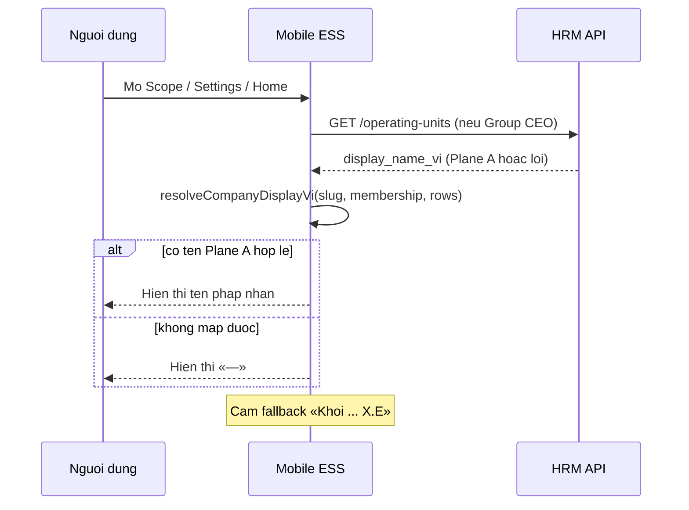

# BA-MOB-ORPH-KHOI-LABEL-01 — Mobile label lock (G-ORPH-MOB-01..03)

| Field | Value |
|-------|--------|
| **work_item_id** | `BA-MOB-ORPH-KHOI-LABEL-01` |
| **date** | 2026-07-30 (ICT) |
| **from_role** | ba-process |
| **to_role** | pm → **dev-mobile** (+ **dev-be** if `/operating-units` still seeds Khối) |
| **lane** | governance (AC / label lock — **cấm** `apps/**` edit in this wave) |
| **ack_status** | **PASS_TO_PM** |
| **HOLD_DEPLOY** | **true** · **U65** zero-seed |
| **QC intake** | `docs/qa/evidence/qc-mob-spec-orphan-code-sample-01-20260730.md` (FAIL G-ORPH-MOB-01..03) |
| **Register** | `docs/program/SPEC_CODE_TRACEABILITY_GAP_REGISTER.md` §4 — G-ORPH-MOB-01..03 **spec-ready to close after Dev+QA** |

---

## 1. Process objective

Khóa **chuỗi hiển thị** và **nguồn dữ liệu** cho mọi nhãn mobile mang nghĩa **công ty / ĐVTV / phạm vi công ty**, thay thế hardcode pilot «Khối … X.E» (Plane B fiction) bằng **tên pháp nhân Plane A** — cùng SoT **FR-HRM-EMP-COL-01** / **AC-EMP-COL-01..07** (web).

**Actors:** NV / Manager / Group CEO (mobile ESS) · HCNS (SoT ĐVTV trên XBOS) · Dev-Mobile (resolver) · Dev-BE (API `display_name_vi` sync) · QA (browser/device U65).

---

## 2. As-is vs to-be

| | As-is (QC FAIL 2026-07-30) | To-be (label lock) |
|---|---------------------------|---------------------|
| **SoT nhãn** | `PILOT_HRM_OPERATING_UNITS` + `resolveCompanyDisplayVi` → «Khối * X.E» | Plane A legal name (TECHSPEC §19.1 bridge) |
| **API fallback** | `GET /operating-units` empty → pilot Khối | API row `display_name_vi` = LE name; pilot **chỉ** khi label ∈ tập Plane A (bảng §4) |
| **Login toast** | Raw `membership.company_display` | Cùng resolver với Settings/Home |
| **OU section** | Copy «Đơn vị vận hành» nhưng row = Khối | Plane B **surface** giữ; **nhãn row** = cùng tên Plane A (không prefix «Khối») |
| **Thiếu bridge** | Vẫn hiện Khối | **«—»** (BR-EMP-COL-02) — **cấm** Khối che gap |

---

## 3. Spec read ack

| Artifact | § / UC | Use |
|----------|--------|-----|
| `docs/hrm/SRS.md` | §16.1 **FR-HRM-EMP-COL-01** · BR-EMP-COL-01..03 | SoT cột / nhãn «công ty» = Plane A |
| `docs/hrm/SRS_MOBILE.md` | UC-HRM-MOB-01/02 · **FR-HRM-MOB-OU-01** (delta 2026-07-23) | Cấm «Khối … X.E» khi copy = công ty |
| `docs/program/deltas/BA_HRM_ORPHAN_TO_SRS_01_20260723.md` | §16.1–16.2 | Orphan #1/#2 trace |
| `docs/hrm/TECHSPEC.md` | §19.1 normative bridge table | 5 slug → 5 nhãn Plane A |
| `docs/architecture/ADR-HRM-XBOS-PLANE-A-BRIDGE-4LE-5SLUG-20260727.md` | Accepted | code→slug; display = LE label |
| `docs/qa/evidence/ba-hrm-emp-company-col-01-20260722.md` | AC-EMP-COL-01..07 | Reuse logic on mobile |
| `docs/qa/evidence/mob-spec-orphan-code-sample-01-20260722.md` | G-ORPH-MOB-01..03 inventory | Surfaces + helpers |
| BE (read-only) | `resolveHrmCompanyUuidForSlug` in `hrm-list-scope.ts` | Bridge slug→B′ UUID; **display name** = LE/`company_slug_map` synced — mobile **không** gọi hàm này trực tiếp; tiêu thụ API |

**spec says:** Nhãn công ty/ĐVTV = tên pháp nhân (Plane A).  
**code does:** Slug → «Khối … X.E» từ pilot registry.

---

## 4. Normative display strings (Plane A — pilot bridge)

Mobile **must not** render any string matching **FAIL pattern** in §5 on **company-semantics** surfaces. Expected labels for operating slugs (when bridge applies):

| `operating_slug` / `company_id` | **Display string (VI)** — Plane A |
|-----------------------------------|-----------------------------------|
| `holding` / rollup `main` | Tập đoàn XeVN |
| `trsport` | Công ty Cổ phần Thương mại và Dịch vụ X.E |
| `logistics` | Công ty TNHH Du lịch Visun |
| `finance` | Công ty TNHH Du lịch X.E Việt Nam |
| `services` | Công ty TNHH X.E Việt Nam |

**Member slug keys** (e.g. `du-lich`, `xe-tmdv`) when present on `membership.company_id`: resolve via **membership.company_display** if valid VI legal name; else same Plane A bridge by mapped slug — **never** Khối.

---

## 5. Label lock — surface taxonomy

### 5.1 Company-semantics surfaces (bind Plane A — closes **G-ORPH-MOB-01**)

| Surface | File(s) | UI copy class |
|---------|---------|---------------|
| Scope — membership row title | `ScopeScreen.tsx` · `scopeScreenCopy.resolveMembershipRowTitle` | Phạm vi / kiêm nhiệm **công ty** |
| Scope — post-select context | Same | Tên công ty đã chọn |
| Settings — «Phạm vi đang dùng» | `SettingsScreen.tsx` | Công ty đang dùng |
| Home greeting company segment | `DashboardScreen.tsx` · `dashboardHome.ts` | Nhãn công ty trên hub |
| Payslip list/detail/summary company segment | `PayslipListScreen.tsx` · `PayslipDetailScreen.tsx` · `PayrollSummaryScreen.tsx` · `payslipDisplayVi.ts` | Phần công ty trong subtitle/header |
| Login success toast | `LoginScreen.tsx` L90 | «Đang dùng: …» — **G-ORPH-MOB-03** |

**FAIL display pattern (company-semantics):**

- Substring **`Khối`** + **`X.E`** in operating-unit fiction form (e.g. «Khối Logistics X.E»).
- Raw slug / UUID on user-visible label (except dev-only).

**PASS display:**

- One of §4 Plane A strings **or** `membership.company_display` when it is a Vietnamese legal name (diacritics present; not raw `[a-z0-9_-]+` slug).
- Unmapped slug / unknown UUID → **«—»** or «Chưa chọn công ty» (existing empty states) — **not** Khối.

### 5.2 Operating-unit filter surface (Plane B UX — closes **G-ORPH-MOB-02** partial)

| Element | Rule |
|---------|------|
| Section title | Giữ «Đơn vị vận hành» (`scopeScreenCopy.resolveOperatingUnitsSectionTitle`) — semantic Plane B |
| Row primary label | **`display_name_vi` from API** after BE sync; must equal §4 when slug is one of five pilot slugs |
| Row subtitle | «Lọc danh sách theo {label}» — `{label}` **must not** be Khối fiction |
| Rollup row | «Xem dữ liệu toàn tập đoàn» / «Phạm vi tập đoàn» — unchanged |

**Cấm:** Dùng Plane B fiction «Khối» trên row trong khi subtitle nói «lọc danh sách theo» nhãn công ty LE.

### 5.3 Resolver data-source priority (normative for Dev)

Apply in **`resolveCompanyDisplayVi`** (and callers); **replace** pilot Khối table.

| Priority | Source | Condition |
|----------|--------|-----------|
| **1** | `options.membershipCompanyDisplay` | Passes «valid VI legal» (not raw slug; not FAIL pattern §5.1) |
| **2** | `GET /operating-units` → `display_name_vi` for slug | Label ∉ FAIL pattern; prefer over client pilot |
| **3** | Client **offline** map | **Only** §4 Plane A strings keyed by slug — **rename** `PILOT_HRM_OPERATING_UNITS` → e.g. `PLANE_A_COMPANY_LABELS_FALLBACK`; **zero** «Khối» entries |
| **4** | Unknown slug / unmapped UUID | «—» or «Chưa chọn công ty» |

**QC note / BE coupling:** If `/operating-units` still returns Khối from BE registry, mobile-only change **insufficient** for AC-MOB-LABEL-02 — dispatch **dev-be** to align `display_name_vi` with LE (`company_slug_map` / bridge) per **AC-EMP-COL-03..04**. Mobile must **not** re-introduce Khối in client fallback when API returns bad labels (strip/replace via §4 map or show «—»).

**`resolveHrmCompanyUuidForSlug`:** BE concern — ensures slug→UUID for wire scope; **display** must come from LE name field exposed on API (employees summary / operating-units / membership login payload). Mobile does not duplicate BE UUID logic.

---

## 6. Business rules (ADD — mobile)

| ID | Condition | Action | Outcome |
|----|-----------|--------|---------|
| **BR-MOB-LABEL-01** | UI copy class = công ty / phạm vi / kiêm nhiệm / payslip company | Bind Plane A §4 or valid `company_display` | User sees ĐVTV name |
| **BR-MOB-LABEL-02** | Label would use pilot/registry «Khối … X.E» | **Block** — use §4 or «—» | G-ORPH-MOB-01 closed |
| **BR-MOB-LABEL-03** | Login toast after auth | Same resolver as Settings | G-ORPH-MOB-03 closed |
| **BR-MOB-LABEL-04** | OU filter section (Plane B) | Row label = synced `display_name_vi` (Plane A text) | Semantic tách title vs fiction Khối |
| **BR-MOB-LABEL-05** | HOLD_DEPLOY · U65 | QA = login → Scope/Settings → Home → Payslip; **no seed** | Evidence browser/device |

---

## 7. Acceptance criteria (measurable)

### AC-MOB-LABEL-01 — SoT nhãn (mirror AC-EMP-COL-01)

| ID | Persona / surface | Pass | Fail |
|----|-------------------|------|------|
| **AC-MOB-LABEL-01** | Group CEO · Scope membership title | Title ∈ §4 or valid `company_display` | Any «Khối … X.E» |
| **AC-MOB-LABEL-02** | Settings «Phạm vi đang dùng» | Same | Khối or raw slug |
| **AC-MOB-LABEL-03** | Home greeting | `companyLabel` ∈ §4 set | Khối |
| **AC-MOB-LABEL-04** | Payslip list subtitle | Company segment ∈ §4 | «Tháng … — Khối …» |
| **AC-MOB-LABEL-05** | Login toast (multi membership) | Toast uses resolver; no raw slug | Raw `company_display` slug/EN only |
| **AC-MOB-LABEL-06** | Offline / API fail | Fallback map = §4 only; unknown → «—» | `PILOT_HRM_OPERATING_UNITS` Khối strings |
| **AC-MOB-LABEL-07** | F5 / re-open Scope | Labels stable | F5 reverts to Khối |

### AC-MOB-OU-01..02 (extend FR-HRM-MOB-OU-01)

| ID | Pass | Fail |
|----|------|------|
| **AC-MOB-OU-01** | OU rows: `display_name_vi` = Plane A for five slugs | Khối on row |
| **AC-MOB-OU-02** | After pick → JWT/filter headers unchanged; only label changes | Scope regression |

### Register closure mapping

| Register ID | Closed when |
|-------------|-------------|
| **G-ORPH-MOB-01** | AC-MOB-LABEL-01..04, 06..07 PASS |
| **G-ORPH-MOB-02** | AC-MOB-OU-01 PASS + section title unchanged |
| **G-ORPH-MOB-03** | AC-MOB-LABEL-05 PASS |

---

## 8. Activity flow (Scope + label resolve)



---

## 9. Files in scope for Dev-Mobile (reference — not edited in BA wave)

| Path | Change type |
|------|-------------|
| `apps/mobile/hrm-mobile/src/integrations/hrmOperatingUnits.ts` | Replace pilot Khối labels with §4 |
| `apps/mobile/hrm-mobile/src/utils/companyDisplayVi.ts` | Priority chain §5.3; reject Khối |
| `apps/mobile/hrm-mobile/src/utils/scopeScreenCopy.ts` | Inherits fixed labels |
| `apps/mobile/hrm-mobile/src/utils/dashboardHome.ts` | Inherits resolver |
| `apps/mobile/hrm-mobile/src/utils/payslipDisplayVi.ts` | Inherits resolver |
| `apps/mobile/hrm-mobile/src/features/auth/LoginScreen.tsx` | Toast → `resolveCompanyDisplayVi` |
| `apps/mobile/hrm-mobile/src/utils/__tests__/*.test.ts` | Expect §4 strings; **no** Khối asserts |

**must_keep:** JWT scope wire; Plane B′ UUID normalize in `companyDisplayVi`; brand shell tokens; **U65** no seed.

**forbidden:** Reintroduce «Khối … X.E» in pilot fallback; deploy APK under HOLD_DEPLOY without PM unlock.

---

## 10. Handoff

### completion_report

- **Closed:** BA label lock for G-ORPH-MOB-01..03 — surface taxonomy, §4 normative strings, resolver priority, AC-MOB-LABEL-01..07 + AC-MOB-OU-01..02, BR-MOB-LABEL-01..05.
- **Residual:** Dev-Mobile implementation + unit tests; QA U65 spot (Group CEO + member CEO); if `/operating-units` returns Khối → **dev-be** align with AC-EMP-COL-03 (parallel). Register rows stay OPEN until QA PASS.

### next_owner

`dev-mobile` (primary) · `qa` after READY_FOR_QA · `dev-be` if API labels still Khối.

### evidence_path

`docs/qa/evidence/ba-mob-orph-khoi-label-01-20260730.md`

### ack_status

**PASS_TO_PM**

### next_dispatch_prompt

```text
work_item_id: D-MOB-G-ORPH-KHOI-01
from_role: pm
to_role: dev-mobile
lane: execution
entry: BA PASS BA-MOB-ORPH-KHOI-LABEL-01 — evidence docs/qa/evidence/ba-mob-orph-khoi-label-01-20260730.md; QC FAIL qc-mob-spec-orphan-code-sample-01-20260730.md (G-ORPH-MOB-01..03)
exit: Replace PILOT_HRM_OPERATING_UNITS Khối hardcodes with Plane A labels (TECHSPEC §19.1 table); implement resolver priority §5.3 in companyDisplayVi; LoginScreen toast via resolveCompanyDisplayVi; update jest — 0 «Khối … X.E» on company-semantics; ack_status READY_FOR_QA; evidence docs/qa/evidence/dev-mob-g-orph-khoi-01-YYYYMMDD.md
read_first: docs/qa/evidence/ba-mob-orph-khoi-label-01-20260730.md · docs/hrm/SRS_MOBILE.md UC-HRM-MOB-02 · docs/hrm/TECHSPEC.md §19.1
spec_read_ack: FR-HRM-EMP-COL-01 · FR-HRM-MOB-OU-01 · BR-MOB-LABEL-01..05 · AC-MOB-LABEL-01..07
change_mode: FIX
allowed_paths: apps/mobile/hrm-mobile/src/integrations/hrmOperatingUnits.ts · apps/mobile/hrm-mobile/src/utils/companyDisplayVi.ts · apps/mobile/hrm-mobile/src/utils/scopeScreenCopy.ts · apps/mobile/hrm-mobile/src/utils/dashboardHome.ts · apps/mobile/hrm-mobile/src/utils/payslipDisplayVi.ts · apps/mobile/hrm-mobile/src/features/auth/LoginScreen.tsx · apps/mobile/hrm-mobile/src/utils/__tests__/**
must_keep: U65 no seed · HOLD_DEPLOY · Plane B′ UUID pre-step in companyDisplayVi · JWT scope unchanged
forbidden: APK deploy · seed · Khối pilot strings
code_memory_required: true
code_memory_mode: APPEND
residual_auto_fix: if GET /operating-units still returns Khối after FE fix, pm_dispatch_hint dev-be D-HRM-EMP-COL-BE follow-up
```

### pm_dispatch_hint

After Dev READY_FOR_QA → **qa** with AC-MOB-LABEL-01..07, persona `ceo@xe.vn` + member CEO, U65 full path Scope→Settings→Home→Payslip, no seed. Then QC re-gate MOB-SPEC-ORPHAN sample.

---

## 11. SRS promote pointer (ADD-only — team)

Append to `docs/hrm/SRS_MOBILE.md` under UC-HRM-MOB-02 (optional ba-docs wave):

- **FR-HRM-MOB-LABEL-01** — Mobile company display = Plane A (**BR-MOB-LABEL-01..05**, **AC-MOB-LABEL-01..07**).
- Cross-ref: `docs/qa/evidence/ba-mob-orph-khoi-label-01-20260730.md`.
