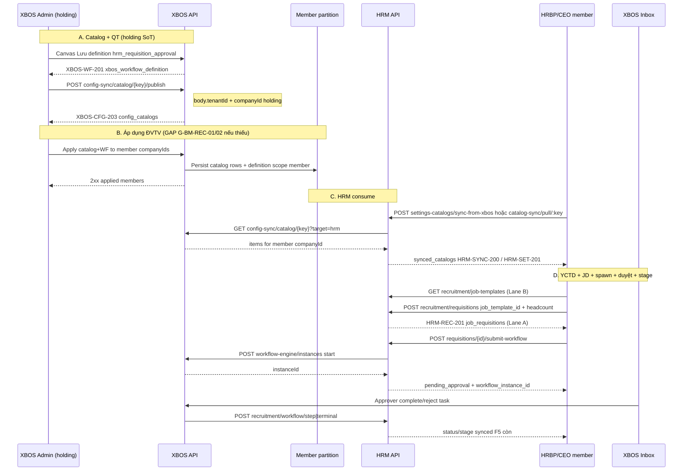

# BM-SA-XBOS-HRM-REC-TRACE-01 — XBOS → member → HRM recruitment SoT

| Field | Value |
|-------|--------|
| **work_item_id** | `BM-SA-XBOS-HRM-REC-TRACE-01` |
| **program** | `P1-BMINUTES-CUST-RETEST-01` · package **BM-06** |
| **from_role** | sa |
| **to_role** | pm |
| **lane** | governance |
| **date** | 2026-07-22 (ICT) |
| **change_mode** | ADD docs only — **cấm** `apps/**` · seed · Phase1/PROD claim |
| **ack_status** | **PASS_TO_PM** |

## spec_read_ack

| Artifact | Cite |
|----------|------|
| Program | `docs/program/BMINUTES_CUSTOMER_RETEST_PROGRAM.md` §1 BM-06 · §2 Wave0 |
| ADR | `docs/decisions/ADR-XBOS-HRM-RECRUITMENT-WORKFLOW-BRIDGE.md` (Accepted · Option A HRM-spawn) |
| TechSpec | `docs/hrm/TECHSPEC.md` §14.7 FR-RC-01 · §16.1 RC-03/05 · **§17.6** dual catalog F1–F10 |
| Ownership | `docs/hrm/DANH_MUC_XBOS_CHO_HRM.md` §6 STT 37–42 · §13 domain |
| BA / data | `docs/program/deltas/XBOS_HRM_REC_WF_BRIDGE_BA_DELTA.md` · `…_DATA_CONTRACT.md` |
| OpenAPI | `docs/api/openapi/xbos-api.yaml` `config-sync` + `workflow-engine` · `hrm-api.yaml` `/recruitment/*` |
| Linkage | `docs/hrm/HRM_MENU_DATA_LINKAGE_MATRIX.md` §3 publish/pull keys |
| Prior program | `docs/program/XBOS_HRM_RECRUITMENT_WORKFLOW_BRIDGE_PROGRAM.md` |

**must_keep:** UF-HRM-12 · J-HRM-05 · LeaveWorkflowBridge · CatalogWorkflowBridge · AC-CD-F6-* · G-DB-04 §17.6 · U65.

---

## 1. Architecture verdict (BM-06)

Customer ask: **XBOS cấu hình tuyển dụng → áp dụng ĐVTV → HRM chạy đúng WF gán** (YCTD + JD + duyệt + stage sync).

| Layer | As-is (evidence) | Target for BM-06 |
|-------|------------------|------------------|
| Catalog labels STT 37–42 | Publish = **one** `(tenantId, companyId)` row in XBOS `config_catalogs`; HRM pull → `synced_catalogs` **per company** | Holding edit → **explicit apply/fan-out** to selected member `company_id` → each member HRM pull |
| WF definition | Upsert/list scoped by JWT `(tenant, companyId)`; canvas templates in `workflow-catalog.constants` (`scopeLevel: group`) | Definition **bound** to member (clone/apply or documented group-scope resolve) so spawn uses **đúng QT gán** |
| Domain YCTD / JD / UV | HRM SoT: spine `job_requisitions` (+ `job_template_id`) · Lane B `job_templates`; bridge spawn Option A | FE: chọn JD → POST requisition spine → submit-workflow → inbox → callback stage |
| Dual catalogs | §17.6 CLOSED docs; F1–F10 forbidden | BM E2E **must** exercise Lane A + JD bind; không claim FR-RC trên Lane B |

**Standing:** Prior XHRM-REC-WF waves delivered bridge/OpenAPI/partial canvas QA — **not** a closed customer BM-06 E2E of publish→apply-members→HRM. This trace opens **G-BM-REC-*** for Wave1 narrow Dev/QA.

---

## 2. Mermaid sequence (normative BM-06 happy path)



**Alternate (must_keep):** Không bật WF / SPAWN-MISSING → entity `pending_approval` + banner; local CRUD UF-HRM-12 vẫn PASS (BR-REC-WF-09).

**Exception:** Unmapped `task_type` → `HRM-REC-WF-STAGE-UNMAPPED` (stage không đổi); PATCH stage khi instance active → `409 HRM-REC-WF-LOCKED`.

---

## 3. Step × API × DB × `company_id` scope

| # | Step | API (owner) | Primary tables | `company_id` / scope rule |
|---|------|-------------|----------------|---------------------------|
| 1 | Tạo/sửa QT tuyển dụng (canvas) | XBOS `POST/PUT …/workflow-engine/definitions` → `XBOS-WF-201` | `xbos_workflow_definition` (`workflow_code` ∈ plan/req/pipeline) | JWT `x-company-id` = **holding** hoặc member đang cấu hình; **không** auto-clone sang ĐVTV khác |
| 2 | Publish danh mục tuyển (STT 37–42 / runtime keys) | XBOS `POST /config-sync/catalog/{catalogKey}/publish` → `XBOS-CFG-203` | `config_catalogs` (+ items/version) | Body **single** `tenantId` + `companyId` — **một** partition; `assignedTo` ⊇ `hrm` |
| 3 | **Áp dụng ĐVTV** (catalog) | **Target:** XBOS fan-out / apply-members (**G-BM-REC-01** — thiếu SoT OpenAPI hôm nay) | Copy/upsert `config_catalogs` per member `company_id` | Holding actor; targets = member legal/operating slugs (`tenant-scope/group-member-units`) |
| 4 | **Áp dụng ĐVTV** (WF gán) | **Target:** clone/bind definition to member **or** documented group resolve (**G-BM-REC-02**) | `xbos_workflow_definition` rows for member **or** start resolve holding/`main` fallback | Member spawn must resolve **đúng** code `hrm_requisition_approval` (etc.) |
| 5 | HRM pull / settings sync | HRM `POST /catalog-sync/pull/:key` → `HRM-SYNC-200`; `POST /settings-catalogs/sync-from-xbos` → `HRM-SET-201` | `synced_catalogs` · `sync_audit_logs` | Pull **with member** `company_id` (parity list/get); holding pull ≠ member snapshot |
| 6 | Thư viện JD | HRM `GET/POST/PATCH …/recruitment/job-templates` | `job_templates` (**Lane B** §17.6) | Member `company_id`; leftover vs 44 FR — **không** FR-RC primary |
| 7 | Tạo YCTD chọn JD | HRM `POST /recruitment/requisitions` → `HRM-REC-201` | `job_requisitions` (**Lane A**) + soft `job_template_id` | Member scope; headcount SoT **here only** (F1/F6) |
| 8 | Spawn WF | HRM `POST …/requisitions/{id}/submit-workflow` → S2S XBOS `POST /workflow-engine/instances` | HRM: `workflow_instance_id` on plan/req/candidate; XBOS: `xbos_workflow_instance` / step_task | Spawn context: `memberTenantId` / `memberCompanyId` = entity company; definition resolve per ADR + bridge |
| 9 | Duyệt / từ chối | XBOS inbox `…/tasks/{id}/complete|reject` | XBOS tasks; side-effect notify HRM | Approver scope F4 resolver; **không** PATCH HRM stage tay |
| 10 | Stage / status sync | HRM `POST /recruitment/workflow/step` · `/terminal` (internal JWT) | Spine: `job_requisitions.status`; pipeline: candidate `stage` F6 map (`DATA_CONTRACT` §2) | Same company as entity; fail-closed UNMAPPED / LOCKED |
| 11 | Dashboard funnel | HRM aggregate recruitment dashboard (F6) | Counts by stage post-callback | Group CEO `main` rollup vs member slug — scope parity AC-REC-WF-09 |

### Runtime catalog keys (linkage §3 — verify vs DANH_MUC names)

| DANH_MUC STT | Tên (ownership) | Runtime key (linkage / pilot) | Note |
|--------------|-----------------|-------------------------------|------|
| 37 | Loại chiến dịch tuyển dụng | *(verify — often folded under grades/channels)* | **G-BM-REC-04** naming drift |
| 38 | Trạng thái yêu cầu tuyển | *(verify)* | Label only — status codes WF-owned |
| 39 | Nguồn ứng viên | `recruitment_channels` | Publish/pull documented |
| 40 | Trạng thái ứng viên | *(display vs F6 codes)* | F6 enum locked in data contract |
| 41 | Vòng phỏng vấn | *(verify)* | |
| 42 | Kết quả phỏng vấn | *(verify)* | |
| — | Chức danh / grade hỗ trợ TD | `job_titles` · `job_grades` | Often published holding; members need apply/pull |

---

## 4. Gap register — `G-BM-REC-*`

| Gap ID | Title | Severity | Spec says | Code/docs does | Owner Wave1 | Exit (narrow) |
|--------|-------|----------|-----------|----------------|-------------|----------------|
| **G-BM-REC-01** | Missing **publish-to-members** (catalog) | **P0** | BM-06: XBOS cấu hình → **áp dụng ĐVTV** | `PublishCatalogDto` = one `companyId`; no OpenAPI apply/fan-out to member list | `dev-be` (+ FE apply UX) | API+UI: select members → upsert catalog per slug; HRM pull member sees items; evidence U65 |
| **G-BM-REC-02** | Missing **bind WF** to member | **P0** | BM-06: HRM chạy đúng **WF gán** | Definition CRUD per scope; templates `scopeLevel: group`; spawn may fallback holding — **không** = customer «áp dụng QT» | `dev-be` (+ FE canvas apply) | Member company has active `hrm_requisition_approval` (clone/apply **or** ADR-documented group resolve + QA proof); submit-workflow 2xx |
| **G-BM-REC-03** | Dual catalog **F1–F10** on BM path | **P0** | §17.6 spine = FR-RC SoT | Two lanes under `/recruitment`; JD on Lane B; risk bind YCTD/WF/dashboard to wrong tables | `dev-fe` + `qa` (CM already §17.6) | E2E asserts: YCTD → `job_requisitions`; JD picker → `job_template_id`; cấm F1–F10; no Lane B as FR-RC SoT |
| **G-BM-REC-04** | STT 37–42 ↔ runtime key matrix incomplete | **P1** | DANH_MUC §6 + linkage §3 | Only `recruitment_channels` / `job_grades` clearly listed; other STT opaque | `ba-data` (map) → `dev-be` if keys missing | Table STT→`catalogKey` published; pull smoke per key on member |
| **G-BM-REC-05** | JD chọn trên YCTD (BM-05∩06) FE completeness | **P1** | BM-05 thư viện JD + BM-06 chain | BE: `job_template_id` on requisitions; FE JobTemplatesTab prior CD-FB-09 | `dev-fe` | Create YCTD: chọn JD → POST có `job_template_id` → F5 còn; member scope |
| **G-BM-REC-06** | Stage sync E2E residual | **P1** | AC-REC-WF-03/04 · J-REC-WF-03/04 | Prior canvas fixes (instance remap) — customer retest still required | `qa` | Browser U65 J-REC-WF-03/04 on :8088/local; no `instance_mismatch` |

**Reuse (không mở lại như gap mới):** G-DB-04 docs CLOSED · G-RC-01 headcount VERIFY · Leave/Catalog bridges must_keep.

---

## 5. Decision options (apply-members — architecture only)

| Option | Summary | Pros | Cons | Verdict |
|--------|---------|------|------|---------|
| **A** | Holding publish once; HRM members pull **same** holding catalog via rollup read | Fast | Breaks per-company extension; conflicts partition model | Reject for BM-06 |
| **B** | **Fan-out apply:** holding POST copies catalog (+ optional WF definition) to N member `company_id` | Matches customer «áp dụng ĐVTV»; audit per member | New API + FE wizard | **SELECT** for G-BM-REC-01/02 |
| **C** | Group-scoped single definition row + spawn always resolve `holding`/`main` | Less DDL | Opaque to member admin; weak «WF gán» UX | Accept **only** as interim if ADR amends + QA proves; still need catalog fan-out |

**Recommendation:** Option **B** for catalogs; for WF prefer **B clone/apply** to member, with documented fallback to holding definition only as SPAWN safety net (already in bridge) — not as substitute for apply UX.

---

## 6. Validation / acceptance (for QA after Dev)

| ID | Click path (U65) | PASS when |
|----|------------------|-----------|
| J-REC-WF-01 + apply | XBOS: QT + catalog → **Áp dụng** member → reload member settings | Member sees version/items |
| BM-06 chain | Member HRM: sync → JD → YCTD → Gửi duyệt → Inbox duyệt → F5 | Network 2xx; status/stage đúng; không seed |
| Regression | UF-HRM-12 · J-HRM-05 · leave terminal · F6 funnel | 🟢 không regression |
| Dual | Assert spine tables / codes | No F1–F10 violation |

Evidence target (QA): `docs/qa/evidence/bm-qa-rec-e2e-8088-01-*.md` · work_item `BM-QA-REC-E2E-8088-01`.

---

## 7. Out of scope (this SA task)

- `apps/**` implementation · seed · Phase1/PROD · Connect BM-01 · full BM-03 dynamic resolver redesign (separate package).

---

## completion_report

**Closed:** BM-06 architecture SoT — sequence diagram, step×API×DB×scope table, gap IDs **G-BM-REC-01..06**, option B recommend for apply-members; evidence this file.  
**Residual:** Execution Wave1 narrow BE/FE/QA only (below). Dual-catalog docs remain §17.6; no apps touch by SA.

## next_owner

`pm` → dispatch parallel narrow: `dev-be` (01/02) · `dev-fe` (03/05) · `ba-data` (04) · `qa` (06 / E2E after READY).

## next_dispatch_prompt

```text
work_item_id: BM-BE-REC-APPLY-MEMBERS-01
from_role: pm
to_role: dev-be
priority: P0
entry: docs/qa/evidence/bm-sa-xbos-hrm-rec-trace-01-20260722.md §3–§5 · ADR-XBOS-HRM-RECRUITMENT-WORKFLOW-BRIDGE · OpenAPI config-sync
job: Close G-BM-REC-01 (+ G-BM-REC-02 if same PR blast OK else separate BM-BE-REC-WF-BIND-01).
  - ADD XBOS apply/fan-out: holding publishes recruitment catalogs to selected member companyIds (upsert config_catalogs per partition).
  - ADD or document+implement WF definition bind/clone to members for hrm_requisition_approval (and plan/pipeline codes).
  - OpenAPI delta same PR; jest scope parity; CODE-MEMORY APPEND; must_keep Leave/Catalog bridges + UF-HRM-12.
  - cấm: seed · REPLACE leave notify · Phase1/PROD
exit: READY_FOR_QA · evidence docs/qa/evidence/bm-be-rec-apply-members-01-YYYYMMDD.md
```

```text
work_item_id: BM-FE-REC-JD-YCTD-SCOPE-01
from_role: pm
to_role: dev-fe
priority: P0
entry: bm-sa-xbos-hrm-rec-trace-01 §4 G-BM-REC-03/05 · TECHSPEC §17.6 F1–F10 · JobTemplatesTab
job: Member HRM — JD picker on create YCTD binds job_template_id → POST requisitions (Lane A); surface apply-members result if BE ready; cấm bind FR-RC to job_postings/candidates catalog.
exit: READY_FOR_QA · evidence docs/qa/evidence/bm-fe-rec-jd-yctd-01-YYYYMMDD.md
```

```text
work_item_id: BM-QA-REC-E2E-8088-01
from_role: pm
to_role: qa
priority: P0
entry: AFTER BM-BE + BM-FE READY_FOR_QA · U65 · matrix UF/J-REC-WF-*
job: Browser: XBOS catalog+QT → apply member → HRM sync → JD → YCTD → submit WF → duyệt → stage/F5. Close G-BM-REC-06 proof. Assert no F1–F10. cấm seed.
exit: PASS_TO_PM · docs/qa/evidence/bm-qa-rec-e2e-8088-01-YYYYMMDD.md
```
