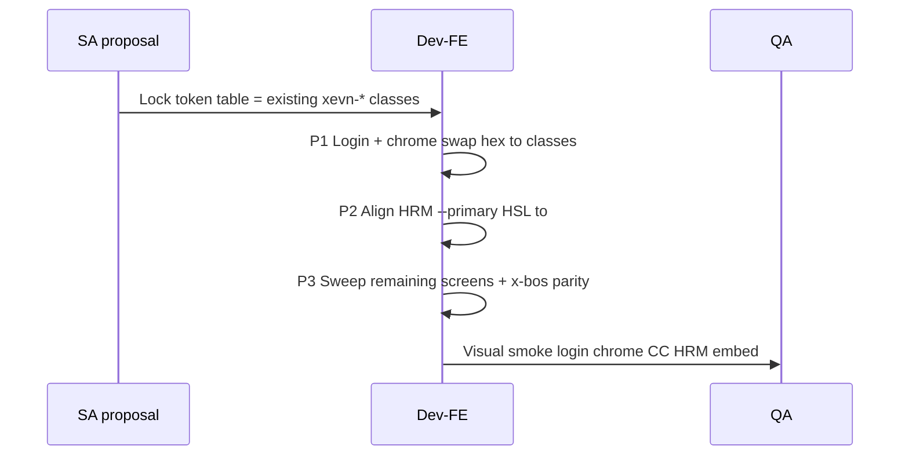

# FE-XEVN-BRAND-TOKEN-FEASIBILITY-01 — Web portal brand token adoption (no big-bang)

| Field | Value |
|-------|--------|
| **work_item_id** | `FE-XEVN-BRAND-TOKEN-FEASIBILITY-01` |
| **Date** | 2026-07-22 |
| **Owner** | Dev-FE |
| **Scope** | Feasibility only — **no** `apps/**` / Tailwind / component edits |
| **ack_status** | `PASS_TO_PM` |
| **next_owner** | `sa` |

---

## 1. Verdict (executive)

Web portal **already has** Master Standard V3 brand tokens in Tailwind (`xevn.primary` → classes `bg-xevn-primary` / `text-xevn-primary`, `rounded-card`, `rounded-input`, `shadow-soft`). Adoption without big-bang is **feasible**: treat tokens as SoT, migrate surface-by-surface (login → chrome → CC pattern → remaining screens), and **align HRM shadcn HSL primary** + **x-bos-core partial palette** in later waves — do **not** invent a second token system.

---

## 2. Where tokens are defined today

### 2.1 Canonical (web-portal) — closest to Master Standard

**File:** `apps/web/web-portal/tailwind.config.cjs`

| Token key (config) | Value | Tailwind class(es) |
|--------------------|-------|---------------------|
| `theme.extend.colors.xevn.primary` | `#1E40AF` | `bg-xevn-primary`, `text-xevn-primary`, `border-xevn-primary`, `/10` `/45` opacity variants |
| `xevn.accent` | `#06B6D4` | `bg-xevn-accent`, `text-xevn-accent`, `ring-xevn-accent` |
| `xevn.success` / `warning` / `danger` / `info` / `neutral` | DNA greens/oranges/reds/blues/gray | `*-xevn-success` etc. |
| `xevn.background` | `#F9FAFB` | `bg-xevn-background` |
| `xevn.surface` | `#FFFFFF` | `bg-xevn-surface` |
| `xevn.text` / `textSecondary` / `border` | slate-ish | `text-xevn-text`, `border-xevn-border` |
| `borderRadius.card` | `12px` | `rounded-card` |
| `borderRadius.input` | `8px` | `rounded-input` |
| `boxShadow.soft` | `0 4px 24px -4px rgba(15, 23, 42, 0.08)` | `shadow-soft` |
| `boxShadow.overlay` | overlay elevation | `shadow-overlay` |

**CSS utilities (not Tailwind theme keys):** `apps/web/web-portal/src/index.css` `@layer utilities`

| Utility | Role |
|---------|------|
| `.xevn-safe-inline` | Symmetrical horizontal safe padding (clamp) |
| `.bg-workflow-canvas-dots` | Workflow canvas slate-50 + dots |
| `.gradient-text` | Hardcoded gradient `#1e40af → #06b6d4 → #ef4444` (risk: not token-driven) |

**FE alias constants (already map to tokens):** `apps/web/web-portal/src/pages/command-center/settings-form-pattern.tsx`

| Constant | Resolves to |
|----------|-------------|
| `SETTINGS_RADIUS_CARD` | `'rounded-card'` |
| `SETTINGS_RADIUS_INPUT` | `'rounded-input'` |
| `XEVN_VIEWPORT_PADDING` | `'xevn-safe-inline'` |
| Nav active caption classes | `text-xevn-primary` |

### 2.2 HRM embed — dual theme (token + shadcn)

**File:** `apps/web/hrm/tailwind.config.ts`

- Same `colors.xevn.*` hex block as portal (`primary: #1E40AF`, `rounded-card` / `input`, `shadow-soft`).
- **Also** shadcn semantic colors via CSS vars in `apps/web/hrm/src/index.css`:
  - `--primary: 221 83% 53%` → class `bg-primary` / `text-primary` (≈ blue-600 `#2563EB`, **not** `#1E40AF`).
  - `--radius: 0.5rem` (8px) vs brand `rounded-card` 12px — dual radius stories.
- UI primitives (`button.tsx`, `card.tsx`, …) prefer `bg-primary` + `rounded-input` + `shadow-soft`, not `bg-xevn-primary`.
- `.xevn-safe-inline` duplicated in HRM `index.css`.

### 2.3 X-BOS core — partial / divergent

**File:** `apps/web/x-bos-core/tailwind.config.cjs`

| Present | Missing / different |
|---------|---------------------|
| `xevn.primary` `#1E40AF`, accent, surface, text, border | No `success`/`warning`/`danger` DNA set |
| `shadow-soft` | **Different** shadow formula vs portal |
| `shadow-glass` | Portal does not define |
| — | **No** `rounded-card` / `rounded-input` |
| background `#F5F5F7` | Portal `#F9FAFB` |

### 2.4 packages/ui — divergent accent only

**File:** `packages/ui/tailwind.config.js` — `'xevn-accent': '#3b82f6'` (Tailwind blue-500), **not** portal cyan `#06B6D4`. Do not treat as SoT for portal brand.

### 2.5 Assets

`assets/brand/README.md` — logo sync paths; not CSS tokens. Login uses `/xevn-logo.png`.

---

## 3. Current usage snapshot (read-only scan)

| Surface | Token posture |
|---------|----------------|
| **Command Center + settings pattern** | Heavy `bg-xevn-*` / `shadow-soft` / `SETTINGS_RADIUS_*` — already “on brand” class-wise |
| **Login** (`LoginPage.tsx`) | Hardcoded `bg-[#F9FAFB]`, CTA `bg-[#1E40AF]`, `rounded-2xl` / `rounded-lg` — **not** `rounded-card` / `bg-xevn-primary` |
| **Chrome** | `TopHeader`: `xevn-safe-inline` + `shadow-soft`; Sidebar still mostly **slate dark** palette |
| **HRM pages** | Mostly `bg-primary` / `blue-*` / status colors; `xevn-*` limited to a few UI kit files |
| **Hardcoded `#1E40AF`** | Login CTA + a few portal files + all three app Tailwind configs (definition sites) |

**Scan counts (2026-07-22, apps/web):** `*-xevn-primary` / `border-xevn-*` ≈ **558** hits; hardcoded `#1E40AF` ≈ **17**; `rounded-card`|`rounded-input`|`shadow-soft` ≈ **309**; `SETTINGS_RADIUS_CARD` ≈ **84**. HRM business screens still lean on shadcn `primary` over `xevn-*`.

---

## 4. Mapping table — proposal tokens → existing classes

Aligned with `.cursorrules` §2.1–2.2 and portal Tailwind. Proposed **CSS custom property** names are optional future SoT; **today’s shippable classes already exist**.

| Proposal token (suggested name) | Spec / Master Standard | Existing Tailwind / utility | Notes |
|---------------------------------|------------------------|-----------------------------|-------|
| `--color-brand-primary` / `color.primary` | `#1E40AF` | `bg-xevn-primary`, `text-xevn-primary`, `border-xevn-primary` | Prefer class; avoid `#1E40AF` literals |
| `--color-brand-accent` | `#06B6D4` | `*-xevn-accent` | Not `packages/ui` `#3b82f6` |
| `--color-surface` | `#FFFFFF` | `bg-xevn-surface`, `bg-white` | Prefer `xevn-surface` for opacity |
| `--color-background` | `#F9FAFB` | `bg-xevn-background` | Login still uses hex |
| `--color-text` / `--color-text-muted` | `#1F2937` / `#6B7280` | `text-xevn-text`, `text-xevn-textSecondary` | Often still `slate-*` |
| `--color-border` | `#E5E7EB` | `border-xevn-border` | |
| `--color-success` / `warning` / `danger` | DNA Active/Pending/Error | `*-xevn-success` / `warning` / `danger` | Portal defines; HRM also has HSL success/warning |
| `--radius-card` | `12px` | `rounded-card` or `SETTINGS_RADIUS_CARD` | Alias already in settings-form-pattern |
| `--radius-input` | `8px` | `rounded-input` or `SETTINGS_RADIUS_INPUT` | |
| `--shadow-soft` | soft elevation | `shadow-soft` | **x-bos-core value differs** — unify later |
| `--shadow-overlay` | modal/drawer | `shadow-overlay` | Portal + HRM |
| `--layout-safe-inline` | symmetrical margin | `xevn-safe-inline` | CSS utility, not theme key |
| `--layout-header-axis` | `h-10` title/search row | `WORKSPACE_STICKY_HEADER_AXIS_H` (`h-9` today) | Spec says `h-10` — minor drift |
| Workflow canvas | slate-50 + dots | `bg-workflow-canvas-dots` | |
| Glass sticky | blur + surface/80 | `backdrop-blur-md` + `bg-xevn-surface/80` or `bg-white/70` | Pattern already in CC sticky headers |
| HRM semantic primary | should = brand | Today: `bg-primary` → HSL ≠ `#1E40AF` | Remap `--primary` HSL to match `#1E40AF` in P2/P3 |

**Do not introduce** parallel names like `brand-blue` / `xevnBlue` while `xevn-primary` exists.

---

## 5. Incremental adoption plan (no big-bang)



| Phase | Scope | Approach | Effort (eng-days) | Risk |
|-------|-------|----------|-------------------|------|
| **P0 (docs)** | This evidence + SA proposal merge | No code | 0.25 | — |
| **P1** | Login + chrome (TopHeader, MainLayout, Sidebar active states) | Replace hex / generic `rounded-lg` with `bg-xevn-*`, `rounded-card`/`input`, `shadow-soft`; keep layout structure | **0.5–1.5 d** | Low — few files; high visual ROI |
| **P2** | HRM CSS var bridge | Set `--primary` (and ring/sidebar-primary) HSL equivalent of `#1E40AF`; keep `bg-primary` API; optional deprecate duplicate `xevn` hex later | **1–2 d** + visual QA | Medium — every `bg-primary` button shifts |
| **P3** | All portal screens + x-bos-core + leftover `blue-*` / hex | Codemod + manual glass/slate dark sidebar decisions; unify `shadow-soft`; add missing radius tokens to x-bos | **5–12 d** | High blast radius; iframe/embed regression |

**P1 vs P3 summary**

| | P1 (login + chrome) | P3 (all screens) |
|--|---------------------|------------------|
| Files (order of magnitude) | ~5–10 | 100+ across portal/HRM/x-bos |
| Config change | Optional none (tokens exist) | Align 3 Tailwind configs + HRM `:root` |
| QA | Login + header smoke | Full L2 matrix + embed J-HRM-* visual |
| Recommendation | **Do first** after SA locks proposal | Wave after P1/P2; never single PR big-bang |

---

## 6. Risks

| Risk | Severity | Mitigation |
|------|----------|------------|
| Hardcoded `#1E40AF` / `#F9FAFB` (Login, gradients) | Medium | P1 replace with `bg-xevn-primary` / `bg-xevn-background`; ban new hex in review |
| **Duplicate themes:** `xevn.primary` hex vs HRM `--primary` HSL | **High** | P2 remap HSL; document single SoT in proposal |
| **Triple Tailwind configs** (portal / hrm / x-bos) drift | High | SA: “portal config is SoT”; FE copy keys; later shared `packages/ui` or `@xevn/tokens` — only after values identical |
| `packages/ui` `xevn-accent` ≠ portal accent | Medium | Quarantine; do not import package accent into portal |
| x-bos `shadow-soft` ≠ portal | Low–Med | Unify formula in P3 |
| Dark slate Sidebar vs brand surface | Product | Decide in proposal: keep dark rail or brand surface — FE must not guess |
| `SETTINGS_RADIUS_*` string aliases vs raw classes | Low | Keep aliases; they already point at tokens |
| Glassmorphism ad-hoc (`bg-white/70` vs `bg-xevn-surface/80`) | Low | Document one sticky recipe in proposal |
| Big-bang class rename PR | High | **Forbidden** — phased P1→P3 |

---

## 7. Copy-ready § for SA → `docs/program/XEVN_BRAND_UIUX_PROPOSAL.md`

> Paste as a dedicated section (e.g. § FE token feasibility / adoption).

```markdown
## FE token feasibility (web) — Dev-FE 2026-07-22

**work_item:** FE-XEVN-BRAND-TOKEN-FEASIBILITY-01  
**evidence:** `docs/qa/evidence/fe-xevn-brand-token-feasibility-01-20260722.md`  
**Constraint:** Adopt without big-bang; **do not** invent a second class namespace.

### SoT (already in repo)

| Brand intent | Implement as |
|--------------|--------------|
| Primary `#1E40AF` | `*-xevn-primary` from `apps/web/web-portal/tailwind.config.cjs` |
| Surface / background | `bg-xevn-surface` / `bg-xevn-background` |
| Card / input radius | `rounded-card` (12px) / `rounded-input` (8px); aliases `SETTINGS_RADIUS_CARD` / `SETTINGS_RADIUS_INPUT` |
| Soft shadow | `shadow-soft` (portal formula) |
| Safe inline | utility `.xevn-safe-inline` in `index.css` |

### Phased adoption

1. **P1 (~0.5–1.5d):** Login + chrome — replace hardcoded `#1E40AF` / `#F9FAFB` and generic radii with token classes.
2. **P2 (~1–2d):** HRM `:root --primary` HSL → match `#1E40AF` so `bg-primary` ≡ brand (embed parity).
3. **P3 (~5–12d):** Remaining portal screens + x-bos-core palette/radius/shadow parity; purge stray `blue-*` / hex; optional extract shared tokens package **only after** values converge.

### Non-goals (this wave)

- No Tailwind rewrite / design-system package greenfield.
- No forcing dark Sidebar to white without product decision.
- No claim of Phase 1 / PROD readiness from brand work alone.

### Risks SA must call out

- Dual primary (hex `xevn` vs HRM HSL `primary`).
- Divergent `packages/ui` and x-bos-core configs.
- Hardcoded hex on Login CTA until P1.
```

---

## 8. Out of scope / residuals

| Item | Owner |
|------|--------|
| Author full `XEVN_BRAND_UIUX_PROPOSAL.md` | **SA** (`SA-XEVN-BRAND-UIUX-01`) |
| Mobile token feasibility | Dev-Mobile (`MOB-XEVN-BRAND-TOKEN-FEASIBILITY-01`) |
| HTML brand gap | BA-Docs |
| Any `apps/**` implementation | **Deferred** until SA proposal locked + PM dispatch Dev-FE P1 |

---

## 9. Completion contract

```yaml
work_item_id: FE-XEVN-BRAND-TOKEN-FEASIBILITY-01
from_role: dev-fe
to_role: pm
ack_status: PASS_TO_PM
next_owner: sa
evidence_path: docs/qa/evidence/fe-xevn-brand-token-feasibility-01-20260722.md
product_code_changed: false
completion_report: |
  Closed: inventory of xevn-primary / rounded-card / shadow-soft definition sites
  (portal + HRM + x-bos + packages/ui); mapping proposal→existing classes;
  P1 vs P3 effort; risks (hex Login, dual HRM primary, config drift);
  copy-ready SA merge §. No apps/** edits.
residual: |
  SA must publish XEVN_BRAND_UIUX_PROPOSAL.md incorporating §7;
  PM may later dispatch FE-XEVN-BRAND-P1-LOGIN-CHROME (implementation) after SA lock.
next_dispatch_prompt: |
  You are SA. work_item_id SA-XEVN-BRAND-UIUX-01.
  Merge the copy-ready § from docs/qa/evidence/fe-xevn-brand-token-feasibility-01-20260722.md
  into docs/program/XEVN_BRAND_UIUX_PROPOSAL.md (create if missing).
  Lock SoT = web-portal tailwind xevn-* classes; document P1→P3 adoption;
  call out dual HRM --primary vs xevn.primary and x-bos/packages/ui drift.
  Cấm apps/**. exit PASS_TO_PM. evidence_path docs/program/XEVN_BRAND_UIUX_PROPOSAL.md
  (+ short note in docs/qa/evidence/ if needed).
```

---

*Dev-FE · feasibility-only · 2026-07-22*
