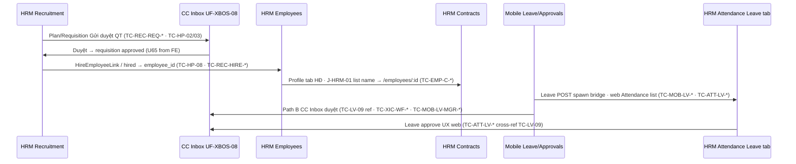

# Evidence — PO-ECO-TC-SYNTH-WAVE-A-01

| Meta | Value |
|------|--------|
| **work_item_id** | `PO-ECO-TC-SYNTH-WAVE-A-01` |
| **from_role** | qa |
| **to_role** | pm |
| **date** | 2026-08-03 |
| **ack_status** | **PASS_TO_PM** |
| **mode** | Design-only SYNTH — **no browser** · **no seed** · **no UAT/Phase1 DONE** |

---

## 1. completion_report

**Closed**

- Scanned **6 Wave A packs** + spine `PO_SPEC_TEST_CASE_CATALOG.md` (53 TC) for TC-ID collisions.
- **Cross-pack collisions:** **0** — prefix namespaces disjoint (`TC-EMP-*`, `TC-REC-*`, `TC-ATT-*`, `TC-LE|SHR|DOC|OU-*`, `TC-XIC-*`, `TC-MOB-LV-*` vs spine `TC-HP|LV|AT|MGR|UNIT|X-*`).
- Documented **FK cross-menu** edges (hire→employees, leave↔inbox, recruitment hire link, J-HRM-01 contracts↔profile).
- Roster Wave A leaf rows → **SYNTHED**; synth WI closed.
- `PO_SPEC_TEST_REPORT.md` §6 Ecosystem depth Wave A rollup added.
- `testcases/README.md` index updated with paths + counts.

**Residual (non-blocking for synth PASS)**

| ID | Item | Owner hint |
|----|------|------------|
| **LV-02 / TC-LV-03** | Ladder `T_L1`/`N` — **SPEC_GAP** | SA/BA · spine + `TC-ATT-LV-BLK-*` · `TC-MOB-LV-X-003` **BLOCKED** |
| **SPEC_GAP-HDSD-EMP-01** | HDSD leaf «Danh sách nhân sự» | **Closed** — `HDSD_XEVN_CH06_HRM_NHAN_SU.md` · `ba-hdsd-emp-leaf-01.md` |
| TC-ID **intra-pack echo** | 35 IDs appear twice in same file (matrix §4 + trace §5) | Optional pack cleanup Wave B — **no rename required** for synth |
| TC row count vs grep | EMP 156 claimed vs 121 unique `\| TC-* \|` rows; REC 118 vs 86; ORG 38 vs 37 | Pack §4 index uses bundled counts — **defer** to author refresh if PM wants machine audit = author table |

---

## 2. TC-ID collision scan

### 2.1 Method

- Regex: `^\| (TC-[A-Z0-9-]+) \|` on each pack matrix/trace tables.
- Spine: catalog §2–§6 primary IDs only (53 rows).

### 2.2 Cross-file (Wave A + spine)

| Result | Count |
|--------|------:|
| Unique depth IDs across 6 packs (deduped per file) | **397** |
| IDs shared by **two different pack files** | **0** |
| Depth ID **equals** spine primary ID (same string) | **0** |

### 2.3 Rename table

**No renames applied** — namespaces already unique; spine uses **neo map** (same business case, different ID).

| If ever needed | Rule |
|----------------|------|
| New depth TC clashes spine | Prefix pack token first (`TC-REC-*` not `TC-HP-*`) |
| Cross-menu duplicate scenario | One **canonical** pack owns ID; others `cross_ref:` only |

### 2.4 Intra-pack duplicate rows (trace echo — not cross-menu)

Same `TC-ID` listed in §4 matrix and §5 trace (same file):

| Pack | Duplicate ID count |
|------|-------------------:|
| HRM-EMPLOYEES.md | 9 |
| HRM-RECRUITMENT.md | 5 |
| HRM-ATTENDANCE.md | 6 |
| XBOS-ORG-SHARE.md | 4 |
| XBOS-INBOX-CAT.md | 6 |
| MOB-LEAVE-APPR.md | 5 |

### 2.5 Spine ↔ depth neo map (overlaps — not collisions)

| Spine TC-ID | Depth pack TC-ID(s) | Theme |
|-------------|---------------------|-------|
| TC-HP-06..08 | TC-REC-CAND-* · TC-REC-HIRE-* · TC-REC-SPINE-HP-001 | Candidate + hire link |
| TC-HP-03/04/13 | TC-XIC-WF-* | UF-XBOS-08 Inbox |
| TC-X-03 | TC-XIC-CG-* · TC-XIC-CC-* | Catalog gov / publish |
| TC-MGR-01 | TC-EMP-F-HP-006 | manager_id PATCH |
| TC-LV-01..16 | TC-ATT-LV-* · TC-MOB-LV-X-00* | Leave web + mobile |
| TC-HP-09 | TC-EMP-L-HP-008 · TC-REC-HIRE-* → profile | Post-hire profile |
| TC-HP-10 / J-HRM-01 | TC-EMP-C-HP-001 (profile contracts tab) | Contracts ↔ profile |

Spine **53 TC unchanged** — depth adds **465** catalog PLANNED TC (execution wave later).

---

## 3. FK cross-menu notes



| Edge | Precond (U65) | Primary depth TC | Journey / UF |
|------|---------------|------------------|--------------|
| Hire → employee profile | Candidate **Đã tuyển** from REC UI | TC-REC-HIRE-* → TC-EMP-L-HP-008 | HP-05 · J-HRM-02 |
| Recruitment WF ↔ Inbox | Task from **Gửi duyệt** FE | TC-REC-REQ-WF-* ↔ TC-XIC-WF-HP-* | UF-XBOS-08 · TC-HP-03 |
| Leave mobile approve ↔ web/Inbox | `manager_id` + pending leave | TC-MOB-LV-MGR-* ↔ TC-ATT-LV-* / TC-LV-09 | J-MOB-05 · UF-HRM-08 |
| Contracts list → profile | NV row in contracts | TC-EMP-C-HP-001 (pack) · spine TC-HP-10 PLANNED | **J-HRM-01** |
| Catalog publish → HRM pull | CEO publish/apply | TC-XIC-CG-* / TC-XIC-CC-* | TC-X-03 · UF-XBOS-15 |
| Org legal entity → HRM company scope | Member unit saved CC | TC-LE-HP-* · scope AU | UF-XBOS-02/03 |

---

## 4. Wave A rollup (authoritative pack footers)

| Pack | Screens | Fields | Functions | TCs | Evidence |
|------|--------:|-------:|----------:|----:|----------|
| `hrm-web/HRM-EMPLOYEES.md` | 40 | 118 | 72 | **156** | `po-eco-tc-hrm-employees-01.md` |
| `hrm-web/HRM-RECRUITMENT.md` | 38 | 94 | 62 | **118** | `po-eco-tc-hrm-recruitment-01.md` |
| `hrm-web/HRM-ATTENDANCE.md` | 41 | 87 | 58 | **82** | `po-eco-tc-hrm-attendance-01.md` |
| `xbos/XBOS-ORG-SHARE.md` | 12 | 44 | 19 | **38** | `po-eco-tc-xbos-org-share-01.md` |
| `xbos/XBOS-INBOX-CAT.md` | 12 | 28 | 18 | **32** | `po-eco-tc-xbos-inbox-cat-01.md` |
| `hrm-mobile/MOB-LEAVE-APPR.md` | 15 | 34 | 25 | **39** | `po-eco-tc-mob-leave-appr-01.md` |
| **Wave A total** | **158** | **405** | **254** | **465** | — |

All depth TC status: **PLANNED** (catalog only).

### 4.1 BLOCKED / SPEC_GAP (Wave A refs)

| ID | Where | Status |
|----|-------|--------|
| **LV-02** · **TC-LV-03** | Spine catalog · ATT `TC-ATT-LV-BLK-*` · MOB `TC-MOB-LV-X-003` | **SPEC_GAP / BLOCKED** — no invent `T_L1` |
| **SPEC_GAP-HDSD-EMP-01** | HRM-EMPLOYEES meta §5 | **Closed** — `docs/client-delivery/hdsd/hrm/HDSD_XEVN_CH06_HRM_NHAN_SU.md` |

---

## 5. next_owner

**pm** — dispatch Wave B pack authors or `PO-ECO-TC-SYNTH-WAVE-B-01` after B seats READY_FOR_SYNTH; parallel **ba-docs** for HDSD-EMP leaf if sponsor wants U76 closure.

## 6. next_dispatch_prompt

```text
work_item_id: PO-ECO-TC-HRM-CONTRACTS-01 (or next Wave B seat from PO_ECOSYSTEM_TESTCASE_DEPTH_PROGRAM.md §5)
from_role: pm
to_role: qa

Mission: Wave B menu TC pack — HRM-CONTRACTS (or Insurance/Payroll/RACI per roster PLANNED). Same DoD as Wave A; READY_FOR_SYNTH when §4 coverage 0 GAP.

read_first: docs/program/PO_ECOSYSTEM_TESTCASE_DEPTH_PROGRAM.md · docs/qa/testcases/_TEMPLATE_MENU_TC_PACK.md · roster ECOSYSTEM_MENU_ROSTER.md Wave B rows

cấm: apps/** · seed · UAT DONE · delete Wave A pack content

Alternate (governance):
work_item_id: BA-HDSD-EMP-LEAF-01
to_role: ba-docs
Mission: Close SPEC_GAP-HDSD-EMP-01 — HDSD leaf path «Danh sách nhân sự / hồ sơ» aligned U76; no prompt-echo in client doc.
```

---

*PO-ECO-TC-SYNTH-WAVE-A-01 · qa PASS_TO_PM*

---

## 9. Wave B synth pointer (append — do not edit §1–8)

| Meta | Value |
|------|--------|
| **WI** | `PO-ECO-TC-SYNTH-WAVE-B-01` |
| **Evidence** | `docs/qa/evidence/po-eco-tc-synth-wave-b-01.md` |
| **Packs** | 7 — CON · PAY · DEC · RACI · RBAC · MOB-HOME · MOB-ATT |
| **Claimed TC** | **394** · **768** unique IDs A+B · **0** cross-pack collisions |
| **Report** | `PO_SPEC_TEST_REPORT.md` §7 |

Wave A §2.5 neo-map still valid; Wave B extends §2.5 in Wave B evidence §2.5.

