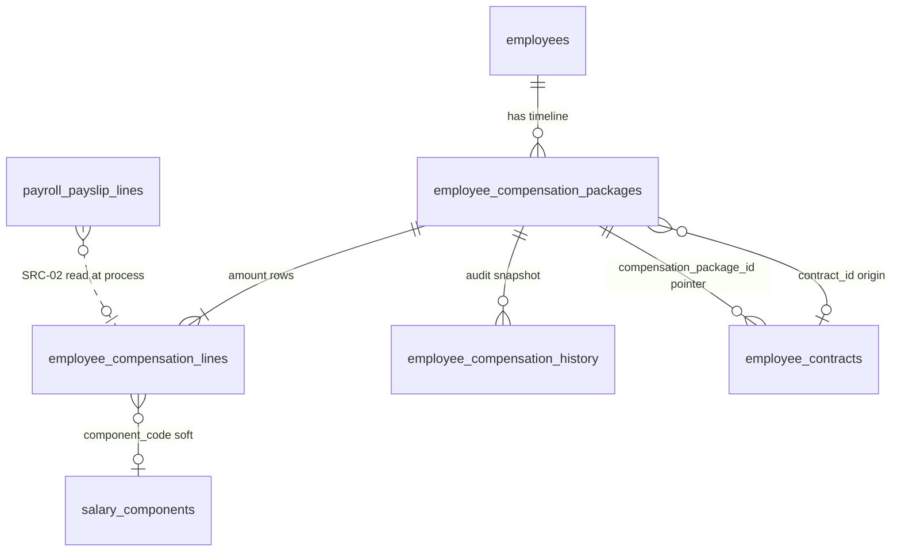

# Evidence — PO-HRM-AMIS-PARITY-EMP-SALARY-HISTORY-DATA-01

| Field | Value |
|-------|--------|
| **work_item_id** | `PO-HRM-AMIS-PARITY-EMP-SALARY-HISTORY-DATA-01` |
| **parent** | `PO-HRM-AMIS-PARITY-RESEARCH-01` |
| **prior** | `po-hrm-amis-parity-ba-01.md` §2.1 step1 · §2.4 SRC-02 · `po-hrm-amis-parity-pay-depth-01.md` · `po-hrm-amis-parity-pay-data-01.md` §4 tier-1 |
| **from_role** | ba-data |
| **to_role** | pm |
| **lane** | governance |
| **date** | 2026-08-07 |
| **priority** | P1 |
| **change_mode** | ADD · CONFIRM AS-IS + EXPAND |
| **ack_status** | **PASS_TO_PM** |
| **honesty** | `payroll_e2e_ready=false` · **cấm** AMIS parity DONE · **cấm** invent LIVE SRC resolver · **cấm** `apps/**` · U65 |

---

## Mission

Physical design for **employee salary history / fixed PC effective-dated rows** supporting **BR-AMIS-PAY-SRC-02**, relating to `employee_compensation_*` + `employee_contracts` **without duplicating SoT**. Unlock **BE SRC-02** per-component resolution on PROCESS (not only formula var bag).

---

## 0. read_first (ack)

| # | Artifact | Used |
|---|----------|------|
| 1 | `po-hrm-amis-parity-ba-01.md` §2.1 step1 · §2.4 | AMIS lịch sử lương = SRC tier 1 · BR-AMIS-PAY-SRC-02 |
| 2 | `po-hrm-amis-parity-pay-depth-01.md` §3 · §4.2 AC-PAY-SRC-01/02 | Precedence · effective date · skip template/catalog when history present |
| 3 | `po-hrm-amis-parity-pay-data-01.md` §4 tier-1 | Storage map `employee_compensation_lines` PARTIAL_LIVE |
| 4 | `po-hrm-payroll-formula-run-gap-data-01.md` §3 | C&B var ownership · effective_from dating |
| 5 | `po-hrm-payroll-formula-run-gap-be-cb-bag-01.md` | AS-IS var bag (`base_salary`, `allowance_*`) · contract fallback |
| 6 | Nest READ-ONLY `employee-compensation.service.ts` | Live DDL packages/lines/history · revise versioning |
| 7 | `DB_DESIGN_HRM_ENTERPRISE.md` §3.2 · §3.4 | Logical `hrm_employee_compensation` · contract `compensation_package_id` |

**Explicit:** This seat **does not** invent `pay_sheet_template` DDL (see PAY-DATA-01). Formula F.1 **cite only** — no reopen.

---

## 1. Verdict — CONFIRMED AS-IS SoT + EXPAND for SRC-02

| Topic | Stamp |
|-------|--------|
| Salary history SoT | **`employee_compensation_packages` + `employee_compensation_lines`** — effective-dated version chain |
| Audit timeline | **`employee_compensation_history`** — append-only snapshots; **≠** PAY read SoT |
| Contract link | **`employee_contracts.compensation_package_id`** — soft pointer / fallback only; **≠** amount SoT |
| Package origin | **`employee_compensation_packages.contract_id`** — optional provenance; **≠** duplicate contract salary |
| Print snapshot | **`hrm_contract_print_versions.compensation_snapshot_json`** — historical print only; **FORBIDDEN** PAY process input |
| Logical alias | `hrm_employee_compensation` (enterprise blueprint) ≡ **versioned package rows**, not a fourth table |
| New parallel table | **`employee_salary_history`** — **REJECT** (duplicates package SoT) |
| SRC-02 gap | Missing **`component_code`** bind line → `salary_components.code`; PROCESS uses var bag not per-line SRC tier |

**Unlock:** PM → **`PO-HRM-AMIS-PARITY-EMP-SALARY-HISTORY-BE-SRC-02-01`** (dev-be) after this DATA CONFIRMED.

---

## 2. Data domain map

### 2.1 Entities & relationships



| Entity | Role | PAY consumer |
|--------|------|--------------|
| `employee_compensation_packages` | Effective-dated C&B **header** (version, currency, change_reason) | Resolve **one** package per `(employee_id, as_of_date)` |
| `employee_compensation_lines` | Fixed PC rows: base / probation / allowance + amount | SRC-02 amount per **`component_code`** |
| `employee_compensation_history` | Immutable JSON snapshot on create/revise | UI / compliance only |
| `employee_contracts.compensation_package_id` | Latest linked package for contract context | **Fallback** when no effective package (already in var bag) |
| `salary_components` | Open catalog `code` | Target of `component_code`; **not** amount SoT |

### 2.2 Lifecycle — compensation package

| State | Meaning | Transitions |
|-------|---------|-------------|
| **open segment** | `effective_to IS NULL` | create → revise closes prior |
| **closed segment** | `effective_to` set (inclusive end date) | revise sets prior `effective_to = new.effective_from - 1 day` |
| **superseded** | New row with `supersedes_package_id` | append-only lines on new package id |

**Invalid transitions (app SM — deterministic errors):**

| From | Action | Result |
|------|--------|--------|
| Paid period locked | UPDATE lines on package overlapping paid period | **409** `HRM-COMP-409-LOCKED` (when policy wired) |
| Revise | Destructive UPDATE amounts on same `package_id` | **FORBIDDEN** — must close + insert new package (AS-IS `revisePackage`) |
| Overlap | Two packages same employee same date both active | **409** `HRM-COMP-409-OVERLAP` (enforce on create/revise) |

---

## 3. AS-IS physical (READ-ONLY Nest) — CONFIRMED

### 3.1 `employee_compensation_packages` — **LIVE**

| Column | Type | Null | Role |
|--------|------|------|------|
| `id` | uuid PK | NO | |
| `company_id` | text | NO | Plane B slug — scope parity with payroll |
| `employee_id` | uuid | NO | Soft FK employees |
| `contract_id` | uuid | YES | Optional origin contract — **not** amount duplicate |
| `version` | int | NO | Monotonic per supersede chain |
| `supersedes_package_id` | uuid | YES | Prior package |
| `effective_from` | date | NO | SRC-02 as-of lower bound |
| `effective_to` | date | YES | NULL = open-ended |
| `currency` | text | NO | Default VND |
| `change_reason` | text | YES | Audit label |
| `created_at` / `updated_at` | timestamptz | NO | |

| Index (LIVE) | `(company_id, employee_id, effective_from DESC)` |
| UQ | **none** on date overlap — **GAP** G-EMP-SH-03 |

### 3.2 `employee_compensation_lines` — **LIVE** · **EXPAND**

| Column | Type | Null | Role |
|--------|------|------|------|
| `id` | uuid PK | NO | |
| `package_id` | uuid | NO | Parent package |
| `line_type` | text | NO | `base` \| `probation` \| `allowance` |
| `amount` | numeric(18,2) | NO | Fixed PC amount (VND plain) |
| `currency` | text | NO | |
| `allowance_code` | text | YES | Required when `line_type=allowance` (XBOS DM §33) |
| `taxable` | boolean | NO | |
| `note` | text | YES | |
| `sort_order` | int | NO | |
| `created_at` | timestamptz | NO | |
| **`component_code`** | **text** | **YES** | **ADD** — soft bind `salary_components.code` same company |

**EXPAND rationale:** BR-AMIS-PAY-SRC-02 resolves by **`component_code`** on payslip line, not only formula vars (`base_salary`, `allowance_*`). Without explicit column, mapping is ambiguous when catalog code ≠ allowance_code.

| Index (ADD) | `(package_id, component_code)` partial WHERE `component_code IS NOT NULL` |
| UQ (ADD) | `(package_id, component_code)` active — **one fixed PC row per component per package** |

### 3.3 `employee_compensation_history` — **LIVE** (audit)

| Column | Role |
|--------|------|
| `package_id` / `previous_package_id` / `version` | Chain |
| `snapshot` jsonb | Lines + effective dates at mutation time |

**Rule:** PROCESS **must not** read history for amounts — packages/lines only.

### 3.4 `employee_contracts.compensation_package_id` — **LIVE** (pointer)

| Rule | Detail |
|------|--------|
| Write | Set when `link_to_contract=true` on package create/revise |
| PAY read order | (1) effective package by date+scope (2) employee fallback (3) **contract pointer** — cite var bag |
| **FORBIDDEN** | Treat contract pointer as override when effective package exists for as-of date |
| **FORBIDDEN** | Duplicate line amounts on contract registry columns (BR-CD-F5) |

---

## 4. Component_code mapping (SRC-02 resolver contract)

**Process date:** `as_of_date` = payroll period pay date or service-defined cutoff (same as var bag).

### 4.1 Resolve effective package (reuse var bag order)

```text
1. expandCbReadCompanyIds(period.company_id, employee.company_id)
2. SELECT package WHERE employee_id AND company_id ANY(scope)
     AND effective_from <= as_of_date
     AND (effective_to IS NULL OR effective_to >= as_of_date)
   ORDER BY effective_from DESC, version DESC LIMIT 1
3. If absent → employee-anchored fallback (warning)
4. If absent → employee_contracts.compensation_package_id (warning)
5. If absent → no SRC-02 amount (fall through to SRC-03..05)
```

### 4.2 Map line → component_code

| Priority | Condition | `component_code` used |
|----------|-----------|------------------------|
| 1 | Line has **`component_code`** NOT NULL | Use as-is (normalize `lower(trim(code))`) |
| 2 | `line_type=allowance` + `allowance_code` | **`allowance_code`** normalized → must match catalog code or alias map |
| 3 | `line_type=base` | Company **`salary_components`** where `component_type`/`nature` = base default — prefer code **`BASE`** if exists else first active base component |
| 4 | `line_type=probation` | Code **`PROBATION`** if catalog row exists; else treat as **`base`** mapping for SRC-02 only when probation policy active |

**Alias table (app config — open string, no CHK IN N):**

| `allowance_code` (legacy) | `component_code` (catalog) |
|---------------------------|----------------------------|
| `PHU_CAP_AN` | same or mapped via settings extension |
| `PHU_CAP_XANG` | same or mapped |

**FORBIDDEN:** Silent remap that hides mismatch — unresolved code → warning `CB_COMPONENT_UNMAPPED` + fall through (do not invent 0).

### 4.3 SRC-02 per-component resolution (BE contract)

For each payslip/template **`component_code`** at PROCESS:

```text
amount_fixed = lookup(employee_id, as_of_date, component_code)
IF amount_fixed IS NOT NULL:
  line.amount = amount_fixed
  line.source_tier = 'emp_cb'
  line.source_ref = 'emp_cb:package:{package_id}:line:{line_id}'
  SKIP template override evaluate AND catalog default for this component
ELSE:
  continue SRC-03 → SRC-04 → SRC-05
```

**Orthogonal:** ATT hour vars still **SRC-01** only — C&B fixed PC does not replace closed-sheet hours.

---

## 5. Data interaction matrix

| Operation | packages | lines | history | contract pointer | PAY |
|-----------|----------|-------|---------|------------------|-----|
| **Create** package | INSERT | INSERT lines | INSERT snapshot | optional UPDATE contract | — |
| **Revise** | close prior + INSERT new | INSERT on new id | INSERT snapshot | optional UPDATE | — |
| **List timeline** | SELECT by employee | JOIN lines | optional READ | READ pointer | — |
| **PROCESS evaluate** | READ effective | READ by component_code | **no** | fallback only | WRITE payslip line amount + source_tier |
| **Print HĐ** | READ for merge token | READ | — | READ | **no** — print uses snapshot |

---

## 6. Validation matrix

| ID | Condition | Expected | HTTP / code |
|----|-----------|----------|-------------|
| VAL-EMP-SH-01 | Create package without `base` line | Reject | 400 `HRM-COMP-001` |
| VAL-EMP-SH-02 | Allowance line without `allowance_code` | Reject | 400 `HRM-COMP-003` |
| VAL-EMP-SH-03 | `effective_from > effective_to` | Reject | 400 `HRM-COMP-001` |
| VAL-EMP-SH-04 | `component_code` set but no `salary_components` row in company scope | Reject on write | 404/422 `HRM-COMP-004` |
| VAL-EMP-SH-05 | Duplicate `(package_id, component_code)` | Reject | 409 `HRM-COMP-005` |
| VAL-EMP-SH-06 | Two overlapping open packages same employee | Reject on create/revise | 409 `HRM-COMP-409-OVERLAP` |
| VAL-PAY-SRC-02A | Effective package line for `component_code` on as-of date | PROCESS line amount = line.amount; `source_tier=emp_cb` | 2xx |
| VAL-PAY-SRC-02B | History present for component | Template override **not** applied for that component | amount ≠ override evaluate |
| VAL-PAY-SRC-02C | No package / no line for component | Fall through SRC-03..05 — **not** silent 0 | template/catalog or 412 |
| VAL-PAY-SRC-02D | Contract pointer only (no effective package) | Fallback per var bag; warning `CB_PACKAGE_FROM_CONTRACT_LINK` | 2xx with warning |
| VAL-SCOPE-01 | List packages under `main` rollup | get-by-id same id **200** | scope_parity U19 |

---

## 7. Error catalog (deterministic)

| Code | When | Consumer message (VI) |
|------|------|------------------------|
| `HRM-COMP-001` | Validation / date / contract employee mismatch | Thông báo lỗi hiện có |
| `HRM-COMP-003` | Allowance without code | |
| `HRM-COMP-004` | Unknown `component_code` | Mã thành phần lương không tồn tại trong danh mục |
| `HRM-COMP-005` | Duplicate component on package | Trùng thành phần trong cùng gói lương |
| `HRM-COMP-409-OVERLAP` | Overlapping effective segments | Khoảng hiệu lực gói lương bị chồng |
| `HRM-COMP-404` | Package/employee out of scope | |
| `CB_COMPONENT_UNMAPPED` | Line exists but no component_code resolve | Warning — fall through SRC |
| `CB_PACKAGE_ABSENT` | No package at all | Warning / 412 at PROCESS (existing) |

Payslip line fields (PAPER — cite formula DATA-01):

| Field | Value when SRC-02 wins |
|-------|------------------------|
| `source_tier` | `emp_cb` |
| `source_ref` | `emp_cb:package:{uuid}:line:{uuid}` |
| `formula_definition_id` | NULL (skipped evaluate) |

---

## 8. Traceability

| Requirement | BR/AC | Physical | API (existing / EXPAND) | FE / Test |
|-------------|-------|----------|-------------------------|-----------|
| AMIS Step1 lịch sử lương | BA §2.1 | `employee_compensation_*` | `…/compensation-packages` LIVE | AC-PAY-SRC-01 U65 |
| SRC-02 history wins | BR-AMIS-PAY-SRC-02 | lines + **`component_code` ADD** | PROCESS resolver EXPAND | VAL-PAY-SRC-02A/B |
| Effective dating | PAY depth §3 | `effective_from/to` | revisePackage AS-IS | F5 timeline |
| Contract F5 link | BR-CD-F5 · INT-02 | `compensation_package_id` | create link_to_contract | UF-HRM-02 |
| No duplicate SoT | DATA_OWNERSHIP | reject parallel table / contract body salary | — | grep no dual-write |
| Catalog bind | AC-PAY-COMP-01 | `salary_components.code` | catalog list | picker |
| Var bag (orthogonal) | Q-PAY-F-3 | same tables | `loadCoreCbVariableBag` LIVE | CB-BAG jest |

**J-* / UF:** J-HRM-07 process path · employee C&B profile → PAY line — extend QA matrix after BE SRC-02; **do not** flip `payroll_e2e_ready`.

---

## 9. Gaps blocking BE SRC-02 integration

| ID | Gap | Blocks | Owner |
|----|-----|--------|-------|
| **G-EMP-SH-01** | No `component_code` column on lines | Per-component SRC-02 | **dev-be** ensureSchema ADD |
| **G-EMP-SH-02** | PROCESS uses formula vars not per-`component_code` fixed amount | AC-PAY-SRC-01 | **dev-be** SRC resolver |
| **G-EMP-SH-03** | No DB/app overlap guard | Data integrity | **dev-be** on create/revise |
| **G-EMP-SH-04** | DTO/API omit `component_code` on create line | FE picker bind | **dev-be** DTO EXPAND |
| **G-EMP-SH-05** | FE salary timeline UI shallow | U65 AC | **dev-fe** later |
| **G-PAY-LINE-01** | `payroll_payslip_lines.source_tier` PAPER | Audit on line | formula DATA-01 — staged OK |

**Minimum unlock BE SRC-02:** §3.2 EXPAND + §4.3 resolver contract + VAL-PAY-SRC-02A/B jest.

---

## 10. EXPAND DDL plan (PAPER — no migrate this seat)

```sql
-- ADD only — Nest ensureSchema after PM dispatch dev-be
ALTER TABLE public.employee_compensation_lines
  ADD COLUMN IF NOT EXISTS component_code TEXT NULL;

CREATE INDEX IF NOT EXISTS idx_comp_lines_pkg_component
  ON public.employee_compensation_lines (package_id, lower(component_code))
  WHERE component_code IS NOT NULL;

-- App-level UQ (package_id, lower(component_code)) enforced in service until partial UQ migration
```

**Backfill rule (one-time, BE):**

| line_type | Backfill `component_code` |
|-----------|---------------------------|
| `allowance` | `lower(trim(allowance_code))` |
| `base` | `'base'` or company default base catalog code |
| `probation` | `'probation'` if catalog exists else NULL + warning |

---

## 11. Non-claims / FORBIDDEN

| Claim / action | Status |
|----------------|--------|
| Invent `employee_salary_history` table | **FORBIDDEN** |
| Copy C&B onto `employees` / contract body | **FORBIDDEN** |
| PAY reads print `compensation_snapshot_json` | **FORBIDDEN** |
| Duplicate amounts on contract + package | **FORBIDDEN** |
| Edit `apps/**` this seat | **FORBIDDEN** |
| `payroll_e2e_ready=true` / parity DONE | **FORBIDDEN** |
| Seed to fake salary history for QA | **FORBIDDEN** (U65) |

---

## completion_report

### Closed

1. **CONFIRMED** salary history SoT = `employee_compensation_packages` + `_lines` effective-dated chain; `_history` = audit only.  
2. **Contract relationship** — `compensation_package_id` pointer + `contract_id` provenance; no duplicate SoT.  
3. **EXPAND** `employee_compensation_lines.component_code` + mapping rules §4.2 for SRC-02.  
4. **BE resolver contract** §4.3 — per-component fixed PC short-circuit before template/catalog.  
5. Validation VAL-EMP-SH-* + VAL-PAY-SRC-02* · error catalog · traceability to BR-AMIS-PAY-SRC-02 / AC-PAY-SRC-01.  
6. Gaps G-EMP-SH-01..05 · PAPER DDL §10 · honesty locks.

### Residual

| ID | Owner |
|----|-------|
| BE ensureSchema + SRC-02 resolver + DTO | **dev-be** |
| FE C&B timeline + component picker on lines | **dev-fe** |
| QA AC-PAY-SRC-01 U65 | **qa** after BE |
| Client DOC-DELTA §3.2 alias stamp | **ba-docs** optional |

### Explicit non-claims

- Not LIVE SRC-02 on PROCESS until BE lands.  
- Not AMIS parity DONE.  
- Not module UAT / `payroll_e2e_ready=true`.

---

## next_owner

**pm** → dispatch **dev-be** (`PO-HRM-AMIS-PARITY-EMP-SALARY-HISTORY-BE-SRC-02-01`)

## next_dispatch_prompt

```text
work_item_id: PO-HRM-AMIS-PARITY-EMP-SALARY-HISTORY-BE-SRC-02-01
from_role: pm
to_role: dev-be
lane: execution
priority: P1
parent: PO-HRM-AMIS-PARITY-RESEARCH-01
entry_criteria: PO-HRM-AMIS-PARITY-EMP-SALARY-HISTORY-DATA-01 PASS · docs/qa/evidence/po-hrm-amis-parity-emp-salary-history-data-01.md cited

## Mission
Implement BR-AMIS-PAY-SRC-02 per-component fixed PC resolution on payroll PROCESS.
1. ensureSchema ADD employee_compensation_lines.component_code (+ index)
2. DTO create/revise line accepts optional component_code; validate against salary_components in scope
3. Backfill mapping §10 on migrate bootstrap
4. EXPAND PROCESS resolver: for each payslip line component_code, if effective package line exists → amount + source_tier=emp_cb + source_ref; SKIP template/catalog for that component
5. Reuse expandCbReadCompanyIds / package resolve order from pay-formula-variable-bag.ts
6. Jest: VAL-PAY-SRC-02A/B · overlap 409 · unmapped warning fall-through

read_first:
- docs/qa/evidence/po-hrm-amis-parity-emp-salary-history-data-01.md §4–§7
- docs/qa/evidence/po-hrm-amis-parity-pay-depth-01.md §3 BR-SRC-02
- apps/api/hrm-api/src/payroll/pay-formula-variable-bag.ts
- apps/api/hrm-api/src/contracts-insurance/employee-compensation.service.ts

must_keep: contract pointer fallback only · no print snapshot · no overwrite paid segments · ATT-412 / FORMULA-412 honesty
forbidden: invent parallel salary_history table · seed · payroll_e2e_ready flip · duplicate contract body salary

## Exit
READY_FOR_QA · jest green · evidence docs/qa/evidence/po-hrm-amis-parity-emp-salary-history-be-src-02-01.md
ack_status: READY_FOR_QA
```

---

## evidence_path

`docs/qa/evidence/po-hrm-amis-parity-emp-salary-history-data-01.md`

## ack_status

**PASS_TO_PM**
