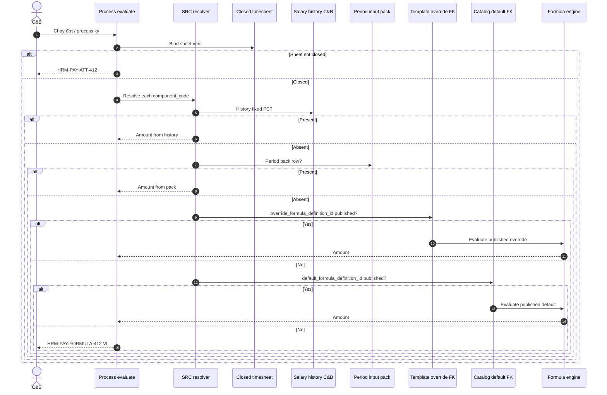

# Evidence — PO-HRM-AMIS-PARITY-PAY-DEPTH-01

| Field | Value |
|-------|--------|
| **work_item_id** | `PO-HRM-AMIS-PARITY-PAY-DEPTH-01` |
| **parent** | `PO-HRM-AMIS-PARITY-RESEARCH-01` |
| **from_role** | ba-process |
| **to_role** | pm |
| **lane** | governance |
| **priority** | P0 |
| **date** | 2026-08-07 |
| **change_mode** | ADD · docs-only |
| **ack_status** | **PASS_TO_PM** |
| **honesty** | `payroll_e2e_ready=false` · **cấm** AMIS parity DONE · **cấm** invent LIVE · **cấm** `apps/**` · U65 zero-seed |
| **co_read** | `po-hrm-amis-parity-sa-01.md` · `po-hrm-amis-parity-ba-01.md` §2 · `PO_HRM_AMIS_PARITY_RESEARCH_01.md` §3 |

---

## 0. Read ack (ordered)

| # | Artifact | Used |
|---|----------|------|
| 1 | `po-hrm-amis-parity-sa-01.md` | Storage **Option B** lock · layer map · SRC architecture · wave order |
| 2 | `po-hrm-amis-parity-ba-01.md` §2 | PAY depth 1–7 · draft BR-AMIS-PAY-SRC · AC pointers |
| 3 | `PO_HRM_AMIS_PARITY_RESEARCH_01.md` §3 | Spine 1–7 · precedence lịch sử > dữ liệu kỳ > mẫu > danh mục |
| 4 | `po-hrm-payroll-formula-run-gap-api-01.md` | **F.1 CONFIRMED** — AUTHOR/PUBLISH/LIST/PREVIEW · PROCESS EXPAND · **cite only · do not reopen** |
| 5 | `SRS_HRM_ENTERPRISE.md` FR-UC-BP-PAY-02 · FR-UC-BP-PAY-06 | Trace Diễn biến / AC-PAY-HIRE / dual SoT |
| 6 | Public AMIS precedence (help principles) | Same order as program §3 — no UI/brand clone |

**Explicit:** Formula API-01 F.1 remains **CONFIRMED**. This seat deepens **template + SRC** BR/AC for GĐ1 — does **not** invent template HTTP, DnD, AVA, Face, or LIVE product.

---

## 1. Process objective & actors

| | |
|--|--|
| **Objective** | Lock testable SoT for AMIS Tiền lương **precedence + mẫu bảng lương override** so PROCESS evaluate resolves component amounts deterministically (history → period pack → template override FK → catalog default) without Nest % fallback or silent 0₫. |
| **Actors** | C&B (author template / period) · Technical Publisher (formula publish) · System (SRC resolver on process) · QA (U65 browser) |
| **In scope GĐ1** | BR-AMIS-PAY-SRC-01..05 · AC-PAY-TPL · AC-PAY-SRC · storage Option B · ATT closed-sheet vars · cite formula F.1 |
| **Out of scope** | GĐ1 formula DnD · AI AVA · Face/GPS marketing as ATT UAT · full tax/BHXH app clone · claiming parity / payroll UAT |

### 1.1 As-is vs to-be (PAY SRC + template)

| Axis | As-is | To-be (GĐ1 DOC lock) |
|------|-------|----------------------|
| Formula SoT | `salary_components.formula` TEXT ≠ engine; F.1 paper CONFIRMED | Executable expressions **only** in `pay_formula_definitions` (published) |
| Template | Period UI / enroll `salary_templates` ≠ AMIS mẫu | ADD `pay_sheet_template` + columns; period snapshots template |
| Override | Absent / chrome only | Nullable `override_formula_definition_id` → **published** definition (**Option B**) |
| Precedence | Not implemented | BR-AMIS-PAY-SRC-01..05 short-circuit then evaluate |
| Process | 0₫ stub / no lines | Evaluate + lines · FORMULA-412 when missing (AC-PAY-RUN-06/07/09) |

---

## 2. Storage lock — SA Option B (immutable this seat)

**Cite:** `po-hrm-amis-parity-sa-01.md` §4 — **Selected Option B**.

| Rule | Lock |
|------|------|
| SoT expressions | **Only** `pay_formula_definition` / Nest `pay_formula_definitions` |
| Catalog default | `salary_components.default_formula_definition_id` (or company formula set by code) → **active/published** |
| Template override | `pay_sheet_template_column.override_formula_definition_id` **nullable FK** → **published** version |
| Draft on process | Draft / pending_publish **ignored**; missing published → **HRM-PAY-FORMULA-412** (VI) |
| Author UX GĐ1 | Form creates definition version (scoped code e.g. `TPL:{template_code}:{component_code}`) → dual-control publish → template row stores **FK only** |
| Period create | Snapshot template_id + column FKs; immutable after process start |

### 2.1 Explicit reject (SoT / GĐ1)

| Reject ID | Forbidden | Why |
|-----------|-----------|-----|
| **RJ-PAY-INLINE-01** | Inline `expression_override_json` / free-text formula on template as **runtime SoT** | Bypasses dual-control Option A; two SoTs; audit/rollback weak — SA Option **A storage rejected** |
| **RJ-PAY-TEXT-01** | `salary_components.formula` TEXT as engine SoT | DATA G-PAY-F-07 · API-01 deprecate |
| **RJ-PAY-DND-01** | **GĐ1 DnD** formula designer as requirement / AC | **R-PAY-DD-01** = Form GĐ1 · DnD = **GĐ2 only** |
| **RJ-PAY-AVA-01** | AI AVA author/check formula as GĐ1 | Program §1 · BA/SA non-goals |
| **RJ-PAY-FACE-01** | FaceID / GPS / máy chấm **marketing** as ATT/PAY UAT close | Help marketing ≠ closed-sheet spine |
| **RJ-PAY-ENROLL-01** | Overload enroll `salary_templates` as AMIS mẫu | Separate `pay_sheet_template` ADD |
| **RJ-PAY-NEST-01** | Nest hardcoded % / tenant coeffs as fallback when SRC empty | BR-AMIS-PAY-SRC-05 · AC-PAY-FORMULA-08 |
| **RJ-PAY-CLAIM-01** | Claim parity DONE / `payroll_e2e_ready=true` / invent LIVE from this DOC | Honesty |

**Column reorder** on template (sort_order) = GĐ1 OK when structure LIVE; **formula DnD canvas** remains GĐ2.

---

## 3. BR-AMIS-PAY-SRC-01..05 (condition → action → outcome)

**Public AMIS / program §3 precedence (locked):**

```text
1. Lịch sử lương / C&B cố định (employee)
2. Dữ liệu kỳ (closed timesheet vars · thu nhập khác · tạm ứng packs)
3. Mẫu bảng lương — override formula (published FK)
4. Danh mục thành phần — default formula (published FK)
ELSE → explicit VI / HRM-PAY-FORMULA-412 — cấm silent 0 without reason
```

Hour/OT/leave **vars** always from closed timesheet only (orthogonal to amount precedence).

| BR id | Condition | Action | Outcome (measurable) | Fail if |
|-------|-----------|--------|----------------------|---------|
| **BR-AMIS-PAY-SRC-01** | Process/evaluate needs hour, OT, leave, or ATT-derived vars for component/line | Resolver reads **only** closed timesheet snapshot for that company+period overlap (Q-PAY-F-3 · ATT-412) | Vars bag populated from closed sheet; open/draft/pending sheet **not** used | Live Leave/OT HTTP; open sheet; silent empty vars without ATT-412 / VI |
| **BR-AMIS-PAY-SRC-02** | Employee has effective salary-history / C&B **fixed** amount for `component_code` on process date | Prefer that amount; **skip** template override evaluate and catalog default for that component | Payslip line amount = history/C&B amount (±policy rounding); Network/process 2xx; F5 line stable | Catalog/template overwrites fixed PC silently; line ignores history when present |
| **BR-AMIS-PAY-SRC-03** | Period input pack row exists for period-variable component (other-income / advance / ADJ typed) | Prefer pack amount/value; short-circuit before template/catalog evaluate | Line reflects pack; empty pack → fall through to 3→4 | Pack ignored → 0 without reason; pack present but catalog wins |
| **BR-AMIS-PAY-SRC-04** | Template column has `override_formula_definition_id` pointing to **published/active** definition; priorities 1–2 empty for that component | Evaluate **that** definition version (snapshot id); **do not** use catalog default | Preview/process amount matches override evaluate; draft FK ignored → treat as no override | Always catalog-only; inline expression SoT; draft used as runtime |
| **BR-AMIS-PAY-SRC-05** | Priorities 1–4 empty / no published default | Deny process or empty line with **explicit** VI (`HRM-PAY-FORMULA-412` or equivalent); **no** Nest hardcoded % fallback | User sees measurable reason; CI/golden path free of tenant % constants | Silent 0₫ as PASS; Nest const 150%/200% OT as substitute |

### 3.1 Decision flow (resolver)



### 3.2 Sponsor Q1 note (packs priority)

| Pack | GĐ1 BA stance | AC in this DOC |
|------|---------------|----------------|
| Closed timesheet | **P0** mandatory | SRC-01 + reuse AC-PAY-RUN-02/03 |
| Salary history / fixed PC | **P0** for SRC fidelity | AC-PAY-SRC-01..02 |
| Thu nhập khác / tạm ứng | **P0 if** demo policy needs; else **P1** (BA Q1 open to PM/sponsor) | AC-PAY-SRC-03 marked **P0-or-P1** — do not block formula+template+history spine |
| ESS / payment (AMIS 6–7) | P2 | Out of this depth seat |

---

## 4. AC packs GĐ1 (U65 · zero-seed · browser FE)

**Entry:** L0 stack up · login C&B persona · **cấm** `pnpm seed:*` / API fake payslip · FE path only.  
**Reuse (authoritative engine):** AC-PAY-FORMULA-01..08 · AC-PAY-RUN-01..09 from `po-hrm-payroll-formula-run-gap-ba-01.md` — **not replaced**.  
**Formula F.1:** cite `po-hrm-payroll-formula-run-gap-api-01.md` — CONFIRMED.

### 4.1 AC-PAY-TPL (mẫu bảng lương)

| AC id | Pass (measurable) | Fail | Pri | Maps |
|-------|-------------------|------|-----|------|
| **AC-PAY-TPL-01** | Settings/Lương: tạo `pay_sheet_template` gắn ≥3 `salary_components` catalog codes → POST/PUT **2xx** → toast/list cập nhật → **F5** mẫu còn; codes from picker (AC-PAY-COMP-01) | Free-text SoT codes; mất sau F5; 4xx/5xx silent | P0 | FR-UC-BP-PAY-02 dual SoT · AMIS Step3 |
| **AC-PAY-TPL-02** | Trên cột mẫu: gắn override = chọn **published** formula definition → lưu 2xx → F5 cột còn `override_formula_definition_id` (display mã version VI); **không** lưu inline expression làm SoT | Inline expression persisted as runtime SoT; draft-only FK accepted as “active override” without VI | P0 | BR-SRC-04 · Option B |
| **AC-PAY-TPL-03** | Tạo kỳ lương **chọn mẫu** active đúng OU/pháp nhân → period stores `template_id` snapshot → F5 kỳ còn mẫu | Kỳ không bind mẫu; hardcode cột Nest; dùng enroll `salary_templates` làm mẫu AMIS | P0 | FR-UC-BP-PAY-06 #1–2 · AMIS Step5 |
| **AC-PAY-TPL-04** | Preview evaluate (BE) trên mẫu: component có override published → số/dòng khớp override **khác** catalog default cùng component (khi 1–2 empty) | Preview FE tự tính net; luôn bằng catalog; không gọi evaluate BE | P0 | AC-PAY-FORMULA-04 · BR-SRC-04 |
| **AC-PAY-TPL-05** | Sau process start / kỳ processed: đổi mẫu hoặc override FK **không** đổi dòng kỳ đã chạy (immutability / new period only) | Hot-swap mid-period changes amounts | P0 | AC-PAY-FORMULA-06 · AC-PAY-RUN-08 |
| **AC-PAY-TPL-06** | Column `sort_order` / label VI đổi trên form GĐ1 → 2xx + F5; **không** yêu cầu DnD formula canvas | QA FAIL vì thiếu DnD formula GĐ1 | P1 UI | RJ-PAY-DND-01 |

### 4.2 AC-PAY-SRC (precedence)

| AC id | Pass (measurable) | Fail | Pri | Maps |
|-------|-------------------|------|-----|------|
| **AC-PAY-SRC-01** | NV có PC cố định trên lịch sử C&B hiệu lực → process → payslip line amount = history; không nhập lại trên kỳ | History ignored; catalog/template wins silently | P0 | BR-SRC-02 · FR-UC-BP-PAY-06 #5 |
| **AC-PAY-SRC-02** | Cùng NV **không** có history cho component → có override published trên mẫu → line = override evaluate | Falls to catalog while override FK set; or 0 silent | P0 | BR-SRC-04 |
| **AC-PAY-SRC-03** | Kỳ có pack thu nhập khác / tạm ứng (khi pack LIVE) cho component period-variable → line = pack; F5 còn | Pack ignored; 0 without VI | P0-or-P1 (Q1) | BR-SRC-03 |
| **AC-PAY-SRC-04** | Process khi sheet **chưa** chốt → **412** ATT / eligibility VI; không dùng open sheet vars | Process 2xx với vars open sheet | P0 | BR-SRC-01 · AC-PAY-RUN-02 |
| **AC-PAY-SRC-05** | Không history, không pack, không override, không default published → process deny hoặc empty **có lý do** FORMULA-412 VI (không toàn 0 im lặng) | Silent 0₫; Nest % fallback | P0 | BR-SRC-05 · AC-PAY-RUN-09 |
| **AC-PAY-SRC-06** | Happy path: closed sheet + published default (or override) + enroll → process **2xx** → **≥1** payslip line · amounts match BE evaluate · F5 còn · Network process 2xx | Status-only flip; all 0; no lines | P0 | AC-PAY-RUN-06/07 · FR-UC-BP-PAY-06 #5–6 |

### 4.3 Evidence block template (QA — mỗi UF)

```markdown
### AC-PAY-TPL-0x / AC-PAY-SRC-0x
- Persona / URL / click path: …
- Trước mutate: …
- Action: … → Lưu / Process
- Network: … → 2xx / 412 expected
- FE sau 2xx + F5: …
- Verdict: 🟢 / 🟡 / 🔴
- spec_ref: BR-AMIS-PAY-SRC-0x · FR-UC-BP-PAY-02/06 · this evidence
- seed: none (U65)
```

---

## 5. Trace — FR-UC-BP-PAY-02 / FR-UC-BP-PAY-06

| Depth artifact | Enterprise SRS | Formula API-01 (cite) | Notes |
|----------------|----------------|----------------------|-------|
| BR-SRC-01 (closed sheet vars) | PAY-02 Q-PAY-F-3 · PAY-06 tiên quyết bảng công chốt · Diễn biến #3/#5 | F-PAY-PROCESS-01 EXPAND · ATT-412 | Do not reopen F.1 |
| BR-SRC-02 (history wins) | PAY-02 biến CORE C&B · PAY-06 #5 nạp C&B | PROCESS evaluate bag | EMP salary-history depth may still GAP product |
| BR-SRC-03 (period pack) | PAY-06 #5 KT/KL / dữ liệu kỳ (expand later) | Precedence pointer API §2 | Pack HTTP = residual DATA |
| BR-SRC-04 (template override FK) | PAY-02 form mẫu đơn vị · dual SoT · PAY-06 công thức đã phát hành | AMIS precedence residual **R-PAY-AMIS-TPL** — **out of formula API seat** | Option B only |
| BR-SRC-05 (no Nest fallback) | BR-BP-PAY-01 · AC-PAY-FORMULA-08 | FORMULA-412 | |
| AC-PAY-TPL-01..05 | PAY-02 Diễn biến soạn/phát hành + mẫu · PAY-06 #1–2 kỳ từ cấu trúc | — | Template F.1 **after** DATA |
| AC-PAY-SRC-06 / RUN-06/07 | PAY-06 #5–6 · AC-PAY-HIRE-04/05 must_keep | F-PAY-PROCESS-01 | Enroll seals ≠ module UAT |
| RJ-PAY-DND-01 | R-PAY-DD-01 Form GĐ1 | API honesty no GĐ1 DnD | |
| Dual-control publish | PAY-02 Diễn biến #2 | F-PAY-FORMULA-PUBLISH-01 CONFIRMED | Cite only |

**ADD-only DOC-DELTA (later ba-docs):** may append BR-AMIS-PAY-SRC-* + AC-PAY-TPL/SRC under PAY-02/06 — **no wipe** existing AC-PAY-HIRE / AC-PAY-COMP / FORMULA packs.

---

## 6. Wave unlock (honesty)

```text
Formula DATA-01 ………… PASS (ADD-plan)
Formula API-01 ………… CONFIRMED (cite — do not reopen)
AMIS BA-01 / SA-01 …… PASS (folded)
PAY-DEPTH-01 ………… this evidence PASS_TO_PM
        │
        ▼
PAY-TPL-DATA-01 ……… ba-data physical pay_sheet_template + override FK Option B
        │
        ▼ only after DATA CONFIRMED
F-PAY-SHEET-TPL-01 … sa API F.1 (template CRUD + bind period) — not before
        │
        ▼ DATA+API ready
BE template / PROCESS SRC … integrate override FK into evaluate (may follow formula BE)
FE GĐ1 form ………… no DnD formula · U65 QA
```

| Parallel OK | Serial gate |
|-------------|-------------|
| Formula BE ensureSchema+AUTHOR/PUBLISH (API-01 CONFIRMED) | Wait formula API — **already done** |
| CTR MergeToken / print-spine | must_keep BETTER |
| **Template API / template BE** | **Only after** `PO-HRM-AMIS-PARITY-PAY-TPL-DATA-01` (+ TPL API F.1) CONFIRMED |
| Claim `payroll_e2e_ready` | After AC-PAY-FORMULA-* + AC-PAY-RUN-06/07 + AC-PAY-SRC-06 U65 + QC — **not this seat** |

---

## 7. Preserve / non-goals

**must_keep:** scope ladder · ATT-412 · enroll AC-PAY-HIRE-04/05 · Q-PAY-FORMULA Option A · Platform Option B · no FE net · soft-delete · starter≠closed enum · U65 · print-spine CTR · JD-DYNAMIC.

**Non-goals:** AI AVA · Face marketing UAT · GĐ1 formula DnD · full AMIS accounting/TNCN clone · parity DONE · invent LIVE.

---

## 8. Assumptions · open

| # | Item | Owner |
|---|------|-------|
| A1 | Precedence order = public help + program §3 + SA §3.4 | Locked |
| A2 | Storage Option B locked by SA-01 — BA depth does not reopen Option A/C | Locked |
| A3 | Formula F.1 CONFIRMED — no second API workshop | Locked |
| Q1 | Other-income/advance pack P0 vs P1 for first customer UAT | pm/sponsor (AC-PAY-SRC-03 tagged) |

---

## 9. completion_report

### Closed

1. **BR-AMIS-PAY-SRC-01..05** — testable condition→action→outcome + sequenceDiagram.  
2. **AC-PAY-TPL-01..06** + **AC-PAY-SRC-01..06** GĐ1 packs (U65, no seed) · reuse FORMULA/RUN ACs.  
3. **Storage Option B locked** — override = FK to **published** `pay_formula_definition`; **reject** inline expression SoT.  
4. **Explicit reject:** GĐ1 DnD · AVA · Face marketing · enroll-template conflation · Nest % · parity/LIVE claims.  
5. **Trace** to FR-UC-BP-PAY-02 / FR-UC-BP-PAY-06 + cite formula API-01 F.1 CONFIRMED (no reopen).  
6. **Wave:** next physical DATA → then sa TPL F.1 / BE template only if DATA+API ready.  
7. Honesty: `payroll_e2e_ready=false` · no `apps/**` · no parity DONE.

### Residual

| ID | Owner |
|----|-------|
| `PO-HRM-AMIS-PARITY-PAY-TPL-DATA-01` | ba-data |
| After DATA: `F-PAY-SHEET-TPL-01` API F.1 | sa |
| Formula BE (API already CONFIRMED) | dev-be — parallel OK; **cấm** invent template HTTP in same seat |
| Sponsor Q1 packs | pm |
| FE GĐ1 + QA U65 | after BE |

### Explicit non-claims

- Not AMIS parity DONE.  
- Not `payroll_e2e_ready=true`.  
- Not template or SRC resolver LIVE.  
- Not Phase 1 DONE.

---

## 10. Handoff

- **next_owner:** `pm`
- **ack_status:** `PASS_TO_PM`
- **evidence_path:** `docs/qa/evidence/po-hrm-amis-parity-pay-depth-01.md`
- **payroll_e2e_ready:** `false`

### next_dispatch_prompt (primary — PAY template physical)

```text
work_item_id: PO-HRM-AMIS-PARITY-PAY-TPL-DATA-01
from_role: pm
to_role: ba-data
lane: governance
priority: P0
parent: PO-HRM-AMIS-PARITY-RESEARCH-01

## Mission
Physicalize ADD-plan: pay_sheet_template + pay_sheet_template_column + override_formula_definition_id FK per SA storage Option B
(cite docs/qa/evidence/po-hrm-amis-parity-sa-01.md §3.2·§4 · po-hrm-amis-parity-pay-depth-01.md §2–§3).
Alias lock: ≠ salary_templates enroll pack. Columns: component_code · sort_order · display_label_vi · override FK · OU scope.
Trace BR-AMIS-PAY-SRC-04 · AC-PAY-TPL-01..05. Cite formula DATA/API already CONFIRMED — do not redesign pay_formula_definitions.

## Exit
PASS_TO_PM · evidence docs/qa/evidence/po-hrm-amis-parity-pay-tpl-data-01.md
· next_dispatch: sa F-PAY-SHEET-TPL-01 F.1 ONLY after this DATA CONFIRMED
· cấm apps/** · payroll_e2e_ready=false · cấm GĐ1 DnD · AVA · Face · invent LIVE
```

### next_dispatch_prompt (after PAY-TPL-DATA physical CONFIRMED — sa API TPL F.1)

```text
work_item_id: PO-HRM-AMIS-PARITY-PAY-TPL-API-01
from_role: pm
to_role: sa
lane: governance
priority: P0
parent: PO-HRM-AMIS-PARITY-RESEARCH-01
entry_criteria: PO-HRM-AMIS-PARITY-PAY-TPL-DATA-01 CONFIRMED + po-hrm-amis-parity-pay-depth-01.md cited

## Mission
F.1 API for pay_sheet_template CRUD + period bind snapshot + override FK to published pay_formula_definitions only (Option B).
Map AC-PAY-TPL-01..05 · BR-AMIS-PAY-SRC-04. EXPAND F-PAY-PROCESS-01 resolver order SRC-01..05 (cite depth DOC) — do not reopen F-PAY-FORMULA-* F.1.
cấm inline expression SoT · GĐ1 DnD · AVA · Face · invent LIVE · payroll_e2e_ready flip

## Exit
PASS_TO_PM · program specs + client API_DESIGN DOC-DELTA ADD-only
· next: BE template/process SRC only if DATA+API ready
```

### next_dispatch_prompt (parallel OK — formula BE; not template)

```text
work_item_id: PO-HRM-PAYROLL-FORMULA-RUN-GAP-BE-01
from_role: pm
to_role: dev-be
lane: execution
priority: P0
parent: PO-HRM-PAYROLL-FORMULA-AND-RUN-GAP-01
entry_criteria: PO-HRM-PAYROLL-FORMULA-RUN-GAP-API-01 CONFIRMED + DATA-01 cited
spec_ref: API-01 F.1 · ADR §10 Option A · AMIS pay-depth BR-SRC-01/05 (closed sheet + FORMULA-412)
read_first: po-hrm-payroll-formula-run-gap-api-01.md · po-hrm-amis-parity-pay-depth-01.md §3 (SRC) · sa-01 §4

## Mission
ensureSchema pay_formula_definitions + AUTHOR/PUBLISH/LIST + evaluator bind on process; closed timesheet vars only; dual-control; payslip lines ≠ silent 0₫.
cấm: invent pay_sheet_template HTTP in this seat · salary_components.formula TEXT as SoT · FE net · GĐ1 DnD · AVA · Face · claim payroll_e2e_ready

## Exit
READY_FOR_QA · jest draft→publish→eval · ATT-412 + FORMULA-412
· template override integrate only after PAY-TPL DATA+API CONFIRMED
```

---

## Files touched

- `docs/qa/evidence/po-hrm-amis-parity-pay-depth-01.md` (this file)
- **cấm** `apps/**` · no SRS wipe · no F.1 reopen · no UAT flag flip
