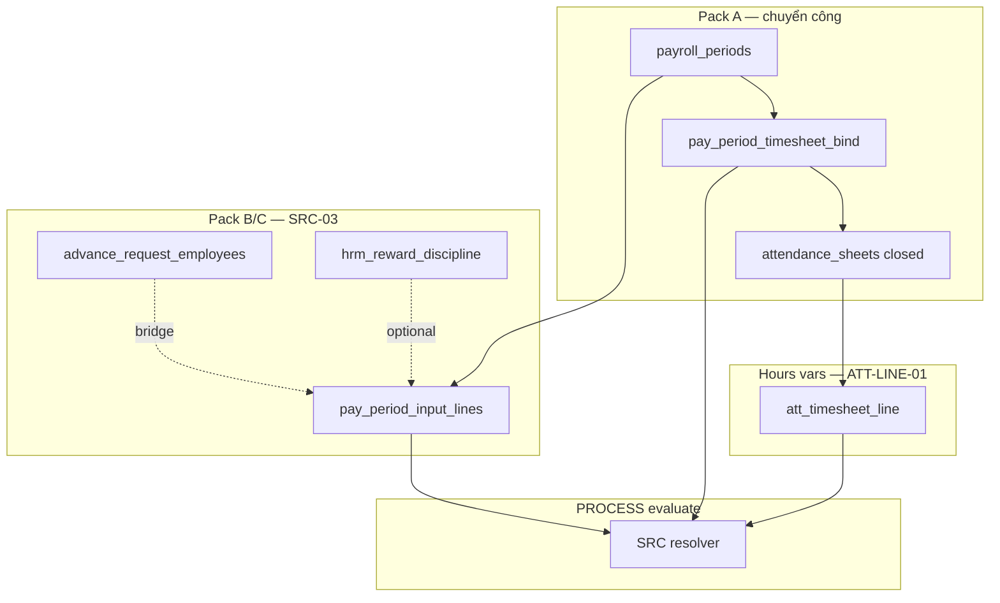

# Evidence — PO-HRM-AMIS-PARITY-PAY-INPUT-PACK-DATA-01

| Field | Value |
|-------|--------|
| **work_item_id** | `PO-HRM-AMIS-PARITY-PAY-INPUT-PACK-DATA-01` |
| **parent** | `PO-HRM-AMIS-PARITY-RESEARCH-01` |
| **from_role** | ba-data |
| **to_role** | pm |
| **lane** | governance |
| **priority** | P0 |
| **change_mode** | ADD |
| **date** | 2026-08-07 |
| **ack_status** | **PASS_TO_PM** |
| **honesty** | `payroll_e2e_ready=false` · **cấm** invent LIVE · **cấm** `apps/**` · U65 |
| **spec_path** | `docs/program/specs/PO-HRM-AMIS-PARITY-PAY-INPUT-PACK-DATA-01.md` |

---

## Mission (closed)

Physical design for **AMIS Step4 input packs**:

1. **Closed / chuyển công reference** — `pay_period_timesheet_bind` (header only)
2. **Thu nhập khác** — `pay_period_input_lines` (`other_income` / `rd_transfer` / `manual`)
3. **Tạm ứng per period+employee** — same table `source_kind=advance` + bridge from `advance_request_employees`

Map **BR-AMIS-PAY-SRC-03**. **Alias ≠ `att_timesheet_line`** — retain ATT-LINE-01 as separate hours SoT.

---

## 0. read_first (ack)

| # | Artifact | Used |
|---|----------|------|
| 1 | `po-hrm-amis-parity-ba-01.md` §2.5 | Step4 packs · SRC-03 draft |
| 2 | `po-hrm-amis-parity-pay-depth-01.md` §3 | SRC-01..05 precedence · AC-PAY-SRC-03 |
| 3 | `PO-HRM-PAYROLL-FORMULA-RUN-GAP-DATA-ATT-LINE-01.md` | **Retained** — `att_timesheet_line` hours bag; **not** bind alias |
| 4 | `po-hrm-amis-parity-pay-data-01.md` §4 | Tier-2 `pay_period_input_lines` sketch — **expanded + CONFIRMED** |
| 5 | Nest READ-ONLY `payroll.service` | `advance_requests*` LIVE · bind table **ABSENT** |
| 6 | `DB_DESIGN_HRM_ENTERPRISE.md` §5.2 | Logical bind — now physical CONFIRM |

---

## 1. Domain map (Step4)



| Pack | Table | Grain | BR |
|------|-------|-------|-----|
| Chuyển công / closed ref | `pay_period_timesheet_bind` | `(period_id, timesheet_header_id)` | SRC-01 bind + ATT-412 |
| Hour columns | `att_timesheet_line` | `(header_id, employee_id)` | SRC-01 vars — **separate spec** |
| Thu nhập khác / tạm ứng | `pay_period_input_lines` | `(period_id, employee_id, component_code, source_kind)` | **SRC-03** |

---

## 2. Physical summary (CONFIRMED ADD)

Full DDL: `docs/program/specs/PO-HRM-AMIS-PARITY-PAY-INPUT-PACK-DATA-01.md`.

### 2.1 `pay_period_timesheet_bind`

- FK target: `attendance_sheets.id` as `timesheet_header_id` — **not** line table.
- Assert closed before bind/process.
- Unbind = soft `archived_at`.
- Replaces probe-only EXISTS as AMIS chuyển công SoT.

### 2.2 `pay_period_input_lines`

- Amount SoT for period-variable components (SRC tier 2).
- `source_kind`: `other_income` | `advance` | `rd_transfer` | `manual` (open string).
- `source_ref` for advance/RD traceability.
- Immutability after period processing.

### 2.3 Advance bridge

- **Keep** batch `advance_requests` / `advance_request_employees` for workflow.
- On paid/approved-for-payroll → upsert input line per `(period, employee, advance component)`.
- PROCESS reads input lines — not live advance join.

---

## 3. BR-AMIS-PAY-SRC-03 (data contract)

| Condition | Action | Fail if |
|-----------|--------|---------|
| Active input line for period-variable `component_code` | Amount from line wins over template (tier 3) and catalog (tier 4) | Silent 0 when pack required |
| No line | Fall through SRC-04 → SRC-05 | N/A |
| Hour/OT vars | **Not** SRC-03 — use ATT-LINE closed line | Confuse bind with hours |

---

## 4. AS-IS vs ADD status

| Entity | AS-IS | After CONFIRM |
|--------|-------|---------------|
| `pay_period_timesheet_bind` | **ABSENT** (service probe) | **PAPER** ADD |
| `pay_period_input_lines` | **ABSENT** | **PAPER** ADD |
| `att_timesheet_line` | **PAPER** (ATT-LINE-01) | **Unchanged** — retain |
| `advance_requests*` | **LIVE** (batch grain) | **KEEP** + bridge |
| `attendance_sheets` closed | **LIVE** header | Bind target |

---

## 5. Validation highlights

| ID | Expected |
|----|----------|
| VAL-INP-BIND-01 | Open sheet bind → **412** |
| VAL-INP-SRC-03 | Pack row → `source_tier=period_input` on payslip line |
| VAL-INP-SRC-03b | Pack ignored → **FAIL** (not silent 0) |
| VAL-INP-ADV-01 | Paid advance → bridged input line |
| scope_parity | Bind list id = get-by-id under `main` rollup |

---

## 6. Traceability (acceptance targets)

| AC | Maps |
|----|------|
| AC-AMIS-ATT-XFER-01 | Bind after close |
| AC-PAY-SRC-03 | Other income / advance pack |
| AC-PAY-SRC-04 | Open sheet block (with bind) |
| AC-AMIS-PAY-PACK-01 | Non-zero line from pack |

---

## completion_report

### Closed

1. **CONFIRMED ADD** `pay_period_timesheet_bind` — chuyển công / closed **header** reference; alias `timesheet_header_id` → `attendance_sheets.id`.
2. **CONFIRMED ADD** `pay_period_input_lines` — thu nhập khác + tạm ứng per `(period, employee, component, source_kind)`.
3. **BR-AMIS-PAY-SRC-03** validation + resolver storage locked; deterministic fail (no silent 0).
4. **Advance bridge** from LIVE `advance_request_employees` — keep batch tables; SRC grain on input lines.
5. **Alias lock:** bind **≠** `att_timesheet_line` — ATT-LINE-01 **retained** unchanged.
6. Unlock path: **sa** F-PAY-INPUT-PACK F.1 → dev-be → qa.
7. Spec + evidence; **no** `apps/**`; `payroll_e2e_ready=false`.

### Residual

| ID | Owner |
|----|-------|
| F-PAY-INPUT-PACK F.1 API | **sa** (after this CONFIRM) |
| ensureSchema + SRC-03 wire | **dev-be** |
| AC-PAY-SRC-03 U65 | **qa** |
| Optional `input_pack_flags` header | P2 defer |
| Sponsor Q1 other-income P0 vs P1 | pm (unchanged from depth-01) |

### Explicit non-claims

- Not LIVE input packs.
- Not `payroll_e2e_ready=true`.
- Not AMIS parity DONE.
- Not ATT-LINE redesign.

---

## next_owner

**pm** → dispatch **sa** `PO-HRM-AMIS-PARITY-PAY-INPUT-PACK-API-01`

## next_dispatch_prompt

```text
work_item_id: PO-HRM-AMIS-PARITY-PAY-INPUT-PACK-API-01
from_role: pm
to_role: sa
lane: governance
priority: P0
parent: PO-HRM-AMIS-PARITY-RESEARCH-01
entry_criteria: PO-HRM-AMIS-PARITY-PAY-INPUT-PACK-DATA-01 CONFIRMED — docs/qa/evidence/po-hrm-amis-parity-pay-input-pack-data-01.md

## Mission
F.1 API for AMIS Step4 input packs:
- F-PAY-PERIOD-BIND-01: CRUD/list pay_period_timesheet_bind (timesheet_header_id → attendance_sheets.id; assert closed; scope_parity)
- F-PAY-PERIOD-INPUT-01: CRUD pay_period_input_lines (other_income|advance|rd_transfer|manual)
- F-PAY-ADV-BRIDGE-01: paid/approved advance → upsert input line (source_ref)
- EXPAND F-PAY-PROCESS-01: SRC resolver tier 2 BR-AMIS-PAY-SRC-03 (cite pay-depth-01 §3)
- Cite ATT-LINE-01 / F-PAY-ATT-CLOSED-01 for hours — do NOT alias bind with att_timesheet_line
- Retain formula F.1 CONFIRMED — no reopen

## read_first
- docs/program/specs/PO-HRM-AMIS-PARITY-PAY-INPUT-PACK-DATA-01.md
- docs/qa/evidence/po-hrm-amis-parity-pay-input-pack-data-01.md
- docs/qa/evidence/po-hrm-amis-parity-pay-depth-01.md §3
- docs/program/specs/PO-HRM-PAYROLL-FORMULA-RUN-GAP-DATA-ATT-LINE-01.md (retain)
- docs/client-delivery/hrm-enterprise-blueprint/API_DESIGN_HRM_ENTERPRISE.md §F-PAY-PERIOD-01 / PROCESS

## Exit
PASS_TO_PM · docs/program/specs/PO-HRM-AMIS-PARITY-PAY-INPUT-PACK-API-01.md + client API DOC-DELTA ADD-only
· next: dev-be ensureSchema bind+input lines after DATA+API CONFIRM
· cấm apps/** · payroll_e2e_ready=false · cấm GĐ1 DnD · AVA · Face · invent LIVE
```

### Parallel (after API CONFIRM)

```text
work_item_id: PO-HRM-AMIS-PARITY-PAY-INPUT-PACK-BE-01
from_role: pm
to_role: dev-be
lane: execution
priority: P0
entry_criteria: PO-HRM-AMIS-PARITY-PAY-INPUT-PACK-API-01 CONFIRMED

## Mission
ensureSchema pay_period_timesheet_bind + pay_period_input_lines; wire bind on period; advance bridge; PROCESS SRC-03 read; scope_parity tests.
Retain att_timesheet_line per ATT-LINE-01 — separate from bind.
spec_read_ack required. payroll_e2e_ready=false.

## Exit
READY_FOR_QA · jest bind closed gate · input line SRC-03 · advance bridge idempotent
```

---

## evidence_path

`docs/qa/evidence/po-hrm-amis-parity-pay-input-pack-data-01.md`

## ack_status

**PASS_TO_PM**
